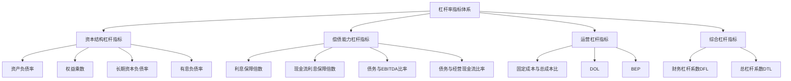

---
{"tags":["财务BP","财务预测","指标预测","杠杆率","资本结构","财务风险"],"aliases":["负债率预测","财务杠杆分析"],"created":"2024-04-24","update":"2024-04-24","dg-publish":true,"permalink":"/知识共享/01_财务BP/01_学习内容/03_财务预测与模型/财务指标预测/杠杆率指标预测/","dgPassFrontmatter":true}
---

# 杠杆率指标预测

## 引言

杠杆率指标是衡量企业财务结构稳健性和偿债风险的关键财务指标，对企业的长期发展和风险管理具有重要意义。作为财务BP的核心工作内容之一，准确预测企业未来杠杆率变化趋势，不仅能够帮助管理层制定合理的资本结构决策，还能提前预警可能的财务风险。本文将系统介绍杠杆率指标预测的方法、技巧和实践案例，为财务BP提供专业支持。

## 杠杆率指标体系

杠杆率指标体系通常包括以下几类指标：

### 1. 资本结构杠杆指标

- **资产负债率** = 总负债 ÷ 总资产
- **权益乘数** = 总资产 ÷ 股东权益
- **长期资本负债率** = 长期负债 ÷ (长期负债 + 股东权益)
- **有息负债率** = 有息负债 ÷ 总资产

### 2. 偿债能力杠杆指标

- **利息保障倍数** = EBIT ÷ 利息费用
- **现金流利息保障倍数** = 经营活动现金流量 ÷ 利息费用
- **债务与EBITDA比率** = 总债务 ÷ EBITDA
- **债务与经营现金流比率** = 总债务 ÷ 经营活动现金流量

### 3. 运营杠杆指标

- **固定成本与总成本比** = 固定成本 ÷ 总成本
- **DOL(度量营业杠杆效应)** = 营业利润变动百分比 ÷ 销售收入变动百分比
- **BEP(损益平衡点)** = 固定成本 ÷ 单位边际贡献

### 4. 综合杠杆指标

- **财务杠杆系数(DFL)** = 净利润变动百分比 ÷ 营业利润变动百分比
- **总杠杆系数(DTL)** = DOL × DFL = 净利润变动百分比 ÷ 销售收入变动百分比

## 杠杆率指标预测方法

### 1. 战略驱动的杠杆率预测

这种方法基于企业战略规划和资本结构目标，将公司长期战略转化为杠杆率目标。

- **战略性资本结构目标设定**：
  - 基于行业特性设定目标杠杆区间
  - 结合企业生命周期阶段确定杠杆调整路径
  - 考虑信用评级目标对杠杆率的要求

- **资本配置计划映射**：
  - 将战略投资计划转化为资金需求
  - 评估内部现金流对投资的覆盖能力
  - 确定外部融资需求及其对杠杆率的影响

### 2. 增长模型驱动的杠杆率预测

该方法将企业增长速度与杠杆率变化建立关联，探索可持续的杠杆水平。

- **可持续增长模型**：
  - g = ROE × (1 - 派息率)
  - 在给定ROE和派息率下，预测不同增长率对杠杆的要求

- **增长与负债关系模型**：
  - 分析增长速度、利润率与负债需求的关系
  - 建立销售增长、资产扩张与杠杆率变化的动态模型
  - 预测不同增长情景下的杠杆率路径

### 3. 现金流驱动的杠杆率预测

通过详细的现金流预测，从根本上预测企业负债水平和杠杆率变化。

- **自由现金流模型**：
  - 预测经营活动现金流入和流出
  - 估计维持性和增长性资本支出
  - 计算自由现金流盈余或缺口

- **债务偿还能力分析**：
  - 预测EBIT、EBITDA对利息的覆盖程度
  - 分析经营现金流对债务本金和利息的覆盖能力
  - 评估再融资风险和债务滚动能力

### 4. 行业对标与回归分析法

基于行业数据和历史关系，建立预测模型。

- **行业对标分析**：
  - 收集行业内不同企业的杠杆指标数据
  - 分析企业在行业中的相对杠杆水平
  - 基于行业趋势预测合理杠杆区间

- **回归分析模型**：
  - 建立杠杆率与关键财务指标的回归模型
  - 利用历史数据识别影响杠杆率的显著因素
  - 基于预测因素值估计未来杠杆率

## 杠杆率指标预测流程

有效的杠杆率预测通常遵循以下流程：

### 1. 企业战略分析

- 分析企业中长期战略规划和投资计划
- 评估战略实施对资本结构的影响
- 确定资本结构的战略目标与限制条件

### 2. 资本需求预测

- 预测营运资金需求变化：销售增长带来的追加资金需求
- 估计固定资产投资规模：新项目、产能扩张、设备更新
- 考虑并购、研发等战略性投资需求

### 3. 内部资金来源预测

- 预测经营活动产生的现金流量
- 估计可变现资产和非核心业务的剥离收入
- 评估现有现金储备的使用计划

### 4. 外部融资需求确定

- 计算资金缺口：资本需求减去内部资金来源
- 确定外部融资需求的规模和时间分布
- 评估不同融资渠道的可行性和成本

### 5. 债务与权益结构规划

- 设计债务与权益的最优组合
- 评估不同债务工具的期限结构和利率风险
- 考虑权益融资的稀释效应和所有权结构影响

### 6. 杠杆指标预测与评估

- 基于融资方案预测各项杠杆指标
- 与行业基准和历史水平进行比较
- 评估预测杠杆水平的财务风险

### 7. 敏感性与压力测试

- 分析关键假设变动对杠杆指标的影响
- 进行极端情景下的杠杆压力测试
- 识别杠杆风险临界点和预警指标

### 8. 制定杠杆优化策略

- 设计短期和长期杠杆调整路径
- 提出资本结构优化建议
- 制定杠杆风险防范措施

## 杠杆率预测案例分析

### 案例一：制造业企业扩产的杠杆率预测

**背景情况**：
某制造企业计划投资10亿元扩建生产线，预计项目建设期2年，投产后年均新增销售收入8亿元，需要评估不同融资方案对企业杠杆率的影响。

**预测方法**：
1. **资本需求分析**：
   - 项目投资时间分布：第一年6亿元，第二年4亿元
   - 项目投产后新增营运资金需求：1.5亿元
   - 现有业务产生的自由现金流：年均3亿元

2. **融资方案设计**：
   | 方案 | 债务融资 | 权益融资 | 内部资金 |
   |-----|---------|---------|---------|
   | 方案A | 7亿元 | 0元 | 3亿元 |
   | 方案B | 5亿元 | 2亿元 | 3亿元 |
   | 方案C | 3亿元 | 4亿元 | 3亿元 |

3. **杠杆指标预测结果**：
   | 杠杆指标 | 当前水平 | 方案A(年底) | 方案B(年底) | 方案C(年底) |
   |---------|---------|------------|------------|------------|
   | 资产负债率 | 45% | 58% | 53% | 48% |
   | 有息负债率 | 30% | 42% | 37% | 32% |
   | 利息保障倍数 | 8.5 | 4.2 | 5.3 | 6.5 |
   | 债务/EBITDA | 2.1 | 3.8 | 3.3 | 2.8 |

**压力测试结果**：
- 在营业收入下降20%的情景下，方案A的利息保障倍数将降至2.8，接近行业警戒线
- 利率上升2个百分点的情况下，方案A的利息保障倍数将降至3.5
- 项目投产延迟6个月的情况下，方案A的资产负债率将超过60%，可能影响信用评级

**杠杆优化建议**：
- 推荐采用方案B，在保持合理财务杠杆的同时，不过度稀释股权
- 建议分期实施项目，将第二期4亿元投资与第一期产出挂钩
- 设立杠杆率预警线：资产负债率不超过55%，利息保障倍数不低于5倍
- 准备应急融资渠道，应对可能的现金流压力

### 案例二：科技企业从成长期迈向成熟期的杠杆策略

**背景情况**：
某科技企业经过快速成长期后，业务增速放缓但现金流转为稳定正向，管理层考虑调整资本结构，优化股东回报。

**杠杆预测方法**：
1. **生命周期杠杆策略分析**：
   - 成长期特点：低负债、高权益融资、保守杠杆策略
   - 成熟期特点：稳定现金流支持更高杠杆，提升股东回报
   - 行业成熟企业杠杆水平对标：资产负债率40-50%

2. **自由现金流预测与杠杆容量分析**：
   - 未来五年预计年均自由现金流：8亿元
   - 基于现金流的最大安全债务容量：40亿元
   - 现有债务水平：15亿元
   - 潜在追加债务空间：25亿元

3. **杠杆调整方案与指标预测**：
   | 杠杆策略 | 描述 | 资产负债率(5年后) | 利息保障倍数(5年后) | 预计ROE影响 |
   |---------|------|-----------------|-------------------|------------|
   | 保守策略 | 维持现有债务水平 | 25% | 15.0 | 基准线 |
   | 适度策略 | 增加15亿债务用于股东回报 | 38% | 9.5 | +3.5% |
   | 激进策略 | 增加25亿债务用于股东回报 | 45% | 7.2 | +5.2% |

**杠杆优化路径建议**：
- 建议采用三年分步实施的适度策略：
  - 第一年：增加5亿债务，实施股票回购
  - 第二年：增加5亿债务，提高股息支付率
  - 第三年：根据业务表现决定是否追加5亿债务
- 债务结构优化：综合运用银行贷款、公司债券，延长债务期限结构
- 同步推进运营效率提升计划，释放更多现金流支持杠杆提升
- 建立季度杠杆监控机制，设定债务/EBITDA不超过2.5倍的硬约束

### 案例三：周期性行业企业的逆周期杠杆管理

**背景情况**：
某大宗商品企业面临行业周期性波动，需要设计适应不同周期阶段的杠杆管理策略。

**杠杆预测方法**：
1. **行业周期与杠杆关系分析**：
   - 收集过去20年行业周期数据
   - 分析行业景气度与最优杠杆水平的关系
   - 识别周期转换的关键指标和拐点特征

2. **逆周期杠杆策略设计**：
   | 周期阶段 | 杠杆策略方向 | 目标资产负债率 | 目标债务/EBITDA |
   |---------|------------|--------------|----------------|
   | 周期顶部 | 显著降低杠杆 | <40% | <1.5 |
   | 周期下行 | 保持低杠杆 | <45% | <2.0 |
   | 周期底部 | 准备提升杠杆 | <50% | <2.5 |
   | 周期上行 | 适度提升杠杆 | <55% | <3.0 |

3. **未来三年杠杆率情景预测**：
   | 情景 | 行业周期判断 | 预测资产负债率 | 预测利息保障倍数 |
   |-----|------------|--------------|----------------|
   | 情景A | 当前处于周期顶部 | 从48%降至42% | 从8.5提升至10.2 |
   | 情景B | 当前处于周期中段 | 保持在48%左右 | 保持在8.5左右 |
   | 情景C | 当前处于周期底部 | 从48%提升至53% | 从8.5降至6.8 |

**逆周期杠杆管理建议**：
- 基于领先指标判断，当前可能处于周期后期，建议实施情景A策略
- 近期关注点：
  - 优先偿还短期高成本债务
  - 延长债务期限结构，锁定低利率
  - 增加现金储备，为可能的行业下行做准备
- 设置清晰的杠杆调整触发点：
  - 当行业价格指数下降20%：启动去杠杆计划
  - 当行业产能利用率低于70%：冻结非必要资本支出
  - 当行业库存周转天数增加30%：准备额外流动性缓冲

## 杠杆率预测的挑战与应对策略

### 1. 宏观环境波动的影响

**挑战**：利率变动、通货膨胀、汇率波动等宏观因素会显著影响杠杆成本和风险。

**应对策略**：
- 建立宏观经济情景分析框架，模拟不同宏观环境下的杠杆表现
- 设计债务组合的利率结构、币种结构和期限结构，分散风险
- 考虑利用衍生金融工具对冲利率和汇率风险
- 保持适度融资灵活性，能在有利的市场时机优化债务结构

### 2. 业务波动对杠杆承受能力的影响

**挑战**：业务的周期性和波动性会导致企业在不同时期的杠杆承受能力显著变化。

**应对策略**：
- 基于历史波动性数据，建立业务波动与安全杠杆水平的关系模型
- 针对高波动性业务设定更保守的目标杠杆水平
- 将固定利率债务与波动性较高的业务单元匹配
- 为高波动业务单元准备更充足的流动性缓冲

### 3. 长期预测的不确定性

**挑战**：长期杠杆预测面临业务环境、技术变革、竞争格局等多重不确定性。

**应对策略**：
- 采用情景规划方法，而非单一预测路径
- 设计阶段性杠杆策略，定期评估和调整
- 识别关键战略假设，设立监测指标
- 保持足够的财务灵活性，能适应战略调整

### 4. 平衡多元利益相关者的需求

**挑战**：股东、债权人、评级机构、管理层对理想杠杆水平的看法可能不同。

**应对策略**：
- 量化不同杠杆水平对各利益相关者的影响
- 建立综合评价框架，平衡短期收益和长期风险
- 设计明确的杠杆政策和治理机制
- 加强与利益相关者的沟通，管理预期

## 杠杆率预测与资本结构优化最佳实践

### 1. 杠杆率预测模型构建

- **动态资产负债表预测**：
  - 构建详细的资产负债表预测模型
  - 直接映射业务决策对资产负债结构的影响
  - 保持模型的灵活性，便于快速情景分析

- **杠杆敏感性分析**：
  - 建立杠杆指标与关键变量的敏感性矩阵
  - 识别对杠杆影响最显著的因素
  - 为关键敏感因素设计监控机制

### 2. 杠杆目标区间管理

- **设定合理的杠杆目标区间**：
  - 考虑行业特性、企业生命周期、风险承受能力
  - 区分正常经营目标与极端情况限制
  - 平衡财务灵活性与资本效率

- **建立杠杆调整机制**：
  - 设定清晰的杠杆调整触发条件
  - 预先设计杠杆过高和过低的应对策略
  - 明确杠杆调整的职责和流程

### 3. 长短期杠杆策略平衡

- **短期杠杆管理**：
  - 关注季节性和短期波动对杠杆的影响
  - 建立短期债务限额和流动性缓冲机制
  - 优化短期融资结构和现金管理

- **长期杠杆策略**：
  - 将杠杆策略与企业长期战略规划对接
  - 设计资本结构路径图，分阶段实施
  - 定期评估杠杆策略与战略的匹配度

## 相关链接

- [[财务BP/学习内容/财务预测与模型/财务报表预测/资产负债表预测方法\|资产负债表预测方法]]
- [[财务BP/学习内容/高级分析方法/风险评估/财务风险识别\|财务风险识别]]
- [[财务BP/学习内容/财务预测与模型/现金流预测/现金流预测的重要性\|现金流预测的重要性]]
- [[财务BP/学习内容/高级分析方法/增长模型/可持续增长率分析\|可持续增长率分析]]
- [[财务BP/学习内容/财务预测与模型/情景分析/情景构建方法\|情景构建方法]]

## 参考文献

1. Brealey, R. A., Myers, S. C., & Allen, F. (2020). *Principles of Corporate Finance*. McGraw-Hill Education.
2. 张维. (2021). 《公司资本结构管理》. 中国财政经济出版社.
3. Damodaran, A. (2022). *Applied Corporate Finance*. John Wiley & Sons.
4. Modigliani, F., & Miller, M. H. (1958). *The Cost of Capital, Corporation Finance and the Theory of Investment*. The American Economic Review, 48(3), 261-297.
5. 刘星. (2023). 《财务杠杆与企业价值》. 经济管理出版社.
6. Graham, J. R., & Harvey, C. R. (2001). *The Theory and Practice of Corporate Finance: Evidence from the Field*. Journal of Financial Economics, 60(2-3), 187-243.
7. 王永贵. (2020). 《企业债务管理实务》. 机械工业出版社. 