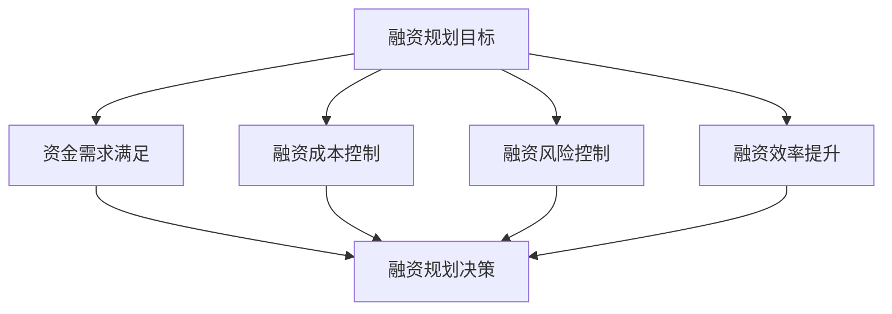

---
{"tags":["财务BP","初创企业","融资管理","财务规划","创业管理"],"aliases":["创业融资规划","初创企业财务规划"],"created":"2024-03-20","dg-publish":true,"permalink":"/知识共享/01_财务BP/01_学习内容/04_行业应用/初创企业BP特点/融资计划与财务规划/","dgPassFrontmatter":true}
---

# 融资计划与财务规划

> [!abstract] 概述
> 本文档详细分析初创企业的融资计划与财务规划特点、方法和实践。融资是初创企业发展的重要支撑，需要科学的融资规划和财务规划方法。通过合理的融资计划和财务规划，可以支持企业快速发展，实现可持续发展。

## 一、融资计划的基本特征

### 1. 融资需求特点
- **资金需求大**：前期投入大
- **融资周期长**：融资过程复杂
- **融资成本高**：融资成本较高
- **融资风险大**：融资风险集中

### 2. 融资规划目标

## 二、融资计划编制方法

### 1. 资金需求预测
- 业务发展预测
- 投资需求预测
- 运营资金预测
- 现金流预测

### 2. 融资方案设计
- 融资方式选择
- 融资规模确定
- 融资时机选择
- 融资成本控制

### 3. 融资风险控制
- 风险识别
- 风险评估
- 风险应对
- 风险监控

### 4. 融资效率提升
- 融资渠道优化
- 融资流程优化
- 融资成本优化
- 融资效率提升

## 三、财务规划内容

### 1. 财务规划流程

### 2. 财务规划重点
- 收入预测
- 成本控制
- 现金流管理
- 投资规划
- 融资规划

### 3. 财务控制
- 预算控制
- 成本控制
- 现金流控制
- 投资控制

## 四、案例分析

### 案例1：互联网创业公司融资
**背景**：某互联网创业公司需要融资。

**融资计划**：
1. 资金需求
   - 产品开发投入
   - 市场推广投入
   - 团队建设投入
   - 运营资金需求

2. 融资方案
   - 天使轮融资
   - A轮融资
   - B轮融资
   - 后续融资

3. 风险控制
   - 融资风险控制
   - 经营风险控制
   - 财务风险控制
   - 市场风险控制

**实施效果**：
- 融资成功
- 资金需求满足
- 风险控制有效
- 经营状况改善

### 案例2：科技创业公司融资
**背景**：某科技创业公司需要融资。

**融资计划**：
1. 资金需求
   - 研发投入
   - 市场拓展
   - 团队建设
   - 运营资金

2. 融资方案
   - 种子轮融资
   - 天使轮融资
   - A轮融资
   - 后续融资

3. 风险控制
   - 技术风险控制
   - 市场风险控制
   - 财务风险控制
   - 团队风险控制

**实施效果**：
- 融资成功
- 资金需求满足
- 风险控制有效
- 经营状况改善

## 五、融资风险与应对

### 1. 常见风险
- 融资失败风险
- 融资成本风险
- 融资条件风险
- 融资时机风险

### 2. 风险应对策略
- 融资方案优化
- 融资渠道拓展
- 融资成本控制
- 融资时机把握

## 六、最佳实践建议

1. **融资规划**
   - 科学预测资金需求
   - 合理设计融资方案
   - 有效控制融资风险
   - 提升融资效率

2. **财务规划**
   - 科学预测收入
   - 有效控制成本
   - 加强现金流管理
   - 优化投资规划

3. **风险控制**
   - 加强风险识别
   - 科学风险评估
   - 制定风险应对措施
   - 建立风险监控体系

## 相关链接

- [[知识共享/01_财务BP/01_学习内容/04_行业应用/初创企业BP特点/初创期BP的特殊挑战\|初创期BP的特殊挑战]]
- [[知识共享/01_财务BP/01_学习内容/04_行业应用/初创企业BP特点/现金消耗率管理\|现金消耗率管理]]
- [[知识共享/01_财务BP/01_学习内容/04_行业应用/初创企业BP特点/初创企业BP案例分析\|初创企业BP案例分析]]
- [[预算编制基础\|预算编制基础]]
- [[现金流预测\|现金流预测]]

## 参考文献

1. Blank, S. (2013). *The Four Steps to the Epiphany: Successful Strategies for Products that Win*. K&S Ranch.
2. Ries, E. (2011). *The Lean Startup: How Today's Entrepreneurs Use Continuous Innovation to Create Radically Successful Businesses*. Crown Business.
3. 《初创企业融资规划研究》，张明，管理科学学报，2020.
4. 《初创企业财务规划实践》，李强，财务与会计，2021.
5. 《初创企业融资管理最佳实践》，王华，商业经济研究，2019. 