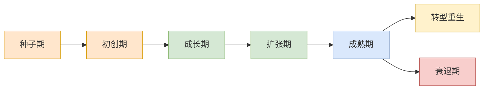

---
{"tags":["财务BP","增长分析","阶段规划","企业生命周期"],"aliases":["成长周期财务规划","不同发展阶段的BP"],"created":"2023-11-17","dg-publish":true,"permalink":"/知识共享/01_财务BP/01_学习内容/05_高级分析方法/增长模型/增长阶段的财务规划差异/","dgPassFrontmatter":true}
---

# 增长阶段的财务规划差异

## 概述
企业在不同成长阶段面临的战略重点、资源约束和风险特征各不相同，财务BP必须适应这些差异，采取相应的规划方法和侧重点。本文系统分析企业生命周期各阶段的财务特征、规划要点、预测方法和资源配置策略，帮助财务BP专业人员针对企业发展阶段制定匹配的财务规划方案。

## 企业生命周期与增长阶段

### 企业生命周期模型
企业生命周期是企业从创立到成熟再到转型或衰退的发展历程，不同阶段表现出明显的财务特征差异，需要差异化的财务规划方法。

### 各阶段基本特征

| 发展阶段 | 业务特征 | 组织特征 | 财务特征 | 主要目标 |
|---------|---------|---------|---------|---------|
| 种子期 | 概念验证阶段 | 创始人团队为主 | 持续现金流出 | 产品可行性验证 |
| 初创期 | 产品推向市场 | 初步团队形成 | 高投入低收入 | 获得市场认可 |
| 成长期 | 市场接受度提升 | 功能型组织结构 | 收入快速增长 | 建立市场地位 |
| 扩张期 | 业务规模扩大 | 分部门管理 | 规模效应显现 | 扩大市场份额 |
| 成熟期 | 业务稳定发展 | 完善组织结构 | 稳定现金流 | 优化效率和利润 |
| 转型期 | 新增长点探索 | 创新组织建设 | 投资与回报并存 | 培育新增长曲线 |
| 衰退期 | 市场份额下降 | 组织收缩 | 现金流减少 | 成本控制和重组 |

## 种子期与初创期财务规划

### 财务特征与挑战
1. **持续现金流出**：收入极少或为零，持续消耗资金
2. **高不确定性**：商业模式和产品市场匹配度尚未验证
3. **资源极度有限**：资金、人力和时间资源受严格约束
4. **快速迭代**：频繁的产品和战略调整

### 规划重点与方法
1. **现金流规划**：
   - 燃烧率计算与监控
   - 现金流耗尽时间点预测
   - 生存期规划和延长策略
   - 灵活的零基预算方法

2. **融资规划**：
   - 融资额度与时机规划
   - 估值预期与股权结构规划
   - 融资替代方案准备
   - 投资人期望管理

3. **精益支出管理**：
   - 固定成本最小化策略
   - 外包与内部资源平衡
   - 可变成本结构设计
   - 资源优先级排序方法

4. **敏捷预测方法**：
   - 短周期（月度/季度）预测
   - 情景分析（最佳/基本/最差）
   - 关键假设快速验证机制
   - 里程碑导向的阶段性预算

### 关键绩效指标
- 现金消耗率(Burn Rate)
- 资金可支撑时间(Runway)
- 客户获取成本(CAC)
- 单位经济性指标(Unit Economics)
- 产品市场匹配度指标(PMF Metrics)

### 决策支持工具
- 现金流预测模型
- 融资需求计算器
- 单位经济分析工具
- 敏捷预算跟踪系统

## 成长期财务规划

### 财务特征与挑战
1. **收入快速增长**：实现产品市场匹配后收入增长加速
2. **成本结构转变**：从固定成本主导向更均衡结构转变
3. **规模不经济**：快速增长带来效率和协调挑战
4. **资金需求增加**：支持扩张的资金需求大幅提升

### 规划重点与方法
1. **增长投资规划**：
   - 增长渠道投资配置
   - 营销支出效率评估
   - 团队扩张节奏规划
   - 基础设施扩建计划

2. **收入预测方法**：
   - 增长率驱动预测
   - 销售漏斗转化模型
   - 客户细分增长分析
   - 产品/服务组合预测

3. **成本扩张管理**：
   - 人员扩张成本控制
   - 渠道扩张成本预算
   - 运营效率监控机制
   - 规模化成本优势规划

4. **财务结构优化**：
   - 毛利率目标与路径
   - 再投资率确定
   - 运营效率指标设定
   - 现金转换周期管理

### 关键绩效指标
- 收入增长率
- 客户获取成本回收期
- 客户生命周期价值(LTV)
- 毛利率
- 再投资率
- 市场份额增长率

### 决策支持工具
- 增长投资回报模型
- 销售漏斗预测工具
- 营销效率分析模板
- 人力资源扩张成本模拟器

## 扩张期财务规划

### 财务特征与挑战
1. **多方面扩张**：产品线扩张、地域扩张、渠道扩张同时进行
2. **组织复杂性增加**：部门增多，管理层级增加
3. **规模经济出现**：固定成本分摊改善，但组织效率可能下降
4. **资本需求多样化**：股权融资、债务融资、内部现金流并用

### 规划重点与方法
1. **多维度扩张规划**：
   - 产品线扩张投资回报分析
   - 地域扩张优先级排序
   - 渠道扩张成本效益评估
   - 客户群体拓展策略

2. **组织扩张预算**：
   - 部门预算体系建立
   - 分权与集权平衡
   - 内部转移定价机制
   - 成本分摊方法设计

3. **资本结构规划**：
   - 股权融资与债务融资平衡
   - 融资成本优化
   - 资本配置优先级
   - 投资回报周期管理

4. **风险管理预算**：
   - 扩张风险识别与量化
   - 风险缓释措施成本
   - 应急资金规划
   - 保险与对冲策略

### 关键绩效指标
- 多元化收入占比
- 新市场/新产品贡献率
- 规模效应指标
- 资本回报率(ROIC)
- 加权平均资本成本(WACC)
- 区域/部门绩效差异

### 决策支持工具
- 多维度扩张情景分析
- 资本配置优化模型
- 部门预算协调系统
- 扩张风险评估矩阵

## 成熟期财务规划

### 财务特征与挑战
1. **增长放缓**：收入增长率趋于市场平均水平
2. **利润与效率导向**：从规模增长转向利润率提升
3. **现金流充裕**：经营活动产生稳定现金流
4. **股东回报要求提高**：股息期望与股票回购压力增加

### 规划重点与方法
1. **效率优化规划**：
   - 成本结构优化
   - 流程效率提升
   - 资产利用率改善
   - 精益管理实施

2. **价值释放规划**：
   - 股东回报政策
   - 并购整合策略
   - 非核心资产处置
   - 资本结构优化

3. **持续增长探索**：
   - 创新投资组合
   - 新增长曲线培育
   - 数字化转型预算
   - 多元化战略评估

4. **弹性预算方法**：
   - 零基预算与传统预算结合
   - 长期规划与年度预算结合
   - 战略预算与运营预算分离
   - 滚动预测机制

### 关键绩效指标
- 利润率(毛利率、营业利润率、净利率)
- 资产回报率(ROA)
- 股本回报率(ROE)
- 每股收益(EPS)
- 自由现金流(FCF)
- 经济增加值(EVA)

### 决策支持工具
- 价值驱动因素分析
- 股东价值评估模型
- 资本配置效率评估
- 战略投资组合管理工具

## 转型期财务规划

### 财务特征与挑战
1. **双轨并行**：维持核心业务稳定同时培育新业务
2. **投资重心转移**：向新技术、新渠道、新模式倾斜
3. **财务压力增加**：新业务投入期与核心业务收益下滑可能重叠
4. **评估标准转变**：传统财务指标难以评价创新业务

### 规划重点与方法
1. **双轨预算体系**：
   - 核心业务效率预算
   - 创新业务投资预算
   - 资源再分配机制
   - 过渡期平衡策略

2. **创新投资组合规划**：
   - 创新项目分级投资
   - 阶段性里程碑评估
   - 快速试错资源配置
   - 创新加速器预算

3. **转型资金来源规划**：
   - 核心业务现金流贡献
   - 非核心业务剥离计划
   - 转型专项融资方案
   - 战略合作资源引入

4. **转型绩效评估框架**：
   - 过程指标与结果指标结合
   - 短期业绩与长期价值平衡
   - 财务指标与非财务指标互补
   - 试点与规模化阶段差异化评估

### 关键绩效指标
- 创新收入占比
- 新业务增长率
- 创新投资回报率
- 转型里程碑完成度
- 新旧业务协同效益
- 转型风险缓释效果

### 决策支持工具
- 创新项目评估模型
- 双轨预算管理系统
- 转型资源优化配置工具
- 创新组合风险评估矩阵

## 衰退期财务规划

### 财务特征与挑战
1. **收入持续下滑**：核心产品或服务需求萎缩
2. **利润率压力**：价格竞争与固定成本分摊恶化
3. **现金流紧张**：经营活动现金流减少，可能转为负值
4. **资产价值下降**：有形与无形资产可能面临减值

### 规划重点与方法
1. **成本结构重组**：
   - 固定成本转变为可变成本
   - 规模调整与效率提升
   - 长期成本承诺重新谈判
   - 零基预算彻底实施

2. **现金流保护规划**：
   - 营运资金优化计划
   - 应收账款加速回收
   - 非必要资本支出延迟
   - 库存优化与资产变现

3. **业务组合调整**：
   - 盈利业务单元保护
   - 亏损业务处置或重组
   - 核心与非核心业务区分
   - 残值最大化策略

4. **重振战略财务规划**：
   - 重组成本与收益评估
   - 债务重组可行性分析
   - 核心竞争力再投资计划
   - 战略转型资金需求评估

### 关键绩效指标
- 自由现金流
- 净债务比率
- 营运资金周转率
- 单位贡献利润
- 业务单元盈亏分析
- 资产减值指标

### 决策支持工具
- 现金流压力测试模型
- 业务单元估值工具
- 重组成本效益分析
- 生存期延长计算器

## 阶段差异的具体表现与应对

### 预测方法差异
各增长阶段适用的预测方法存在显著差异：

1. **种子期与初创期**：
   - 自下而上的详细预测
   - 里程碑驱动的情景预测
   - 生存期导向的现金流预测
   - 数据点少，依赖假设验证

2. **成长期与扩张期**：
   - 驱动因素模型预测
   - 历史数据外推与调整
   - 细分市场组合预测
   - 竞争分析与市场份额模型

3. **成熟期**：
   - 时间序列分析与季节性调整
   - 市场增长率加调整因素
   - 精细的产品生命周期模型
   - 稳定业务的参数化预测

4. **转型期与衰退期**：
   - 双曲线预测模型
   - 结构断点调整预测
   - 价值链重组模型
   - 基于新旧业务权重的加权预测

### 资源配置差异
不同阶段的资源配置重点和方法：

1. **种子期与初创期**：
   - 围绕产品市场匹配分配资源
   - 短周期、高弹性的资源配置
   - 现金保护与关键增长点平衡
   - 优先级高度集中

2. **成长期与扩张期**：
   - 增长渠道优先资源分配
   - 扩张能力建设投入加大
   - 规模效应机会获取
   - 多元化资源分散策略

3. **成熟期**：
   - 效率优化优先资源分配
   - 回报率导向的投资决策
   - 股东回报与再投资平衡
   - 系统性资本配置流程

4. **转型期与衰退期**：
   - 核心保护与创新投资并重
   - 资源从衰退领域向增长领域转移
   - 基于战略重要性的资源保护
   - 非核心资产处置释放资源

### 风险管理差异
各阶段风险特征与管理方法：

1. **种子期与初创期**：
   - 生存风险为主要关注点
   - 快速试错降低系统性风险
   - 资金耗尽为核心风险
   - 灵活性是最佳风险对冲

2. **成长期与扩张期**：
   - 执行风险与扩张风险并重
   - 建立风险控制系统
   - 增长过快与过慢的平衡
   - 阶段性风险评估机制

3. **成熟期**：
   - 系统性风险管理体系
   - 市场竞争与替代风险
   - 运营风险精细管理
   - 合规与声誉风险重视

4. **转型期与衰退期**：
   - 转型失败风险
   - 业务中断风险管理
   - 人才流失风险应对
   - 价值保全策略实施

## 案例分析

### 案例一：科技创业企业从初创期到成长期的财务规划转变

**背景**：一家SaaS平台初创企业在种子轮和A轮融资后产品获得市场认可，进入成长阶段，财务规划面临重大调整。

**初创期财务规划特点**：
1. 现金流规划：
   - 监控月度现金消耗率，保持12-18个月生存期
   - 最小可行产品研发为主要支出
   - 融资前降低燃烧率的紧急预案

2. 预测方法：
   - 基于产品开发里程碑的支出预测
   - 早期客户获取的单位经济测试
   - 月度滚动预测，高度灵活调整

3. 资源配置：
   - 90%资源集中在核心产品开发
   - 创始团队全员参与产品迭代和销售
   - 外包非核心功能，降低固定成本

**成长期财务规划转变**：
1. 增长投资规划：
   - 建立销售团队扩张计划，预测人均产出
   - 制定营销渠道测试与扩展预算
   - 客户支持团队扩张匹配客户增长曲线

2. 预测方法转变：
   - 构建销售漏斗转化模型，预测收入增长
   - 建立客户获取成本与生命周期价值模型
   - 按客户细分和产品组合进行矩阵预测

3. 资源配置调整：
   - 研发、销售、客户支持三大部门均衡配置
   - 建立基于客户获取成本回收期的营销预算
   - 设立产品扩展与平台基础设施并行投资

**关键财务指标转变**：
- 初创期：燃烧率、资金可支撑期、单位客户获取成本
- 成长期：收入增长率、毛利率、续约率、客户扩展收入

**执行结果**：企业成功实现了财务规划转型，增长率达到150%，同时将毛利率从50%提升到65%，为下一轮融资奠定基础。

### 案例二：制造企业从成熟期进入转型期的财务规划重构

**背景**：一家传统制造企业面临市场饱和和新兴替代技术挑战，需要重构财务规划以支持数字化转型和新业务培育。

**成熟期财务规划特点**：
1. 效率优化导向：
   - 年度成本降低计划，注重运营效率
   - 资产利用率优化，减少闲置产能
   - 标准化的预算控制流程

2. 预测方法：
   - 基于历史数据的时间序列预测
   - 行业周期调整的销量预测
   - 产品组合和价格规划为主要变量

3. 股东回报导向：
   - 稳定的股息支付政策
   - 资本支出控制在折旧范围内
   - 现金流盈余用于股票回购

**转型期财务规划重构**：
1. 双轨预算体系建立：
   - 核心业务效率预算与创新业务投资预算分离
   - 传统业务降本目标与数字化投资计划并行
   - 建立从传统到创新业务的资源迁移机制

2. 预测方法转变：
   - 传统业务采用保守衰减曲线预测
   - 新业务采用多情景预测和里程碑评估
   - 合并预测考虑新旧业务此消彼长关系

3. 创新投资组合规划：
   - 创新项目分级(探索/验证/扩展/规模化)
   - 不同阶段项目采用差异化评估标准
   - 设立创新加速器预算，支持内部创业

**关键财务指标转变**：
- 成熟期：营业利润率、资产回报率、每股收益
- 转型期：创新收入占比、新业务毛利率、转型项目投资回报率

**执行结果**：三年内，企业成功将20%的资源从传统业务转向新业务领域，新业务收入占比从5%提升至25%，整体利润率保持稳定，市场估值提升30%。

### 案例三：零售企业从扩张期到衰退期的财务规划应对

**背景**：一家传统零售连锁企业在电商冲击下业绩持续下滑，从扩张期进入衰退期，需要调整财务规划以度过转型危机。

**扩张期财务规划特点**：
1. 多维度扩张预算：
   - 新店开设计划与投资回报分析
   - 地域扩张与市场渗透策略
   - 产品线扩展与库存规划

2. 预测方法：
   - 同店销售增长与新店贡献组合预测
   - 季节性调整与促销效应模型
   - 基于消费者行为分析的品类预测

3. 资本结构规划：
   - 优化债务融资成本支持扩张
   - 商业地产投资与租赁组合策略
   - 供应商融资优化付款周期

**衰退期财务规划调整**：
1. 成本结构重组：
   - 关闭低效门店计划，优化门店网络
   - 总部人员精简，建立精益组织
   - 引入零基预算，全面审视各项支出

2. 现金流保护规划：
   - 库存周转加速计划，减少积压
   - 与业主重新谈判租约条款
   - 延长供应商付款期限，改善现金流

3. 业务组合重构：
   - 识别并保护高利润品类和门店
   - 发展线上渠道与全渠道协同
   - 门店空间优化与体验升级

**关键财务指标转变**：
- 扩张期：销售增长率、单店投资回报率、市场份额
- 衰退期：自由现金流、库存周转率、租金占销售比

**执行结果**：企业两年内关闭30%低效门店，降低运营成本25%，同时线上销售增长200%，现金流转为正值，为数字化转型创造了空间。

## 阶段转换的管理与应对

### 阶段转换识别信号
成功识别企业所处增长阶段的关键信号：

1. **财务信号**：
   - 增长率变化趋势
   - 利润率结构转变
   - 现金流模式变化
   - 资本回报率转折点

2. **市场信号**：
   - 客户获取难度变化
   - 市场饱和度指标
   - 竞争格局转变
   - 产品生命周期位置

3. **组织信号**：
   - 组织结构复杂化
   - 决策流程变化
   - 创新能力转变
   - 人才需求类型变化

### 阶段过渡期规划策略
平稳度过阶段转换期的财务规划策略：

1. **财务缓冲策略**：
   - 建立过渡期现金储备
   - 保持融资渠道开放
   - 资本支出弹性预留
   - 成本结构灵活性提升

2. **渐进调整方法**：
   - 新旧预算方法并行过渡
   - 分部门分阶段实施新方法
   - 建立反馈与调整机制
   - 关键指标新旧对照分析

3. **利益相关方管理**：
   - 预期管理与沟通策略
   - 分析师与投资者教育
   - 内部绩效评估系统调整
   - 股东回报预期重塑

### 组织能力建设
支持阶段转换的组织能力建设：

1. **财务团队能力转型**：
   - 从交易处理到决策支持
   - 从数据记录到业务分析
   - 从控制导向到价值创造
   - 从静态预算到动态规划

2. **系统与工具升级**：
   - 预测分析工具升级
   - 财务建模能力提升
   - 数据分析平台建设
   - 敏捷规划系统部署

3. **跨部门协作机制**：
   - 业务财务伙伴关系建立
   - 战略-财务-运营联动机制
   - 财务决策前置参与
   - 价值创造共识形成

## 最佳实践建议

1. **定期评估企业所处阶段**：
   - 至少每年一次全面评估企业所处发展阶段
   - 识别阶段转换的早期信号
   - 预判下一阶段财务特征变化

2. **建立阶段适配的规划方法库**：
   - 针对不同阶段预先开发适用的规划方法
   - 培养团队掌握不同阶段的规划技能
   - 建立方法转换的平滑机制

3. **保持规划弹性与适应性**：
   - 设计具有弹性的预算结构
   - 建立情景规划的常态机制
   - 预留战略机动资源
   - 定期挑战核心假设

4. **聚焦阶段关键成功因素**：
   - 识别当前阶段最关键的财务目标
   - 围绕关键成功因素设计指标体系
   - 资源配置优先满足关键需求
   - 绩效评估聚焦关键驱动因素

5. **平衡短期业绩与阶段转换准备**：
   - 确保当前阶段绩效同时为下一阶段做准备
   - 提前投入建设下一阶段所需能力
   - 实施过渡期风险管理措施
   - 建立阶段过渡的路线图

## 相关链接
- [[知识共享/01_财务BP/01_学习内容/05_高级分析方法/增长模型/增长驱动因素识别\|增长驱动因素识别]]
- [[知识共享/01_财务BP/01_学习内容/05_高级分析方法/增长模型/增长瓶颈分析\|增长瓶颈分析]]
- [[知识共享/01_财务BP/01_学习内容/05_高级分析方法/增长模型/可持续增长率分析\|可持续增长率分析]]
- [[01_财务BP/01_学习内容/财务BP基础概念/理论基础/企业生命周期理论\|企业生命周期理论]]
- [[知识共享/01_财务BP/01_学习内容/01_财务BP基础概念/BP与企业战略/财务BP与企业战略的关系\|财务BP与企业战略的关系]]
- [[01_财务BP/01_学习内容/高级分析方法/资金需求分析/资金需求分析\|资金需求分析]]

## 参考文献
1. Churchill, N. C., & Lewis, V. L. (1983). *The Five Stages of Small Business Growth*. Harvard Business Review.
2. Greiner, L. E. (1998). *Evolution and Revolution as Organizations Grow*. Harvard Business Review.
3. Adizes, I. (2004). *Managing Corporate Lifecycles*. The Adizes Institute Publishing.
4. Van der Erve, M. (2013). *A New Leadership Ethos: The Ability to Predict*. Bloomsbury Publishing.
5. Damodaran, A. (2010). *Applied Corporate Finance*. John Wiley & Sons.
6. 《企业生命周期与财务战略》，李心合，2017年
7. 《成长型企业财务管理》，刘俊彦，2019年
8. 《企业转型期的财务规划与控制》，王志强，2020年 