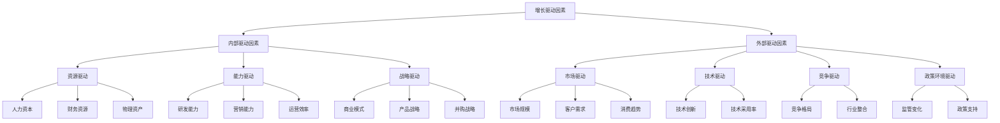

---
{"tags":["财务BP","增长分析","驱动因素","战略规划"],"aliases":["增长动力分析","增长因素辨识"],"created":"2023-11-17","dg-publish":true,"permalink":"/知识共享/01_财务BP/01_学习内容/05_高级分析方法/增长模型/增长驱动因素识别/","dgPassFrontmatter":true}
---

# 增长驱动因素识别

## 概述
增长驱动因素识别是财务BP中科学预测未来发展路径的关键环节。本文系统介绍企业增长的核心驱动因素分类、识别方法、定量分析技术以及在不同行业的应用特点，帮助财务BP专业人员准确把握企业增长的内外部动力源泉，为战略规划和财务预测提供坚实基础。

## 增长驱动因素的基本概念

### 增长驱动因素定义
增长驱动因素是指能够直接或间接推动企业收入、利润或价值增长的关键要素，包括内部资源要素和外部市场环境因素。识别这些因素有助于企业聚焦资源投入，提高增长效率。

### 驱动因素分类框架

## 驱动因素识别方法

### 定性识别方法
#### 战略分析框架
1. **SWOT分析**：识别企业在增长方面的优势、劣势、机会和威胁
2. **波特五力分析**：评估行业结构对增长的影响
3. **价值链分析**：识别价值创造环节中的增长点
4. **业务画布分析**：审视商业模式各要素的增长潜力

#### 专家判断方法
1. **德尔菲法**：通过多轮专家问卷收集对增长驱动因素的判断
2. **专家访谈**：与行业专家和企业高管深入讨论
3. **专家研讨会**：组织跨部门专家共同识别关键驱动因素

#### 标杆分析方法
1. **行业标杆比较**：分析行业领先企业的增长源泉
2. **历史增长分解**：研究历史上企业成功增长的关键因素
3. **成功案例剖析**：深入分析增长成功企业的共性因素

### 定量识别方法
#### 统计分析技术
1. **相关性分析**：计算潜在驱动因素与增长指标间的相关系数
2. **回归分析**：建立增长指标与驱动因素的数学关系模型
3. **主成分分析**：从众多因素中提取最具解释力的主成分
4. **因子分析**：识别影响增长的潜在共同因子

#### 增长分解技术
1. **收入分解法**：将收入增长分解为数量增长和价格增长
2. **客户价值分解**：将增长分解为客户数量、购买频率和客单价
3. **地域分解法**：将增长分解为不同地区市场的贡献
4. **产品线分解**：分析不同产品线对总体增长的贡献

#### 先进分析方法
1. **机器学习算法**：使用随机森林、梯度提升等算法识别重要特征
2. **数据挖掘技术**：从大量数据中发现增长模式和规律
3. **预测性分析**：建立预测模型，验证驱动因素的预测能力

## 核心增长驱动因素分析

### 市场扩张驱动因素
1. **市场渗透率**：现有市场中的份额提升
   - 测量指标：市场占有率、客户覆盖率
   - 影响因素：品牌认知度、分销渠道、价格竞争力

2. **市场开发**：现有产品进入新市场
   - 测量指标：新市场收入占比、地域扩张速度
   - 影响因素：市场准入条件、本地化能力、渠道建设

3. **产品开发**：向现有市场推出新产品
   - 测量指标：新产品收入占比、新品上市速度
   - 影响因素：研发投入、创新能力、产品上市效率

4. **多元化**：新产品进入新市场
   - 测量指标：多元化收入占比、多元化成功率
   - 影响因素：战略协同性、资源整合能力、多元化管理能力

### 客户驱动因素
1. **客户获取**：新客户增长
   - 测量指标：新客户数量、客户获取成本(CAC)
   - 影响因素：市场营销效率、销售转化率、品牌吸引力

2. **客户留存**：现有客户保持
   - 测量指标：客户留存率、客户流失率
   - 影响因素：产品质量、客户服务、切换成本

3. **客户扩张**：现有客户价值提升
   - 测量指标：客单价、交叉销售率、客户生命周期价值
   - 影响因素：产品组合、客户关系管理、增值服务

4. **客户推荐**：口碑传播推动增长
   - 测量指标：净推荐值(NPS)、推荐转化率
   - 影响因素：客户满意度、品牌声誉、推荐激励机制

### 运营效率驱动因素
1. **规模经济**：单位成本随规模扩大而下降
   - 测量指标：单位成本、固定成本分摊
   - 影响因素：产能利用率、批量效应、采购规模

2. **流程优化**：提高业务流程效率
   - 测量指标：周转时间、资源利用率、质量指标
   - 影响因素：工艺改进、自动化水平、持续改进文化

3. **资源效率**：提高资源使用效率
   - 测量指标：资产周转率、人均产出、能源效率
   - 影响因素：精益管理、资源配置优化、技术升级

### 创新驱动因素
1. **产品创新**：开发新产品或改进产品
   - 测量指标：创新产品收入占比、专利数量
   - 影响因素：研发投入、创新文化、市场反馈机制

2. **流程创新**：改进生产或服务流程
   - 测量指标：流程效率提升率、自动化水平
   - 影响因素：技术应用、流程再造、创新激励

3. **商业模式创新**：创新价值创造与获取方式
   - 测量指标：商业模式转型收益、收入结构变化
   - 影响因素：市场洞察、战略灵活性、组织适应能力

4. **技术创新**：采用新技术推动增长
   - 测量指标：技术领先指数、数字化转型程度
   - 影响因素：技术投资、技术人才、技术整合能力

## 行业特定驱动因素分析

### 制造业增长驱动因素
1. **产能扩张**：通过增加产能实现增长
   - 关键指标：产能利用率、产能扩张投资回报率
   - 分析方法：产能与需求匹配分析、投资效益分析

2. **供应链优化**：通过优化供应链提升竞争力
   - 关键指标：库存周转率、供应链成本率
   - 分析方法：供应链效率分析、供应商绩效评估

3. **产品组合优化**：调整产品结构提高盈利能力
   - 关键指标：产品组合利润率、高价值产品占比
   - 分析方法：产品生命周期分析、产品组合矩阵

### 科技企业增长驱动因素
1. **技术突破**：通过技术创新实现跨越式增长
   - 关键指标：研发投入回报率、技术领先指数
   - 分析方法：技术路线图分析、专利分析

2. **网络效应**：用户基数增长带来价值指数级提升
   - 关键指标：用户增长率、用户互动率
   - 分析方法：网络价值分析、用户行为分析

3. **平台拓展**：通过扩展平台边界增加收入来源
   - 关键指标：平台服务多样性、平台收入结构
   - 分析方法：平台战略分析、生态系统健康度评估

### 零售业增长驱动因素
1. **门店扩张**：通过增加销售点实现增长
   - 关键指标：同店销售增长、新店成功率
   - 分析方法：选址分析、门店绩效对比

2. **渠道整合**：全渠道战略推动增长
   - 关键指标：全渠道转化率、渠道协同效率
   - 分析方法：渠道贡献分析、客户旅程分析

3. **客户体验改善**：通过提升体验驱动复购和推荐
   - 关键指标：客户满意度、复购率
   - 分析方法：客户体验地图、关键触点分析

## 驱动因素量化与预测模型

### 驱动因素量化方法
1. **关键绩效指标(KPI)设计**
   - 确定反映增长驱动因素的具体指标
   - 建立指标计算方法和数据来源
   - 设定目标值和警戒阈值

2. **驱动树模型构建**
   - 将财务成果分解为驱动因素树
   - 建立各层级指标间的数学关系
   - 量化各驱动因素对最终结果的贡献度

3. **敏感性分析**
   - 评估各驱动因素变化对增长的影响程度
   - 识别高敏感度驱动因素
   - 建立敏感性矩阵指导资源分配

### 增长预测模型
1. **驱动因素回归模型**
   - 基于历史数据建立驱动因素与增长的回归方程
   - 利用驱动因素预测值预测未来增长
   - 定期校准模型参数确保准确性

2. **情景规划模型**
   - 设定驱动因素的不同发展情景
   - 评估不同情景下的增长轨迹
   - 制定针对不同情景的应对策略

3. **模拟预测模型**
   - 建立驱动因素间的复杂互动关系模型
   - 通过蒙特卡洛模拟生成概率分布
   - 评估增长预测的置信区间

## 案例分析

### 案例一：制造企业增长驱动因素分析

**背景**：某机械制造企业过去三年收入增长停滞，需要识别关键增长驱动因素以制定新一轮增长战略。

**分析过程**：
1. **驱动因素初步识别**：
   - 内部研讨会确定可能的增长驱动因素
   - 行业对标分析识别差距与机会
   - 客户访谈收集市场需求变化信息

2. **定量分析**：
   - 销售数据分解：按产品线、客户类型、地区分析增长贡献
   - 相关性分析：分析市场份额、产品创新率、产能利用率等因素与收入增长的相关性
   - 回归模型：建立多因素回归模型评估各因素影响权重

3. **驱动因素验证**：
   - 关键驱动因素确定：产品组合优化、新兴市场拓展、服务收入增长
   - 敏感性测试：验证这些因素对增长的影响程度
   - 情景模拟：在不同假设下测试增长路径

**应用结果**：
1. 产品组合调整：减少低利润传统产品，增加高价值智能产品占比，提高整体利润率
2. 市场拓展战略：集中资源进入三个高增长新兴市场，设立本地化团队
3. 服务模式转型：从单纯设备销售向"产品+服务"模式转变，建立服务收入体系

**执行效果**：实施战略18个月后，企业实现15%的收入增长，利润增长22%，产品结构显著优化，服务收入占比从5%提升至18%。

### 案例二：科技创业企业增长驱动因素识别

**背景**：一家SaaS企业成立3年，在种子期和A轮融资后需要识别核心增长驱动因素，为B轮融资和快速扩张做准备。

**分析过程**：
1. **历史增长分解**：
   - 用户增长分析：新用户获取渠道效果对比
   - 收入分解：按客户类型、产品模块、定价层级分析
   - 单位经济分析：客户获取成本、客户生命周期价值等指标

2. **驱动因素分析**：
   - 产品采用驱动因素：功能完整性、易用性、集成能力
   - 客户保留驱动因素：产品价值实现、客户服务质量、切换成本
   - 扩展收入驱动因素：产品升级路径、交叉销售机会、价格策略

3. **增长模型构建**：
   - 创建增长预测模型，识别最具杠杆效应的驱动因素
   - 通过A/B测试验证关键假设
   - 建立驱动因素监控仪表板

**关键发现**：
1. 产品采用率受初始设置体验和前30天活跃度影响最大
2. 客户扩展收入主要由核心用户比例和团队协作功能使用率驱动
3. 客户保留与产品集成深度和使用频率高度相关
4. 行业垂直解决方案对大客户转化率有显著影响

**战略应用**：
1. 改进用户引导流程，使初始设置时间减少60%
2. 开发行业垂直解决方案，针对三个重点行业定制功能
3. 增强API集成能力，提高产品嵌入客户工作流的深度
4. 优化客户成功团队结构，采用主动干预策略提高活跃度

**结果**：实施六个月后，用户转化率提升35%，年度续约率从75%提高到88%，扩展收入比例增加50%，为B轮融资提供了有力支持。

### 案例三：服务企业多区域增长驱动因素分析

**背景**：某连锁服务企业在不同区域市场增长表现差异显著，需要识别高增长区域的成功驱动因素，以复制到其他区域。

**分析方法**：
1. **区域对比分析**：
   - 对比分析10个区域市场的增长数据
   - 识别表现最佳和最差的区域
   - 提取区域差异特征

2. **成功因素解构**：
   - 分析高增长区域的运营指标
   - 调研区域管理团队的实践方法
   - 量化关键驱动因素影响

3. **因果关系验证**：
   - 设计小规模测试验证假设
   - 在中等表现区域实施高增长区域的方法
   - 评估干预效果

**关键发现**：
1. 本地市场适应性：高增长区域实施了30%以上的本地化服务调整
2. 客户细分精准度：高增长区域平均识别了5个精细客户群体，定制服务方案
3. 员工赋能程度：高增长区域员工决策自主权高出50%
4. 数字化工具应用：高增长区域数字化工具使用率高出40%

**推广策略**：
1. 制定区域本地化框架，授权区域团队进行服务调整
2. 建立客户细分模型，指导精准营销和服务开发
3. 重新设计员工授权机制，提高一线决策灵活性
4. 推广数字化工具应用，提升客户体验和运营效率

**结果**：通过系统推广最佳实践，原先表现落后的区域在12个月内实现了平均22%的增长，整体企业增长率提升15%。

## 驱动因素识别的实施步骤

### 实施流程
1. **准备阶段**：
   - 明确增长目标和分析范围
   - 收集相关数据和信息
   - 组建跨职能分析团队

2. **识别阶段**：
   - 应用多种方法识别候选驱动因素
   - 创建初步驱动因素清单
   - 分类整理驱动因素

3. **分析阶段**：
   - 定量评估各驱动因素影响
   - 建立驱动因素间的关系模型
   - 确定核心驱动因素优先级

4. **应用阶段**：
   - 制定针对核心驱动因素的行动计划
   - 设计监控指标和目标
   - 建立实施和反馈机制

5. **监控阶段**：
   - 定期评估驱动因素变化
   - 调整干预措施
   - 持续优化增长模型

### 实施工具与模板
1. **驱动因素识别清单**：包含潜在增长驱动因素的检查表
2. **驱动因素评估矩阵**：评估各因素影响力和可控性的工具
3. **驱动树模板**：构建财务成果与驱动因素关系的框架
4. **驱动因素监控仪表板**：实时追踪关键驱动因素表现的工具

## 常见挑战与解决方案

### 数据挑战
1. **数据质量问题**：
   - 挑战：不完整或不准确的数据影响分析质量
   - 解决方案：建立数据质量控制流程，多源数据交叉验证

2. **数据孤岛问题**：
   - 挑战：不同部门数据无法整合分析
   - 解决方案：建立集中数据平台，打通数据孤岛

### 方法挑战
1. **因果关系确定**：
   - 挑战：难以区分相关性和因果关系
   - 解决方案：实施对照试验，应用统计因果推断技术

2. **驱动因素变化**：
   - 挑战：驱动因素随时间和环境变化
   - 解决方案：定期重新评估驱动因素，建立动态调整机制

### 组织挑战
1. **跨部门协作**：
   - 挑战：分析需要跨部门数据和洞察
   - 解决方案：建立跨职能团队，明确协作流程和责任

2. **行动转化**：
   - 挑战：分析结果难以转化为实际行动
   - 解决方案：建立驱动因素与具体措施的映射，明确责任人和时间表

## 最佳实践建议

1. **聚焦少数关键驱动因素**：
   - 遵循二八法则，集中资源在最具影响力的少数因素
   - 避免资源分散在过多因素上

2. **建立驱动因素评估常态机制**：
   - 将驱动因素分析纳入常规规划流程
   - 定期评估和更新核心驱动因素

3. **平衡短期与长期驱动因素**：
   - 关注能快速产生结果的短期驱动因素
   - 同时投资建设长期战略驱动因素

4. **结合定性与定量方法**：
   - 平衡数据分析与专业判断
   - 综合多种方法提高识别准确性

5. **建立驱动因素实验文化**：
   - 通过小规模实验验证驱动因素有效性
   - 快速学习和调整策略

## 相关链接
- [[知识共享/01_财务BP/01_学习内容/05_高级分析方法/增长模型/增长阶段的财务规划差异\|增长阶段的财务规划差异]]
- [[知识共享/01_财务BP/01_学习内容/05_高级分析方法/增长模型/增长瓶颈分析\|增长瓶颈分析]]
- [[知识共享/01_财务BP/01_学习内容/05_高级分析方法/增长模型/可持续增长率分析\|可持续增长率分析]]
- [[知识共享/01_财务BP/01_学习内容/01_财务BP基础概念/BP与企业战略/财务BP的战略价值\|财务BP的战略价值]]
- [[01_财务BP/01_学习内容/财务预测与模型/情景分析/情景分析工具\|情景分析工具]]
- [[01_财务BP/01_学习内容/财务预测与模型/敏感性分析/敏感性分析模型\|敏感性分析模型]]

## 参考文献
1. Ries, E. (2011). *The Lean Startup: How Today's Entrepreneurs Use Continuous Innovation to Create Radically Successful Businesses*. Crown Business.
2. Baghai, M., Coley, S., & White, D. (2000). *The Alchemy of Growth: Practical Insights for Building the Enduring Enterprise*. Basic Books.
3. Olsen, E. (2015). *Strategic Planning Kit For Dummies*. John Wiley & Sons.
4. Kaplan, R. S., & Norton, D. P. (2008). *The Execution Premium: Linking Strategy to Operations for Competitive Advantage*. Harvard Business Press.
5. Ellis, S., & Brown, M. (2017). *Hacking Growth: How Today's Fastest-Growing Companies Drive Breakout Success*. Crown Business.
6. 《增长的逻辑：企业持续增长的驱动因素分析》，张维迎，2018年
7. 《商业模式创新与增长驱动》，李善友，2019年
8. 《企业增长的财务分析与规划》，陈共荣，2021年 