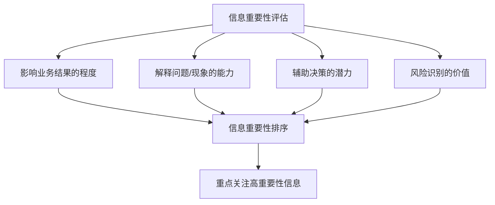
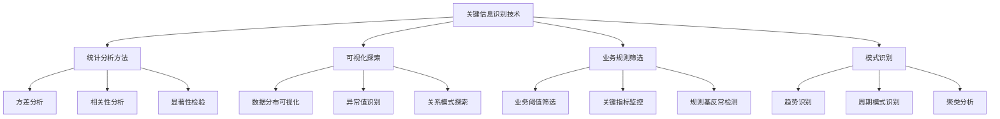
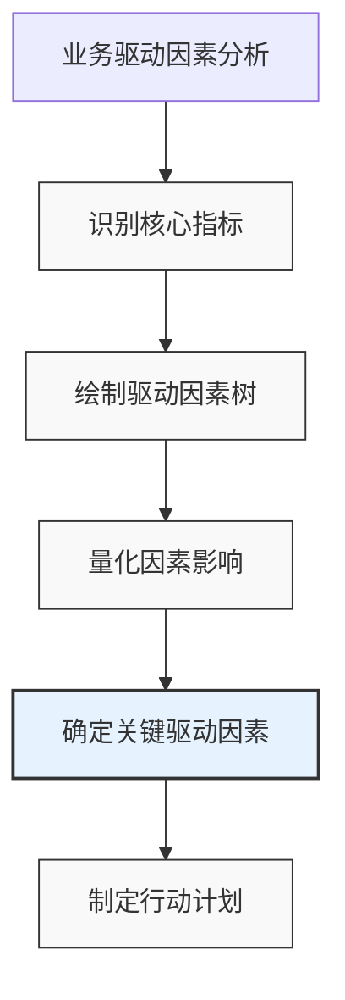
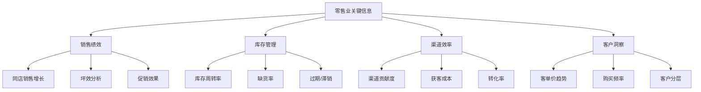
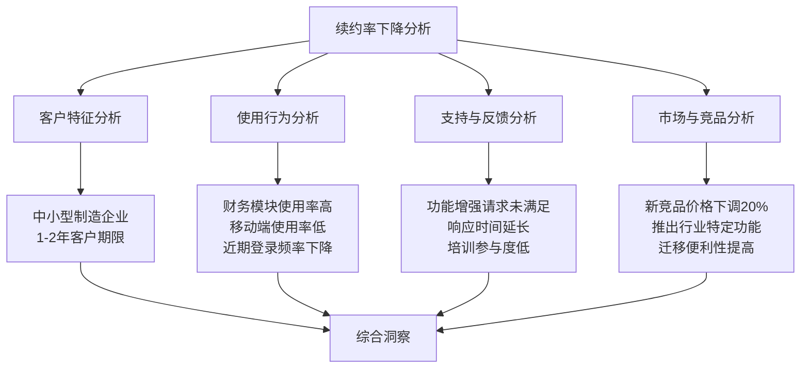
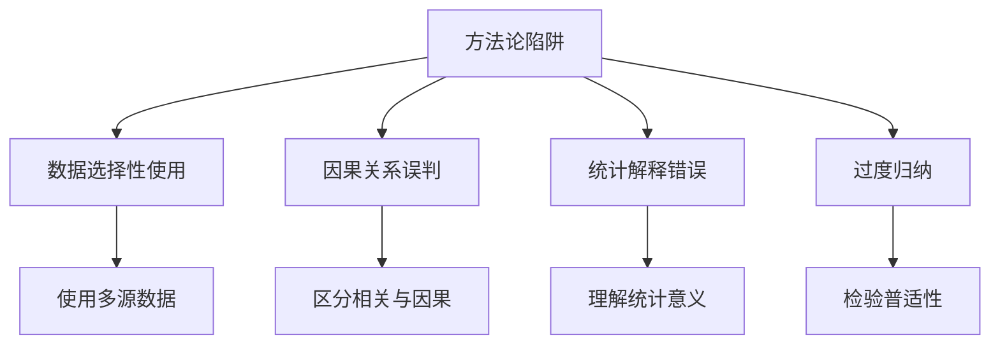

---
{"tags":["财务BP","信息提炼","数据分析","决策支持","报告技巧"],"aliases":["财务数据提炼","重点信息提取","数据洞察技巧"],"created":"2024-03-20","dg-publish":true,"permalink":"/知识共享/01_财务BP/01_学习内容/06_BP工具与模板/BP展示技巧/关键信息提炼/","dgPassFrontmatter":true}
---

# 关键信息提炼

> [!abstract] 概述
> 本文档重点介绍财务BP工作中的关键信息提炼技能，包括如何从海量财务数据中识别、筛选和提取最有价值的信息，形成有效的业务洞察和决策支持。掌握关键信息提炼技能是财务BP实现从数据到洞察、从分析到行动转化的基础，也是提升财务价值贡献的核心能力。本文将系统讲解关键信息提炼的方法、框架和最佳实践，并提供实用案例。

## 一、关键信息提炼的基本原则

### 1. 目标导向原则
- **明确分析目的**：从决策需求出发确定信息提炼方向
- **解决具体问题**：聚焦能解决特定业务问题的信息
- **行动可执行性**：提炼能够指导具体行动的信息
- **价值最大化**：优先提取对业务价值影响最大的信息

### 2. 重要性原则

- **实质重要性**：关注对财务结果有实质影响的信息
- **统计显著性**：关注具有统计意义的变化和差异
- **战略重要性**：聚焦与战略目标相关的关键信息
- **异常优先**：优先关注异常值和异常变化

### 3. 上下文关联原则
- **背景关联**：在特定业务背景下评估信息意义
- **历史对比**：与历史数据比较理解信息含义
- **横向比较**：与行业、竞争对手或最佳实践比较
- **趋势分析**：识别数据变化趋势及其含义

### 4. 简洁清晰原则
- **信息精简**：去除冗余，聚焦核心
- **层次分明**：建立清晰的信息层级结构
- **因果清晰**：明确呈现因果关系
- **避免过度简化**：保留必要的细节和复杂性

## 二、关键信息提炼方法论

### 1. 问题定义与框架设计
- **明确关键问题**：确定需要回答的核心业务问题
- **设计分析框架**：建立适合问题的分析结构
- **确定优先级**：确定关键假设和优先分析领域
- **选择合适工具**：根据问题特性选择合适的分析工具

### 2. 数据收集与预处理
- **识别数据需求**：确定回答问题所需的数据集
- **数据质量评估**：评估数据完整性、准确性和相关性
- **数据清洗与整合**：处理异常值、缺失值和不一致
- **数据标准化**：确保不同来源数据的可比性

### 3. 关键信息识别技术

- **差异分析法**：识别计划与实际的差异，预期与结果的差异
- **帕累托分析法**：识别遵循80/20法则的关键因素
- **敏感性分析**：识别对结果影响最大的变量
- **根因分析**：识别表面现象背后的根本原因
- **MECE分析法**：相互独立、完全穷尽的分析框架

### 4. 洞察形成与检验方法
- **归纳推理**：从数据中提炼一般性结论
- **演绎推理**：从理论模型出发验证具体结论
- **假设检验**：系统验证分析假设
- **三角验证**：使用多种方法和数据源交叉验证
- **情景思考**：构建不同情景下的解释模型

## 三、财务BP常用信息提炼框架

### 1. 差异分析框架
- **计划vs实际分析**：
  - 识别显著差异及其方向
  - 确定差异的具体来源和构成
  - 评估差异的持续性和影响
  - 提出调整方案和预防措施

- **预算差异分解**：
  - 价格/费率差异
  - 数量/活动量差异
  - 效率/生产力差异
  - 组合/结构差异
  - 市场/环境差异

### 2. 财务表现分析框架
- **收入分析**：
  - 按产品/服务线分析
  - 按客户群体/渠道分析
  - 按地区/市场分析
  - 价格vs数量贡献分析

- **成本分析**：
  - 固定vs可变成本分析
  - 直接vs间接成本分析
  - 可控vs不可控成本分析
  - 增量成本分析
  - 单位成本趋势分析

### 3. 业务驱动因素分析框架

- **收入驱动因素分析**：
  - 客户数量
  - 客户留存率
  - 客单价
  - 购买频率
  - 转化率

- **成本驱动因素分析**：
  - 规模效应
  - 复杂性
  - 能力利用率
  - 产品设计
  - 流程效率

### 4. 趋势与预测分析框架
- **时间序列分解**：
  - 基础趋势识别
  - 季节性模式提取
  - 周期性因素分析
  - 不规则波动识别

- **预测准确性分析**：
  - 预测偏差分析
  - 预测方差分析
  - 预测修正因素识别
  - 预测改进方向

### 5. 风险与机会评估框架
- **财务风险识别**：
  - 流动性风险评估
  - 信用风险评估
  - 市场风险评估
  - 预算风险评估

- **机会识别框架**：
  - 收入增长机会
  - 成本优化机会
  - 资产效率提升
  - 资本结构优化

## 四、信息提炼的实际应用技巧

### 1. 财务数据深度挖掘
- **分层分析技术**：从总体到细节的逐层深入
- **交叉分析方法**：结合多维度指标进行交叉分析
- **细分分析技术**：按关键变量对数据进行细分
- **异常值深入探究**：深入调查异常数据背后的原因
- **边际分析方法**：关注增量变化和边际效应

### 2. 业务洞察提炼

- **因果关系识别**：区分相关性和因果关系
- **业务规律总结**：识别可重复的业务模式和规律
- **对比分析技术**：通过对比提取关键差异和启示
- **场景模拟分析**：模拟不同条件下的业务结果
- **历史经验借鉴**：从历史成功和失败中提取经验

### 3. 数据讲故事技巧
- **构建数据叙事**：将数据转化为引人入胜的故事
- **确定关键信息线**：建立清晰的叙事主线
- **设计信息序列**：以最有效的顺序呈现信息
- **创建有效对比**：通过对比强化关键信息
- **使用类比和比喻**：用熟悉的概念解释复杂信息

### 4. 决策支持信息提炼
- **决策选项对比**：清晰呈现不同选择及其影响
- **权衡利弊分析**：全面展示各选项的优势和劣势
- **风险分析**：识别决策相关的关键风险
- **实施考量提炼**：提取影响实施成功的关键因素
- **后续行动建议**：提炼明确的后续行动步骤

## 五、常见行业应用中的信息提炼

### 1. 制造业信息提炼
- **生产成本分析**：
  - 标准成本vs实际成本差异
  - 材料、人工、制造费用构成
  - 产能利用率影响
  - 废品率和质量成本分析

- **产品线绩效评估**：
  - 产品贡献利润分析
  - 产品生命周期成本
  - 投资回报率比较
  - 产能分配优化建议

### 2. 服务业信息提炼
- **服务交付效率分析**：
  - 人均产出/效率指标
  - 服务交付成本趋势
  - 资源利用率数据
  - 客户满意度相关分析

- **客户价值分析**：
  - 客户获取成本
  - 客户终身价值
  - 客户盈利能力分层
  - 客户留存与流失分析

### 3. 零售业信息提炼

- **商品组合分析**：
  - 畅销/滞销商品识别
  - 品类贡献分析
  - 库存周转率对比
  - 商品组合优化建议

- **销售渠道分析**：
  - 线上vs线下表现
  - 渠道获客成本比较
  - 渠道转化率对比
  - 全渠道协同机会

### 4. 科技行业信息提炼
- **SaaS业务模型分析**：
  - MRR/ARR增长分解
  - 客户获取成本(CAC)
  - 顾客生命周期价值(LTV)
  - 扩张率(Expansion Rate)
  - 流失率(Churn Rate)分析

- **研发投资分析**：
  - R&D投资回报
  - 研发项目组合评估
  - 创新指标分析
  - 时间到市场效率

## 六、案例分析

### 案例1：制造企业成本超支原因分析

**背景**：某汽车零部件制造企业发现第二季度成本超出预算15%，管理层需要了解超支原因并制定应对策略。

**信息提炼过程**：

1. **问题定义与框架设计**：
   - 核心问题：成本超支的主要原因是什么？是临时性还是结构性问题？
   - 分析框架：按成本类别、产品线和部门分解差异
   - 优先领域：关注最大差异项目和异常变动

2. **数据收集与初步分析**：
   - 收集：预算成本、实际成本、产量、材料价格、工时等
   - 初步发现：直接材料成本超支8%，直接人工超支25%，制造费用超支18%

3. **深度分析与关键发现**：
   - **材料成本问题**：
     - 关键原材料价格上涨5%（市场因素）
     - 材料浪费率上升3%（内部问题）
     - 高成本供应商采购比例增加（供应链问题）
   
   - **人工成本问题**：
     - 加班时数增加40%（产能问题）
     - 临时工使用增加35%（人员配置问题）
     - 单位产出下降12%（效率问题）
   
   - **制造费用问题**：
     - 设备维修费用是预算的2倍（维护问题）
     - 能源消耗增加15%（效率问题）
     - 小批量生产增加导致调整成本上升（生产计划问题）

4. **根因分析与关联**：
   - 对比生产计划发现：客户订单波动增大，小批量紧急订单增加50%
   - 设备分析发现：核心设备维护不及时，导致故障率上升和效率下降
   - 人员分析发现：熟练工流失率上升，培训投入不足

5. **关键信息提炼与整合**：
   - 成本超支的主要根因：订单模式变化、设备可靠性下降、人员稳定性问题
   - 60%的超支与规划和协调问题有关（内部可控）
   - 40%的超支与市场条件变化有关（外部因素）
   - 最大改进机会：生产计划优化、设备预防性维护、人员保留计划

**提炼后的关键洞察**：
1. 成本超支主要源于客户订单模式变化，导致生产灵活性不足
2. 设备可靠性和人员流失是影响生产效率的关键因素
3. 通过改进生产计划、加强设备维护和稳定核心团队，预计可减少10%的成本超支
4. 建议与关键客户重新协商交付条件，降低小批量紧急订单的影响
5. 长期需要提高生产灵活性并重新评估定价策略以反映真实生产成本

**行动建议优先级**：
1. 建立小批量快速响应生产线（短期）
2. 实施设备预防性维护计划（短期）
3. 制定核心技术人员留用计划（中期）
4. 与关键客户协商订单预测共享机制（中期）
5. 调整定价策略以反映批量差异（长期）

### 案例2：SaaS企业客户续约率下降分析

**背景**：某企业SaaS服务提供商发现近两个季度客户续约率从92%下降到83%，需要找出原因并扭转趋势。

**信息提炼过程**：

1. **问题定义与数据收集**：
   - 核心问题：为什么续约率下降？哪类客户流失严重？有何征兆？
   - 数据收集：客户属性、使用行为、支持记录、市场调研、竞品信息
   
2. **初步分析与细分**：
   - 按客户规模：大客户续约率稳定在90%，中小客户下降至78%
   - 按行业：制造业客户流失率最高（下降15个百分点）
   - 按使用期限：使用1-2年的客户流失最严重（流失率25%）
   - 按产品模块：主要使用财务模块的客户流失率高于平均值

3. **深度挖掘与模式识别**：

   - **使用行为分析**：
     - 流失客户的系统登录频率在流失前3个月下降40%
     - 财务模块的使用深度低于留存客户30%
     - 移动应用使用率显著低于留存客户（25% vs 65%）
   
   - **客户支持分析**：
     - 流失客户的功能增强请求满足率低于平均水平
     - 技术支持响应时间较长期平均增加了48小时
     - 培训和价值实现服务参与度低
   
   - **市场与竞品分析**：
     - 主要竞争对手针对中小企业推出了价格更低的简化版本
     - 竞品推出了针对制造业的行业特定功能
     - 竞品简化了数据迁移流程，降低了转换成本

4. **关键信息提炼与根因分析**：
   - 产品适配问题：中小制造业客户需求与当前产品存在功能差距
   - 客户成功问题：价值实现不充分，客户使用深度不足
   - 竞争压力：竞品针对特定市场细分的针对性策略
   - 客户生命周期问题：1-2年是价值重评估的关键点

**提炼后的关键洞察**：
1. 续约率下降主要集中在中小型制造业客户，特别是使用1-2年的客户群
2. 这些客户面临产品适配度不足和价值实现不充分的双重挑战
3. 竞争对手推出的针对性解决方案加速了客户流失
4. 客户使用行为（登录频率、模块使用）是预测流失的早期指标
5. 客户成功团队的响应速度和主动干预是影响续约的关键因素

**行动建议优先级**：
1. 建立客户健康分数预警系统，及早识别流失风险（立即）
2. 为中小制造业客户提供针对性的功能包和培训（短期）
3. 改善客户支持响应机制，优先处理高风险客户（短期）
4. 强化1-2年期客户的价值重新评估和展示流程（中期）
5. 开发制造业垂直解决方案，提高产品适配度（长期）
6. 优化定价策略，提供更灵活的模块选择（长期）

## 七、关键信息提炼的常见陷阱与避免方法

### 1. 认知偏见问题
- **确认偏误**：倾向寻找支持已有观点的信息
  - *避免方法*：主动寻找反面证据，设置魔鬼代言人角色

- **锚定效应**：过度依赖最初获得的信息
  - *避免方法*：使用多个不同起点进行分析，避免先入为主

- **可得性偏误**：基于容易想到的例子做出判断
  - *避免方法*：系统化数据收集，避免仅凭经验判断

- **叙事谬误**：过度依赖故事性解释而忽视数据
  - *避免方法*：坚持以数据为基础，避免过度简化的故事

### 2. 方法论问题

- **数据选择性使用**：仅选择支持特定结论的数据
  - *避免方法*：使用全面的数据集，明确披露数据来源和选择标准

- **因果关系误判**：将相关性误解为因果关系
  - *避免方法*：严格的因果推断方法，考虑替代解释

- **统计解释错误**：错误理解统计结果的实际含义
  - *避免方法*：提高统计素养，明确统计限制和假设

- **过度归纳**：从有限样本过度推广结论
  - *避免方法*：谨慎推广，明确适用条件和局限性

### 3. 组织和沟通问题
- **信息过载**：提供过多信息导致关键点模糊
  - *避免方法*：严格筛选，保持关键信息清晰突出

- **专业术语障碍**：过度使用专业术语影响理解
  - *避免方法*：使用受众能理解的语言，提供必要解释

- **缺乏上下文**：脱离业务背景提供孤立信息
  - *避免方法*：始终提供足够上下文，连接到业务语境

- **过度简化**：为简洁而牺牲必要复杂性
  - *避免方法*：在简洁与完整间取得平衡，分层次呈现信息

### 4. 改进措施
- **建立结构化流程**：系统化信息提炼流程
- **应用多元视角**：从不同角度分析同一问题
- **进行同行评审**：获得多方意见和质疑
- **持续学习反思**：总结经验教训，不断改进方法
- **提高数据素养**：增强数据分析和解释能力

## 八、信息提炼能力提升路径

### 1. 基础能力训练
- **数据分析能力**：提升数据处理、分析和解释能力
- **业务理解能力**：深化对业务模型和价值驱动的理解
- **批判性思维**：培养质疑和多角度思考习惯
- **结构化思维**：训练系统化、框架化思考方法
- **叙事沟通能力**：提升将复杂信息转化为清晰故事的能力

### 2. 工具和方法掌握
- **分析框架工具箱**：掌握多种分析框架和方法
- **可视化工具**：学习高效数据可视化技术
- **统计分析工具**：掌握适用的统计分析方法
- **业务建模工具**：学习业务模型构建和分析技术
- **报告和展示工具**：掌握有效的信息呈现工具

### 3. 实践学习路径

- **阶段式学习**：
  - 基础数据处理和分析（入门）
  - 标准报告和分析制作（初级）
  - 业务问题诊断和分析（中级）
  - 复杂问题的深度分析（高级）
  - 战略洞察和决策支持（专家级）

- **项目实践学习**：
  - 参与实际业务问题分析
  - 跟随有经验的分析师学习
  - 接受反馈并持续改进
  - 逐步提高分析复杂度
  - 建立个人分析方法库

### 4. 持续学习资源
- **专业书籍和文章**：关于数据分析、业务分析的学习资料
- **在线课程和培训**：提升特定分析技能的课程
- **行业研究报告**：了解行业最佳实践和趋势
- **同行社区和论坛**：交流和分享经验
- **导师指导与反馈**：获取专业指导和个性化反馈

## 相关链接

- [[知识共享/01_财务BP/01_学习内容/06_BP工具与模板/BP展示技巧/数据可视化技巧\|数据可视化技巧]]
- [[知识共享/01_财务BP/01_学习内容/06_BP工具与模板/BP展示技巧/管理层报告设计\|管理层报告设计]]
- [[知识共享/01_财务BP/01_学习内容/06_BP工具与模板/BP展示技巧/有效沟通财务计划\|有效沟通财务计划]]
- [[知识共享/01_财务BP/01_学习内容/06_BP工具与模板/基础方法/BP财务预测方法\|知识共享/01_财务BP/01_学习内容/06_BP工具与模板/基础方法/BP财务预测方法]]
- [[决策支持技术\|决策支持技术]]

## 参考文献

1. Minto, B. (2008). *The Pyramid Principle: Logic in Writing and Thinking*. Financial Times Prentice Hall.
2. Few, S. (2009). *Now You See It: Simple Visualization Techniques for Quantitative Analysis*. Analytics Press.
3. Kahneman, D. (2011). *Thinking, Fast and Slow*. Farrar, Straus and Giroux.
4. Duarte, N. (2019). *DataStory: Explain Data and Inspire Action Through Story*. Ideapress Publishing.
5. McAfee, A., & Brynjolfsson, E. (2017). *Machine, Platform, Crowd: Harnessing Our Digital Future*. W. W. Norton & Company.
6. 《商业分析与决策》，张志强，中国人民大学出版社，2020.
7. 《数据分析与商业洞察》，李明，清华大学出版社，2019.
8. 《财务分析与决策》，王永利，北京大学出版社，2021. 