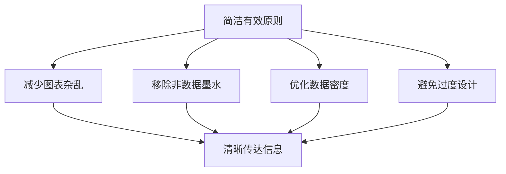
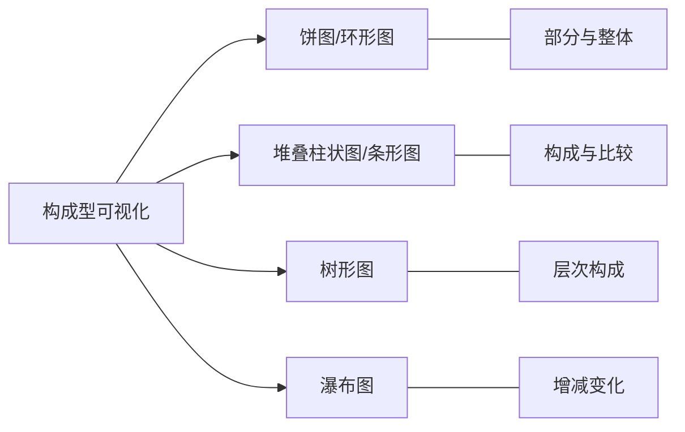
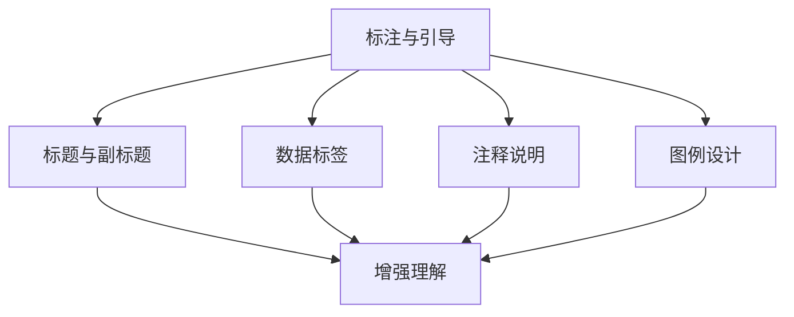
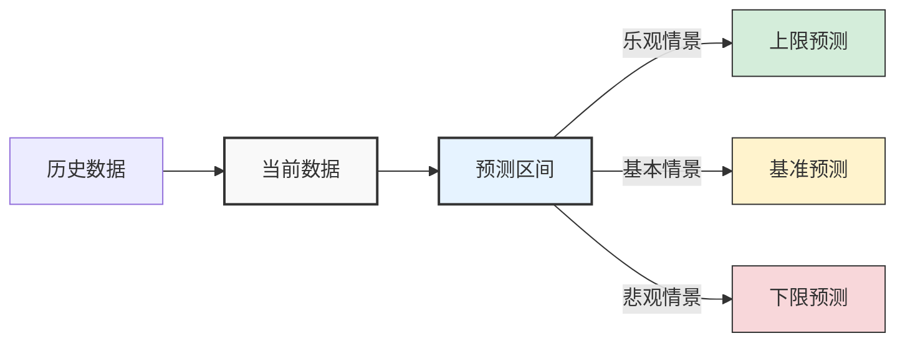
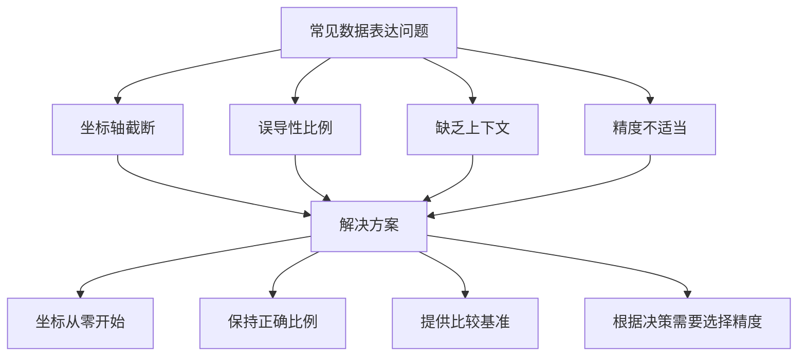

---
{"tags":["财务BP","数据可视化","展示技巧","图表设计","沟通技巧"],"aliases":["财务数据可视化","BP可视化技术","图表设计指南"],"created":"2024-03-20","dg-publish":true,"permalink":"/知识共享/01_财务BP/01_学习内容/06_BP工具与模板/BP展示技巧/数据可视化技巧/","dgPassFrontmatter":true}
---

# 数据可视化技巧

> [!abstract] 概述
> 本文档详细介绍财务BP工作中的数据可视化技巧，包括选择合适的图表类型、设计有效的可视化、避免常见陷阱和实现数据洞察。优秀的数据可视化能够将复杂的财务数据转化为直观、易理解的图形，帮助决策者快速把握关键信息，做出明智决策。本文将系统讲解数据可视化的原则、方法和最佳实践，并提供实用案例。

## 一、数据可视化的基本原则

### 1. 目的明确性
- **明确传达目标**：每个可视化应有明确的信息传达目标
- **读者需求导向**：根据读者需求和关注点设计
- **决策支持性**：可视化应支持特定的决策或行动
- **信息层次清晰**：主次分明，重点突出

### 2. 简洁有效性

- **数据墨水比**：最大化有效数据表达，减少装饰元素
- **减少认知负担**：避免不必要的复杂性
- **直接清晰**：直接表达核心信息，避免迂回
- **精简元素**：只保留必要的视觉元素

### 3. 准确真实性
- **避免数据失真**：确保视觉表达与数据比例一致
- **适当的精度**：根据决策需要选择合适的数据精度
- **坐标轴诚实**：避免截断坐标轴造成误导
- **完整展示**：提供理解数据所需的完整上下文

### 4. 直观易懂性
- **利用视觉感知优势**：利用人类视觉感知的自然优势
- **一致的视觉语言**：保持视觉元素的一致性
- **符合阅读习惯**：遵循常见的阅读模式和习惯
- **自解释性强**：减少理解所需的额外解释

## 二、选择合适的图表类型

### 1. 比较型可视化
- **柱状图**：比较不同类别的数值大小
  - 适用：部门预算比较、不同产品收入对比
  - 变体：分组柱状图、堆叠柱状图、双向柱状图
  - 关键点：保持类别排序有意义（如大小顺序、字母顺序）

- **条形图**：处理类别较多或名称较长的比较
  - 适用：多产品线对比、细分项目比较
  - 变体：分组条形图、堆叠条形图、多指标条形图
  - 关键点：从上到下按数值大小或逻辑顺序排列

- **雷达图**：多维度指标对比
  - 适用：平衡计分卡、多维度绩效评估
  - 变体：填充雷达图、多组雷达图
  - 关键点：限制维度在5-7个，保持维度独立性

### 2. 构成型可视化

- **饼图/环形图**：显示部分与整体的关系
  - 适用：收入构成、成本构成（限制在6个分类以内）
  - 变体：嵌套环形图、半饼图
  - 关键点：从最大部分开始按顺时针排列，标注百分比

- **堆叠图表**：同时显示总量和构成
  - 适用：各部门成本随时间变化、产品组合变化
  - 变体：100%堆叠图、分组堆叠图
  - 关键点：使用对比强烈的颜色，保持数据顺序一致

- **树形图**：表示层次结构和相对大小
  - 适用：预算细分、复杂成本结构
  - 变体：多级树形图、热力树形图
  - 关键点：相似类别使用相似颜色，大小反映数值

- **瀑布图**：显示连续增减变化
  - 适用：利润构成分析、净收入变化解释
  - 变体：浮动瀑布图、横向瀑布图
  - 关键点：使用颜色区分增加和减少，清晰标记起点和终点

### 3. 趋势型可视化
- **折线图**：显示连续数据的变化趋势
  - 适用：销售趋势、财务指标随时间变化
  - 变体：多线折线图、阶梯图、曲线图
  - 关键点：限制线条数量（4-5条内），使用不同线型和颜色区分

- **面积图**：强调总量变化
  - 适用：累计收入、市场份额变化
  - 变体：堆叠面积图、百分比面积图
  - 关键点：基线从零开始，使用半透明色彩避免遮挡

- **烛台图/箱线图**：显示数据范围和分布
  - 适用：价格波动、季度业绩波动
  - 变体：带成交量柱状图的烛台图、组合箱线图
  - 关键点：添加关键统计信息如均值、中位数

### 4. 关系型可视化
- **散点图**：展示两个变量间的关系
  - 适用：成本vs收益分析、客户价值vs保留率
  - 变体：气泡图、网格散点图
  - 关键点：添加趋势线、区域划分或标注特殊点

- **矩阵图**：展示多变量间的关系
  - 适用：相关性分析、投资组合评估
  - 变体：热力矩阵、散点矩阵
  - 关键点：使用色彩强度表示关系强度

- **网络图**：显示实体间的连接关系
  - 适用：部门间资金流动、组织结构影响
  - 变体：力导向图、桑基图
  - 关键点：减少视觉复杂性，强调重要连接

## 三、财务数据可视化设计技巧

### 1. 色彩运用
- **功能性色彩**：使用色彩传达信息，而非仅为装饰
- **色彩编码**：一致的色彩含义（如红色表示负面，绿色表示正面）
- **色彩层次**：使用色彩强度表达数据强度
- **配色方案**：使用协调的配色方案，考虑色盲友好
- **克制使用**：避免过多色彩干扰关键信息

### 2. 标注与引导

- **有效标题**：使用描述性标题传达图表核心信息
- **数据标签**：在关键点添加精确数值
- **注释与引导**：解释异常值和重要趋势
- **参考线**：添加目标线、平均线等参考信息
- **强调技术**：高亮显示最重要的数据点

### 3. 布局与组织
- **信息流设计**：创建清晰的视觉导向路径
- **分组与对齐**：相关信息视觉分组
- **留白运用**：使用空白创造视觉呼吸和层次
- **一致性**：在报告中保持设计元素一致
- **格式标准化**：建立标准化的图表格式

### 4. 交互式可视化
- **筛选功能**：允许用户筛选关注的数据子集
- **钻取功能**：提供从概览到细节的层级探索
- **时间滑块**：允许时间范围的动态调整
- **预测模拟**：交互式情景分析和假设测试
- **移动适配**：确保在不同设备上的可用性

## 四、财务BP中的常见可视化应用

### 1. 预算与实际比较
- **比较柱状图**：并列展示预算与实际值
- **差异热力图**：用色彩强度显示差异大小
- **差异瀑布图**：展示差异的具体来源
- **计划vs实际折线图**：显示随时间的趋势比较
- **仪表盘**：直观显示KPI达成情况

**设计要点**：
- 保持比较基准一致
- 清晰标注差异值和百分比
- 区分积极差异和消极差异
- 提供足够上下文解释差异

### 2. 财务报表可视化
- **损益表可视化**：瀑布图展示从收入到净利的构成
- **资产负债表可视化**：分组柱状图或树形图展示资产负债结构
- **现金流可视化**：桑基图展示资金流向
- **比率分析**：雷达图展示多个财务比率
- **趋势分析**：小倍数图(Small Multiples)展示多指标趋势

**设计要点**：
- 保持与标准财务报表逻辑一致
- 突出关键财务指标和变化
- 提供合适的比较基准（同期、预算、行业）
- 确保数据加总正确

### 3. 预测与规划可视化

- **预测区间图**：展示预测的不确定性范围
- **情景分析并列图**：比较不同情景下的预测结果
- **敏感性热力图**：展示变量变化对结果的影响
- **决策树可视化**：展示不同决策路径及其结果
- **蒙特卡洛模拟结果**：概率分布图展示可能结果范围

**设计要点**：
- 明确区分历史数据和预测数据
- 表明预测的不确定性
- 展示关键假设和驱动因素
- 提供足够的情景对比

### 4. 业务驱动因素分析
- **相关性热力图**：展示变量间的相关关系
- **驱动因素瀑布图**：展示各因素对结果的贡献
- **散点关系图**：探索变量间的关系模式
- **平行坐标图**：比较多维度数据
- **归因分析图**：解释业绩变化的具体原因

**设计要点**：
- 聚焦最具影响力的驱动因素
- 量化各因素的影响程度
- 展示因素间的相互关系
- 连接到可操作的业务洞察

## 五、常见错误与改进方法

### 1. 图表选择错误
- **错误**：使用饼图比较不同类别的数值
- **改进**：改用柱状图或条形图进行类别比较

- **错误**：使用3D图表展示二维数据
- **改进**：使用简单的2D图表避免视觉失真

- **错误**：过度使用复杂图表类型
- **改进**：优先选择简单直观的基础图表

### 2. 设计与格式问题
- **错误**：图表元素过多导致信息过载
- **改进**：减少图表元素，聚焦核心信息

- **错误**：色彩使用混乱或过度
- **改进**：建立一致的色彩系统，有意义地使用色彩

- **错误**：缺乏清晰的标题和标注
- **改进**：添加信息丰富的标题和必要的数据标签

### 3. 数据表达问题

- **错误**：截断坐标轴夸大变化
- **改进**：通常从零开始，或清晰标注截断

- **错误**：忽略数据不确定性
- **改进**：通过误差棒或区间显示不确定性

- **错误**：缺乏比较基准
- **改进**：添加相关的比较基准（行业均值、历史数据等）

### 4. 解释与上下文问题
- **错误**：展示数据而不提供洞察
- **改进**：添加分析解释，突出关键发现

- **错误**：忽略异常值背后的原因
- **改进**：解释异常值，提供上下文信息

- **错误**：错误归因或忽略复杂因果关系
- **改进**：谨慎解释因果关系，考虑多因素影响

## 六、数据可视化案例分析

### 案例1：销售预算差异分析仪表板

**背景**：大型零售企业需要分析销售预算与实际表现的差异，找出问题区域并采取行动。

**可视化组件**：
1. **顶部KPI卡片**：
   - 总销售额：计划vs实际，差异额与百分比
   - 毛利率：计划vs实际，差异百分点
   - 客单价与客流量：计划vs实际，差异百分比

2. **销售差异热力图**：
   - 行：产品类别
   - 列：销售区域
   - 单元格颜色：红（低于计划）到绿（高于计划）
   - 单元格数值：差异百分比

3. **时间趋势图**：
   - 折线图显示月度计划vs实际
   - 带差异条形图显示每月差异大小
   - 添加同比数据作为参考

4. **影响因素分解**：
   - 瀑布图分解销售差异的具体原因
   - 价格因素、数量因素、产品组合因素等
   - 使用颜色区分正面和负面影响

5. **行动建议区**：
   - 针对主要差异的行动建议
   - 责任人和时间表
   - 预期改善效果

**设计亮点**：
- 采用一致的色彩编码：绿色（正面）、红色（负面）
- 交互式筛选器：可按区域、产品、时间段筛选
- 异常值标注：自动标注重大差异并提供解释
- 数据钻取功能：从总体到详细层级
- 移动友好设计：关键信息在小屏幕上仍清晰可见

**使用成效**：
- 识别出4个表现低于预期的产品类别
- 发现价格策略对特定区域的负面影响
- 促成销售策略调整，使差异减少40%
- 决策周期从月度缩短到周度
- 报告讨论时间缩短60%，行动计划时间增加

### 案例2：多年期投资项目财务模型可视化

**背景**：制造企业评估一项5年期重大设备投资项目，需要展示其财务影响和风险。

**可视化组件**：
1. **现金流时间线**：
   - 堆叠条形图展示每年的现金流入出
   - 线图显示累计现金流和回收期
   - 标注关键时间点（初始投资、盈亏平衡点）

2. **净现值敏感性分析**：
   - 热力图展示贴现率和增长率变化对NPV的影响
   - 色彩从红（负NPV）到绿（高NPV）
   - 标注基准情景和临界点

3. **情景比较**：
   - 平行坐标图比较不同情景下的关键指标
   - 指标包括NPV、IRR、回收期、EBITDA
   - 使用不同线条代表基本、乐观、悲观情景

4. **风险评估仪表板**：
   - 蒙特卡洛模拟结果的直方图
   - 投资结果的概率分布
   - 关键风险因素的龙卷风图
   - 敏感度排名的条形图

5. **战略价值矩阵**：
   - 气泡图展示多个投资选项
   - X轴：财务回报
   - Y轴：战略重要性
   - 气泡大小：投资金额
   - 气泡颜色：风险评级

**设计亮点**：
- 使用渐变色展示数据范围和临界点
- 提供交互式假设调整控件
- 关键数据点添加精确数值标签
- 添加注释解释方法论和假设
- 在同一视图中整合财务和战略视角

**使用成效**：
- 董事会批准了投资提案
- 识别出需要密切监控的三个关键风险因素
- 建立了基于可视化的项目跟踪机制
- 财务和运营团队达成共识
- 可视化模板被用于后续所有大型投资项目

## 七、实施数据可视化的组织建议

### 1. 工具选择与技能培养
- **工具评估**：根据组织需求选择合适的可视化工具
  - Excel：基础可视化和财务模型
  - Power BI/Tableau：交互式仪表板和报告
  - Python/R：高级分析和定制可视化
  - 专业设计软件：高质量静态图表

- **技能培养**：
  - 基础数据可视化培训
  - 图表设计和美学原则
  - 数据分析和解释能力
  - 叙事和沟通技巧

### 2. 标准化与一致性
- **视觉风格指南**：建立组织的可视化风格指南
- **模板库**：开发常用财务可视化模板
- **最佳实践分享**：内部分享成功案例
- **质量检查**：建立可视化成果的审核机制

### 3. 反馈与改进

- **用户反馈**：定期收集使用者反馈
- **效果评估**：评估可视化对决策的影响
- **A/B测试**：测试不同可视化方案的效果
- **持续学习**：跟踪数据可视化的新趋势和技术

### 4. 数据素养文化
- **提高数据意识**：培养全组织的数据素养
- **批判性思维**：鼓励质疑和深入分析
- **透明度**：明确数据来源和局限性
- **数据伦理**：确保可视化诚实、公正

## 八、未来趋势展望

1. **自动化与AI辅助可视化**
   - 自动识别数据中的模式和异常
   - 智能推荐合适的图表类型
   - 自然语言生成见解和解释
   - 自适应可视化根据用户行为调整

2. **沉浸式和空间可视化**
   - 增强现实(AR)财务数据展示
   - 虚拟现实(VR)复杂财务模型探索
   - 3D可视化用于多维财务数据
   - 空间分析用于地理相关财务数据

3. **实时和预测性可视化**
   - 实时数据流的动态可视化
   - 内置预测模型的前瞻性视图
   - 自适应阈值和智能警报
   - 情景模拟的即时视觉反馈

4. **个性化和上下文感知**
   - 根据用户角色定制可视化内容
   - 考虑用户背景的信息展示
   - 适应不同设备和使用场景
   - 学习用户偏好的智能界面

## 相关链接

- [[知识共享/01_财务BP/01_学习内容/06_BP工具与模板/BP展示技巧/管理层报告设计\|管理层报告设计]]
- [[知识共享/01_财务BP/01_学习内容/06_BP工具与模板/BP展示技巧/关键信息提炼\|关键信息提炼]]
- [[知识共享/01_财务BP/01_学习内容/06_BP工具与模板/BP展示技巧/有效沟通财务计划\|有效沟通财务计划]]
- [[财务软件应用\|财务软件应用]]
- [[知识共享/01_财务BP/01_学习内容/06_BP工具与模板/基础方法/BP财务预测方法\|知识共享/01_财务BP/01_学习内容/06_BP工具与模板/基础方法/BP财务预测方法]]

## 参考文献

1. Tufte, E. R. (2001). *The Visual Display of Quantitative Information*. Graphics Press.
2. Cairo, A. (2019). *How Charts Lie: Getting Smarter about Visual Information*. W. W. Norton & Company.
3. Few, S. (2009). *Now You See It: Simple Visualization Techniques for Quantitative Analysis*. Analytics Press.
4. Knaflic, C. N. (2015). *Storytelling with Data: A Data Visualization Guide for Business Professionals*. Wiley.
5. Munzner, T. (2014). *Visualization Analysis and Design*. A K Peters/CRC Press.
6. 《数据可视化之美：财务数据的视觉呈现》，王晓明，中国财政经济出版社，2020.
7. 《财务数据可视化技术与实践》，李志强，机械工业出版社，2021.
8. 《商业智能与数据可视化》，张华，电子工业出版社，2019. 