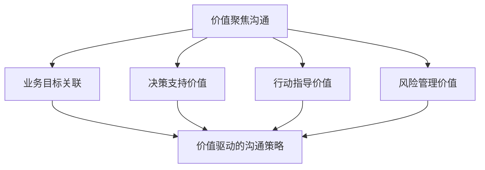
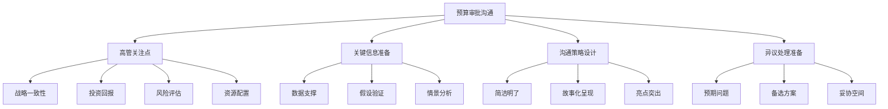
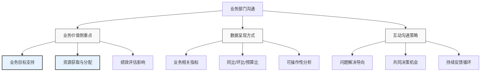
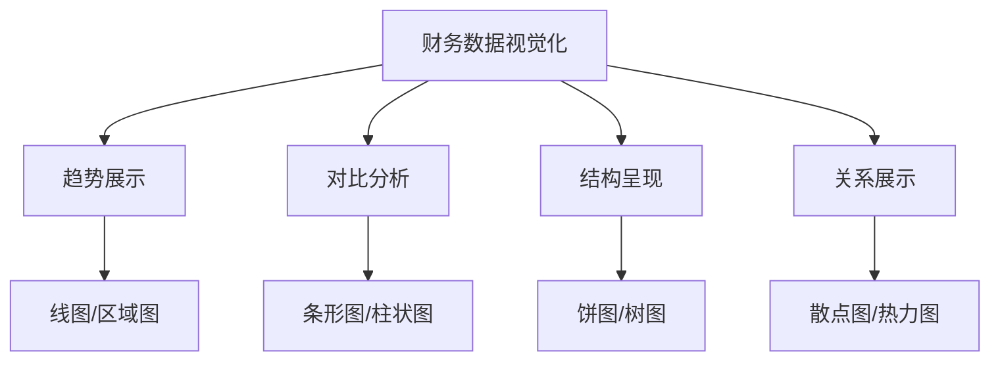
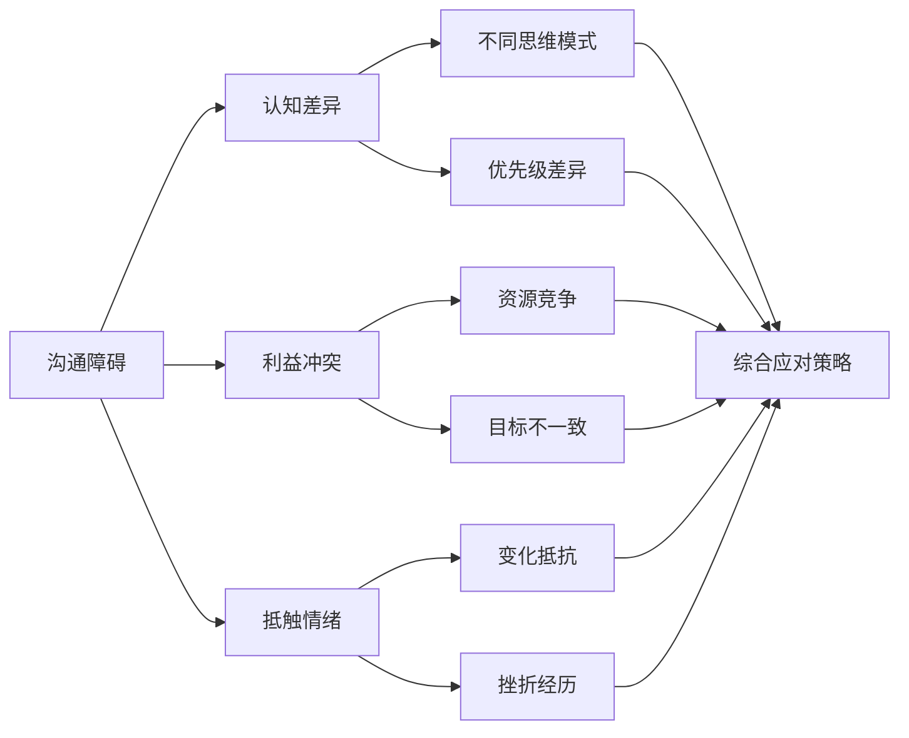
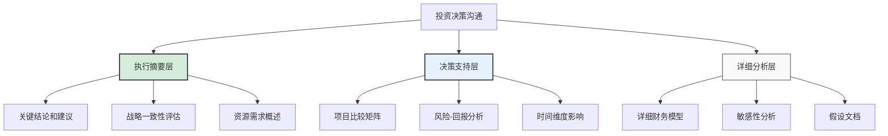
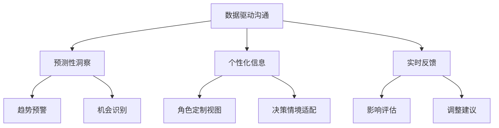

---
{"tags":["财务BP","沟通技巧","财务计划","预算展示","跨部门协作"],"aliases":["财务沟通策略","财务计划展示","有效预算沟通"],"created":"2024-03-20","dg-publish":true,"permalink":"/知识共享/01_财务BP/01_学习内容/06_BP工具与模板/BP展示技巧/有效沟通财务计划/","dgPassFrontmatter":true}
---

# 有效沟通财务计划

> [!abstract] 概述
> 本文档重点介绍财务BP如何有效沟通财务计划与预算，以确保业务伙伴理解、支持并积极参与财务计划的实施。有效的财务沟通不仅仅是传递数据和信息，更是引导业务团队理解财务决策背后的逻辑、建立共识并推动行动。本文将系统讲解财务计划沟通的策略、方法和技巧，帮助财务BP提升沟通影响力和业务合作效果。

## 一、财务计划沟通的核心原则

### 1. 受众导向原则
- **了解受众需求**：根据不同层级和职能的需求定制沟通内容
- **使用受众语言**：避免财务专业术语，使用业务语言表达
- **关注受众关切**：强调与受众直接相关的财务计划要点
- **适应受众风格**：根据受众的决策和信息处理风格调整沟通方式

### 2. 价值聚焦原则

- **业务价值导向**：围绕财务计划如何支持业务目标展开沟通
- **决策支持强调**：突出财务计划作为决策工具的价值
- **行动指导价值**：清晰传达计划对具体行动的指导意义
- **风险管控价值**：说明财务计划在风险识别和管理中的价值

### 3. 清晰简洁原则
- **信息层次化**：按重要性和逻辑关系组织信息
- **核心信息突出**：确保关键信息和结论清晰可见
- **精简表达**：去除不必要细节，保持信息精炼
- **视觉化支持**：使用图表和视觉元素增强理解

### 4. 双向沟通原则
- **鼓励反馈**：创造开放环境，鼓励问题和讨论
- **倾听理解**：认真倾听业务关切和反馈
- **共同解决**：将沟通视为共同解决问题的过程
- **持续迭代**：基于反馈不断改进沟通方式和内容

## 二、不同场景下的财务计划沟通策略

### 1. 预算制定阶段沟通
- **前期沟通准备**：
  - 明确预算目标和前提假设
  - 收集关键业务信息和预期
  - 准备相关历史数据和基准
  - 设计适合不同层级的沟通材料

- **沟通要点与策略**：
  - 解释预算流程和时间表
  - 明确业务部门的角色和责任
  - 说明预算假设和限制条件
  - 提供必要的工具和模板支持
  - 设立定期检查点和反馈机制

### 2. 预算审批阶段沟通

- **高管层沟通重点**：
  - 预算与战略的一致性
  - 关键业务驱动因素分析
  - 投资回报和价值创造
  - 主要风险和应对策略
  - 关键业绩指标(KPIs)和目标

- **沟通技巧与方法**：
  - 使用执行摘要和可视化图表
  - 制作决策支持文档而非详细预算
  - 预先准备应对可能的问题和挑战
  - 使用场景分析呈现不同选择的影响
  - 清晰明确提出建议和请求

### 3. 预算执行阶段沟通
- **定期回顾沟通**：
  - 实际vs预算比较分析
  - 差异原因及影响评估
  - 趋势识别和预警
  - 所需调整和行动建议

- **异常情况沟通**：
  - 及时沟通重大预算偏差
  - 明确偏差影响范围和程度
  - 提供多种应对选择
  - 建议优先行动和责任分工

### 4. 预算调整与变更沟通
- **调整需求沟通**：
  - 清晰说明调整必要性
  - 量化调整影响和结果
  - 解释与原预算的衔接
  - 提出实施调整的方案

- **变更管理沟通**：
  - 说明变更审批流程和标准
  - 提供变更模板和工具
  - 建立变更沟通渠道
  - 跟踪记录变更决策和结果

## 三、针对不同受众的沟通策略与方法

### 1. 与高层管理者沟通
- **沟通重点**：
  - 战略一致性和目标达成
  - 资源优化配置与回报
  - 风险暴露和缓释
  - 市场和竞争影响

- **沟通方法**：
  - 简洁有力的执行摘要
  - 聚焦决策点的简报
  - 场景和选择展示
  - 重要趋势和指标变化
  - 基于数据的战略建议

### 2. 与业务部门管理者沟通

- **沟通重点**：
  - 部门目标与预算关联
  - 资源分配与限制说明
  - 关键绩效指标与评估标准
  - 运营决策的财务影响
  - 成本管理和效率提升

- **沟通方法**：
  - 详细的部门财务分析
  - 针对特定决策的数据支持
  - 资源分配优先级讨论
  - 定期业务回顾会议
  - 解决问题导向的互动

### 3. 与跨职能团队沟通
- **沟通重点**：
  - 跨部门协作与资源共享
  - 项目财务规划与跟踪
  - 共同目标和责任明确
  - 协调一致的行动计划

- **沟通方法**：
  - 整合视图的财务信息
  - 协作型计划和决策会议
  - 跨团队协议和承诺文档
  - 共同问题解决工作坊
  - 定期项目财务状态更新

### 4. 与财务团队沟通
- **沟通重点**：
  - 预算假设和方法论
  - 数据质量和完整性
  - 预测准确性和可靠性
  - 财务政策和合规要求

- **沟通方法**：
  - 详细的财务数据和模型
  - 技术性财务分析和讨论
  - 标准化报告和模板
  - 方法论和最佳实践分享
  - 专业技能培训和发展

## 四、财务计划沟通的有效工具与技巧

### 1. 讲故事技巧(Storytelling)
- **财务故事结构**：
  - 情境背景设定(Context)
  - 挑战呈现(Challenge)
  - 选择与分析(Choices)
  - 行动与结果(Consequences)

- **应用方法**：
  - 将复杂数据融入连贯叙事
  - 使用比喻和类比简化概念
  - 创造情感连接增强记忆
  - 用故事框架展示过去、现在和未来

### 2. 视觉化工具应用

- **图表选择原则**：
  - 趋势分析：折线图、面积图
  - 比较分析：条形图、柱状图、雷达图
  - 组成分析：饼图、树状图、堆叠图
  - 分布分析：直方图、箱线图
  - 关系分析：散点图、气泡图、热力图

- **视觉设计技巧**：
  - 突出关键信息的色彩设计
  - 简化图表去除干扰元素
  - 直接标注减少眼球移动
  - 保持一致性便于比较
  - 适当使用交互元素增强理解

### 3. 有效会议工具
- **会议前准备**：
  - 明确会议目标和期望
  - 设计结构化议程
  - 预先分发关键材料
  - 预测问题并准备应对

- **会议中工具**：
  - 互动型财务仪表盘
  - 决策矩阵和优先级框架
  - 实时协作文档和工具
  - 有效的会议引导技巧

- **会议后跟进**：
  - 明确决策和行动项记录
  - 责任分配和时间表
  - 资源需求和支持
  - 进度跟踪和检查点

### 4. 数字化沟通工具
- **财务仪表盘**：
  - 关键财务指标的实时监控
  - 自定义视图满足不同需求
  - 交互式探索和钻取
  - 异常警报和通知

- **协作平台**：
  - 预算文档共享和协作
  - 实时财务数据更新和讨论
  - 跨部门项目财务跟踪
  - 知识库和最佳实践分享

## 五、财务沟通中的挑战与解决策略

### 1. 技术与专业挑战
- **财务术语障碍**：
  - *挑战*：业务人员对财务术语理解有限
  - *策略*：创建常用术语表，使用业务语言解释财务概念

- **复杂数据传达**：
  - *挑战*：复杂财务模型和分析难以简化
  - *策略*：分层次展示，提供概要与详情选择

- **准确性与简洁性平衡**：
  - *挑战*：保持信息准确同时需要简化表达
  - *策略*：突出关键信息，提供参考链接获取详情

### 2. 人际与组织挑战

- **跨部门利益冲突**：
  - *挑战*：不同部门对预算有竞争性需求
  - *策略*：建立透明标准，促进协作而非竞争，关注整体目标

- **信息抵抗与防御**：
  - *挑战*：业务部门对财务约束产生抵触情绪
  - *策略*：强调共同目标，提供支持而非控制，建立互信关系

- **沟通频率与信息过载**：
  - *挑战*：高频沟通导致信息疲劳和忽视
  - *策略*：优化沟通频率，分级分类信息，提高信息质量

### 3. 情境性挑战
- **危机与压力情境**：
  - *挑战*：高压环境下沟通效果下降
  - *策略*：保持冷静客观，聚焦解决方案，增强透明度

- **变革与不确定性**：
  - *挑战*：环境不确定性增加沟通复杂度
  - *策略*：强调确定因素，提供多种情境，保持沟通频率

- **文化与地域差异**：
  - *挑战*：全球团队中的文化和语言差异
  - *策略*：尊重文化差异，调整沟通方式，使用清晰简单的语言

### 4. 提升策略
- **持续技能培养**：
  - 财务沟通培训和发展
  - 提升业务理解和语言能力
  - 学习行为和影响力技巧

- **关系与信任建设**：
  - 建立定期非正式沟通渠道
  - 主动提供支持和咨询
  - 实现承诺建立信誉
  - 了解和关心业务伙伴的挑战

- **系统与流程优化**：
  - 建立结构化沟通流程
  - 开发可重复使用的模板和工具
  - 收集反馈持续改进

## 六、财务计划沟通案例分析

### 案例1：年度预算沟通重构

**背景**：某制造企业的年度预算过程历来被业务部门视为繁琐且价值有限的财务驱动流程，导致参与度低、提交延迟、数据质量差。

**挑战**：
- 业务部门对预算过程缺乏理解和支持
- 预算流程被视为纯粹财务控制工具
- 业务需求与财务要求存在脱节
- 沟通主要是单向命令式而非协作式

**解决方案**：

1. **沟通策略重构**：
   - 重新定位预算为业务规划和资源分配工具
   - 将沟通重点从"遵守财务规则"转向"实现业务目标"
   - 提前三个月开始预算准备沟通

2. **受众参与重设**：
   - 成立跨部门预算委员会，确保业务声音
   - 针对不同部门举办互动工作坊，理解具体需求
   - 为部门经理提供个性化预算辅导和支持

3. **工具与材料创新**：
   - 开发互动式预算仪表盘，提供实时反馈
   - 简化预算模板，聚焦关键业务驱动因素
   - 设计预算影响分析工具，展示决策结果

4. **沟通执行**：
   - 首先与高管层沟通战略重点和限制条件
   - 举办全公司预算启动会，解释目标和流程
   - 定期举行开放式预算咨询会议
   - 建立预算问题快速响应通道
   - 提供定期进度更新和提醒

**结果**：
- 预算提交及时率从60%提升至95%
- 预算数据质量显著提高，修订次数减少40%
- 业务部门参与度明显提升，主动提供业务洞察
- 预算与业务计划一致性增强
- 整体预算周期缩短了三周

**关键成功因素**：
1. 从业务视角而非财务视角进行沟通
2. 建立双向沟通机制，确保反馈被采纳
3. 简化流程和工具，降低参与门槛
4. 提供充分支持和资源，减少摩擦
5. 强调预算作为支持工具而非控制工具的价值

### 案例2：投资决策财务沟通

**背景**：某科技公司需要在多个产品开发项目间做出投资决策，财务团队需要有效沟通复杂的投资回报分析，支持高管团队的战略决策。

**挑战**：
- 多项目比较涉及复杂的财务数据和假设
- 决策者需要理解长期和短期财务影响
- 项目团队对财务评估方法存在质疑
- 需要平衡定量分析和定性因素

**解决方案**：

1. **分层沟通设计**：

   - 执行摘要：一页式战略决策支持文档
   - 决策支持层：包含关键比较和选择点
   - 详细分析层：完整财务模型和假设

2. **可视化决策工具**：
   - 创建投资组合矩阵图，展示风险和回报
   - 开发时间线视图，显示不同选择的现金流和回报
   - 设计情景对比图表，展示不同假设下的结果

3. **互动决策过程**：
   - 首先与项目团队共同确认财务假设
   - 举办互动式决策研讨会，而非单向呈现
   - 使用实时模拟工具，探索不同决策选择

4. **多维度评估框架**：
   - 超越财务指标，整合战略契合度评估
   - 包含定性因素的评分卡
   - 提供短中长期的多时间维度分析

**结果**：
- 高管团队在两次会议内达成投资决策共识
- 项目团队增强了对财务分析的理解和接受度
- 提高了决策的透明度和可追溯性
- 建立了可复用的投资评估和沟通框架

**关键成功因素**：
1. 根据决策者需求定制信息层次和深度
2. 将复杂分析转化为直观可视化工具
3. 让利益相关方参与假设制定，增强认同
4. 平衡定量和定性因素，全面支持决策
5. 创造互动环境，促进真正理解而非被动接收

## 七、财务计划沟通能力发展路径

### 1. 沟通技能发展
- **基础沟通能力**：
  - 清晰简洁的表达能力
  - 积极倾听和提问技巧
  - 非言语沟通意识
  - 跨文化沟通敏感性

- **演示与汇报技能**：
  - 结构化表达和演讲技巧
  - 说服性论证和影响力方法
  - 视觉辅助工具使用
  - 处理提问和异议能力

### 2. 业务理解与翻译能力

- **业务知识建设**：
  - 深入理解业务模型和价值链
  - 掌握行业特定知识和趋势
  - 了解关键业务流程和决策点
  - 理解业务指标与财务指标的关联

- **财务-业务翻译能力**：
  - 将财务概念转化为业务含义
  - 将业务需求转化为财务语言
  - 建立财务与业务指标的关联框架
  - 发展财务影响讲述能力

### 3. 关系和影响力建设
- **关系建设策略**：
  - 建立跨部门伙伴关系网络
  - 发展非正式沟通渠道和关系
  - 主动参与业务会议和活动
  - 寻找互惠合作机会

- **影响力发展**：
  - 建立专业信誉和可信度
  - 发展协商和说服技巧
  - 学习变革管理技能
  - 培养情商和人际敏感性

### 4. 持续学习资源
- **正式学习途径**：
  - 沟通和演示技能培训
  - 财务业务伙伴专业课程
  - 影响力和领导力发展项目
  - 数据可视化和讲故事工作坊

- **实践学习方法**：
  - 向成功的沟通者学习和模仿
  - 寻求反馈并持续改进
  - 参与跨部门项目增加实践
  - 建立个人技巧库和最佳实践

## 八、未来趋势与创新实践

### 1. 数字化沟通转型
- **实时协作平台**：
  - 交互式财务仪表盘和分析工具
  - 实时协作预算和规划平台
  - 移动友好型财务应用
  - 智能通知和提醒系统

- **自助式财务分析**：
  - 业务友好的财务分析工具
  - 自助式财务报告生成器
  - 个性化财务信息门户
  - 财务假设模拟工具

### 2. 数据驱动沟通

- **预测性分析沟通**：
  - 从描述性向预测性沟通转变
  - 基于数据的预警和机会识别
  - 自动生成洞察和建议
  - 情景模拟和预测共享

- **上下文智能沟通**：
  - 基于角色和需求的信息定制
  - 感知决策环境的智能推送
  - 自适应信息详细程度
  - 学习型沟通偏好系统

### 3. 沟通形式创新
- **视觉和沉浸式体验**：
  - 增强现实(AR)财务数据展示
  - 虚拟现实(VR)财务情景模拟
  - 交互式数据探索环境
  - 动态和动画财务故事

- **微型和即时沟通**：
  - 微型学习和沟通模块
  - 即时消息和聊天机器人咨询
  - 语音激活财务助手
  - 简短视频和播客形式

### 4. 协作与共创模式
- **集体智慧工具**：
  - 众包财务假设和预测
  - 协作预算和规划平台
  - 开放创新财务解决方案
  - 跨部门知识共享系统

- **敏捷财务沟通**：
  - 快速迭代的财务计划周期
  - 持续反馈而非固定周期汇报
  - 适应性强的沟通框架
  - 实验和学习文化

## 相关链接

- [[知识共享/01_财务BP/01_学习内容/06_BP工具与模板/BP展示技巧/数据可视化技巧\|数据可视化技巧]]
- [[知识共享/01_财务BP/01_学习内容/06_BP工具与模板/BP展示技巧/管理层报告设计\|管理层报告设计]]
- [[知识共享/01_财务BP/01_学习内容/06_BP工具与模板/BP展示技巧/关键信息提炼\|关键信息提炼]]
- [[BP团队沟通机制\|BP团队沟通机制]]
- [[跨部门合作技巧\|跨部门合作技巧]]

## 参考文献

1. Duarte, N. (2010). *Resonate: Present Visual Stories that Transform Audiences*. Wiley.
2. Heath, C., & Heath, D. (2007). *Made to Stick: Why Some Ideas Survive and Others Die*. Random House.
3. Knaflic, C. N. (2015). *Storytelling with Data: A Data Visualization Guide for Business Professionals*. Wiley.
4. Roam, D. (2009). *The Back of the Napkin: Solving Problems and Selling Ideas with Pictures*. Portfolio.
5. Patterson, K., Grenny, J., McMillan, R., & Switzler, A. (2012). *Crucial Conversations: Tools for Talking When Stakes are High*. McGraw-Hill Education.
6. 《财务商业伙伴实战指南》，刘强，中国财政经济出版社，2020.
7. 《有效沟通的艺术》，李明，清华大学出版社，2018.
8. 《数据可视化之美》，陈为，电子工业出版社，2021. 