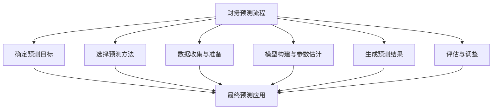
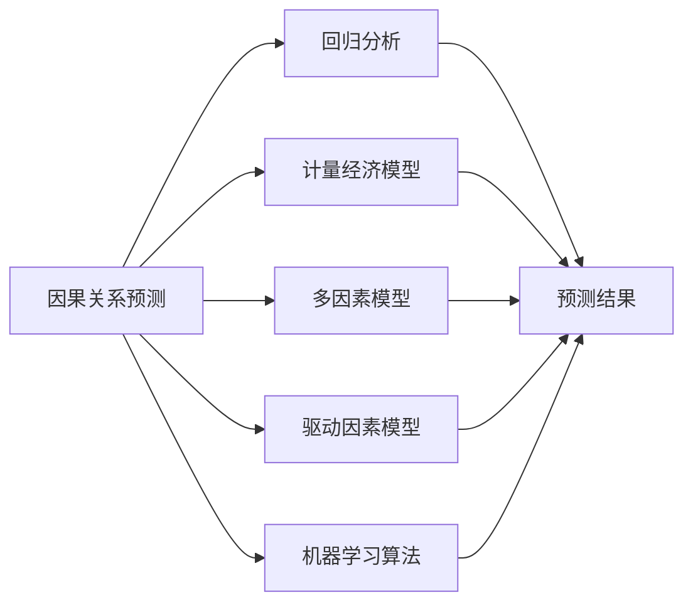
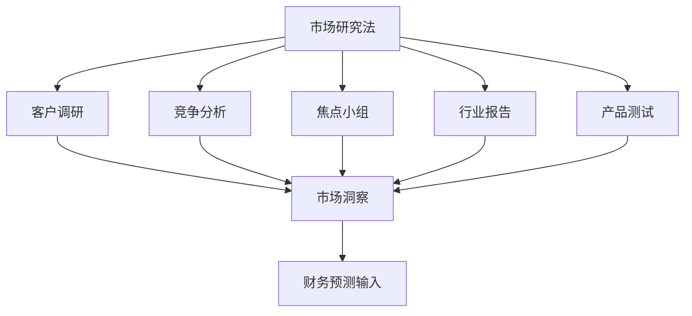
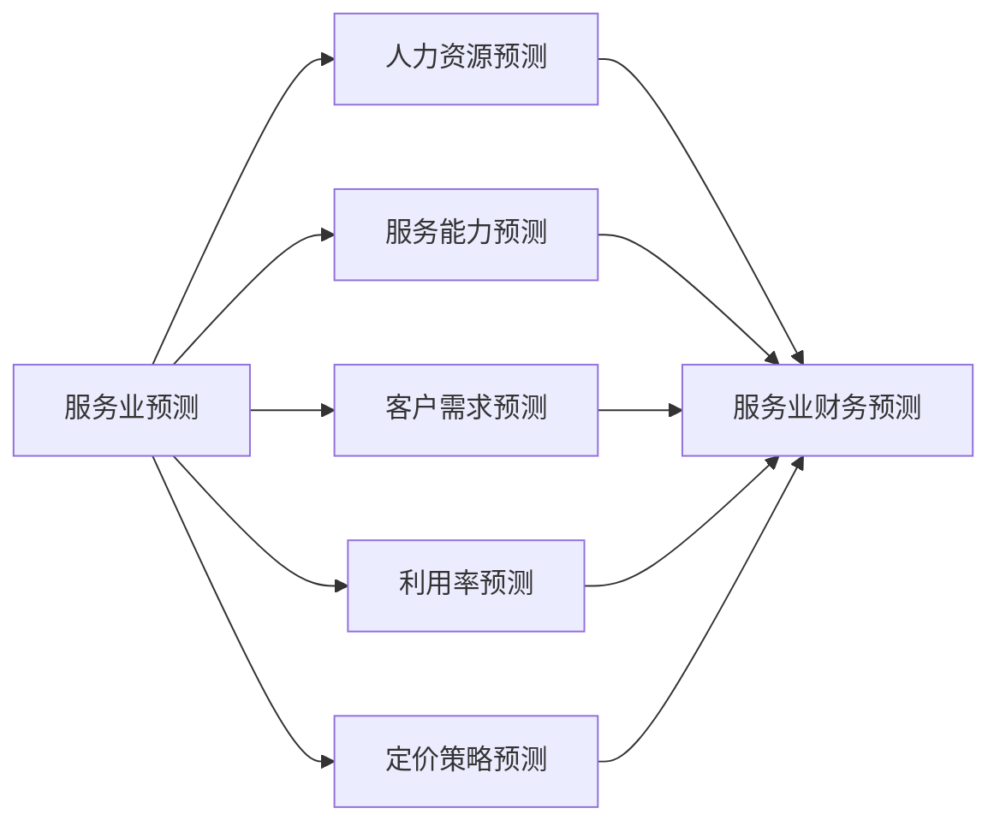
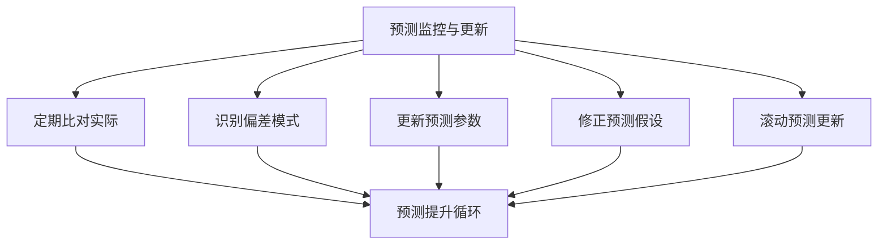
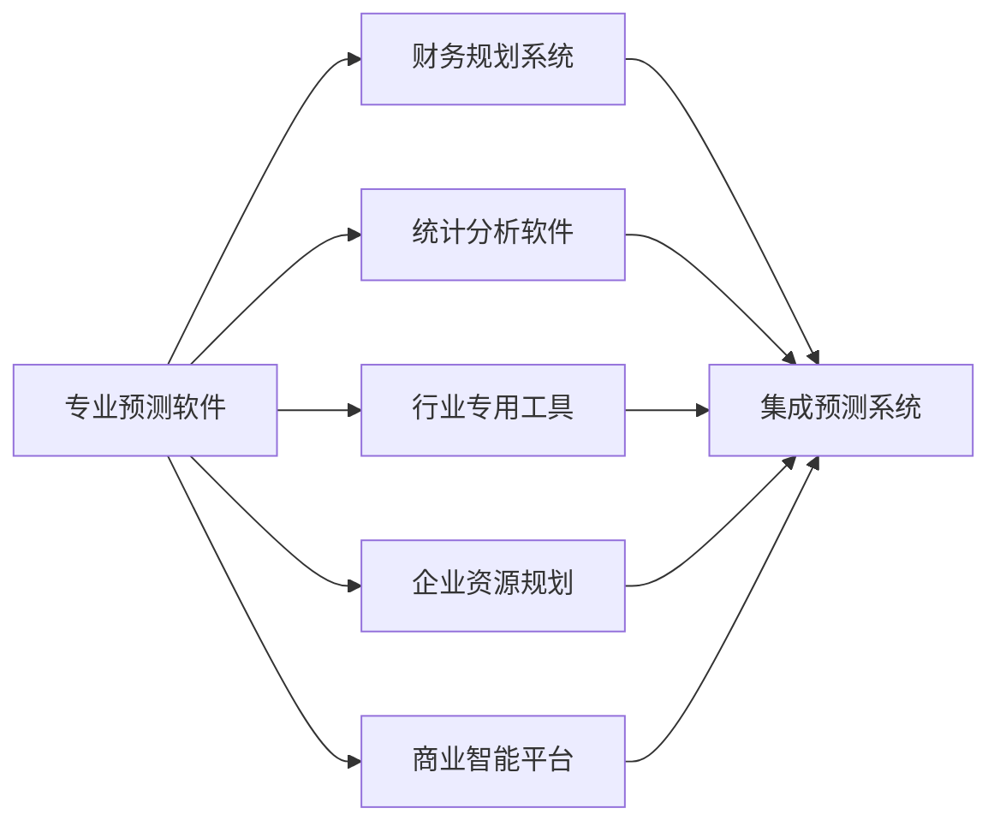

---
{"tags":["财务BP","财务预测","预算管理","建模方法","财务规划"],"aliases":"财务预测技术,预测方法论,业务规划预测","created":"2024-03-20","dg-publish":true,"permalink":"/知识共享/01_财务BP/01_学习内容/06_BP工具与模板/财务建模/BP财务预测方法/","dgPassFrontmatter":true}
---

# BP财务预测方法

> [!abstract] 概述
> 本文档详细介绍财务BP工作中常用的财务预测方法、应用场景和实践技巧。财务预测是业务规划过程中的核心环节，其准确性直接影响企业决策的有效性。本文讨论了定量与定性预测方法、行业特殊预测技术、预测准确性评估方法以及预测工具应用，旨在为财务BP提供全面的预测方法指南。

## 一、财务预测的基本概念

### 1. 财务预测的定义与目的
- **定义**：对未来财务状况、经营成果和现金流量的科学估计
- **目的**：为决策提供依据、指导资源分配、评估战略可行性
- **关键维度**：时间跨度、精确程度、更新频率
- **主要应用**：预算编制、财务规划、投资评估、现金管理
- **挑战**：不确定性、数据可得性、环境变化

### 2. 预测框架与流程

### 3. 预测维度与粒度
- **时间维度**：短期(1-3个月)、中期(1年)、长期(3-5年)
- **业务维度**：产品线、客户群、地区、部门
- **财务维度**：收入、成本、利润、现金流
- **精度要求**：预算级(高精度)、规划级(中精度)、展望级(低精度)
- **更新节奏**：固定周期、滚动更新、触发式更新

### 4. 预测基础数据
- **历史数据**：内部历史财务和运营数据
- **市场数据**：行业趋势、竞争情报、市场份额
- **宏观数据**：经济指标、监管环境、行业政策
- **内部计划**：战略计划、营销计划、产能计划
- **假设集**：关键假设与驱动因素

## 二、定量预测方法

### 1. 时间序列分析法
- **移动平均法**：简单移动平均、加权移动平均
- **指数平滑法**：单指数平滑、双指数平滑、三指数平滑(Holt-Winters)
- **趋势分析**：线性趋势、非线性趋势、季节性调整
- **ARIMA模型**：自回归、移动平均、差分整合
- **分解法**：趋势、季节性、周期性和随机成分分解

### 2. 因果关系预测法

### 3. 驱动因素模型
- **收入驱动因素**：客户数、价格、使用频率、市场渗透率
- **成本驱动因素**：产量、人员数量、原材料价格、利用率
- **资本支出驱动因素**：产能需求、替换周期、技术更新
- **营运资本驱动因素**：销售额、库存周转率、账期变化
- **敏感性分析**：关键驱动因素变动对预测的影响

### 4. 概率模型与模拟
- **蒙特卡洛模拟**：基于随机变量的多情景模拟
- **情景分析**：最佳、基准、最差情景构建
- **决策树分析**：基于条件概率的预测方法
- **风险调整预测**：纳入风险因素的预测调整
- **贝叶斯方法**：结合先验信息和新数据的预测更新

### 5. 高级预测技术
- **机器学习预测**：随机森林、支持向量机、神经网络
- **深度学习应用**：用于复杂模式识别的预测
- **自然语言处理**：从非结构化数据中提取预测信号
- **组合预测方法**：多模型集成预测
- **自适应模型**：根据新数据动态调整的预测模型

## 三、定性预测方法

### 1. 专家判断法
- **德尔菲法**：结构化的专家意见收集与综合
- **管理层预测**：基于管理经验的预测调整
- **销售团队预测**：前线销售人员的市场预判
- **专家小组讨论**：多领域专家联合预测
- **关键客户反馈**：基于客户规划的预测调整

### 2. 市场研究法

### 3. 类比推理法
- **历史类比**：基于相似历史事件的预测
- **产品类比**：基于相似产品表现的预测
- **市场类比**：基于相似市场发展的预测
- **跨行业类比**：从其他行业借鉴发展模式
- **阶段类比**：根据企业发展阶段特征预测

### 4. 混合预测方法
- **德尔菲-驱动模型**：结合专家判断和驱动因素
- **历史数据-市场研究结合**：将定量和定性方法整合
- **自下而上与自上而下结合**：多角度校准预测
- **短期精细与长期概括结合**：不同时间周期精度调整
- **反向预测法**：从目标倒推所需的业务假设

## 四、行业特殊预测方法

### 1. 制造业预测方法
- **产能利用预测**：基于设备产能和利用率的产出预测
- **材料成本预测**：结合价格走势和用量的成本预测
- **库存水平预测**：基于销售预测和生产计划的库存预测
- **设备维护预测**：预测性维护的成本和停机影响
- **生产效率预测**：生产效率改进对成本的影响预测

### 2. 服务业预测方法

### 3. 科技企业预测方法
- **用户增长预测**：获客、激活、留存的用户增长模型
- **收入转化预测**：用户到付费客户的转化率预测
- **研发投入预测**：研发周期和资源需求预测
- **技术采用曲线**：新技术市场采用速度的S曲线预测
- **数字经济指标**：CAC、LTV、Churn等关键指标预测

### 4. 初创企业预测方法
- **市场验证预测**：基于早期市场反馈的规模预测
- **融资阶段预测**：不同融资阶段的业务发展预测
- **现金消耗率预测**：资金耗尽时间(Runway)预测
- **规模化拐点预测**：业务规模化临界点预测
- **增长速率预测**：基于增长驱动因素的速率预测

### 5. 零售业预测方法
- **销售季节性预测**：捕捉季节性模式的销售预测
- **促销影响预测**：促销活动对销售的提升预测
- **价格弹性预测**：价格变动对销量的影响预测
- **货架空间优化**：基于销售预测的库存分配
- **全渠道销售预测**：整合线上线下的销售预测

## 五、预测准确性评估与改进

### 1. 预测误差测量
- **平均绝对误差(MAE)**：绝对误差的平均值
- **平均绝对百分比误差(MAPE)**：相对误差的平均值
- **均方根误差(RMSE)**：误差平方和的平方根
- **跟踪信号**：累积误差与平均绝对偏差的比率
- **预测偏差**：系统性高估或低估的衡量

### 2. 预测监控与更新

### 3. 常见预测错误剖析
- **假设不合理**：关键假设与实际不符
- **模型选择不当**：预测方法与业务特性不匹配
- **数据质量问题**：输入数据不准确或不完整
- **过拟合与欠拟合**：模型复杂度不当
- **环境突变无法捕捉**：外部环境剧变超出模型能力

### 4. 预测改进策略
- **组合预测法**：多种预测方法结果综合
- **预测区间代替点预测**：提供预测范围而非单点
- **预测颗粒度调整**：调整预测的时间和业务维度精细度
- **持续回顾与学习**：系统性分析预测与实际差异
- **预测流程标准化**：建立标准预测流程和责任机制

## 六、财务BP预测工具与技术

### 1. 电子表格预测工具
- **Excel高级应用**：数据表、场景管理、数据分析工具包
- **Google Sheets协作**：团队协作预测与实时更新
- **模板库开发**：标准化预测模板库构建
- **宏与VBA应用**：自动化预测流程
- **数据可视化**：预测结果的动态图表展示

### 2. 专业预测软件

### 3. 数据集成与管理
- **数据仓库整合**：集成多源数据的仓库建设
- **自动数据采集**：自动化数据采集和更新机制
- **数据清洗流程**：预测前的数据准备和清洗
- **元数据管理**：预测数据的一致性和治理
- **数据版本控制**：预测输入数据的版本管理

### 4. 预测流程自动化
- **数据采集自动化**：自动从业务系统提取预测数据
- **计算过程自动化**：预测模型自动运行和更新
- **报告生成自动化**：自动生成预测报告和可视化
- **差异分析自动化**：自动比对预测与实际结果
- **更新提醒机制**：预测更新提醒和审批流程

### 5. 新兴技术应用
- **AI辅助预测**：人工智能增强的预测技术
- **区块链数据验证**：提高预测数据可靠性
- **云计算扩展性**：云端预测模型的可扩展应用
- **移动预测应用**：移动设备上的预测查看和调整
- **数字孪生应用**：业务数字孪生模型的预测能力

## 七、案例分析

### 案例1：制造企业销售预测体系改造
**背景**：某大型制造企业面临销售预测准确率低的问题，导致库存积压和生产计划频繁调整，影响运营效率和成本控制。

**挑战**：
1. 销售预测主要依赖销售人员经验，主观性强
2. 未充分考虑季节性和促销活动影响
3. 预测颗粒度不足，无法支持精细化生产计划
4. 预测与实际偏差大，无系统化改进机制
5. 各部门预测不一致，形成各自"信息孤岛"

**解决方案**：
1. **多方法整合模型**
   - 构建时间序列基础模型捕捉历史模式
   - 结合销售团队判断进行修正
   - 引入市场事件因素(促销、节假日)调整
   - 建立竞争产品数据监测机制

2. **分层预测架构**
   - 品类级长期预测(12个月滚动)
   - 产品级中期预测(3个月滚动)
   - SKU级短期预测(每周更新)
   - 各层级预测联动和自动调整机制

3. **预测流程再造**
   - 建立"预测-计划-执行-分析"闭环
   - 明确各部门预测职责和协作机制
   - 实施预测准确率KPI考核
   - 标准化数据采集和预测规则

**实施效果**：
- 预测准确率从65%提升至88%
- 库存周转率提高30%
- 紧急生产调度减少70%
- 产品可用率提升15%
- 预测周期从月度缩短至周度

### 案例2：SaaS企业用户增长与收入预测模型
**背景**：某SaaS企业需要建立精准的用户增长和收入预测模型，为融资决策和资源分配提供依据。

**挑战**：
1. 快速增长环境下历史数据参考价值有限
2. 多种收入模式(免费增值、订阅、按用量)共存
3. 用户行为路径复杂，转化率波动大
4. 市场竞争格局快速变化
5. 需要同时服务短期运营和长期战略决策

**解决方案**：
1. **漏斗模型与同期群分析结合**
   - 构建获客-激活-转化-留存漏斗模型
   - 按获客渠道和用户特征建立同期群
   - 追踪同期群转化路径和生命周期价值
   - 预测新用户未来行为和价值

2. **驱动因素预测框架**
   - 识别核心增长驱动因素(营销投入、产品功能、定价策略)
   - 量化驱动因素对用户增长的影响关系
   - 建立"假设-验证-调整"的预测优化机制
   - 定期更新驱动因素权重

3. **收入预测与现金流预测分离**
   - 收入确认模型(按会计准则)
   - 现金流入模型(实际收款)
   - 递延收入预测
   - 续期率与升级率细分模型

**实施效果**：
- 用户增长预测准确率达80%以上
- 收入预测偏差降至10%以内
- 成功支持两轮融资决策
- 资源分配效率提升35%
- 建立了数据驱动的增长决策文化

## 八、最佳实践建议

1. **预测方法选择建议**
   - 根据预测目的选择适当复杂度的方法
   - 考虑数据可得性和质量选择方法
   - 短期预测优先考虑时间序列方法
   - 长期预测结合因果关系和定性判断
   - 不同粒度预测可采用不同方法

2. **预测流程优化建议**
   - 明确预测目标和使用场景
   - 标准化数据采集和处理流程
   - 建立预测与实际对比的常规回顾机制
   - 形成文档化的预测假设集
   - 建立预测结果的有效沟通渠道

3. **提升预测准确率建议**
   - 从多个角度验证预测合理性
   - 识别并特别关注高影响力变量
   - 结合内部专家和外部数据校准
   - 使用概率区间代替点预测
   - 建立系统性预测后分析(Post-mortem)

4. **预测体系建设建议**
   - 建立分层预测架构，满足不同需求
   - 实施滚动预测，定期更新和调整
   - 整合预测与计划流程形成闭环
   - 预测工具应平衡精度与易用性
   - 预测文化建设重在学习而非指责

## 相关链接

- [[知识共享/01_财务BP/01_学习内容/06_BP工具与模板/财务建模/财务模型设计原则\|知识共享/01_财务BP/01_学习内容/06_BP工具与模板/财务建模/财务模型设计原则]]
- [[知识共享/01_财务BP/01_学习内容/06_BP工具与模板/财务建模/常见预测错误及规避\|知识共享/01_财务BP/01_学习内容/06_BP工具与模板/财务建模/常见预测错误及规避]]
- [[知识共享/01_财务BP/01_学习内容/02_预算编制基础/收入预测方法/历史数据分析法\|历史数据分析法]]
- [[知识共享/01_财务BP/01_学习内容/06_BP工具与模板/财务软件应用/自动化报告生成\|自动化报告生成]]
- [[BP财务分析框架\|BP财务分析框架]]

## 参考文献

1. Makridakis, S., Wheelwright, S. C., & Hyndman, R. J. (2008). *Forecasting methods and applications*. Wiley.
2. Armstrong, J. S. (2001). *Principles of Forecasting: A Handbook for Researchers and Practitioners*. Springer.
3. Gilliland, M. (2016). *Business Forecasting: Practical Problems and Solutions*. Wiley.
4. 《企业财务预测方法与实践》，张静，中国财政经济出版社，2021.
5. 《财务预测与规划》，王力，经济管理出版社，2020.
6. 《数据驱动的财务预测》，李强，清华大学出版社，2022. 