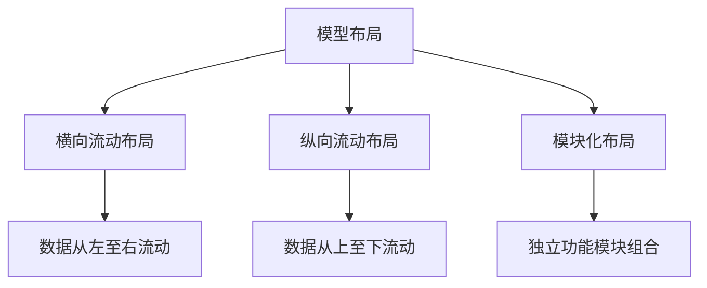
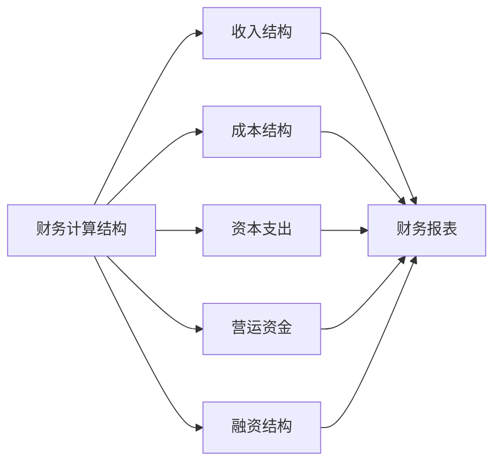
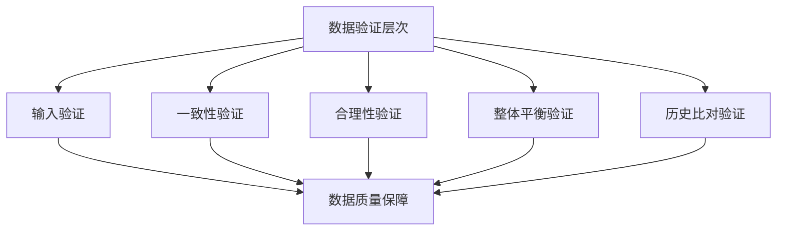
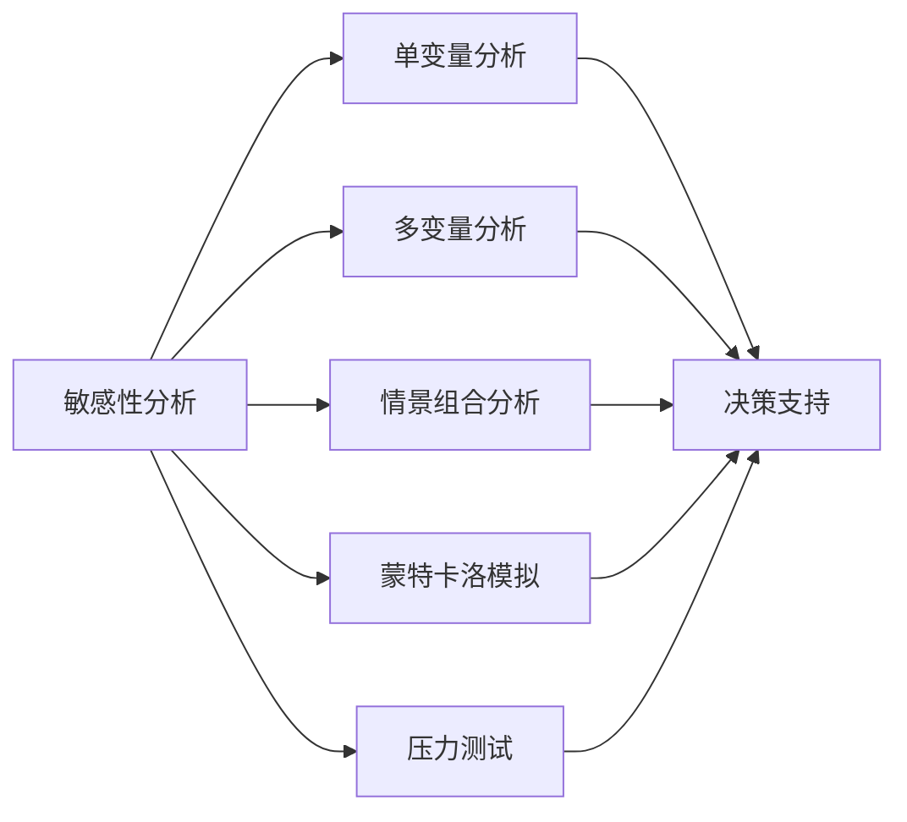
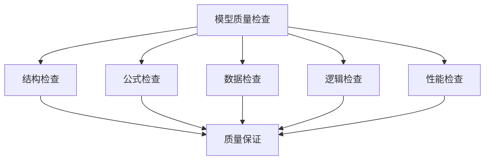
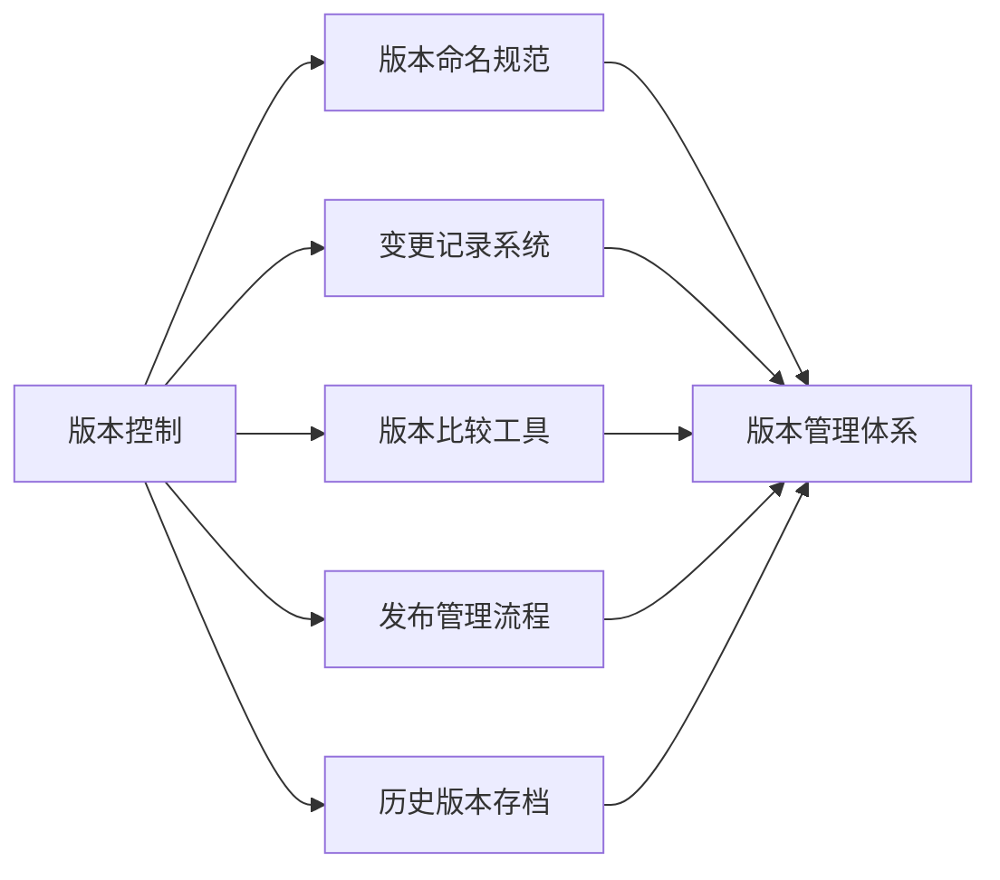
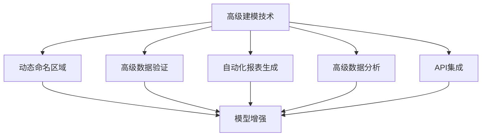
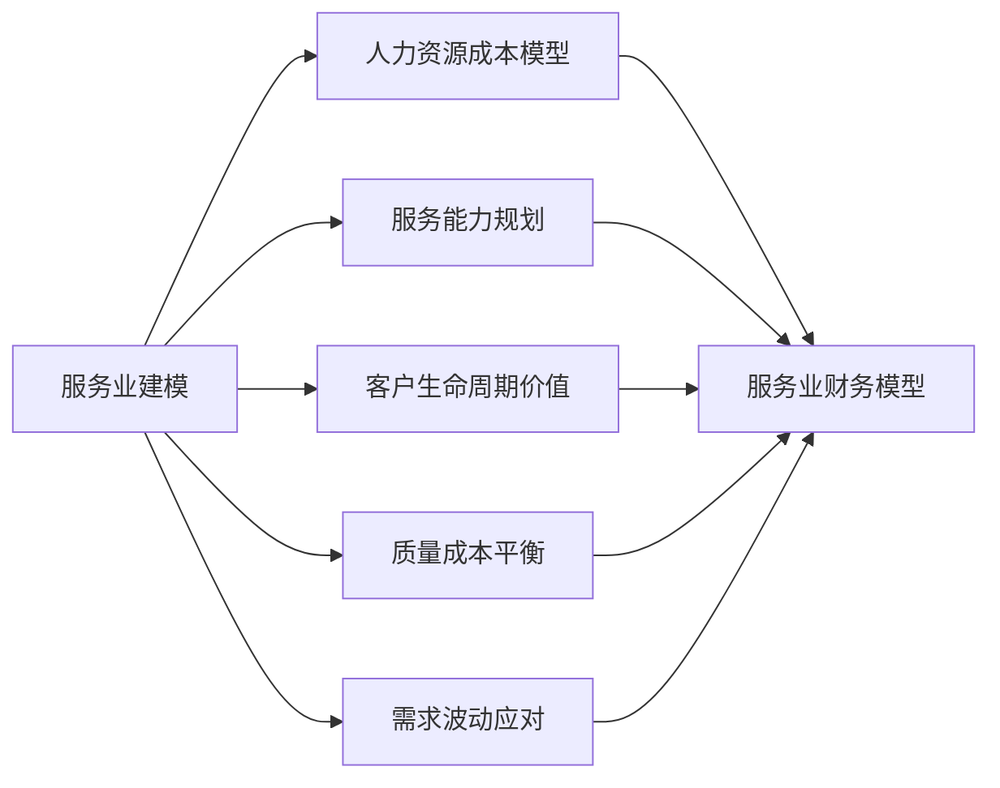
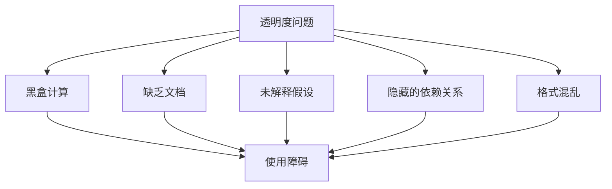

---
{"tags":["财务BP","财务建模","最佳实践","模型设计","建模标准"],"aliases":["财务模型规范","建模指南","财务模型质量标准"],"created":"2024-03-20","dg-publish":true,"permalink":"/知识共享/01_财务BP/01_学习内容/06_BP工具与模板/财务建模/财务建模最佳实践/","dgPassFrontmatter":true}
---

# 财务建模最佳实践

> [!abstract] 概述
> 本文档系统总结财务建模过程中的最佳实践方法和标准规范，涵盖财务模型的设计原则、结构布局、公式编写、数据处理、测试验证和维护管理等关键环节。通过遵循这些实践标准，财务BP能够构建高质量、可靠、实用的财务模型，为企业决策提供精准支持。

## 一、财务模型设计原则

### 1. 核心设计理念
- **目的导向**：模型设计始终围绕具体业务目的和决策需求
- **简洁性**：在满足需求的前提下保持模型简洁
- **可理解性**：模型逻辑和结构对非专业人士也清晰可懂
- **适应性**：能够适应业务变化和不同假设情景
- **可持续性**：易于维护和长期使用

### 2. 设计流程规范

### 3. 模型范围界定
- **明确模型目标**：清晰定义模型要解决的核心问题
- **确定输出需求**：明确模型需要生成的关键输出
- **识别关键假设**：确定模型的基础假设和限制条件
- **设置时间维度**：确定模型的时间跨度和预测周期
- **明确详细程度**：根据决策需要确定模型的颗粒度

### 4. 用户体验设计
- **直观操作流程**：设计符合用户思维的操作流程
- **一致的交互方式**：保持模型内操作方式的一致性
- **清晰的视觉层次**：通过格式和布局创建视觉层次
- **适当的自动化**：在关键环节引入自动化功能
- **错误预防与处理**：设计防错机制和友好的错误提示

### 5. 行业特定考量
- **制造业**：成本结构、生产计划和库存管理的精细化处理
- **服务业**：人力资源成本和服务能力弹性建模
- **科技企业**：考虑高度不确定性和非线性增长模式
- **初创企业**：关注现金流、融资节奏和快速迭代
- **零售业**：季节性模式、SKU级别分析和多渠道整合

## 二、模型结构与布局

### 1. 模型组织架构
- **标准化分页结构**
  - *输入页(Inputs)*：集中所有假设和输入参数
  - *计算页(Calculations)*：包含所有中间计算过程
  - *输出页(Outputs)*：呈现关键结果和分析
  - *仪表板(Dashboard)*：提供综合视图和交互界面
  - *文档页(Documentation)*：说明模型使用方法和假设

### 2. 物理布局设计

### 3. 标准化格式规范
- **颜色编码系统**
  - *蓝色*：输入单元格
  - *黑色*：计算单元格
  - *绿色*：直接链接
  - *红色*：重要输出或警示
  - *灰色*：不活跃或参考区域
  
- **一致的格式约定**
  - 货币格式：统一货币符号和小数位
  - 百分比格式：统一小数位和显示方式
  - 日期格式：采用标准日期格式
  - 数值格式：千位分隔符和小数位一致
  - 字体使用：标题和正文字体区分

### 4. 导航与引用系统
- **超链接导航**：在各页面间建立快速导航链接
- **目录页**：创建模型整体目录和导航路径
- **命名区域**：为关键区域创建易理解的命名
- **交叉引用**：建立数据间的清晰引用关系
- **文档映射**：创建模型结构和逻辑流程图

### 5. 模板标准化
- **标准模板开发**：建立企业通用财务模型模板
- **模块化组件库**：开发可重用的模型功能模块
- **版本控制规范**：建立模板版本管理和更新机制
- **审批流程**：模板变更的审核和批准流程
- **最佳实践库**：收集和分享模板使用的最佳实践

## 三、公式与计算设计

### 1. 公式编写原则
- **简洁性**：避免复杂嵌套和冗长公式
- **可读性**：使用命名区域和清晰结构提高可读性
- **可追溯性**：保持计算逻辑清晰可跟踪
- **一致性**：相似计算采用一致的公式结构
- **灵活性**：设计能适应变化的计算逻辑

### 2. 常见计算结构规范

### 3. 公式复杂度管理
- **分解复杂计算**：将复杂计算拆分为简单步骤
- **使用辅助计算区**：为中间计算创建专用区域
- **构建计算层次**：从基础计算到高级指标建立层次
- **限制嵌套层级**：控制公式嵌套不超过3-4层
- **使用命名公式**：为复杂计算创建命名公式

### 4. 循环引用与迭代计算
- **识别循环依赖**：明确识别模型中的循环依赖关系
- **正确处理迭代计算**：针对特定迭代需求设计解决方案
- **避免不必要循环**：重构模型避免非必要循环引用
- **控制迭代收敛**：设置适当的收敛条件和迭代限制
- **记录迭代逻辑**：清晰记录迭代计算的逻辑和处理方法

### 5. 高级计算技术
- **数据表功能**：使用数据表进行敏感性分析
- **矩阵公式**：在适当场景使用矩阵计算提高效率
- **条件逻辑**：规范使用IF、SWITCH等条件函数
- **查找与引用**：标准化VLOOKUP、INDEX-MATCH使用
- **财务函数应用**：规范IRR、NPV等财务函数的使用

## 四、数据处理与验证

### 1. 数据导入规范
- **数据预处理流程**：建立数据清洗和转换流程
- **标准化导入接口**：创建一致的数据导入界面
- **数据映射规则**：建立外部数据到模型的映射关系
- **数据格式验证**：验证输入数据的格式和有效性
- **导入日志记录**：记录数据来源、时间和处理步骤

### 2. 数据验证机制

### 3. 错误检测与处理
- **错误类型分类**：区分数据错误、计算错误和逻辑错误
- **错误标记系统**：开发错误标记和提示系统
- **异常值检测**：建立异常值识别机制
- **错误传播追踪**：追踪错误在模型中的传播路径
- **错误修复流程**：制定标准化的错误处理流程

### 4. 数据完整性保障
- **空值处理策略**：明确空值、零值和缺失值的处理方法
- **数据边界检查**：验证数据是否在合理范围内
- **交叉验证**：通过多途径计算验证关键数据
- **总和核对**：确保各级汇总与明细一致
- **历史趋势比对**：与历史数据进行合理性比对

### 5. 高级数据处理技术
- **分类汇总处理**：标准化多维度数据汇总方法
- **条件聚合计算**：规范条件汇总和筛选计算
- **动态数据范围**：处理可变长度数据序列
- **大规模数据处理**：优化大量数据的处理方法
- **数据可视化准备**：为可视化需求准备数据结构

## 五、情景分析与敏感性测试

### 1. 情景设计框架
- **基准情景定义**：建立代表最可能结果的基准情景
- **情景多样性确保**：设计涵盖各种可能性的情景组合
- **关键变量识别**：确定影响结果的核心变量
- **情景相关性检验**：确保情景内部假设的一致性
- **情景概率分配**：为不同情景分配合理的发生概率

### 2. 敏感性分析方法

### 3. 情景管理工具
- **情景控制面板**：创建集中控制各情景的界面
- **情景存储系统**：保存和恢复不同情景设置
- **情景比较工具**：便于比较不同情景结果
- **情景切换机制**：快速在情景间切换的机制
- **情景文档记录**：记录每个情景的假设和逻辑

### 4. 敏感度指标设计
- **弹性系数计算**：测量输出对输入变化的敏感程度
- **临界点分析**：确定变量导致结果改变的临界值
- **敏感度排序**：排列变量按影响程度的顺序
- **交互效应评估**：评估多变量交互对结果的影响
- **敏感度可视化**：直观展示敏感度分析结果

### 5. 高级情景技术
- **蒙特卡洛模拟**：使用概率分布进行随机模拟
- **情景优化分析**：寻找最优参数组合
- **决策树分析**：构建决策路径和结果分析
- **极端情景测试**：测试模型在极端条件下的表现
- **自动化情景生成**：批量生成和分析大量情景

## 六、模型测试与质量保证

### 1. 测试框架设计
- **测试计划开发**：制定全面的财务模型测试计划
- **测试种类定义**：明确单元测试、集成测试和系统测试
- **测试用例设计**：为各功能模块创建标准测试用例
- **测试流程标准化**：建立标准化测试执行流程
- **自动化测试实施**：开发自动化测试脚本和工具

### 2. 质量检查清单

### 3. 常见错误防范
- **硬编码数字防范**：避免在公式中嵌入硬编码数值
- **链接错误检测**：检查和修复错误的单元格引用
- **循环错误处理**：识别和处理不当的循环引用
- **公式不一致检查**：确保相似计算使用一致公式
- **隐藏错误检测**：排查和修复隐藏的计算错误

### 4. 验证与审计方法
- **交叉验证技术**：使用多种方法验证计算结果
- **追踪审计**：追踪关键计算从输入到输出的路径
- **公式审计工具**：使用专业工具审计公式和引用
- **结果合理性检验**：验证结果在逻辑合理范围内
- **第三方审核流程**：邀请独立方审核模型质量

### 5. 模型文档标准
- **目的与范围说明**：明确记录模型的目的和适用范围
- **假设与限制文档**：详细说明模型的基础假设和限制
- **使用指南编写**：创建详细的模型使用指南
- **计算逻辑说明**：解释关键计算的逻辑和步骤
- **变更记录维护**：记录模型的所有重要变更

## 七、模型维护与版本管理

### 1. 生命周期管理
- **模型生命周期规划**：规划模型从开发到退役的完整周期
- **定期审查机制**：建立模型定期审查和更新机制
- **扩展与升级计划**：制定模型功能扩展和升级路线图
- **使用反馈收集**：收集和分析用户使用反馈
- **退役与存档流程**：制定模型退役和历史存档流程

### 2. 版本控制体系

### 3. 模型更新规范
- **更新触发条件**：明确定义需要更新模型的条件
- **更新优先级分类**：根据重要性和紧急性分类更新
- **更新影响评估**：评估更新对模型整体的影响
- **更新测试流程**：在实施前测试更新的效果
- **更新文档要求**：详细记录每次更新的内容和原因

### 4. 知识传承与培训
- **模型知识记录**：记录模型开发和使用的关键知识
- **用户培训计划**：制定模型使用的培训计划
- **知识共享机制**：建立团队内模型知识共享机制
- **操作手册维护**：定期更新模型操作手册
- **专家支持系统**：建立模型使用的专家支持系统

### 5. 技术债务管理
- **技术债务识别**：识别模型中的技术债务
- **重构优先级设定**：确定重构的优先领域
- **渐进式改进计划**：制定渐进式模型优化计划
- **代码质量度量**：建立评估公式质量的指标
- **长期可维护性管理**：确保模型的长期可维护性

## 八、财务建模工具与技术

### 1. 软件工具选择
- **电子表格工具对比**：Excel、Google Sheets等工具选择
- **专业建模软件**：评估专业财务建模软件的适用性
- **辅助工具整合**：数据可视化、审计工具的整合
- **协作平台选择**：支持团队协作的平台选择
- **版本控制工具**：适合财务模型的版本控制工具

### 2. 高级建模技术

### 3. 模型自动化策略
- **输入自动化**：自动化数据采集和输入流程
- **计算自动化**：优化自动计算和更新机制
- **报告生成自动化**：自动生成标准化报告
- **更新通知机制**：建立模型更新的自动通知
- **批处理操作**：设计批量处理和分析功能

### 4. 协作建模方法
- **角色与权限设计**：明确定义不同用户的角色和权限
- **并行工作流程**：允许多人同时处理不同模块
- **变更跟踪系统**：追踪和管理多人的变更
- **评论与反馈机制**：在模型内提供评论和反馈通道
- **冲突解决流程**：建立协作过程中冲突的解决机制

### 5. 新兴技术应用
- **机器学习整合**：在适当场景引入机器学习预测
- **自然语言处理**：使用NLP提升用户交互体验
- **云计算应用**：利用云服务提升计算能力和可访问性
- **大数据技术**：处理和分析海量财务数据
- **数字孪生概念**：构建业务运营的数字孪生模型

## 九、行业特定建模实践

### 1. 制造业建模实践
- **产品成本建模**：精细化的产品成本构成分析
- **产能规划模型**：产能限制与利用率优化模型
- **生产计划整合**：将生产计划与财务预测整合
- **供应链财务影响**：评估供应链变动的财务影响
- **库存优化模型**：平衡库存成本与服务水平的模型

### 2. 服务业建模实践

### 3. 科技企业建模实践
- **增长曲线建模**：适应非线性增长模式的预测
- **用户经济学模型**：深入分析用户获取成本和价值
- **研发投入回报**：评估研发投入的长期回报
- **订阅模式分析**：针对订阅业务模式的财务分析
- **快速迭代支持**：支持敏捷业务模式的灵活建模

### 4. 初创企业建模实践
- **现金消耗率分析**：精确追踪和预测现金消耗
- **融资阶段规划**：各轮融资的财务影响模型
- **快速增长假设**：处理高增长率假设的方法
- **估值模型构建**：适合不同阶段的估值模型
- **敏捷预算模型**：支持频繁调整的敏捷预算机制

### 5. 零售业建模实践
- **商品组合优化**：基于毛利和周转的商品组合模型
- **多渠道分析**：整合线上线下渠道的财务分析
- **季节性需求模型**：精确捕捉季节性波动的模型
- **促销效果分析**：量化促销活动财务影响的模型
- **位置经济学**：店铺位置价值评估模型

## 十、案例分析

### 案例1：制造企业综合预算模型
**背景**：某中型制造企业建立集成化预算模型，连接销售预测、生产计划、采购预算、人力资源规划和财务报表。

**模型设计要点**：
1. **模块化架构**
   - 各功能模块独立设计，通过标准化接口连接
   - 中央假设库集中管理所有关键假设
   - 情景控制器允许全局情景切换
   - 灵活的报表生成器支持多角度分析

2. **关键技术实现**
   - 产能约束引擎计算实际产出上限
   - 动态物料需求计划根据销售预测自动调整
   - 人力资源优化模块计算最佳人力配置
   - 现金流预测引擎提供90天滚动现金预测
   - 整合敏感性分析显示利润对关键变量的弹性

**应用效果**：
- 预算编制时间从6周缩短至2周
- 预算准确性提高28%
- 资源分配效率提升18%
- 跨部门协作显著改善
- 决策响应时间缩短65%

### 案例2：科技企业估值与融资模型
**背景**：一家快速增长的SaaS企业开发融资决策支持模型，评估不同融资方案和增长策略。

**模型设计要点**：
1. **核心结构设计**
   - 用户获取与转化漏斗模型
   - 客户生命周期价值计算引擎
   - 多阶段增长情景引擎
   - 资金需求与消耗预测器
   - 融资方案比较分析工具

2. **创新方法应用**
   - 同期群分析追踪客户行为变化
   - 概率加权多情景分析
   - 蒙特卡洛模拟评估风险分布
   - 规模经济动态成本曲线
   - 敏捷决策支持仪表板

**应用效果**：
- 精确预测了18个月内的现金需求
- 帮助确定最优融资时机和金额
- 提供投资者沟通所需的关键指标
- 帮助管理团队理解增长与盈利权衡
- 支持制定实现盈亏平衡的路线图

## 十一、常见陷阱与规避措施

### 1. 模型复杂性陷阱
- **过度复杂化**：追求完美导致模型过于复杂
- **功能蔓延**：不断添加功能导致焦点模糊
- **关系迷宫**：过多相互依赖的计算关系
- **数据过载**：收集过多非关键数据
- **规避措施**：严格遵循"够用即好"原则，定期审查简化机会

### 2. 透明度与可理解性问题

### 3. 数据与假设陷阱
- **历史数据依赖**：过度依赖历史模式预测未来
- **假设固化**：长期未更新关键假设
- **单一情景思维**：仅关注最可能的情景
- **确认偏见**：选择性使用支持预期结论的数据
- **规避措施**：建立假设审查机制，强制多情景分析

### 4. 技术实现错误
- **硬编码蔓延**：模型中扩散的硬编码数值
- **公式不一致**：相似计算使用不同公式
- **脆弱结构**：小变动导致大范围失效
- **性能瓶颈**：计算密集导致响应缓慢
- **规避措施**：实施严格的模型审计和性能优化

### 5. 使用与维护问题
- **使用门槛过高**：专业性要求阻碍推广使用
- **知识孤岛**：关键知识集中于少数人
- **版本失控**：多版本并行导致混乱
- **维护负担过重**：更新和维护成本过高
- **规避措施**：强化用户培训，简化界面，建立知识共享机制

## 十二、最佳实践建议

1. **规划与设计阶段**
   - 投入足够时间理解业务需求和决策环境
   - 在动手前先绘制完整的模型结构图
   - 明确定义输入、计算和输出的边界
   - 与最终用户共同设计界面和交互方式
   - 规划适当的灵活性，预留未来扩展空间

2. **开发与实施阶段**
   - 采用迭代开发方法，先完成核心功能再逐步扩展
   - 坚持一致的命名和格式惯例
   - 创建详细的模型使用指南和假设说明
   - 实施全面的测试计划，包括极端情况测试
   - 组织用户培训和反馈收集

3. **维护与更新阶段**
   - 建立定期维护计划和责任制度
   - 记录所有模型变更和优化历史
   - 定期验证假设和检查计算准确性
   - 收集用户反馈并持续改进
   - 建立模型知识分享和传承机制

4. **模型质量控制**
   - 使用标准化的质量检查清单
   - 实施同行评审和交叉验证
   - 比较模型结果与实际结果的偏差
   - 测试模型在极端情况下的稳定性
   - 定期进行全面模型审计

5. **财务BP专业发展**
   - 持续学习最新财务建模技术和工具
   - 加深对业务运营的理解
   - 培养数据分析和可视化能力
   - 发展有效沟通复杂模型结果的技巧
   - 参与行业社区和最佳实践分享

## 相关链接

- [[知识共享/01_财务BP/01_学习内容/06_BP工具与模板/财务建模/BP财务预测方法\|知识共享/01_财务BP/01_学习内容/06_BP工具与模板/财务建模/BP财务预测方法]]
- [[知识共享/01_财务BP/01_学习内容/06_BP工具与模板/财务建模/常见预测错误及规避\|知识共享/01_财务BP/01_学习内容/06_BP工具与模板/财务建模/常见预测错误及规避]]
- [[知识共享/01_财务BP/01_学习内容/06_BP工具与模板/财务建模/财务模型设计原则\|知识共享/01_财务BP/01_学习内容/06_BP工具与模板/财务建模/财务模型设计原则]]
- [[财务BP沟通技巧\|财务BP沟通技巧]]
- [[数据可视化最佳实践\|数据可视化最佳实践]]

## 参考文献

1. Benninga, S. (2014). *Financial Modeling*. MIT Press.
2. Pignataro, P. (2020). *Financial Modeling and Valuation: A Practical Guide to Investment Banking and Private Equity*. Wiley.
3. Sengupta, C. (2009). *Financial Modeling Using Excel and VBA*. Wiley Finance.
4. Tjia, J. S. (2009). *Building Financial Models*. McGraw-Hill.
5. 《财务建模:原理、方法与最佳实践》，刘振山，中国财政经济出版社，2019.
6. 《财务模型构建实务》，张明，中信出版社，2021.
7. 《Excel财务建模实战指南》，李强，电子工业出版社，2020. 