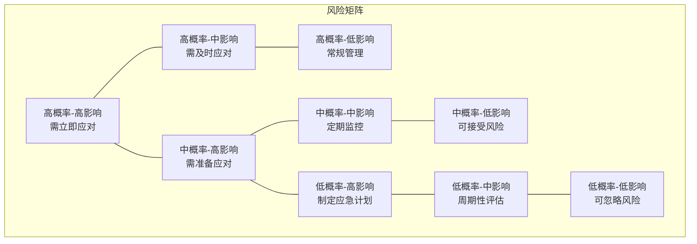

---
{"tags":["财务BP","风险评估","决策支持","不确定性分析"],"aliases":["风险分析模型","风险量化工具"],"created":"2023-11-16","dg-publish":true,"permalink":"/知识共享/01_财务BP/01_学习内容/06_BP工具与模板/高级分析/风险评估模型/","dgPassFrontmatter":true}
---

# 风险评估模型

## 概述
风险评估是财务BP过程中的关键环节，通过系统化方法识别、量化和应对潜在风险，提高预算和预测的可靠性。本文介绍财务BP中常用的风险评估模型、工具和应用方法。

## 风险评估基础
### 风险的定义与分类
风险指未来事件的不确定性对预期目标的潜在影响，在财务BP中主要包括：

- **财务风险**：利率变化、汇率波动、信贷风险等
- **市场风险**：需求波动、价格变化、竞争加剧等
- **运营风险**：供应链中断、生产效率下降、质量问题等
- **战略风险**：商业模式转变、技术革新、行业变革等
- **合规风险**：法规变更、政策调整、税务变化等

### 风险评估流程

1. **风险识别**：系统化识别可能影响目标实现的各种风险
2. **风险分析**：评估风险发生的概率和潜在影响程度
3. **风险评价**：确定风险优先级和是否需要应对
4. **风险应对**：制定风险应对策略和行动计划
5. **监控与报告**：持续监控风险变化并定期报告

## 核心风险评估模型
### 概率-影响矩阵
最常用的风险评估工具，通过评估风险发生的概率和影响程度，直观呈现风险优先级。

**矩阵示例**：

### 期望货币价值分析(EMV)
通过计算风险事件的概率与其财务影响的乘积，量化风险的期望价值。

**计算公式**：EMV = Σ(概率 × 影响值)

### 决策树分析
通过树状图结构展示不同决策路径和可能结果，评估各选项的风险和收益。

**应用场景**：投资决策、产品定价、市场进入策略等

### 蒙特卡洛模拟
通过大量随机模拟，评估关键变量不确定性对结果的综合影响，生成概率分布。

**实施步骤**：
1. 确定输入变量及其分布
2. 设置变量间相关性
3. 执行大量随机模拟
4. 分析结果分布

### 敏感性分析
评估单个变量变化对结果的影响程度，识别关键风险因素。

**呈现方式**：龙卷风图、蜘蛛网图、敏感性表格等

## BP中的风险评估应用
### 收入预测风险评估
评估影响收入实现的风险因素：
- 市场需求波动
- 价格变化风险
- 竞争加剧风险
- 产品接受度风险

**工具示例**：基于历史数据的波动性分析、市场景气指数关联分析

### 成本预算风险评估
识别影响成本控制的风险因素：
- 原材料价格波动
- 人力成本变化
- 供应链中断风险
- 生产效率风险

**方法示例**：成本敏感性分析、关键成本驱动因素监控

### 现金流风险评估
评估影响现金流的风险因素：
- 收款延迟风险
- 融资风险
- 流动性短缺风险
- 汇率波动风险

**模型示例**：现金流压力测试、流动性缺口分析

### 资本支出风险评估
分析资本投资的风险因素：
- 投资回报不确定性
- 项目延期风险
- 成本超支风险
- 技术风险

**工具示例**：投资决策树、项目风险量化模型

## 风险评估报告与可视化
### 风险热图
使用颜色编码直观呈现风险等级，红色表示高风险区域，绿色表示低风险区域。

### 风险雷达图
多维度展示组织面临的各类风险及其严重程度。

### 风险瀑布图
展示各风险因素对总体风险的贡献度及累积效应。

### 风险分布图
呈现风险结果的概率分布，包括均值、中位数、极端值等。

## 案例分析

### 案例一：制造业企业成本风险评估
某制造业企业通过风险评估模型分析年度成本预算的风险因素：

1. **风险识别**：识别原材料价格波动、能源成本上升、劳动力成本增加等风险
2. **概率影响评估**：评估各风险发生概率和财务影响
3. **蒙特卡洛模拟**：模拟产生成本预算可能结果的概率分布
4. **应对策略**：针对高风险项目制定套期保值、备选供应商、库存优化等策略

**结果**：通过实施风险应对措施，企业在原材料价格上涨15%的市场环境下，将成本上升控制在5%以内。

### 案例二：科技公司产品收入风险评估
某科技公司对新产品收入预测进行风险评估：

1. **决策树分析**：构建产品定价和市场推广的决策树
2. **情景分析**：设计乐观、基准、悲观三种市场接受度情景
3. **敏感性分析**：分析价格、市场渗透率等因素对收入的影响
4. **风险应对**：制定灵活定价策略和分阶段投资计划

**结果**：公司通过风险导向的收入预测，制定了阶段性目标和触发式投资策略，在市场反应低于预期时快速调整，降低了投资损失。

## 实施挑战与解决方案
### 数据质量挑战
- **问题**：历史数据不足或质量不佳
- **解决方案**：结合外部数据、行业基准和专家判断

### 定量化难题
- **问题**：部分风险难以量化
- **解决方案**：采用半定量评分方法，结合定性和定量分析

### 相关性复杂性
- **问题**：风险因素间相关性复杂
- **解决方案**：使用相关矩阵和情景分析捕捉系统性风险

### 执行一致性
- **问题**：不同团队评估标准不一致
- **解决方案**：建立标准化评估框架和培训机制

## 最佳实践
1. **整合业务流程**：将风险评估整合到BP的常规流程中
2. **平衡复杂性**：根据决策重要性选择适当复杂度的模型
3. **持续更新**：定期更新风险评估，反映最新情况
4. **跨部门协作**：吸纳各部门专业知识进行综合评估
5. **可视化决策支持**：使用直观的可视化工具支持决策制定

## 相关工具与资源
### 软件工具
- **@Risk**：基于Excel的风险分析和模拟工具
- **Crystal Ball**：Oracle提供的风险分析和预测工具
- **Risk Analyzer**：财务风险建模和分析工具
- **R语言统计包**：开源风险分析和建模工具

### 风险数据库
- 行业基准数据
- 历史风险事件数据库
- 宏观经济指标数据库

## 参考资料
1. Chapman, R. J. (2011). Simple Tools and Techniques for Enterprise Risk Management.
2. Damodaran, A. (2008). Strategic Risk Taking: A Framework for Risk Management.
3. Hubbard, D. W. (2009). The Failure of Risk Management: Why It's Broken and How to Fix It.
4. Project Management Institute. (2017). A Guide to the Project Management Body of Knowledge (PMBOK Guide).
5. Taleb, N. N. (2007). The Black Swan: The Impact of the Highly Improbable.
6. 《财务风险管理实务指南》，中国财务风险管理协会，2021年 