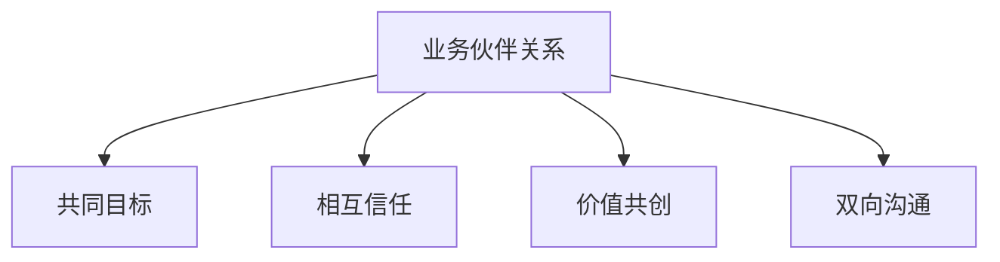

---
{"tags":["财务BP","角色定位","业务关系"],"aliases":["业务关系建立","伙伴关系发展"],"created":"2023-11-16","dg-publish":true,"permalink":"/知识共享/01_财务BP/01_学习内容/07_实践指南/BP角色定位/业务伙伴关系构建/","dgPassFrontmatter":true}
---

# 业务伙伴关系构建

## 概述

财务BP要真正成为业务部门的战略伙伴，必须突破传统财务人员的角色限制，构建深入且持久的业务伙伴关系。本文探讨财务BP如何与业务部门建立有效合作关系，实现从"财务审查者"到"业务伙伴"的转变，创造共同价值。

## 伙伴关系的本质

### 何为真正的伙伴关系

财务BP与业务部门的伙伴关系具有以下特征：

1. **共同目标**：财务BP与业务部门朝着相同的业务目标努力
2. **相互信任**：建立在专业能力与诚信基础上的信任关系
3. **价值共创**：共同参与决策过程，协作创造业务价值
4. **双向沟通**：开放、透明、频繁的双向信息流动

### 伙伴关系发展阶段

| 阶段 | 特征 | 关系性质 |
| ---- | ---- | -------- |
| 数据提供者 | 响应式提供财务数据 | 被动服务关系 |
| 问题解决者 | 协助解决财务相关问题 | 咨询支持关系 |
| 业务顾问 | 主动提供财务洞察和建议 | 顾问指导关系 |
| 战略伙伴 | 共同参与战略决策制定 | 平等合作关系 |

## 伙伴关系构建路径

### 了解业务

1. **业务流程学习**：系统学习业务部门的核心流程
2. **价值链分析**：理解业务价值创造链条与关键环节
3. **关键业务指标**：掌握业务部门关注的核心指标
4. **业务现场参与**：参与业务前线活动，获取一手体验

### 建立信任

1. **专业能力展示**：通过高质量财务分析展示专业能力
2. **承诺兑现**：严格遵守对业务部门的承诺
3. **主动增值**：提供超出预期的价值
4. **利益一致性**：将自身目标与业务部门目标保持一致

### 有效沟通

1. **沟通适配**：根据业务人员偏好调整沟通方式
2. **语言转换**：将财务术语转换为业务语言
3. **定期互动**：建立常态化沟通机制
4. **倾听理解**：真正理解业务部门的需求和挑战

### 价值证明

1. **快速价值展示**：通过小项目迅速展示合作价值
2. **问题联合解决**：协助解决业务部门面临的实际问题
3. **成功案例构建**：打造并宣传合作成功案例
4. **价值量化**：量化财务BP参与带来的业务改善

## 实施策略与方法

### 角色定位重塑

1. **自我定位调整**：从监督者转变为合作伙伴
2. **角色期望管理**：主动与业务部门沟通角色期望
3. **职责边界明确**：厘清支持与控制的边界
4. **新角色宣导**：向组织传达财务BP的新角色

### 组织结构支持

1. **物理位置调整**：考虑与业务部门共同办公
2. **汇报线优化**：建立与业务部门的直接汇报或虚线关系
3. **跨部门团队参与**：加入业务主导的跨部门项目
4. **组织文化构建**：推动支持业务伙伴关系的组织文化

### 能力发展计划

1. **业务知识培养**：系统学习业务知识与行业特性
2. **沟通技能提升**：加强演讲、谈判、说服等能力
3. **人际关系管理**：发展建立和维护关系的能力
4. **情商提升**：培养理解他人需求与动机的能力

### 关系管理制度

1. **业务伙伴协议**：制定财务BP与业务部门的合作协议
2. **定期回顾机制**：建立关系有效性的评估机制
3. **关系发展计划**：制定长期关系发展路线图
4. **冲突解决机制**：建立有效的冲突识别与解决机制

## 案例分析

### 案例一：零售企业财务BP与销售部门的关系构建

**背景**：一家大型零售企业的财务部门与销售部门长期存在沟通障碍

**挑战**：
- 销售部门认为财务部门过度保守，阻碍业务发展
- 财务部门认为销售部门过度激进，忽视财务风险
- 双方沟通不顺畅，经常产生冲突

**关系构建措施**：
1. 财务BP参与每周销售会议，了解销售策略和挑战
2. 为销售团队提供简化版财务培训，提升财务意识
3. 共同开发销售预测模型，平衡增长与盈利
4. 建立定期业务回顾机制，共同评估业绩
5. 财务BP定期在销售一线跟随销售人员拜访客户

**成效**：
- 销售预测准确率提高25%
- 销售团队预算执行率提升30%
- 双方关系满意度显著提高

### 案例二：科技企业财务BP与研发部门的协作

**背景**：一家软件企业的财务BP需要与研发部门建立有效合作关系

**挑战**：
- 研发团队缺乏成本意识，经常超预算
- 财务团队不了解技术开发流程，无法有效支持
- 双方使用不同语言和思维方式，难以有效沟通

**关系构建措施**：
1. 财务BP学习敏捷开发方法论，理解研发流程
2. 开发专门的研发项目财务追踪工具，提供实时预算监控
3. 共同开发投资回报评估框架，平衡创新与成本控制
4. 为研发团队提供财务决策培训，提升成本意识
5. 财务BP参与产品规划会议，提前介入决策过程

**成效**：
- 研发项目预算偏差降低35%
- 新产品投资决策周期缩短40%
- 研发团队主动寻求财务BP参与项目决策

## 常见挑战与应对

### 挑战一：业务部门抵触

**表现**：
- 业务部门不愿分享信息
- 拒绝财务BP参与业务会议
- 质疑财务BP的业务理解能力

**应对策略**：
1. 从小项目开始，逐步展示价值
2. 主动学习并展示对业务的理解
3. 将重点放在解决业务问题，而非财务控制
4. 寻找业务部门中的关键盟友

### 挑战二：角色冲突

**表现**：
- 业务伙伴角色与财务控制角色冲突
- 双重报告关系带来的忠诚度分裂
- 组织期望与实际角色定位不一致

**应对策略**：
1. 明确不同场景下的角色定位
2. 建立透明的工作原则，平衡支持与控制
3. 与各方明确讨论角色期望，达成共识
4. 在关键议题上保持原则性与灵活性平衡

### 挑战三：能力不足

**表现**：
- 缺乏业务领域的专业知识
- 沟通能力不足，难以有效表达
- 影响力不够，建议难以被采纳

**应对策略**：
1. 制定个人发展计划，系统学习业务知识
2. 寻求业务导师指导，加速业务理解
3. 参加沟通和影响力培训
4. 参与跨部门项目，在实践中提升能力

### 挑战四：时间压力

**表现**：
- 日常事务过多，缺乏时间发展业务关系
- 频繁的报告和分析工作占用大量时间
- 业务关系建设成效难以短期体现

**应对策略**：
1. 优化工作流程，减少低价值工作
2. 明确优先级，为关系建设保留时间
3. 寻求团队支持，合理分配工作
4. 将关系建设融入日常工作，而非额外任务

## 最佳实践

1. **主动学习**：持续主动学习业务知识和行业动态
2. **价值先行**：先展示价值，再寻求更深入的参与
3. **人际网络构建**：有意识地在业务部门建立广泛人际网络
4. **定期回顾**：定期评估伙伴关系的有效性并调整方向
5. **长期视角**：将伙伴关系视为长期投资，保持耐心
6. **持续改进**：不断寻求反馈，持续优化合作方式

## 相关链接

- [[知识共享/01_财务BP/01_学习内容/07_实践指南/BP角色定位/财务BP的战略支持角色\|财务BP的战略支持角色]]
- [[知识共享/01_财务BP/01_学习内容/07_实践指南/BP角色定位/财务BP的价值创造\|财务BP的价值创造]]
- [[知识共享/01_财务BP/01_学习内容/06_BP工具与模板/BP展示技巧/有效沟通财务计划\|有效沟通财务计划]]

## 参考资料

1. ICAEW (2022). *Business Partnering: A guide for finance professionals*
2. PwC (2023). *The changing role of the CFO: Finance business partnering*
3. CGMA (2022). *Finance Business Partnering: The conversations that count*
4. Harvard Business Review (2021). *Building effective business relationships across functions* 