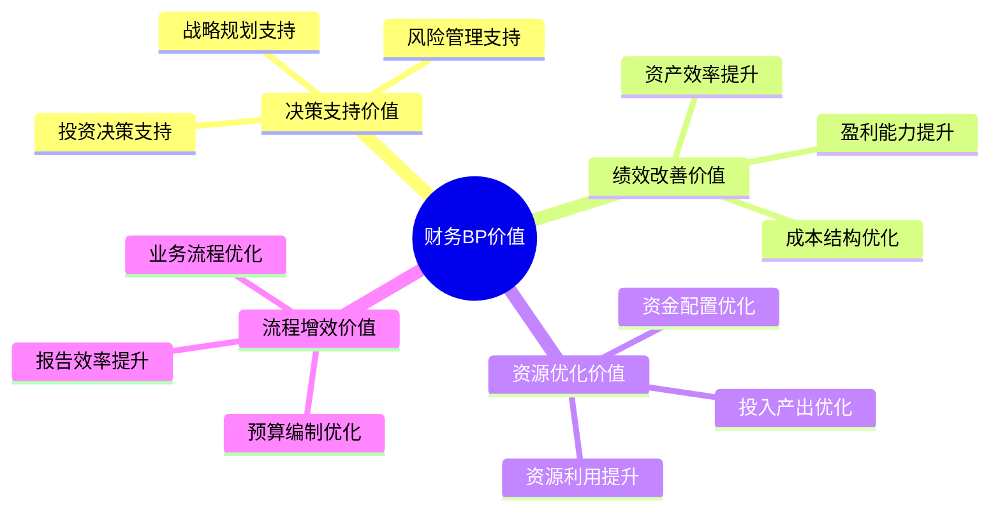

---
{"tags":["财务BP","价值创造","角色定位"],"aliases":["BP价值","财务价值创造"],"created":"2023-11-16","dg-publish":true,"permalink":"/知识共享/01_财务BP/01_学习内容/07_实践指南/BP角色定位/财务BP的价值创造/","dgPassFrontmatter":true}
---

# 财务BP的价值创造

## 概述

财务业务伙伴(BP)的核心价值在于超越传统财务职能，为组织创造实质性商业价值。本文探讨财务BP如何从多维度为组织创造价值，实现从成本中心向价值中心的转变。通过系统性方法，财务BP能够显著提升业务决策质量，优化资源配置，并推动组织长期可持续发展。

## 价值创造框架

### 价值维度划分

### 价值层次演进

| 价值层次 | 主要特征 | 价值表现 |
| -------- | -------- | -------- |
| 基础层价值 | 提供准确财务信息 | 支持日常运营决策 |
| 分析层价值 | 提供深入财务分析 | 揭示业务改进机会 |
| 顾问层价值 | 提供财务咨询建议 | 推动业务绩效提升 |
| 战略层价值 | 参与战略决策制定 | 引导长期增长方向 |

## 决策支持价值

### 战略规划价值

1. **战略选择评估**
   - 构建战略选项财务模型
   - 量化不同战略情景的财务影响
   - 提供基于数据的战略优先级建议

2. **资源分配建议**
   - 评估资源在不同业务部门的投资回报
   - 识别高增长领域的资源需求
   - 平衡短期绩效与长期投资的资源配置

3. **长期财务规划**
   - 构建多年期财务预测模型
   - 评估长期财务可持续性
   - 识别未来财务风险和机会

### 投资决策价值

1. **投资评估方法论**
   - 运用科学的投资评估工具(NPV, IRR, ROI等)
   - 建立投资决策标准化流程
   - 设计适合不同投资类型的评估框架

2. **项目可行性分析**
   - 构建详细的项目财务模型
   - 进行敏感性和情景分析
   - 评估项目对公司财务状况的影响

3. **投资组合优化**
   - 平衡风险与回报的投资组合
   - 评估投资项目之间的协同效应
   - 建议最佳投资时机和顺序

### 风险管理价值

1. **风险评估与量化**
   - 识别关键财务风险因素
   - 量化风险对财务绩效的潜在影响
   - 设计风险指标监控体系

2. **风险缓解策略**
   - 提出风险应对方案
   - 评估不同风险缓解策略的成本效益
   - 开发财务应急预案

3. **业务连续性保障**
   - 构建财务压力测试模型
   - 评估极端情况下的财务韧性
   - 设计业务连续性所需的财务资源计划

## 绩效改善价值

### 盈利能力提升

1. **利润结构优化**
   - 分析产品/服务线盈利能力
   - 识别高利润机会领域
   - 建议优化产品/服务组合

2. **定价策略支持**
   - 基于成本和竞争情况分析最优定价
   - 评估定价变更的财务影响
   - 开发动态定价模型

3. **收入质量优化**
   - 分析收入可持续性和可预测性
   - 评估不同客户群体贡献价值
   - 提出提高收入质量的策略

### 成本结构优化

1. **成本分析框架**
   - 构建详细的成本结构分析
   - 识别固定成本与可变成本比例
   - 评估成本变动对利润的敏感性

2. **成本优化建议**
   - 识别成本优化机会
   - 量化成本优化潜力
   - 提出具体成本控制措施

3. **零基预算应用**
   - 引导零基预算方法在关键领域的应用
   - 挑战历史成本假设
   - 确保成本与业务价值对应

### 资产效率提升

1. **资产利用率优化**
   - 分析资产利用率和效率
   - 识别低效资产使用情况
   - 提出资产效率提升方案

2. **营运资本管理**
   - 优化库存、应收账款和应付账款管理
   - 降低营运资本需求
   - 提高现金转换周期效率

3. **资本支出优化**
   - 评估资本支出的必要性和回报
   - 建议资本支出的最佳时机和规模
   - 设计资本支出后评估机制

## 资源优化价值

### 资金配置优化

1. **资金分配模型**
   - 建立基于ROI的资金分配框架
   - 评估不同业务单元的资金需求
   - 确保资金分配与战略优先级一致

2. **融资结构优化**
   - 评估债务与权益的最佳组合
   - 分析不同融资选项的成本和风险
   - 建议最优融资时机和方式

3. **现金管理增效**
   - 优化现金池管理
   - 提高闲置资金收益
   - 确保资金安全与流动性平衡

### 人力资源投入优化

1. **人力资源投资回报**
   - 评估人力成本与产出的关系
   - 分析不同部门人力配置效率
   - 建议最佳人力资源分配

2. **激励机制设计**
   - 支持财务导向的绩效指标设计
   - 评估不同激励方案的财务影响
   - 确保激励机制与价值创造一致

3. **人才投资决策**
   - 分析关键人才对财务绩效的贡献
   - 评估人才发展投资的回报
   - 支持基于价值的人才决策

### 系统与技术投资优化

1. **技术投资评估**
   - 分析技术投资的财务回报
   - 评估技术投资的风险与收益
   - 建议技术投资的优先顺序

2. **系统效益量化**
   - 量化系统实施的财务效益
   - 追踪系统投资的实际回报
   - 识别系统优化的增值机会

3. **数字化转型支持**
   - 评估数字化项目的投资回报
   - 支持数字化转型预算规划
   - 监控数字化投资的价值实现

## 流程增效价值

### 业务流程优化

1. **流程效率评估**
   - 分析业务流程的财务效率
   - 识别流程中的成本驱动因素
   - 量化流程优化的财务影响

2. **流程重组支持**
   - 评估流程重组的成本与收益
   - 支持基于价值的流程设计
   - 追踪流程改进的财务成效

3. **内部价值链分析**
   - 评估内部价值链各环节效率
   - 识别价值链中的增值与非增值活动
   - 建议价值链优化方向

### 报告与分析优化

1. **管理报告增值**
   - 设计以决策为导向的报告体系
   - 提供洞察而非仅数据
   - 确保报告聚焦关键业务驱动因素

2. **分析工具优化**
   - 开发预测性分析模型
   - 建立驱动因素分析框架
   - 提供可操作的业务洞察

3. **数据可视化增效**
   - 设计直观有效的数据可视化
   - 突显关键业务趋势和异常
   - 支持基于数据的快速决策

### 财务流程效率提升

1. **财务流程简化**
   - 识别财务流程中的冗余环节
   - 建议流程简化和标准化措施
   - 评估流程简化的资源释放效益

2. **预算流程优化**
   - 改进预算编制方法和流程
   - 减少预算周期时间
   - 提高预算准确性和相关性

3. **交易处理效率**
   - 优化财务交易处理流程
   - 推动适当的财务自动化
   - 降低交易处理成本

## 价值创造方法论

### 价值识别

1. **业务痛点诊断**
   - 通过业务访谈识别关键挑战
   - 分析业务绩效数据发现问题
   - 比较行业标杆识别改进空间

2. **价值机会评估**
   - 评估不同价值机会的潜在影响
   - 分析价值实现的可行性和时间
   - 确定价值机会的优先顺序

3. **价值发现工作坊**
   - 组织跨部门价值发现研讨
   - 应用结构化方法识别价值点
   - 形成共识的价值创造路线图

### 价值实现

1. **财务业务伙伴计划**
   - 制定有针对性的价值实现计划
   - 确定关键绩效指标和目标
   - 明确实施步骤和责任分工

2. **业务共创机制**
   - 建立与业务部门的合作机制
   - 确保解决方案的实用性和接受度
   - 共同监督价值实现进展

3. **变革管理支持**
   - 提供变革所需的财务数据支持
   - 评估变革的财务影响
   - 协助设计变革的财务激励机制

### 价值衡量

1. **价值跟踪体系**
   - 建立价值实现的跟踪机制
   - 设计价值实现的衡量指标
   - 定期评估价值创造进展

2. **投资回报计算**
   - 量化财务BP活动的回报
   - 计算投入产出比
   - 分析边际贡献和累积效应

3. **价值案例开发**
   - 记录成功的价值创造案例
   - 提炼可复制的价值创造模式
   - 分享最佳实践推动持续改进

## 案例分析

### 案例一：制造企业成本结构优化

**背景**：一家中型制造企业面临市场竞争加剧，利润率持续下降

**财务BP价值创造过程**：
1. **价值识别**：
   - 对比行业竞争对手成本结构，发现公司间接成本比例高30%
   - 分析历史成本数据，识别非价值创造活动
   - 建立成本与业务价值关联分析

2. **解决方案**：
   - 引入基于活动的成本核算(ABC)，精确识别成本驱动因素
   - 设计零基预算方法，重新评估间接成本必要性
   - 开发成本控制指标体系及管理仪表板

3. **实施支持**：
   - 为部门经理提供成本管理培训
   - 设计新的成本责任分配机制
   - 构建周度成本异常预警系统

**价值实现结果**：
- 间接成本降低15%，年节省成本120万元
- 制造单位成本降低8%，提升毛利率3个百分点
- 建立持续成本优化文化，后续两年额外节省5%成本

### 案例二：科技企业投资决策优化

**背景**：一家成长期科技企业面临多个发展方向，但资金有限，需要优化投资决策

**财务BP价值创造过程**：
1. **价值识别**：
   - 分析历史投资决策，发现缺乏系统性评估方法
   - 调研发现投资决策过于依赖直觉而非数据
   - 比较不同业务线的资本回报，发现显著差异

2. **解决方案**：
   - 开发投资评估标准化框架，包含财务和战略维度
   - 建立产品投资组合管理模型，优化资源分配
   - 设计情景分析和敏感性分析工具，评估不确定性

3. **实施支持**：
   - 为决策者提供投资评估方法培训
   - 参与投资委员会，提供财务分析支持
   - 建立投资后评估机制，促进持续学习

**价值实现结果**：
- 新产品投资回报率提高40%
- 资源向高回报领域倾斜，整体ROI提升25%
- 投资决策周期缩短30%，提高市场响应速度

## 价值创造的挑战与应对

### 挑战一：价值量化困难

**表现**：
- 财务BP的贡献难以直接量化
- 价值创造往往是多因素共同作用的结果
- 间接价值和长期价值难以在短期内衡量

**应对策略**：
1. 建立多维度的价值衡量指标体系
2. 采用前后对比法显示干预效果
3. 收集定性反馈佐证定量结果
4. 运用财务模型估算间接和长期价值

### 挑战二：组织障碍

**表现**：
- 传统财务职能定位限制价值发挥
- 业务部门对财务BP价值创造能力的质疑
- 缺乏支持价值创造的组织机制

**应对策略**：
1. 明确财务BP价值创造的角色定位
2. 通过小型项目快速展示价值
3. 建立支持价值创造的绩效指标
4. 获取高层支持，提升组织认可

### 挑战三：能力差距

**表现**：
- 财务BP缺乏业务洞察能力
- 数据分析能力不足以支持复杂决策
- 沟通影响力不足，难以推动变革

**应对策略**：
1. 制定财务BP能力发展路线图
2. 加强业务知识和高级分析技能培训
3. 建立导师制和实践学习机会
4. 招募具有多元背景的财务人才

### 挑战四：高价值与日常工作平衡

**表现**：
- 日常财务工作占据大量时间
- 价值创造活动被视为"额外工作"
- 缺乏专注于价值创造的时间和资源

**应对策略**：
1. 优化财务运营效率，释放价值创造时间
2. 明确区分财务运营与财务BP角色
3. 适当投资自动化工具减轻日常工作负担
4. 在绩效目标中明确价值创造的权重

## 最佳实践

1. **以业务为中心**：将价值创造聚焦于核心业务问题和战略优先级
2. **数据驱动决策**：以强大的数据分析为价值创造的基础
3. **前瞻性思维**：不仅解决当前问题，也预见未来挑战和机会
4. **系统性方法**：采用结构化的方法识别和实现价值
5. **持续创新**：不断更新价值创造的方法和工具
6. **协作共创**：与业务部门共同设计和实施价值创造方案
7. **知识分享**：建立成功经验的分享机制，扩大价值创造影响

## 相关链接

- [[知识共享/01_财务BP/01_学习内容/07_实践指南/BP角色定位/财务BP的战略支持角色\|财务BP的战略支持角色]]
- [[知识共享/01_财务BP/01_学习内容/07_实践指南/BP角色定位/业务伙伴关系构建\|业务伙伴关系构建]]
- [[知识共享/01_财务BP/01_学习内容/06_BP工具与模板/BP展示技巧/有效沟通财务计划\|有效沟通财务计划]]

## 参考资料

1. McKinsey & Company (2023). *Finance 2025: Creating value through finance business partnering*
2. Deloitte (2022). *Finance Business Partnering: From value preservation to value creation*
3. Boston Consulting Group (2022). *Finance function: Value creation in the digital age*
4. CGMA (2023). *Finance Business Partnering: Measuring and delivering value* 