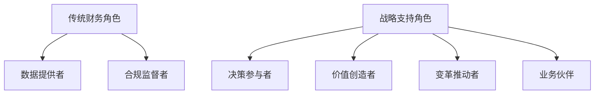

---
{"tags":["财务BP","角色定位","战略支持"],"aliases":["战略支持者","战略伙伴"],"created":"2023-11-15","dg-publish":true,"permalink":"/知识共享/01_财务BP/01_学习内容/07_实践指南/BP角色定位/财务BP的战略支持角色/","dgPassFrontmatter":true}
---

# 财务BP的战略支持角色

## 概述

财务BP作为战略支持者，是连接财务与业务的桥梁，不仅提供财务数据和分析，更直接参与企业战略决策过程。本文探讨财务BP如何定位自身战略支持角色，有效参与企业战略规划与执行，从而创造更大业务价值。

## 角色定位

### 战略角色的本质

财务BP的战略支持角色具有以下特征：

1. **决策参与者**：从被动提供数据向主动参与决策转变
2. **价值创造者**：关注如何通过财务专业知识创造业务价值
3. **变革推动者**：推动组织转型与业务模式创新
4. **业务伙伴**：与业务团队建立深度合作关系

### 与传统财务角色的区别

| 维度 | 传统财务角色 | 战略支持角色 |
| ---- | ------------ | ------------ |
| 工作重心 | 财务报表、合规性 | 业务决策支持、价值创造 |
| 时间导向 | 过去导向（历史数据） | 未来导向（预测与规划） |
| 视角 | 财务视角 | 业务与财务结合的视角 |
| 沟通方式 | 数据汇报 | 业务洞察与建议 |
| 知识结构 | 财务专业知识 | 财务+业务+行业知识 |

## 核心能力要求

### 战略思维能力

1. **宏观环境分析**：能够识别并分析宏观经济、行业趋势对企业的影响
2. **战略规划参与**：理解企业发展战略，并将其转化为财务目标和行动计划
3. **商业模式理解**：深入理解企业商业模式，识别价值创造点和优化机会
4. **长期价值导向**：超越短期财务指标，关注企业长期价值创造

### 业务洞察能力

1. **业务流程理解**：深入了解核心业务流程及其价值链
2. **业绩驱动因素分析**：识别并量化关键业绩驱动因素
3. **竞争优势识别**：从财务角度分析企业竞争优势
4. **跨部门视角**：能从整体视角理解各部门协同关系

### 影响力与沟通能力

1. **向上影响**：能够有效向高管层传达财务洞察并影响决策
2. **业务伙伴关系**：建立与业务部门的信任关系
3. **财务教练**：提升业务部门的财务素养
4. **复杂信息简化**：将复杂财务概念转化为业务语言

## 战略支持实践方法

### 参与战略规划流程

1. **战略目标财务化**：将企业战略目标转化为可量化的财务指标
2. **财务可行性分析**：评估战略选项的财务可行性
3. **资源配置建议**：就资源优化配置提供建议
4. **战略执行监控**：设计关键指标跟踪战略执行情况

### 重大决策支持

1. **投资决策分析**：提供全面的投资回报分析
2. **业务组合优化**：评估业务线绩效，提出优化建议
3. **并购整合支持**：提供并购目标财务尽职调查和整合规划
4. **新市场进入评估**：分析新市场财务风险与机会

### 价值创造驱动

1. **价值驱动树构建**：建立公司价值驱动因素分解树
2. **资本效率优化**：提出改善资本回报率的方案
3. **定价策略支持**：支持产品/服务定价决策
4. **成本结构优化**：识别成本优化机会并量化收益

## 案例分析

### 案例一：制造企业战略转型

**背景**：一家传统制造企业面临数字化转型挑战
**财务BP角色**：
- 协助评估数字化投资回报周期与预期收益
- 建立数字化转型进度的财务评估体系
- 重新设计绩效考核体系，平衡短期业绩与长期投资
- 识别并量化数字化转型中的成本优化机会

**成效**：
- 数字化投资ROI提升15%
- 转型期间现金流管理优化，避免了财务风险
- 新绩效体系有效激励了转型行为

### 案例二：SaaS企业业务扩张

**背景**：一家SaaS企业计划快速扩张新市场
**财务BP角色**：
- 开发市场扩张财务模型，平衡增长与盈利
- 设计客户获取成本与终身价值的监测体系
- 优化定价策略，适应不同区域市场
- 构建现金消耗率预警机制，确保扩张可持续性

**成效**：
- 新市场盈亏平衡时间缩短35%
- 客户获取成本降低20%
- 定价弹性提升营收增长率10%

## 实现路径

### 从传统财务向战略支持转型

1. **业务知识积累**：系统学习业务流程与行业知识
2. **思维模式转变**：从合规导向转向价值创造导向
3. **工具方法提升**：掌握战略分析工具与商业分析方法
4. **关系构建**：有意识发展与业务部门的合作关系

### 组织支持措施

1. **角色定位明确**：组织明确财务BP的战略支持角色
2. **能力发展计划**：针对战略支持能力的专项培养计划
3. **流程优化**：简化交易处理，释放时间用于战略支持
4. **考核激励**：将战略支持成效纳入考核体系

## 常见挑战与应对

1. **角色冲突**：平衡控制与支持的双重角色
   - 应对：明确不同场景下的定位，建立清晰边界

2. **能力不足**：缺乏业务知识或战略思维
   - 应对：制定个人发展计划，寻求轮岗和学习机会

3. **信任建立**：业务部门对财务BP战略角色认可不足
   - 应对：从小项目建立信誉，逐步展示价值

4. **时间分配**：日常事务挤占战略支持时间
   - 应对：优化财务流程，合理授权，聚焦高价值活动

## 最佳实践

1. **参与业务早期规划**：确保在决策形成初期介入
2. **数据驱动洞察**：利用高质量分析支持战略建议
3. **成果导向**：明确衡量战略支持价值的方式
4. **持续学习**：保持对行业趋势和最佳实践的学习

## 相关链接

- [[知识共享/01_财务BP/01_学习内容/07_实践指南/BP角色定位/财务BP的价值创造\|财务BP的价值创造]]
- [[知识共享/01_财务BP/01_学习内容/07_实践指南/BP角色定位/业务伙伴关系构建\|业务伙伴关系构建]]
- [[知识共享/01_财务BP/01_学习内容/07_实践指南/BP角色定位/财务BP能力模型\|财务BP能力模型]]

## 参考资料

1. McKinsey & Company (2020). *Finance 2030: Four imperatives for the next decade*
2. Deloitte (2022). *The evolution of finance business partnering*
3. CGMA (2023). *Business Partnering: The role of finance in driving business strategy*
4. Harvard Business Review (2021). *How finance leaders can become strategic partners* 