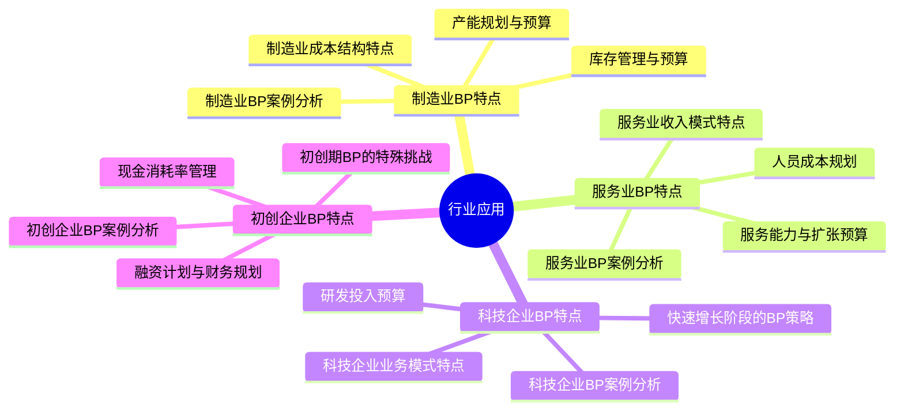
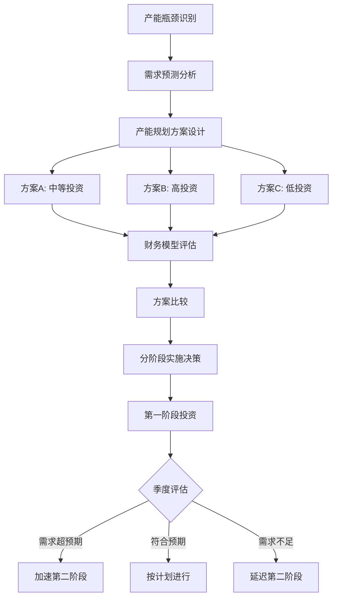

---
{"tags":["财务BP","行业应用","制造业","服务业","科技企业","初创企业","行业特点","业务模型"],"aliases":["行业BP特点","特定行业预算规划","垂直行业财务BP"],"created":"2024-05-13","update":"2024-05-13","dg-publish":true,"permalink":"/知识共享/01_财务BP/02_笔记/04-行业应用/","dgPassFrontmatter":true}
---

# 行业应用

## 引言

不同行业的商业模式、价值链和运营特点存在显著差异，这决定了财务BP在各行业应用中需要采取不同的方法和关注重点。本章系统介绍财务BP在制造业、服务业、科技企业和初创企业中的应用特点与实践方法，帮助财务BP人员根据行业特性定制适合的预算和规划方案。

## 核心内容

### 1. 制造业BP特点

制造业财务BP需要关注生产能力、库存管理和复杂的成本结构：

**制造业成本结构特点**：
- 直接材料成本管理与预测
- 直接人工成本规划
- 制造费用分配与控制
- 产能利用率对成本的影响
- 规模效应与边际成本分析

**产能规划与预算**：
- 产能需求预测方法
- 产能扩张的资本支出规划
- 产能调整的成本效益分析
- 产能弹性管理策略
- 外包与自制决策模型

**库存管理与预算**：
- 原材料库存规划
- 在产品与产成品库存预测
- 安全库存水平确定
- 周转率目标设定
- 库存资金占用预算

**制造业关键预算要点**：
- 生产计划与销售计划的协调
- 采购预算与供应链管理
- 产品成本结构分析
- 工厂管理费用控制
- 设备维护与更新计划

### 2. 服务业BP特点

服务业财务BP以人力资源为中心，关注服务交付能力和客户关系：

**服务业收入模式特点**：
- 服务定价策略与模式
- 合同收入与临时服务收入
- 客户保有率与收入预测
- 服务组合收入贡献分析
- 季节性与周期性因素

**人员成本规划**：
- 服务人员配置模型
- 多技能人员效率规划
- 人员利用率目标设定
- 外包与内部人员平衡
- 薪酬结构与激励设计

**服务能力与扩张预算**：
- 服务能力计算方法
- 服务能力扩张的边际成本
- 新市场进入成本预算
- 服务质量与客户满意度投入
- 培训与认证投资

**服务业关键预算要点**：
- 人力资源是核心成本驱动
- 差异化定价与收入管理
- 客户关系维护的投入
- 服务交付效率的优化
- 品牌与专业声誉建设

### 3. 科技企业BP特点

科技企业财务BP需要应对快速变化的市场和高研发投入：

**科技企业业务模式特点**：
- 产品型与服务型科技企业对比
- 订阅模式收入预测
- 平台型企业的网络效应
- 用户增长与变现路径
- 技术迭代对业务的影响

**研发投入预算**：
- 研发支出比例的行业基准
- 资本化与费用化研发支出
- 研发项目组合管理
- 研发绩效评估指标
- 研发风险的财务缓冲

**快速增长阶段的BP策略**：
- 营销获客投入与回报分析
- 规模化的基础设施投资
- 人才吸引与留存成本
- 增长速度与盈利平衡
- 数据驱动的快速调整机制

**科技企业关键预算要点**：
- 技术发展趋势预判
- 市场竞争格局变化
- 产品迭代周期与投入
- 生态系统建设成本
- 用户体验与留存投资

### 4. 初创企业BP特点

初创企业财务BP聚焦生存与验证，同时为快速成长做准备：

**初创期BP的特殊挑战**：
- 高度不确定性的预测环境
- 数据有限的预算基础
- 多重增长路径的权衡
- 资源极度受限的约束
- 投资者预期的平衡

**融资计划与财务规划**：
- 融资轮次与估值规划
- 投资者偏好的关键指标
- 融资节奏与里程碑设计
- 退出策略的财务影响
- 股权稀释与控制权平衡

**现金消耗率管理**：
- 现金消耗率计算与监控
- 生存期与资金缓冲计划
- 可变成本结构设计
- 现金保护策略
- 紧急削减支出方案

**初创企业关键预算要点**：
- 产品市场匹配验证投入
- 核心团队建设成本
- MVP开发与迭代预算
- 增长实验的资源分配
- 关键绩效指标的设定

## 应用示例

### 案例一：制造业资本支出预算模型

某汽车零部件制造企业面临产线升级与扩产决策，通过财务BP支持投资决策：

1. **产能需求预测**：
   - 分析主要客户未来3年采购计划
   - 预测行业增长率和市场份额变化
   - 设定95%的产能利用率作为扩产触发点
   - 建立季节性波动的缓冲产能

2. **资本支出方案设计**：
   | 方案 | 投资额 | 产能提升 | 自动化程度 | 人工节省 | 建设周期 |
   |-----|--------|---------|-----------|----------|----------|
   | 方案A | 6,000万 | 40% | 中等 | 20% | 12个月 |
   | 方案B | 8,500万 | 60% | 高 | 35% | 18个月 |
   | 方案C | 4,000万 | 25% | 低 | 10% | 8个月 |

3. **财务评估模型**：
   - 构建10年期DCF模型
   - 设定WACC为12%作为折现率
   - 考虑设备折旧、维护成本和残值
   - 分析产能利用率对回报率的敏感性
   - 评估升级导致的停产成本

4. **决策支持结果**：
   | 方案 | NPV | IRR | 回收期 | 风险评级 | 建议 |
   |-----|-----|-----|-------|----------|------|
   | 方案A | 4,200万 | 18% | 4.5年 | 中 | 第一选择 |
   | 方案B | 5,800万 | 16% | 5.2年 | 高 | 分阶段考虑 |
   | 方案C | 2,500万 | 17% | 4.2年 | 低 | 临时方案 |

5. **实施建议**：
   - 采用方案A，但预留方案B的扩展空间
   - 第一阶段投入4,000万，根据市场反应决定后续
   - 建立季度审核点，评估产能利用率
   - 第三年考虑追加投资提升自动化水平
   - 设计弹性生产计划，应对需求波动

### 案例二：SaaS企业的订阅收入预测模型

某企业级SaaS平台企业构建财务BP，支持业务增长规划：

1. **用户增长预测**：
   - 细分客户获取渠道：直销、内容营销、合作伙伴
   - 建立销售漏斗转化率模型
   - 设计客户留存曲线
   - 预测账户扩张路径（从部门使用到企业级采用）

2. **收入预测模型**：
   - MRR(月度经常性收入)增长预测
   - 客户获取成本(CAC)分析
   - 客户生命周期价值(LTV)计算
   - 升级和交叉销售收入贡献
   - 定价策略调整的影响分析

3. **成本结构规划**：
   - 研发投入：占收入25-30%
   - 销售与营销：占收入40-45%（获客期）
   - 客户成功：占收入15-20%
   - 运营与管理：占收入10-15%
   - 基础设施与云服务：占收入8-12%

4. **关键绩效指标预测**：
   | 指标 | 当前 | 第一年 | 第二年 | 第三年 |
   |-----|------|-------|-------|-------|
   | 年度经常性收入 | 500万 | 1,200万 | 2,500万 | 4,000万 |
   | 毛利率 | 70% | 72% | 76% | 80% |
   | CAC回收期 | 18个月 | 16个月 | 12个月 | 9个月 |
   | 净美元留存率 | 105% | 115% | 120% | 125% |
   | 客户数量 | 120 | 250 | 450 | 700 |
   | ARPU | 4.2万 | 4.8万 | 5.5万 | 5.7万 |

5. **增长投资策略**：
   - 前18个月优先投入获客，接受负毛利
   - 产品开发聚焦于提升留存率和扩展模块
   - 第二年开始建立客户成功团队，提升账户扩张
   - 第三年优化销售效率，降低CAC
   - 全周期保持80%以上的总支出占收入比

## 相关链接

- [[知识共享/01_财务BP/01_学习内容/02_预算编制基础/资本支出预算/资本支出评估方法\|资本支出评估方法]]
- [[01_财务BP/01_学习内容/财务预测与模型/现金流预测/营运资金管理与预测\|营运资金管理与预测]]
- [[知识共享/01_财务BP/01_学习内容/05_高级分析方法/增长模型/增长驱动因素识别\|增长驱动因素识别]]
- [[01_财务BP/01_学习内容/高级分析方法/风险评估/压力测试应用\|压力测试应用]]
- [[知识共享/01_财务BP/01_学习内容/06_BP工具与模板/Excel模型构建/模型结构与布局\|模型结构与布局]]

## 参考文献

1. Chen, G. (2019). *Industry-Specific Financial Modeling*. Wiley Finance.
2. 李伟 (2022). 《行业财务规划与预算管理》. 中国人民大学出版社.
3. Osterwalder, A., & Pigneur, Y. (2010). *Business Model Generation*. Wiley.
4. Ries, E. (2011). *The Lean Startup*. Crown Business.
5. 赵宣 (2021). 《制造企业全面预算管理实务》. 机械工业出版社.
6. Damodaran, A. (2018). *The Dark Side of Valuation: Valuing Young, Distressed, and Complex Businesses*. FT Press.
7. 朱武祥 (2020). 《科技创新企业财务战略》. 清华大学出版社. 