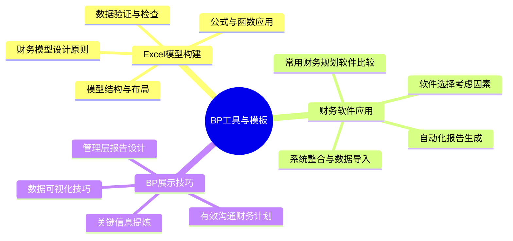
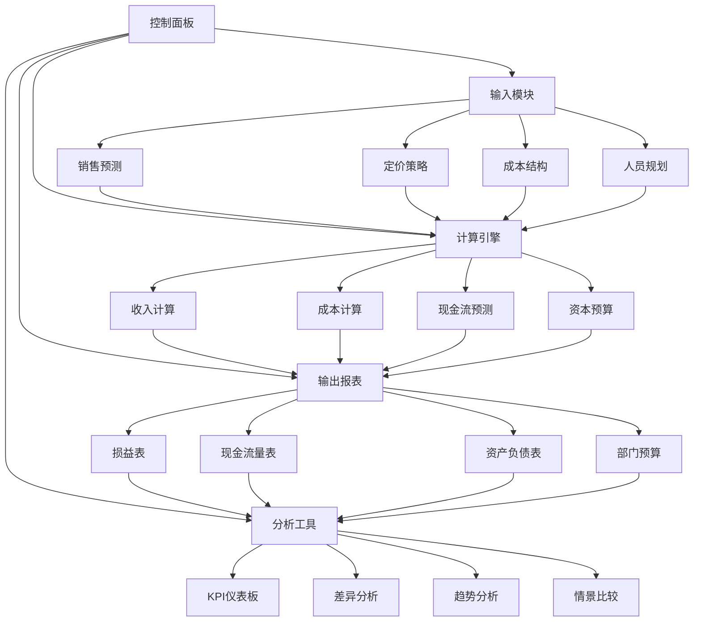

---
{"tags":["财务BP","BP工具","Excel模型","财务软件","展示技巧","模型构建","数据可视化"],"aliases":["财务BP工具箱","预算工具模板","财务模型构建指南"],"created":"2024-05-13","update":"2024-05-13","dg-publish":true,"permalink":"/知识共享/01_财务BP/02_笔记/06-BP工具与模板/","dgPassFrontmatter":true}
---


# BP工具与模板

## 引言

高效的工具和标准化的模板是财务BP工作的重要支撑，可以显著提高工作效率和输出质量。本章系统介绍Excel模型构建、财务软件应用和BP展示技巧，帮助财务BP人员掌握实用工具和方法，提升财务规划和预算编制的专业水平和沟通效果。

## 核心内容



### 1. Excel模型构建

Excel是财务BP人员的核心工具，掌握高效的模型构建技术至关重要：

**财务模型设计原则**：
- 清晰性：逻辑清晰，结构明确
- 准确性：计算正确，假设合理
- 可靠性：结构稳健，错误处理
- 灵活性：易于更新，便于调整
- 可追踪性：数据来源明确，计算过程可见

**模型结构与布局**：
- 输入区、计算区和输出区的分离
- 颜色编码系统的应用
- 一致的格式和单位标准
- 模块化设计和分工作表组织
- 导航系统和文档说明

**公式与函数应用**：
- 核心财务函数：NPV、IRR、PMT等
- 数据处理函数：SUMIFS、LOOKUP、INDEX等
- 逻辑函数：IF、AND、OR等高级组合
- 动态数组函数与LAMBDA函数
- 数据表和情景管理器

**数据验证与检查**：
- 平衡检查与交叉验证
- 敏感性测试与异常值检测
- 公式审计工具的应用
- 错误追踪与处理机制
- 模型压力测试与稳定性评估

### 2. 财务软件应用

专业财务软件可以提升财务BP的效率和全面性：

**常用财务规划软件比较**：
- 企业级ERP系统：SAP、Oracle等
- 中型企业解决方案：Anaplan、Adaptive等
- 中小企业选择：Prophix、Centage等
- 云端工具：Workday Adaptive Planning、Oracle EPM Cloud等
- 功能与价格对比分析

**软件选择考虑因素**：
- 企业规模与复杂度匹配
- 功能需求分析与优先级
- 集成能力与数据连接
- 用户友好性与学习曲线
- 投资回报与总拥有成本

**系统整合与数据导入**：
- 数据源识别与连接方法
- ETL流程设计
- 数据转换与标准化
- 自动化同步机制
- 数据质量控制方法

**自动化报告生成**：
- 标准报告模板设计
- 报告计划与调度
- 异常监控与警报设置
- 多维度分析视图
- 动态仪表板设计

### 3. BP展示技巧

出色的展示能力可以确保财务BP的价值被充分理解和应用：

**管理层报告设计**：
- 受众分析与内容定制
- 报告层级与详细程度
- 标准报告框架设计
- 例外管理与重点突出
- 行动建议与决策支持

**数据可视化技巧**：
- 图表类型选择原则
- 色彩与布局的设计原则
- 多层次信息展示方法
- 趋势与对比的视觉化
- 动态可视化和交互设计

**关键信息提炼**：
- 数据降维与聚焦技术
- 关键绩效指标筛选
- 关联分析与因果展示
- 简化复杂信息的方法
- 故事化叙述结构

**有效沟通财务计划**：
- 非财务人员的沟通策略
- 视觉辅助工具的应用
- 叙事能力与说服技巧
- 预期管理和反馈机制
- 渐进式信息披露方法

## 应用示例

### 案例一：多年期全面预算Excel模型构建

某中型企业需要构建一个三年期全面预算模型，支持日常预算管理和战略规划：

1. **模型设计架构**：
   ```
   - 控制面板：关键假设输入、情景选择、导航
   - 输入模块：销售预测、产品组合、定价策略、成本结构
   - 计算引擎：收入计算器、成本预测器、资本支出规划
   - 输出报表：损益表、现金流量表、资产负债表
   - 分析工具：KPI仪表板、差异分析、趋势图表
   ```

2. **核心技术实现**：
   - 数据表功能：实现不同情景的自动计算
   - 名称管理器：创建动态计算区域
   - 条件格式：可视化警示和趋势
   - 数据验证：限制输入范围和提供选择列表
   - 宏和VBA：自动化任务和增强用户体验

3. **公式示例及应用**：
   | 功能 | 公式示例 | 应用场景 |
   |-----|---------|---------|
   | 收入预测 | `=SUMPRODUCT(销量区域,价格区域)` | 多产品线收入计算 |
   | 同比增长 | `=IF(上年同期>0,(本期-上年同期)/上年同期,"N/A")` | 增长趋势分析 |
   | 条件汇总 | `=SUMIFS(金额区域,日期区域,">="&起始日,日期区域,"<="&结束日)` | 期间数据汇总 |
   | 分级计算 | `=VLOOKUP(业绩值,奖金表,2,FALSE)` | 奖金预算计算 |
   | 现金流预测 | `=销售收入*收款率+前期应收*回款率` | 经营现金流入预测 |

4. **模型检验机制**：
   - 自动化平衡检查：资产=负债+所有者权益
   - 交叉验证：部门汇总=公司总计
   - 合理性检验：利润率、增长率在预期范围内
   - 公式一致性检查：确保计算逻辑一致
   - 历史对比分析：与过去表现比较是否合理

5. **用户体验优化**：
   - 冻结窗格与分屏显示
   - 保护单元格防止意外修改
   - 带有说明的输入提示
   - 错误处理与提示信息
   - 一键更新与刷新机制



### 案例二：财务BP展示的高效沟通策略

某财务BP团队为管理层季度预算审核会议准备报告和展示：

1. **受众分析与内容设计**：
   - CEO关注：战略目标实现度、整体财务健康度
   - CFO关注：详细财务指标、风险点、资金需求
   - 业务部门主管关注：部门绩效、资源分配
   - 定制三层次报告：摘要、核心指标、详细分析

2. **报告结构优化**：
   - 单页执行摘要：关键成果与挑战
   - 业绩仪表板：预算vs实际的视觉化对比
   - 例外报告：重点突出超出阈值的指标
   - 前瞻性分析：年度预测调整和资源需求
   - 决策建议：清晰的选项和推荐行动

3. **可视化设计应用**：
   - 瀑布图：展示各因素对预算差异的贡献
   - 热力图：直观显示各部门业绩状况
   - 散点图：分析成本与产出的关系
   - 趋势线图：展示关键指标的历史轨迹和预测
   - 树状图：分解收入或成本结构

4. **互动式展示技巧**：
   - 准备多个深度层次的数据
   - 设计问题引导讨论流程
   - 使用动态筛选响应即时提问
   - 准备备选方案和敏感性分析
   - 会后跟进文档的设计

5. **沟通技巧应用**：
   - 使用讲故事方法组织财务数据
   - 将复杂分析简化为关键洞察
   - 将财务术语转化为业务语言
   - 设置明确的决策点和后续步骤
   - 准备应对质疑的数据支持

## 相关链接

- [[知识共享/01_财务BP/01_学习内容/03_财务预测与模型/敏感性分析/敏感性分析的展示方法\|敏感性分析的展示方法]]
- [[知识共享/01_财务BP/01_学习内容/03_财务预测与模型/财务报表预测/报表间的逻辑关系\|报表间的逻辑关系]]
- [[知识共享/01_财务BP/01_学习内容/02_预算编制基础/预算编制流程/预算汇总与审批\|预算汇总与审批]]
- [[知识共享/01_财务BP/01_学习内容/05_高级分析方法/投资回报分析/净现值与内部收益率分析\|净现值与内部收益率分析]]
- [[知识共享/01_财务BP/01_学习内容/04_行业应用/科技企业BP特点/科技企业BP案例分析\|科技企业BP案例分析]]

## 参考文献

1. Benninga, S. (2014). *Financial Modeling*. MIT Press.
2. Carlberg, C. (2019). *Excel Sales Forecasting For Dummies*. Wiley.
3. Few, S. (2013). *Information Dashboard Design: Displaying Data for At-a-Glance Monitoring*. Analytics Press.
4. 李明 (2021). 《Excel高级财务建模实战》. 电子工业出版社.
5. Knaflic, C. N. (2015). *Storytelling with Data: A Data Visualization Guide for Business Professionals*. Wiley.
6. Day, A. (2016). *Mastering Financial Modelling in Microsoft Excel*. FT Publishing.
7. 赵宣 (2022). 《管理报告设计与呈现》. 中国人民大学出版社. 