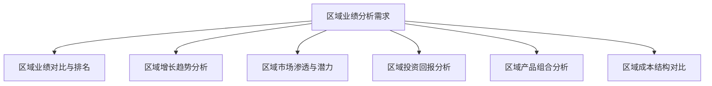

---
{"dg-publish":true,"dg-home":false,"permalink":"/知识共享/02_财务BI看板项目/设计稿/看板设计/专题分析模块/区域业绩分析看板设计/","dgPassFrontmatter":true}
---

#看板设计 #区域业绩 #专题分析

区域业绩分析看板是财务BI系统中的专题分析模块，聚焦于企业不同地区、区域和市场的财务业绩分析与对比，帮助管理层了解区域间业绩差异、市场潜力和资源配置效果，为区域战略和市场扩张决策提供数据支持。本文档详细说明区域业绩分析看板的设计方案。

## 一、设计目标

区域业绩分析看板作为财务BI系统的专题分析模块，旨在提供多维度的区域业绩分析视图，帮助企业了解区域市场财务表现及其贡献。具体设计目标包括：

1. **区域业绩全景**：直观展示企业各区域、地区和市场的业绩状况
2. **区域业绩对比**：提供不同区域间的财务表现对比分析
3. **市场渗透分析**：评估各区域市场渗透率和发展潜力
4. **区域资源效率**：分析各区域投入资源的使用效率和回报情况
5. **区域风险评估**：识别和监控各区域市场的财务风险

## 二、用户需求分析

### 1. 主要用户群体

- **区域经理/负责人**：需要了解自己负责区域的业绩表现
- **销售管理层**：需要对比分析各区域销售业绩和市场占有率
- **业务发展团队**：需要评估不同区域的市场潜力和扩张机会
- **财务分析师**：需要分析区域间财务表现差异和原因
- **高层决策者**：需要优化区域战略和资源配置

### 2. 用户核心需求

### 3. 应用场景

- **区域业绩评估**：定期评估各区域业绩表现和目标达成情况
- **区域资源分配**：基于区域表现和潜力优化资源分配
- **市场扩张决策**：评估新区域市场的商业可行性
- **区域激励方案**：为区域团队设计合理的激励机制
- **区域策略调整**：根据区域表现差异调整区域销售策略

## 三、看板布局设计

区域业绩分析看板采用地理与数据结合的设计方法，包括总览区、地理分布区、区域对比区、趋势分析区和市场潜力区。

### 1. 布局结构

### 2. 布局说明

- **总览区**：页面顶部，展示区域业绩总体情况和关键指标
- **地理分布区**：左上区域，以地图形式直观展示各区域业绩分布
- **区域对比区**：右上区域，提供区域间的各项指标对比分析
- **趋势分析区**：左下区域，展示各区域业绩的时间趋势
- **市场潜力区**：右下区域，分析各区域的市场渗透率和增长潜力

## 四、核心组件设计

### 1. 总览区设计

总览区采用卡片设计，展示区域业绩的核心指标，包括：

- **总收入卡片**：显示全部区域总收入、环比变化和同比变化
- **总利润卡片**：显示全部区域总利润、环比变化和同比变化
- **区域数量卡片**：显示达标区域数量和占比
- **增长最快区域卡片**：显示增长率最高的前3个区域
- **区域指标达成率卡片**：显示区域整体目标达成率

### 2. 地理分布区设计

地理分布区采用交互式地图设计，直观展示业绩的地理分布：

- **热力地图**：
  - 以颜色深浅表示不同区域的业绩表现
  - 支持切换不同指标（收入、利润、增长率等）的地图展示
  
- **气泡地图**：
  - 使用气泡大小表示业绩规模
  - 使用气泡颜色表示业绩增长率或达成率
  - 点击气泡可查看区域详细信息

### 3. 区域对比区设计

区域对比区采用多维对比图表，展示不同区域间的业绩差异：

- **区域业绩排名**：
  - 条形图展示各区域的收入/利润排名
  - 支持按绝对值或相对值（人均、平方米均等）排序
  
- **区域关键指标对比**：
  - 雷达图展示选定区域在多个维度的表现对比
  - 维度包括：收入、利润、增长率、市场份额、客户数等
  
- **区域成本结构对比**：
  - 堆叠柱状图展示不同区域的成本结构差异
  - 分析人力成本、营销成本、设施成本等在各区域的比例

### 4. 趋势分析区设计

趋势分析区采用时间序列图表，展示区域业绩的历史变化：

- **区域收入趋势**：
  - 折线图展示选定区域的收入变化趋势
  - 支持多区域叠加对比
  
- **区域季节性分析**：
  - 热力图展示各区域在不同月份/季度的表现强弱
  - 识别区域性季节波动模式
  
- **区域市场份额变化**：
  - 折线图或面积图展示各区域市场份额的变化趋势
  - 分析市场格局的演变

### 5. 市场潜力区设计

市场潜力区聚焦于区域市场的开发程度和增长潜力：

- **市场渗透率分析**：
  - 散点图展示各区域的市场规模与渗透率关系
  - X轴：市场总规模
  - Y轴：当前渗透率
  - 气泡大小：当前收入
  
- **增长机会矩阵**：
  - 四象限矩阵分析各区域的增长潜力
  - X轴：市场增长率
  - Y轴：企业市场份额
  - 识别明星区域、机会区域、现金牛区域和问题区域
  
- **区域投资回报分析**：
  - 条形图对比各区域的投资回报率
  - 分析单位投入在各区域产生的回报差异

## 五、交互设计

### 1. 区域维度交互

- **区域层级选择器**：支持在国家、省份、城市等不同层级间切换
- **区域多选功能**：支持选择多个区域进行对比分析
- **区域搜索过滤**：支持按名称、代码、类型等快速定位区域

### 2. 时间维度交互

- **时间范围选择器**：可选择查看不同时间范围的区域业绩数据
- **周期比较功能**：支持同比、环比、定基比等多种比较方式
- **季节性分析切换**：支持按月度、季度、年度等周期分析季节性变化

### 3. 指标维度交互

- **指标切换**：支持在收入、利润、订单量等不同指标间切换
- **归一化视图**：支持查看绝对值或相对值（如人均、面积均等）
- **目标对比视图**：支持与目标值或行业标杆对比的视图切换

## 六、高级功能设计

### 1. 区域画像分析

基于多维数据构建区域市场画像，帮助深入理解区域特征：

- **区域客户画像**：分析区域客户的人口统计特征和消费行为
- **区域产品偏好**：分析区域市场对不同产品的接受程度
- **区域竞争格局**：分析区域市场的竞争强度和主要对手

### 2. 区域绩效归因分析

深入分析影响区域业绩的关键因素：

- **内部因素分析**：区域团队能力、资源投入、执行效率等因素
- **外部因素分析**：市场规模、竞争强度、经济环境等因素
- **贡献度计算**：量化不同因素对区域业绩的贡献程度

### 3. 预测与情景模拟

通过预测模型和模拟工具评估区域未来表现：

- **区域业绩预测**：基于历史数据和市场趋势预测区域未来业绩
- **资源分配模拟**：模拟不同资源分配方案对区域业绩的影响
- **市场变化影响分析**：评估市场变化对各区域的潜在影响

## 七、视觉设计

### 1. 配色方案

区域业绩分析看板采用地理与数据融合的配色方案：

- **基础配色**：使用蓝绿色系作为主色调，体现地理空间的感觉
- **区域分级配色**：使用从浅到深的单色渐变表示数值高低
- **对比指标配色**：使用互补色系表示需要对比的指标
- **目标达成配色**：使用红黄绿信号灯色系表示目标达成情况

### 2. 数据可视化标准

- **地理分布展示**：使用热力地图、气泡地图和区域地图表示
- **区域对比分析**：使用条形图、雷达图和平行坐标图表示
- **时间趋势分析**：使用折线图、面积图和时序热力图表示
- **关系与分布**：使用散点图、气泡图和四象限矩阵表示

## 八、数据需求

### 1. 数据源

- **销售系统**：区域销售数据、客户数据、订单数据
- **财务系统**：区域收入、成本、利润数据
- **市场调研数据**：区域市场规模、竞争格局数据
- **地理信息系统**：区域边界、人口分布、经济指标数据

### 2. 数据粒度

- **地理粒度**：国家、大区、省份、城市、区县
- **时间粒度**：年、季、月、周、日
- **产品粒度**：产品线、产品类别、单个产品
- **客户粒度**：客户群体、客户类型、单个客户

### 3. 计算指标

- **基础业绩指标**：区域收入、区域利润、区域订单量
- **相对指标**：人均产值、面积密度、渗透率、市场份额
- **趋势指标**：增长率、同比变化、环比变化、复合增长率
- **效率指标**：投资回报率、资源利用率、客户获取成本

## 九、实施建议

### 1. 分步实施策略

1. **第一阶段**：基础区域业绩分析，包括总览和地理分布展示
2. **第二阶段**：区域对比分析和趋势分析
3. **第三阶段**：市场潜力分析和竞争格局分析
4. **第四阶段**：高级功能，如归因分析和预测模拟

### 2. 关键成功因素

- **数据标准化**：确保不同区域的数据采集和处理标准一致
- **地理编码准确**：确保业务数据与地理信息正确关联
- **合理分层**：根据业务特点设计合理的地理层级划分
- **上下文融合**：将区域数据与市场环境和经济数据相结合

### 3. 预期效果

- **提升决策精准度**：基于数据优化区域战略和资源分配
- **发现增长机会**：识别高潜力区域和未充分开发的市场
- **提高资源效率**：优化区域间的资源分配效率
- **强化绩效管理**：为区域团队提供客观的绩效评估基础

## 十、相关看板

- [财务概览看板](./财务概览看板设计.md)
- [产品盈利分析看板](产品盈利分析看板设计.md)
- [客户价值分析看板](客户价值分析看板设计.md)
- [销售绩效看板](./销售绩效看板设计.md)

---

**相关笔记**：
- [[知识共享/02_财务BI看板项目/设计稿/财务BI看板模块规划\|财务BI看板模块规划]]
- [[地理数据可视化方法\|地理数据可视化方法]]
- [[区域市场分析框架\|区域市场分析框架]] 