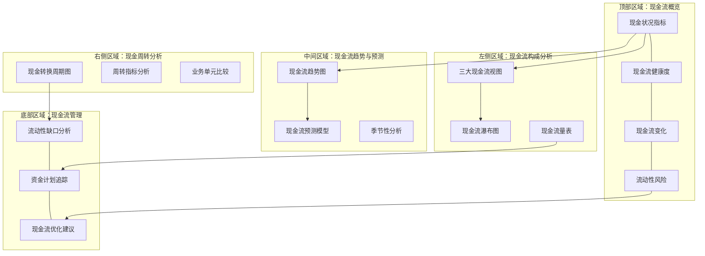

---
{"dg-publish":true,"dg-home":false,"permalink":"/知识共享/02_财务BI看板项目/设计稿/看板设计/核心看板模块/现金流分析看板设计/","dgPassFrontmatter":true}
---

#看板设计 #现金流分析 #核心模块

现金流分析看板是财务BI系统中的重要组成部分，聚焦于企业现金流量状况的综合分析与预测，帮助管理者监控资金流动健康度、预判流动性风险，并优化现金管理策略。本文档详细说明现金流分析看板的设计方案。

## 设计目标

1. **现金流监控**：全面监控企业各项经营、投资和筹资活动的现金流入流出
2. **流动性评估**：评估企业短期和长期的流动性状况
3. **现金周期分析**：分析业务运营现金周转效率
4. **现金流预测**：预测未来现金流走势和潜在风险
5. **决策支持**：为现金管理和资金规划提供决策依据

## 用户需求分析

现金流分析看板的主要用户包括：

- **财务总监/CFO**：关注整体现金流健康度及风险监控
- **资金经理**：负责日常现金管理和流动性规划
- **财务分析师**：进行深度现金流分析和预测
- **高管团队**：关注现金流对战略决策的影响

主要使用场景：
- 日常现金流监控与管理
- 流动性风险预警与应对
- 现金流量预测与资金规划
- 现金使用效率评估与优化

## 看板布局设计

现金流分析看板采用综合布局，从宏观到微观，从状态到趋势进行展示：



## 核心组件设计

### 1. 现金流概览区

展示关键现金流指标和健康状况，采用指标卡片布局：

```
┌─────────────────┐ ┌─────────────────┐ ┌─────────────────┐ ┌─────────────────┐
│  期末现金余额   │ │ 经营活动现金流  │ │ 自由现金流      │ │  现金流量比率   │
│                 │ │                 │ │                 │ │                 │
│ 8,750万元       │ │ +1,250万元      │ │ +580万元        │ │ 0.15            │
│ 环比: ↑8.2%     │ │ 同比: ↓12.5%    │ │ 同比: ↓22.3%    │ │ 行业均值: 0.22  │
│ 预测下月: +5.1% │ │ 预算达成率: 85% │ │ 资本支出率: 35% │ │ 趋势: ↓ (恶化)  │
└─────────────────┘ └─────────────────┘ └─────────────────┘ └─────────────────┘
```

现金流指标卡片包含：
1. **期末现金余额**：当前现金及现金等价物余额，环比变化和预测趋势
2. **经营活动现金流**：当期经营活动现金流净额，同比变化和预算达成情况
3. **自由现金流**：经营现金流减去资本支出，同比变化和资本支出比例
4. **现金流量比率**：经营现金流/流动负债，与行业均值比较和变化趋势

附加指标：
- **现金流充足率**：经营现金流/净利润
- **现金到期债务比**：现金余额/一年内到期的债务
- **现金比率**：(现金+现金等价物)/流动负债

### 2. 现金流构成分析区

#### 2.1 三大现金流视图

使用三联图或分组柱状图展示三类现金流的对比：

```
现金流三类对比（最近12个月）
^
|                                  
|  ┌─┐         ┌─┐         ┌─┐     
|  │ │         │ │         │ │     
|  │ │         │ │         │ │     
|  │ │         │ │         │ │           ┌─┐ 
|  │ │ ┌─┐     │ │ ┌─┐     │ │ ┌─┐       │ │ 
|  │ │ │ │     │ │ │ │     │ │ │ │       │ │ 
|  │ │ │ │     │ │ │ │     │ │ │ │ ┌─┐   │ │ 
+──┴─┴─┴─┴─────┴─┴─┴─┴─────┴─┴─┴─┴─┴─┴───┴─┴──>
   Q1    Q2     Q3    Q4     Q1    Q2    Q3
  <---- 上年 ---->  <------- 本年 -------->

   █ 经营活动现金流  █ 投资活动现金流  █ 筹资活动现金流
```

设计要点：
- 清晰展示三类现金流的历史对比
- 可切换按月/季/年展示
- 标记关键现金流变动点

#### 2.2 现金流瀑布图

使用瀑布图展示当期现金变动的构成：

```
期间现金变动构成
^
|                ┌─┐
|                │ │
|    ┌─┐         │ │         
|    │ │         │ │                  ┌─┐
|    │ │         │ │         ┌─┐      │ │
|┌─┐ │ │         │ │         │ │      │ │
|│ │ │ │         │ │ ┌─┐     │ │      │ │
|│ │ │ │         │ │ │ │     │ │      │ │
+┴─┴─┴─┴─────────┴─┴─┴─┴─────┴─┴──────┴─┴──>
期初  经营活动   投资活动  筹资活动  汇率  期末
现金  现金流    现金流    现金流    影响  现金
```

设计要点：
- 直观展示期初到期末现金变动路径
- 正负现金流用不同颜色区分
- 支持按时间周期切换（月/季/年）

#### 2.3 现金流量表

使用结构化表格展示详细的现金流量表数据：

```
┌───────────────────────────────────────────────┐
│ 现金流量表（简化版）                    [展开▼]│
├─────────────────────────┬─────────┬───────────┤
│ 项目                    │ 本期    │ 同比变动  │
├─────────────────────────┼─────────┼───────────┤
│ 经营活动现金流入小计    │ 6,520万 │ ↑12.3%    │
│ 经营活动现金流出小计    │ 5,270万 │ ↑18.5%    │
│ 经营活动产生的现金流净额│ 1,250万 │ ↓12.5%    │
├─────────────────────────┼─────────┼───────────┤
│ 投资活动现金流入小计    │ 450万   │ ↓35.2%    │
│ 投资活动现金流出小计    │ 1,120万 │ ↓5.8%     │
│ 投资活动产生的现金流净额│ -670万  │ ↑15.3%    │
├─────────────────────────┼─────────┼───────────┤
│ 筹资活动现金流入小计    │ 1,200万 │ ↑200.0%   │
│ 筹资活动现金流出小计    │ 1,010万 │ ↑12.2%    │
│ 筹资活动产生的现金流净额│ 190万   │ 转正      │
└─────────────────────────┴─────────┴───────────┘
```

设计要点：
- 提供简化版和详细版切换
- 突出显示重要项目和异常变动
- 支持与计划/预算对比

### 3. 现金流趋势与预测区

#### 3.1 现金流趋势图

使用折线图展示关键现金流指标随时间的变化趋势：

```
现金流趋势及预测
^
|                                预测区域
|                              /
|                           /
|                        /
|                     /       
|           /\/\____/          
|          /      
|    /\___/              
|   /
|__/
+------------------------------------------------->
  1月  2月  3月  4月  5月  6月  7月  8月  9月  10月

  — 实际现金余额  --- 预测现金余额  ··· 最低安全现金线
```

设计要点：
- 显示历史现金余额变化曲线
- 包含未来预测区域（带置信区间）
- 标明最低安全现金线或警戒线
- 标注重要现金流事件点

#### 3.2 现金流预测模型

使用组合图表展示现金流预测及其影响因素：
- 滚动预测未来6-12个月现金流
- 显示预测的置信区间
- 关键影响因素敏感性分析
- 不同情景的预测结果对比

#### 3.3 季节性分析

使用热力图或季节性分解图表展示现金流的季节性模式：
- 按月/季度的现金流季节性强度
- 历年同期现金流对比
- 季节性因素对未来预测的影响

### 4. 现金周转分析区

#### 4.1 现金转换周期图

使用组合图表展示现金转换周期及其组成部分：

```
现金转换周期
^
|  ┌────────────────────┐
|  │                    │
|  │    存货周转        │
|  │    45天            │
|  │                    │    ┌──────────────┐
|  └────────────────────┘    │              │
|                            │  应收账款    │
|                            │  周转 38天   │
|                            │              │
|                            └──────────────┘
|  ┌───────────────┐
|  │ 应付账款      │                    
|  │ 周转 35天     │                    
|  └───────────────┘                    
+------------------------------------------------->
  采购         生产/入库            销售         收款

  现金转换周期 = 45 + 38 - 35 = 48天
```

设计要点：
- 直观展示现金周转各环节时间
- 显示历史趋势变化
- 与行业标杆和目标值对比

#### 4.2 周转指标分析

使用表格和迷你趋势图展示各项周转指标：
- 存货周转天数及趋势
- 应收账款周转天数及趋势
- 应付账款周转天数及趋势
- 现金转换周期及趋势

#### 4.3 业务单元比较

使用条形图或雷达图对比不同业务单元的现金周转效率：
- 各业务单元现金周转周期对比
- 最佳实践分析
- 改进机会识别

### 5. 现金流管理区

#### 5.1 流动性缺口分析

使用阶梯图或瀑布图展示未来现金流入流出及可能的缺口：

```
未来3个月流动性分析
^
|                                       
|  ┌─┐                                  ┌─┐
|  │ │                                  │ │
|  │ │  ┌─┐                             │ │
|  │ │  │ │                             │ │
|  │ │  │ │  ┌─┐         ┌─┐    ┌─┐    │ │
|  │ │  │ │  │ │   ┌─┐   │ │    │ │    │ │
|  │ │  │ │  │ │   │ │   │ │    │ │    │ │
|  │ │  │ │  │ │   │ │   │ │    │ │    │ │
+──┴─┴──┴─┴──┴─┴───┴─┴───┴─┴────┴─┴────┴─┴──>
  期初  预计  预计  预计  预计  预计  期末
  现金  收入  成本  运营  资本  财务  现金
       付款  付款  支出  支出
```

设计要点：
- 按时间轴展示现金流入流出计划
- 标明潜在流动性缺口
- 提供缺口应对选项

#### 5.2 资金计划追踪

使用甘特图或时间轴展示主要资金计划的执行情况：
- 重大收付款时间点
- 投资计划执行进度
- 融资安排及还款计划
- 计划与实际执行偏差

#### 5.3 现金流优化建议

使用警示卡片和建议卡片提供现金流优化方向：
- 应收账款管理优化点
- 存货水平调整建议
- 付款政策优化建议
- 投资节奏调整建议

## 交互设计

现金流分析看板提供以下交互功能：

1. **时间维度控制**：
   - 历史观察期选择（1个月至5年）
   - 预测期间选择（1个月至24个月）
   - 时间粒度选择（日/周/月/季/年）

2. **组织维度筛选**：
   - 公司整体/子公司/业务单元选择
   - 地区/市场筛选
   - 产品线/业务线筛选

3. **场景分析功能**：
   - 基准/乐观/悲观情景切换
   - 自定义参数模拟
   - 敏感性分析调节器

4. **数据钻取功能**：
   - 从汇总数据钻取至明细数据
   - 从图表钻取至支持数据
   - 异常值钻取分析

5. **比较分析功能**：
   - 与历史同期比较
   - 与预算/计划比较
   - 与行业标杆比较

## 高级分析功能

### 1. 现金流压力测试

提供交互式工具模拟极端情况下的现金流状况：
- 销售收入大幅下降场景
- 重要客户延迟付款场景
- 供应商要求提前付款场景
- 紧急资本支出场景

### 2. 现金优化模拟器

提供现金管理策略优化工具：
- 应收账款政策调整模拟
- 存货水平优化模拟
- 供应商付款策略调整模拟
- 最优现金水平测算

### 3. 预测精度分析

追踪历史预测与实际结果的差异：
- 预测准确度评估
- 预测偏差模式识别
- 预测模型持续优化

## 视觉设计

### 配色方案

1. **主色调**：深蓝色系 (#2E5BFF)，表示稳定和信任
2. **辅助色**：
   - 绿色 (#00C853)：表示现金流入/增加
   - 红色 (#FF5252)：表示现金流出/减少
   - 黄色 (#FFD600)：表示警示/注意
3. **图表配色**：使用直观的色彩编码系统，确保数据解读一致性
4. **背景色**：浅色背景，减少视觉疲劳

### 数据可视化规范

1. **折线图**：展示现金流随时间的变化趋势
2. **柱状图/条形图**：比较不同类别的现金流金额
3. **瀑布图**：展示现金余额变动的构成因素
4. **散点图**：分析现金周转指标与其他变量的关系
5. **热力图**：展示现金流的季节性模式
6. **仪表盘**：直观展示现金流健康度指标

## 数据需求

### 1. 数据来源

- **财务系统**：现金流量表、资产负债表
- **销售系统**：销售收入、应收账款数据
- **采购系统**：采购支出、应付账款数据
- **库存系统**：存货数据
- **预算系统**：预算计划数据

### 2. 更新频率

- **核心现金指标**：日更新
- **现金流趋势图**：周更新
- **周转分析指标**：月更新
- **预测模型**：月更新/重大事件触发更新

### 3. 关键指标定义

- **经营现金流** = 经营活动产生的现金流入 - 经营活动产生的现金流出
- **自由现金流** = 经营现金流 - 资本支出
- **现金转换周期** = 存货周转天数 + 应收账款周转天数 - 应付账款周转天数
- **现金充足率** = 现金余额 / 月均现金支出
- **现金流量比率** = 经营现金流 / 流动负债

## 实施建议

1. **数据集成阶段**：
   - 整合各系统现金流相关数据
   - 构建现金流数据仓库
   - 设计数据更新和处理流程

2. **功能分步实施**：
   - 第一阶段：核心现金流监控功能
   - 第二阶段：现金流预测和周转分析
   - 第三阶段：高级分析和优化建议

3. **用户培训建议**：
   - 针对不同用户角色的操作指南
   - 现金流分析方法培训
   - 案例库和最佳实践分享

## 效果评估指标

1. **实用性指标**：
   - 现金预测准确率提升
   - 流动性风险提前识别率
   - 现金管理决策支持频率

2. **业务价值指标**：
   - 现金转换周期缩短天数
   - 现金余额优化率
   - 融资成本降低比例

---

**相关笔记**：
- [[知识共享/02_财务BI看板项目/设计稿/财务BI看板模块规划\|财务BI看板模块规划]]
- [[现金流相关指标\|现金流相关指标]]
- [[流动性风险监控\|流动性风险监控]] 