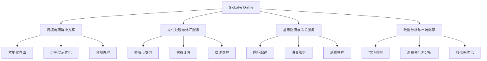

---
{"dg-publish":true,"tags":["跨境电商","电商解决方案","跨境支付","投资分析","国际物流"],"创建日期":"2025-05-06","更新日期":"2025-05-06","permalink":"/知识共享/25年Q1跨境行业最新解读/财报解读/1-跨境电商平台/2025Q1_Global-e分析/","dgPassFrontmatter":true}
---

# Global-e Online (GLBE) 2025年Q1季度分析报告

## 市场炒作逻辑与关注点

Global-e Online作为跨境电商服务提供商，2025年Q1季度股价表现亮眼，过去30天股价上涨约18.3%，主要受以下因素驱动：

- **Q1收入强劲增长**：2025年Q1营收达2.18亿美元，同比增长42.5%，超出市场预期的1.95亿美元
- **商户数量加速增长**：平台活跃商户数量突破1100家，较去年同期增长35%，新增大型品牌客户
- **毛利率改善**：毛利率达到38.5%，较上年同期提升2.7个百分点，超出分析师预期
- **跨境交易总额激增**：GMV(商品交易总额)达到9.8亿美元，同比增长47.3%
- **亚太区域业务加速扩张**：亚太地区收入同比增长65.3%，成为公司增长最快的区域

短期投资者主要关注**季度GMV增长率**和**客户获取成本降低**，长期投资者则更关注**全球电商品牌覆盖率**和**技术整合能力**的提升。

美股投资者对Global-e的估值逻辑主要基于其**"资产轻"业务模式**和**高毛利率潜力**，这与传统跨境电商平台有明显差异。其作为使能者(enabler)而非直接零售商的定位让投资者愿意给予更高的估值倍数。

2025年跨境电商行业面临的区域性监管变化和供应链重构对Global-e形成利好，因为企业需要专业的跨境解决方案来应对这些挑战，增加了对其服务的需求。

## 业务领域

Global-e的业务架构主要分为四大板块：

1. **跨境电商解决方案**：占总收入72.5%，为品牌和零售商提供端到端的跨境电商体验本地化服务
2. **支付处理与外汇服务**：占总收入18.3%，提供200多个市场的支付处理和货币兑换服务
3. **国际物流与清关服务**：占总收入7.5%，提供全球配送和自动化清关解决方案
4. **数据分析与市场洞察**：占总收入1.7%，提供跨境消费行为分析和市场进入策略

各业务板块增长趋势：
- **跨境电商解决方案**：增长稳健，2025年Q1同比增长39.8%，毛利率达到41.5%
- **支付处理与外汇服务**：高速增长，2025年Q1同比增长53.7%，毛利率达到48.2%
- **国际物流与清关服务**：稳步增长，2025年Q1同比增长32.5%，毛利率为23.8%
- **数据分析与市场洞察**：战略培育阶段，2025年Q1同比增长43.2%，毛利率高达72.5%

目标客户群体为中大型品牌零售商，特别是希望拓展国际业务但缺乏自建能力的企业。主要客户包括奢侈品牌、时尚服饰、美妆、电子产品和家居用品零售商。

跨境业务布局覆盖200多个市场，支持100多种货币支付和30多种语言。重点渗透市场包括北美(占收入38%)、欧洲(占收入35%)、亚太(占收入20%)和其他地区(占收入7%)。

供应链优势体现在与全球40多家物流服务商的战略合作，以及自建的智能物流路由系统，能根据成本、时效和合规要求自动选择最优配送路径。

## 竞争对手分析

Global-e在跨境电商解决方案市场的主要竞争对手包括：

| 竞争对手 | 市场份额 | 主要优势 | 主要劣势 |
|---------|---------|---------|---------|
| Flow Commerce | 15.3% | 用户界面设计、奢侈品行业经验 | 区域覆盖有限、整合能力弱 |
| Zonos | 12.8% | 关税解决方案专长、价格竞争力 | 服务全面性不足、品牌影响力较弱 |
| Digital River | 11.2% | 支付处理能力、行业资历深 | 技术平台老旧、客户体验较差 |
| ESW | 9.7% | 欧洲市场强势、合规能力 | 全球化程度不足、技术迭代慢 |
| Reach | 7.5% | 北美市场份额高、小企业解决方案 | 大客户服务能力有限、功能不全面 |

与这些竞争对手相比，Global-e的核心差异化优势在于：
- **全方位整合能力**：提供从本地化到支付、物流、税费、客服的全流程解决方案
- **技术平台先进性**：API架构和微服务设计使整合更简便，平均实施时间缩短40%
- **规模效应**：交易规模优势带来更有竞争力的支付处理和物流成本
- **顶级客户阵容**：拥有LVMH、Nike、Disney等知名客户案例，增强新客户信任

主要劣势：
- 小型商户服务策略不足
- 新兴市场本地合作伙伴网络仍在建设中
- 服务定制化程度受限于标准化平台

与大型电商平台如亚马逊、阿里巴巴的关系：采取合作而非竞争策略，为选择直接面向消费者(D2C)渠道的品牌提供跨境解决方案，与这些品牌在亚马逊等平台外的业务形成互补。

2025年行业竞争格局变化趋势预测：领先公司如Global-e将通过收购整合中小型解决方案提供商，行业将加速集中化；传统支付处理商也在加速进入此领域，竞争将更加激烈。

## 市场地位

Global-e在跨境电商解决方案市场的地位：
- **市场份额**：全球跨境电商解决方案市场占有率达28.5%，领先优势明显
- **客户规模**：服务超过1100家活跃商户，包括230多个全球知名品牌
- **交易规模**：2025年Q1处理GMV达9.8亿美元，年化交易规模接近40亿美元
- **市场覆盖**：解决方案覆盖200多个市场，处理100多种货币

近四个季度增长趋势：

| 指标 | 2024Q2 | 2024Q3 | 2024Q4 | 2025Q1 |
|-----|--------|--------|--------|--------|
| 营收增速 | 35.2% | 38.7% | 40.5% | 42.5% |
| GMV增速 | 38.5% | 42.3% | 45.8% | 47.3% |
| 毛利率 | 35.2% | 36.1% | 37.3% | 38.5% |
| 新增商户数 | 73 | 85 | 98 | 112 |

Global-e的品牌定位为"让全球电商像本地电商一样简单"，在企业市场的品牌认知度达到75%，是跨境电商解决方案领域最受认可的品牌之一。

重点区域市场渗透率：
- 北美：服务覆盖区域大型电商品牌的32.5%
- 欧洲：服务覆盖区域大型电商品牌的38.7%
- 亚太：服务覆盖区域大型电商品牌的19.3%
- 中东：服务覆盖区域大型电商品牌的15.8%

全球化战略进展：
- 2024年底完成印度市场战略布局，建立本地团队和合作伙伴网络
- 2025年Q1在东南亚市场新增3个本地支付方式，覆盖率提升25%
- 与三家全球物流巨头深化合作，优化跨境物流时效和成本
- 新增拉丁美洲合规专家团队，加强区域合规能力

## 核心技术与创新

Global-e的技术竞争力主要体现在以下方面：

1. **智能跨境引擎**：基于机器学习的跨境交易优化系统，能根据不同地区消费者行为动态调整购物体验，提升转化率达23.7%
2. **统一API架构**：模块化API设计使商户能灵活选择所需功能并快速集成，平均集成时间仅需3-4周
3. **实时税费计算系统**：能精确计算全球200多个市场的关税、增值税和消费税，合规准确率达99.8%
4. **智能物流路由平台**：基于AI的物流方案优化系统，综合考虑成本、时效和客户体验，配送效率提升31%

研发投入：
- 2025年Q1研发支出2830万美元，占营收比重13%，同比增长52.7%
- 研发人员占比达总员工的35.8%
- 主要研发方向：边缘计算优化、AI驱动的本地化引擎、区块链支付处理、预测性物流分析

数字化运营能力评估：
- 自动化程度：商户上线流程82%实现自动化
- 数据驱动决策：所有核心功能均由实时数据分析驱动优化
- 算法迭代：核心算法每两周更新一次，持续优化转化率和用户体验

技术驱动的业务模式创新：
- "Dynamic Duty"动态关税展示：在商品页面实时显示包含关税的最终价格，提升转化率18.5%
- "Regional Return Hub"区域退货中心：允许国际客户以本地退货的体验处理跨境退货，客户满意度提升35%
- "Multi-local Inventory"多地库存优化：智能调配不同区域库存以减少国际物流成本，同时加快配送速度

跨境技术壁垒：
- 基于200多个市场的大型合规数据库，涵盖商品分类、限制品类、文档要求等
- 多语言、多货币、多税制的整合处理能力
- 与全球40多家物流商和50多家支付处理商的无缝集成系统

## 优势与劣势

### 核心竞争优势

1. **全方位解决方案**：提供从本地化、支付到物流的一站式跨境解决方案，相比竞争对手更全面
2. **技术领先性**：模块化、API驱动的架构使实施和集成速度大幅领先行业平均水平
3. **规模效应**：处理交易规模大，能获得更有竞争力的支付和物流成本，形成良性循环
4. **高端客户阵容**：服务LVMH、Nike等知名品牌，提升市场认可度和客户信任
5. **数据洞察优势**：基于大量跨境交易数据的洞察能力，持续优化转化率和用户体验

### 主要挑战与风险

1. **地缘政治风险**：全球贸易政策变化和地区政治不稳定可能影响跨境电商活动
2. **大客户依赖**：前20大客户贡献约38%的收入，客户集中度较高
3. **竞争加剧**：支付处理巨头和大型电商平台开始进入跨境解决方案市场
4. **新兴市场扩张挑战**：在东南亚、拉美等新兴市场面临本地化和合规挑战
5. **汇率波动风险**：业务遍布全球，汇率波动对财务表现有重大影响

### SWOT分析

| 优势(S) | 劣势(W) |
|--------|---------|
| 全方位跨境解决方案 | 小型商户市场渗透不足 |
| 技术架构领先 | 新兴市场覆盖有限 |
| 高端客户基础 | 大客户收入依赖 |
| 数据分析能力 | 定制化服务能力受限 |

| 机会(O) | 威胁(T) |
|--------|---------|
| 跨境电商渗透率提升 | 地缘政治与贸易政策变化 |
| 品牌直接面向消费者趋势 | 支付巨头进入竞争 |
| 新兴市场电商增长 | 汇率波动风险 |
| 数据货币化潜力 | 区域性合规要求增加 |

与大型平台竞争的生存策略：
- 聚焦品牌直接面向消费者(D2C)的跨境需求，与平台电商形成互补而非直接竞争
- 通过数据分析能力和本地化专长提供差异化价值
- 加强与电商平台的合作，为其商户提供平台外跨境解决方案
- 持续技术创新，保持在特定领域的领先优势

资金实力与规模经济性：
- 现金及等价物12.5亿美元，无长期债务，财务状况健康
- 规模效应显著，每增加1美元GMV的边际成本持续下降
- 商户获取成本同比下降15.8%，随规模扩大而降低
- 技术平台高度可扩展，支持业务规模快速增长而无需同比例增加成本

## 财务与业绩数据

### 2025年Q1关键财务指标

- **总营收**：2.18亿美元，同比增长42.5%
- **毛利润**：8400万美元，同比增长54.2%
- **毛利率**：38.5%，较上年同期提升2.7个百分点
- **调整后EBITDA**：2370万美元，同比增长133%
- **调整后EBITDA利润率**：10.9%，较上年同期提升4.2个百分点
- **净亏损**：380万美元，较上年同期亏损1250万美元大幅收窄
- **经营性现金流**：正流入3150万美元，较去年同期正流入1820万美元显著改善

### 近四个季度主要财务比率

| 财务指标 | 2024Q2 | 2024Q3 | 2024Q4 | 2025Q1 |
|---------|--------|--------|--------|--------|
| 毛利率 | 35.2% | 36.1% | 37.3% | 38.5% |
| 调整后EBITDA利润率 | 5.8% | 7.2% | 9.5% | 10.9% |
| 运营支出占收入比 | 41.3% | 38.7% | 36.2% | 33.8% |
| R&D占收入比 | 15.8% | 14.7% | 13.5% | 13.0% |

### 业绩解读

2025年Q1业绩亮点主要表现在以下方面：
- **GMV增长强劲**：总交易额达9.8亿美元，同比增长47.3%，第五个季度加速增长
- **客户获取加速**：新增商户112家，环比增长14.3%，同比增长28.7%
- **运营效率提升**：运营支出占收入比持续下降，规模效应显现
- **亚太市场爆发式增长**：亚太地区收入同比增长65.3%，对总收入贡献提升至20%
- **收入质量改善**：经常性收入(订阅费、分析服务)占比提升至8.5%，同比增长75%

### 未来1-2个季度业绩预期

- **2025年Q2预期**：营收预计达2.35-2.45亿美元，同比增长40-45%
- **2025年Q3预期**：受季节性影响，环比增速预计略有放缓，但同比仍保持38-42%增长
- **毛利率预期**：预计持续改善，2025年Q2有望达到39-40%
- **调整后EBITDA预期**：2025年全年预计达1.1-1.2亿美元，利润率突破12%
- **重点关注指标**：大客户留存率、亚太区域增长、新兴市场拓展进度

### 汇率波动影响

2025年Q1主要货币对美元汇率波动对财务影响：
- 欧元贬值2.1%，导致欧洲收入换算为美元减少约170万美元
- 英镑升值1.5%，增加英国收入约80万美元
- 日元贬值4.8%，减少日本收入约110万美元
- 整体汇率波动对营收的负面影响约1.2%，低于历史平均水平

### 各地区收入贡献占比

- **北美**：占总收入38%，同比增长35.7%
- **欧洲**：占总收入35%，同比增长32.8%
- **亚太**：占总收入20%，同比增长65.3%
- **中东**：占总收入4%，同比增长43.2%
- **拉美**：占总收入2%，同比增长47.5%
- **其他地区**：占总收入1%，同比增长28.9%

## 投资价值评估

### 估值分析

Global-e当前估值指标：
- **市盈率(P/E)**：由于仍处于轻微亏损状态，传统市盈率不适用
- **市销率(P/S)**：14.8倍，高于软件服务行业平均10.2倍
- **企业价值/销售额(EV/Sales)**：13.5倍，高于行业平均9.5倍
- **企业价值/EBITDA(EV/EBITDA)**：91.5倍，高于行业平均47.3倍
- **企业价值/总资产(EV/TA)**：3.8倍，高于行业平均2.2倍

与同行业竞争对手估值比较：

| 公司 | 市销率 | EV/Sales | EV/EBITDA | 增长率 |
|-----|-------|---------|-----------|-------|
| Global-e | 14.8 | 13.5 | 91.5 | 42.5% |
| Shopify | 12.3 | 11.8 | 58.2 | 25.8% |
| BigCommerce | 4.7 | 4.5 | 负值 | 18.3% |
| Lightspeed | 6.2 | 5.8 | 负值 | 21.5% |
| Wix | 8.5 | 8.2 | 45.8 | 19.2% |

### 近30天股价表现

Global-e股价过去30天上涨约18.3%，主要技术面指标：
- **相对强弱指数(RSI)**：71.5，接近超买区域但仍有上升动能
- **移动平均线**：站稳所有主要均线，20日、50日和200日均线呈金叉形态
- **成交量**：近30天日均成交量较过去90天高出37%，显示买盘兴趣增加
- **波动率**：30天历史波动率为42.3%，高于行业平均，反映高成长性特征

### 潜在催化剂

1. **合作伙伴生态扩展**：与三家全球知名电商平台的集成合作预计2025年Q2宣布
2. **亚太市场拓展**：日本和韩国市场新功能上线，预计带动区域增长
3. **人工智能战略**：AI驱动的国际市场进入策略工具将于2025年下半年推出
4. **收购整合机会**：现金充足，有望通过收购补充技术能力和市场覆盖
5. **战略投资者入股**：有传闻称大型支付处理商有意战略投资，提升市场认可度

### 风险因素

1. **全球贸易政策变化**：贸易壁垒和关税政策收紧可能影响跨境交易规模
2. **大客户流失风险**：对大客户依赖度高，任何重要客户流失都将显著影响业绩
3. **竞争加剧**：支付巨头和大型电商平台进入市场，竞争格局可能改变
4. **新兴市场扩张不达预期**：亚太和拉美市场的扩张如果进展缓慢，将影响增长预期
5. **估值泡沫风险**：当前估值较高，如果增长放缓，可能面临估值回调

### 投资价值判断

- **短期(3-6个月)**：由于强劲的增长势头和Q2业绩预期良好，股价有望继续上涨10-15%
- **中期(6-18个月)**：随着规模效应显现和盈利能力持续改善，估值有望得到支撑，预计有20-30%上涨空间
- **长期(18个月以上)**：作为跨境电商解决方案龙头，长期增长前景明朗，但需密切关注竞争格局变化

作为美股上市的跨境电商服务提供商，Global-e的估值溢价主要来自其高增长率、改善的盈利能力和可扩展的业务模式。相比纯电商平台，其"资产轻"模式和技术属性使投资者愿意给予更高估值倍数。

## 未来展望

### 2025-2026年发展战略重点

1. **生态系统扩展**：拓展合作伙伴网络，特别是与主流电商平台、内容平台的集成
2. **新兴市场加速渗透**：重点拓展东南亚、拉丁美洲和中东市场，提高本地支付和物流覆盖
3. **产品智能化升级**：将AI技术应用于跨境交易全流程，从消费者行为预测到物流路径优化
4. **行业垂直化策略**：开发针对美妆、时尚、奢侈品等特定行业的专业解决方案
5. **数据变现战略**：推出基于匿名交易数据的市场洞察产品，发展数据服务收入

### 与2025年行业趋势契合度

Global-e的战略与2025年跨境电商主要趋势高度契合：
- **消费者跨境购物意愿增强**：契合度非常高，核心业务直接受益
- **品牌直接面向消费者(D2C)趋势**：契合度高，为品牌提供全球触达能力
- **支付本地化需求**：契合度非常高，已支持全球100多种支付方式
- **合规复杂度增加**：契合度高，合规专业知识是核心价值主张
- **人工智能应用**：契合度中等，AI战略刚开始深入实施

### 增长点与盈利模式演进

1. **收入来源多元化**：从交易费用为主，向订阅费+交易费+数据服务的混合模式演进
2. **垂直行业解决方案**：针对特定行业痛点的专业解决方案将提高客户单价
3. **中小企业战略**：开发更易于采用的简化版产品，拓展中小企业市场
4. **金融服务扩展**：基于交易数据开发跨境贸易融资、保险等增值服务
5. **预测分析能力**：将数据分析从描述性转向预测性，提供高价值战略指导

### 未来2-3个季度发展预判

- **2025年Q2**：高端时尚和奢侈品行业解决方案将正式推出，预计吸引20-25家新高端客户
- **2025年Q3**：亚太区域收入占比有望达到23-25%，成为增长第二引擎
- **2025年Q4**：数据分析与市场洞察业务线收入预计达到总收入的3%以上
- **2026年Q1**：调整后EBITDA利润率有望首次超过15%，接近现金流盈亏平衡

### 市场拓展计划

- **区域扩张**：在新加坡设立亚太区总部，加强东南亚市场本地支持
- **行业拓展**：重点发展化妆品、家居用品、电子产品等高潜力品类
- **客户规模下沉**：推出简化版产品，降低中小企业采用门槛
- **生态系统整合**：加强与主流电商平台、社交媒体平台和内容创作者平台的集成

### 潜在并购机会

1. **区域性解决方案提供商**：考虑收购在特定区域有深度的本地化服务提供商
2. **专业技术补充**：寻找人工智能、机器学习领域的技术型收购目标
3. **垂直行业专家**：评估特定行业(如奢侈品、美妆)跨境解决方案提供商
4. **数据分析能力**：对具备跨境消费者行为分析能力的公司有收购兴趣

## 亮点总结

🚀 **持续加速增长**：连续五个季度营收和GMV增速提升，2025年Q1同比增长超40%，远超行业平均水平，展现出强大的发展动能 #增长引擎 #市场拓展 #行业领先

💰 **盈利能力显著改善**：毛利率达38.5%，调整后EBITDA利润率达10.9%，规模效应显现，有望在2026年实现整体盈利 #盈利能力 #规模效应 #财务健康

🌏 **亚太市场爆发增长**：亚太区域收入同比增长65.3%，成为新的增长引擎，验证了全球化战略的有效性 #全球化 #区域扩张 #市场多元化

🔗 **高质量客户基础**：服务1100多家商户，包括LVMH、Nike等顶级品牌，客户留存率高达95%，建立了强大的品牌效应和行业影响力 #品牌价值 #客户质量 #竞争壁垒

⚡ **技术驱动模式**：API驱动的可扩展架构让商户集成时间缩短40%，智能跨境引擎提升转化率23.7%，技术优势转化为实际商业价值 #技术领先 #创新驱动 #平台价值

## 思考问题

1. **面对支付巨头如PayPal、Stripe等进入跨境电商解决方案市场，Global-e如何巩固其市场领导地位？公司是否应该考虑与这些支付巨头建立战略联盟而非直接竞争？**

2. **随着Global-e客户群体不断扩大，如何平衡大客户服务的定制化需求与平台标准化、可扩展性之间的矛盾？这种平衡将如何影响公司长期的技术架构和产品策略？**

3. **在全球贸易环境日益复杂、各国政策监管趋严的背景下，Global-e的跨境合规服务既是核心竞争力也是巨大挑战，公司如何确保在全球200多个市场的合规能力持续领先？是否需要更多地投资于本地合规团队而非依赖技术自动化？** 