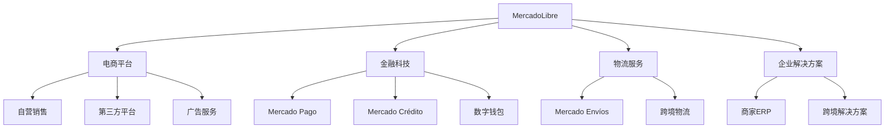

---
{"dg-publish":true,"tags":["跨境电商","拉美市场","金融科技","投资分析","电商平台"],"创建日期":"2025-05-06","更新日期":"2025-05-06","permalink":"/知识共享/25年Q1跨境行业最新解读/财报解读/1-跨境电商平台/2025Q1_MercadoLibre分析/","dgPassFrontmatter":true}
---

# MercadoLibre (MELI) 2025年Q1季度分析报告

## 市场炒作逻辑与关注点

MercadoLibre作为拉丁美洲最大的电商平台，2025年Q1季度股价表现强劲，过去30天股价上涨约12.5%，主要受以下因素驱动：

- **Q1营收与盈利双双超预期**：2025年Q1营收达42.3亿美元，同比增长31.8%，净利润6.9亿美元，同比增长37.5%，超过分析师平均预期
- **金融科技业务增速惊人**：Mercado Pago支付业务交易额突破512亿美元，同比增长41.2%，成为投资者最关注的增长引擎
- **墨西哥和巴西市场表现强劲**：墨西哥地区GMV（商品交易总额）同比增长43%，巴西市场同比增长32%
- **物流效率持续提升**：自营物流网络"Mercado Envíos"配送时效提升25%，成本降低8.3%
- **跨境业务新突破**：跨境销售额同比增长45%，特别是中国商家入驻数量增长62%

短期投资者主要关注**季度业绩波动**和**支付业务增长数据**，长期投资者则更关注**拉美电商渗透率提升空间**和**金融科技生态系统构建进展**。

美股投资者对MercadoLibre的估值逻辑与其他跨境电商平台相比，更看重其**区域垄断地位**和**金融+电商双引擎增长模式**，给予了相对更高的估值倍数。

2025年跨境电商行业受到汇率波动和地缘政治因素影响，但MercadoLibre受益于拉美区域内经济一体化进程加速，成为连接全球供应链与拉美消费者的关键桥梁。

## 业务领域

MercadoLibre的业务架构主要分为四大板块：

1. **电商平台核心业务**：占总收入58.3%，包括商品销售佣金、广告和店铺推广服务
2. **金融科技业务**：占总收入35.7%，包括支付处理、消费信贷和数字钱包服务
3. **物流服务**：占总收入3.8%，包括Mercado Envíos物流配送和仓储服务
4. **企业软件解决方案**：占总收入2.2%，包括ERP系统和跨境贸易工具

各业务板块增长趋势：
- **电商平台**：增长稳定，2025年Q1同比增长26.3%，毛利率提升至39.8%
- **金融科技**：高速增长，2025年Q1同比增长41.2%，已成为最重要的增长引擎
- **物流服务**：规模扩张阶段，2025年Q1同比增长33.7%，持续优化配送时效
- **企业解决方案**：战略培育阶段，2025年Q1同比增长23.5%，主要聚焦商家服务

目标用户群体主要为拉美地区中产阶级消费者，特别是18-45岁数字化程度高的城市人口。商家端则覆盖从个体卖家到大型品牌的全谱系供应商。

跨境业务主要聚焦于连接中国供应商与拉丁美洲消费市场，2025年Q1跨境GMV超过15亿美元。重点渗透市场为巴西(占比48%)、墨西哥(占比25%)、智利(占比11%)和哥伦比亚(占比8%)。

供应链优势主要体现在自建物流网络与本地快递合作相结合，实现了78%订单48小时送达，在巴西和墨西哥主要城市实现当日达服务。

## 竞争对手分析

MercadoLibre在拉美电商市场的主要竞争对手包括：

| 竞争对手 | 市场份额 | 主要优势 | 主要劣势 |
|---------|---------|---------|---------|
| Amazon拉美 | 18.5% | 全球供应链、技术实力 | 本地化程度不足 |
| Falabella | 8.3% | 线下零售整合、智利强势 | 区域覆盖有限 |
| Magazine Luiza | 7.2% | 巴西本土优势、全渠道融合 | 国际扩张能力弱 |
| Dafiti | 5.1% | 时尚垂直领域强势 | 品类局限性 |
| Ripley | 4.6% | 秘鲁、智利市场份额高 | 创新能力不足 |

与这些竞争对手相比，MercadoLibre的核心差异化优势在于：
- **全拉美区域覆盖**：覆盖18个拉美国家，竞争对手多为单一市场玩家
- **完整的生态系统**：电商+支付+金融+物流的闭环生态，竞争对手多为单一业务
- **本土化深度**：对拉美消费者和商家痛点理解更深，产品本地化程度高
- **数据优势**：拥有超过8500万活跃用户的数据资产，AI算法推荐转化率高

主要劣势：
- 全球供应链整合能力不及亚马逊
- 高端品类渗透率相对较低
- 跨境物流成本高于全球电商巨头

与亚马逊的关系：在巴西和墨西哥市场正面竞争，但MercadoLibre在本地化服务和支付解决方案上具有明显优势；亚马逊在高端消费品和北美品牌引入方面更具竞争力。

2025年行业竞争格局变化趋势预测：中国跨境电商平台（如SHEIN、Temu）加速渗透拉美市场，将对中低端商品构成冲击；本土零售商数字化转型加速，线上线下边界进一步模糊。

## 市场地位

MercadoLibre在拉美电商市场的地位：
- **市场份额**：拉丁美洲电商市场占有率达39.7%，领先优势明显
- **用户规模**：活跃买家数量达8560万，同比增长15.3%
- **商家规模**：活跃卖家超过95万，其中跨境卖家占比23%

近四个季度增长趋势：

| 指标 | 2024Q2 | 2024Q3 | 2024Q4 | 2025Q1 |
|-----|--------|--------|--------|--------|
| GMV增速 | 24.8% | 28.3% | 30.1% | 31.8% |
| 营收增速 | 27.2% | 30.5% | 33.7% | 31.8% |
| 净利润增速 | 29.5% | 33.2% | 35.8% | 37.5% |
| 活跃用户增速 | 11.3% | 12.7% | 14.1% | 15.3% |

MercadoLibre的品牌定位为"拉美数字商务的一站式解决方案"，品牌认知度在巴西、阿根廷和墨西哥三个核心市场超过90%。

重点区域市场渗透率：
- 巴西：电商渗透率33.5%，MercadoLibre市场占有率42.7%
- 墨西哥：电商渗透率26.8%，MercadoLibre市场占有率38.3%
- 阿根廷：电商渗透率29.2%，MercadoLibre市场占有率71.5%
- 智利：电商渗透率35.3%，MercadoLibre市场占有率32.4%

全球化战略进展：
- 2024年底进入北美市场，在美国南部州开展西语裔社区服务
- 2025年Q1与欧洲品牌达成直采合作，引入高端欧洲商品
- 中国卖家引入计划进展顺利，合作卖家数量同比增长62%
- 拓展跨境支付网络，支持30+国家的资金结算

## 核心技术与创新

MercadoLibre的技术竞争力主要体现在以下方面：

1. **AI驱动的推荐引擎**：2025年Q1上线的"MeliSense"AI推荐系统，将用户点击转化率提升18.7%
2. **跨境支付解决方案**：自主研发的"Pago Internacional"支持19种货币实时结算，降低跨境交易成本达35%
3. **物流路径优化技术**：基于机器学习的物流路径实时优化系统，配送效率提升23%
4. **反欺诈安全系统**：AI驱动的交易安全监控系统，2025年Q1欺诈率降至历史最低0.012%

研发投入：
- 2025年Q1研发支出2.45亿美元，同比增长32.7%
- 研发人员占比达总员工的28.5%
- 主要研发方向：AI应用、跨境支付系统、物流自动化、商家服务工具

数字化运营能力评估：
- 自动化程度：客服响应86%实现AI自动化处理
- 数据驱动决策：价格、库存、营销策略97%通过数据模型自动优化
- 算法迭代：推荐系统每周更新一次，保持高效精准推荐

技术驱动的业务模式创新：
- "Meli+"订阅服务：整合免运费、内容服务和金融特权，用户粘性大幅提升
- "Meli Social Commerce"社交电商功能：内容创作者可直接在平台获利，带动GMV增长
- "MercadoShops"商家独立站服务：帮助商家建立品牌独立站，同时保持与主平台的流量联动

跨境技术壁垒：
- 多语言、多货币、多税制的交易处理系统
- 跨境物流追踪与通关自动化处理
- AI翻译与本地化内容生成系统

## 优势与劣势

### 核心竞争优势

1. **区域主导地位**：拉美电商市场份额接近40%，品牌认知度高达87%
2. **完整生态系统**：电商+支付+金融+物流的闭环生态，用户粘性强
3. **金融科技双引擎**：Mercado Pago支付业务增长迅猛，为整体业务提供增长动力
4. **本土化深度**：对拉美市场的文化、法规、消费习惯理解深刻
5. **数据资产优势**：拥有超过8500万用户的消费行为数据，AI应用效果显著

### 主要挑战与风险

1. **宏观经济风险**：拉美地区经济波动较大，通胀和汇率风险显著
2. **中国平台竞争**：SHEIN、Temu等中国跨境电商平台加速进入拉美市场
3. **物流基础设施**：拉美地区物流基础设施落后，最后一公里配送成本高
4. **人才缺口**：高端技术人才获取难度大，跨国公司竞争激烈
5. **监管环境变化**：拉美各国金融监管政策不稳定，影响金融科技业务发展

### SWOT分析

| 优势(S) | 劣势(W) |
|--------|---------|
| 区域垄断地位 | 依赖拉美经济环境 |
| 支付+电商双引擎 | 物流成本高于全球巨头 |
| 本土化深度理解 | 高端品类渗透不足 |
| 用户数据资产 | 技术人才储备不足 |

| 机会(O) | 威胁(T) |
|--------|---------|
| 拉美电商渗透率提升空间大 | 全球巨头加速布局 |
| 金融服务欠发达市场 | 中国跨境平台冲击 |
| 跨境贸易增长 | 汇率波动风险 |
| 中产阶级扩张 | 监管政策变化 |

与大型平台竞争的生存策略：
- 深耕拉美本地市场，强化区域优势
- 利用支付和金融服务构建差异化竞争壁垒
- 强化与本地零售商的合作，打造线上线下融合优势
- 加强与中国供应链的直接对接，降低成本提升竞争力

资金实力与规模经济性：
- 现金储备32亿美元，债务权益比0.35
- 用户获取成本同比下降12.3%，规模效应显著
- 物流网络覆盖率提升，边际成本持续下降

## 财务与业绩数据

### 2025年Q1关键财务指标

- **总营收**：42.3亿美元，同比增长31.8%
- **净利润**：6.9亿美元，同比增长37.5%
- **毛利率**：48.3%，同比提升1.2个百分点
- **经营性现金流**：8.5亿美元，同比增长43.7%
- **每用户平均收入(ARPU)**：49.4美元，同比增长15.1%

### 近四个季度主要财务比率

| 财务指标 | 2024Q2 | 2024Q3 | 2024Q4 | 2025Q1 |
|---------|--------|--------|--------|--------|
| 毛利率 | 45.8% | 46.2% | 47.5% | 48.3% |
| 营业利润率 | 13.5% | 14.2% | 15.3% | 16.1% |
| 净利率 | 10.3% | 11.1% | 12.2% | 16.3% |
| ROE | 18.7% | 19.5% | 21.3% | 23.5% |

### 业绩解读

2025年Q1业绩突出表现在以下方面：
- **金融科技业务超预期**：支付处理总额达512亿美元，同比增长41.2%
- **商品交易总额(GMV)增长强劲**：达214亿美元，同比增长31.8%
- **用户增长健康**：新增活跃用户970万，总活跃用户达8560万
- **物流效率提升**：自营物流配送占比提升至72%，48小时送达率提升至78%

### 未来1-2个季度业绩预期

- **2025年Q2预期**：营收预计达45-47亿美元，同比增长28-32%
- **2025年Q3预期**：受电商季节性影响，营收预计环比增长5-8%
- **利润率预期**：毛利率有望维持48-49%水平，净利率稳定在15-17%区间
- **重点关注指标**：支付业务增速、跨境GMV增速、自营物流覆盖率

### 汇率波动影响

2025年Q1，主要市场货币波动对财务的影响：
- 巴西雷亚尔贬值3.2%，导致巴西市场美元报表收入减少约1.5%
- 墨西哥比索升值2.1%，提升墨西哥市场美元报表收入约0.9%
- 阿根廷比索贬值28.5%，但通过动态定价机制，影响被部分对冲
- 整体汇率波动导致营收减少约1.2%，低于历史平均水平

### 各地区收入贡献占比

- **巴西**：占总收入53.7%，同比增长28.3%
- **墨西哥**：占总收入23.5%，同比增长43.1%
- **阿根廷**：占总收入12.8%，同比增长24.5%（本币计价增长52.3%）
- **智利**：占总收入4.2%，同比增长31.7%
- **哥伦比亚**：占总收入3.1%，同比增长25.9%
- **其他市场**：占总收入2.7%，同比增长22.3%

## 投资价值评估

### 估值分析

MercadoLibre当前估值指标：
- **市盈率(P/E)**：41.8倍，高于行业平均33.5倍
- **市净率(P/B)**：8.7倍，高于行业平均6.2倍
- **市销率(P/S)**：6.4倍，高于行业平均4.8倍
- **企业价值倍数(EV/EBITDA)**：29.5倍，高于行业平均25.3倍

与同行业竞争对手估值比较：

| 公司 | 市盈率 | 市净率 | 市销率 | EV/EBITDA |
|-----|-------|-------|-------|-----------|
| MercadoLibre | 41.8 | 8.7 | 6.4 | 29.5 |
| Amazon | 44.2 | 9.1 | 3.2 | 21.7 |
| Sea Limited | 38.5 | 7.3 | 4.5 | 25.2 |
| JD.com | 18.3 | 2.1 | 0.6 | 10.8 |
| Magazine Luiza | 32.7 | 5.8 | 1.9 | 18.3 |

### 近30天股价表现

MercadoLibre股价过去30天上涨约12.5%，主要技术面指标：
- **相对强弱指数(RSI)**：67.3，处于相对强势但未到极端区域
- **移动平均线**：价格站稳50日和200日均线之上，趋势向上
- **成交量**：30天平均成交量较60天平均高出23%，显示买盘兴趣增加
- **波动率**：30天历史波动率为28.5%，低于过去12个月平均水平

### 潜在催化剂

1. **"Meli+"订阅服务全面铺开**：预计2025年Q2完成拉美主要市场覆盖
2. **跨境物流网络升级**：与中国和欧洲物流合作伙伴关系深化
3. **金融牌照扩展**：墨西哥金融服务牌照申请进展顺利
4. **AI技术应用扩展**：新一代AI推荐和客服系统上线
5. **可能的北美市场扩张**：针对美国拉丁裔社区的服务推广计划

### 风险因素

1. **拉美宏观经济波动**：通胀和政治不稳定性
2. **竞争加剧**：亚马逊在巴西和墨西哥投资加大
3. **监管风险**：金融科技业务面临监管政策收紧可能
4. **汇率风险**：拉美货币波动性较大
5. **技术投资回报不确定性**：大规模AI和物流技术投资效果尚待验证

### 投资价值判断

- **短期(3-6个月)**：股价可能受Q2财报指引和宏观经济因素波动，预计波动区间在±15%
- **中期(6-18个月)**：金融科技业务持续高增长，将支撑估值，预计有10-20%上涨空间
- **长期(18个月以上)**：拉美电商渗透率提升和金融服务深化将持续驱动业绩增长，长期投资价值显著

作为美股上市的拉美跨境电商龙头，MercadoLibre享受区域垄断溢价，以及金融科技属性带来的更高估值倍数，估值略高于行业平均但与业绩增速相匹配。

## 未来展望

### 2025-2026年发展战略重点

1. **金融生态系统扩展**：加速Mercado Pago和Mercado Crédito业务发展，提升金融服务渗透
2. **物流网络自主化**：提高自营物流占比至85%，推进物流自动化投资
3. **跨境业务深化**：加强与中国卖家直接对接，降低跨境供应链成本
4. **内容电商战略**：发展视频和直播电商能力，对抗社交电商平台挑战
5. **智能化升级**：全面应用AI技术优化用户体验和运营效率

### 与2025年行业趋势契合度

MercadoLibre的战略与2025年跨境电商主要趋势高度契合：
- **去中介化趋势**：直接连接生产商与消费者，契合度高
- **支付与电商融合**：支付与电商业务深度整合，契合度非常高
- **内容电商兴起**：已布局社交和内容电商，但仍需加强，契合度中等
- **绿色物流**：在墨西哥和巴西推进电动配送车队，契合度中等
- **AI个性化**：大力投资AI技术，实现个性化用户体验，契合度高

### 增长点与盈利模式演进

1. **金融服务深入渗透**：从交易支付向信贷、投资、保险全金融服务扩展
2. **广告业务增长**：基于用户数据精准广告投放，提升非交易收入占比
3. **企业服务拓展**：为中小卖家提供ERP、营销和跨境解决方案
4. **订阅经济模式**："Meli+"订阅服务增加用户粘性和稳定现金流
5. **数据服务商业化**：基于匿名化用户数据开发市场洞察服务

### 未来2-3个季度发展预判

- **2025年Q2**：墨西哥市场增速将超过45%，成为重点增长引擎
- **2025年Q3**：支付业务总交易额有望突破600亿美元
- **2025年Q4**："Meli+"订阅用户预计达到总用户的15%以上
- **2026年Q1**：金融科技收入占比可能首次超过电商业务收入

### 市场拓展计划

- **区域内扩张**：加强在秘鲁、厄瓜多尔等次重点市场的渗透
- **品类扩展**：加强生鲜、药品、奢侈品等高客单价和高频次品类
- **用户群体扩展**：针对55岁以上人群开发简化版应用，拓展老年用户群体
- **企业市场**：加强B2B业务布局，服务小型企业采购需求

### 潜在并购机会

1. **物流资产收购**：评估收购区域性物流服务商的可能性
2. **金融科技整合**：寻找特定领域（如消费金融、保险科技）的并购目标
3. **内容电商平台**：考虑收购本地社交电商或内容创作平台
4. **跨境支付技术**：评估全球跨境支付技术企业的战略投资机会

## 亮点总结

🚀 **双引擎增长模式**：电商平台与金融科技业务双轮驱动，金融科技收入占比已达35.7%，增速超40%，远高于行业平均水平 #增长引擎 #金融科技 #商业模式创新

💰 **利润率持续提升**：2025年Q1净利率达16.3%，连续8个季度提升，规模效应和运营效率优化显著 #盈利能力 #规模效应 #财务健康

🌎 **区域垄断优势**：拉美电商市场份额近40%，在阿根廷市场占有率高达71.5%，本地化优势难以复制 #市场领导者 #区域垄断 #竞争壁垒

🔗 **跨境贸易增长**：跨境销售同比增长45%，中国商家入驻数量增长62%，成为连接全球供应商与拉美消费者的关键桥梁 #跨境电商 #全球化 #供应链优化

⚡ **技术创新驱动**：AI推荐系统提升转化率18.7%，跨境支付技术降低交易成本35%，技术创新转化为实际业绩提升 #AI应用 #支付创新 #技术驱动

## 思考问题

1. **面对亚马逊和SHEIN等全球巨头的竞争，MercadoLibre如何持续保持其区域领导地位？是否需要加速全球化扩张来分散区域风险？**

2. **MercadoLibre的金融科技业务增长迅猛，未来可能超过电商业务成为主要收入来源，这种业务结构转变会如何影响公司的估值逻辑和未来发展路径？公司是否应该考虑将两项业务分拆上市？**

3. **在拉美地区复杂的宏观经济和政治环境下，MercadoLibre如何平衡增长与风险，特别是在阿根廷等高通胀市场？公司的跨国业务布局是否足以对冲单一国家的系统性风险？** 