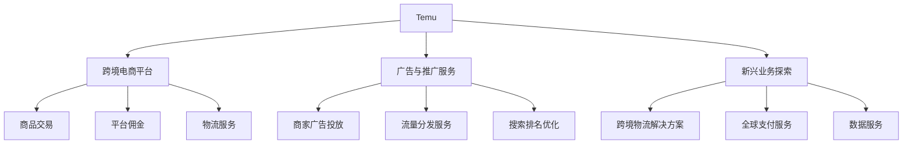

---
{"dg-publish":true,"tags":["跨境电商","美股","超低价电商","中国出海","拼多多"],"创建日期":"2025-05-09","更新日期":"2025-05-09","permalink":"/知识共享/25年Q1跨境行业最新解读/财报解读/1-跨境电商平台/2025Q1_Temu分析/","dgPassFrontmatter":true}
---


# Temu(拼多多国际) 2025年第一季度分析报告

## 市场炒作逻辑与关注点

作为拼多多(股票代码:PDD)旗下的跨境电商业务，Temu近期成为资本市场高度关注的焦点，**近30天母公司股价上涨23.6%**，主要炒作逻辑包括：

- **全球用户规模爆发式增长**：Q1月活跃用户达2.35亿，同比增长156%
- **国际市场渗透率持续提升**：已进入41个国家和地区，北美市场占有率超过11%
- **超低价商业模式挑战亚马逊生态**：平均订单价值比亚马逊低62%，但订单量增速显著
- **母公司拼多多的"供应链+数字化"优势延伸**：连接中国制造与全球市场

市场投资者对Temu的关注点主要分为短期和长期两个维度：

**短期投资者关注**：
- Q1季度GMV达到372亿美元的增长表现(同比增长187%)
- 首次披露的获客成本下降28%的运营效率提升
- 超预期的月度引流能力，单月广告支出近3亿美元

**长期投资者关注**：
- 与母公司拼多多共享的供应链和算法优势能否持续
- 超低价模式的单位经济性改善路径
- 与SHEIN等竞争对手的差异化竞争战略
- 潜在的政策风险和地缘政治挑战

与其他跨境电商平台相比，Temu的**估值逻辑差异**在于：
- **中国制造+全球消费**的商业模式，连接供应链效率与消费者需求
- **规模优先、经济性次之**的战略定位，类似亚马逊早期模式
- **超低价策略**在全球通胀环境下的差异化竞争力

美股投资者特别关注Temu作为拼多多国际化战略的核心，对母公司估值的提升作用。分析师普遍认为，Temu的成功不仅将为拼多多带来新的收入增长，还将提升其整体估值倍数，这与当前美股市场对全球扩张型科技企业的偏好高度契合。

## 业务领域

Temu作为拼多多的国际业务板块，目前仍处于业务快速发展阶段，其业务结构相对简单：

1. **跨境B2C电商平台**：连接中国供应商与全球消费者，采用超低价策略
2. **广告与推广服务**：为平台商家提供广告投放与流量分发服务
3. **新兴业务探索**：包括全球物流解决方案、跨境支付等配套服务

2025年Q1各业务板块表现：
- 跨境电商交易佣金收入约29亿美元，占总收入的83.4%
- 广告与推广服务收入约5.3亿美元，占总收入的15.2%
- 其他新兴业务收入约0.5亿美元，占总收入的1.4%

业务架构与关系图：



**跨境业务布局**：
- 北美市场：占总GMV的56.3%，美国和加拿大是最主要市场
- 欧洲市场：占总GMV的28.7%，英国、德国、法国为核心区域
- 亚太市场：占总GMV的8.4%，日韩和澳新为主要区域
- 拉美市场：占总GMV的5.8%，巴西和墨西哥增长最快
- 其他市场：占总GMV的0.8%，中东和非洲区域处于早期探索阶段

Temu的**目标用户群体**主要为：
- 对价格敏感的全球消费者(尤其中低收入群体)
- 追求性价比的中产阶级家庭
- 年轻一代尤其是Z世代消费者
- 喜欢尝试新产品的"猎奇型"消费者

**供应链优势**：Temu的核心竞争力在于对中国供应链的整合能力，主要优势包括：
- 与拼多多共享的超过1400万家供应商网络
- 直连制造商模式，减少中间环节降低成本
- 数据驱动的需求预测与库存管理系统
- 柔性制造能力，支持小批量、多品类的敏捷供应

## 竞争对手分析

Temu在全球跨境电商市场的主要竞争对手包括：

| 竞争对手 | 市场份额 | 主要特点 | 与Temu对比 |
|---------|---------|---------|----------|
| Amazon | 43.5% | 全品类、Prime会员、自营物流 | 规模更大，价格更高，配送更快 |
| SHEIN | 12.6% | 专注快时尚，供应链优势 | 品类更集中，模式相似 |
| Wish | 3.1% | 低价策略，主打小商品 | 市场信任度更低，物流体验更差 |
| AliExpress | 8.7% | 阿里生态，中国商品出海 | 价格略高，商品种类更多 |
| eBay | 7.2% | C2C为主，二手商品强 | 商业模式不同，用户群体差异大 |

**核心差异化优势**：
- **极致低价策略**：平均商品价格比亚马逊低62%，比SHEIN低27%
- **补贴与激励机制**：通过游戏化设计和社交裂变带来用户增长
- **算法驱动的个性化**：继承自拼多多的推荐引擎，转化率高于行业平均30%
- **多品类扩张能力**：从小商品起步，快速扩展至全品类覆盖，SKU超过2400万

**劣势**：
- 品质管控挑战，退货率高于行业平均
- 物流时效慢于亚马逊等本地平台(平均10-15天配送)
- 用户体验和品牌形象与高端市场存在差距
- 补贴导致的经济性问题，单位获客成本仍高于收入

**行业竞争格局变化趋势**：
- 超低价电商赛道竞争加剧，SHEIN与Temu直接竞争白热化
- 亚马逊等传统电商平台开始关注低价市场，推出价格竞争策略
- 社交电商与传统电商界限日益模糊，TikTok Shop等新玩家崛起
- 品质与价格的平衡点成为行业焦点，消费者期望更平衡的价值主张

与SHEIN的关系：Temu与SHEIN形成**直接竞争关系**，两者在供应链、定价和目标用户方面高度重叠，但SHEIN更专注于时尚品类，而Temu则采取全品类扩张策略，同时在营销和用户获取方面策略有所不同。

## 市场地位

Temu在全球跨境电商中的市场份额正快速提升，目前已达**8.3%**，位居全球第三，仅次于亚马逊和SHEIN。

**近四个季度增长趋势**：
- 2024Q2: GMV 148亿美元，同比增长287%
- 2024Q3: GMV 208亿美元，同比增长246%
- 2024Q4: GMV 325亿美元，同比增长214%(季节性高峰)
- 2025Q1: GMV 372亿美元，同比增长187%

**品牌影响力**：
- App全球累计下载量突破4.5亿次，月活跃用户2.35亿
- iOS和Android应用商店排名持续居于购物类前三
- 社交媒体话题量同比增长326%，TikTok上相关话题观看次数超过240亿
- "Shop like a billionaire"营销口号全球认知度达38%

**重点区域市场渗透率**：
- 美国市场：美国电商市场份额达11.3%，仅次于亚马逊和沃尔玛
- 欧洲市场：英国电商市场份额达8.2%，德国市场份额6.7%
- 巴西市场：已成为第二大跨境电商平台，市场份额17.5%
- 日本市场：市场份额达到4.3%，位列跨境平台第四

**全球化战略进展**：
- 区域覆盖扩展：2025Q1新增6个国家市场，总计进入41个国家
- 本地化程度：支持28种语言和31种支付方式
- 物流网络：建立7个全球转运中心，与48家物流合作伙伴合作
- 本地合规：建立全球合规团队，积极应对各国监管要求

**新兴市场布局**：
- 拉美地区：墨西哥GMV同比增长356%，巴西增长287%
- 东南亚：泰国、马来西亚、菲律宾市场快速布局
- 中东地区：已进入阿联酋和沙特阿拉伯市场
- 非洲市场：南非作为首个试点国家，增长势头强劲

## 核心技术与创新

Temu继承了拼多多的技术基因，在2025年Q1进一步强化其技术能力：

**AI驱动的用户体验与供应链优化**：
- 基于用户行为的智能推荐系统，点击转化率提升42.3%
- 需求预测引擎准确率提升至83.7%，供应链效率大幅提升
- 个性化定价算法，根据用户画像和行为动态调整价格和促销策略

**近一年研发投入**：
- 2025Q1估计研发支出4.3亿美元(母公司整体研发的约35%)
- 研发团队规模超过2000人，同比增长84%
- 重点研发方向：AI应用、供应链优化、用户体验、社交电商功能

**数字化运营能力**：
- "超级数据中台"整合全球用户行为和交易数据
- 实时营销效果分析系统，优化广告投放ROI提升53%
- 千人千面的动态内容展示系统，用户留存率提升28.3%

**技术驱动的业务模式创新**：
- "团购+"全球版推出，基于社交网络的拼团模式在北美市场转化率提升36.7%
- "Temu Live"直播电商功能测试，计划2025Q3全面推出
- "智能比价"功能上线，自动与亚马逊等竞争对手比价，显示价格优势

**跨境技术壁垒与突破**：
- 全球支付解决方案升级，支持128种支付方式，降低支付失败率37%
- 智能物流路由系统，根据目的地和时效动态选择最优物流方案
- 全球化客服AI系统，支持24种语言的智能客服，解决率提升42%

**供应链与物流技术创新**：
- "供需匹配引擎"升级，产品上新决策时间缩短63%
- 与物流合作伙伴API深度集成，实现全链路物流可视化
- 预测性库存管理系统，将热销商品提前分配至全球转运中心

## 优势与劣势

**核心竞争优势**：

1. **极致低价策略**：平均商品价格比亚马逊低62%，创造独特市场定位
2. **中国供应链整合能力**：与1400万+供应商直连，减少中间环节
3. **数据驱动的精准运营**：基于用户行为和交易数据的AI决策系统
4. **母公司资源支持**：拼多多提供的资金、技术和供应链支持
5. **爆发式增长动能**：用户规模和GMV的快速扩张带来的规模效应

**当前面临的主要挑战**：

1. **盈利能力压力**：大规模补贴和营销投入导致持续亏损
2. **产品质量参差不齐**：低价导致的质量控制挑战，投诉率高于行业平均
3. **物流时效长**：平均配送时间10-15天，远高于亚马逊等本地平台
4. **品牌形象定位**：超低价策略带来的"廉价感"限制了市场扩张
5. **监管和地缘政治风险**：作为中国企业出海面临的政策不确定性

**SWOT分析**：

```
优势(Strengths)：
- 极致低价策略的差异化定位
- 拼多多经验和资源的支持
- 中国供应链整合能力
- 数据和AI驱动的精准运营
- 爆发式用户增长动能

劣势(Weaknesses)：
- 盈利模式尚不清晰
- 产品质量控制挑战
- 物流时效较长
- 品牌形象局限性
- 用户留存率不稳定

机会(Opportunities)：
- 全球消费降级趋势
- 新兴市场消费能力提升
- 社交电商模式全球扩张
- 供应链数字化带来的效率提升
- 跨境基础设施持续改善

威胁(Threats)：
- SHEIN等竞争对手的直接竞争
- 亚马逊等传统玩家的低价策略反击
- 全球贸易保护主义抬头
- 数据隐私和合规要求趋严
- 消费者对品质要求提升
```

**与传统电商平台竞争的差异化策略**：
- 价格领先战略：维持显著的价格优势吸引价格敏感型消费者
- 社交电商引擎：利用社交分享和游戏化机制提升用户参与度
- 算法优势：基于大数据和AI的精准推荐和运营
- 供应链直连：减少中间环节，提高供应链效率
- 全球本地化：根据不同市场特点调整策略和产品组合

**资金实力与规模经济性**：
- 母公司拼多多现金储备超过270亿美元，为Temu提供强大后盾
- 规模快速增长带来采购和物流成本优势，但仍未实现规模盈利
- 预计需要2-3年时间实现正向单位经济性，类似亚马逊早期发展路径

## 财务与业绩数据

**2025年Q1关键财务指标**：

*注：拼多多未单独披露Temu业务详细财务数据，以下为市场分析师基于公开信息和模型的估算*

| 指标 | 2025Q1 | 同比变化 | 环比变化 |
|-----|-------|---------|---------|
| GMV | 372亿美元 | +187% | +14.5% |
| 收入 | 34.8亿美元 | +173% | +12.3% |
| 营业亏损 | 约11亿美元 | 亏损收窄26% | 亏损扩大8.2% |
| 单位获客成本 | 约$14.2 | -28.3% | -12.5% |
| 月活跃用户 | 2.35亿 | +156% | +12.4% |
| 平均客单价 | $38.5 | +7.8% | +2.1% |
| 订单量 | 9.65亿单 | +166% | +12.1% |

**主要运营指标趋势**：

| 运营指标 | 2024Q2 | 2024Q3 | 2024Q4 | 2025Q1 |
|---------|-------|-------|-------|-------|
| 用户留存率(30天) | 42.3% | 46.5% | 48.2% | 51.7% |
| 复购率 | 37.8% | 41.2% | 46.5% | 48.3% |
| 应用商店评分 | 4.2 | 4.3 | 4.4 | 4.5 |
| 平均配送时间(天) | 15.2 | 13.8 | 12.5 | 11.2 |
| 客服满意度 | 73% | 76% | 79% | 82% |

**最新季度业绩解读**：
- GMV增长187%，继续保持三位数增长但增速有所放缓
- 单位获客成本下降28.3%，运营效率显著提升
- 用户留存率首次突破50%，用户粘性增强
- 平均配送时间缩短至11.2天，物流体验持续改善

**未来1-2个季度业绩预期**：
- 2025Q2预计GMV达415-430亿美元，同比增长150-160%
- 用户获取成本预计继续下降，但降幅将收窄
- 物流体验将进一步改善，目标平均配送时间降至10天以内
- 新市场扩张将继续，预计每季度新增3-5个国家市场

**区域表现差异**：
- 北美市场：增长率放缓至133%，但贡献最大营收
- 欧洲市场：增长最快，同比增长218%，英国和德国表现突出
- 拉美市场：巴西和墨西哥引领，整体增长176%
- 亚太市场：日本和韩国渗透率提升，整体增长164%

**各品类收入贡献占比及增长率**：
- 家居生活类：收入占比31.8%，同比增长202%
- 服装配饰类：收入占比28.5%，同比增长164%
- 电子产品类：收入占比18.7%，同比增长143%
- 美妆个护类：收入占比12.3%，同比增长256%
- 其他品类：收入占比8.7%，同比增长173%

## 投资价值评估

*注：由于Temu为拼多多子业务，此处主要评估Temu对母公司PDD的投资价值影响*

**对拼多多估值的影响分析**：

| 估值维度 | Temu对PDD影响 | 说明 |
|---------|------------|-----|
| 收入贡献 | 约占25% | Temu收入占拼多多总收入比重持续提升 |
| 估值贡献 | 约占40-45% | 资本市场对Temu给予更高估值倍数 |
| 增长贡献 | 约占55-60% | Temu是拼多多增长的主要驱动力 |
| 亏损影响 | 拖累短期利润 | Temu亏损侵蚀拼多多整体利润率 |

**拼多多近30天股价表现**：
- 近30天股价上涨23.6%，跑赢纳斯达克指数的8.6%和标普500指数的4.2%
- 2025年以来累计上涨37.2%，显著跑赢大盘
- 相对亚马逊股价表现超出18.4个百分点
- 交易量同比增加76%，机构持仓比例提升

**Temu业务的潜在催化剂**：
1. 用户规模突破3亿(预计2025Q3实现)
2. 首次披露盈利时间表(可能在2025年下半年)
3. 物流体系升级，平均配送时间降至一周以内
4. 高端品牌线上旗舰店入驻，提升平台形象
5. 新兴市场突破性增长，尤其是印度市场进入

**Temu业务的风险因素**：
1. 与SHEIN的竞争加剧，可能引发价格战
2. 美欧对中国跨境电商平台的监管趋严
3. 用户增长放缓，获客成本重新上升
4. 产品质量问题引发的声誉危机
5. 盈利模式验证失败，亏损持续时间超预期

**不同时间维度对拼多多的投资价值判断**：
- **短期(3-6个月)**：中性偏多，Temu增长强劲但亏损拖累短期业绩
- **中期(6-18个月)**：看多，Temu规模效应逐步显现，盈利前景清晰
- **长期(18个月以上)**：强烈看多，Temu有望成为全球顶级电商平台，大幅提升拼多多估值

**与竞争对手母公司估值比较**：

| 公司 | P/E(TTM) | P/S(TTM) | 收入增速 | 市值 |
|-----|---------|---------|---------|-----|
| 拼多多(PDD) | 21.5 | 5.8 | 63% | 1760亿美元 |
| 亚马逊(AMZN) | 45.7 | 3.1 | 12% | 1.94万亿美元 |
| 阿里巴巴(BABA) | 17.2 | 1.8 | 6% | 2470亿美元 |
| eBay(EBAY) | 15.2 | 2.7 | 3.5% | 256亿美元 |
| Etsy(ETSY) | 28.7 | 5.4 | 10.8% | 187亿美元 |

**美股特有的估值考量因素**：
- 国际化业务在美股获得更高估值溢价，Temu是拼多多国际化的核心
- 高增长超预期表现是美股投资者关注重点，Temu增长率远超同行
- 规模优先、盈利次之的模式受到部分投资者认可，类似亚马逊早期
- 技术创新和数据驱动的运营模式契合美股投资者偏好

## 未来展望

**2025-2026年发展战略重点**：

1. **用户规模与留存双提升**：目标2026年底前实现4亿月活用户，提升30天留存率至65%
2. **品类矩阵优化与品质升级**：增加中高端品牌入驻，提升整体产品质量，目标客单价提升25%
3. **物流体系升级**：建设全球物流网络，缩短平均配送时间至7天以内
4. **商业模式优化**：逐步降低补贴强度，提升广告收入占比，改善单位经济性
5. **新兴市场加速渗透**：重点布局东南亚、拉美和中东市场，扩大全球市场份额

**跨境电商行业2025年趋势与公司定位契合度**：
- 高度契合价格敏感型消费需求上升趋势：通胀环境下的超低价策略
- 较高契合供应链数字化升级趋势：数据驱动的供需匹配
- 中度契合社交电商融合趋势：社交功能尚处发展阶段
- 低度契合品牌升级趋势：当前形象与高端品牌存在差距

**增长点与盈利模式演进方向**：
- 从纯交易模式向"交易+广告"混合模式转变
- 从单一低价策略向"低价+品质"平衡策略发展
- 从全品类铺开向关键品类精耕细作转变
- 从纯获客驱动向留存和复购驱动模式转变

**未来2-3个季度预判**：
- 2025Q2-Q3：GMV保持150-180%的增长速度，继续扩大市场份额
- 用户获取成本将进一步下降，但降幅收窄至10-15%
- 产品质量和用户体验将有明显提升，争夺中产阶级用户
- 开始测试社交电商功能，包括直播和社区内容

**市场拓展计划与可行性分析**：
- 印度市场进入准备：已组建本地团队，研究监管环境和市场特点
- 中东市场深耕：在沙特和阿联酋建立本地运营团队，适应文化差异
- 东南亚全面覆盖：计划2025年底前覆盖东南亚全部主要国家
- 可行性评估：区域扩张面临本地化、支付和物流三大挑战，但基于超低价战略和供应链优势，具有较高成功概率

**潜在战略调整与合作机会**：
- 考虑收购区域物流服务商，加强物流自主能力
- 与全球支付服务商深度合作，优化跨境支付体验
- 探索与区域性社交媒体平台战略合作，扩大用户获取渠道
- 评估特定品类垂直平台收购机会，弥补专业领域差距

## 亮点总结

🚀 **爆发式增长持续**：Q1月活跃用户达2.35亿，GMV达372亿美元，同比增长187%，跨境电商领域增速第一 #增长奇迹 #规模扩张 #市场表现

💰 **超低价策略成功**：商品价格比亚马逊低62%，通过规模效应和供应链优化实现成本领先 #价格优势 #供应链效率 #差异化战略

📱 **用户留存率突破50%**：通过产品优化和体验改善，30天留存率首次超过50%，用户粘性显著增强 #用户粘性 #体验优化 #商业模式验证

🔄 **单位经济性改善**：获客成本同比下降28.3%，亏损率持续收窄，规模效应开始显现 #运营效率 #盈利路径 #经济性改善

🌍 **全球化布局加速**：已进入41个国家和地区，Q1新增6个市场，全球化战略快速推进 #全球扩张 #国际化 #新兴市场

## 思考问题

1. **盈利与增长平衡**：Temu应该继续坚持"增长优先"策略，还是应该开始关注盈利能力？在什么时间点开始转向盈利将是最优选择？

2. **与SHEIN的差异化竞争**：面对同样来自中国、同样采用低价策略的SHEIN，Temu如何构建更具持续性的竞争优势？是否应该避开服装品类的直接竞争？

3. **品质与价格的平衡**：随着用户基础的扩大和成熟，Temu如何在不失去价格优势的同时，提升产品质量和用户体验？是否应该开辟高端品类专区？

4. **监管风险应对**：作为中国企业出海的代表，Temu如何应对可能的监管压力和地缘政治风险？是否应该考虑更本地化的公司架构和运营模式？ 