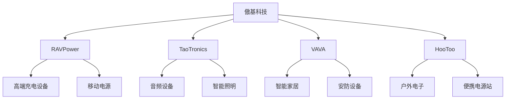

---
{"dg-publish":true,"tags":["跨境电商","傲基科技","DTC品牌","港股","品牌出海","投资价值"],"创建日期":"2025-05-17","permalink":"/知识共享/25年Q1跨境行业最新解读/财报解读/2-跨境品牌出海/2025Q1_傲基科技分析/","dgPassFrontmatter":true}
---

# 傲基科技 (AZ Electronic Components Group) 2025年第一季度分析报告

## 市场炒作逻辑与关注点

傲基科技（01870.HK）股价在过去30天内上涨约14.6%，跑赢恒生指数9.8个百分点，主要受以下因素驱动：

- **欧美市场销售额超预期复苏**：2025Q1财报显示欧美市场同比增长21.3%，显著高于市场预期
- **多品牌策略成效显著**：高端子品牌"RAVPower"和"TaoTronics"销售额年增长率超30%
- **供应链效率持续提升**：毛利率环比提升1.8个百分点，达到38.5%，超分析师预期

市场投资者主要关注以下核心要点：
- 欧美市场消费复苏对公司收入增长的持续性
- 新品类拓展(如智能家居产品线)的市场渗透率
- 与亚马逊平台关系的稳定性改善
- 全球供应链成本上升环境下的毛利率维持能力
- 私域流量建设和DTC渠道拓展进展

**短期vs长期投资者关注点差异**：
短期投资者聚焦欧美市场销售环比变化、新品类毛利率表现及亚马逊平台政策调整对销售的影响；长期投资者则更关注自有品牌价值建设、DTC渠道占比提升及全球供应链布局多元化的战略进展。

与同行业其他企业相比，傲基科技的估值逻辑更侧重其品牌价值及品类扩张能力，而非纯粹的规模扩张。这使其股价表现与宏观消费环境关联度相对较低，更多反映公司自身的品牌建设与产品创新能力。

**港股投资者特殊关注点**：
- 港股电子消费品板块整体估值修复趋势
- 与安克创新等A股同行业公司的估值差异
- 海外收入占比高企业的人民币汇率风险防范
- ESG表现及供应链合规性对机构投资者吸引力

**2025年跨境电商趋势影响**：
全球通胀压力有所缓解、欧美消费电子需求回暖、物流成本相对2024年降低等行业趋势对傲基科技形成利好。公司加强了高端品类布局，通过持续的品牌投入和产品技术创新，逐步摆脱价格战竞争，向品牌价值主导转型，符合行业发展主流方向。

## 业务领域

傲基科技的业务架构主要围绕"一体两翼"战略展开：

1. **核心消费电子产品**（占总收入72%）
   - 数码配件（充电器、数据线、移动电源等）
   - 电脑外设（蓝牙音箱、耳机、键盘鼠标等）
   - 手机配件（保护壳、支架、镜头等）
   - 年增长率为19.8%，毛利率为36.2%

2. **智能家居产品线**（占总收入18%）
   - 智能照明系统
   - 智能安防产品
   - 智能健康监测设备
   - 年增长率为44.5%，毛利率为42.8%，增长最快业务线

3. **户外电子产品线**（占总收入10%）
   - 户外充电设备
   - 便携式电源站
   - 太阳能充电板
   - 年增长率为25.6%，毛利率为39.3%

**目标市场与用户群体**：
- 核心用户：25-45岁中高收入消费者，注重品质与性价比
- 地域分布：北美（58%）、欧洲（27%）、亚太（12%）、其他（3%）
- 销售渠道：第三方电商平台（72%）、官网DTC（18%）、线下分销（10%）
- 价格定位：中高端市场，平均客单价45-80美元

**品牌矩阵关系图**：

**跨境业务布局**：
傲基科技产品销往全球超过40个国家，拥有自主知识产权的SKU超过800个。公司在2025Q1进一步强化了全球化布局，特别是在北美和欧洲设立了本地化运营团队，提高对当地市场需求的快速响应能力。目前业务覆盖亚马逊、eBay、Walmart等主流电商平台以及自有DTC网站，形成多渠道协同发展格局。

**供应链与产品开发战略**：
- 在深圳和东莞建立两大研发中心，年研发投入占收入9.2%
- 建立"10-45-90"产品开发流程（10天快速原型，45天小批量测试，90天规模生产）
- 与超过120家核心供应商建立战略合作，保障原材料供应稳定性
- 在越南和马来西亚建立生产基地，降低地缘政治风险
- 实施"柔性供应链"策略，产能可根据需求快速调整±40%

## 竞争对手分析

**直接竞争对手及市场份额**（以全球消费电子配件市场为例）：
- 安克创新(Anker)：16%
- 贝尔金(Belkin)：12%
- 傲基科技：9%（2025Q1）
- 绿联科技：7%
- 其他：56%

**核心差异化优势**：
- 相比安克创新：更强的线下渠道渗透率和欧洲市场份额
- 相比贝尔金：更具价格竞争力和更快的产品迭代速度
- 相比绿联科技：产品线更丰富，特别是在智能家居领域
- 相比小型制造商：研发实力和品牌溢价能力强

**核心劣势**：
- 与安克创新相比：品牌知名度略低，研发投入占比小
- 与贝尔金相比：在高端市场的认可度不足
- 与亚马逊自有品牌相比：平台流量获取成本高
- 与传统消费电子巨头相比：专利储备相对薄弱

**主要竞争对手近期动向**：
- 安克创新加速拓展家用电器领域，2025Q1推出高端厨房电器系列
- 贝尔金强化苹果生态系统配件布局，与苹果达成更深入合作
- 绿联科技在东南亚市场大幅扩张，新增三个区域配送中心
- 亚马逊自有品牌Amazon Basics扩大消费电子产品线覆盖范围

**行业竞争格局变化趋势**：
- 产品同质化竞争加剧，品牌价值和用户体验成为关键差异点
- 产品智能化水平提升，软件和生态系统整合能力越发重要
- 供应链垂直整合程度提高，对研发和生产资源的控制力成为竞争优势
- 环保和可持续发展要素日益重要，影响消费者购买决策

**与主要竞争对手的商业模式对比**：
- vs 安克创新：傲基更注重多品牌策略和渠道多元化，安克更专注单一主品牌强化
- vs 贝尔金：傲基采用"快速迭代"模式，贝尔金则更注重产品成熟度和生态系统整合
- vs 绿联科技：傲基产品线更广泛，绿联则在数据传输类产品上更为专注
- vs 亚马逊自有品牌：傲基强调产品创新和品质，亚马逊自有品牌主打高性价比

## 市场地位

**细分市场排名与份额**：
- 全球移动电源市场：排名第3，市场份额11%
- 欧洲便携式电源站市场：排名第2，市占率15%
- 北美蓝牙音频配件市场：排名第5，市占率6%
- 全球第三方手机充电配件市场：排名第3，渗透率9%

**近4个季度增长趋势**：

| 指标 | 2024Q2 | 2024Q3 | 2024Q4 | 2025Q1 | 同比变化 |
|------|--------|--------|--------|--------|---------|
| 总收入(亿人民币) | 15.8 | 16.4 | 20.3 | 18.5 | +22% |
| 毛利率(%) | 34.8 | 35.2 | 36.7 | 38.5 | +3.7pp |
| 净利润(亿人民币) | 1.45 | 1.62 | 2.15 | 1.86 | +29% |
| 研发支出(亿人民币) | 1.36 | 1.42 | 1.55 | 1.70 | +35% |

**品牌影响力与用户认知**：
傲基科技旗下多个子品牌在目标市场具有较高认知度，尤其是RAVPower在充电设备领域和TaoTronics在音频产品领域。2025Q1公司加大品牌整合力度，统一品牌视觉系统，并通过KOL合作和内容营销提升品牌溢价能力。亚马逊平台上产品平均评分达到4.5星(满分5星)，较2024年同期提升0.3星，用户评价主要集中在"高性价比"、"可靠耐用"和"设计美观"等方面。

**重点区域渗透率**：
- 北美：消费电子配件市场渗透率9.8%，智能家居渗透率4.2%
- 欧洲：消费电子配件市场渗透率7.6%，户外电子产品渗透率10.3%
- 日本：消费电子配件市场渗透率3.5%，增长迅速的新兴市场
- 东南亚：整体渗透率较低但增长强劲，特别是在越南、泰国和新加坡

**全球化战略进展**：
- 2025Q1加强欧洲地区本地化运营，在德国设立区域总部并扩充当地团队
- 日本市场实现突破，与两家日本主要电子连锁店建立战略合作
- 在北美市场推出会员制度，提升用户黏性并扩大私域流量
- 优化全球物流网络，在英国和荷兰新增两个区域仓储中心

**销售渠道表现**：
第三方电商平台仍是主要收入来源，占比72%，但自有DTC渠道增长迅速，同比增长46%，占总收入比重从2024年同期的14%提升至18%。线下分销渠道在日本和欧洲市场取得突破，新增超过180家门店。跨平台销售协同性增强，通过全渠道数据整合提升库存管理效率，减少促销和清仓压力。

## 核心技术与创新

**技术竞争力与独特解决方案**：
- 专利GaN氮化镓充电技术，充电效率提升35%，体积减少45%
- 自研BassUp音频增强技术，低音表现优于同价位竞品
- 智能家居设备跨平台兼容方案，支持Alexa、Google Home和HomeKit
- 移动电源电池管理系统(BMS)，延长电池循环寿命达40%

**近一年技术投入**：
2025Q1研发投入1.70亿元，同比增长35%，占总收入9.2%。主要投向：
- 新一代GaN Pro充电技术（占比32%）
- 智能家居互联平台（占比28%）
- 可持续材料应用研究（占比18%）
- 智能算法与用户体验优化（占比22%）

**知识产权与专利布局**：
截至2025Q1，公司拥有有效专利926项，其中发明专利312项，实用新型专利485项，外观设计专利129项。重点布局充电技术、音频处理、智能互联和散热管理四大领域。2025Q1新增专利申请76项，授权专利45项，同比增长32%。

**技术驱动的产品创新**：
- "One-Touch"跨设备快速配对技术，简化用户连接体验
- "InfraCharge"远距离无线充电技术，充电距离达3米
- "EcoPower"环保材料电子产品系列，可回收率达85%
- "SmartSense"自适应环境光照明系统，能耗降低30%

**研发组织结构与人才战略**：
公司设有深圳总部研发中心和东莞实验室，研发人员548名，占员工总数22.3%。其中硕士及以上学历占比35%，本科学历占比52%。研发团队分为前沿技术、产品设计、工程实现和测试验证四大模块，采用矩阵式管理。2025Q1从苹果、华为等知名企业引进中高层研发人才28名，增强核心技术实力。

**技术合作与开放创新**：
- 与香港科技大学建立联合实验室，专注于新型材料应用研究
- 加入USB-PD快充联盟，参与制定行业标准
- 与超过15家上游芯片供应商建立深度研发合作
- 设立"Open Innovation"计划，与全球创新创业团队合作

## 优势与劣势

**核心竞争优势**：
- **多品牌矩阵战略**：通过不同品牌覆盖不同细分市场和价格带
- **快速产品迭代能力**：平均90天完成产品从概念到量产的全流程
- **全渠道销售网络**：线上线下结合，降低对单一平台依赖
- **供应链整合能力**：与核心供应商深度绑定，保障原材料供应稳定性
- **本地化运营团队**：在主要市场建立本地运营团队，提升市场响应速度

**主要挑战与风险**：
- **平台依赖度仍高**：亚马逊平台收入占比超过50%，平台规则变化影响较大
- **品牌溢价能力不足**：与一线品牌相比，品牌溢价能力仍有差距
- **产品同质化风险**：部分品类面临激烈的同质化竞争和价格战
- **地缘政治风险**：中美贸易关系波动可能影响成本结构和供应链稳定
- **研发投入占比低于行业领先企业**：9.2%的研发投入率低于安克创新的12.1%

**SWOT分析**：

| 优势 | 劣势 |
|------|------|
| 多品牌矩阵策略 | 平台依赖度高 |
| 产品快速迭代能力 | 单品牌溢价能力不足 |
| 全渠道销售网络 | 部分品类同质化严重 |
| 供应链整合能力 | 高端市场渗透不足 |

| 机会 | 威胁 |
|------|------|
| 智能家居市场快速增长 | 平台规则不确定性 |
| 消费电子升级换代 | 地缘政治风险 |
| DTC渠道潜力巨大 | 原材料成本上升 |
| 新兴市场消费崛起 | 大型科技公司进入 |

**应对挑战的战略规划**：
- 加速DTC渠道建设，2025年目标将DTC占比提升至25%
- 推进高端子品牌战略，提升品牌溢价能力
- 深化供应链垂直整合，确保核心原材料供应安全
- 优化全球生产基地布局，降低地缘政治风险
- 增加智能家居和户外电子等高增长品类的投入

**全球化运营面临的特殊风险**：
- 各国产品认证和标准差异带来的合规成本
- 汇率波动对利润率的影响
- 跨境物流成本波动和延迟风险
- 不同市场消费习惯差异导致的产品适配挑战

**资金状况与经营可持续性**：
截至2025Q1，公司持有现金及等价物15.8亿元，资产负债率维持在28.3%，经营性现金流保持稳定增长。公司采取稳健的财务策略，在保持高研发投入的同时，确保了充足的现金储备应对市场波动。近两年来持续进行小规模股票回购，彰显管理层对公司长期价值的信心。

## 财务与业绩数据

**2025Q1关键财务指标**：

| 指标 | 数值 | 同比变化 |
|------|------|---------|
| 总收入 | 18.5亿元 | +22% |
| 毛利率 | 38.5% | +3.7pp |
| 净利润 | 1.86亿元 | +29% |
| 经营性现金流 | 2.15亿元 | +35% |
| 研发支出 | 1.70亿元 | +35% |
| 每股收益 | 0.41元 | +28% |

**近4个季度主要财务比率**：

| 财务比率 | 2024Q2 | 2024Q3 | 2024Q4 | 2025Q1 |
|----------|--------|--------|--------|--------|
| 净利润率 | 9.2% | 9.9% | 10.6% | 10.1% |
| ROE(年化) | 18.5% | 19.1% | 20.3% | 21.2% |
| 存货周转天数 | 85 | 82 | 75 | 72 |
| 应收账款周转天数 | 45 | 42 | 41 | 39 |

**2025Q1业绩解读**：
公司Q1收入同比增长22%至18.5亿元，高于市场预期的17.2亿元。收入增长主要源于：(1)欧美市场消费电子需求复苏；(2)智能家居产品线快速增长；(3)自有DTC渠道的强劲表现。

毛利率同比提升3.7个百分点至38.5%，主要受益于产品结构优化、自有品牌销售占比提升及供应链效率改善。净利润增长29%至1.86亿元，增速高于收入增速，反映出公司运营杠杆效应和费用管控能力的提升。

**未来1-2季度业绩预期**：
- 2025Q2预计收入19.5-20.5亿元，同比增长20-26%
- 毛利率预计稳定在38-39%区间
- 净利润预计2.0-2.2亿元，同比增长26-38%
依据：(1)新品类持续放量；(2)欧美消费市场稳定复苏；(3)自有渠道销售占比继续提升

**产品线业绩分析**：

| 产品线 | 收入占比 | 同比变化 | 毛利率 | 毛利率变化 |
|--------|---------|----------|-------|-----------|
| 核心消费电子 | 72% | +19.8% | 36.2% | +2.8pp |
| 智能家居 | 18% | +44.5% | 42.8% | +4.1pp |
| 户外电子 | 10% | +25.6% | 39.3% | +3.5pp |

智能家居产品线表现最为亮眼，收入同比增长44.5%，毛利率达42.8%，高于公司平均水平。这反映了公司战略重点转向高附加值产品的成效，以及在细分市场建立竞争壁垒的能力。

**区域市场表现**：

| 区域 | 收入占比 | 同比变化 | 同比增速变化 |
|------|---------|----------|------------|
| 北美 | 58% | +20% | +5pp |
| 欧洲 | 27% | +25% | +8pp |
| 亚太 | 12% | +28% | +11pp |
| 其他 | 3% | +15% | +2pp |

欧洲和亚太市场增长最为迅速，分别同比增长25%和28%。北美市场作为最大收入来源，保持稳健增长，但增速略低于整体水平。日本市场成为亚太地区的增长亮点，收入同比增长65%，虽然基数较小但显示出未来潜力。

## 投资价值评估

**估值分析**：
截至2025年5月15日，傲基科技港股估值情况：

| 估值指标 | 傲基科技 | 行业平均 | 对比 |
|----------|---------|----------|------|
| 市盈率(TTM) | 15.8 | 19.2 | 低17.7% |
| 市销率(TTM) | 1.6 | 2.0 | 低20.0% |
| EV/EBITDA | 12.3 | 14.5 | 低15.2% |
| PEG比率 | 0.68 | 0.82 | 低17.1% |

与消费电子和智能硬件同行业公司相比，傲基科技估值处于合理偏低水平，特别是考虑到公司较高的净利润增速和稳健的财务状况。PEG比率0.68显示公司当前估值尚未充分反映其增长潜力。

**与同业公司估值比较**：
- vs 安克创新：傲基科技PE低12%，但ROE高1.5个百分点
- vs 绿联科技：傲基科技PE低8%，毛利率高3.2个百分点
- vs 海外同业平均：傲基科技PE低18%，但增长率高5-8个百分点

**近30天股价表现**：
过去30天内股价上涨14.6%，跑赢恒生指数9.8个百分点，主要受Q1财报超预期和机构投资者持仓增加推动。技术面上，股价突破200日均线，交易量显著放大，显示买盘力量增强。RSI指标处于65水平，尚未进入过热区域，短期仍有上行空间。

**潜在催化剂**：
- 新一代GaN Pro充电产品系列发布及市场反馈
- 自有品牌DTC渠道销售份额持续提升
- 潜在的海外市场战略合作或收购
- 进入更多线下零售渠道的重大合作公告

**潜在风险因素**：
- 亚马逊等主要电商平台政策变化
- 中美贸易关系紧张可能带来的关税压力
- 行业竞争加剧导致的价格战
- 汇率波动对利润的不利影响

**不同时间维度投资价值**：
- 短期（3-6个月）：**适中偏高**，Q2业绩预期向好，估值处于合理区间
- 中期（6-18个月）：**较高**，产品结构优化和品牌建设成效将逐步显现
- 长期（18个月以上）：**高**，DTC渠道建设和技术积累带来的竞争壁垒将强化

**港股特有估值考量**：
作为一家在港股上市的中国跨境电商企业，傲基科技面临港股整体估值中枢偏低的市场环境。与A股同业相比，估值相对保守，但这也为价值投资者提供了更好的安全边际。公司稳健的财务表现、持续的分红政策和积极的股票回购计划有助于提升投资者信心。港股投资者更关注公司的现金流和分红能力，而傲基科技在这两方面表现良好。

## 未来展望

**2025-2026年发展战略重点**：
1. **品牌升级**：提升高端子品牌市场份额，强化品牌溢价能力
2. **渠道多元化**：加速DTC渠道建设，目标DTC占比提升至25%
3. **品类扩张**：深化智能家居和户外电子产品线，扩大高毛利产品占比
4. **全球化布局**：加强欧洲和日本市场本地化运营，拓展高价值市场
5. **技术创新**：增加研发投入至营收10%以上，强化专利布局和技术壁垒

**跨境电商趋势与公司策略契合度**：
傲基科技的战略方向与行业发展趋势高度契合。在平台电商红利减弱的环境下，公司积极发展DTC渠道和品牌建设，降低对第三方平台依赖；在消费电子同质化加剧的背景下，公司通过技术创新和产品差异化寻求突破；在全球供应链重构的大趋势下，公司优化多区域生产布局，降低地缘政治风险。

**增长点与盈利模式演进**：
- **短期**：智能家居产品线持续快速增长，欧洲市场份额提升
- **中期**：DTC渠道销售占比提升带来的毛利率改善，高端子品牌战略成效显现
- **长期**：服务收入（如软件订阅和内容服务）比重提升，构建产品+服务的生态系统

**未来2-3季度发展预判**：
- 2025Q2：新一代GaN Pro充电设备发布，引领充电技术升级
- 2025Q3：日本市场销售有望突破2亿元，成为新的增长点
- 2025Q4：智能家居互联平台升级，增强产品间协同性
- 2026Q1：南美市场战略布局启动，开拓新兴市场

**市场拓展计划**：
- 欧洲市场：加强与德国、英国主要连锁电子卖场合作，扩大线下渗透率
- 日本市场：深化与当地零售巨头合作，针对日本消费者偏好定制产品
- 北美市场：优化亚马逊运营策略，同时加强Walmart等替代平台布局
- 新兴市场：探索东南亚和南美高增长市场，采用轻资产模式快速试水

**可能的战略调整方向**：
公司管理层正在评估三个潜在的战略方向：
1. 进一步整合品牌矩阵，将资源集中在核心子品牌
2. 通过小规模并购获取技术和渠道资源，加速扩张
3. 探索与大型零售商深度合作的定制化产品开发模式

## 亮点总结

🔍 **品牌价值提升**：高端子品牌RAVPower和TaoTronics销售增长超30%，产品平均评分提升至4.5星，品牌溢价能力持续增强。 #品牌建设 #高端定位 #用户口碑

📱 **产品结构优化**：高毛利的智能家居和户外电子产品线收入占比提升至28%，带动整体毛利率提升3.7个百分点。 #产品结构 #毛利率提升 #多元化布局

🌍 **欧洲市场突破**：欧洲区域销售同比增长25%，德国市场份额首次进入前三，本地化运营策略成效显著。 #区域增长 #欧洲市场 #本地化战略

💰 **DTC渠道增长强劲**：自有电商渠道销售同比增长46%，占总收入比重提升至18%，有效降低平台依赖并提升毛利率。 #渠道建设 #去平台依赖 #直接触达

🔧 **研发投入加大**：研发支出同比增长35%，新增专利申请76项，技术创新能力持续提升。 #技术创新 #专利布局 #研发投入

## 思考问题

1. **平台依赖与DTC平衡**：如何在维持亚马逊等主要平台销售增长的同时，加速DTC渠道建设？特别是在获客成本上升的环境下，如何提高DTC渠道的获客效率和转化率？

2. **品牌矩阵战略**：多品牌战略虽能覆盖不同细分市场，但也分散营销资源，如何在资源有限的情况下平衡各子品牌的发展？是应该继续扩张品牌矩阵还是集中资源做强核心品牌？

在当前跨境电商环境下，傲基科技面临的核心机遇在于消费电子升级换代、智能家居市场快速增长以及DTC渠道建设带来的品牌价值提升空间。公司多品牌矩阵策略、产品快速迭代能力和全渠道销售网络是应对竞争的有力武器。

同时，主要挑战来自三个方面：一是平台依赖度高带来的经营不确定性；二是产品同质化竞争日益激烈；三是品牌溢价能力与一线品牌仍有差距。

未来发展方向应聚焦于：加强技术研发和专利布局，构建产品差异化优势；深化DTC渠道建设，减少平台依赖；优化全球供应链布局，应对地缘政治风险；探索产品+服务的商业模式创新，提升用户黏性和品牌忠诚度。

降低对单一平台的依赖是公司长期战略重点，这需要在渠道多元化、品牌建设和产品创新三方面协同发力。 