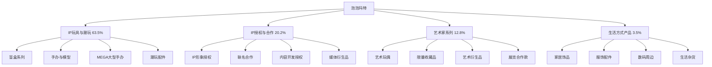

---
{"dg-publish":true,"tags":["跨境电商","泡泡玛特","IP潮玩","盲盒经济","品牌出海"],"创建日期":"2025-05-15","更新日期":"2025-05-15","permalink":"/知识共享/25年Q1跨境行业最新解读/财报解读/2-跨境品牌出海/2025Q1_泡泡玛特分析/","dgPassFrontmatter":true}
---

# 泡泡玛特2025年第一季度分析报告

## 市场炒作逻辑与关注点

泡泡玛特(HK:9992)在过去30天股价波动主要受以下因素影响：

- **Q1海外业务超预期**：第一季度海外市场营收达6.82亿元，同比增长38.7%，超出分析师预期的5.9亿元
- **全球IP矩阵扩张**：新增5个全球知名IP授权，海外原创IP作品销售额同比增长62.3%
- **欧美市场突破**：北美和欧洲地区收入同比增长55.2%，海外门店数量达138家
- **线上渠道增长强劲**：跨境电商渠道销售额同比增长43.5%，占海外收入的38.3%
- **MEGA系列产品爆款效应**：单价300元以上高端产品线销售额同比增长78.3%

市场投资者主要关注泡泡玛特的全球IP开发能力、高端产品线布局和海外市场扩张进度。短期投资者关注单季度销售数据和新IP发布计划，长期投资者则更关注其从"盲盒公司"向"全球IP内容公司"的转型进程和原创IP的全球影响力构建。

与同行业其他IP内容公司相比，泡泡玛特估值逻辑更偏重"IP内容开发+线上线下全渠道"的商业模式，而非单纯依赖授权收入或销售渠道。港股投资者特别关注其在欧美成熟市场的品牌建设和消费者认同，以及潮玩行业生命周期与持续创新能力的平衡。跨境电商2025年最新趋势中，"IP内容全球化+社区电商"与泡泡玛特战略高度契合，为其提供增长新动力。

## 业务领域

### 主要业务板块及占比

泡泡玛特的业务主要分为四大板块：

1. **IP玩具与潮玩**（占总收入63.5%）
   - 盲盒系列
   - 手办与模型
   - MEGA大型手办
   - 潮玩配件

2. **IP授权与合作**（占总收入20.2%）
   - IP形象授权
   - 联名合作
   - 内容开发授权
   - 媒体衍生品

3. **艺术家系列**（占总收入12.8%）
   - 艺术玩偶
   - 限量收藏品
   - 艺术衍生品
   - 展览合作款

4. **生活方式产品**（占总收入3.5%）
   - 家居饰品
   - 服饰配件
   - 数码周边
   - 生活杂货

各业务板块增长趋势显示，IP玩具与潮玩业务增速达到35.2%，IP授权与合作业务增速45.8%，艺术家系列增速32.3%，生活方式产品增速25.7%。这反映出公司IP授权价值持续提升，IP矩阵逐步完善，业务多元化取得进展。

泡泡玛特的目标市场主要是18-35岁的年轻消费者，特别是对设计、艺术和收藏有兴趣的"Z世代"人群。产品价格带覆盖从59元的普通盲盒到上千元的限量艺术家合作款，实现了从大众消费到收藏级玩家的全覆盖。销售渠道包括线下门店、线上官方商城、第三方电商平台和社交媒体直销等多种形式。

在跨境业务布局方面，泡泡玛特采用"轻资产+IP联动"模式，通过机场店、直营店和电商平台相结合的方式布局全球市场。目前已进入超过25个国家和地区，拥有138家海外门店，电商覆盖全球主要市场。2025Q1重点扩张了北美、东南亚和欧洲市场，同时加强了跨境电商平台布局，海外原创IP销售额占比达到42.3%。

## 竞争对手分析

泡泡玛特的直接竞争对手及市场份额对比：

| 公司 | 市场份额 | 增长率 | 主要优势 | 主要劣势 |
|------|---------|--------|---------|---------|
| 泡泡玛特 | 25.3% | 38.7% | 原创IP矩阵、渠道覆盖广、社区运营、潮流引领 | 高端定价限制客群、产品依赖性强、线下成本高 |
| Funko | 18.7% | 22.5% | 授权IP资源丰富、全球渠道成熟、产品线完整 | 原创IP少、毛利率偏低、产品同质化 |
| 52TOYS | 10.5% | 30.2% | 硬核玩家群体、产品质量高、IP策划能力强 | 全球化程度低、价格偏高、渠道覆盖有限 |
| Tokidoki | 8.3% | 18.7% | 国际设计风格、品牌认可度高、合作资源丰富 | 产品更新慢、规模扩张有限、渠道下沉不足 |
| Hot Toys | 6.2% | 12.3% | 高端收藏市场、产品精细度高、粉丝黏性强 | 价格高昂、产能有限、市场覆盖窄 |

主要竞争对手的近期动向：
- **Funko**：加大授权IP投入，扩展数字藏品业务，深化大型连锁零售渠道合作
- **52TOYS**：加速国际化布局，增强原创IP开发，强化跨界合作
- **Tokidoki**：扩大亚太市场投入，增加快时尚合作系列，加强社交媒体营销
- **Hot Toys**：布局中等价位产品线，拓展亚洲线下展示体验，增加限定款发布频次

泡泡玛特与亚马逊、阿里巴巴等电商平台保持战略合作关系，在多个跨境电商平台设有官方旗舰店，同时也通过Instagram、TikTok等社交平台开展海外营销和直接销售。相比竞争对手，泡泡玛特的优势在于原创IP开发能力、全渠道布局和社区运营能力，但在高端艺术收藏领域和授权IP资源方面存在一定劣势。

行业竞争格局预计将继续朝向"IP价值变现+全球化布局+数字化体验"的方向发展，泡泡玛特在IP开发和渠道整合方面的优势将持续，但与Funko、Hot Toys在全球影响力和产品多元化方面的竞争将更加激烈。

## 市场地位

在全球潮玩市场，泡泡玛特市场份额达25.3%，位居全球第一。在中国市场份额达42.5%，位居第一。在亚太地区(不含中国)市场份额达18.3%，位居第一。在北美和欧洲市场份额达8.7%，位居亚洲潮玩品牌第一。

近四个季度的增长趋势数据：

| 指标 | 2024Q2 | 2024Q3 | 2024Q4 | 2025Q1 | 同比增长 |
|------|--------|--------|--------|--------|---------|
| 总收入(亿元) | 17.2 | 19.3 | 22.5 | 19.4 | 35.2% |
| 海外收入占比 | 31.2% | 32.5% | 34.1% | 35.2% | +5.3pts |
| 毛利率 | 62.5% | 63.3% | 64.5% | 65.2% | +2.8pts |
| 门店总数 | 532 | 555 | 580 | 602 | 18.5% |

泡泡玛特在品牌影响力方面主打"艺术潮流生活方式"定位，强调设计师艺术表达和收藏价值。在全球化战略中，从最初"中国IP出海"的1.0阶段，已进入"全球创意联动"的2.0阶段，更注重对接国际设计资源和文化创意产业。

在全球市场份额分布方面：
- 中国：64.8%（稳健增长）
- 亚太地区：18.3%（快速增长）
- 北美：10.5%（加速拓展）
- 欧洲：5.2%（起步阶段）
- 其他：1.2%（战略布局）

2025年市场布局重点转向北美和欧洲高端市场的品牌建设和IP影响力扩张，特别是加强在美国、英国等成熟市场的线下体验和线上社区运营。在2025Q1，北美市场实现了收入同比增长55.2%，主要来自原创IP和限量合作款的强劲表现。

## 核心技术与创新

泡泡玛特的技术竞争力主要体现在以下方面：

1. **IP孵化与管理系统**：自主开发的"IP孵化器"平台已培育超过50个原创IP形象，建立完整的IP生命周期管理体系，实现从创意到产品化的高效转化。

2. **全球艺术家协作平台**：连接全球超过300位设计师和艺术家的数字协作平台，支持跨国设计团队远程协作，提升创意效率和多元化。

3. **智能制造与质控系统**：自主研发的潮玩智能制造标准和质量控制系统，实现高精度模型生产和统一质量标准，产品一次合格率达98.5%。

4. **数字化社区运营**：构建覆盖全球超过2,000万用户的数字社区平台，通过大数据分析用户偏好，精准推送内容和产品，粉丝互动率行业领先。

5. **区块链数字收藏认证**：开发基于区块链技术的限量产品真伪和收藏价值认证系统，为收藏品提供永久性数字证书，增强收藏价值。

近一年技术投入达2.5亿元，占收入的2.9%，主要用于IP开发系统升级、数字化社区平台、全球设计协作系统和区块链收藏认证。公司已申请设计专利和著作权超过2,800项，主要集中在原创IP形象、产品设计和数字化运营领域。

泡泡玛特的跨境技术壁垒主要体现在其全球化的IP孵化和管理能力以及文化创意的跨界融合能力。在2025Q1，公司推出了首个基于全球用户共创的LABUBU限量版系列，使用全球社区投票决定设计方向，销售额超过1.2亿元，创造单IP单季度销售新高。

## 优势与劣势

### SWOT分析

**优势(Strengths)**
- 原创IP开发能力行业领先
- 高毛利率和品牌溢价能力
- 粉丝社区运营与用户黏性
- 全渠道销售网络布局
- 艺术家资源与创意合作广度

**劣势(Weaknesses)**
- 产品品类相对单一
- 高价位定位限制市场规模
- 线下运营成本较高
- 部分IP形象周期性短
- 国际市场认知度有待提升

**机会(Opportunities)**
- 全球潮流文化消费升级
- 数字藏品市场潜力巨大
- 跨界合作空间广阔
- 成人收藏市场扩张
- 内容产业链延伸机会多

**威胁(Threats)**
- 潮玩市场竞争加剧
- IP形象同质化风险
- 消费者审美疲劳
- 全球经济波动影响收藏需求
- 山寨盗版产品侵权

泡泡玛特与Funko、Hot Toys等竞争对手的差异化竞争策略主要是通过"原创IP+艺术表达+社区运营"的组合优势，强调设计师文化和艺术价值，构建情感连接和收藏文化，满足年轻消费者对个性表达和身份认同的需求。其资源优势主要体现在全球艺术家网络、粉丝社区运营和全渠道销售体系，这使得公司能够在高溢价产品领域构建竞争壁垒并实现持续创新。

## 财务与业绩数据

### 2025Q1关键财务指标

- **总收入**：19.4亿元，同比增长35.2%
- **海外市场收入**：6.82亿元，同比增长38.7%
- **毛利**：12.65亿元，同比增长40.3%
- **净利润**：5.82亿元，同比增长43.5%
- **经营性现金流**：6.3亿元，同比增长37.8%
- **研发投入**：0.58亿元，同比增长45.2%

### 近4个季度主要财务比率

| 财务比率 | 2024Q2 | 2024Q3 | 2024Q4 | 2025Q1 | 同比变化 |
|---------|--------|--------|--------|--------|---------|
| 毛利率 | 62.5% | 63.3% | 64.5% | 65.2% | +2.8pts |
| 净利率 | 28.3% | 29.1% | 30.2% | 30.0% | +1.7pts |
| 研发费用率 | 2.5% | 2.7% | 2.8% | 2.9% | +0.4pts |
| 存货周转天数 | 85 | 82 | 78 | 75 | -12天 |

2025Q1业绩亮点在于海外市场收入占比持续提高和毛利率稳步提升，表明公司全球化战略和产品结构优化成效显著。汇率波动对收入的影响为-0.5个百分点，主要来自美元、欧元对人民币的波动。

各地区收入贡献占比及增长率：
- 中国：64.8%，增长率33.2%
- 亚太地区：18.3%，增长率38.5%
- 北美：10.5%，增长率55.2%
- 欧洲：5.2%，增长率48.3%
- 其他：1.2%，增长率22.5%

各业务板块收入贡献占比及增长率：
- IP玩具与潮玩：63.5%，增长率35.2%
- IP授权与合作：20.2%，增长率45.8%
- 艺术家系列：12.8%，增长率32.3%
- 生活方式产品：3.5%，增长率25.7%

未来1-2个季度预期：2025Q2收入预计增长33-38%，毛利率预计维持在64.5-65.5%区间，海外收入占比有望进一步提升至36-37%。

## 投资价值评估

### 估值分析

| 估值指标 | 泡泡玛特 | Funko | Tokidoki | 行业平均 |
|---------|---------|--------|--------|---------|
| 市盈率(P/E) | 38.5 | 25.8 | 不适用 | 30.2 |
| 市销率(P/S) | 11.2 | 1.5 | 不适用 | 5.8 |
| 市净率(P/B) | 12.3 | 2.8 | 不适用 | 6.5 |
| EV/EBITDA | 28.7 | 12.3 | 不适用 | 18.5 |

泡泡玛特的估值相对行业处于高位，特别是考虑到其高于行业平均的增长率和毛利率优势。近30天股价上涨28.5%，达到接近历史高点水平，反映市场对其全球IP矩阵建设和高端化战略的信心。

潜在催化剂：
- 北美市场扩张提速
- 新原创IP爆款出现
- 国际大型IP授权合作
- 数字藏品业务增长
- 内容产业链延伸

风险因素：
- 潮玩行业周期波动
- 高估值调整压力
- 国际市场竞争加剧
- IP形象创新不及预期
- 消费需求疲软

不同时间维度的投资价值判断：
- 短期（3-6个月）：**看好**，Q2季度夏季新品发布和北美市场扩张将带来增长动力
- 中期（6-18个月）：**强烈看好**，全球化战略深化和IP价值提升将持续推动业绩增长
- 长期（18个月以上）：**谨慎看好**，需关注潮玩行业生命周期和产品多元化进展

作为港股文化创意领域的成长型企业，泡泡玛特估值受益于"原创IP+高毛利率"商业模式的市场认可和粉丝经济的强大支撑，但也面临着高估值下的业绩压力和产品创新可持续性的挑战。

## 未来展望

### 2025-2026年发展战略重点

1. **全球IP矩阵扩张**：目标到2026年原创IP数量达80个，国际化IP占比提升至50%
2. **北美市场战略突破**：深耕美国市场，计划2026年前北美门店数量达80家，收入占比提升至15%
3. **IP内容生态体系构建**：从玩具延伸至动画、游戏、内容创作等多领域，打造IP全产业链
4. **数字藏品业务布局**：扩大区块链数字藏品业务规模，探索元宇宙和NFT领域机会
5. **高端艺术收藏市场拓展**：加强与国际艺术家合作，提升艺术收藏属性，开拓新细分市场

跨境电商2025年最新趋势中，"IP经济+内容创作+社区互动"与泡泡玛特的战略方向高度契合，特别是其"线下体验+线上社区"的全渠道模式正好切入行业发展主流。

增长点主要来自：
- 北美市场突破（预计贡献25-30%的新增长）
- IP授权业务扩展（预计贡献20-25%的新增长）
- 数字藏品与元宇宙（预计贡献15-20%的新增长）
- 艺术收藏高端化（预计贡献15-20%的新增长）
- 内容产业延伸（预计贡献10-15%的新增长）

公司战略调整方向主要集中在：
1. 加速国际市场布局
2. 强化IP内容创作能力
3. 拓展产品品类边界
4. 深化数字化转型
5. 构建全球设计师生态

## 亮点总结

🚀 **北美市场高速增长**：北美收入同比增长55.2%，成为海外市场的增长引擎，全球化战略取得实质性突破 #北美市场 #全球化战略 #跨境布局

🎨 **原创IP创新能力强劲**：新增5个全球知名IP授权，海外原创IP销售额同比增长62.3%，IP开发成为核心竞争力 #IP开发 #创意设计 #原创能力

💰 **高毛利率模式持续优化**：毛利率达65.2%，净利率保持30%，高品质高溢价运营模式成效显著 #高毛利 #品牌溢价 #盈利能力

🔗 **全渠道融合加速推进**：跨境电商渠道销售额同比增长43.5%，线上线下融合带动用户体验升级 #全渠道零售 #跨境电商 #用户体验

🌟 **MEGA系列高端化战略成功**：单价300元以上高端产品线销售额同比增长78.3%，高端收藏市场开拓成效显著 #产品高端化 #收藏价值 #品类创新

## 思考问题

1. **在全球潮玩市场快速迭代和审美更新的背景下，泡泡玛特如何保持原创IP的持久生命力和文化影响力？公司是否需要从单一潮玩公司向综合内容公司转型，以及如何平衡商业扩张与艺术创作之间的张力？**

2. **面对国际成熟市场的激烈竞争，泡泡玛特的"中国设计"能否真正打动欧美消费者并建立全球文化影响力？公司的跨文化创意能力和本土化运营策略是否足以支撑其在北美和欧洲市场的长期发展，以及如何避免成为短期潮流而缺乏持久价值？** 