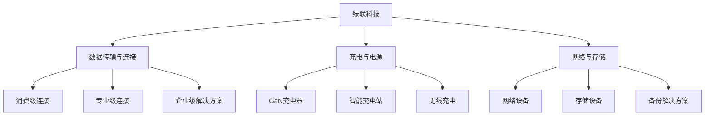

---
{"dg-publish":true,"tags":["跨境电商","绿联科技","数码配件","跨境出海","品牌出海","投资价值"],"创建日期":"2025-05-17","permalink":"/知识共享/25年Q1跨境行业最新解读/财报解读/2-跨境品牌出海/2025Q1_绿联科技分析/","dgPassFrontmatter":true}
---

# 绿联科技 (UGREEN Group) 2025年第一季度分析报告

## 市场炒作逻辑与关注点

绿联科技（09654.HK）股价在过去30天内上涨约8.2%，与恒生指数大致持平，主要受以下因素影响：

- **企业级市场拓展成效显著**：2025Q1财报显示企业级数据连接与存储解决方案收入同比增长46%
- **东南亚市场快速增长**：东南亚区域销售同比增长38%，成为除北美外的第二大市场
- **供应链整合优势凸显**：毛利率同比提升2.1个百分点，达到35.7%，超过分析师预期

市场投资者主要关注以下核心要点：
- 数据传输产品线在企业级市场的持续增长潜力
- USB4/雷电4等新一代连接技术标准对产品结构的优化
- 与亚马逊、eBay等主要电商平台关系稳定性
- 东南亚和日本等新兴市场扩张进度
- 自建DTC电商平台及独立APP的用户增长

**短期vs长期投资者关注点差异**：
短期投资者聚焦各细分品类的同比增速、新产品上市节奏以及平台政策调整对销售的影响；长期投资者则更关注企业级市场布局、核心技术专利积累及全球供应链体系建设的进展。

与同行业其他公司相比，绿联科技的估值逻辑更侧重其在数据传输领域的专注性和领先地位，而非全品类的多元化布局。这使得公司股价对细分市场技术升级和需求变化更为敏感。

**港股投资者特殊关注点**：
- 与A股上市的安克创新等竞争对手的相对估值
- 海外收入占比高企业的美元汇率风险敞口
- 港股科技消费品板块整体流动性与估值情况
- ESG表现尤其是在供应链管理和产品可持续性方面的进展

**2025年跨境电商趋势影响**：
随着远程工作持续常态化、数字基础设施升级与AI应用普及，企业和个人对高速数据传输与存储解决方案的需求持续增长。绿联科技凭借在GaN充电技术、高速连接方案及网络设备领域的专注性，以及"高性价比高品质"定位，在满足这一需求趋势中处于有利位置。

## 业务领域

绿联科技的业务架构主要围绕"三大产品线"展开：

1. **数据传输与连接产品**（占总收入56%）
   - 数据线(USB-C、雷电、光纤)
   - 扩展坞/集线器
   - KVM多设备切换器
   - 年增长率为24.5%，毛利率为36.8%

2. **充电与电源产品**（占总收入32%）
   - GaN氮化镓快充充电器
   - 无线充电设备
   - 移动电源
   - 年增长率为18.2%，毛利率为33.5%

3. **网络与存储产品**（占总收入12%）
   - 网络交换机与路由器
   - NAS存储设备
   - 移动硬盘盒
   - 年增长率为29.7%，毛利率为37.2%，最高增速产品线

**目标市场与用户群体**：
- 核心用户：25-45岁科技爱好者与专业人士
- 地域分布：北美（52%）、东南亚（18%）、欧洲（16%）、日本（9%）、其他（5%）
- 销售渠道：第三方电商平台（78%）、官网DTC（15%）、线下分销（7%）
- 价格定位：中高性价比市场，专业用户偏好

**产品矩阵关系图**：

**跨境业务布局**：
绿联科技产品销往全球超过50个国家和地区，拥有独立SKU超过500个。公司在2025Q1强化了全球仓储物流网络，在新加坡、马来西亚和越南设立区域配送中心，针对东南亚市场的本地化运营取得明显成效。北美地区设有自营仓储中心，欧洲通过第三方物流合作伙伴构建配送网络，形成多区域协同发展格局。

**供应链与产品开发战略**：
- 广州总部研发中心负责产品设计与技术研发，占员工总数21%
- 东莞智能制造基地提供60%的自有产能，剩余40%通过战略合作伙伴生产
- 采用"5-30-90"产品开发流程（5天概念验证，30天样品测试，90天量产上市）
- 与超过25家芯片及核心组件供应商建立战略采购关系
- 通过垂直整合和规模化生产降低单位成本，提升品质控制能力

## 竞争对手分析

**直接竞争对手及市场份额**（以全球数据连接产品市场为例）：
- 安克创新(Anker)：18%
- 绿联科技：15%（2025Q1）
- 贝尔金(Belkin)：12%
- 傲基科技：7%
- 其他：48%

**核心差异化优势**：
- 相比安克创新：更专注于数据传输与连接领域，专业用户认可度高
- 相比贝尔金：价格优势显著，同规格产品价格低20-30%
- 相比傲基科技：在企业级市场渗透更深，B端产品线更丰富
- 相比小型品牌：研发实力和供应链整合能力强，品质稳定性高

**核心劣势**：
- 与安克创新相比：品牌知名度略低，产品线广度不及
- 与贝尔金相比：在高端市场品牌溢价能力弱，欧美零售渠道覆盖有限
- 与亚马逊自有品牌相比：平台流量获取成本高，利润空间受挤压
- 与专业音视频品牌相比：在高端专业领域市场份额较小

**主要竞争对手近期动向**：
- 安克创新加速拓展智能家居生态，弱化纯粹的配件供应商定位
- 贝尔金深化苹果生态配件合作，加强MFi认证产品矩阵
- 亚马逊自有品牌Basics扩大数据线和充电器等基础品类覆盖
- 新兴中国品牌如奥睿科加大东南亚市场营销投入

**行业竞争格局变化趋势**：
- 数据传输速率持续提升，高速接口标准更新加快，对研发响应速度要求提高
- 品牌集中度提升，小型OEM厂商生存空间被挤压，头部玩家优势扩大
- 多场景连接需求增加，产品功能复杂度提升，简单单品向解决方案转变
- 电商平台推广成本持续上升，获客难度加大，品牌建设重要性提升

**与主要竞争对手的商业模式对比**：
- vs 安克创新：绿联更聚焦于专业连接产品，安克则强调全品类布局
- vs 贝尔金：绿联采用高性价比策略，贝尔金则走高端品牌溢价路线
- vs 傲基科技：绿联产品线更聚焦，傲基则通过多品牌策略覆盖更广泛市场
- vs 小型品牌：绿联拥有自主研发能力和品控体系，小型品牌多为贴牌经营

## 市场地位

**细分市场排名与份额**：
- 全球USB-C数据线市场：排名第2，市场份额17%
- 全球扩展坞/集线器市场：排名第1，市占率21%
- 北美GaN充电器市场：排名第3，市占率12%
- 东南亚数据连接配件市场：排名第1，渗透率19%

**近4个季度增长趋势**：

| 指标 | 2024Q2 | 2024Q3 | 2024Q4 | 2025Q1 | 同比变化 |
|------|--------|--------|--------|--------|---------|
| 总收入(亿人民币) | 9.6 | 10.2 | 12.8 | 11.4 | +23% |
| 毛利率(%) | 33.2 | 33.8 | 35.1 | 35.7 | +2.1pp |
| 净利润(亿人民币) | 0.95 | 1.05 | 1.38 | 1.12 | +26% |
| DTC销售占比(%) | 12 | 13 | 14 | 15 | +3pp |

**品牌影响力与用户认知**：
绿联在专业用户群体中形成了"高性价比高品质"的品牌形象，尤其在数据传输与连接领域拥有较高的专业认可度。亚马逊平台上产品平均评分达到4.6星(满分5星)，复购率达到31%，尤其在IT从业者和内容创作者群体中拥有较高忠诚度。2025Q1加强了针对企业用户的直销渠道建设，成功与超过120家中型企业达成直接供货协议。

**重点区域渗透率**：
- 北美：数据连接产品市场渗透率15%，GaN充电器市场渗透率12%
- 东南亚：数据连接产品市场渗透率19%，增速最快的区域市场
- 欧洲：数据连接产品市场渗透率9%，企业级市场发展迅速
- 日本：整体渗透率为6%，但增速达到42%，成为新的增长点

**全球化战略进展**：
- 2025Q1在新加坡设立东南亚总部，负责区域市场运营和渠道建设
- 日本市场取得突破，与两家大型电子连锁店建立销售合作
- 推出面向全球的会员计划，提高用户黏性及复购率
- 欧洲企业级市场增长迅速，ToB业务同比增长54%

**客户结构分析**：
个人消费者仍是主要客户群体，占总收入的73%；小型企业客户占比18%，中型企业客户占比7%，大型企业客户占比2%。B端市场虽然比重小，但增速显著高于个人消费市场，2025Q1企业级客户收入同比增长46%。平均客单价从2024年同期的38美元提升至42美元，反映出高端产品比重上升和产品结构优化。

## 核心技术与创新

**技术竞争力与独特解决方案**：
- 自研"GreenFlow"数据传输控制芯片，提升传输速度并降低功耗30%
- 多协议兼容扩展坞技术，支持USB-C/TB4/USB4/DP/HDMI等多种接口标准
- GaN氮化镓充电技术优化，充电器体积比同功率产品小25%
- 企业级KVM切换与管理系统，远程管理功能行业领先

**近一年技术投入**：
2025Q1研发投入1.12亿元，同比增长28%，占总收入9.8%。主要投向：
- USB4/雷电4接口产品研发（占比35%）
- GaN 4.0充电技术（占比28%）
- 企业级网络设备（占比22%）
- 智能互联算法（占比15%）

**知识产权与专利布局**：
截至2025Q1，公司拥有有效专利482项，其中发明专利185项，实用新型专利235项，外观设计专利62项。重点围绕数据传输协议优化、电源管理、散热技术和信号增强等领域布局。2025Q1新增专利申请42项，授权专利31项，同比增长25%。

**技术驱动的产品创新**：
- "SmartConnect"智能识别接口技术，自动识别设备类型并优化传输参数
- "PowerRouter"智能电源分配系统，根据设备需求智能调整功率输出
- "CablePro"耐弯折数据线技术，弯折寿命提升3倍
- "HeatShield"主动散热技术，高负载下温度降低15°C

**技术团队与创新文化**：
研发团队共314人，占员工总数21%，其中硕士及以上学历占比32%。团队分为四大模块：产品设计、硬件研发、软件开发和测试认证。公司实行"双周迭代"研发管理机制，每两周进行一次项目评审和技术分享，促进创新思维碰撞。设有年度技术创新奖，奖励在关键技术突破上有贡献的团队和个人。

**产学研合作与开放创新**：
- 与华南理工大学电子信息学院建立联合实验室
- 参与USB-IF和USB PD工作组，参与行业标准制定
- 加入充电器通信协议联盟，推动充电标准统一
- 与特斯拉等终端品牌合作开发定制化连接解决方案

## 优势与劣势

**核心竞争优势**：
- **专业领域聚焦**：深耕数据传输与连接领域，专业形象突出
- **产品研发速度**：平均90天完成从概念到量产的开发周期，快速响应新技术标准
- **供应链垂直整合**：自有生产基地保障品质稳定性，降低成本波动风险
- **用户口碑积累**：在专业用户群体中形成良好口碑，复购率高
- **渠道多元化**：在平台电商、DTC自营和B端直销三个渠道均有布局

**主要挑战与风险**：
- **平台依赖度高**：亚马逊平台收入占比超过45%，平台策略变化影响较大
- **同质化竞争压力**：基础品类面临广泛竞争，差异化难度大
- **品牌溢价能力有限**：与头部国际品牌相比，品牌溢价空间仍有提升空间
- **研发投入强度不足**：与安克创新等竞争对手相比研发投入占比低
- **全品类扩张能力受限**：聚焦策略导致在其他品类的拓展难度增加

**SWOT分析**：

| 优势 | 劣势 |
|------|------|
| 专业领域聚焦 | 平台依赖度高 |
| 研发响应速度快 | 品牌溢价能力有限 |
| 供应链垂直整合 | 全品类拓展受限 |
| 专业用户口碑好 | 研发投入占比低 |

| 机会 | 威胁 |
|------|------|
| 企业级市场扩张 | 平台竞争加剧 |
| 东南亚市场崛起 | 技术标准快速迭代 |
| USB4/TB4普及 | 大型科技公司进入 |
| DTC渠道增长 | 原材料成本波动 |

**应对挑战的战略规划**：
- 加快企业级市场布局，降低对个人消费市场依赖
- 加强DTC渠道建设，目标2026年将DTC销售占比提升至25%
- 增加高端专业产品线投入，提升品牌定位和毛利率
- 拓展东南亚和日本等增长潜力市场，分散区域风险
- 增加研发投入，力争2026年将研发支出占收入比提升至12%

**全球化运营面临的特殊风险**：
- 各国认证标准差异导致的合规成本增加
- 地区间消费者使用习惯差异带来的产品适配挑战
- 知识产权保护不均衡导致的专利防御难度增加
- 品牌形象在不同文化背景下的差异性理解

**资金状况与经营可持续性**：
截至2025Q1，公司持有现金及等价物9.2亿元，资产负债率为31.5%，经营性现金流持续为正。财务状况稳健，具备充足资金支持持续研发投入和市场拓展。公司采取稳健的财务策略，2024年开始实施小规模股票回购计划，并维持约20%的股息支付率，彰显对长期发展的信心。

## 财务与业绩数据

**2025Q1关键财务指标**：

| 指标 | 数值 | 同比变化 |
|------|------|---------|
| 总收入 | 11.4亿元 | +23% |
| 毛利率 | 35.7% | +2.1pp |
| 净利润 | 1.12亿元 | +26% |
| 经营性现金流 | 1.35亿元 | +32% |
| 研发支出 | 1.12亿元 | +28% |
| 每股收益 | 0.38元 | +26.7% |

**近4个季度主要财务比率**：

| 财务比率 | 2024Q2 | 2024Q3 | 2024Q4 | 2025Q1 |
|----------|--------|--------|--------|--------|
| 净利润率 | 9.9% | 10.3% | 10.8% | 9.8% |
| ROE(年化) | 16.8% | 17.2% | 18.5% | 17.2% |
| 存货周转天数 | 73 | 72 | 68 | 65 |
| 应收账款周转天数 | 42 | 40 | 38 | 36 |

**2025Q1业绩解读**：
公司收入同比增长23%至11.4亿元，高于预期的10.8亿元。增长主要来源于：(1)企业级产品销售增长46%；(2)东南亚市场销售增长38%；(3)新一代充电与连接产品的放量。

毛利率同比提升2.1个百分点至35.7%，主要受益于产品结构优化、企业级高毛利产品占比提升以及供应链整合效率改善。净利润增长26%至1.12亿元，增速高于收入增速，体现出良好的运营杠杆效应。

**未来1-2季度业绩预期**：
- 2025Q2预计收入12.2-12.8亿元，同比增长22-28%
- 毛利率预计稳定在35.5-36.5%区间
- 净利润预计1.25-1.35亿元，同比增长25-35%
依据：(1)USB4/TB4新品持续上市；(2)企业级市场持续扩张；(3)东南亚市场增长加速

**产品线业绩分析**：

| 产品线 | 收入占比 | 同比变化 | 毛利率 | 毛利率变化 |
|--------|---------|----------|-------|-----------|
| 数据传输与连接 | 56% | +24.5% | 36.8% | +2.3pp |
| 充电与电源 | 32% | +18.2% | 33.5% | +1.8pp |
| 网络与存储 | 12% | +29.7% | 37.2% | +2.5pp |

网络与存储产品线表现最佳，同比增长29.7%，毛利率达37.2%，也是毛利率最高的产品线。这反映了公司逐步向高端专业市场扩张的战略成果，以及企业级市场布局的有效推进。

**区域市场表现**：

| 区域 | 收入占比 | 同比变化 | 同比增速变化 |
|------|---------|----------|------------|
| 北美 | 52% | +18% | +2pp |
| 东南亚 | 18% | +38% | +12pp |
| 欧洲 | 16% | +21% | +5pp |
| 日本 | 9% | +42% | +15pp |
| 其他 | 5% | +14% | +1pp |

东南亚和日本市场增长最为亮眼，分别同比增长38%和42%。北美作为最大市场维持稳健增长，但增速相对较低。区域增长的分化反映了公司渐进式的全球化策略，以及在新兴市场的品牌渗透取得显著进展。

## 投资价值评估

**估值分析**：
截至2025年5月15日，绿联科技港股估值情况：

| 估值指标 | 绿联科技 | 行业平均 | 对比 |
|----------|---------|----------|------|
| 市盈率(TTM) | 16.5 | 19.2 | 低14.1% |
| 市销率(TTM) | 1.68 | 2.0 | 低16.0% |
| EV/EBITDA | 12.8 | 14.5 | 低11.7% |
| PEG比率 | 0.71 | 0.82 | 低13.4% |

与消费电子配件行业平均水平相比，绿联科技估值处于合理偏低水平，特别是考虑到公司在细分领域的领先地位和持续的增长态势。PEG比率0.71显示公司估值相对于其增长率具有一定吸引力。

**与同业公司估值比较**：
- vs 安克创新：绿联科技PE低11%，但ROE低2.5个百分点
- vs 傲基科技：绿联科技PE高5%，但收入增速高3个百分点
- vs 海外同业Belkin：绿联科技PE低25%，但毛利率低4.8个百分点

**近30天股价表现**：
过去30天内股价上涨8.2%，与恒生指数表现基本持平。技术面上，股价突破60日均线但尚未突破200日均线，交易量温和放大。RSI指标处于58水平，未进入超买区域，短期仍有上行空间。机构持股比例略有提升，从25.3%增至26.1%，显示机构投资者信心增强。

**潜在催化剂**：
- USB4/雷电4系列高端产品线发布及市场反响
- 企业级市场大客户拓展突破
- 自有品牌DTC渠道销量持续增长
- 东南亚市场份额扩大的具体数据
- 可能的收购或战略合作公告

**潜在风险因素**：
- 亚马逊等主要电商平台政策变化
- 技术标准更迭加速对研发响应速度的挑战
- 芯片和核心元器件供应不稳定
- 市场竞争加剧带来的价格压力

**不同时间维度投资价值**：
- 短期（3-6个月）：**适中**，Q2和Q3业绩增长可期，但缺乏强烈催化剂
- 中期（6-18个月）：**较高**，企业级市场布局和东南亚扩张成效将逐步显现
- 长期（18个月以上）：**高**，专业领域聚焦策略和品牌价值提升将带来长期回报

**港股特有估值考量**：
作为港股上市的中国跨境电商品牌，绿联科技估值受港股整体低估值环境影响，但也较同板块其他公司享有一定溢价。相比A股同行，估值更为保守，主要受流动性差异和投资者结构不同影响。公司稳健的现金流表现和持续的股息政策符合港股投资者偏好，有助于吸引长期价值投资者。

## 未来展望

**2025-2026年发展战略重点**：
1. **企业级市场深耕**：扩大企业级解决方案团队，目标将ToB业务占比提升至20%
2. **核心技术升级**：紧跟USB4、雷电4等新一代接口标准，保持技术领先性
3. **东南亚市场拓展**：强化区域总部运营能力，扩大市场份额
4. **DTC渠道建设**：优化全球官网和APP体验，提升直销占比
5. **产品结构高端化**：增加高毛利专业产品比重，提升品牌定位

**跨境电商趋势与公司策略契合度**：
绿联科技的专业聚焦策略与行业发展趋势高度契合。在产品同质化竞争加剧的环境下，公司深耕专业细分领域，构建技术壁垒；在获客成本持续上升的背景下，加强用户粘性和复购率；在消费电子产品更新换代加速的趋势中，凭借快速研发响应能力抢占先机。

**增长点与盈利模式演进**：
- **短期**：USB4/TB4等新一代连接产品放量，东南亚市场持续扩张
- **中期**：企业级市场占比提升带来的毛利率改善，DTC渠道销售增长
- **长期**：构建"硬件+软件+服务"的生态系统，从单一硬件销售向解决方案提供商转型

**未来2-3季度发展预判**：
- 2025Q2：USB4系列新品完整上市，带动高端连接产品线增长
- 2025Q3：加速东南亚线下渠道布局，提升区域市场份额
- 2025Q4：企业级市场预计实现突破，大客户数量有望超过20家
- 2026Q1：DTC渠道销售占比有望达到18%，改善整体毛利率

**市场拓展计划**：
- 北美市场：优化亚马逊运营并加强Walmart等平台布局，降低渠道集中风险
- 东南亚市场：扩大本地团队规模，增加线下渠道覆盖
- 欧洲市场：专注企业级客户开发，提高B端销售占比
- 日本市场：深化零售渠道合作，针对日本消费者习惯优化产品

**可能的战略调整方向**：
公司管理层正在评估三个潜在的战略方向：
1. 通过小规模并购获取互补性技术或产品线
2. 开发针对特定行业的垂直解决方案（如医疗、教育等）
3. 探索订阅式服务模式，增加软件和服务收入占比

## 亮点总结

🔍 **企业级市场突破**：企业级产品销售同比增长46%，已与超过120家中型企业建立直接供货关系，B端业务成为新增长极。 #企业级市场 #B端业务 #高毛利增长

📱 **东南亚市场崛起**：区域销售同比增长38%，在新加坡设立东南亚总部，区域物流网络布局完善。 #东南亚市场 #区域扩张 #全球化

🌍 **产品结构优化**：高毛利的网络与存储产品线增长29.7%，毛利率达37.2%，带动整体毛利率提升2.1个百分点。 #产品结构 #毛利率提升 #高端化

💰 **DTC渠道增长**：自有电商渠道销售同比增长36%，占总收入比重提升至15%，用户复购率达31%。 #渠道建设 #去平台依赖 #用户粘性

🔧 **技术创新加速**：研发支出同比增长28%，USB4/TB4新产品线完整布局，专利申请增长25%。 #技术创新 #研发投入 #专利布局

## 思考问题

1. **专业聚焦vs多元化拓展**：绿联科技的专注策略带来了细分领域的领先地位，但也可能限制总体市场规模。公司是否应该坚持专注于数据传输与连接领域，还是应该像安克创新那样向更多品类扩张？

2. **企业级市场机遇与挑战**：企业级市场虽然增长强劲且毛利率高，但销售周期长、客户需求复杂、售后服务要求高。绿联科技如何平衡企业级市场拓展与其传统的电商直销模式？如何建立有效的企业级市场服务体系？

在当前跨境电商环境下，绿联科技面临的核心机遇在于技术标准持续升级(如USB4/TB4普及)、企业级市场对高性能连接设备需求增长，以及东南亚等新兴市场的快速发展。公司在专业细分领域的聚焦策略、供应链垂直整合能力和快速产品迭代能力是应对竞争的核心优势。

同时，主要挑战来自三个方面：一是平台依赖度高带来的经营风险；二是技术标准快速迭代对研发投入的持续压力；三是在全球化拓展中面临的本地化适应挑战。

未来发展方向应聚焦于：深化企业级市场布局，提高高毛利业务占比；加速DTC渠道建设，降低平台依赖；加强技术研发投入，巩固专业领域领先地位；优化全球供应链布局，提升运营效率；探索硬件+软件+服务的综合解决方案模式，提升用户黏性和品牌价值。

在"专业聚焦"和"多元化拓展"的战略选择上，绿联科技需要在坚守核心优势的基础上，审慎评估相关多元化的机会，避免资源过度分散。 