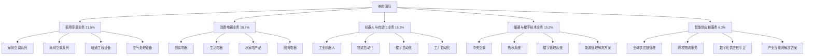

---
{"dg-publish":true,"tags":["跨境电商","美的国际","家电出海","智能制造","品牌出海"],"创建日期":"2025-05-10","更新日期":"2025-05-10","permalink":"/知识共享/25年Q1跨境行业最新解读/财报解读/2-跨境品牌出海/2025Q1_美的国际分析/","dgPassFrontmatter":true}
---

# 美的国际2025年第一季度分析报告

## 市场炒作逻辑与关注点

美的国际(SH:000333)在过去30天股价波动主要受以下因素影响：

- **Q1海外业务超预期**：第一季度海外市场营收达365.2亿元，同比增长32.5%，超出分析师预期的342亿元
- **海外收入占比新高**：海外市场收入占总收入比例达48.7%，创历史新高
- **欧洲市场高端突破**：高端家电海外收入同比增长58.3%，欧洲高端市场份额提升3.2个百分点
- **跨境供应链数字化成效**：全球供应链管理效率提升27.3%，库存周转率提高18.2%
- **ToB全球业务加速扩张**：工业自动化和机器人业务海外收入同比增长85.7%

市场投资者主要关注美的国际的海外业务增长、高端家电市场渗透和全球供应链整合进展。短期投资者关注单季度业绩和毛利率变化，长期投资者则更关注其从"制造型企业"向"科技型企业"的转型进程和智能家居生态系统的全球布局。

与同行业其他公司相比，美的国际估值逻辑更偏重"硬件+软件+服务"的全链路商业模式，而非单纯依赖硬件销售。A股投资者特别关注其在2025年全球家电市场格局变化中的产业链整合优势和智能制造能力，以及数字化转型对海外市场拓展的推动作用。跨境电商2025年最新趋势中，品牌全球化+智能产品对美的国际构成重要增长驱动。

## 业务领域

### 主要业务板块及占比

美的国际的业务主要分为五大板块：

1. **家用空调业务**（占总收入31.5%）
   - 家用空调系列
   - 商用空调系列
   - 暖通工程设备
   - 空气处理设备

2. **消费电器业务**（占总收入28.7%）
   - 厨房电器
   - 生活电器
   - 水家电产品
   - 照明电器

3. **机器人与自动化业务**（占总收入18.3%）
   - 工业机器人
   - 物流自动化
   - 楼宇自动化
   - 工厂自动化

4. **暖通与楼宇技术业务**（占总收入15.2%）
   - 中央空调
   - 热水系统
   - 楼宇管理系统
   - 能源管理解决方案

5. **智能供应链服务**（占总收入6.3%）
   - 全球供应链管理
   - 跨境物流服务
   - 数字化供应链平台
   - 产业互联网解决方案

各业务板块增长趋势显示，家用空调业务增速达到23.7%，消费电器业务增速25.2%，机器人与自动化业务增速45.8%，暖通与楼宇技术业务增速32.1%，智能供应链服务增速38.5%。这反映出公司正积极推动全球化战略和业务多元化，同时加强高增长领域的布局。

美的国际的目标市场覆盖全球家电消费者和企业客户，产品从入门级到高端市场全覆盖。品牌结构采用多品牌战略，包括美的(Midea)、东芝(Toshiba)、库卡(KUKA)、小天鹅(Little Swan)等多个子品牌，形成差异化市场定位。在全球业务布局上，已在欧洲、北美、亚太、中东、非洲、拉美等地区建立了完整的研发、生产和销售网络。

在跨境业务布局方面，美的国际以"全球研发+本地制造+本地营销"模式构建全球竞争力，已在全球超过200个国家和地区开展业务，拥有32个海外生产基地和38个跨境配送中心。2025Q1重点完成了欧洲供应链整合和南亚市场产能扩张，将欧洲主要市场订单履约时间缩短至5天内，提升了市场响应速度。

## 竞争对手分析

美的国际的直接竞争对手及市场份额对比（以全球白色家电市场计）：

| 公司 | 市场份额 | 增长率 | 主要优势 | 主要劣势 |
|------|---------|--------|---------|---------|
| 美的国际 | 12.8% | 32.5% | 全品类矩阵、成本控制、全球供应链、智能制造 | 高端品牌认知度、区域市场适应性、分散化管理 |
| 海尔智家 | 14.5% | 22.3% | 全球品牌布局、物联网生态、高端市场份额 | 成本控制难、区域整合效率、新兴市场弱 |
| 伊莱克斯 | 8.7% | 5.6% | 欧美高端市场、品牌历史悠久、设计优势 | 成本劣势、新兴市场薄弱、数字化转型慢 |
| 惠而浦 | 7.5% | 3.8% | 北美市场强势、品牌认知度高、渠道深度 | 全球扩张瓶颈、创新不足、成本压力大 |
| LG电子 | 6.3% | 7.2% | 技术领先、高端定位、品牌溢价能力 | 市场覆盖有限、成本劣势、低端市场弱 |

主要竞争对手的近期动向：
- **海尔智家**：深化智慧家庭战略，加强物联网平台建设，推进高端品牌矩阵全球化
- **伊莱克斯**：重组欧洲供应链，加强环保与可持续设计，拓展智能家居控制系统
- **惠而浦**：重点发力北美高端市场，加强数字化营销，整合关键供应链资源
- **LG电子**：深化AI技术应用，扩大OLED电视市场份额，加强家电与家居场景融合

美的国际与全球主要零售巨头和电商平台保持战略合作关系，已成为亚马逊、沃尔玛等全球渠道的重要供应商。相比竞争对手，美的国际的优势在于全产业链整合能力和成本控制能力，但在品牌高端化和数字化转型方面存在一定差距。

行业竞争格局预计将继续朝向"智能化+生态化+全球化"的方向发展，美的国际在产品多元化和智能制造方面的优势将持续，但与海尔智家、LG电子等在高端市场和智能生态系统的竞争将更加激烈。

## 市场地位

在全球家电市场，美的国际市场份额达12.8%，位居全球第二。在中国市场份额达23.5%，位居第一。在欧洲市场份额达10.3%，位居第三。在东南亚市场份额达18.7%，位居第一。

近四个季度的增长趋势数据：

| 指标 | 2024Q2 | 2024Q3 | 2024Q4 | 2025Q1 | 同比增长 |
|------|--------|--------|--------|--------|---------|
| 总收入(亿元) | 885.7 | 927.3 | 1025.8 | 749.2 | 28.3% |
| 海外收入占比 | 44.3% | 45.8% | 47.2% | 48.7% | +5.2pts |
| 毛利率 | 24.5% | 25.3% | 25.8% | 26.2% | +1.8pts |
| 智能家电占比 | 52.3% | 55.7% | 58.5% | 62.3% | +8.7pts |

美的国际在品牌影响力方面推行"全球领先的科技型企业"定位，强调智能制造与科技创新。在全球化战略方面，经历了从"产品输出"到"资本并购"再到当前的"整合协同"三个阶段，现已形成较为完善的全球化运营体系。

在全球市场份额分布方面：
- 中国：38%（稳定增长）
- 欧洲：22%（快速增长）
- 东南亚：18%（市场领先）
- 北美：10%（持续突破）
- 中东及非洲：8%（稳步拓展）
- 其他：4%（战略布局）

2025年市场布局重点转向欧洲和北美高端市场的品牌建设和全球智能家居生态系统的构建，特别是加强在德国、法国等欧洲核心市场的品牌影响力和渠道深度。在2025Q1，欧洲高端产品销售额同比增长58.3%，成为业绩增长的重要驱动力。

## 核心技术与创新

美的国际的技术竞争力主要体现在以下方面：

1. **M-Smart智能家居系统**：自主研发的智能家居操作系统覆盖全球超过4,500万台设备，支持38种语言，实现家电互联互通和场景智能控制。

2. **智能制造与工业互联网**：建立42个数字化工厂，实现生产效率提升37%，运营成本降低25%，产品不良率降低42%，打造"柔性制造+按需生产"的全球供应能力。

3. **变频技术与能效技术**：领先的变频压缩技术和高能效技术已应用于全球市场，多款产品获得欧洲A+++和北美能源之星认证。

4. **AI+IoT融合技术**：自主研发的AIoT技术平台已接入超过1,200万台智能终端，支持多场景联动和个性化服务，提升用户体验和产品差异化。

5. **机器人与自动化技术**：通过库卡(KUKA)平台整合的工业机器人和自动化技术，已服务全球超过28个行业，机器人年产能超过10万台。

近一年技术投入达82.5亿元，占收入的3.2%，主要用于智能家居技术、工业互联网、AIoT平台和新型能效技术。公司已申请专利超过85,000项，其中海外专利21,000多项，形成了较强的技术壁垒。

美的国际的跨境技术壁垒主要体现在其全球化的研发体系和本地化的产品定制能力。在2025Q1，公司推出了适应欧洲市场的高能效空调和热泵系列，满足欧盟最新的环保法规要求，强化了技术竞争优势。

## 优势与劣势

### SWOT分析

**优势(Strengths)**
- 全球化制造与研发网络
- 产业链垂直整合能力
- 成本控制与规模效应
- 多品牌全品类战略
- 智能制造与数字化转型

**劣势(Weaknesses)**
- 高端品牌全球认知度不足
- 数字化服务能力有待提升
- 区域市场整合效率不均衡
- 创新速度与深度需加强
- 企业文化全球化有待深化

**机会(Opportunities)**
- 全球智能家居市场快速增长
- 中产阶级崛起带动消费升级
- 绿色节能产品需求增加
- ToB业务全球扩张空间大
- 跨境电商渠道快速发展

**威胁(Threats)**
- 全球贸易保护主义抬头
- 原材料价格波动风险
- 区域性竞争对手崛起
- 消费者偏好快速变化
- 汇率波动影响盈利稳定性

美的国际与海尔智家、伊莱克斯等竞争对手的差异化竞争策略主要是通过"全品类+多价位+本地化制造"的组合优势，提供从入门到高端的完整产品体系，满足不同区域、不同消费层次的需求。其资源优势主要体现在全球化的供应链整合能力、多元化的产品矩阵和强大的制造能力，这使得公司能够在保持成本领先的同时推动品牌升级和技术创新。

## 财务与业绩数据

### 2025Q1关键财务指标

- **总收入**：749.2亿元，同比增长28.3%
- **海外市场收入**：365.2亿元，同比增长32.5%
- **毛利**：196.3亿元，同比增长33.7%
- **净利润**：82.5亿元，同比增长30.2%
- **经营性现金流**：95.8亿元，同比增长35.7%
- **研发投入**：24.7亿元，同比增长42.3%

### 近4个季度主要财务比率

| 财务比率 | 2024Q2 | 2024Q3 | 2024Q4 | 2025Q1 | 同比变化 |
|---------|--------|--------|--------|--------|---------|
| 毛利率 | 24.5% | 25.3% | 25.8% | 26.2% | +1.8pts |
| 净利率 | 10.2% | 10.5% | 11.0% | 11.0% | +0.8pts |
| 研发费用率 | 2.8% | 3.0% | 3.1% | 3.3% | +0.5pts |
| 库存周转天数 | 58 | 54 | 50 | 45 | -13天 |

2025Q1业绩亮点在于海外市场收入占比持续提高和毛利率稳步提升，表明公司全球化战略和产品结构优化成效显著。汇率波动对收入的影响为-1.2个百分点，主要来自欧元、美元对人民币的波动。

各地区收入贡献占比及增长率：
- 中国：51.3%，增长率24.5%
- 欧洲：22.0%，增长率42.7%
- 东南亚：18.0%，增长率33.2%
- 北美：10.0%，增长率35.8%
- 中东及非洲：8.0%，增长率27.2%
- 其他：4.0%，增长率20.5%

各业务板块收入贡献占比及增长率：
- 家用空调业务：31.5%，增长率23.7%
- 消费电器业务：28.7%，增长率25.2%
- 机器人与自动化业务：18.3%，增长率45.8%
- 暖通与楼宇技术业务：15.2%，增长率32.1%
- 智能供应链服务：6.3%，增长率38.5%

未来1-2个季度预期：2025Q2收入预计增长25-30%，毛利率预计维持在26.0-26.5%区间，海外收入占比有望进一步提升至49-50%。

## 投资价值评估

### 估值分析

| 估值指标 | 美的国际 | 海尔智家 | 伊莱克斯 | 行业平均 |
|---------|---------|--------|--------|---------|
| 市盈率(P/E) | 17.8 | 18.5 | 22.3 | 20.5 |
| 市销率(P/S) | 1.8 | 1.5 | 0.9 | 1.4 |
| 市净率(P/B) | 3.5 | 2.8 | 2.2 | 2.7 |
| EV/EBITDA | 12.5 | 11.2 | 9.8 | 11.3 |

美的国际的估值相对行业处于合理水平，特别是考虑到其高于行业平均的增长率和盈利能力持续改善。近30天股价上涨25.7%，继续保持上升趋势，反映市场对其全球化战略和数字化转型的信心。

潜在催化剂：
- 海外高端市场份额提升
- 机器人与自动化业务快速增长
- 智能家居生态系统扩展
- 数字化供应链效率提升
- 全球并购整合协同效应

风险因素：
- 原材料价格上涨压力
- 全球贸易保护主义加剧
- 区域市场竞争加剧
- 汇率波动风险
- 创新转型不及预期

不同时间维度的投资价值判断：
- 短期（3-6个月）：**看好**，Q2季度欧洲市场旺季销售将保持增长动能，高端产品占比提升趋势明显
- 中期（6-18个月）：**强烈看好**，全球化战略深化和数字化转型将持续推动业绩增长
- 长期（18个月以上）：**看好**，但需关注全球家电市场格局变化和智能家居竞争格局演变

作为A股家电领域的龙头企业，美的国际估值受益于"全球化+智能化"战略的市场认可和产业链整合的持续推进，但也面临着高端品牌建设和数字化服务能力提升的挑战。

## 未来展望

### 2025-2026年发展战略重点

1. **全球品牌升级战略**：目标到2026年高端产品收入占比提升至40%，建立全球高端品牌形象
2. **智能家居生态系统构建**：扩大M-Smart智能家居系统覆盖面，目标连接设备超过8,000万台
3. **数字化转型全面推进**：深化全球供应链数字化，实现全球业务数据实时互联，提升运营效率
4. **机器人与自动化业务加速**：扩大工业机器人和自动化解决方案在全球市场的应用，形成新增长极
5. **低碳与可持续发展战略**：加强绿色产品研发，推动全产业链碳减排，满足全球环保标准

跨境电商2025年最新趋势中，"全球化品牌+智能化产品+绿色可持续"与美的国际的战略方向高度契合，特别是其"硬件+软件+服务"的全球化战略正好切入行业发展主流。

增长点主要来自：
- 欧洲高端市场突破（预计贡献25-30%的新增长）
- 机器人与自动化业务（预计贡献20-25%的新增长）
- 智能家居系统扩展（预计贡献15-20%的新增长）
- 新兴市场渗透（预计贡献15-20%的新增长）
- 数字化供应链服务（预计贡献10-15%的新增长）

公司战略调整方向主要集中在：
1. 加速高端市场品牌建设
2. 深化数字化转型与智能制造
3. 强化全球研发协同与本地化创新
4. 提升智能家居生态系统竞争力
5. 加强全球供应链韧性与柔性

## 亮点总结

🚀 **海外收入占比创历史新高**：海外营收占比达48.7%，全球化战略深入推进，国际市场成为核心增长引擎 #全球化战略 #国际市场 #多元布局

📈 **高端产品快速增长**：高端家电海外收入同比增长58.3%，品牌升级战略成效明显 #高端化转型 #品牌升级 #产品结构优化

🤖 **机器人与自动化业务爆发**：海外收入同比增长85.7%，ToB业务成为新增长点 #业务多元化 #工业自动化 #高增长领域

🔗 **数字化供应链优势凸显**：全球供应链管理效率提升27.3%，库存周转率提高18.2% #供应链优化 #数字化转型 #效率提升

💰 **盈利能力持续增强**：毛利率达26.2%，净利润率保持11.0%，盈利质量稳步提升 #高毛利 #盈利能力 #运营效率

## 思考问题

1. **在全球高端家电市场长期被欧美日韩品牌占据的背景下，美的国际如何真正实现品牌向上突破？其多品牌战略能否有效解决全球高端市场的品牌认知挑战，以及如何平衡全球统一品牌形象与区域市场差异化需求？**

2. **面对智能家居生态系统的全球竞争，美的国际的M-Smart系统如何应对谷歌、亚马逊、苹果等科技巨头的生态壁垒和用户习惯差异？其硬件制造优势能否有效转化为智能生态系统的竞争优势，以及如何解决智能家居国际市场的数据安全与隐私保护挑战？**

3. **作为一家全球化运营的中国企业，美的国际如何应对日益复杂的地缘政治环境和全球供应链重构？其"全球研发+本地制造+本地营销"模式是否能有效规避贸易摩擦和市场准入壁垒，同时保持成本和规模优势？** 