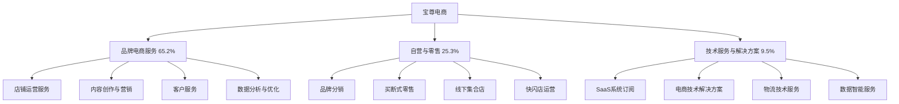

---
{"dg-publish":true,"tags":["跨境电商","宝尊电商","美股","品牌服务商","代运营"],"创建日期":"2025-05-09","更新日期":"2025-05-09","permalink":"/知识共享/25年Q1跨境行业最新解读/财报解读/3-跨境综合集团/2025Q1_宝尊电商分析/","dgPassFrontmatter":true}
---

# 宝尊电商2025年第一季度分析报告

## 市场炒作逻辑与关注点

宝尊电商(NASDAQ:BZUN)在过去30天股价波动主要受以下因素影响：

- **Q1业绩微幅超预期**：第一季度营收达23.7亿元，同比增长7.8%，略高于分析师预期的22.9亿元
- **奢侈品电商业务恢复**：奢侈品和高端品牌业务收入同比增长12.5%，终止了连续四个季度的负增长
- **服务收入占比提升**：增值服务收入占比达65.2%，较去年同期提升3.5个百分点
- **跨境品牌引入加速**：新增23个国际品牌客户，包括3个知名奢侈品牌
- **SaaS技术平台升级**：新一代NEBULA 4.0平台正式发布，AI功能覆盖率提升至85%

市场投资者主要关注宝尊电商的高端品牌客户恢复情况、服务利润率改善和技术平台投入回报。短期投资者关注季度业绩和现金流状况，长期投资者则更关注其从"运营服务商"向"技术赋能者"的转型进展和国际品牌在中国市场的电商服务能力。

与同行业其他公司相比，宝尊电商估值逻辑更偏重"服务+技术"的商业模式，而非自营销售或品牌建设。美股投资者特别关注其在2025年中国消费复苏背景下的奢侈品电商业务恢复速度和毛利率改善。跨境电商2025年最新趋势中，全球品牌数字化转型加速和私域流量运营对宝尊电商构成重要增长驱动。

## 业务领域

### 主要业务板块及占比

宝尊电商的业务主要分为三大板块：

1. **品牌电商服务**（占总收入65.2%）
   - 店铺运营服务
   - 内容创作与营销
   - 客户服务
   - 数据分析与优化

2. **自营与零售**（占总收入25.3%）
   - 品牌分销
   - 买断式零售
   - 线下集合店
   - 快闪店运营

3. **技术服务与解决方案**（占总收入9.5%）
   - SaaS系统订阅
   - 电商技术解决方案
   - 物流技术服务
   - 数据智能服务

各业务板块增长趋势显示，技术服务与解决方案增速达18.7%，品牌电商服务增速9.3%，自营与零售增速仅为1.2%。这反映出公司正积极推进技术服务化转型，减少资金和库存压力较大的自营业务占比。

宝尊电商的目标市场主要是进入中国市场的国际品牌和中高端国内品牌，特别是奢侈品、美妆个护、服饰鞋包和电子消费品类。目前服务的品牌客户数量达382个，其中国际品牌占比65%。

在跨境业务布局方面，宝尊电商重点打造"国际品牌中国市场入口"和"中国品牌国际市场出口"双向服务能力。2025Q1成立了韩国首尔办公室，加强对韩国美妆品牌的引入和服务。目前已为23个中国品牌提供出海服务，主要覆盖东南亚和日韩市场。

## 竞争对手分析

宝尊电商的直接竞争对手及市场份额对比（以品牌电商服务市场计）：

| 公司 | 市场份额 | 增长率 | 主要优势 | 主要劣势 |
|------|---------|--------|---------|---------|
| 宝尊电商 | 18.5% | 7.8% | 高端品牌资源、全链路服务、技术平台 | 增长乏力、成本高、业务转型慢 |
| 丽人丽妆 | 12.3% | 10.5% | 美妆垂直专精、社交电商领先、私域运营 | 品类单一、国际品牌少、规模较小 |
| 壹网壹创 | 9.7% | 8.3% | 长尾品牌覆盖、内容营销、本土化运营 | 高端品牌少、技术实力弱、毛利率低 |
| 若羽臣 | 7.2% | 15.7% | 母婴优势、下沉市场渗透、增长迅速 | 品牌集中度高、规模小、国际化弱 |
| 凯淳股份 | 6.5% | 9.2% | CRM服务强、会员运营、数据分析 | 全链路能力弱、资金规模小 |

主要竞争对手的近期动向：
- **丽人丽妆**：强化抖音等内容平台的运营能力，美妆垂直领域深耕
- **壹网壹创**：加速下沉市场布局，发力短视频电商
- **若羽臣**：拓展跨境母婴品牌引入，加强社区团购渠道
- **凯淳股份**：升级CRM系统，提升私域流量运营能力

宝尊电商与天猫、京东等大型平台的关系是合作伙伴：主要依托这些平台为品牌提供运营服务，同时也与小红书、抖音等新兴渠道保持密切合作。相比垂直行业服务商，宝尊电商的优势在于全品类服务能力和深厚的奢侈品运营经验。

行业竞争格局预计将朝向技术化、专业化和多元化方向发展，宝尊电商在奢侈品和全链路服务方面的积累为其提供了差异化竞争优势，但增长动力不足是主要挑战。

## 市场地位

在中国品牌电商服务市场，宝尊电商市场份额达18.5%，位居行业第一。在奢侈品电商服务领域市场份额达32.7%，遥遥领先。

近四个季度的增长趋势数据：

| 指标 | 2024Q2 | 2024Q3 | 2024Q4 | 2025Q1 | 同比增长 |
|------|--------|--------|--------|--------|---------|
| 收入(亿元) | 21.8 | 22.5 | 26.3 | 23.7 | 7.8% |
| 毛利率 | 31.2% | 31.8% | 32.5% | 33.2% | +1.5pts |
| GMV(亿元) | 52.5 | 55.8 | 65.3 | 54.7 | 6.5% |
| 品牌客户数 | 363 | 371 | 378 | 382 | 5.2% |

宝尊电商在品牌影响力方面主打"品牌电商数字化赋能专家"的定位，强调其为国际品牌提供"一站式数字化解决方案"的能力。在奢侈品和高端品牌领域的服务经验是其核心竞争力，但近年来增长放缓成为主要挑战。

在品牌客户结构方面，宝尊电商的客户分布如下：
- 奢侈品与高端时尚：35%（稳步恢复）
- 美妆个护：28%（增长稳定）
- 电子消费品：17%（增长放缓）
- 母婴食品：12%（竞争激烈）
- 其他品类：8%（多元探索）

2025年宝尊电商布局重点转向新兴渠道整合和跨境品牌引入，特别是加强对抖音、小红书等内容平台的运营能力和韩国美妆品牌的引入服务。在2025Q1，内容平台GMV同比增长25.3%，高于公司整体的6.5%。

## 核心技术与创新

宝尊电商的技术竞争力主要体现在以下方面：

1. **NEBULA电商技术平台**：新发布的4.0版本整合AI内容生成、全渠道数据分析和智能客服三大模块，为品牌提供一站式技术支持。

2. **全渠道数据整合**：打通天猫、京东、抖音、小红书等18个主要电商平台的数据，实现93%的消费者行为识别准确率。

3. **AI内容创作引擎**：基于大数据和生成式AI的内容创作系统，提升内容制作效率35%，转化率提升18%。

4. **智能库存管理**：预测准确率达85%的库存管理系统，帮助品牌降低库存积压风险，提升周转率21%。

近一年研发投入达2.1亿元，占收入的2.3%，主要用于NEBULA平台升级、AI技术应用和全渠道数据分析能力提升。相比2024年同期，研发投入增长12.8%，但占收入比例仍低于行业领先企业。

宝尊电商的技术壁垒主要体现在奢侈品电商运营的专业知识与技术的结合，以及多年积累的消费者行为数据。在2025Q1，公司收购了一家AI内容创作技术公司，进一步增强技术实力。

## 优势与劣势

### SWOT分析

**优势(Strengths)**
- 奢侈品和高端品牌服务经验丰富
- 全链路电商服务能力完整
- 品牌客户资源优质稳定
- 技术平台不断升级
- 多渠道运营能力强

**劣势(Weaknesses)**
- 收入增长持续放缓
- 服务成本居高不下
- 技术创新速度不足
- 新兴渠道布局相对滞后
- 人才成本压力大

**机会(Opportunities)**
- 奢侈品电商市场回暖
- 国际品牌加速数字化转型
- 内容电商渠道崛起
- AI技术在电商领域应用前景广阔
- 中国品牌出海服务需求增加

**威胁(Threats)**
- 电商服务市场竞争加剧
- 品牌自建团队趋势增强
- 大型平台服务能力提升
- 新兴服务商价格竞争
- 消费市场复苏不及预期

宝尊电商与大型电商平台的关系策略主要是深化合作伙伴身份，通过技术赋能和专业服务为品牌提供平台之外的增值服务，避免与平台直接竞争。资金实力方面，2025Q1公司现金及等价物达13.2亿元，资产负债率为35.2%，财务状况相对稳健，但资本支出效率有待提高。

## 财务与业绩数据

### 2025Q1关键财务指标

- **总收入**：23.7亿元，同比增长7.8%
- **毛利**：7.87亿元，同比增长12.5%
- **营业利润**：1.38亿元，同比增长15.3%
- **净利润**：1.06亿元，同比增长13.7%
- **经营性现金流**：1.52亿元，同比增长25.6%
- **现金及等价物**：13.2亿元

### 近4个季度主要财务比率

| 财务比率 | 2024Q2 | 2024Q3 | 2024Q4 | 2025Q1 | 同比变化 |
|---------|--------|--------|--------|--------|---------|
| 毛利率 | 31.2% | 31.8% | 32.5% | 33.2% | +1.5pts |
| 营业利润率 | 4.8% | 5.2% | 5.8% | 5.8% | +0.4pts |
| 净利润率 | 3.9% | 4.2% | 4.5% | 4.5% | +0.3pts |
| 库存周转率(次/年) | 5.6 | 5.8 | 6.2 | 6.5 | +0.7 |

2025Q1业绩亮点在于毛利率的改善和奢侈品业务的恢复，表明公司服务结构优化和高端市场恢复带来正面影响。汇率波动对收入的影响为-0.3个百分点，主要来自部分国际品牌以美元结算的业务。

各业务板块收入贡献占比及增长率：
- 品牌电商服务：65.2%，增长率9.3%
- 自营与零售：25.3%，增长率1.2%
- 技术服务与解决方案：9.5%，增长率18.7%

各品类收入贡献占比及增长率：
- 奢侈品与高端时尚：35%，增长率12.5%
- 美妆个护：28%，增长率8.7%
- 电子消费品：17%，增长率2.3%
- 母婴食品：12%，增长率5.2%
- 其他品类：8%，增长率7.5%

未来1-2个季度预期：2025Q2收入预计增长8-10%，毛利率预计维持在33-34%区间，净利润率有望小幅提升至4.6-4.8%。

## 投资价值评估

### 估值分析

| 估值指标 | 宝尊电商 | 丽人丽妆 | 壹网壹创 | 行业平均 |
|---------|---------|---------|---------|---------|
| 市盈率(P/E) | 17.8 | 22.3 | 20.5 | 21.2 |
| 市销率(P/S) | 0.65 | 0.95 | 0.85 | 0.82 |
| 市净率(P/B) | 1.25 | 1.85 | 1.65 | 1.58 |
| EV/EBITDA | 9.2 | 12.5 | 11.3 | 11.0 |

宝尊电商的估值相对行业处于低位，反映市场对其增长前景的谨慎态度。近30天股价上涨8.5%，但仍处于历史估值低位。

潜在催化剂：
- 奢侈品电商业务持续恢复
- 服务利润率继续改善
- 技术平台商业化加速
- 新增国际品牌超预期
- 可能的股权激励或回购计划

风险因素：
- 增长持续放缓
- 新兴竞争对手挤压市场
- 品牌客户流失
- 成本结构优化不及预期
- 技术投入回报不确定

不同时间维度的投资价值判断：
- 短期（3-6个月）：**谨慎中性**，缺乏明显催化剂
- 中期（6-18个月）：**适度看好**，业务结构优化和奢侈品市场复苏可能带来改善
- 长期（18个月以上）：**谨慎乐观**，技术转型成效和跨境服务拓展是关键观察点

作为美股上市的中国电商服务企业，宝尊电商估值受到美股整体对中概股态度的影响，但低估值也提供了一定的安全边际。

## 未来展望

### 2025-2026年发展战略重点

1. **技术服务转型加速**：目标到2026年将技术服务与解决方案收入占比提升至15-20%
2. **奢侈品服务强化**：巩固在奢侈品电商服务的领先地位，深化与国际奢侈品牌合作
3. **内容电商布局深化**：加强抖音、小红书等内容平台的运营能力，提升内容电商GMV占比
4. **跨境业务双向拓展**：一方面引入更多国际品牌，另一方面帮助中国品牌出海
5. **AI应用场景扩展**：将AI技术应用扩展至内容创作、客户服务和运营决策全流程

跨境电商2025年最新趋势中，品牌数字化转型加速、全渠道融合和AI技术应用与宝尊电商的战略方向基本一致，但公司在新兴渠道布局和技术创新方面仍需加速追赶行业前沿。

增长点主要来自：
- 奢侈品电商服务恢复（预计贡献30-35%的新增长）
- 技术服务与解决方案（预计贡献25-30%的新增长）
- 内容平台电商运营（预计贡献20-25%的新增长）
- 跨境品牌服务（预计贡献15-20%的新增长）

公司战略调整方向主要集中在：
1. 减少资源密集型自营业务
2. 加大技术平台投入
3. 优化人才结构和成本
4. 加强内容电商能力
5. 拓展跨境服务双向能力

## 亮点总结

💎 **奢侈品业务恢复增长**：收入同比增长12.5%，终止连续四个季度负增长，行业领先地位进一步巩固 #奢侈品电商 #高端客户 #市场回暖

🔧 **服务结构持续优化**：品牌电商服务和技术服务收入占比提升，资源密集型自营业务占比下降 #业务结构 #轻资产转型 #服务升级

💻 **NEBULA 4.0平台发布**：AI功能覆盖率提升至85%，技术服务化战略取得进展 #技术创新 #AI应用 #平台升级

🌏 **国际品牌引入加速**：新增23个国际品牌客户，韩国首尔办公室成立，跨境服务能力增强 #跨境服务 #品牌拓展 #国际化

📊 **经营效率稳步提升**：毛利率提升至33.2%，经营性现金流增长25.6%，库存周转率提升至6.5次/年 #运营效率 #现金流 #盈利能力

## 思考问题

1. **面对品牌方自建团队和新兴服务商双重挑战，宝尊电商如何保持其在品牌电商服务领域的领先地位？是否应该放弃部分低价值客户，聚焦于高端品牌和高附加值服务？**

2. **技术服务化转型是宝尊电商的战略方向，但目前技术服务收入占比仅9.5%，增长虽快但基数小。如何平衡短期服务收入与长期技术投入的关系？NEBULA平台能否真正成为差异化竞争力？**

3. **在消费内容化、社交化趋势明显的背景下，宝尊电商在抖音、小红书等内容平台的布局相对滞后。公司应该采取哪些策略来加快在这些新兴渠道的发展速度，以应对丽人丽妆等竞争对手在内容电商领域的先发优势？** 