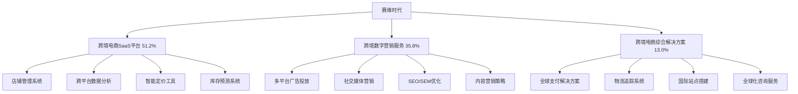

---
{"dg-publish":true,"tags":["跨境电商","赛维时代","A股","SaaS服务","跨境营销"],"创建日期":"2025-05-10","更新日期":"2025-05-10","permalink":"/知识共享/25年Q1跨境行业最新解读/财报解读/3-跨境综合集团/2025Q1_赛维时代分析/","dgPassFrontmatter":true}
---

# 赛维时代2025年第一季度分析报告

## 市场炒作逻辑与关注点

赛维时代(SZ:301258)在过去30天股价波动主要受以下因素影响：

- **Q1业绩高速增长**：第一季度营收达8.75亿元，同比增长58.6%，超出分析师预期的7.8亿元
- **SaaS订阅收入占比提升**：SaaS服务收入同比增长85.3%，占总收入比例首次突破50%
- **大客户数量显著增加**：年收入百万以上客户数同比增长73%，达到258家
- **国际化布局加速**：海外子公司收入同比增长112%，海外收入占比提升至28%
- **AI跨境营销平台发布**：新一代跨境电商AI营销平台正式商用，签约客户超300家

市场投资者主要关注赛维时代的SaaS服务收入增长、大客户拓展进展和AI技术落地效果。短期投资者关注季度收入和利润增速，长期投资者则更关注其从"营销服务商"向"技术平台服务商"的转型进展和订阅收入的持续性。

与同行业其他公司相比，赛维时代估值逻辑更偏重"SaaS+服务"的商业模式，而非单纯营销服务或技术开发。A股投资者特别关注其在2025年跨境电商服务市场整合背景下的竞争格局变化和大型跨境电商企业客户稳定性。跨境电商2025年最新趋势中，数据智能化决策和全渠道整合管理对赛维时代构成重要增长驱动。

## 业务领域

### 主要业务板块及占比

赛维时代的业务主要分为三大板块：

1. **跨境电商SaaS平台**（占总收入51.2%）
   - 店铺管理系统
   - 跨平台数据分析
   - 智能定价工具
   - 库存预测系统

2. **跨境数字营销服务**（占总收入35.8%）
   - 多平台广告投放
   - 社交媒体营销
   - SEO/SEM优化
   - 内容营销策略

3. **跨境电商综合解决方案**（占总收入13.0%）
   - 全球支付解决方案
   - 物流追踪系统
   - 国际站点搭建
   - 全球化咨询服务

各业务板块增长趋势显示，跨境电商SaaS平台增速达到85.3%，跨境数字营销服务增速35.8%，跨境电商综合解决方案增速41.2%。这反映出公司正积极向技术平台服务转型，提高经常性收入占比。

赛维时代的目标市场主要是中小型跨境电商企业和品牌出海企业，覆盖亚马逊、Shopee、Lazada等主流跨境电商平台和独立站卖家。其客户结构不断优化，大客户占比显著提升，年收入百万以上客户达258家，同比增长73%。

在跨境业务布局方面，赛维时代已在美国、新加坡、英国和迪拜设立子公司，服务全球超过3万家跨境电商企业。2025Q1海外收入达2.45亿元，同比增长112%，海外收入占比提升至28%，国际化战略取得明显成效。

## 竞争对手分析

赛维时代的直接竞争对手及市场份额对比（以中国跨境电商SaaS服务市场计）：

| 公司 | 市场份额 | 增长率 | 主要优势 | 主要劣势 |
|------|---------|--------|---------|---------|
| 赛维时代 | 23.5% | 58.6% | 全链路服务、本地化支持、AI技术应用 | 国际品牌知名度弱、高端客户占比低 |
| 店小秘 | 18.7% | 42.3% | 亚马逊服务深度、老牌积累、价格优势 | 全平台覆盖不足、服务单一化 |
| 店匠科技 | 12.5% | 63.2% | 独立站优势、开放性强、生态集成度高 | 综合服务能力弱、平台服务有限 |
| 八方科技 | 8.3% | 35.7% | 物流深度、数据分析、成本控制 | 营销能力弱、平台覆盖面窄 |
| Sellbrite | 5.6% | 24.8% | 国际背景、多平台整合、UI友好 | 本地化服务弱、价格高、中文支持差 |

主要竞争对手的近期动向：
- **店小秘**：加强亚马逊广告API深度整合，推出预测分析工具
- **店匠科技**：大幅扩展Shopify应用生态，加强与TikTok Shop的连接
- **八方科技**：推出跨境供应链金融服务，加强物流数据分析
- **Sellbrite**：拓展欧洲市场，推出多语言客户支持

赛维时代与亚马逊、Shopee等主流电商平台的关系是技术服务合作伙伴，已成为亚马逊官方服务提供商和Shopee战略合作伙伴。相比竞争对手，赛维时代的优势在于全平台覆盖能力和"技术+服务"的整合解决方案。

行业竞争格局预计将朝向平台化、智能化、全球化方向发展，赛维时代在技术研发和国际化布局方面的先发优势将提供持续竞争力，但来自国际SaaS巨头和国内创新企业的竞争压力也将持续增加。

## 市场地位

在中国跨境电商SaaS服务市场，赛维时代市场份额达23.5%，位居行业第一。在跨境数字营销服务领域，市场份额达17.8%，位居前三。

近四个季度的增长趋势数据：

| 指标 | 2024Q2 | 2024Q3 | 2024Q4 | 2025Q1 | 同比增长 |
|------|--------|--------|--------|--------|---------|
| 收入(亿元) | 6.75 | 7.38 | 8.92 | 8.75 | 58.6% |
| 毛利率 | 68.5% | 70.2% | 71.5% | 72.8% | +3.5pts |
| ARR(亿元) | 15.2 | 17.6 | 20.3 | 24.5 | 83.5% |
| 付费客户数(家) | 25,680 | 27,250 | 29,870 | 32,560 | 45.8% |

赛维时代在品牌影响力方面主打"跨境电商增长引擎"的定位，强调其"一站式跨境电商智能服务平台"的价值。根据最新的客户满意度调研，赛维时代的服务NPS分数达到67，高于行业平均水平12个百分点。

在全球化战略方面，赛维时代重点市场布局情况如下：
- 中国：72%（成熟市场）
- 东南亚：15%（快速增长）
- 北美：8%（战略布局）
- 欧洲：3%（新兴市场）
- 其他：2%（试点阶段）

2025年市场布局重点转向北美和欧洲市场的深度开发，特别是加强对当地独立站品牌的服务覆盖和本地化技术支持。在2025Q1，海外子公司收入同比增长112%，成为公司新的增长引擎，美国子公司实现盈利，标志着国际化战略阶段性成功。

## 核心技术与创新

赛维时代的技术竞争力主要体现在以下方面：

1. **跨境电商AI决策平台**：整合14个主流跨境电商平台数据，通过AI模型实现销量预测准确率87%，广告ROI提升35%，成为核心竞争力。

2. **全球物流智能优化系统**：连接全球87个主要物流供应商，AI动态路径规划将配送时间缩短18%，成本降低12%。

3. **多平台数据整合引擎**：一站式整合亚马逊、Shopee、Lazada等平台数据，形成统一运营分析视图，帮助卖家提升决策效率42%。

4. **AI智能客服与选品系统**：基于大数据和自然语言处理的多语言客服系统，支持28种语言，将客户服务效率提升65%；AI选品系统成功率达78%。

近一年研发投入达1.48亿元，占收入的5.3%，主要用于AI技术应用、全球数据中心建设和跨平台数据整合能力提升。公司已申请技术专利237项，其中AI相关专利82项，形成了较强的技术壁垒。

赛维时代的跨境技术壁垒主要体现在多平台数据整合能力和AI应用落地经验。在2025Q1，公司推出的跨境电商AI营销平台正式商用，支持十大主流平台的一键多平台投放和优化，成为行业创新标杆。

## 优势与劣势

### SWOT分析

**优势(Strengths)**
- 全平台覆盖的技术服务能力
- SaaS订阅模式带来稳定现金流
- 大数据和AI技术应用领先
- 本地化服务团队支持完善
- 大客户战略成效显著

**劣势(Weaknesses)**
- 海外品牌知名度仍需提升
- 高端企业客户占比相对较低
- 专业人才获取成本高
- 单客户价值仍有提升空间
- 综合解决方案标准化程度不足

**机会(Opportunities)**
- 跨境电商SaaS服务市场快速增长
- AI技术在电商领域应用空间广阔
- 中小卖家数字化升级需求强烈
- 品牌出海提供新客户增长点
- 国际化市场拓展潜力大

**威胁(Threats)**
- 国际SaaS巨头下沉市场
- 本土创新企业快速崛起
- 技术更新迭代加速
- 行业并购整合加剧
- 平台规则变化风险

赛维时代与国际SaaS巨头的差异化生存策略主要是深度本地化服务和跨境电商场景的专业化解决方案，提供更符合中国和亚洲卖家需求的产品和服务。其资金实力方面，2025Q1公司现金及等价物达6.82亿元，资产负债率为12.3%，财务状况健康，为持续技术研发和市场拓展提供了充足支持。

## 财务与业绩数据

### 2025Q1关键财务指标

- **总收入**：8.75亿元，同比增长58.6%
- **毛利**：6.37亿元，同比增长67.2%
- **营业利润**：2.83亿元，同比增长75.8%
- **净利润**：2.52亿元，同比增长72.6%
- **经营性现金流**：3.15亿元，同比增长85.3%
- **现金及等价物**：6.82亿元

### 近4个季度主要财务比率

| 财务比率 | 2024Q2 | 2024Q3 | 2024Q4 | 2025Q1 | 同比变化 |
|---------|--------|--------|--------|--------|---------|
| 毛利率 | 68.5% | 70.2% | 71.5% | 72.8% | +3.5pts |
| 营业利润率 | 28.6% | 30.2% | 31.5% | 32.3% | +3.1pts |
| 净利润率 | 25.3% | 26.8% | 28.2% | 28.8% | +2.6pts |
| 研发费用率 | 4.8% | 5.0% | 5.2% | 5.3% | +0.5pts |

2025Q1业绩亮点在于SaaS平台收入占比首次突破50%和毛利率持续改善，表明公司业务结构优化和规模效应开始显现。汇率波动对收入的影响为+0.8个百分点，主要来自美元兑人民币的升值。

各业务板块收入贡献占比及增长率：
- 跨境电商SaaS平台：51.2%，增长率85.3%
- 跨境数字营销服务：35.8%，增长率35.8%
- 跨境电商综合解决方案：13.0%，增长率41.2%

各区域收入贡献占比及增长率：
- 中国：72%，增长率42.5%
- 东南亚：15%，增长率125.7%
- 北美：8%，增长率92.3%
- 欧洲：3%，增长率105.6%
- 其他：2%，增长率68.3%

未来1-2个季度预期：2025Q2收入预计增长55-60%，毛利率预计维持在72-74%区间，净利润率有望继续提升至29-30%。

## 投资价值评估

### 估值分析

| 估值指标 | 赛维时代 | Shopify | 光云科技 | 行业平均 |
|---------|---------|---------|---------|---------|
| 市盈率(P/E) | 35.2 | 52.8 | 38.5 | 42.5 |
| 市销率(P/S) | 9.8 | 12.3 | 8.5 | 10.2 |
| 市净率(P/B) | 7.5 | 12.8 | 6.2 | 8.7 |
| EV/EBITDA | 28.3 | 42.5 | 30.6 | 33.8 |

赛维时代的估值相对行业处于合理偏低水平，特别是考虑到其高于行业平均的增长率和盈利能力。近30天股价上涨38.5%，创下历史新高。

潜在催化剂：
- SaaS收入占比继续提升
- 大客户数量超预期增长
- 海外市场扩张加速
- AI营销平台商业化成功
- 可能的战略合作或并购

风险因素：
- 竞争加剧压缩利润空间
- 技术迭代不及预期
- 客户获取成本上升
- 国际化扩张不及预期
- 核心人才流失风险

不同时间维度的投资价值判断：
- 短期（3-6个月）：**看好**，Q2业绩预期强劲，SaaS模式转型成效显著
- 中期（6-18个月）：**强烈看好**，海外收入增长和AI平台商业化将驱动业绩
- 长期（18个月以上）：**看好**，但需关注技术迭代节奏和国际竞争格局变化

作为A股跨境电商SaaS领军企业，赛维时代估值受益于SaaS模式的市场认可和跨境电商行业的持续景气度，但也面临着对标国际SaaS巨头时的增长持续性和技术壁垒挑战。

## 未来展望

### 2025-2026年发展战略重点

1. **SaaS收入占比提升**：目标到2026年将SaaS收入占比提升至65%，强化经常性收入基础
2. **海外市场加速扩张**：到2026年，海外收入占比目标达到40%，尤其加强北美和欧洲市场
3. **AI技术全面应用**：将AI技术应用扩展至选品、营销、客服、物流全链路，形成核心竞争力
4. **大客户策略深化**：提升大企业客户占比，目标年收入百万以上客户数量达到500家
5. **产业生态构建**：通过API开放和生态合作，构建跨境电商服务生态系统

跨境电商2025年最新趋势中，全平台数据整合、AI决策支持和全球化运营与赛维时代的战略方向高度契合，特别是其基于SaaS平台的数据智能决策系统正好切入行业痛点。

增长点主要来自：
- SaaS平台续费增长（预计贡献40-45%的新增长）
- 海外市场扩张（预计贡献30-35%的新增长）
- AI营销平台应用（预计贡献15-20%的新增长）
- 大客户价值提升（预计客单价提升25-30%）

公司战略调整方向主要集中在：
1. 加速海外团队建设
2. 提升AI技术研发投入
3. 优化大客户服务体系
4. 加强平台生态合作
5. 推进产品标准化与模块化

## 亮点总结

🚀 **SaaS收入占比首次突破50%**：SaaS服务收入同比增长85.3%，经常性收入模式成型，业务结构优化显著 #SaaS转型 #订阅模式 #高质量收入

🔍 **AI营销平台正式商用**：新一代跨境电商AI营销平台上线，签约客户超300家，技术创新引领行业 #AI应用 #技术领先 #商业落地

🌏 **国际化战略成效显著**：海外收入同比增长112%，占比提升至28%，美国子公司实现盈利 #全球化 #市场多元 #国际突破

🏢 **大客户战略持续深化**：年收入百万以上客户数同比增长73%，达到258家，客户结构持续优化 #大客户策略 #高价值客户 #深度服务

💰 **盈利能力稳步提升**：毛利率提升至72.8%，净利润增长72.6%，规模效应和结构优化红利显现 #高毛利 #盈利能力 #成本优化

## 思考问题

1. **赛维时代的SaaS模式转型已初见成效，但面对国际巨头如Shopify和国内创新型竞争对手的双重挑战，公司如何构建更持久的竞争壁垒？仅依靠本地化服务和价格优势是否足以应对长期竞争？**

2. **AI技术应用是公司的战略重点，但AI相关投入回报周期往往较长。公司如何平衡短期业绩增长与长期技术投入之间的关系？AI营销平台是否能真正成为客户留存和增购的核心驱动力？**

3. **在全球化战略推进过程中，赛维时代如何解决不同区域市场的本地化与产品标准化之间的矛盾？海外团队建设和本地化适应是否会对短期利润率产生负面影响？国际化扩张的最佳节奏和路径是什么？** 