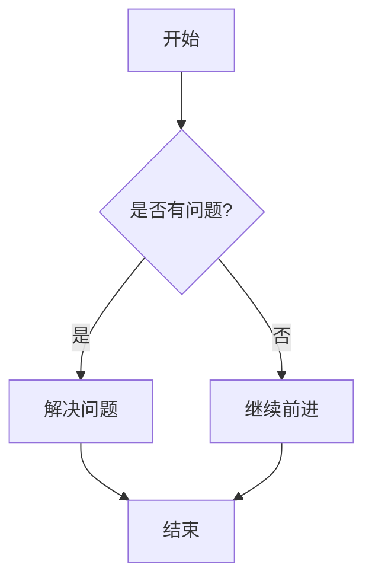
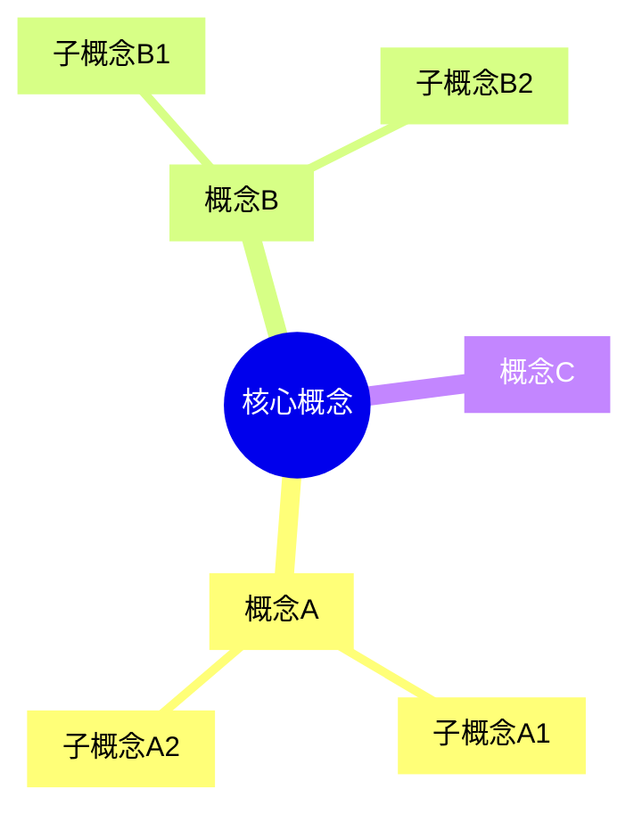
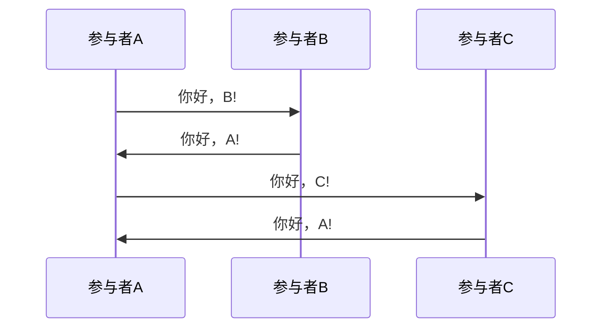
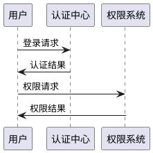
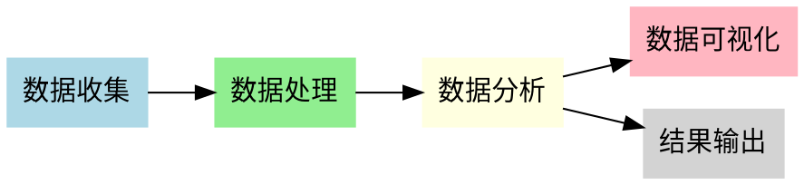
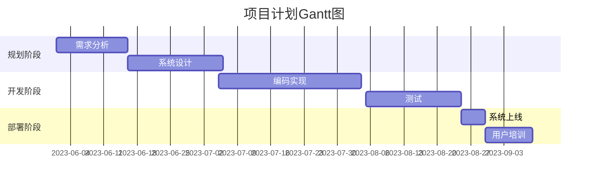
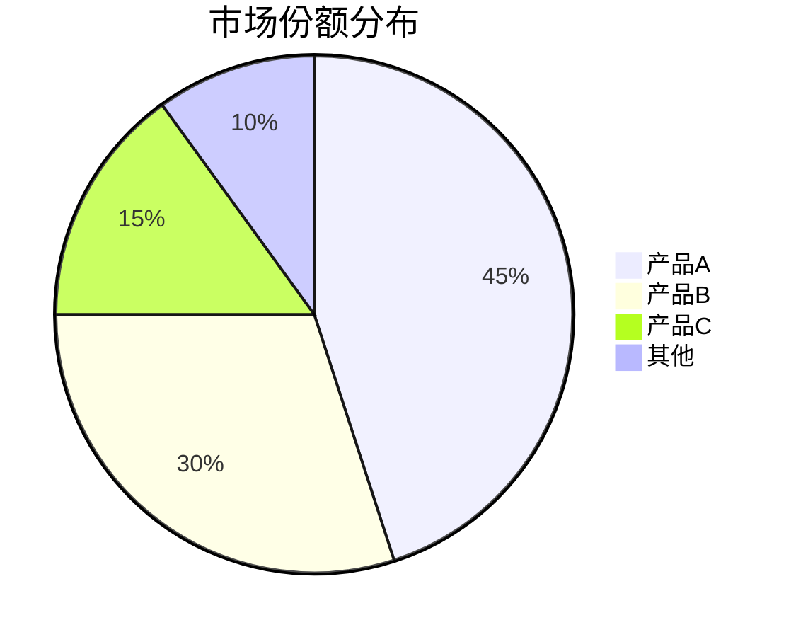
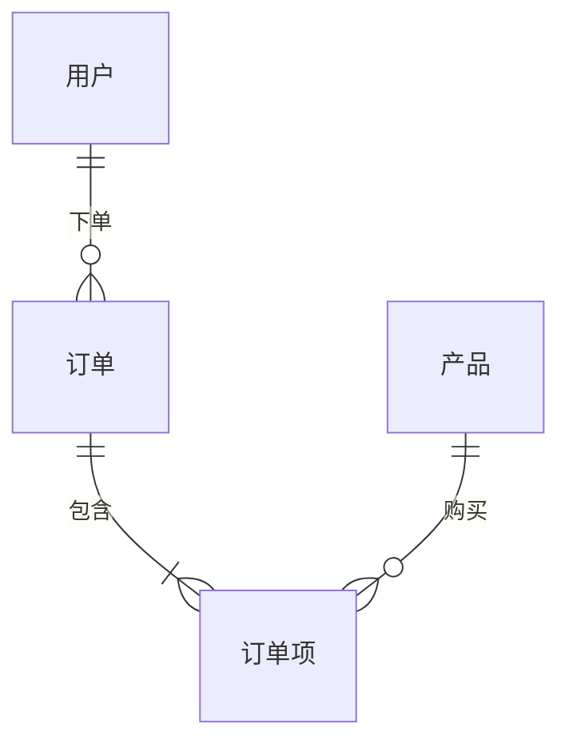

---
{"dg-publish":true,"更新日期":"2024-04-26","permalink":"/知识共享/Markdown图表展示/","dgPassFrontmatter":true}
---
# 

这个页面展示了Markdown中各种图表的渲染效果，可以作为图表语法参考。

## 1. Mermaid图表

### 流程图


### 思维导图


### 时序图


## 2. PlantUML

需要PlantUML插件支持。



## 3. Graphviz (Dot)

需要Graphviz插件支持。



## 4. Vega/Vega-Lite

需要Vega插件支持。

```vega
{
  "$schema": "https://vega.github.io/schema/vega-lite/v5.json",
  "description": "简单柱状图",
  "data": {
    "values": [
      {"类别": "A", "数值": 28},
      {"类别": "B", "数值": 55},
      {"类别": "C", "数值": 43},
      {"类别": "D", "数值": 91},
      {"类别": "E", "数值": 81},
      {"类别": "F", "数值": 53}
    ]
  },
  "mark": "bar",
  "encoding": {
    "x": {"field": "类别", "type": "nominal"},
    "y": {"field": "数值", "type": "quantitative"}
  }
}
```

## 5. ASCII艺术图

```
+-------------+         +--------------+
|   模块 A    |-------->|    模块 B    |
+-------------+         +--------------+
       |                        |
       |                        |
       v                        v
+-------------+         +--------------+
|   模块 C    |<--------|    模块 D    |
+-------------+         +--------------+
```

## 6. MathJax/LaTeX

### 行内公式: $E = mc^2$

### 块级公式:
$$
\frac{d}{dx}\left( \int_{a}^{x} f(u)\,du\right)=f(x)
$$

$$
\begin{bmatrix}
a & b & c \\
d & e & f \\
g & h & i
\end{bmatrix}
$$

## 7. Chart.js

需要Chart.js插件支持。

```chart
type: bar
labels: [一季度, 二季度, 三季度, 四季度]
series:
  - title: 收入
    data: [500, 650, 750, 800]
  - title: 支出
    data: [400, 500, 650, 700]
options:
  title:
    display: true
    text: 年度财务状况
```

## 8. Gantt图表

通过Mermaid实现:



## 9. 饼图 (使用Mermaid)



## 10. Er图 (实体关系图)



---

注意：某些图表类型可能需要Obsidian相关插件支持才能正常渲染。如果图表未能正确显示，请检查是否需要安装相应的插件。 