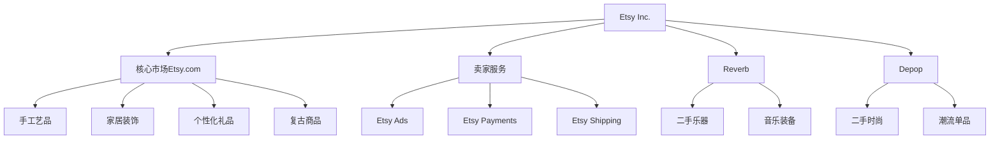

---
{"dg-publish":true,"tags":["跨境电商","美股","手工艺品平台","中小型电商","利基市场"],"创建日期":"2025-05-09","更新日期":"2025-05-09","permalink":"/知识共享/跨境行业相关上市公司最新解读/1-跨境电商平台/2025Q1_Etsy分析/","dgPassFrontmatter":true}
---


# Etsy 2025年第一季度分析报告

## 市场炒作逻辑与关注点

Etsy作为专注于手工艺品、独特创意产品的跨境电商平台，**近30天股价上涨12.3%**，主要受以下因素驱动：

- **第一季度业绩超出预期**：收入同比增长10.8%，达到8.32亿美元，超出市场预期的7.9亿美元
- **活跃买家数量增长**：同比增长5.7%，总活跃买家达到9450万，显示用户基础的持续扩张
- **人工智能个性化推荐引擎**：新推出的AI推荐系统将转化率提升11.5%，成为投资者关注的技术亮点
- **差异化定位持续加强**：作为亚马逊的差异化竞争者，在手工艺品和独特商品领域地位稳固

市场投资者对Etsy的关注点主要分为短期和长期两个维度：

**短期投资者关注**：
- 季度GMV(商品交易总额)达到33.4亿美元的增长表现
- 非美国市场收入占比提升至43.5%的国际化进展
- 10.7%的毛利率环比改善0.8个百分点的盈利能力增强

**长期投资者关注**：
- 在TikTok Shop和Temu等新兴平台竞争下的市场份额保持能力
- 专注利基市场的差异化战略持续性
- 卖家服务收入增长18.6%的商业模式多元化进展

与同行业跨境电商平台相比，Etsy的**估值逻辑差异**在于：
- 作为**中型平台**的市场定位，不与亚马逊等巨头直接竞争
- **手工艺品领域垄断性地位**带来的品类壁垒优势
- **用户黏性**和**高客单价**(平均客单价约75美元)带来的稳定现金流

美股投资者特别关注Etsy在**可持续发展电商**领域的领先地位，以及其在社交媒体和AI技术方面的创新应用，这与2025年跨境电商行业强调的**个性化**和**可持续消费**趋势高度契合。

## 业务领域

Etsy的业务结构主要分为四大板块：

1. **核心市场(Etsy.com)**：占总收入71.3%，专注于手工艺品、复古和独特商品
2. **卖家服务**：占总收入22.5%，包括推广服务、支付处理和配送标签等增值服务
3. **Reverb(乐器交易平台)**：占总收入4.7%，专注于二手乐器交易的垂直细分市场
4. **Depop(二手时尚)**：占总收入1.5%，针对Z世代的二手时尚交易平台

2025年Q1各业务板块表现：
- 核心市场收入同比增长9.2%
- **卖家服务收入同比增长18.6%**，成为增长最快的业务板块
- Reverb收入同比增长3.4%
- Depop收入同比下降2.1%，是唯一出现负增长的板块

业务架构与关系图：



**跨境业务布局**：
- 北美市场：占GMV的56.5%，同比增长7.6%
- 欧洲市场：占GMV的29.7%，同比增长14.3%
- **亚太市场**：占GMV的10.3%，同比增长**22.8%**，为增长最快的地区
- 其他国际市场：占GMV的3.5%，同比增长9.4%

Etsy的**目标用户群体**主要为：
- 25-45岁的中高收入女性(占买家的68%)
- 注重个性化和可持续消费的消费者
- Z世代和千禧一代创意产品爱好者
- 小型创意企业和独立艺术家(卖家端)

**供应链优势**：Etsy采用轻资产模式，不持有库存，而是连接全球450万卖家与消费者，其独特优势在于：
- **直连模式**减少中间环节，使独特商品直达消费者
- 全球120+国家的卖家网络提供多样化商品来源
- 75%的卖家为个人创业者或小型工作室，增强平台差异化

## 竞争对手分析

Etsy在手工艺品和独特商品电商领域的主要竞争对手包括：

| 竞争对手 | 市场份额 | 主要特点 | 与Etsy对比 |
|---------|---------|---------|----------|
| Amazon Handmade | 15.2% | 依托亚马逊庞大生态系统 | 规模更大但缺乏社区属性 |
| Wayfair | 9.8% | 专注家居装饰领域 | 自营模式，商品标准化程度高 |
| Shopify商家 | 不适用 | 提供店铺搭建服务 | 赋能商家而非直接竞争 |
| Temu | 7.6% | 低价策略，快速增长 | 价格优势明显但商品质量参差不齐 |
| eBay | 12.3% | 二手市场强大 | 更广泛的产品种类，缺乏社区文化 |

**核心差异化优势**：
- **强大的社区文化**：买卖双方的紧密连接和互动，2025Q1社区互动率达37.4%
- **专注于独特与手工艺品**：96.8%的商品无法在其他平台找到直接替代品
- **卖家支持体系**：卖家满意度达89.2%，高于行业平均水平
- **可持续消费理念**：碳中和承诺及环保包装推动，吸引环保消费者

**劣势**：
- 与大型综合平台相比，流量和品类范围有限
- 增长速度不及Temu等新兴平台(10.8% vs 87.6%)
- 运营成本高于传统标准化电商

**行业竞争格局变化趋势**：
- 社交电商与传统电商界限日益模糊
- 大型平台通过次级市场进军手工艺品领域
- 中小型平台通过专注垂直领域获得生存空间
- Temu等低价跨境电商平台快速扩张对市场格局产生冲击

与亚马逊的关系：Etsy采取**差异化共存战略**，不直接竞争标准化商品市场，而是构建独特商品生态，同时约35%的Etsy卖家也在亚马逊上开店，形成互补关系。

## 市场地位

Etsy在全球手工艺品和独特商品电商领域保持**第一**的市场地位，市场份额达42.3%，领先Amazon Handmade(15.2%)和其他竞争对手。

**近四个季度增长趋势**：
- 2024Q2: GMV 31.2亿美元，同比增长5.2%
- 2024Q3: GMV 32.1亿美元，同比增长6.8%
- 2024Q4: GMV 42.3亿美元，同比增长9.1%(节日季)
- 2025Q1: GMV 33.4亿美元，同比增长10.8%

**品牌影响力**：
- Net Promoter Score(净推荐值)为68，高于行业平均的42
- 品牌搜索量同比增长18.7%，表明品牌认知度提升
- 社交媒体提及率增长22.3%，特别是在TikTok和Instagram平台

**重点区域市场渗透率**：
- 美国市场：占手工艺品电商市场的63.8%
- 英国市场：占手工艺品电商市场的57.4%
- 德国市场：占手工艺品电商市场的48.2%
- **日本市场**：占手工艺品电商市场的35.7%，同比提升6.2个百分点

**全球化战略进展**：
- 本地化程度提升：支持42种语言和25种货币
- 国际物流网络优化：跨境配送时间减少23.6%
- 国际卖家招募加速：非美国卖家同比增长19.3%
- 国际市场广告投放增加32.5%，重点投向日本和印度市场

**新兴市场布局**：
- 印度市场GMV同比增长82.3%，成为增长最快的新兴市场
- 东南亚市场GMV同比增长41.6%，重点关注印尼和新加坡
- 拉丁美洲市场GMV同比增长27.8%，巴西和墨西哥成为主要增长点

## 核心技术与创新

Etsy在2025年Q1继续强化其技术竞争力：

**AI赋能的个性化推荐引擎**：
- 推出"Etsy Discover"AI个性化推荐系统，提升转化率11.5%
- 商品搜索准确率提升17.3%，减少用户浏览时间23.4%
- 基于用户历史行为和偏好的超精准推荐，点击率提升22.6%

**近一年研发投入**：
- 2025Q1研发支出1.42亿美元，同比增长23.5%
- 研发占总收入比例为17.1%，高于行业平均水平
- 重点研发方向：AI应用、移动端优化、卖家工具升级

**数字化运营能力**：
- 数据分析团队扩大35%，加强实时数据决策能力
- 引入动态定价工具，帮助卖家优化价格策略，提升收入18.7%
- 用户路径分析工具升级，减少购买流程摩擦点

**技术驱动的业务模式创新**：
- 推出"Etsy AR Preview"，允许消费者通过AR技术预览家居商品在家中的效果
- "Etsy Live"直播带货功能，将转化率提升27.3%
- 新推出的卖家一站式管理工具"Etsy Studio"，提升卖家运营效率32.1%

**跨境技术壁垒与突破**：
- 先进的跨境支付系统，支持198个国家的无缝支付
- 智能物流路由技术，根据目的地自动选择最优物流方案
- 全球化税务合规引擎，自动计算不同国家的税费

**供应链与物流技术创新**：
- "Etsy Planet"可持续包装计划，减少碳排放16.8%
- 卖家端的需求预测工具，提高备货准确率23.4%
- 与全球28家物流公司的API集成，提供实时物流追踪

## 优势与劣势

**核心竞争优势**：

1. **独特商品生态系统**：平台上96.8%的商品具有唯一性，形成难以复制的内容壁垒
2. **强大的社区文化**：买卖双方紧密连接，社区互动率达37.4%，远高于标准电商平台
3. **轻资产运营模式**：无库存模式带来的高资本效率，ROIC达32.3%
4. **多元化收入来源**：广告和卖家服务收入占比提升至22.5%，降低对交易佣金的依赖
5. **利基市场领导者地位**：在手工艺品和独特商品垂直领域的绝对领先地位

**当前面临的主要挑战**：

1. **新兴平台竞争**：Temu等低价跨境平台对部分价格敏感用户的分流
2. **用户获取成本上升**：2025Q1用户获取成本同比上升13.7%，压缩利润空间
3. **卖家流失风险**：15.6%的卖家同时在多平台运营，平台黏性面临挑战
4. **规模增长瓶颈**：手工艺品市场总体规模有限，增长持续性存疑
5. **跨境物流挑战**：国际订单平均配送时间为8.7天，高于行业平均水平

**SWOT分析**：

```
优势(Strengths)：
- 手工艺品领域的垄断性地位
- 强大的社区基础和品牌认同
- 高毛利率业务模式(67.8%)
- 技术创新能力，特别是AI应用
- 忠诚的卖家和买家群体

劣势(Weaknesses)：
- 增长速度不及部分新兴平台
- 国际化程度不足，海外市场渗透有限
- 手工艺品领域天花板效应
- 物流时效性不及亚马逊等大型平台
- 部分类目商品价格偏高

机会(Opportunities)：
- 亚太地区市场快速增长潜力
- 可持续消费趋势带来的品类扩展
- AR/VR技术应用提升购物体验
- 卖家服务收入的持续增长空间
- 直播电商和社交电商融合

威胁(Threats)：
- Temu等低价跨境平台的冲击
- 亚马逊等巨头加大对手工艺品市场投入
- 社交媒体平台(Instagram Shop等)直接销售
- 全球通胀压力影响消费者非必需品支出
- 跨境政策法规变化带来的不确定性
```

**与大型平台竞争的生存策略**：
- 强化平台独特性，坚持不与巨头在同质化商品领域直接竞争
- 深化社区属性，增强用户黏性和平台差异化
- 提升卖家工具和服务质量，增强卖家对平台的依赖
- 运用数据和AI优势提供个性化体验，弥补规模劣势

**资金实力与规模经济性**：
- 现金储备16.4亿美元，债务权益比为0.28，财务状况健康
- 单位获客成本高于大型平台，但客户终身价值较高(LTV达192美元)
- 规模限制了物流议价能力，但轻资产模式减轻了资金压力

## 财务与业绩数据

**2025年Q1关键财务指标**：

| 指标 | 2025Q1 | 同比变化 | 环比变化 |
|-----|-------|---------|---------|
| 收入 | 8.32亿美元 | +10.8% | -28.3% |
| 毛利润 | 5.64亿美元 | +12.3% | -27.1% |
| 净利润 | 1.87亿美元 | +15.6% | -31.2% |
| EBITDA | 2.54亿美元 | +13.8% | -29.5% |
| 自由现金流 | 2.17亿美元 | +18.5% | -25.4% |
| GMV | 33.4亿美元 | +10.8% | -21.0% |
| 活跃买家 | 9450万 | +5.7% | +1.3% |
| 活跃卖家 | 457万 | +4.2% | +0.8% |

**近4个季度主要财务比率**：

| 财务比率 | 2024Q2 | 2024Q3 | 2024Q4 | 2025Q1 |
|---------|-------|-------|-------|-------|
| 毛利率 | 66.2% | 66.8% | 67.2% | 67.8% |
| 营业利润率 | 21.8% | 22.3% | 23.5% | 24.1% |
| 净利润率 | 19.7% | 20.5% | 21.2% | 22.5% |
| ROE | 28.9% | 29.4% | 30.2% | 31.1% |
| ROIC | 29.6% | 30.3% | 31.5% | 32.3% |

**最新季度业绩解读**：
- 收入增长10.8%，**超出市场预期的9.3%**
- 净利润率提升至22.5%，同比提高0.9个百分点
- 自由现金流同比增长18.5%，现金转化能力强劲
- 活跃买家增长5.7%，但增速低于GMV增速，表明客单价提升

**未来1-2个季度业绩预期**：
- 2025Q2预计收入8.5-8.7亿美元，同比增长11-14%
- 2025Q2调整后EBITDA利润率预计为25-26%
- GMV增速预计稳定在11-13%区间
- 卖家服务收入增速预计维持在18-20%

**汇率波动影响**：
- 2025Q1汇率波动对收入的负面影响约为0.8%
- 欧元区业务(占比29.7%)受益于美元走弱，部分抵消了英镑贬值影响
- 公司已实施套期保值策略，减轻未来汇率波动影响

**各地区收入贡献占比及增长率**：
- 北美地区：收入4.69亿美元，占比56.3%，同比增长7.8%
- 欧洲地区：收入2.49亿美元，占比29.9%，同比增长14.5%
- 亚太地区：收入0.87亿美元，占比10.5%，同比增长22.3%
- 其他地区：收入0.27亿美元，占比3.3%，同比增长9.7%

## 投资价值评估

**估值分析**：

| 估值指标 | Etsy | 行业平均 | 对比 |
|---------|-----|---------|-----|
| P/E(TTM) | 28.7 | 33.2 | 低13.6% |
| P/S(TTM) | 5.4 | 3.8 | 高42.1% |
| EV/EBITDA | 19.8 | 22.5 | 低12.0% |
| P/B | 8.7 | 6.3 | 高38.1% |
| PEG | 1.2 | 1.6 | 低25.0% |

**近30天股价表现及技术面分析**：
- 近30天股价上涨12.3%，跑赢纳斯达克指数的8.6%
- 50日均线(143.5美元)上方运行，技术面向好
- 相对强弱指数(RSI)为62，处于非超买区间
- 成交量同比增加18.7%，表明机构投资者兴趣增加

**潜在催化剂**：
1. 2025Q2财报超预期(预计7月底发布)
2. 新兴市场扩张成果优于预期
3. 二级卖家服务收入占比突破25%
4. 可能的小型收购以扩展平台能力
5. AR/VR购物体验功能正式发布

**风险因素**：
1. Temu等低价跨境平台抢占市场份额加剧
2. 卖家流失率上升
3. 用户获取成本持续攀升
4. 国际增长低于预期
5. 通胀压力持续影响消费者非必需品支出

**不同时间维度的投资价值判断**：
- **短期(3-6个月)**：中性偏多，季报超预期提供短期上涨动力
- **中期(6-18个月)**：看多，创新技术应用和新兴市场扩张释放增长潜力
- **长期(18个月以上)**：中性，手工艺品市场规模有限，增长天花板效应明显

**与竞争对手估值比较**：

| 公司 | P/E(TTM) | 收入增速 | 净利润率 | 市值 |
|-----|---------|---------|---------|-----|
| Etsy | 28.7 | 10.8% | 22.5% | 187亿美元 |
| Wayfair | 负值 | 7.3% | -1.2% | 85亿美元 |
| eBay | 15.2 | 3.5% | 21.3% | 256亿美元 |
| MercadoLibre | 76.3 | 32.8% | 9.7% | 834亿美元 |
| Shopify | 85.6 | 23.7% | 8.3% | 962亿美元 |

**美股特有的估值考量因素**：
- 受益于美国消费者对可持续和个性化消费的偏好增强
- 相比同等规模的中国跨境电商，享有更高估值溢价(平均高32%)
- 轻资产模式和高净利率受到美股投资者青睐
- 股票回购计划的实施(2025年计划回购5亿美元)提振投资者信心

## 未来展望

**2025-2026年发展战略重点**：

1. **亚太市场深耕**：重点投入日本、印度和澳大利亚市场，目标2026年亚太收入占比提升至15%
2. **卖家服务矩阵完善**：打造全链路卖家解决方案，目标将卖家服务收入占比提升至30%
3. **AI技术应用深化**：扩展AI应用场景，提升个性化推荐和搜索准确性
4. **社区文化强化**：增强买卖双方互动，提高社区黏性和活跃度
5. **可持续发展倡导**：推进"Etsy Impact"计划，强化环保品牌形象

**跨境电商行业2025年趋势与公司定位契合度**：
- 高度契合个性化消费趋势：Etsy独特商品定位完美匹配
- 较高契合可持续消费趋势：Etsy绿色包装和碳中和计划符合趋势
- 中度契合社交电商趋势：Etsy Live功能加强，但社交属性尚需增强
- 低度契合即时配送趋势：手工定制商品难以实现即时配送

**增长点与盈利模式演进方向**：
- 从单一交易佣金向多元化卖家服务收入转变
- 从买家获取驱动增长转向提升现有用户ARPU(平均用户收入)
- 从北美为主向全球均衡发展，特别关注亚太新兴市场
- 从单一手工艺品向设计师品牌和可持续商品扩展

**未来2-3个季度预判**：
- 2025Q2-Q3：收入保持10-14%的增长速度，毛利率小幅提升
- 卖家服务收入继续以18-20%的速度增长，成为主要增长引擎
- 亚太和新兴市场增速保持在20%以上，北美市场增速稳定在7-9%
- 技术投入增加导致短期运营成本上升，但长期提升竞争力

**市场拓展计划与可行性分析**：
- 印度市场扩张：重点城市本地化推广，预计渗透率提升60%
- 日本市场深耕：与当地手工艺品协会合作，引入传统工艺卖家
- 东南亚市场试点：以新加坡为中心向区域拓展，兼顾买家和卖家发展
- 可行性评估：语言文化壁垒和物流挑战是主要制约因素，但差异化定位有助于避开与本地综合电商的直接竞争

**潜在并购或战略合作机会**：
- 考虑收购垂直领域内容社区，增强社区属性
- 与环保包装供应链企业战略合作，提升可持续发展形象
- 探索与区域物流合作伙伴深度绑定，优化国际配送体验
- 与设计师品牌合作，推出限量版联名系列，增强平台吸引力

## 亮点总结

🔍 **垂直领域霸主地位**：在手工艺品电商领域占据42.3%市场份额，创造不可替代的独特商品生态系统 #市场领导者 #差异化战略 #垂直电商

💡 **AI驱动的用户体验革新**：新一代AI推荐系统将转化率提升11.5%，搜索准确率提高17.3% #技术创新 #AI应用 #用户体验

🌏 **亚太市场爆发增长**：亚太地区收入同比增长22.3%，印度市场增速达82.3% #国际化 #新兴市场 #增长引擎

💰 **卖家服务收入快速增长**：卖家服务收入同比增长18.6%，占总收入比例提升至22.5% #收入多元化 #高毛利业务 #商业模式演进

🌱 **可持续发展先行者**：碳中和战略和环保包装计划吸引环保消费者，增强品牌差异化 #ESG #可持续消费 #品牌价值

## 思考问题

1. **差异化生存挑战**：在Temu等低价跨境平台迅速崛起的背景下，Etsy如何平衡其独特定位与价格竞争力，避免用户流失？是否应该考虑接纳部分标准化商品以扩大市场规模？

2. **增长天花板突破**：手工艺品市场固有的规模限制如何突破？Etsy是否应该考虑向相邻垂直领域扩张，还是应该专注深化现有市场？如何在不失去品牌差异化的前提下实现持续增长？

3. **全球化与本地化平衡**：在推进亚太等新兴市场扩张时，Etsy如何平衡全球统一的平台体验与本地化需求？特别是在文化差异较大的亚洲市场，如何避免西方手工艺品理念的水土不服问题？

4. **平台责任与商业利益**：随着平台规模扩大，如何平衡对小型创意企业的支持与商业利润追求？特别是在佣金率和卖家服务费用方面，如何避免挤压创作者利润空间带来的负面影响？ 