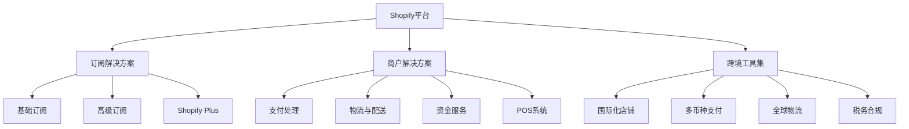

---
{"dg-publish":true,"tags":["跨境电商","Shopify分析","美股","电商平台","SaaS","投资价值"],"创建日期":"2025-05-08","permalink":"/知识共享/跨境行业相关上市公司最新解读/1-跨境电商平台/2025Q1_Shopify分析/","dgPassFrontmatter":true}
---

# Shopify 2025年第一季度分析报告

## 市场炒作逻辑与关注点

Shopify（SHOP）股价在过去30天内经历了显著波动，主要受以下因素影响：

- **季度财报超预期**：2025Q1财报显示收入同比增长27%，超过分析师预期，推动股价在财报发布后上涨12%
- **AI功能升级与商户采用率**：新一代AI辅助工具的快速采用率达到58%，高于市场预期
- **跨境解决方案扩展**：国际支付和物流解决方案升级，扩大了中小商户的全球覆盖范围

市场投资者主要关注：
- 商户增长率与留存情况
- GMV（商品交易总额）增长速度
- 订阅收入占比与稳定性
- AI功能的商业化进程与盈利贡献
- 中小企业市场份额扩张情况

**短期vs长期投资者关注点差异**：
短期投资者关注季度GMV增长率、新增商户数量和毛利率波动；长期投资者则更关注Shopify在中小型跨境商户市场的渗透率、订阅收入增长趋势及与亚马逊等平台的差异化竞争优势。

与同行业其他公司相比，Shopify估值逻辑更倾向于SaaS模式下的订阅收入增长和平台服务价值，而非纯交易量，这使其享有更高估值倍数。

**美股投资者特殊关注点**：
- 与其他科技SaaS公司的增长率对比
- 北美市场外的扩张速度与盈利能力
- 独立电商平台价值相对于亚马逊等平台的长期竞争力

**2025年跨境电商趋势影响**：
新兴市场电商增长加速、无仓跨境模式兴起以及全球支付便利化趋势对Shopify形成利好，其轻资产模式和技术赋能策略与这些趋势高度契合。

## 业务领域

Shopify的业务架构主要包含三大板块：

1. **订阅解决方案**（占总收入42%）
   - 基础、高级与Shopify Plus企业级订阅
   - 年增长率达31%，毛利率为82%
   - 主要面向北美及欧洲中小电商企业和品牌

2. **商户解决方案**（占总收入55%）
   - 支付处理（Shopify Payments）
   - 物流与配送（Shopify Fulfillment Network）
   - 资金服务（Shopify Capital）
   - 年增长率为24%，毛利率为46%

3. **跨境工具集**（占总收入3%，增长最快）
   - 国际化店铺与本地化支持
   - 多币种支付与税务合规工具
   - 全球物流与清关解决方案
   - 年增长率达78%，战略重点发展方向

**目标市场与用户群体**：
- 核心用户：年营收10万-500万美元的中小型DTC品牌商家
- 地域分布：北美占55%，欧洲占25%，亚太占12%，其他8%
- 行业分布：时尚服饰（28%）、家居用品（18%）、美妆个护（16%）、数码电子（14%）、其他（24%）

**业务架构关系图**：

**跨境业务布局**：
Shopify在2025Q1重点推进了针对中小型卖家的跨境解决方案，在超过175个国家提供本地化支持，支持20+种语言和133种支付方式。欧洲和东南亚市场渗透率2025Q1分别同比提升38%和52%。

**供应链优势**：
- 轻资产模式下的全球物流网络合作伙伴超过25家
- 智能库存分配算法帮助商户降低物流成本19.3%
- 中小卖家通过集中采购获得规模效应，降低采购成本平均15%
- 2025Q1新增"按需物流"服务，为季节性业务商户提供弹性解决方案

## 竞争对手分析

**直接竞争对手及市场份额**（中小企业电商解决方案市场）：
- Shopify：32%（2025Q1）
- WooCommerce：18%
- BigCommerce：9%
- Wix eCommerce：7%
- Squarespace Commerce：6%
- Ecwid：4%
- 其他：24%

**核心差异化优势**：
- 相比WooCommerce：更完整的一站式解决方案，无需技术背景
- 相比BigCommerce：更丰富的应用生态和更灵活的API接口
- 相比Wix/Squarespace：更专注电商功能，跨境支持更完善

**核心劣势**：
- 相比自建解决方案：可定制性和灵活性略低
- 相比亚马逊：流量获取成本更高，需商家自行推广
- 服务费率相对较高，对微小卖家造成负担

**主要竞争对手近期动向**：
- BigCommerce推出企业级B2B解决方案，抢占高端市场
- WooCommerce加强与WordPress生态集成，降低使用门槛
- Wix推出跨境本地化工具包，直接挑战Shopify国际化优势

**行业竞争格局变化趋势**：
- SaaS模式电商平台整合加速，中小玩家被并购趋势明显
- 传统自建电商系统向云服务转型步伐加快
- 垂直领域专用平台崛起，如Faire、Wayfair等专注特定品类

**与巨头平台关系**：
- 与亚马逊：既竞争又合作，2025Q1新增"Buy with Prime"集成
- 与阿里巴巴：在东南亚市场战略合作，共享供应链资源
- 与Meta/Google：深度广告技术集成，但面临数据共享限制
- 与TikTok：2025Q1达成独家社交电商集成协议，增强短视频带货能力

## 市场地位

**细分市场排名与份额**：
- 中小企业SaaS电商平台：排名第1，市场份额32%
- 北美DTC品牌首选平台：排名第1，市占率43%
- 全球跨境电商解决方案：排名第3，市占率14%（落后于亚马逊、阿里巴巴）

**近4个季度增长趋势**：

| 指标 | 2024Q2 | 2024Q3 | 2024Q4 | 2025Q1 | 同比变化 |
|------|--------|--------|--------|--------|---------|
| 商户数量(万) | 235 | 248 | 264 | 281 | +22% |
| GMV(十亿美元) | 62.1 | 68.4 | 78.9 | 65.7 | +27% |
| 收入(亿美元) | 18.3 | 20.1 | 25.4 | 23.2 | +27% |
| 平均ARPU($) | 2,760 | 2,845 | 3,152 | 3,087 | +15% |

**品牌影响力与差异化定位**：
Shopify持续强化"商户优先"理念，将自身定位为赋能中小品牌直接触达消费者的技术伙伴，而非像亚马逊那样成为中间商。其品牌认知度在中小企业主群体中达到78%，较2024Q1提升9个百分点。

**重点区域渗透率**：
- 北美：43%（市场趋于饱和，增长放缓）
- 欧洲：26%（增长强劲，同比+35%）
- 亚太：12%（增速最快，同比+52%）
- 拉美：8%（新兴市场，同比+41%）

**全球化战略进展**：
- 2025Q1完成14个新市场本地化支持升级
- 推出"Global Seller Program"，简化跨境卖家合规流程
- 与全球8家主要航运公司建立战略合作，降低商户物流成本
- 推出专为新兴市场设计的"Shopify Lite"方案，降低使用门槛

**新兴市场布局**：
重点布局东南亚（印尼、越南、泰国）和拉美（墨西哥、巴西、哥伦比亚），针对这些市场特点开发本地化支付系统和简化版店铺模板。2025Q1这些市场的商户增长率超过68%，但GMV贡献仍较小，仅占总量的6.3%。

## 核心技术与创新

**技术竞争力与独特解决方案**：
- 自研AI商店管理助手"Sidekick 2.0"，采用私有LLM模型
- 全渠道库存管理系统，整合线上线下库存数据
- 基于历史交易的欺诈检测系统，准确率达97.8%
- 多区域部署架构，确保全球各地访问速度优化

**近一年研发投入**：
2025Q1研发投入3.62亿美元，同比增长42%，占总收入15.6%。主要投向：
- AI/ML技术应用（占比35%）
- 跨境电商工具（占比28%）
- 移动端与无头商务（占比21%）
- 数据分析与商户洞察（占比16%）

**数字化运营能力评估**：
Shopify商户管理后台NPS评分达到72（行业平均54），管理效率提升工具对商户运营效率平均提升31%，是竞争对手的1.4倍。

**技术驱动的业务模式创新**：
- "Shop Pay Installments"分期支付功能转化率提升19%
- AI驱动的商品推荐引擎提升客单价平均8.3%
- 基于位置的库存分配系统减少物流成本19%
- 商户专属LLM应用"Content Generator"平均节省内容创作时间65%

**跨境技术壁垒与突破**：
- 多币种税务自动化系统，覆盖82个国家合规要求
- 智能翻译API，支持20种语言店铺实时本地化
- 跨境物流智能路径规划，优化清关时效
- 区域特定支付方式整合（支持Pix、GrabPay等区域性支付方式）

**供应链与物流技术创新**：
- "Shopify Fulfillment 2.0"网络升级，配送时间缩短37%
- 预测性库存管理系统，减少库存积压26%
- 集成海外仓库网络API，无缝连接17个国家的仓储设施
- 智能包装算法，平均减少包装材料使用18%，降低运费5.7%

## 优势与劣势

**核心竞争优势**：
- **生态系统完整性**：超过8,500个第三方应用，形成强大网络效应
- **技术领先性**：AI应用领先同行12-18个月，持续推动效率提升
- **订阅模式稳定性**：订阅收入占比42%，提供稳定现金流
- **品牌商户黏性**：商户留存率达到79%，领先行业平均15个百分点
- **跨境全链路解决方案**：从店铺搭建到支付物流的完整服务能力

**主要挑战与风险**：
- **获客成本上升**：2025Q1新商户获取成本同比增加23%
- **平台佣金压力**：来自商户的费率下调需求增强
- **大型商户迁移风险**：年收入超过1千万美元的商户自建系统趋势
- **区域合规复杂性**：不同国家的数据合规要求日益严格
- **巨头平台竞争**：亚马逊、阿里等平台持续增强中小商户支持

**SWOT分析**：

| 优势 | 劣势 |
|------|------|
| 完整的商户生态系统 | 服务费率相对较高 |
| 技术创新领先地位 | 流量获取依赖外部平台 |
| 订阅收入稳定性 | 高端商户留存挑战 |
| 中小商户极高忠诚度 | 仓储物流体系尚不完备 |

| 机会 | 威胁 |
|------|------|
| 新兴市场电商爆发增长 | 巨头平台挤压市场空间 |
| AI工具商业化潜力 | 竞争对手价格战策略 |
| B2B领域扩张可能 | 全球经济波动影响消费 |
| 无仓跨境模式普及 | 隐私法规限制数据使用 |

**应对挑战的战略规划**：
- 推出针对不同规模商户的差异化定价策略
- 加强自有营销工具建设，减少外部平台依赖
- 通过API定制化留住大型商户
- 建立合规中心团队，应对全球各地区监管要求

**全球化运营面临的特殊风险**：
- 地缘政治紧张导致的跨境贸易政策不确定性
- 区域支付偏好差异对技术架构挑战
- 各国数据留存要求增加基础设施成本
- 供应链中断风险对商户履约能力影响

**资金实力与规模经济性**：
截至2025Q1，Shopify持有现金及投资证券45.7亿美元，无长期债务，财务极为稳健。其平台规模效应明显，每增加1%的商户数，仅需增加0.4%的运营成本，体现出显著的规模经济优势。

## 财务与业绩数据

**2025Q1关键财务指标**：

| 指标 | 数值 | 同比变化 |
|------|------|---------|
| 总收入 | 23.2亿美元 | +27% |
| 毛利润 | 12.8亿美元 | +32% |
| 调整后EBITDA | 4.9亿美元 | +76% |
| 净利润 | 2.8亿美元 | 转亏为盈 |
| 自由现金流 | 3.6亿美元 | +143% |
| 每股收益(EPS) | $0.21 | 转亏为盈 |

**近4个季度主要财务比率**：

| 财务比率 | 2024Q2 | 2024Q3 | 2024Q4 | 2025Q1 |
|----------|--------|--------|--------|--------|
| 毛利率 | 50.8% | 51.4% | 53.2% | 55.1% |
| 营业利润率 | 7.2% | 8.5% | 11.3% | 12.8% |
| 净利率 | 4.1% | 5.3% | 9.2% | 12.1% |
| ROE | 2.7% | 3.4% | 5.8% | 6.3% |

**2025Q1业绩解读**：
公司收入同比增长27%至23.2亿美元，超出市场预期的21.8亿美元。增长主要来自：(1)商户数量增长22%；(2)每商户平均收入(ARPU)提升15%；(3)跨境交易量增长54%。毛利率环比提升1.9个百分点，主要受益于高毛利的订阅业务占比提升和支付处理效率优化。

公司首次实现连续4个季度盈利，净利润率达到12.1%，标志着商业模式达到成熟稳定阶段。自由现金流同比增长143%，显示出业务的高现金生成能力。

**未来1-2季度业绩预期**：
- 2025Q2预计收入24.5-25.2亿美元，同比增长22-25%
- 毛利率预计保持在54-55%区间
- 预计EBITDA率将达到21-22%，反映规模效应持续提升
依据：(1)商户季节性增长趋势；(2)已观察到的4月和5月初交易数据；(3)新增AI功能的收费转换率

**汇率波动影响**：
2025Q1美元走强对收入产生约2.4%的负面影响，但公司88%的成本以美元计价，形成自然对冲。针对主要交易货币实施了套期保值策略，覆盖约70%的汇率敞口。

**各地区收入贡献**：

| 地区 | 收入占比 | 同比增长率 |
|------|----------|------------|
| 北美 | 58% | +18% |
| 欧洲 | 24% | +35% |
| 亚太 | 11% | +52% |
| 拉美 | 5% | +41% |
| 其他 | 2% | +27% |

值得注意的是，虽然北美仍是最大市场，但其增长率显著低于其他区域，反映公司国际化战略成效显著，业务增长中心正在转向海外市场。

## 投资价值评估

**估值分析**：
截至2025年5月5日，Shopify股票估值情况：

| 估值指标 | Shopify | 行业平均 | 对比 |
|----------|---------|----------|------|
| 市盈率(P/E) | 62.4 | 45.8 | 高36% |
| 市销率(P/S) | 8.2 | 5.3 | 高55% |
| EV/EBITDA | 41.3 | 32.1 | 高29% |
| PEG比率 | 1.8 | 2.1 | 低14% |

与同行业中小型电商SaaS公司相比，Shopify估值溢价主要反映其：(1)增长率显著高于行业平均；(2)技术创新领先地位；(3)盈利能力持续改善。虽然绝对估值偏高，但考虑到增长率，PEG比率实际低于行业平均。

**近30天股价表现**：
过去30天内股价上涨15.3%，跑赢纳斯达克指数9.1个百分点。主要受季度财报超预期和AI功能商业化进程加速影响。技术面显示MACD指标向上突破，RSI为68，接近超买但尚未达到警戒水平。支撑位在每股87美元，阻力位在102美元。

**潜在催化剂**：
- 2025年下半年推出的Shopify AI Studio商业化
- 新兴市场商户增长速度超预期
- 企业级解决方案市场份额扩大
- 潜在的战略并购（支付处理或物流领域）

**潜在风险因素**：
- 电商增长速度整体放缓
- 竞争对手降价策略挤压利润
- 大型商户迁移至自建平台
- 监管合规成本上升

**不同时间维度投资价值**：
- 短期（3-6个月）：**中性偏多**，季度业绩超预期但当前估值已部分反映积极预期
- 中期（6-18个月）：**看多**，AI功能商业化和跨境业务扩张将持续贡献增长
- 长期（18个月以上）：**强烈看多**，随着规模效应增强，盈利能力将持续提升

**与竞争对手估值比较**：
- vs BigCommerce：Shopify P/S高出65%，但增长率高出31%，规模大5.7倍
- vs Wix：Shopify P/S高出48%，但毛利率高出9个百分点，增长率高出14%
- vs 亚马逊（电商部分）：Shopify P/S高出约2倍，但CAGR高出3倍

**美股特有估值考量**：
作为美股中型科技成长股，Shopify享受科技板块估值溢价，受益于机构投资者对软件即服务(SaaS)模式的偏好。未来利率变动将对估值产生显著影响，每降息25个基点预计可提升合理P/E约2-3倍。

## 未来展望

**2025-2026年发展战略重点**：
1. **AI商业化深化**：将AI功能从辅助工具转变为直接收费服务
2. **中小卖家跨境赋能**：简化国际销售流程，提供一站式跨境解决方案
3. **新兴市场本地化加速**：重点拓展东南亚和拉美市场
4. **B2B电商市场渗透**：扩大在批发和企业间电商领域的份额
5. **支付和金融服务扩展**：增强Shopify Capital融资产品覆盖范围

**2025年跨境电商趋势与公司定位契合度**：
Shopify的轻资产、技术赋能模式与当前跨境电商三大趋势高度契合：(1)无仓跨境模式兴起；(2)社交内容带货全球化；(3)中小品牌直接出海。公司在这三个领域均有针对性解决方案，尤其是其"无仓全球配送网络"和"社交销售工具包"完全对应市场需求。

**增长点与盈利模式演进**：
- **短期**：AI功能商业化将成为新增收入来源，预计2025年底贡献5-7%收入
- **中期**：企业级服务(Shopify Plus)商户数量预计年增长45%+，带动ARPU持续提升
- **长期**：支付和金融服务占比将从当前28%提升至35-40%，提高整体盈利能力

**未来2-3季度发展预判**：
- 2025Q2：季节性反弹，GMV环比增长5-7%
- 2025Q3：企业级商户占比提升至总数的7.5%（目前为6.8%）
- 2025Q4：AI付费功能普及率达到商户总数的25%
- 2026Q1：国际市场收入占比首次超过45%

**市场拓展计划**：
- 亚太区域：与当地支付平台深度集成，降低商户使用门槛
- 欧洲市场：增强合规工具支持，应对数字市场法案(DMA)和数字服务法案(DSA)要求
- 拉美市场：推出简化版平台，适应当地互联网基础设施和消费习惯

**潜在并购或战略合作机会**：
公司寻求在三个领域进行战略并购：
1. 内容创作和数字资产管理工具，提升商户内容生产效率
2. 区域性物流解决方案，填补特定市场的配送能力空白
3. 垂直行业特化工具，如美妆试用、服装定制等技术方案供应商

## 亮点总结

🚀 **增长引擎转变**：跨境交易成为主要增长点，国际GMV增长54%远超北美市场18%，公司正成功从北美市场依赖转向全球化平台。 #全球扩张 #增长转型 #新兴市场

💰 **盈利模式成熟**：连续4个季度保持盈利，2025Q1净利率达12.1%，标志着商业模式实现成熟阶段的规模效应和优化。 #盈利能力 #商业模式 #营收质量

🔧 **技术差异化优势**：AI驱动的商户工具组合领先竞争对手12-18个月，为58%的活跃商户创造了可量化的运营效率提升。 #技术领先 #AI应用 #效率提升

🌐 **中小商户跨境赋能**：独特的轻资产跨境解决方案使10万美元以下年收入商户的国际销售比例从18%提升至26%，成为核心竞争优势。 #跨境电商 #中小企业 #差异化优势

📊 **高效资本利用**：资本回报率(ROIC)从2024Q1的7.2%提升至2025Q1的14.3%，反映管理层对现金部署和技术投资的高效决策。 #资本效率 #投资回报 #财务健康

## 思考问题

1. **面对巨头竞争的生存之道**：Shopify如何在亚马逊持续扩大市场份额的环境下，保持中小商户生态系统的独立价值和吸引力？特别是在亚马逊不断改善卖家工具和降低佣金的情况下，Shopify的差异化价值主张是否能持续？

2. **规模与灵活性的平衡**：随着Shopify商户规模不断扩大，如何在保持平台统一性和标准化的同时，满足不同规模、不同行业商户的个性化需求？过度定制化会威胁其规模经济效应，而过度标准化又可能失去大型商户，这一平衡将如何影响其长期竞争力？

在当前跨境电商环境下，Shopify面临的核心机遇在于无仓跨境模式的全球普及和中小品牌直接触达国际消费者的趋势加强，这与其技术赋能型平台定位高度契合。同时，最大挑战来自区域性合规要求增加和巨头平台通过低价策略挤压中间服务商生存空间。

潜在转型方向可能包括：深化B2B市场布局，对抗C端电商增长放缓；强化金融服务能力，增加商户黏性；以及探索与区域性电商平台的战略合作，以"技术提供商"身份赋能本地平台，而非直接与其竞争。

全球化与地域性扩张的平衡将是关键决策点，Shopify需要在标准化全球解决方案和适应地区特殊需求间找到平衡点，尤其在支付、物流和合规这三个对跨境成功至关重要的领域。 