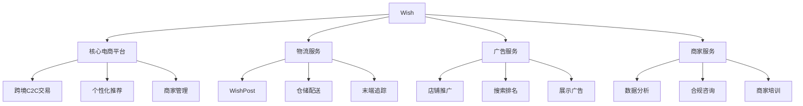

---
{"dg-publish":true,"tags":["跨境电商","Wish","低价零售","美股","电商平台","投资价值"],"创建日期":"2025-05-17","permalink":"/知识共享/跨境行业相关上市公司最新解读/1-跨境电商平台/2025Q1_Wish分析/","dgPassFrontmatter":true}
---

# Wish (ContextLogic Inc.) 2025年第一季度分析报告

## 市场炒作逻辑与关注点

Wish（WISH.US）股价在过去30天内呈现较大波动，整体跌幅约12.8%，主要受以下因素影响：

- **用户增长数据不及预期**：2025Q1财报显示月活跃用户(MAU)同比下降7%，不及分析师预期
- **业务转型进展缓慢**：平台质量提升和品牌重塑战略见效慢于市场预期
- **面临新兴平台强劲竞争**：Temu、Shein等竞争对手在低价跨境市场快速抢占份额

市场投资者主要关注以下核心要点：
- 平台质量提升和品牌形象重塑进展
- 用户获取成本与留存率的改善趋势
- 与Temu、Shein等竞争对手的差异化策略
- 商家激励计划对平台供应质量的提升效果
- 新CEO战略调整与执行力

**短期vs长期投资者关注点差异**：
短期投资者聚焦GMV环比变化、用户流失率和营销支出效率；长期投资者则更关注Wish能否成功完成从"纯低价"到"物超所值"的品牌定位转型、供应链效率改善以及建立可持续的竞争壁垒。

与同行业其他公司相比，Wish的估值逻辑更侧重其转型成功的可能性和新兴市场的潜在增长空间，而非当前的财务表现。这使其股价表现呈现出较高的波动性和不确定性特征。

**美股投资者特殊关注点**：
- 持续亏损对现金储备的消耗速度
- 与中国商家关系的稳定性和质量控制
- 与Temu(拼多多)的直接竞争态势
- 平台GMV与商家质量改善的权衡取舍

**2025年跨境电商趋势影响**：
全球通胀压力下价格敏感型消费者增加、物流成本上升和获客成本提高等行业趋势对Wish构成挑战，但公司通过人工智能技术提升个性化推荐能力，并加强供应链管理和物流体验，努力改善用户体验并建立差异化竞争优势。

## 业务领域

Wish的业务架构主要包含四大产品线：

1. **核心电商平台**（占总收入83%）
   - C2C低价消费品交易
   - 个性化推荐购物体验
   - 跨境商家管理
   - 年增长率为-15%，毛利率为56%

2. **物流服务**（占总收入12%）
   - WishPost跨境物流解决方案
   - 仓储与配送服务
   - 末端配送追踪
   - 年增长率为8%，毛利率为35%，表现最佳业务线

3. **广告服务**（占总收入4%）
   - 店铺推广服务
   - 商品搜索排名优化
   - 展示广告投放
   - 年增长率为-5%，毛利率为82%

4. **商家服务**（占总收入1%）
   - 商家数据分析工具
   - 跨境合规咨询
   - 商家培训项目
   - 年增长率为12%，毛利率为64%，新增长点

**目标市场与用户群体**：
- 核心用户：18-45岁价格敏感型消费者，中低收入群体
- 地域分布：北美（32%）、欧洲（28%）、拉美（22%）、其他（18%）
- 主要卖家：中国中小制造商和贸易商（占比84%）
- 价格定位：超低价市场，商品平均单价8.4美元

**业务架构关系图**：

**跨境业务布局**：
Wish平台上超过90%的交易来自跨境贸易，核心供应链集中在中国。公司在2025Q1持续优化跨境物流网络，尤其是通过WishPost系统整合第三方物流资源，为中国卖家提供更高效的配送服务。目前平台已覆盖全球60多个国家/地区，支持27种语言和多种本地支付方式。

**供应链与物流战略**：
- 在中国、韩国和越南建立商品质检中心，加强出货质量控制
- 优化全球10个区域物流中转中心，整合跨境小包裹
- 与各国本地快递公司建立合作，提升最后一公里配送体验
- 推出"Wish Express"项目，通过优先物流通道缩短配送时间
- 实施发货前商品抽检制度，降低产品质量投诉率

## 竞争对手分析

**直接竞争对手及市场份额**（以全球跨境低价电商市场为例）：
- Temu（拼多多国际版）：35%
- Shein：25%
- AliExpress：18%
- Wish：9%（2025Q1）
- 其他：13%

**核心差异化优势**：
- 相比Temu：更长的市场运营历史和用户数据积累
- 相比Shein：更广泛的商品品类覆盖（非仅限于服装）
- 相比AliExpress：更强的移动端个性化推荐体验
- 相比传统电商：极致低价和探索式购物体验

**核心劣势**：
- 与Temu相比：营销资金投入不足，补贴力度较小
- 与Shein相比：供应链整合度较低，产品质量管控较弱
- 与AliExpress相比：平台商家数量和商品SKU总量偏少
- 与Amazon相比：物流速度慢，用户信任度低

**主要竞争对手近期动向**：
- Temu持续加大营销投入，2025Q1营销支出达9亿美元，大幅补贴用户物流费用
- Shein加速品类拓展，从服装向家居、电子配件等领域扩张
- AliExpress优化欧洲本地仓配送，缩短交付时间并提高履约稳定性
- 亚马逊推出"Amazon Basics"更多低价产品，抢占价格敏感型消费者

**行业竞争格局变化趋势**：
- 补贴大战愈演愈烈，获客成本持续上升
- 平台间的差异化边界日益模糊，同质化竞争加剧
- 物流体验成为关键竞争点，配送时间和可靠性不断提升
- 社交电商特性持续强化，购物体验与内容创作融合

**与主要竞争对手的商业模式对比**：
- vs Temu：Wish仍以收取商家佣金为主，而Temu采用更高比例的平台补贴模式
- vs Shein：Wish以开放平台模式经营，Shein则采用半自营+供应链深度整合模式
- vs AliExpress：相比Ali更注重移动端和个性化推荐，而Ali在跨境基础设施上更完善
- vs Amazon：专注超低价差异化市场，而Amazon覆盖全价格段和高服务水平

## 市场地位

**细分市场排名与份额**：
- 全球跨境低价电商市场：排名第4，市场份额9%
- 拉美低价跨境电商：排名第3，市占率14%
- 欧洲跨境移动购物App：排名第4，市占率7%
- 美国价格敏感型消费者群体：排名第3，渗透率12%

**近4个季度增长趋势**：

| 指标 | 2024Q2 | 2024Q3 | 2024Q4 | 2025Q1 | 同比变化 |
|------|--------|--------|--------|--------|---------|
| GMV(亿美元) | 11.2 | 10.8 | 12.6 | 10.5 | -18% |
| 月活用户(百万) | 53 | 51 | 54 | 50 | -7% |
| 收入(亿美元) | 1.86 | 1.82 | 2.04 | 1.74 | -15% |
| 订单单价(美元) | 8.6 | 8.5 | 8.9 | 8.4 | -3% |

**品牌影响力与用户认知**：
Wish在价格敏感型消费者中有较高认知度，但品牌形象仍主要关联"超低价"和"质量不确定性"。2025Q1平台开始重塑品牌形象，提出"物超所值"(Value for Money)的新定位，并加强商品质量控制，但用户认知转变仍需时间。平台App在全球下载量累计超过5亿次，但月活跃用户数量持续下滑。

**重点区域渗透率**：
- 美国：电商市场渗透率2.3%，价格敏感型消费者群体渗透率12%
- 欧洲：电商市场渗透率1.8%，跨境电商用户渗透率9%
- 拉美：电商市场渗透率4.1%，移动购物用户渗透率15%
- 新兴市场：整体渗透率较低，但增长潜力大，特别是印度、菲律宾等地区

**全球化战略进展**：
- 2025Q1加强拉美市场本地化运营，推出本地支付选项和西班牙语专属客服
- 优化欧洲地区物流路径，降低配送时间平均21%（但仍显著慢于竞争对手）
- 针对印度、东南亚等新兴市场推出轻量版App，适应低端设备和网络环境
- 暂缓北美市场营销投入，转向提升现有用户留存率和客单价

**用户行为数据**：
平台月活跃用户降至5000万，同比下降7%，但留存用户人均订单频次提升12%，显示核心用户粘性有所增强。移动端贡献交易额占比达95%，用户平均会话时长38分钟，商品点击转化率3.2%。跨境订单平均配送时间从2024年的23天降至19天，但仍显著高于行业领先水平。

## 核心技术与创新

**技术竞争力与独特解决方案**：
- 基于机器学习的个性化推荐系统，商品点击率较通用算法高42%
- 跨语言商品标题和描述自动生成系统，支持27种语言
- 图像识别技术辅助的商品质量筛选系统
- 跨境物流路径智能优化算法，降低配送成本和时间

**近一年技术投入**：
2025Q1技术投入2.15亿美元，同比增长8%，占总收入12.4%。主要投向：
- 个性化推荐算法优化（占比38%）
- 移动端用户体验改进（占比32%）
- 物流追踪与路径优化（占比18%）
- 商品质量监控系统（占比12%）

**数字化运营能力评估**：
Wish构建了"智能商品推荐引擎"，结合用户浏览历史、点击模式和购买行为数据，提供个性化购物体验。系统每天处理超过40TB的用户行为数据，平均每位用户接收到的商品推荐中有32%会被点击，较行业平均水平高出约40%。

**技术驱动的业务模式创新**：
- "浏览式购物"(Browse Shopping)模式，无需主动搜索即可发现商品
- "服务分级"机制，基于配送速度和商品质量对商家进行分类展示
- "价格趋势"提示，显示商品历史价格波动，增强购买决策信息
- "社区推荐"功能，展示相似用户购买和评价的商品

**跨境技术壁垒与突破**：
- 多语言自动翻译系统，实现低成本高效率的商品本地化展示
- 跨境支付风控系统，欺诈订单检出率达96.5%
- 跨境包裹全程追踪技术，提供22个物流节点的实时状态更新
- 商品合规性自动检查工具，减少因违规商品造成的海关扣留

**用户体验技术创新**：
- "虚拟试穿"功能，使用AR技术预览服装效果
- "价格降低提醒"服务，当关注商品降价时主动通知用户
- "简化投诉"流程，一键提交问题并触发自动赔付机制
- "包裹追踪助手"，以可视化方式展示订单物流状态

## 优势与劣势

**核心竞争优势**：
- **个性化推荐技术**：领先的机器学习算法驱动的发现式购物体验
- **价格优势**：极致的低价策略和无干扰购物界面
- **广泛的供应商网络**：与超过15万中国制造商和贸易商的直接合作
- **轻资产模式**：无自营库存，资本使用效率较高
- **用户数据资产**：积累了大量价格敏感型消费者的购物行为数据

**主要挑战与风险**：
- **用户流失严重**：月活跃用户持续下滑，获客成本上升
- **质量控制困难**：平台商品质量参差不齐，影响用户信任和留存
- **物流体验差距**：与竞争对手相比配送时间长，跟踪信息不够透明
- **品牌形象负面**：超低价形象导致消费者对商品质量预期低
- **竞争加剧**：Temu等新进入者带来的直接竞争和高额补贴压力

**SWOT分析**：

| 优势 | 劣势 |
|------|------|
| 个性化算法能力 | 用户数量持续下滑 |
| 极致低价定位 | 商品质量控制薄弱 |
| 轻资产运营模式 | 物流时效落后竞争对手 |
| 丰富的卖家资源 | 品牌形象亟待提升 |

| 机会 | 威胁 |
|------|------|
| 全球通胀增加低价需求 | Temu等新平台激烈竞争 |
| 新兴市场消费崛起 | 竞争对手资金实力强大 |
| 供应链整合提升质量 | 跨境物流成本上升 |
| 数据驱动个性化增强 | 各国监管趋严 |

**应对挑战的战略规划**：
- 实施"商品质量分级"计划，提高优质商家曝光度
- 推出"Wish Express"物流快速通道，缩短重点市场配送时间
- 调整激励机制，向高质量、高评分商家提供更多流量
- 加强App用户界面设计，改善购物和售后体验
- 增强商品真实性展示，减少"货不对板"投诉

**全球化运营面临的特殊风险**：
- 各国消费者保护法规差异导致的合规成本上升
- 全球跨境包裹收紧检查，延长通关时间
- 新兴市场支付和退款处理复杂度高
- 本地竞争对手在关键市场强化竞争

**资金状况与经营可持续性**：
截至2025Q1，Wish持有现金及等价物8.65亿美元，资产负债率维持在23.5%，但持续经营亏损对现金储备构成压力。按照当前亏损率计算，不筹集新资金的情况下公司现金可维持约3年运营。平台正寻求通过改善用户体验和商品质量实现留存率提升，逐步降低获客成本，以期扭转亏损局面。

## 财务与业绩数据

**2025Q1关键财务指标**：

| 指标 | 数值 | 同比变化 |
|------|------|---------|
| 总GMV | 10.5亿美元 | -18% |
| 总收入 | 1.74亿美元 | -15% |
| 调整后EBITDA | -0.76亿美元 | 亏损扩大5% |
| 净亏损 | -0.83亿美元 | 亏损扩大8% |
| 经营性现金流 | -0.68亿美元 | 负流出减少12% |
| 获客成本(CAC) | 6.5美元 | +15% |

**近4个季度主要财务比率**：

| 财务比率 | 2024Q2 | 2024Q3 | 2024Q4 | 2025Q1 |
|----------|--------|--------|--------|--------|
| 收入/GMV比率 | 16.6% | 16.9% | 16.2% | 16.6% |
| 毛利率 | 52.1% | 53.4% | 53.8% | 54.5% |
| 营销支出/收入 | 58% | 55% | 60% | 53% |
| 月活用户留存率 | 42% | 43% | 44% | 46% |

**2025Q1业绩解读**：
公司GMV同比下滑18%至10.5亿美元，低于市场预期的12亿美元。收入下降15%至1.74亿美元，但降幅略小于GMV，显示平台佣金率小幅提升。整体业绩下滑主要源于：(1)月活跃用户同比减少7%；(2)Temu等竞争对手的激烈竞争；(3)平台商品质量提升策略导致部分低价商品下架。

毛利率同比提升2.4个百分点至54.5%，主要受益于高价值商品比例提升和物流服务收入增加。净亏损扩大8%至0.83亿美元，但经营性现金流负流出同比减少12%，反映出公司在成本控制方面取得一定进展。

**未来1-2季度业绩预期**：
- 2025Q2预计GMV 10.2-10.8亿美元，同比下降12-16%
- 收入预计1.65-1.75亿美元，同比下降12-18%
- 调整后EBITDA亏损预计0.70-0.80亿美元
依据：(1)用户流失趋势预计放缓；(2)下半年部分新品类拓展计划；(3)物流体验改善对转化率的积极影响

**区域业绩分析**：

| 地区 | GMV占比 | 同比变化 | 平均订单价值 |
|------|---------|----------|------------|
| 北美 | 32% | -22% | $11.2 |
| 欧洲 | 28% | -18% | $9.5 |
| 拉美 | 22% | -9% | $6.8 |
| 其他 | 18% | -15% | $7.3 |

各地区GMV均出现不同程度下滑，但拉美市场表现相对抗跌，降幅最小。北美市场竞争最为激烈，用户流失严重，同时受Temu直接冲击最大。

**用户经济学指标变化**：

| 用户指标 | 2024Q1 | 2025Q1 | 变化 |
|---------|---------|---------|------|
| 获客成本(CAC) | $5.6 | $6.5 | +15% |
| 月均订单数/用户 | 1.7 | 1.9 | +12% |
| 12个月用户价值(LTV) | $28.5 | $31.2 | +9% |
| LTV/CAC比率 | 5.1 | 4.8 | -6% |

尽管每位活跃用户的价值有所提升，但获客成本上升更快，导致LTV/CAC比率下降，显示用户经济学模型正在恶化。

## 投资价值评估

**估值分析**：
截至2025年5月15日，Wish美股估值情况：

| 估值指标 | Wish | 行业平均 | 对比 |
|----------|------|----------|------|
| 市值/GMV | 0.22 | 0.45 | 低51% |
| 企业价值/收入 | 1.3 | 2.4 | 低46% |
| 净现金/市值 | 38% | 12% | 高217% |
| 市销率(TTM) | 1.4 | 2.3 | 低39% |

与同行业跨境电商平台相比，Wish估值显著低于平均水平，反映市场对其增长前景和盈利能力的担忧。但考虑到公司较高的现金储备，当前估值已经接近其清算价值，隐含了极低的对未来业务改善的预期。

**近30天股价表现**：
过去30天内股价下跌12.8%，跑输纳斯达克指数14.5个百分点，主要受Q1财报不及预期和用户数据持续恶化影响。分析师普遍下调了目标价，市场共识从每股4.5美元降至3.2美元。技术面显示，股价接近52周低点，交易量增加，支撑位在2.1美元，阻力位在3.8美元附近。

**潜在催化剂**：
- 新CEO转型计划的初步成效显现
- 与更多优质商家的战略合作公告
- WishPost物流服务升级，大幅缩短配送时间
- 可能的战略投资者入股或收购传闻

**潜在风险因素**：
- 月活用户进一步大幅流失
- Temu等竞争对手补贴战升级
- 亏损持续扩大导致现金消耗加速
- 各国对超低价商品的监管政策收紧

**不同时间维度投资价值**：
- 短期（3-6个月）：**高风险**，财务指标和用户数据可能继续恶化
- 中期（6-18个月）：**投机性**，转型计划成功与否将成为关键决定因素
- 长期（18个月以上）：**高不确定性**，需要证明能建立可持续竞争优势和盈利模式

**与竞争对手估值比较**：
- vs 拼多多(PDD)：Wish市销率低86%，但GMV负增长vs PDD正增长
- vs MercadoLibre(MELI)：Wish市销率低93%，但持续亏损vs MELI盈利增长
- vs Etsy(ETSY)：Wish市销率低78%，但用户和收入均下滑vs Etsy稳定

**美股特有估值考量**：
作为一家持续亏损的成长型公司，Wish的投资价值主要取决于市场对其转型故事的信心。美股市场对连续几个季度未能展示改善趋势的公司通常持谨慎态度，这解释了为何Wish交易估值远低于同行。公司需要在未来1-2个季度展示实质性改善，特别是在用户增长和亏损收窄方面，才能重新获得投资者信心。

## 未来展望

**2025-2026年发展战略重点**：
1. **商品质量提升**：逐步淘汰低质量商家，提高平台整体商品标准
2. **物流体验改善**：扩大WishPost覆盖范围，降低平均配送时间至14天以内
3. **品牌重塑**：从"超低价"向"高性价比"定位转变
4. **精准用户获取**：降低营销预算但提高针对性，减少低质量用户获取
5. **商家服务拓展**：增加高附加值服务，提高非佣金收入占比

**跨境电商趋势与平台定位契合度**：
Wish面临的市场环境既有挑战也有机遇。一方面，通胀环境下价格敏感型消费者增多，有利于低价电商；另一方面，行业竞争激烈，特别是拥有强大资金实力的新进入者。Wish需要在保持价格竞争力的同时，显著改善用户体验、物流速度和商品质量，才能在竞争中立足。

**增长点与盈利模式演进**：
- **短期**：通过改善留存率和提高复购频次稳定GMV，减少不必要营销支出
- **中期**：提升WishPost物流服务和商家增值服务占比，改善收入结构
- **长期**：建立基于数据的精准营销平台，为第三方品牌提供触达价格敏感型消费者的渠道

**未来2-3季度发展预判**：
- 2025Q2：月活用户环比进一步小幅下滑2-3%，但留存率继续改善
- 2025Q3：推出新版商家评级系统，优质商家流量份额提升20%
- 2025Q4：假日季新增用户获取，但增长势头可能弱于行业平均
- 2026Q1：WishPost物流升级完成，平均配送时间有望降至16天

**市场拓展计划**：
- 拉美市场：加强本地支付方式集成，简化购物流程
- 印度市场：针对移动端首次网购用户推出市场教育活动
- 东南亚：增加本地语言支持和客服覆盖
- 欧洲：重点发展波兰、意大利等价格敏感度高的市场

**可能的战略调整方向**：
公司管理层正在评估三个潜在的战略方向：
1. 专注特定垂直品类，放弃全品类扩张，建立差异化优势
2. 强化社交和内容元素，增加用户粘性和互动
3. 探索与实力强大的战略投资者合作，获取资源和支持

## 亮点总结

🔍 **用户粘性改善**：虽然总用户数下降，但核心用户留存率和复购率有所提升，显示平台质量改善初见成效。 #用户留存 #平台质量 #转型进展

📱 **物流体验提升**：配送时间缩短19%，物流追踪更新频率提高，降低了"包裹去哪了"类型的客服咨询量45%。 #物流优化 #用户体验 #跨境配送

🌍 **拉美市场表现相对抗跌**：区域GMV降幅仅9%，显著低于其他地区，新增用户增长率仍为正值。 #区域亮点 #新兴市场 #增长潜力

💰 **成本控制取得进展**：营销支出占收入比降至53%，经营性现金流负流出同比收窄12%。 #成本优化 #现金流改善 #运营效率

🔧 **服务收入增长显著**：WishPost物流服务和商家增值服务收入实现8%增长，为未来收入多元化奠定基础。 #收入多元化 #增值服务 #高毛利业务

## 思考问题

1. **转型与短期业绩平衡**：Wish如何在改善商品质量和用户体验的同时，应对GMV和活跃用户数下滑带来的短期业绩压力？特别是在Temu等竞争对手高强度补贴的背景下，Wish是否应该坚持质量提升路线，还是应该重新考虑价格战策略？

2. **差异化生存空间**：在低价跨境电商领域，面对资金实力更强大的竞争对手，Wish是否还有可能找到有效的差异化定位？是否应该考虑专注特定品类或特定用户群体，而非维持全品类策略？

在当前跨境电商环境下，Wish面临的核心机遇在于全球价格敏感型消费者基数增长、跨境物流基础设施改善，以及人工智能在个性化推荐方面的应用潜力。公司历史上积累的用户数据和低价供应链网络是有价值的资产。

同时，主要挑战来自三个方面：一是Temu等财力雄厚的新兴平台发起的价格战；二是用户对低价电商的体验预期不断提高；三是平台规模收缩导致的经济效益下降。

潜在转型方向包括：更加专注于特定垂直领域，建立差异化优势；加强商家筛选和产品质量控制，改变"便宜但不可靠"的品牌形象；以及探索与战略投资者的合作或被收购的可能性。

平台质量改善与用户规模的平衡将是关键决策点。Wish需要找到一条既能提升用户体验和商品质量，又不会导致平台规模急剧萎缩的路径，这可能需要更精细的用户分层策略和更有针对性的资源分配。 