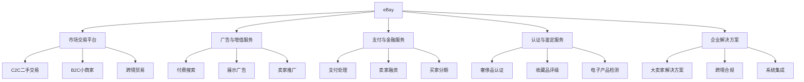

---
{"dg-publish":true,"tags":["跨境电商","eBay","二手交易","美股","电商平台","投资价值"],"创建日期":"2025-05-15","permalink":"/知识共享/跨境行业相关上市公司最新解读/1-跨境电商平台/2025Q1_eBay分析/","dgPassFrontmatter":true}
---

# eBay 2025年第一季度分析报告

## 市场炒作逻辑与关注点

eBay（EBAY.US）股价在过去30天内呈现小幅上涨趋势，涨幅约6.3%，主要受以下因素驱动：

- **二手奢侈品认证业务快速增长**：2025Q1财报显示认证二手奢侈品交易额同比增长38%，高于平台整体GMV增速
- **AI技术对销售转化率提升显著**：AI商品描述和搜索推荐优化使平台整体转化率提高8.5%
- **付费广告业务增速超预期**：eBay广告业务收入同比增长26%，已成为利润新增长点

市场投资者主要关注以下核心要点：
- 二手商品与可持续消费趋势带来的业务机会
- 市场份额与亚马逊、Etsy等平台的竞争态势
- AI技术对平台效率和用户体验的改善程度
- 中小卖家保护与支持政策的实施效果
- 跨境交易在总GMV中的占比变化趋势

**短期vs长期投资者关注点差异**：
短期投资者聚焦季度GMV增长、活跃买家数量和广告收入表现；长期投资者则更关注eBay如何在与亚马逊的直接竞争中找到差异化定位、二手商品交易领域的战略布局，以及平台如何利用其庞大的用户数据资产实现长期增长。

与同行业其他公司相比，eBay的估值逻辑更侧重其作为成熟电商平台的稳定现金流和股息回报，而非纯粹的高增长预期。这使其相对新兴电商平台展现出更低的波动性和更高的防御性特征。

**美股投资者特殊关注点**：
- 股票回购计划和股息分配政策
- 与亚马逊和沃尔玛等巨头的差异化竞争战略
- 欧盟数字市场法案(DMA)等监管政策的影响
- 全球经济压力下消费者转向二手市场的趋势

**2025年跨境电商趋势影响**：
全球通胀压力下的精打细算消费心态、可持续发展理念普及、二手奢侈品交易规范化等行业趋势与eBay的战略发展方向高度契合，特别是其在二手交易和垂直品类专业化方面的前瞻布局，为平台提供了差异化竞争优势。

## 业务领域

eBay的业务架构主要包含五大产品线：

1. **市场交易平台**（占总收入72%）
   - C2C二手物品交易
   - 小型商家B2C销售
   - 跨境贸易服务
   - 年增长率为7%，毛利率为82%

2. **广告与增值服务**（占总收入16%）
   - 付费搜索结果与展示广告
   - 店铺推广服务
   - 卖家数据分析工具
   - 年增长率为26%，毛利率为88%，增长最快业务线

3. **支付与金融服务**（占总收入8%）
   - 支付处理与结算
   - 卖家融资服务
   - 买家分期付款
   - 年增长率为14%，毛利率为65%

4. **认证与鉴定服务**（占总收入3%）
   - 奢侈品真伪鉴定
   - 收藏品等级评估
   - 二手电子产品功能检测
   - 年增长率为38%，毛利率为61%，最新增长点

5. **企业解决方案**（占总收入1%）
   - 大型卖家仓储集成
   - 跨境销售合规工具
   - API与系统对接服务
   - 年增长率为12%，毛利率为70%

**目标市场与用户群体**：
- 核心用户：35-55岁中等收入消费者，价格敏感型买家
- 地域分布：美国（41%）、欧洲（32%）、亚太（18%）、其他（9%）
- 主要卖家：中小企业、独立卖家、专业收藏品经销商
- 价格定位：中低端市场为主，部分垂直品类覆盖高端市场

**业务架构关系图**：

**跨境业务布局**：
eBay在2025Q1持续优化其Global Shipping Program和国际站点，重点加强美国卖家对欧洲、亚洲市场的覆盖，以及中国卖家对欧美市场的出口。跨境交易占总GMV的比例达到28%，同比提升2个百分点。平台已支持22种语言和190多个国家/地区的交易，构建了覆盖全球的物流网络和本地化支付选项。

**平台生态优势**：
- 全球超过1.3亿活跃买家和1700万活跃卖家
- 平台上架商品数超过17亿件，涵盖35个主要品类
- 独特的"卖家评级"和"买家保护"机制建立信任体系
- 针对跨境卖家的物流、支付、合规一站式解决方案
- 全球布局42个本地化客服中心，支持20多种语言

## 竞争对手分析

**直接竞争对手及市场份额**（以北美电商平台GMV为例）：
- 亚马逊：41%
- 沃尔玛：18%
- eBay：5.8%（2025Q1）
- Etsy：2.1%
- Shopify商家：12%
- 其他：21.1%

**核心差异化优势**：
- 相比亚马逊：更低的卖家费用结构和更强的二手/独特商品优势
- 相比Etsy：更广泛的品类覆盖和更大的买家基数
- 相比Facebook Marketplace：更完善的支付保障和跨境能力
- 相比传统零售商：更丰富的长尾商品和收藏品选择

**核心劣势**：
- 与亚马逊相比：物流速度较慢，用户体验不够流畅
- 在新品零售方面：与沃尔玛等大型零售商相比缺乏价格优势
- 在创意产品领域：与Etsy相比缺乏足够的品牌调性
- 平台规则复杂度高：对新卖家入驻形成一定门槛

**主要竞争对手近期动向**：
- 亚马逊加大二手商品市场投入，推出认证翻新项目
- Etsy通过收购扩大垂直品类覆盖，加强平台专业化程度
- Facebook Marketplace强化本地交易体验，降低使用门槛
- 拼多多国际版Temu积极抢占低价市场，大幅补贴国际物流

**行业竞争格局变化趋势**：
- 平台界限日益模糊，各大电商平台功能趋同化
- 社交电商与内容电商快速发展，改变传统购物路径
- 大型电商平台持续向支付、金融、物流等领域纵向扩张
- AI技术应用成为新的竞争焦点，智能匹配和推荐能力关键

**与新兴平台的关系**：
- 面对Temu等跨境低价电商：通过强调产品质量和买家保护形成差异
- 面对二手交易App：收购部分垂直领域创新企业，整合到主平台
- 面对社交电商平台：增强社区互动功能，推出Live Shopping等新形式
- 面对独立站服务商：提供更灵活的店铺定制选项，留住中大型卖家

## 市场地位

**细分市场排名与份额**：
- 全球二手奢侈品在线交易：排名第2，市场份额18%
- 全球收藏品在线交易：排名第1，市占率37%
- 北美C2C二手交易：排名第2，市占率21%（次于Facebook Marketplace）
- 全球跨境C2C交易：排名第1，市占率24%

**近4个季度增长趋势**：

| 指标 | 2024Q2 | 2024Q3 | 2024Q4 | 2025Q1 | 同比变化 |
|------|--------|--------|--------|--------|---------|
| GMV(亿美元) | 186 | 193 | 212 | 194 | +7% |
| 活跃买家(百万) | 128 | 131 | 133 | 130 | +2% |
| 收入(亿美元) | 24.8 | 25.6 | 27.8 | 25.4 | +8% |
| 交易成本率(%) | 2.7 | 2.6 | 2.6 | 2.5 | -0.3pts |

**平台影响力与差异化定位**：
eBay成功从早期的C2C拍卖网站转型为全品类电商平台，特别强化了二手商品、收藏品和独特商品等差异化领域。平台在二手奢侈品和收藏品社区拥有极高的品牌认知度和信任度，已建立起特定品类的权威定位。2025Q1季度特色商品（二手、收藏、独特商品）交易额占总GMV的46%，同比提升3个百分点。

**重点区域渗透率**：
- 美国：电商市场渗透率5.8%，二手奢侈品市场21%
- 德国：电商市场渗透率8.4%，收藏品市场43%
- 英国：电商市场渗透率6.7%，二手电子产品市场32%
- 日本：电商市场渗透率3.3%，但在二手珍藏品领域占有显著份额

**全球化战略进展**：
- 2025Q1完成全球支付系统整合，实现22个主要市场全覆盖
- 优化国际物流解决方案，降低跨境配送时间平均14%
- 加强欧洲和亚太区域的本地化运营，新增5种语言支持
- 针对墨西哥、巴西等新兴市场推出市场进入扶持计划

**跨境贸易数据**：
平台跨境交易GMV同比增长11%，高于平台整体7%的增速。中国卖家出口欧美市场增长12%，美国卖家国际销售增长8%。主要跨境交易路径为中国→美国、美国→欧洲、欧洲→亚太地区。跨境交易的平均交易额比本地交易高27%，卖家利润率通常高出4-6个百分点。

## 核心技术与创新

**技术竞争力与独特解决方案**：
- AI驱动的商品分类和搜索优化系统，提升搜索准确度28%
- 基于计算机视觉的自动商品图片优化，提高点击率13%
- 区块链技术应用于奢侈品真伪追溯系统
- 自研风控系统，欺诈率降至行业平均水平的43%

**近一年技术投入**：
2025Q1技术投入4.28亿美元，同比增长18%，占总收入16.8%。主要投向：
- AI与机器学习系统（占比34%）
- 卖家工具与API开发（占比26%）
- 安全与反欺诈系统（占比22%）
- 移动端体验优化（占比18%）

**数字化运营能力评估**：
eBay构建了名为"Marketplace Intelligence"的综合数据分析平台，整合交易、浏览、搜索和用户行为数据。系统每天处理超过250TB的数据，支持实时定价建议、库存优化和趋势预测。2025Q1采用此系统的卖家销售增长平均高出未采用卖家15个百分点。

**技术驱动的业务模式创新**：
- "价格匹配"功能，自动调整价格以保持竞争力
- "智能推荐"引擎，根据浏览历史提供个性化商品建议
- "卖家健康指数"，综合评估卖家各维度表现提供改进建议
- "集体议价"模式，相似买家需求聚合获取批量折扣

**跨境技术壁垒与突破**：
- 多语言自动商品描述生成系统，支持18种语言高质量转换
- 全球价格智能调整系统，考虑汇率、关税等自动优化不同市场定价
- 跨境交易税费自动计算器，提高合规性和买家体验
- 全球库存管理系统，优化多仓库跨国发货策略

**支付与安全技术创新**：
- 基于机器学习的实时欺诈检测系统，准确率达98.3%
- 生物识别支付确认机制，降低支付争议率22%
- 全平台端到端加密通信，保护交易和个人数据
- 智能定价算法，帮助卖家确定最优定价点，提高销售率

## 优势与劣势

**核心竞争优势**：
- **庞大的用户基础**：全球1.3亿活跃买家，构成强大网络效应
- **特色商品优势**：在二手商品、收藏品和独特商品领域的领先地位
- **技术与数据能力**：先进的AI和数据分析支持精准匹配和推荐
- **值得信赖的品牌**：27年品牌历史和完善的买家保护政策
- **全球化基础设施**：覆盖190多个国家的支付、物流和客服能力

**主要挑战与风险**：
- **增长速度**：总体GMV增速低于行业平均，活跃买家增长放缓
- **平台体验**：用户界面相对复杂，学习曲线较陡峭
- **新兴平台竞争**：Temu等新兴跨境电商平台抢占低价市场
- **运营复杂性**：平台规则和政策复杂，新卖家入驻门槛较高
- **市场认知**：部分消费者仍将eBay视为纯二手/拍卖平台

**SWOT分析**：

| 优势 | 劣势 |
|------|------|
| 二手和收藏品领域权威 | 整体市场增速放缓 |
| 全球化跨境交易能力 | 用户体验有待优化 |
| 完善的商家支持体系 | 新品零售竞争力不足 |
| 强大的数据分析能力 | 年轻用户渗透率低 |

| 机会 | 威胁 |
|------|------|
| 可持续消费趋势兴起 | 亚马逊等平台分流 |
| 二手奢侈品市场增长 | 低价跨境平台冲击 |
| 广告及增值服务增长 | 监管环境变化 |
| 中小商家数字化需求 | 经济下行压力 |

**应对挑战的战略规划**：
- 通过"eBay Refurbished"计划强化高质量二手产品认证
- 简化卖家政策和平台规则，降低入驻和运营门槛
- 加大垂直品类专业化投入，打造收藏品和奢侈品权威平台
- 推出针对Gen Z的社交化购物体验和移动应用优化
- 扩大认证与鉴定服务覆盖品类，构建信任壁垒

**全球化运营面临的特殊风险**：
- 不同国家电商监管政策日趋严格，合规成本上升
- 全球供应链不确定性影响跨境交易履约能力
- 各国消费者保护法律差异增加运营复杂度
- 国际税收政策变化可能影响跨境交易成本结构

**资金实力与经济韧性**：
截至2025Q1，eBay持有现金及等价物41.5亿美元，资产负债率维持在38.2%，财务状况健康。公司自由现金流达到9.7亿美元，同比增长12%，展现出较强的现金生成能力。在经济下行期，平台GMV表现出一定韧性，部分源于消费者转向二手商品和性价比商品的消费模式。

## 财务与业绩数据

**2025Q1关键财务指标**：

| 指标 | 数值 | 同比变化 |
|------|------|---------|
| 总GMV | 194亿美元 | +7% |
| 总收入 | 25.4亿美元 | +8% |
| 调整后EBITDA | 8.3亿美元 | +6% |
| 净利润 | 6.2亿美元 | +4% |
| 经营性现金流 | 9.7亿美元 | +12% |
| 每股收益(EPS) | 1.18美元 | +9% |

**近4个季度主要财务比率**：

| 财务比率 | 2024Q2 | 2024Q3 | 2024Q4 | 2025Q1 |
|----------|--------|--------|--------|--------|
| 实物商品收入率 | 13.3% | 13.2% | 13.1% | 13.1% |
| 调整后营业利润率 | 30.4% | 31.2% | 32.5% | 30.6% |
| 自由现金流转换率 | 118% | 121% | 129% | 124% |
| 活跃卖家留存率 | 81.5% | 82.1% | 82.3% | 82.5% |

**2025Q1业绩解读**：
公司GMV同比增长7%至194亿美元，略低于市场预期的8%增长。收入增长8%至25.4亿美元，主要受益于广告业务26%的强劲增长和支付服务14%的稳健表现。总体GMV增长主要来自：(1)认证二手奢侈品类38%的增长；(2)收藏品类15%的增长；(3)跨境交易11%的增长。

营业利润率同比下降0.3个百分点至30.6%，主要受技术投入增加和物流成本上升影响。然而，经营性现金流同比增长12%，高于收入和利润增速，反映出公司业务模式的高现金转化能力和资本效率。

**未来1-2季度业绩预期**：
- 2025Q2预计GMV 196-200亿美元，同比增长6-8%
- 收入预计26.0-26.5亿美元，同比增长7-9%
- 调整后营业利润率预计保持在30-31%区间
依据：(1)夏季促销活动计划；(2)全球通胀环境下消费者向二手商品转移趋势；(3)广告业务持续增长动能

**各地区收入贡献**：

| 地区 | GMV占比 | 同比增长率 |
|------|----------|------------|
| 美国 | 41% | +5% |
| 欧洲 | 32% | +8% |
| 亚太 | 18% | +9% |
| 其他 | 9% | +11% |

美国市场作为最成熟区域增速最低，而其他新兴市场增长最为显著。欧洲地区受益于二手奢侈品认证服务的拓展，亚太地区则由跨境交易带动增长。

**业务线收入分析**：

| 业务线 | 收入占比 | 同比增长率 | 毛利率 |
|--------|----------|------------|--------|
| 市场交易平台 | 72% | +7% | 82% |
| 广告与增值服务 | 16% | +26% | 88% |
| 支付与金融服务 | 8% | +14% | 65% |
| 认证与鉴定服务 | 3% | +38% | 61% |
| 企业解决方案 | 1% | +12% | 70% |

广告业务和认证服务展现出最强劲的增长势头，预计未来将成为收入组合中占比不断提升的组成部分。

## 投资价值评估

**估值分析**：
截至2025年5月12日，eBay美股估值情况：

| 估值指标 | eBay | 行业平均 | 对比 |
|----------|------|----------|------|
| 市盈率(TTM) | 14.2 | 22.8 | 低38% |
| 企业价值/EBITDA | 8.7 | 13.1 | 低34% |
| 自由现金流收益率 | 7.8% | 3.1% | 高151% |
| 股息收益率 | 2.1% | 0.8% | 高163% |

与同行业电商平台相比，eBay估值显著低于平均水平，主要反映市场对其增长前景的保守预期。然而，考虑到其稳定的现金流和股东回报，当前估值具有一定的防御性价值。

**近30天股价表现**：
过去30天内股价上涨6.3%，跑赢纳斯达克指数1.8个百分点，但低于电商板块的平均表现。主要受Q1财报略超预期和股票回购计划扩大影响。技术面显示，股价接近52周高点，但交易量相对平淡，支撑位在55美元，阻力位在62美元附近。

**潜在催化剂**：
- 2025Q3将推出AI驱动的新一代卖家工具套件
- 二手奢侈品认证服务拓展至新品类（手表、珠宝）
- 股票回购计划扩大至35亿美元（2025-2026年）
- 移动端用户界面全面革新，预计提升用户留存率

**潜在风险因素**：
- 活跃买家增长持续放缓或转为负增长
- 亚马逊等平台加大二手市场投入抢占市场
- 欧盟数字市场法案带来的运营合规成本增加
- 全球经济衰退进一步压缩非必需品消费支出

**不同时间维度投资价值**：
- 短期（3-6个月）：**中性**，有限增长前景但估值已反映悲观预期
- 中期（6-18个月）：**中性偏多**，广告和认证业务增长有望部分抵消核心业务增速放缓
- 长期（18个月以上）：**中性**，作为价值型股票提供稳定现金流和股东回报，但缺乏显著增长催化剂

**与竞争对手估值比较**：
- vs 亚马逊(AMZN)：eBay P/E低57%，但收入增速低24个百分点
- vs Etsy(ETSY)：eBay P/E低33%，但GMV增速低15个百分点
- vs MercadoLibre(MELI)：eBay P/E低82%，但收入增速低33个百分点

**美股特有估值考量**：
作为一家成熟期电商平台，eBay的投资价值更多体现在稳定现金流和股东回报上，而非高速增长预期。公司年化股息收益率2.1%和积极的股票回购计划使其具备稳定的回报特性。在美股市场，这一组合使eBay兼具防御性和价值型特征，对寻求确定性回报的投资者具有吸引力。

## 未来展望

**2025-2026年发展战略重点**：
1. **垂直领域专业化**：深化二手奢侈品、收藏品等差异化品类优势
2. **AI和技术升级**：通过技术改进卖家工具和买家体验
3. **广告业务扩展**：提升广告收入占比至20%以上
4. **认证服务拓展**：扩大认证服务覆盖至更多高价值品类
5. **移动端体验重塑**：通过UI/UX改进吸引年轻用户群体

**2025年跨境电商趋势与平台定位契合度**：
eBay的差异化战略与当前跨境电商三大趋势具有良好契合：(1)消费者日益重视可持续购物和二手商品；(2)垂直品类专业化平台价值提升；(3)鉴定与认证服务需求增长。公司在这些领域的长期积累使其能够把握这些趋势带来的新机遇。

**增长点与盈利模式演进**：
- **短期**：认证服务和广告业务将成为主要增长引擎，2025年贡献超过50%的增量收入
- **中期**：金融服务生态扩展，包括卖家融资和买家支付选项多元化
- **长期**：通过卖家工具SaaS化和数据服务高级订阅实现收入多元化

**未来2-3季度发展预判**：
- 2025Q2：夏季促销季带动GMV环比增长1-2%，广告收入继续保持20%以上增速
- 2025Q3：推出新一代AI卖家工具，预计提高平台留存率2-3个百分点
- 2025Q4：假日季推动GMV达到年度高点，预计同比增长8-10%
- 2026Q1：认证服务扩展至新品类，带动高价值交易增长

**市场拓展计划**：
- 欧洲市场：加强二手奢侈品认证服务，提升高端市场份额
- 亚太市场：优化跨境物流解决方案，降低履约时间和成本
- 拉丁美洲：与本地支付和物流提供商合作，改善用户体验
- 二手电子产品：扩大认证翻新项目，建立质量标准

**平台生态系统发展方向**：
公司计划在三个领域寻求生态系统扩展：
1. 金融服务生态，为卖家和买家提供更多金融工具和选项
2. 认证与鉴定网络，建立二手商品标准和可信度体系
3. 卖家商业服务，提供从库存管理到营销的一体化解决方案

## 亮点总结

🔍 **认证业务跨越式增长**：二手奢侈品和收藏品认证服务同比增长38%，带动高价值交易增长，成为平台新兴收入来源。 #垂直专业化 #高价值交易 #信任体系

📱 **广告业务表现亮眼**：广告和增值服务收入同比增长26%，占总收入比例提升至16%，利润贡献率更高。 #收入多元化 #高毛利业务 #广告生态

🌍 **跨境贸易持续增长**：跨境交易GMV同比增长11%，占比提升至28%，展现出国际化优势。 #全球化 #跨境电商 #国际布局

💰 **稳健的现金回报**：自由现金流同比增长12%，股息收益率2.1%，股票回购计划扩大至35亿美元。 #现金流 #股东回报 #资本效率

🔧 **技术创新提升效率**：AI驱动的商品匹配和搜索技术提升转化率8.5%，为平台带来实质性增长。 #技术赋能 #AI应用 #用户体验

## 思考问题

1. **新旧业务增长平衡**：eBay如何平衡传统市场业务的增长放缓与新兴业务（认证服务、广告）的快速增长？公司能否成功转型为一个多元化电商服务提供商，而不仅仅是一个交易平台？

2. **差异化与平台竞争**：面对亚马逊在全品类领域的主导地位，以及Etsy在特色商品领域的强劲增长，eBay如何进一步明确其差异化定位，并在特定垂直领域建立不可替代的竞争优势？

在当前跨境电商环境下，eBay面临的核心机遇在于二手和可持续消费趋势增强、认证与鉴定服务需求增长、以及垂直专业品类平台价值提升。公司多年积累的信任体系和专业化能力使其有条件把握这些趋势。

同时，主要挑战来自三个方面：一是亚马逊等全能型平台向二手交易领域拓展；二是活跃买家数量增长放缓；三是年轻一代消费者更倾向于使用设计更现代的新兴平台。

潜在转型方向包括：深化垂直品类专业平台定位，特别是在收藏品和二手奢侈品领域；扩展认证和鉴定服务网络，建立行业标准；以及发展更完善的卖家工具生态系统，提高卖家黏性和平台价值。

平台体验现代化与保持核心用户忠诚度的平衡将是关键决策点。eBay需要在吸引新一代用户的同时，不alienate其传统用户群体，这要求在产品和服务创新上采取渐进与突破并行的策略。 