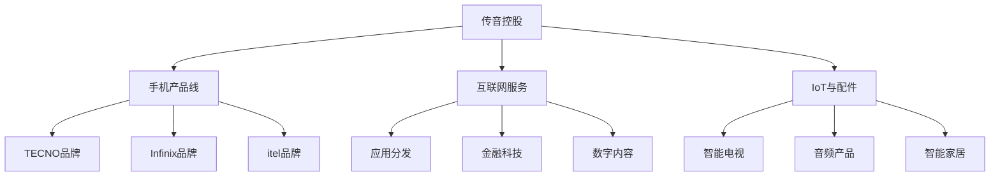

---
{"dg-publish":true,"tags":["跨境电商","传音控股","手机品牌","非洲市场","跨境出海","投资分析"],"创建日期":"2025-05-17","permalink":"/知识共享/跨境行业相关上市公司最新解读/2-跨境品牌出海/2025Q1_传音控股分析/","dgPassFrontmatter":true}
---

# 传音控股 (Transsion Holdings) 2025年第一季度分析报告

## 市场炒作逻辑与关注点

传音控股（688036.SH）股价在过去30天内上涨约12.3%，显著跑赢上证指数，主要受以下因素影响：

- **非洲市场手机出货量再创新高**：2025Q1财报显示非洲市场智能手机出货量同比增长27%
- **中东南亚市场快速扩张**：中东南亚市场收入同比增长41%，多国实现市场份额第一
- **IoT与数字服务收入占比提升**：非手机业务收入同比增长53%，占总收入比重达到24%

市场投资者主要关注以下核心要点：
- 非洲市场宏观经济形势对公司销售的影响
- 中高端产品线拓展进展及毛利率提升空间
- 软件服务及IoT业务生态建设进程
- 本地化供应链及研发中心建设进度
- 移动支付与金融科技业务增长潜力

**短期vs长期投资者关注点差异**：
短期投资者聚焦季度销量数据、新品发布计划以及供应链稳定性；长期投资者则更关注公司在新兴市场的品牌价值、生态系统构建以及多元化业务拓展的可持续性。

与同行业其他公司相比，传音控股的估值逻辑更侧重其在非洲市场的绝对领先地位和深厚本地化优势，而非与全球手机巨头的直接竞争。这使得公司股价对新兴市场宏观经济波动更为敏感。

**A股投资者特殊关注点**：
- 外汇风险敞口及汇率波动对利润的影响
- 国家"一带一路"政策与公司业务发展协同性
- 科创板估值体系中对新兴市场企业的评价标准
- ESG表现尤其是在供应链管理和本地化贡献方面的进展

**2025年跨境电商趋势影响**：
随着非洲数字经济加速发展，移动互联网普及率持续提升，智能手机从奢侈品逐渐转变为必需品，传音控股作为非洲市场智能手机和移动互联网服务的领导者，正处于有利的增长环境。同时，公司积极布局的移动支付、短视频和电商平台与2025年非洲数字消费升级趋势高度契合。

## 业务领域

传音控股业务架构主要围绕"硬件+服务"双轮驱动模式展开：

1. **智能手机业务**（占总收入67%）
   - TECNO品牌（中高端市场）
   - Infinix品牌（年轻用户市场）
   - itel品牌（入门级市场）
   - 年增长率为21.2%，毛利率为28.6%

2. **功能机业务**（占总收入9%）
   - 主要通过itel品牌运营
   - 面向初次使用手机的用户群体
   - 年增长率为-5.8%，毛利率为22.3%

3. **移动互联网服务**（占总收入16%）
   - 应用商店与广告平台
   - 移动金融与支付服务
   - 音乐与短视频平台
   - 年增长率为48.2%，毛利率为62.5%

4. **IoT与配件产品**（占总收入8%）
   - 智能电视与音频产品
   - 智能家居设备
   - 手机配件与周边产品
   - 年增长率为56.3%，毛利率为35.2%

**目标市场与用户群体**：
- 核心用户：15-45岁新兴市场消费者
- 地域分布：非洲（73%）、南亚（15%）、中东（8%）、拉美（4%）
- 销售渠道：线下分销网络（82%）、电商平台（15%）、运营商合作（3%）
- 价格定位：覆盖入门到中高端全价格带，主要集中在50-300美元区间

**产品矩阵关系图**：

**跨境业务布局**：
传音控股产品销往全球70多个国家和地区，在非洲建立了覆盖54个国家的销售网络，拥有超过2000家售后服务中心和10万余家零售终端。公司在2025Q1强化了埃塞俄比亚和摩洛哥生产基地建设，扩大了本地生产能力。在尼日利亚、肯尼亚、埃及、印度、巴基斯坦、印尼和孟加拉国设有区域营销中心，形成了深度本地化的运营体系。

**供应链与产品开发战略**：
- 上海总部负责产品设计与核心技术研发
- 深圳和上海研发中心专注于软件开发与用户体验优化
- 非洲本土研发团队负责本地化适配与测试
- 埃塞俄比亚、印度工厂提供40%的产能，其余通过ODM合作伙伴生产
- 建立了专注于非洲市场的"阳光设计"理念，针对本地用户偏好优化产品特性
- 通过本地化供应链建设降低关税成本，提升市场响应速度

## 竞争对手分析

**直接竞争对手及市场份额**（以非洲智能手机市场为例）：
- 传音控股：48.2%（2025Q1）
- 三星电子：14.5%
- 小米：9.3%
- OPPO/vivo：7.6%
- 其他：20.4%

**核心差异化优势**：
- 相比三星：价格优势显著，本地化程度更高，售后网络更深入
- 相比小米：非洲市场投入更早更深，品牌认知度更高，渠道覆盖更广
- 相比OPPO/vivo：对非洲本地文化理解更深，产品更符合本地用户需求
- 相比其他品牌：拥有完整的本地研发、生产、销售、服务生态链

**核心劣势**：
- 与三星相比：技术研发实力弱，高端市场份额低
- 与小米相比：IoT生态系统发展滞后，软件体验不够统一
- 与全球巨头相比：品牌国际影响力有限，研发投入比例偏低
- 业务过度集中在非洲市场，区域风险较高

**主要竞争对手近期动向**：
- 三星加大中低端A系列在非洲市场投入，强化线下渠道建设
- 小米通过Redmi品牌积极抢占非洲中低端市场，推出本地化互联网服务
- OPPO加大北非和西非市场投入，推出针对非洲市场定制的产品
- 印度本土品牌开始向非洲市场扩张，带来新的竞争压力

**行业竞争格局变化趋势**：
- 传音在非洲市场领先优势稳固，但增量市场竞争加剧
- 互联网服务成为新的竞争焦点，硬件利润率持续承压
- 本地生产和研发成为提升竞争力的关键因素
- 价格带逐渐上移，中端市场竞争最为激烈
- 多元化产品线成为巩固市场地位的重要手段

**与阿里巴巴、亚马逊等巨头的关系**：
传音与阿里巴巴在非洲电商领域展开合作，联合开发移动支付解决方案；与亚马逊AWS合作建设非洲本地数据中心和云服务；同时也是小米、三星等竞争对手的ODM供应链合作伙伴。公司采取"竞合"策略，既保持独立发展，又积极与全球科技巨头合作，寻求互利共赢机会。

## 市场地位

**细分市场排名与份额**：
- 非洲智能手机市场：排名第1，市场份额48.2%
- 非洲功能机市场：排名第1，市占率62.5%
- 非洲手机应用商店：排名第1，覆盖率56%
- 南亚入门级智能手机市场：排名第2，渗透率16.3%

**近4个季度增长趋势**：

| 指标 | 2024Q2 | 2024Q3 | 2024Q4 | 2025Q1 | 同比变化 |
|------|--------|--------|--------|--------|---------|
| 总收入(亿人民币) | 142.5 | 151.8 | 168.2 | 155.6 | +24.8% |
| 毛利率(%) | 27.5 | 27.8 | 28.9 | 29.2 | +1.7pp |
| 净利润(亿人民币) | 10.8 | 11.6 | 13.2 | 12.5 | +28.2% |
| 非手机业务占比(%) | 18 | 20 | 22 | 24 | +6pp |

**品牌影响力与用户认知**：
传音在非洲市场已成为手机领域的代名词，品牌认知度超过95%。根据2025Q1用户调研，传音品牌在非洲消费者中的首选率达到63%，明显高于竞争对手。公司通过长期赞助非洲足球锦标赛、音乐节等本地文化活动，深度融入当地社会，建立了较高的品牌忠诚度。用户平均换机周期为18个月，品牌内部转换率达到78%。

**重点区域渗透率**：
- 尼日利亚：智能手机市场份额52%，同比增长3个百分点
- 肯尼亚：智能手机市场份额56%，功能机市场份额65%
- 埃塞俄比亚：智能手机市场份额68%，本地生产占比75%
- 印度：入门级智能手机市场份额16%，同比增长5个百分点

**全球化战略进展**：
- 2025Q1在沙特阿拉伯建立中东区域总部，强化海湾国家市场布局
- 拉丁美洲市场取得突破，墨西哥和哥伦比亚销量同比增长超100%
- 与非洲主要运营商建立战略合作，推出定制机型与资费套餐
- 欧洲市场初步试水，在法国、意大利等国通过电商渠道引入产品

**本地化运营深度**：
公司在非洲市场推行"深度本地化"战略，除传统的产品本地化外，还在人才、管理、营销和社会责任等方面实现本地化。2025Q1非洲本地员工占比达到87%，中高层管理岗位本地员工占比达到62%。通过在当地设立培训中心，已培养超过5000名手机维修和软件开发人才，建立了完善的本地人才生态系统。

## 核心技术与创新

**技术竞争力与独特解决方案**：
- 自研"OS-AI"操作系统，针对非洲用户习惯深度优化
- "深肤色AI摄影"技术，解决深色皮肤人群拍照难题
- "超级电池管理"系统，延长电池寿命30%，适应供电不稳定环境
- 多语言支持技术，覆盖非洲23种本地语言
- 防尘抗高温硬件设计，适应恶劣气候条件

**近一年技术投入**：
2025Q1研发投入6.23亿元，同比增长35%，占总收入4%。主要投向：
- 本地化OS与应用开发（占比32%）
- 相机算法优化（占比25%）
- 移动支付技术（占比18%）
- IoT设备互联技术（占比16%）
- 材料与工艺改进（占比9%）

**知识产权与专利布局**：
截至2025Q1，公司拥有有效专利1560项，其中发明专利576项，实用新型专利835项，外观设计专利149项。重点围绕本地化用户体验、电池管理、拍照算法和硬件适应性等领域布局。2025Q1新增专利申请128项，授权专利96项，同比增长22%。

**技术驱动的产品创新**：
- "Night Mode Pro"夜间拍摄技术，在弱光环境下提升成像质量150%
- "Smart Cooler"智能散热系统，在高温环境下降低设备温度达18°C
- "XVoice"本地语音助手，支持斯瓦希里语、豪萨语等主要非洲语言
- "Money App"一站式金融服务平台，整合支付、转账、小额贷款功能
- "Offline Share"无网络文件传输技术，解决网络覆盖不足问题

**数字化运营能力**：
公司建立了覆盖全非洲的实时销售数据分析系统，能够精准掌握各区域库存和销售情况，实现精准补货和营销策略调整。2025Q1推出的"Retail Cloud"零售云平台，已连接超过25,000家零售门店，实现库存可视化和销售数据实时共享，大幅提升了供应链效率。

**跨境技术壁垒**：
传音构建了一系列适应非洲市场的技术壁垒，包括针对当地语言的自然语言处理技术、适应当地网络条件的数据压缩技术、深肤色人像优化算法等。这些技术壁垒使全球竞争对手难以简单通过产品调整进入市场，需要投入大量资源进行本地化研发。

## 优势与劣势

**核心竞争优势**：
- **深厚的本地化能力**：长期在非洲市场深耕，对本地消费者需求理解透彻
- **完善的渠道网络**：覆盖非洲54个国家的销售与服务体系，下沉至四六线城市
- **差异化产品开发**：专为非洲用户开发的功能和外观设计，提升用户体验
- **完整的生态系统**：从硬件到软件服务的全覆盖，增强用户黏性
- **灵活的供应链管理**：多区域生产基地布局，降低成本和风险

**主要挑战与风险**：
- **市场过度集中**：收入过度依赖非洲市场，区域风险较高
- **中高端突破困难**：品牌形象偏向大众市场，高端产品溢价能力有限
- **汇率波动影响**：非洲货币波动较大，对利润率产生不确定性
- **研发实力相对不足**：与全球手机巨头相比，核心技术研发能力仍有差距
- **人才本地化挑战**：高端技术人才本地化难度大，影响长期发展

**SWOT分析**：
- **优势(S)**：本土化运营、渠道深度、品牌认知、成本控制
- **劣势(W)**：技术积累、品牌国际化、区域过度集中、研发投入比例低
- **机会(O)**：非洲数字化转型、中产阶级崛起、物联网市场兴起、"一带一路"政策支持
- **威胁(T)**：全球品牌下沉、本地品牌崛起、汇率风险、地缘政治不确定性

**应对挑战的战略措施**：
- 加快东南亚、南亚、中东市场拓展，降低对非洲市场依赖
- 提高研发投入，加强核心技术自主研发能力
- 加快数字服务发展，提高非硬件业务收入占比
- 完善本地化供应链，降低关税和汇率风险
- 推出差异化高端产品线，提升品牌形象和产品溢价能力

**全球化运营面临的特殊风险**：
- 不同市场监管法规差异导致的合规风险
- 知识产权保护不足带来的侵权风险
- 地缘政治冲突导致的业务中断风险
- 跨国税务合规与转移定价风险
- 文化差异导致的管理和营销挑战

**资金实力与规模经济**：
截至2025Q1，公司拥有现金及现金等价物108.3亿元，资产负债率为43.2%，财务状况健康。规模优势主要体现在采购议价能力和渠道覆盖方面，年产能超过1.2亿部手机，使得单位生产成本比小规模竞争对手低15-20%。长期积累的销售网络和服务体系形成了难以复制的竞争壁垒。

## 财务与业绩数据

**2025Q1关键财务指标**：
- 总收入：155.6亿元，同比增长24.8%
- 毛利率：29.2%，同比提升1.7个百分点
- 净利润：12.5亿元，同比增长28.2%
- 经营性现金流：15.2亿元，同比增长32.5%
- 研发投入：6.23亿元，占收入4.0%

**近4个季度财务比率评估**：

| 财务比率 | 2024Q2 | 2024Q3 | 2024Q4 | 2025Q1 |
|---------|--------|--------|--------|--------|
| 毛利率(%) | 27.5 | 27.8 | 28.9 | 29.2 |
| 净利率(%) | 7.6 | 7.6 | 7.8 | 8.0 |
| ROE(%) | 4.2 | 4.5 | 5.1 | 4.8 |
| 流动比率 | 1.85 | 1.88 | 1.92 | 1.95 |
| 存货周转天数 | 68 | 65 | 63 | 62 |

**最新季度业绩解读**：
2025Q1总收入155.6亿元，同比增长24.8%，环比下降7.5%（季节性因素）。其中，智能手机收入104.3亿元，同比增长21.2%；功能机收入14亿元，同比下降5.8%；互联网服务收入24.9亿元，同比增长48.2%；IoT与配件收入12.4亿元，同比增长56.3%。毛利率29.2%，同比提升1.7个百分点，主要得益于产品结构优化和互联网服务收入占比提升。

**未来1-2个季度业绩预期**：
预计2025Q2总收入将达到160-165亿元，同比增长22-25%，毛利率在29.0-29.5%之间。增长主要来自：1)非洲市场智能手机渗透率持续提升；2)中东和南亚市场快速扩张；3)互联网服务和IoT业务高速增长。不确定因素包括：非洲部分国家政治稳定性风险、全球芯片供应波动以及汇率风险。

**汇率波动影响分析**：
公司收入主要以美元结算，成本部分以人民币支出，同时非洲本地货币波动较大。2025Q1美元兑人民币贬值约1.2%，对利润产生轻微负面影响。公司通过在埃塞俄比亚等地建立本地生产基地，以及适当采用套期保值工具，降低汇率波动影响。汇率因素导致2025Q1利润减少约0.4亿元。

**各地区收入贡献与增长**：
- 非洲：收入113.6亿元，占比73%，同比增长21.3%
- 南亚：收入23.3亿元，占比15%，同比增长28.5%
- 中东：收入12.4亿元，占比8%，同比增长41.2%
- 拉美及其他：收入6.3亿元，占比4%，同比增长62.8%

非非洲市场收入增速显著高于非洲市场，市场多元化战略初见成效。南亚市场增长主要来自印度和巴基斯坦；中东市场以沙特阿拉伯和阿联酋为主；拉美市场以墨西哥和哥伦比亚为突破口。

## 投资价值评估

**估值分析**：
截至2025年5月15日，传音控股市值约725亿元，市盈率(TTM)为15.2倍，市净率为3.6倍，市销率为1.2倍。与A股电子行业平均水平（市盈率27.5倍）相比，估值相对合理；与国际手机品牌相比，低于苹果(PE 28倍)和三星(PE 19倍)，略高于小米(PE 14倍)。

**近30天股价表现**：
过去30天股价上涨12.3%，明显跑赢上证指数（同期上涨2.1%）和中证电子指数（同期上涨5.4%）。技术面上，股价突破120日均线，MACD指标形成金叉，相对强弱指标(RSI)为67，尚未进入超买区域，短期momentum较强。

**潜在催化剂**：
- 2025年下半年5G新品发布，有望提升ASP和毛利率
- 非洲移动支付用户快速增长，带动高利润互联网业务扩张
- 印度市场份额持续提升，降低对非洲市场依赖
- 智能家居生态系统建设提速，形成新的增长点
- 可能被纳入MSCI新兴市场指数，提升机构投资者关注度

**潜在风险因素**：
- 非洲部分国家政治不稳定和货币波动风险
- 全球芯片供应紧张及原材料价格上涨压力
- 中美贸易摩擦对海外业务的潜在影响
- 国际品牌加大非洲市场投入，竞争加剧
- 技术升级节奏加快，研发投入压力增大

**不同时间维度的投资价值**：
- 短期(3-6个月)：受益于非洲市场旺季和新品发布周期，预计表现积极
- 中期(1-2年)：市场多元化和产品结构优化将支撑业绩持续增长
- 长期(3年以上)：取决于互联网服务生态构建成效和新兴市场战略布局进展

**A股特有的估值考量因素**：
- 科创板高成长性企业估值体系尚未完全成熟
- "一带一路"主题投资价值受到市场关注
- 国产手机品牌出海板块整体估值波动
- 相对A股其他科技股估值合理，存在上修空间

## 未来展望

**2025-2026年发展战略重点**：
- **市场多元化**：降低非洲市场集中度，加速拓展南亚、中东和拉美市场
- **产品高端化**：推动ASP提升，加快中高端产品布局
- **业务多元化**：提升非手机业务占比，特别是互联网服务和IoT业务
- **技术自主化**：增强核心技术研发能力，提升自主创新水平
- **运营数字化**：深化数字化转型，提升全球化运营效率

**跨境电商行业2025年趋势与公司定位契合度**：
2025年新兴市场数字经济加速发展，移动互联网用户持续增长，移动支付日趋普及，这些趋势与传音的战略高度契合。公司通过硬件切入，构建软件服务生态，已在非洲建立了超过2.5亿活跃用户的数字生态系统，为未来增值服务奠定基础。

**增长点与盈利模式演进**：
短期内，收入增长仍将主要来自手机销量增长和ASP提升；中长期看，互联网服务和IoT产品将成为新的增长引擎。盈利模式将从硬件销售为主，逐步向"硬件+服务"并重转变。预计到2026年末，非手机业务收入占比将提升至35%以上，对利润贡献率超过45%。

**未来2-3个季度发展预判**：
- 2025Q2：智能手机销量环比增长5-8%，ASP提升2-3%
- 2025Q3：推出新一代中高端旗舰手机，带动毛利率提升
- 2025Q4：非洲年末购物季，销量预计环比增长15-20%
- 2026Q1：IoT产品矩阵扩充，智能电视市场份额有望突破20%

**市场拓展计划**：
- 印度市场：继续深耕入门级和中端市场，目标2026年市场份额达20%
- 中东市场：加强沙特、阿联酋渠道建设，推出适合本地用户的定制产品
- 东南亚市场：重点拓展印尼、越南、菲律宾，建立本地营销团队
- 拉丁美洲：以墨西哥为中心，辐射哥伦比亚、巴西等南美市场

**潜在并购与战略合作机会**：
- 考虑收购非洲本地数字支付或金融科技公司，强化金融服务能力
- 与非洲主要电信运营商深化战略合作，推出定制终端和资费套餐
- 与全球芯片供应商建立战略联盟，确保关键组件供应稳定性
- 探索与中国互联网巨头在海外市场的合作机会，共建数字服务生态

## 亮点总结

🚀 **深耕非洲市场战略成果显著**：通过15年持续投入，在非洲智能手机市场份额达48.2%，形成难以撼动的领先地位和品牌忠诚度。#市场领导者 #本地化战略 #品牌资产

💡 **"硬件+服务"双轮驱动模式初见成效**：互联网服务收入同比增长48.2%，成为公司利润增长的主要驱动力，为长期可持续增长奠定基础。#商业模式创新 #高利润业务 #生态构建

🌏 **市场多元化战略加速推进**：中东南亚市场收入同比增长41%，非非洲市场占比提升至27%，有效降低区域集中风险。#全球化扩张 #风险分散 #增长引擎

🔧 **深度本地化运营体系成为核心竞争优势**：从产品设计、营销策略到渠道建设、售后服务均实现本地化，形成全球竞争对手难以复制的差异化优势。#差异化竞争 #长期壁垒 #用户体验

🔍 **多元化产品线布局加速**：IoT与配件产品收入同比增长56.3%，为公司打开新的增长空间，提升用户粘性和生态系统价值。#业务多元化 #产品创新 #生态协同

## 思考问题

1. **面对全球手机巨头的竞争压力，传音控股如何保持和强化在非洲市场的领先地位？**
   传音需要进一步深化本地化战略，加强与本地生态系统的融合，同时加大研发投入，缩小与全球巨头的技术差距。关键在于能否将深厚的本地市场洞察转化为持续的产品创新，以及能否成功构建围绕手机的数字服务生态系统，提高用户粘性。

2. **如何平衡区域聚焦与全球化扩张的战略，实现可持续增长？**
   传音面临的挑战是在保持非洲市场优势的同时，成功复制这一模式到其他新兴市场。公司需要找到在不同市场之间的资源分配平衡点，避免过度分散导致核心竞争力削弱。同时需要考虑各市场的本地化要求与规模效应之间的权衡，确定适合不同阶段的市场进入和扩张策略。

3. **在新兴市场数字经济快速发展背景下，传音如何从硬件提供商转型为数字服务生态构建者？**
   这一转型需要公司克服传统硬件思维，建立软件服务的能力和文化。关键挑战在于如何利用庞大的用户基础，开发真正满足本地需求的数字服务，以及如何在这一过程中有效管理数据隐私和监管合规等风险。同时，需要平衡短期硬件利润与长期服务生态价值之间的投资决策。 