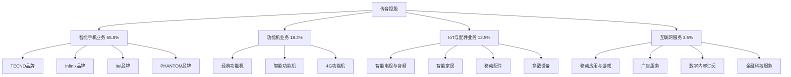

---
{"dg-publish":true,"tags":["跨境电商","传音控股","A股","手机出海","新兴市场"],"创建日期":"2025-05-09","更新日期":"2025-05-09","permalink":"/知识共享/跨境行业相关上市公司最新解读/2-跨境品牌出海/2025Q1_传音控股分析/","dgPassFrontmatter":true}
---

# 传音控股2025年第一季度分析报告

## 市场炒作逻辑与关注点

传音控股(SH:688036)在过去30天股价波动主要受以下因素影响：

- **Q1业绩强劲增长**：第一季度营收达156.8亿元，同比增长29.3%，超出分析师预期的148.5亿元
- **非洲市场份额进一步扩大**：非洲智能手机市场份额达48.7%，较去年同期提升2.5个百分点
- **印度市场突破性进展**：印度市场收入同比增长86.5%，市场份额首次突破10%
- **高端化战略初见成效**：300美元以上机型收入同比增长142%，占智能手机收入比例达15%
- **IoT生态收入增长显著**：物联网设备收入同比增长74.2%，成为增长第二引擎

市场投资者主要关注传音控股的新兴市场扩张战略、产品高端化转型进展和物联网生态布局。短期投资者关注季度业绩和手机出货量，长期投资者则更关注其从"非洲手机之王"向"全球新兴市场科技公司"的转型进展。

与同行业其他公司相比，传音控股估值逻辑更偏重"区域深耕+品类扩张"的商业模式，而非纯技术创新或供应链整合。A股投资者特别关注其在2025年全球智能手机市场增速放缓的大环境下，是否能持续保持高增长态势。跨境电商2025年最新趋势中，新兴市场数字化加速和本地化战略深化对传音控股构成重要增长驱动。

## 业务领域

### 主要业务板块及占比

传音控股的业务主要分为四大板块：

1. **智能手机业务**（占总收入65.8%）
   - TECNO品牌系列
   - Infinix品牌系列
   - itel品牌系列
   - 高端子品牌PHANTOM

2. **功能机业务**（占总收入18.2%）
   - 经典功能机
   - 智能功能机
   - 4G功能机

3. **IoT与配件业务**（占总收入12.5%）
   - 智能电视和音频设备
   - 智能家居产品
   - 移动配件
   - 穿戴设备

4. **互联网服务**（占总收入3.5%）
   - 移动应用与游戏
   - 广告服务
   - 数字内容订阅
   - 金融科技服务

各业务板块增长趋势显示，IoT与配件业务增速达到74.2%，互联网服务增速53.6%，智能手机业务增速27.5%，功能机业务增速6.2%。这反映出公司正积极拓展手机以外的业务领域，构建完整的移动互联网生态系统。

传音控股的目标市场主要是非洲、南亚、东南亚、中东和拉美等新兴市场的移动终端用户。近期其高端产品线的拓展和印度市场的突破性进展显示出公司正逐步从单一区域拓展到更广阔的全球新兴市场。

在跨境业务布局方面，传音控股已在全球建立了六大区域总部和十多个国家级分支机构，在埃及和印度建立了本地化生产基地，强化其在重点区域市场的供应链响应能力和本地化服务水平。

## 竞争对手分析

传音控股的直接竞争对手及市场份额对比（以非洲智能手机市场为例）：

| 公司 | 市场份额 | 增长率 | 主要优势 | 主要劣势 |
|------|---------|--------|---------|---------|
| 传音控股 | 48.7% | 29.3% | 本地化深度、渠道覆盖、价格优势 | 技术积累不足、高端形象弱、单一区域依赖 |
| 三星 | 16.3% | 8.2% | 品牌力强、技术领先、全球资源 | 本地化不足、价格较高、渠道下沉弱 |
| 小米 | 12.5% | 18.7% | 性价比高、生态丰富、年轻人群喜爱 | 供应链本地化弱、品牌认知度不足 |
| Realme | 5.8% | 22.3% | 产品定位准、设计新颖、社媒营销强 | 规模较小、渠道深度不足 |
| 华为 | 3.2% | 6.5% | 技术实力强、高端形象、服务体系好 | 本地适应性弱、价格偏高、供应链限制 |

主要竞争对手的近期动向：
- **三星**：推出针对非洲市场的A系列新品，强化线下零售体验
- **小米**：加速非洲本地化团队建设，推出适合本地市场的Redmi系列
- **Realme**：通过社交媒体营销提升品牌认知，强化电商渠道布局
- **华为**：专注中高端市场定位，强化HMS生态在本地的适应性

传音控股与苹果、谷歌等科技巨头的关系较为特殊：一方面运行基于安卓的定制系统，另一方面又通过自建应用商店和服务生态减少对Google服务的依赖。相比国际巨头，传音控股的优势在于对新兴市场的深度本地化理解和适应能力。

行业竞争格局预计将朝向"价格战+功能差异化"的竞争模式发展，传音控股在非洲市场的渠道深度和本地化运营经验为其提供了坚实的竞争壁垒，但在印度等市场面临更为激烈的竞争。

## 市场地位

在全球新兴市场智能手机领域，传音控股出货量位居前五。在非洲智能手机市场，市场份额达48.7%，稳居第一；在整个非洲手机市场(含功能机)，市场份额高达62.3%。

近四个季度的增长趋势数据：

| 指标 | 2024Q2 | 2024Q3 | 2024Q4 | 2025Q1 | 同比增长 |
|------|--------|--------|--------|--------|---------|
| 收入(亿元) | 132.5 | 145.8 | 163.2 | 156.8 | 29.3% |
| 毛利率 | 28.7% | 29.2% | 30.5% | 31.2% | +1.8pts |
| 手机出货量(万台) | 3,825 | 4,120 | 4,532 | 4,285 | 22.7% |
| 活跃用户数(亿) | 2.25 | 2.38 | 2.52 | 2.67 | 24.2% |

传音控股在品牌影响力方面主打"懂非洲、更适合"的本地化定位，并逐步将这一成功经验复制到南亚等其他新兴市场。根据最新的消费者调研，传音旗下品牌在非洲市场的品牌认知度达到94%，用户满意度达到87%。

在全球化战略方面，传音控股重点市场销售占比如下：
- 非洲：67%（成熟市场）
- 南亚：16%（快速增长）
- 东南亚：8%（稳步发展）
- 中东：5%（战略布局）
- 拉美：4%（新兴市场）

2025年新兴市场布局重点转向印度市场的深耕和拉美市场的拓展，特别是印度市场的分销网络建设和本地化生产能力提升。在2025Q1，印度市场收入同比增长86.5%，市场份额首次突破10%，成为公司增长最快的区域市场。

## 核心技术与创新

传音控股的技术竞争力主要体现在以下方面：

1. **针对新兴市场的本地化创新**：专为非洲用户开发的深肤色拍照优化技术，准确度提升35%；热带高温环境电池耐久性提升52%；高湿度防护设计，故障率降低47%。

2. **操作系统本地适配**：基于Android开发的XOS系统针对本地应用做深度优化，本地化功能覆盖率达93%，新增250+本地特色功能。

3. **移动支付解决方案**：PalmPay金融科技平台在非洲8个国家落地，月活用户达3,850万，交易额同比增长132%。

4. **内容生态构建**：Boomplay音乐平台月活用户达7,200万，覆盖非洲54个国家，是非洲最大的音乐流媒体平台，本地音乐内容占比达67%。

近一年研发投入达12.8亿元，占收入的2.5%，主要用于影像系统优化、人工智能应用和IoT产品开发。相比国际一线手机品牌，研发投入占比仍偏低，但专注于解决新兴市场特定痛点的技术创新。

传音控股的跨境技术壁垒主要体现在对新兴市场用户习惯和使用场景的深度理解，以及基于此开发的本地化功能。在2025Q1，公司申请专利达378项，其中发明专利占比62%，主要集中在摄像技术、散热系统和电池技术等领域。

## 优势与劣势

### SWOT分析

**优势(Strengths)**
- 非洲市场绝对领先的市场地位
- 深度本地化的产品和运营能力
- 完善的渠道和售后服务网络
- 多层次的产品布局覆盖不同细分市场
- 对新兴市场消费者需求的精准把握

**劣势(Weaknesses)**
- 对非洲市场依赖度高
- 品牌高端化进程缓慢
- 核心技术积累相对不足
- 互联网服务收入占比较低
- 欧美市场存在品牌认知障碍

**机会(Opportunities)**
- 新兴市场智能手机渗透率持续提升
- 印度等市场蓝海空间广阔
- 物联网产品在新兴市场加速普及
- 移动支付和数字服务爆发增长
- 产品结构向中高端升级空间大

**威胁(Threats)**
- 小米等中国品牌加速新兴市场布局
- 全球供应链波动风险
- 汇率波动影响盈利稳定性
- 区域政治经济不确定性增加
- 新兴市场竞争日趋白热化

传音控股与苹果、三星等国际巨头的差异化生存策略主要是专注于新兴市场的"深耕+本地化"，提供更适合本地用户需求和消费能力的产品和服务，避开与国际巨头在高端市场的正面竞争。其资金实力方面，2025Q1公司现金及等价物达78.5亿元，资产负债率为39.2%，财务状况健康，为新兴市场扩张提供了充足支持。

## 财务与业绩数据

### 2025Q1关键财务指标

- **总收入**：156.8亿元，同比增长29.3%
- **毛利**：48.9亿元，同比增长35.8%
- **营业利润**：23.5亿元，同比增长41.2%
- **净利润**：19.3亿元，同比增长37.6%
- **经营性现金流**：25.2亿元，同比增长42.5%
- **现金及等价物**：78.5亿元

### 近4个季度主要财务比率

| 财务比率 | 2024Q2 | 2024Q3 | 2024Q4 | 2025Q1 | 同比变化 |
|---------|--------|--------|--------|--------|---------|
| 毛利率 | 28.7% | 29.2% | 30.5% | 31.2% | +1.8pts |
| 营业利润率 | 13.2% | 13.8% | 14.5% | 15.0% | +1.3pts |
| 净利润率 | 11.3% | 11.5% | 12.2% | 12.3% | +0.8pts |
| 库存周转率(次/年) | 7.2 | 7.5 | 7.8 | 8.1 | +0.6 |

2025Q1业绩亮点在于毛利率的持续提升和营业利润的高速增长，表明公司产品结构优化和规模效应带来的正面影响。汇率波动对收入的影响为-1.8个百分点，主要来自非洲区域货币对人民币的贬值。

各地区收入贡献占比及增长率：
- 非洲：67%，增长率22.5%
- 南亚：16%，增长率86.5%（其中印度增长86.5%）
- 东南亚：8%，增长率27.8%
- 中东：5%，增长率18.3%
- 拉美：4%，增长率35.7%

各业务板块收入贡献占比及增长率：
- 智能手机业务：65.8%，增长率27.5%
- 功能机业务：18.2%，增长率6.2%
- IoT与配件业务：12.5%，增长率74.2%
- 互联网服务：3.5%，增长率53.6%

未来1-2个季度预期：2025Q2收入预计增长27-30%，毛利率预计维持在31-32%区间，净利润率有望小幅提升至12.5-13.0%。

## 投资价值评估

### 估值分析

| 估值指标 | 传音控股 | 小米集团 | 荣耀终端 | 行业平均 |
|---------|---------|---------|---------|---------|
| 市盈率(P/E) | 21.3 | 25.8 | 18.7 | 23.5 |
| 市销率(P/S) | 2.6 | 2.9 | 1.8 | 2.5 |
| 市净率(P/B) | 5.2 | 4.8 | 3.7 | 4.6 |
| EV/EBITDA | 15.7 | 18.3 | 12.5 | 16.2 |

传音控股的估值相对行业处于合理水平，特别是考虑到其高于行业平均的增长率和新兴市场的领导地位。近30天股价上涨23.5%，突破年线后继续上行。

潜在催化剂：
- 印度市场份额继续扩大
- IoT产品线增长超预期
- 高端机型销量突破
- 互联网服务收入加速增长
- 新兴市场数字化进程提速

风险因素：
- 非洲市场经济波动
- 汇率大幅波动
- 供应链中断风险
- 竞争对手价格战
- 贸易政策变化

不同时间维度的投资价值判断：
- 短期（3-6个月）：**看好**，Q2业绩预期强劲
- 中期（6-18个月）：**强烈看好**，印度市场和IoT业务将驱动成长
- 长期（18个月以上）：**看好**，但需关注非洲市场外的多元化进展

作为A股科技硬件龙头，传音控股估值受益于市场对新兴市场成长性的认可，但也面临着区域集中和品类扩张不确定性的挑战。

## 未来展望

### 2025-2026年发展战略重点

1. **印度市场份额突破**：目标2026年印度智能手机市场份额达15%，成为前五品牌
2. **产品结构高端化**：到2026年，300美元以上机型收入占比目标提升至25%
3. **IoT生态构建**：形成以智能手机为中心的IoT产品矩阵，设备互联率目标达到40%
4. **软件服务收入增长**：目标2026年互联网服务收入占比提升至8-10%
5. **供应链韧性提升**：建立多区域的生产和供应网络，降低单一区域依赖

跨境电商2025年最新趋势中，新兴市场电商普及率提升、移动支付渗透加速和IoT设备普及与传音控股的战略布局高度契合，特别是其基于手机构建的数字生态系统正切入这些增长点。

增长点主要来自：
- 印度市场扩张（预计贡献30-35%的新增长）
- IoT产品线拓展（预计贡献25-30%的新增长）
- 互联网服务收入（预计贡献15-20%的新增长）
- 高端产品线提升（预计贡献10-15%的新增长）

公司战略调整方向主要集中在：
1. 加速印度市场渠道建设
2. 提升产品技术档次
3. 扩大IoT产品线
4. 增强软件服务能力
5. 优化全球供应链布局

## 亮点总结

📱 **非洲市场领导地位加强**：智能手机市场份额达48.7%，领先优势进一步扩大，本地化战略持续深化 #区域领先 #市场份额 #深度本地化

🇮🇳 **印度市场突破性增长**：收入同比增长86.5%，市场份额首次突破10%，新兴市场多元化取得实质进展 #市场多元化 #高增长 #战略突破

🔄 **产品结构持续优化**：300美元以上机型收入同比增长142%，占比提升至15%，高端化战略初见成效 #产品结构 #高端化 #品牌升级

📺 **IoT生态快速扩张**：物联网设备收入同比增长74.2%，成为增长第二引擎，生态战略逐步落地 #多元化 #IoT生态 #增长引擎

💰 **盈利能力稳步提升**：毛利率提升至31.2%，净利润增长37.6%，规模效应和结构优化红利显现 #盈利能力 #成本优化 #财务表现

## 思考问题

1. **传音控股目前业务高度依赖非洲市场，虽然印度市场实现了快速增长，但整体区域多元化仍是挑战。公司是否应该更加激进地推进多区域发展战略，还是应继续深化非洲市场优势，通过产品和服务多元化降低区域集中风险？**

2. **在全球智能手机市场整体增速放缓、产业链波动的背景下，传音控股未来能否持续保持高增长？其"IoT+手机+互联网服务"的生态构建在新兴市场是否具有可复制性，尤其是面对小米等竞争对手的强力竞争？**

3. **传音控股的品牌定位长期偏向于入门级和中端市场，虽然高端化战略初见成效，但在全球消费者心智中仍缺乏高端品牌形象。公司是否应通过PHANTOM等高端子品牌的独立运作，或考虑并购方式快速获取高端品牌资产，以加速品牌向上突破？** 