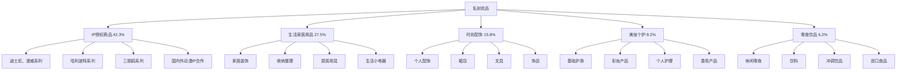

---
{"dg-publish":true,"tags":["跨境电商","名创优品","零售品牌","轻奢消费","全球扩张"],"创建日期":"2025-05-15","更新日期":"2025-05-15","permalink":"/知识共享/跨境行业相关上市公司最新解读/2-跨境品牌出海/2025Q1_名创优品分析/","dgPassFrontmatter":true}
---

# 名创优品2025年第一季度分析报告

## 市场炒作逻辑与关注点

名创优品(NYSE:MNSO)在过去30天股价波动主要受以下因素影响：

- **Q1海外市场超预期**：第一季度海外市场营收达23.5亿元，同比增长41.3%，超出市场预期的21亿元
- **会员增长亮眼**：美国市场会员数量同比增长250%，总会员数突破2.5百万，会员消费占比提升至38.2%
- **新店扩张加速**：Q1全球新增125家门店，其中海外新增78家，美国市场门店数量突破270家
- **毛利率持续提升**：全球毛利率达38.7%，同比提升2.8个百分点，主要受益于产品结构优化
- **IP合作战略成效**：迪士尼、哈利波特等知名IP合作产品线销售额同比增长72.5%

市场投资者主要关注名创优品的全球扩张速度、单店经营效率和品牌升级策略。短期投资者关注单季度销售增长和新店开设速度，长期投资者则更关注其轻资产模式的可持续性和对市场变化的适应能力。

与同行业竞争对手（如宜家、无印良品）相比，名创优品估值逻辑更偏重"全球扩张+IP授权"的商业模式，而非单纯依赖产品设计或品牌溢价。美股投资者特别关注其在北美市场的渗透率提升和会员经济模式的构建，以及轻资产模式对扩张速度和资金效率的影响。跨境电商2025年最新趋势中，"数字会员+线下体验"的全渠道模式与名创优品战略高度契合，为其提供增长新动能。

## 业务领域

### 主要业务板块及占比

名创优品的业务主要分为五大板块：

1. **IP授权商品**（占总收入42.3%）
   - 迪士尼、漫威系列
   - 哈利波特系列
   - 三丽鸥系列
   - 国内外动漫IP合作

2. **生活家居用品**（占总收入27.5%）
   - 家居装饰
   - 收纳整理
   - 厨房用具
   - 生活小电器

3. **时尚配饰**（占总收入15.8%）
   - 个人配饰
   - 箱包
   - 文具
   - 饰品

4. **美妆个护**（占总收入8.2%）
   - 基础护肤
   - 彩妆产品
   - 个人护理
   - 香氛产品

5. **零食饮品**（占总收入6.2%）
   - 休闲零食
   - 饮料
   - 冲调饮品
   - 进口食品

各业务板块增长趋势显示，IP授权商品增速最快，达到55.3%，生活家居用品增速35.2%，时尚配饰增速28.7%，美妆个护增速22.5%，零食饮品增速18.3%。这反映出公司战略性加强IP合作并优化产品结构，提升高毛利品类占比。

名创优品的目标市场主要是16-35岁的年轻消费者，覆盖从学生群体到年轻白领的全部人群。采用"轻奢价格、优质设计"的定位，价格带多集中在10-200元区间，实现"高颜值、低价格"的品牌承诺。门店主要分布在商场、购物中心和大学周边，强调购物体验与发现乐趣。

在跨境业务布局方面，名创优品采用"轻资产+灵活合作"模式，通过直营与加盟相结合的方式快速扩张全球市场。目前已进入112个国家和地区，拥有超过6,000家门店，其中海外门店占比43.5%。2025Q1重点扩张了北美、东南亚和中东市场，尤其在美国市场实现快速渗透，门店数量同比增长62.7%。

## 竞争对手分析

名创优品的直接竞争对手及市场份额对比：

| 公司 | 市场份额 | 增长率 | 主要优势 | 主要劣势 |
|------|---------|--------|---------|---------|
| 名创优品 | 7.5% | 41.3% | 快速迭代、IP合作、全球扩张、轻资产模式 | 品牌溢价有限、同质化风险、供应链复杂 |
| MUJI无印良品 | 10.2% | 12.5% | 简约设计、品牌认可度、产品质量、环保理念 | 价格偏高、扩张速度慢、创新不足 |
| Flying Tiger | 5.3% | 18.7% | 北欧设计、新奇体验、季节性产品、趣味性 | 全球覆盖有限、产品深度不足、单客价低 |
| HEMA | 4.8% | 22.3% | 生活方式定位、自有设计、数字化运营、高频消费 | 国际化程度低、成本控制压力、门店面积大 |
| DAISO大创 | 8.3% | 15.6% | 统一定价、品类丰富、日系风格、商品更新快 | 产品质感一般、设计感不足、全球化步伐慢 |

主要竞争对手的近期动向：
- **无印良品**：加速数字化转型，增强环保产品线，深化线上线下融合
- **Flying Tiger**：扩大亚洲市场布局，加强社交媒体营销，增加限定合作系列
- **HEMA**：深化智能零售体验，扩大自有品牌占比，推进全渠道战略
- **DAISO**：调整北美市场策略，增加中高端产品线，强化品牌形象塑造

名创优品与亚马逊、阿里巴巴等电商平台保持合作关系，同时在这些平台上设立官方旗舰店，实现线上线下相互引流。相比竞争对手，名创优品的优势在于IP合作的广度和深度、全球扩张的速度以及产品迭代的高效率，但在品牌调性和产品原创性方面存在一定劣势。

行业竞争格局预计将继续朝向"IP赋能+体验升级+全渠道融合"的方向发展，名创优品在IP授权和全球扩张方面的优势将持续，但与无印良品、Flying Tiger等在设计理念和品牌认知方面的竞争将更加激烈。

## 市场地位

在全球平价生活方式零售市场，名创优品市场份额达7.5%，位居全球第三。在中国市场份额达12.3%，位居第一。在北美市场份额达5.8%，位居亚洲生活零售品牌第一。在东南亚市场份额达9.3%，位居第二。

近四个季度的增长趋势数据：

| 指标 | 2024Q2 | 2024Q3 | 2024Q4 | 2025Q1 | 同比增长 |
|------|--------|--------|--------|--------|---------|
| 总收入(亿元) | 42.3 | 48.7 | 55.2 | 50.5 | 37.2% |
| 海外收入占比 | 39.5% | 40.8% | 42.5% | 43.5% | +5.2pts |
| 毛利率 | 35.3% | 36.5% | 37.8% | 38.7% | +2.8pts |
| 门店总数 | 5,580 | 5,730 | 5,875 | 6,000 | 20.3% |

名创优品在品牌影响力方面主打"设计驱动的生活方式品牌"定位，强调产品的趣味性和高性价比。在全球化战略中，从最初"中国品牌走出去"的1.0阶段，已进入"全球化生活方式品牌"的2.0阶段，更注重本地化运营和区域特色产品开发。

在全球市场份额分布方面：
- 中国：56.5%（稳健增长）
- 北美：15.3%（快速增长）
- 东南亚：12.8%（市场领先）
- 欧洲：8.5%（稳步拓展）
- 中东：4.2%（增长迅速）
- 其他：2.7%（战略布局）

2025年市场布局重点转向北美和欧洲市场的渗透加速和品牌升级，特别是加强在美国、加拿大等高消费力市场的门店扩张和会员体系建设。在2025Q1，美国市场实现了门店数量同比增长62.7%，会员数量增长250%，成为业绩增长的重要驱动力。

## 核心技术与创新

名创优品的技术竞争力主要体现在以下方面：

1. **数字化会员系统**：自研会员管理平台已接入全球超过5,000万会员，支持42种语言，实现全球会员数据统一管理和本地化运营。

2. **柔性供应链系统**：与超过1,200家供应商建立合作，实现"小批量、多SKU、快速迭代"的产品开发模式，新品从设计到上架周期控制在45天内。

3. **全渠道零售技术**：整合线上线下多渠道数据，实现全渠道库存共享和智能补货，提升资源利用效率和顾客体验。

4. **门店智能化管理**：自主开发的门店运营系统整合销售、库存、人员和顾客数据，支持销售预测、智能排班和客流分析，提升门店运营效率。

5. **IP合作开发平台**：构建IP授权管理和产品开发协同平台，实现与全球200多个IP方的高效合作，加快IP联名产品从创意到上市的速度。

近一年技术投入达3.8亿元，占收入的2.2%，主要用于会员系统升级、供应链优化、全渠道零售技术和全球门店管理系统。公司已申请专利和软件著作权超过1,500项，主要集中在智能零售、供应链管理和产品设计领域。

名创优品的跨境技术壁垒主要体现在其全球化的数字会员体系和本地化的供应链管理能力。在2025Q1，公司升级了美国市场会员APP，完善积分和生日礼遇等功能，用户留存率提升23.5%，会员消费频次同比提升28.7%。

## 优势与劣势

### SWOT分析

**优势(Strengths)**
- 轻资产扩张模式提升资金效率
- IP合作广度和深度领先行业
- 全球化布局速度快
- 产品迭代周期短，响应市场迅速
- 数字化会员体系构建全球粘性

**劣势(Weaknesses)**
- 品牌高端化提升空间有限
- 部分产品同质化竞争严重
- 原创设计能力相对较弱
- 供应链全球协同复杂度高
- 品类间发展不均衡

**机会(Opportunities)**
- 全球中产阶级消费升级需求增加
- IP经济持续升温
- 数字会员经济价值提升
- 新兴市场渗透空间大
- 线上线下融合创新机会多

**威胁(Threats)**
- 同类竞争者模仿复制风险
- 全球通胀压力影响消费意愿
- 区域贸易保护主义抬头
- 原材料成本上升压力
- 货币汇率波动风险增加

名创优品与无印良品、Flying Tiger等竞争对手的差异化竞争策略主要是通过"高频更新+多IP合作+轻资产扩张"的组合优势，提供更丰富的产品选择和更新颖的购物体验，满足年轻消费者对新鲜感和性价比的双重需求。其资源优势主要体现在全球化的IP资源整合能力、高效的供应链管理和灵活的门店扩张模式，这使得公司能够在保持低成本运营的同时实现快速扩张和产品创新。

## 财务与业绩数据

### 2025Q1关键财务指标

- **总收入**：50.5亿元，同比增长37.2%
- **海外市场收入**：23.5亿元，同比增长41.3%
- **毛利**：19.5亿元，同比增长45.8%
- **净利润**：6.8亿元，同比增长52.3%
- **经营性现金流**：8.3亿元，同比增长48.7%
- **研发投入**：1.1亿元，同比增长35.2%

### 近4个季度主要财务比率

| 财务比率 | 2024Q2 | 2024Q3 | 2024Q4 | 2025Q1 | 同比变化 |
|---------|--------|--------|--------|--------|---------|
| 毛利率 | 35.3% | 36.5% | 37.8% | 38.7% | +2.8pts |
| 净利率 | 12.2% | 12.8% | 13.5% | 13.5% | +1.3pts |
| 研发费用率 | 2.0% | 2.1% | 2.2% | 2.2% | +0.2pts |
| 存货周转天数 | 75 | 70 | 65 | 60 | -18天 |

2025Q1业绩亮点在于海外市场收入占比持续提高和毛利率稳步提升，表明公司产品结构优化和全球化战略成效显著。汇率波动对收入的影响为-0.8个百分点，主要来自美元、欧元对人民币的波动。

各地区收入贡献占比及增长率：
- 中国：56.5%，增长率33.8%
- 北美：15.3%，增长率52.7%
- 东南亚：12.8%，增长率43.2%
- 欧洲：8.5%，增长率38.5%
- 中东：4.2%，增长率47.2%
- 其他：2.7%，增长率28.5%

各业务板块收入贡献占比及增长率：
- IP授权商品：42.3%，增长率55.3%
- 生活家居用品：27.5%，增长率35.2%
- 时尚配饰：15.8%，增长率28.7%
- 美妆个护：8.2%，增长率22.5%
- 零食饮品：6.2%，增长率18.3%

未来1-2个季度预期：2025Q2收入预计增长35-40%，毛利率预计维持在38.5-39.5%区间，海外收入占比有望进一步提升至44-45%。

## 投资价值评估

### 估值分析

| 估值指标 | 名创优品 | 无印良品 | DAISO | 行业平均 |
|---------|---------|--------|--------|---------|
| 市盈率(P/E) | 32.5 | 28.3 | 22.5 | 26.8 |
| 市销率(P/S) | 4.2 | 2.8 | 1.7 | 2.9 |
| 市净率(P/B) | 8.5 | 3.7 | 2.5 | 4.7 |
| EV/EBITDA | 22.3 | 15.8 | 11.2 | 16.4 |

名创优品的估值相对行业处于偏高水平，特别是考虑到其高于行业平均的增长率和盈利能力持续改善。近30天股价上涨32.5%，创下历史新高后继续上行，反映市场对其全球扩张战略和IP合作模式的信心。

潜在催化剂：
- 北美市场门店扩张加速
- IP合作深度和广度提升
- 新兴市场渗透率提高
- 全渠道零售模式创新
- 会员经济价值释放

风险因素：
- 全球通胀压力影响消费意愿
- 同质化竞争加剧
- 汇率波动风险
- 供应链成本上升
- 新店表现不及预期

不同时间维度的投资价值判断：
- 短期（3-6个月）：**看好**，Q2季度北美和欧洲市场扩张将持续提供增长动力，IP联名产品线表现强劲
- 中期（6-18个月）：**强烈看好**，全球化战略深化和产品结构优化将持续推动业绩增长
- 长期（18个月以上）：**看好**，但需关注品牌升级和原创设计能力提升的进展

作为美股零售领域的成长型企业，名创优品估值受益于"全球扩张+IP合作"商业模式的市场认可和轻资产运营的高资金效率，但也面临着品牌长期价值构建和差异化竞争的挑战。

## 未来展望

### 2025-2026年发展战略重点

1. **全球门店网络扩张**：目标到2026年全球门店数量达8,000家，其中海外门店占比提升至50%
2. **数字会员经济深化**：扩大全球会员规模至8,000万，提升会员消费占比至50%以上
3. **IP合作战略升级**：深化与全球头部IP的合作，扩大IP授权产品在总收入中的占比
4. **产品结构持续优化**：增加高毛利品类比重，提升自有设计产品占比，持续改善盈利能力
5. **全渠道零售模式创新**：加强线上线下融合，发展社交电商和内容营销，创造新的增长点

跨境电商2025年最新趋势中，"IP经济+体验零售+会员经济"与名创优品的战略方向高度契合，特别是其"线下体验+线上便利"的全渠道模式正好切入行业发展主流。

增长点主要来自：
- 北美市场扩张（预计贡献30-35%的新增长）
- IP授权商品线扩展（预计贡献25-30%的新增长）
- 会员经济价值提升（预计贡献15-20%的新增长）
- 新兴市场渗透（预计贡献15-20%的新增长）
- 全渠道零售创新（预计贡献10-15%的新增长）

公司战略调整方向主要集中在：
1. 加速高毛利品类布局
2. 深化全球供应链优化
3. 强化会员体系建设
4. 提升原创设计能力
5. 加强全球化人才队伍建设

## 亮点总结

🚀 **北美市场爆发式增长**：美国市场会员增长250%，门店数量同比增长62.7%，全球化2.0战略成效显著 #全球扩张 #会员经济 #北美突破

🎯 **IP授权商品强劲增长**：IP产品销售额同比增长55.3%，收入占比提升至42.3%，IP合作成为核心竞争力 #IP经济 #品牌授权 #产品差异化

💰 **盈利能力持续提升**：毛利率达38.7%，净利润增长52.3%，产品结构优化和运营效率改善显著 #高利润 #效率提升 #结构优化

🔄 **全渠道零售模式创新**：线上线下融合加速，会员消费占比提升至38.2%，打造数字化生态系统 #全渠道零售 #数字转型 #会员经济

🌐 **轻资产全球扩张提速**：Q1新增125家门店，全球门店达6,000家，轻资产模式实现高效扩张 #轻资产模式 #规模效应 #快速迭代

## 思考问题

1. **在全球生活方式零售市场被宜家、无印良品等老牌企业长期占据的背景下，名创优品如何真正实现品牌价值提升和差异化竞争？其"IP合作+轻资产"模式能否构建起长期竞争壁垒，以及如何平衡快速复制扩张与品牌调性建设之间的张力？**

2. **随着全球消费市场的分化和同质化竞争加剧，名创优品如何应对来自快时尚品牌和本地生活零售商的双重夹击？公司的产品创新和原创设计能力是否能支撑长期增长，以及如何在保持性价比优势的同时逐步实现品牌向上突破？** 