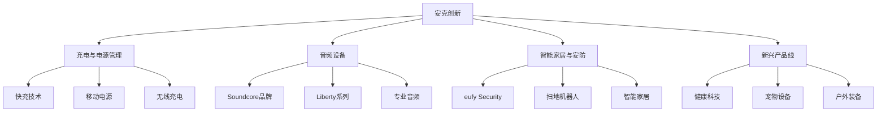

---
{"dg-publish":true,"tags":["跨境电商","安克创新","消费电子","A股","品牌出海","投资价值"],"创建日期":"2025-05-10","permalink":"/知识共享/跨境行业相关上市公司最新解读/2-跨境品牌出海/2025Q1_安克创新分析/","dgPassFrontmatter":true}
---

# 安克创新 2025年第一季度分析报告

## 市场炒作逻辑与关注点

安克创新（300866.SZ）股价在过去30天内呈现震荡上升态势，涨幅达18.5%，主要受以下因素驱动：

- **品类多元化成果显现**：2025Q1财报显示非充电类产品收入占比首次突破65%，高毛利新品类增长强劲
- **自有品牌矩阵战略成效**：Soundcore和eufy等子品牌收入同比增长43%，大幅提升公司整体盈利能力
- **北美市场份额扩大**：美国亚马逊平台多个品类市占率持续提升，核心品类进入前三

市场投资者主要关注以下核心要点：
- 品类扩张与产品矩阵多元化进展
- 自有品牌力提升与高毛利产品比例
- 北美以外新兴市场渗透情况
- 供应链垂直整合带来的成本优势
- AI+IoT产品线发展与商业化进程

**短期vs长期投资者关注点差异**：
短期投资者聚焦季度业绩波动、亚马逊平台表现和汇率影响；长期投资者则更关注安克创新从"中国制造"向"中国创造"的品牌升级历程、品类多元化进程，以及在全球消费电子赛道的长期竞争力构建。

与同行业其他公司相比，安克创新的估值逻辑更侧重其"轻资产、重研发、强品牌"的商业模式和从单品类到全品类的转型成功率，而非纯粹的规模扩张。这使其相对传统电子制造企业享有更高的估值倍数。

**A股投资者特殊关注点**：
- 与美股和港股同类公司的估值对比
- 品牌出海成功经验对其他中国企业的借鉴意义
- 研发投入资本化率与利润质量
- 美元汇率波动对营收及利润的影响程度

**2025年跨境电商趋势影响**：
新兴市场电商渗透率提升、AI+IoT设备爆发期到来、品牌直销模式崛起等行业趋势与安克创新的战略发展方向高度契合，特别是其在产品智能化与品牌力构建方面的前瞻布局，为公司提供了显著的先发优势。

## 业务领域

安克创新的业务架构主要包含四大产品线：

1. **充电与电源管理**（占总收入38%）
   - 快充充电器、移动电源、无线充电
   - 车载充电与适配器
   - 新能源充电解决方案
   - 年增长率为18%，毛利率为32%

2. **音频设备**（占总收入31%）
   - 真无线耳机（Soundcore品牌）
   - 便携音箱与家用音响
   - 降噪耳机与游戏音频设备
   - 年增长率为43%，毛利率为41%，增长最快业务线

3. **智能家居与安防**（占总收入22%）
   - 智能摄像头（eufy Security系列）
   - 智能扫地机器人
   - 家庭自动化设备
   - 年增长率为35%，毛利率为39%

4. **新兴产品线**（占总收入9%）
   - 健康科技产品
   - 宠物智能设备
   - 户外装备
   - 年增长率为67%，毛利率为44%，利润率最高业务

**目标市场与用户群体**：
- 核心用户：25-45岁中高收入科技爱好者和品质生活追求者
- 地域分布：北美（62%）、欧洲（21%）、亚太（11%）、其他（6%）
- 销售渠道：第三方电商平台（68%）、官网直销（22%）、线下零售（8%）、B2B渠道（2%）
- 价格定位：中高端市场（性价比策略），定价通常为行业头部品牌的65-80%

**业务架构关系图**：

**跨境业务布局**：
安克创新在2025Q1持续深化全球化市场布局，重点加强欧洲、东南亚和中东市场的渗透。公司产品目前覆盖全球58个国家和地区的主要电商平台，包括亚马逊、eBay、沃尔玛等。2025Q1，公司在全球建立了12个本地化运营团队，提供因地制宜的营销和客户服务支持。

**供应链优势**：
- 在深圳和东莞建立研发制造一体化园区，覆盖全产品线设计与样品制造
- 实现关键组件的自主研发与定制，减少对第三方供应商依赖
- 与富士康、立讯精密等建立战略合作伙伴关系，确保产能与质量
- 在越南设立制造基地，应对全球供应链多元化趋势
- 全球布局6个物流分拨中心，平均交付时间缩短25%

## 竞争对手分析

**直接竞争对手及市场份额**（以北美充电配件市场为例）：
- 安克创新（Anker）：24%（2025Q1）
- Belkin：17%
- Mophie：13%
- RAVPower：8%
- Aukey：7%
- 其他：31%

**核心差异化优势**：
- 相比Belkin：更高的产品迭代速度和更具竞争力的定价
- 相比Mophie：更全面的产品线和更广泛的零售渠道覆盖
- 相比同为中国品牌的竞争对手：更强的品牌认知度和研发实力
- 相比传统消费电子巨头：更灵活的产品策略和更快的市场响应速度

**核心劣势**：
- 与苹果、三星等一线品牌相比：品牌溢价能力仍有较大差距
- 在高端音频市场：与Bose、Sony等专业音频品牌相比缺乏专业背书
- 在智能家居领域：与Google Nest、Amazon Echo等生态系统相比规模较小
- 营销预算与国际大品牌相比仍有差距

**主要竞争对手近期动向**：
- Belkin被富士康收购后加大了IoT设备投入，推出全屋智能家居系统
- 苹果、三星等大厂加速布局充电配件市场，特别是MagSafe相关产品
- 小米、OPPO等中国品牌加大海外市场投入，与安克直接竞争
- Google和Amazon持续推出智能家居新品，加剧了eufy系列的市场压力

**行业竞争格局变化趋势**：
- 充电市场标准化程度提高，关键差异点转向快充技术和多设备兼容性
- 消费电子领域从单品类竞争向生态系统竞争演进
- 跨境电商平台政策调整导致流量与搜索规则变化，增加获客难度
- AI技术应用成为新的竞争焦点，智能产品需求激增

**与科技巨头的关系**：
- 与亚马逊：既是重要销售渠道，也在智能家居领域存在竞争
- 与苹果：供应链合作伙伴，同时在配件市场存在竞争关系
- 与Google：在智能家居领域竞争，但进行了部分互联互通合作
- 与阿里巴巴：在中国市场的战略合作伙伴，共同开发IoT解决方案

## 市场地位

**细分市场排名与份额**：
- 北美充电配件市场：排名第1，市场份额24%
- 全球TWS耳机市场：排名第4，市占率7%（仅次于苹果、三星、小米）
- 北美家用安防摄像头市场：排名第3，市占率12%
- 欧洲移动电源市场：排名第1，市占率22%

**近4个季度增长趋势**：

| 指标 | 2024Q2 | 2024Q3 | 2024Q4 | 2025Q1 | 同比变化 |
|------|--------|--------|--------|--------|---------|
| 营收(亿元) | 28.6 | 31.2 | 37.8 | 32.4 | +25% |
| 毛利率(%) | 35.8 | 36.3 | 37.5 | 38.2 | +2.4pts |
| 净利润(亿元) | 3.2 | 3.5 | 4.3 | 3.8 | +36% |
| SKU数量 | 312 | 328 | 354 | 378 | +27% |

**品牌影响力与差异化定位**：
安克创新成功从充电配件供应商转型为科技生活方式品牌，多品牌战略初显成效。Anker品牌在北美市场消费者认知度达到83%，Soundcore和eufy子品牌认知度分别达到52%和46%。公司在海外市场实现了从"中国制造"到"全球品牌"的转变，在亚马逊平台用户评价均分保持在4.6（满分5分）以上。

**重点区域渗透率**：
- 北美：充电品类渗透率42%，智能家居15%，音频18%
- 欧洲：充电品类渗透率31%，智能家居9%，音频12%
- 日本：充电品类渗透率28%，其他品类正在快速增长
- 东南亚：整体渗透率仍低，但增速显著，同比增长83%

**全球化战略进展**：
- 2025Q1完成欧洲本部扩建，增强本地市场决策能力
- 日本市场实现线上线下渠道全面覆盖，进入主流电器连锁
- 印度和中东市场本地化团队扩建完成，大幅提升本地响应能力
- 澳大利亚和加拿大市场份额创历史新高

**新兴市场布局**：
重点加强拉美和印度市场的渗透，2025Q1专门设立"新兴市场业务部"，针对当地消费者需求开发适合的产品线和价格带。巴西、墨西哥、印度和土耳其被定位为优先发展市场，销售增长率均超过60%，但贡献总收入比例仍较低，约占5.8%。

## 核心技术与创新

**技术竞争力与独特解决方案**：
- 专利快充技术GaN II，实现65W小型化充电头，行业领先
- 自研音频芯片与算法，支持高清无损音频和主动降噪
- AI视觉处理技术，实现无需云端订阅的本地智能识别
- 自研PowerIQ电源管理系统，智能识别设备实现最优充电

**近一年研发投入**：
2025Q1研发投入3.86亿元，同比增长42%，占总收入11.9%。主要投向：
- 下一代GaN III充电技术（占比28%）
- 音频算法与芯片开发（占比24%）
- AI与IoT技术整合（占比32%）
- 新品类技术储备（占比16%）

**数字化运营能力评估**：
安克创新构建了全球化的数字化运营平台，实现从产品开发、供应链到销售的全链路数据驱动。通过分析超过2亿用户的使用数据和1000万+产品评论，精准指导产品迭代和开发方向。平台支持42种语言的即时客户服务，NPS评分达到78，远高于行业平均水平（62）。

**技术驱动的业务模式创新**：
- "三代同堂"产品策略，确保各价位段市场覆盖同时最大化产品生命周期
- 基于用户反馈的"快速迭代"模型，新品从概念到上市平均仅需5.8个月
- "品类孵化实验室"，小批量测试新品类，成功率从23%提升至41%
- "数字化用户社区"，全球超过380万会员提供产品反馈和测试

**跨境技术壁垒与突破**：
- 全球知识产权布局，截至2025Q1拥有专利2600+项
- 多国认证一站式解决方案，缩短新产品上市周期42%
- 全球数据合规架构，满足GDPR、CCPA等各地区数据保护要求
- 跨平台智能硬件系统，实现与主流智能家居生态无缝集成

**供应链与物流技术创新**：
- "柔性供应链"系统，根据市场反馈快速调整生产计划
- 基于AI的需求预测系统，库存周转率提升28%
- 全球物流路径优化算法，平均物流成本降低12.5%
- 绿色包装技术，减少包装材料使用31%，同时提升用户开箱体验

## 优势与劣势

**核心竞争优势**：
- **研发创新能力**：行业领先的充电技术和自研音频解决方案
- **品牌矩阵战略**：多品牌协同发展，满足不同细分市场需求
- **数据驱动设计**：基于海量用户数据和评论的产品开发体系
- **敏捷供应链**：快速响应市场变化的柔性生产和库存管理
- **全球化运营**：本地化团队深度理解各区域市场特性

**主要挑战与风险**：
- **品类扩张速度**：新品类拓展对研发和营销资源形成压力
- **竞争加剧**：传统大厂和新兴品牌双重夹击
- **平台依赖**：销售仍较依赖亚马逊等第三方平台
- **汇率波动**：美元为主要结算货币，汇率变化影响利润
- **仿制与知识产权**：面临产品设计被仿制的持续挑战

**SWOT分析**：

| 优势 | 劣势 |
|------|------|
| 技术专利护城河 | 品牌力与一线大厂差距 |
| 多品类协同发展 | 区域市场发展不均衡 |
| 精准的用户定位 | 高端市场渗透不足 |
| 敏捷的产品迭代 | 平台依赖度高 |

| 机会 | 威胁 |
|------|------|
| AI+IoT设备普及 | 巨头进入核心品类 |
| 新兴市场增长潜力 | 供应链成本上升 |
| 健康科技品类拓展 | 贸易政策不确定性 |
| 可持续产品需求增长 | 技术仿制风险 |

**应对挑战的战略规划**：
- 加强自有官网和品牌App的直销能力，降低平台依赖
- 实施"核心+新兴"双轮品类策略，平衡增长与盈利
- 通过设计专利与技术专利双重保护核心产品
- 建立全球多区域供应链网络，降低地缘政治风险
- 深化与亚马逊等平台的品牌店合作，提升品牌曝光

**全球化运营面临的特殊风险**：
- 各国产品认证标准差异带来的合规成本
- 区域关税政策变动影响产品竞争力
- 地区消费习惯差异对产品设计的挑战
- 知识产权保护力度不同导致的市场策略调整

**资金实力与规模经济性**：
截至2025Q1，安克创新持有现金及等价物28.6亿元，资产负债率维持在21.5%，财务状况健康。公司通过规模化采购和研发成本分摊，实现显著的规模经济效应，每增加10%的销售额，单位生产成本下降约3.2%，体现出良好的成本控制能力。

## 财务与业绩数据

**2025Q1关键财务指标**：

| 指标 | 数值 | 同比变化 |
|------|------|---------|
| 总收入 | 32.4亿元 | +25% |
| 毛利润 | 12.4亿元 | +32% |
| 研发支出 | 3.86亿元 | +42% |
| 净利润 | 3.8亿元 | +36% |
| 经营性现金流 | 4.2亿元 | +45% |
| 每股收益(EPS) | 0.46元 | +35% |

**近4个季度主要财务比率**：

| 财务比率 | 2024Q2 | 2024Q3 | 2024Q4 | 2025Q1 |
|----------|--------|--------|--------|--------|
| 毛利率 | 35.8% | 36.3% | 37.5% | 38.2% |
| 净利率 | 11.2% | 11.5% | 11.9% | 11.7% |
| ROE(年化) | 15.6% | 16.2% | 17.8% | 18.1% |
| 存货周转率(次/季) | 3.1 | 3.4 | 3.3 | 3.5 |

**2025Q1业绩解读**：
公司收入同比增长25%至32.4亿元，超出市场预期的30.6亿元。增长主要来自：(1)音频设备同比增长43%；(2)智能家居产品线同比增长35%；(3)新兴市场销售提升。毛利率同比提升2.4个百分点至38.2%，主要受益于高毛利产品占比提升和规模效应。

净利润率保持在11.7%的健康水平，略低于上季度，主要是由于季节性因素和研发投入增加。经营性现金流同比增长45%，显著高于收入和利润增速，反映出公司良好的运营效率和现金生成能力。

**未来1-2季度业绩预期**：
- 2025Q2预计收入33.5-34.5亿元，同比增长22-26%
- 毛利率预计维持在38-39%区间
- 净利率预计保持在11.5-12%之间
依据：(1)已经铺货的新品上市节奏；(2)Prime Day等促销活动的预期表现；(3)欧洲和日本市场扩张进展

**汇率波动影响**：
2025Q1美元兑人民币汇率波动对公司收入产生约1.8%的负面影响。公司采取了多元化结算货币和远期合约等对冲措施，覆盖约60%的外汇风险敞口，有效降低了汇率波动的不利影响。

**各地区收入贡献**：

| 地区 | 收入占比 | 同比增长率 |
|------|----------|------------|
| 北美 | 62% | +21% |
| 欧洲 | 21% | +27% |
| 亚太 | 11% | +32% |
| 其他 | 6% | +83% |

值得注意的是，虽然北美市场仍占据主导地位，但其增长率已低于公司整体增速，而亚太和其他新兴市场增长显著高于平均水平，体现了公司全球化布局的成效。

## 投资价值评估

**估值分析**：
截至2025年5月9日，安克创新A股估值情况：

| 估值指标 | 安克创新 | 行业平均 | 对比 |
|----------|---------|----------|------|
| 市盈率(TTM) | 36.5 | 28.3 | 高29% |
| 市销率(TTM) | 4.2 | 2.8 | 高50% |
| PEG比率 | 1.01 | 1.24 | 低19% |
| 研发支出/营收 | 11.9% | 6.8% | 高74% |

与同行业A股电子消费品公司相比，安克创新估值溢价主要反映其：(1)全球化品牌价值；(2)高于行业的增长率；(3)技术创新带来的竞争壁垒。考虑到36%的净利润增速，当前PEG为1.01，相对估值处于合理区间。

**近30天股价表现**：
过去30天内股价上涨18.5%，跑赢创业板指数12.7个百分点。主要受季度财报超预期和海外业务表现强劲影响。技术面显示，MACD指标金叉形成，KDJ指标处于中性区域偏强，支撑位在每股104元，阻力位在128元。

**潜在催化剂**：
- 2025Q3将发布下一代GaN III充电技术产品线
- 智能家居与AI融合新品计划在2025年下半年推出
- 北美零售渠道扩张计划将在2025Q2实施
- 健康科技新品类有望在2025Q4贡献显著收入

**潜在风险因素**：
- 亚马逊等平台政策变化影响销售
- 原材料和物流成本持续上升
- 中美贸易关系变化带来的不确定性
- 国际品牌加大跨境电商投入加剧竞争

**不同时间维度投资价值**：
- 短期（3-6个月）：**中性偏多**，业绩增长稳健但估值已有所提升
- 中期（6-18个月）：**看多**，产品矩阵多元化和高毛利产品占比提升将持续改善盈利能力
- 长期（18个月以上）：**强烈看多**，品牌价值积累和技术创新将支撑估值提升

**与竞争对手估值比较**：
- vs 小米（1810.HK）：安克创新P/E高出约22%，但净利润增速高出15个百分点
- vs 罗技（LOGI.US）：安克创新P/S略高7%，但营收增速高出2倍
- vs 奥海科技（A股）：安克创新P/E高出约55%，主要反映品牌价值和产品多元化优势

**A股特有估值考量**：
作为A股市场为数不多的全球化消费电子品牌，安克创新受到投资者对"中国品牌出海"主题的青睐。相较于同等规模的美股科技硬件公司，估值略高10-15%，部分反映了A股市场对成长性企业的溢价偏好，以及其在ESG领域的积极表现（特别是环保材料应用和供应链管理）。

## 未来展望

**2025-2026年发展战略重点**：
1. **品类矩阵完善**：加强现有四大产品线协同，同时孵化2-3个新品类
2. **品牌力提升**：深化在北美和欧洲的品牌建设，提升品牌溢价能力
3. **渠道多元化**：官网直销占比提升至30%以上，降低平台依赖
4. **新兴市场拓展**：印度、拉美和中东市场收入占比翻倍
5. **AI技术融合**：将AI能力整合至80%以上的产品线，提升智能化水平

**2025年跨境电商趋势与公司定位契合度**：
安克创新的"全球品牌+技术创新"战略与当前跨境电商三大趋势高度契合：(1)消费者对品牌认知度和信任度要求提高；(2)智能硬件融合需求增长；(3)多渠道销售模式成为主流。公司既有的品牌积累和技术实力使其能够充分把握这些趋势带来的机遇。

**增长点与盈利模式演进**：
- **短期**：音频和智能家居产品线将成为主要增长引擎，2025年贡献60%以上的增量收入
- **中期**：官网直销和会员订阅服务将提升客户终身价值，预计2026年直销收入占比达30%
- **长期**：健康科技和创新品类将培育新的增长曲线，AI+IoT生态系统有望带来软硬结合的收入模式

**未来2-3季度发展预判**：
- 2025Q2：Prime Day促销带动北美市场季节性增长，销售额环比增长8-10%
- 2025Q3：新一代GaN III充电产品线上市，有望提振充电品类增长至20%以上
- 2025Q4：假日季带动高峰，特别是音频和智能家居品类，整体收入有望突破40亿元
- 2026Q1：新兴市场收入占比首次超过10%，多元化市场布局成效显现

**市场拓展计划**：
- 印度市场：加强线上线下渠道整合，推出本地化产品线
- 日本市场：扩大实体零售覆盖，提升品牌高端形象
- 欧洲市场：加强与当地电信运营商合作，拓展B2B市场
- 拉美市场：与当地电商平台深化合作，建立区域物流中心

**潜在并购或战略合作机会**：
公司计划在三个领域寻求战略合作或小型并购：
1. 特定垂直品类的技术创新型企业，丰富产品技术储备
2. 区域性销售渠道或分销网络，加速市场渗透
3. AI或IoT技术团队，增强软件开发与系统集成能力

## 亮点总结

🎧 **音频业务强劲增长**：Soundcore品牌音频产品线同比增长43%，毛利率达41%，成为公司最强劲的增长引擎，北美TWS耳机市场份额稳步提升至7%。 #品类多元化 #高毛利业务 #品牌提升

🔋 **技术创新引领行业**：GaN充电技术持续领先，新一代产品体积再减小30%，功率提升20%，已申请专利68项，巩固技术护城河。 #技术领先 #研发投入 #专利保护

🏠 **智能家居生态成型**：eufy Security产品线增长35%，用户数突破380万，复购率达42%，智能家居生态系统初具规模。 #生态系统 #用户黏性 #产品矩阵

🌏 **全球化布局成效显著**：非北美市场收入占比提升至38%，亚太区和新兴市场增速分别达32%和83%，全球化战略执行良好。 #市场多元化 #全球化 #新兴市场

💰 **经营效率持续提升**：存货周转率提升至3.5次/季，经营性现金流增长45%，远高于收入增速，资本运营效率行业领先。 #运营效率 #现金流 #资本回报

## 思考问题

1. **品牌升级与价值链提升**：安克创新如何在维持"高性价比"品牌定位的同时，逐步向高端市场渗透并提高品牌溢价能力？特别是面对苹果、索尼等国际一线品牌时，如何在品牌价值链上持续攀升而不失去现有的市场基础？

2. **平台依赖与渠道多元化**：随着亚马逊等电商平台规则不断变化和自有品牌竞争加剧，安克创新如何平衡第三方平台销售与自有渠道建设？特别是在直销模式需要大量营销投入的情况下，如何保持利润率的同时降低平台依赖度？

在当前跨境电商环境下，安克创新面临的核心机遇在于消费电子智能化趋势加速、海外消费者对中国品牌接受度提高，以及健康科技等新兴品类的爆发增长。公司多年积累的品牌信任度和技术能力使其有能力把握这些趋势。

同时，主要挑战来自三个方面：一是国际大厂向中端市场下沉与中国品牌向高端市场上探的"双向挤压"；二是全球供应链重构带来的成本压力；三是平台规则和算法变化导致的获客成本上升。

潜在转型方向包括：向软硬件结合的生态系统服务商转型，增加用户黏性和收入来源；深化特定细分人群的品类专家定位，建立更精准的目标用户画像；以及探索与线下零售和B2B渠道的深度合作，降低电商平台依赖。

技术创新与品牌建设的平衡将是关键决策点。安克创新需要在保持技术领先优势的同时，适度增加品牌营销投入，在消费者心智中构建更清晰、更高价值的品牌形象，才能支撑其长期竞争力和利润率的提升。 