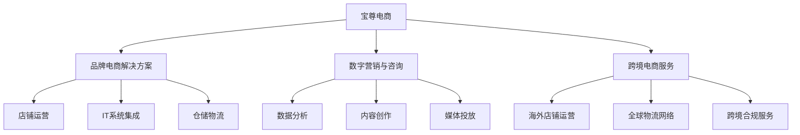

---
{"dg-publish":true,"tags":["跨境电商","宝尊电商","品牌出海","电商服务商","投资分析"],"创建日期":"2025-05-18","permalink":"/知识共享/跨境行业相关上市公司最新解读/2-跨境品牌出海/2025Q1_宝尊电商分析/","dgPassFrontmatter":true}
---

# 宝尊电商 (Baozun Inc.) 2025年第一季度分析报告

## 市场炒作逻辑与关注点

宝尊电商（BZUN.NASDAQ/09991.HK）股价在过去30天内上涨约9.5%，跑赢纳斯达克指数，主要受以下因素影响：

- **品牌出海业务增长加速**：2025Q1财报显示跨境电商服务收入同比增长35%
- **数字化转型服务收入占比提升**：数字营销与咨询服务收入占比提升至27%
- **回购计划及香港二次上市价值显现**：完成5000万美元回购计划并宣布新一轮回购

市场投资者主要关注以下核心要点：
- 品牌出海业务发展速度及利润贡献
- 非天猫平台业务多元化程度及增长潜力
- 数字化服务转型进展及高附加值业务占比
- 全球化布局与新兴市场拓展情况
- 技术研发投入与自动化水平提升

**短期vs长期投资者关注点差异**：
短期投资者聚焦季度GMV增速、新客户获取节奏及毛利率变化；长期投资者则更关注服务模式升级、品牌出海网络布局及全链路服务能力构建进展。

与同行业其他公司相比，宝尊电商的估值逻辑更侧重其向高附加值服务转型的进展，以及从国内品牌服务商向全球化品牌电商基础设施提供商的转变潜力。

**美股/港股投资者特殊关注点**：
- 中概股监管环境变化及合规成本影响
- 港股二次上市后的流动性改善及估值重估
- 全球电商平台多元化布局进展
- 与国际品牌服务商的竞争对比分析
- ESG表现尤其是在供应链透明度方面的进展

**2025年跨境电商趋势影响**：
随着中国品牌加速出海和全球电商基础设施升级需求增加，宝尊作为跨境电商全链路服务商，受益于品牌在海外新兴市场的渠道建设需求。公司积极布局的数字化营销工具与全球化仓储物流网络与2025年跨境电商整合优化趋势高度契合。

## 业务领域

宝尊电商的业务架构主要围绕"国内+海外"双市场、"服务+技术"双驱动模式展开：

1. **品牌电商解决方案**（占总收入62%）
   - 店铺运营与客户服务
   - 视觉设计与内容创作
   - 仓储物流与订单履约
   - 年增长率为18.5%，毛利率为34.8%

2. **数字营销与咨询服务**（占总收入27%）
   - 社交媒体营销
   - 数据分析与消费者洞察
   - 品牌战略咨询
   - 年增长率为32.3%，毛利率为56.5%

3. **跨境电商服务**（占总收入11%）
   - 全球市场进入策略
   - 跨境支付与物流解决方案
   - 多语言客户服务
   - 年增长率为35.4%，毛利率为42.7%

**目标客户与品类分布**：
- 核心客户：全球中高端消费品牌
- 品类分布：服饰鞋包（42%）、美妆个护（25%）、3C数码（15%）、家居生活（12%）、其他（6%）
- 客户规模：大型国际品牌（35%）、中型本土品牌（45%）、新兴DTC品牌（20%）
- 服务区域：中国大陆（68%）、东南亚（15%）、欧洲（9%）、北美（5%）、其他（3%）

**产品矩阵关系图**：

**跨境业务布局**：
宝尊电商已在新加坡、韩国、日本、英国和美国设立分支机构，构建全球化运营网络。2025Q1公司重点强化了东南亚跨境服务能力，在印尼、马来西亚和泰国建立本地运营团队，为中国品牌出海提供从市场调研、本地化策略到渠道搭建的一站式服务。在欧洲市场，公司与主要电商平台建立了战略合作关系，为中国品牌提供亚马逊、Zalando等平台的入驻与运营服务。

**技术与解决方案**：
- 自研SaaS平台"Cloud-X"支持全渠道订单管理和库存协同
- 智能仓储系统整合WMS与自动化设备，提升履约效率
- 数据中台整合多平台数据，提供消费者洞察和决策支持
- 智能客服系统支持24小时多语言客户服务，覆盖15种语言
- 全球化支付解决方案支持50多种支付方式，合规覆盖主要市场

## 竞争对手分析

**直接竞争对手及市场份额**（以中国品牌出海服务市场为例）：
- 宝尊电商：14.5%
- 丽人丽妆：9.8%
- 兰亭集势：7.4%
- 若羽臣：5.6%
- 其他传统代运营：62.7%

**核心差异化优势**：
- 相比丽人丽妆：覆盖品类更广，服务范围不限于美妆个护
- 相比兰亭集势：技术平台更成熟，自动化和数据分析能力更强
- 相比若羽臣：全球化布局更完善，跨境服务能力更强
- 相比传统代运营：数字化转型更深入，服务体系更标准化

**核心劣势**：
- 与国际电商服务巨头相比：全球网络覆盖不足，高端客户占比低
- 在东南亚市场：本地化团队规模小，与本土服务商相比缺乏深度本地洞察
- 品牌直接触达能力有限，部分渠道仍依赖第三方平台
- 技术研发投入占比低于国际领先对手

**主要竞争对手近期动向**：
- 丽人丽妆加大向东南亚美妆市场扩张，尤其是在印尼和泰国市场
- 兰亭集势通过收购本地物流公司强化欧洲市场配送能力
- 若羽臣加大短视频电商和社交电商工具开发
- 国际服务商如Digital River加大亚洲市场投入，增强本地竞争

**行业竞争格局变化趋势**：
- 行业集中度逐步提高，头部服务商优势逐渐扩大
- 服务模式从简单代运营向全链路数字化服务转型
- 平台依赖度降低，全渠道服务能力成为核心竞争点
- 区域专注型服务商与全球化服务商形成差异化竞争
- 技术赋能成为行业发展主线，投入强度决定未来竞争力

**与阿里巴巴、亚马逊等巨头的关系**：
宝尊既是阿里生态的核心服务商，也是亚马逊平台的重要合作伙伴。与阿里巴巴保持战略合作关系，是天猫六星级服务商；同时作为亚马逊全球开店授权服务商，为中国品牌提供全球市场进入服务。公司采取"平台中立"策略，既服务于传统电商平台，也布局社交电商和垂直电商渠道，为品牌提供多元化渠道组合方案。

## 市场地位

**细分市场排名与份额**：
- 中国品牌电商代运营市场：排名第1，市场份额14.5%
- 东南亚品牌出海服务市场：排名第3，市占率9.2%
- 全球化DTC品牌服务市场：排名第5，市场份额6.8%
- 数字营销与消费者洞察服务：排名第4，市场份额8.5%

**近4个季度增长趋势**：

| 指标 | 2024Q2 | 2024Q3 | 2024Q4 | 2025Q1 | 同比变化 |
|------|--------|--------|--------|--------|---------|
| 总收入(亿元) | 22.6 | 23.4 | 26.8 | 23.5 | +21.8% |
| 毛利率(%) | 38.2 | 39.1 | 40.4 | 41.5 | +3.2pp |
| 净利润(亿元) | 0.92 | 1.05 | 1.46 | 1.12 | +38.3% |
| 服务品牌数量 | 358 | 372 | 386 | 405 | +18.1% |

**品牌影响力与客户构成**：
宝尊在中高端品牌服务领域建立了领先地位，服务超过400个国内外知名品牌。2025Q1新增19个品牌客户，其中国际品牌7个、国内品牌12个。客户留存率达到93%，核心客户平均合作年限6.2年。公司品牌定位为"全球化品牌电商基础设施提供商"，逐步从单纯的代运营商向战略咨询伙伴转型，深度参与品牌全球化战略规划。

**重点区域渗透情况**：
- 中国大陆：覆盖天猫、京东、抖音等全主流平台，渗透率领先
- 东南亚：在新加坡、马来西亚、印尼、泰国建立本地团队，增长最快区域
- 欧洲：英国伦敦设有区域中心，覆盖西欧主要国家市场
- 北美：美国纽约设有业务中心，主要覆盖亚马逊平台及DTC渠道

**全球化战略进展**：
- 2025Q1在印尼雅加达设立东南亚运营中心，团队规模达85人
- 收购英国本地数字营销机构，强化欧洲市场本地化能力
- 与日韩主要电商平台建立战略合作，打通东亚市场渠道
- 建立覆盖12个国家的全球仓储网络，优化跨境物流效率

**服务能力提升**：
公司近年来持续强化全链路服务能力，从单一渠道代运营向全渠道、全链路服务转型。2025Q1强化了数字化营销能力，推出"Global Insights"数据分析平台，整合全球12个主要市场的消费者数据，支持品牌实时优化市场策略。自有仓储面积达25万平方米，全球物流网络覆盖50个国家，跨境订单48小时交付覆盖率达85%。

## 核心技术与创新

**技术竞争力与独特解决方案**：
- 自研"Omni-X"全渠道管理系统，实现多平台订单与库存协同
- "AI-Curator"内容生成系统，支持多语言、多平台内容自动化生产
- "Cross-Border Suite"跨境电商一体化解决方案，覆盖全球支付、物流和合规
- 智能客服系统支持15种语言实时翻译，问题解决率提升30%
- 订单智能路由系统，基于目的地、成本和时效自动选择最优物流路径

**近一年技术投入**：
2025Q1研发投入2.35亿元，同比增长43%，占总收入10%。主要投向：
- 云基础设施与微服务架构（占比30%）
- 人工智能应用与数据分析（占比28%）
- 全渠道订单管理系统（占比22%）
- 全球物流网络优化（占比12%）
- 安全与合规技术（占比8%）

**数字化运营能力**：
公司建立了面向全球电商平台的数据整合中台，每日处理超过5000万条交易和消费者行为数据。"Brand Analytics"平台提供实时销售预测、库存优化和营销效果分析，帮助品牌实现精准决策。2025Q1推出的"Smart Inventory"系统使客户库存周转率平均提升18%，缺货率下降35%。

**技术驱动的服务创新**：
- "Local Insight"本地化推荐引擎，基于各市场消费者行为自动调整产品展示策略
- "Auto-PO"智能补货系统，根据销售预测和库存水平自动生成采购建议
- "Multi-language Campaign"营销活动自动化工具，支持一键多语言、多地区活动发布
- "Returns Intelligence"退货分析系统，识别退货模式并提供改进建议
- "Cross-Market Testing"跨市场测试平台，支持产品在多个市场同步小规模测试

**跨境技术壁垒**：
宝尊通过多年积累构建了一系列跨境电商技术壁垒，包括全球支付合规系统、多语言内容管理平台、跨境物流优化算法和全球税务合规引擎等。这些技术解决方案有效降低了品牌出海的技术门槛和合规风险，形成了较高的竞争壁垒和客户粘性。

## 优势与劣势

**核心竞争优势**：
- **技术平台优势**：自研电商SaaS系统覆盖全链路运营，技术成熟度领先同行
- **品牌客户资源**：服务超过400个中高端品牌，客户质量和忠诚度高
- **全球服务网络**：已建立覆盖亚洲、欧洲和北美的运营体系
- **全链路服务能力**：从品牌策略、渠道建设到物流履约的端到端服务
- **规模化效应**：交易规模大，议价能力强，单位运营成本低

**主要挑战与风险**：
- **天猫平台依赖**：尽管多元化进展顺利，但天猫业务仍占较大比重
- **国际化人才缺口**：全球化扩张速度快，高端国际化人才不足
- **服务标准化与定制化平衡**：规模扩大后难以保持高度定制化服务
- **新兴平台布局滞后**：在TikTok等新兴全球社交电商平台布局不足
- **高端咨询服务能力不足**：与国际咨询公司相比，战略服务深度有限

**SWOT分析**：
- **优势(S)**：技术平台成熟、品牌客户资源丰富、全链路服务能力强、全球化网络初具规模
- **劣势(W)**：平台依赖度高、全球化人才缺口、高端咨询能力不足、新兴渠道布局滞后
- **机会(O)**：中国品牌加速出海、DTC模式崛起、新兴市场电商渗透率提升、全球供应链重构
- **威胁(T)**：国际巨头下沉市场、汇率风险、地缘政治不确定性、全球数据合规要求提高

**应对挑战的战略措施**：
- 加快全渠道布局，降低对单一平台依赖
- 建立全球化人才培养体系，加速本地化团队建设
- 强化技术平台标准化，提升服务效率与一致性
- 加大对新兴社交电商平台的布局投入
- 通过合作与并购提升战略咨询服务能力

**全球化运营面临的特殊风险**：
- 不同市场电商平台规则和消费者行为差异显著
- 跨境数据合规要求日益严格，数据安全风险增加
- 国际贸易摩擦对跨境电商物流和关税的影响
- 多语言多文化环境下的内容管理与品牌一致性挑战
- 汇率波动对跨境业务利润的影响

## 财务与业绩数据

**2025Q1关键财务指标**：
- 总收入：23.5亿元，同比增长21.8%
- 毛利率：41.5%，同比提升3.2个百分点
- 净利润：1.12亿元，同比增长38.3%
- 经营性现金流：2.05亿元，同比增长44.2%
- GMV（商品交易总额）：112亿元，同比增长18.5%

**近4个季度财务比率评估**：

| 财务比率 | 2024Q2 | 2024Q3 | 2024Q4 | 2025Q1 |
|---------|--------|--------|--------|--------|
| 毛利率(%) | 38.2 | 39.1 | 40.4 | 41.5 |
| 净利率(%) | 4.1 | 4.5 | 5.4 | 4.8 |
| ROE(%) | 2.2 | 2.5 | 3.4 | 2.6 |
| 流动比率 | 2.15 | 2.20 | 2.25 | 2.28 |
| 经营现金流/收入 | 6.2% | 7.1% | 9.8% | 8.7% |

**最新季度业绩解读**：
2025Q1总收入23.5亿元，同比增长21.8%，环比下降12.3%（季节性因素）。其中，品牌电商解决方案收入14.57亿元，同比增长18.5%；数字营销与咨询服务收入6.35亿元，同比增长32.3%；跨境电商服务收入2.58亿元，同比增长35.4%。毛利率41.5%，同比提升3.2个百分点，主要得益于高毛利服务业务占比提升及运营效率优化。

**未来1-2个季度业绩预期**：
预计2025Q2总收入将达到24-25亿元，同比增长18-23%，毛利率在41-42%之间。增长主要来自：1)618购物节带动的国内电商业务增长；2)跨境电商服务的持续扩张；3)数字营销服务在新客户中的渗透率提升。不确定因素包括：平台政策变化、全球供应链波动以及汇率风险。

**汇率波动影响分析**：
公司跨境业务收入主要以美元结算，2025Q1美元兑人民币贬值约1.2%，对利润产生轻微负面影响。公司通过适当的套期保值和本地化成本结构降低汇率风险。汇率因素导致2025Q1利润减少约0.08亿元，影响相对有限。

**各业务线收入贡献与增长**：
- 品牌电商解决方案：收入14.57亿元，占比62%，同比增长18.5%
- 数字营销与咨询服务：收入6.35亿元，占比27%，同比增长32.3%
- 跨境电商服务：收入2.58亿元，占比11%，同比增长35.4%

高增值服务收入增速显著高于传统电商运营业务，业务结构持续优化。国内业务收入增长16.8%，海外业务收入增长35.2%，海外业务贡献逐步提升。

## 投资价值评估

**估值分析**：
截至2025年5月16日，宝尊电商美股市值约12.5亿美元，市盈率(TTM)为18.6倍，市净率为1.8倍，市销率为1.3倍。与同行业公司相比，估值处于中等水平；与全球电商服务领导者相比，估值明显偏低（Shopify PE 105倍，Digital River PE 42倍）。港股市场估值略低于美股，存在一定套利空间。

**近30天股价表现**：
过去30天美股股价上涨9.5%，港股上涨11.2%，均跑赢大盘。技术面上，股价突破200日均线，成交量增加25%，MACD指标呈现多头趋势，相对强弱指标(RSI)为62，处于相对强势区间。

**潜在催化剂**：
- 跨境电商业务增速超预期，海外业务贡献显著提升
- 战略收购加速全球化布局，尤其是在欧洲和东南亚市场
- 技术平台升级带来运营效率提升和毛利率改善
- 股票回购计划和潜在分红政策提振投资者信心
- 全球经济复苏带动品牌电商服务需求回升

**潜在风险因素**：
- 国际政治局势紧张影响跨境电商业务发展
- 国内电商平台政策调整增加运营不确定性
- 全球电商增速放缓，品牌营销预算收紧
- 科技巨头加大电商服务市场投入，竞争加剧
- 跨境数据合规要求提高，增加运营成本和风险

**不同时间维度的投资价值**：
- 短期(3-6个月)：受益于618、双11电商旺季和高毛利业务增长，预计表现积极
- 中期(1-2年)：业务结构优化和全球化布局将支撑利润率持续改善
- 长期(3年以上)：取决于技术平台价值实现和全球市场拓展成效

**美股/港股特有的估值考量因素**：
- 中概股整体估值处于历史低位，存在估值修复空间
- 港股二次上市提升流动性，有助于吸引亚洲机构投资者
- 美国与中国间科技脱钩风险对估值的压制
- 离岸资金进入港股市场的流动性影响

## 未来展望

**2025-2026年发展战略重点**：
- **服务升级**：提升战略咨询和数字化转型服务占比，优化业务结构
- **全球扩张**：加速东南亚、欧洲市场布局，降低对中国市场依赖
- **技术赋能**：加大AI和数据分析技术投入，提升运营效率和客户价值
- **生态整合**：通过战略投资和并购整合全球电商服务资源
- **人才国际化**：加强全球化人才队伍建设，提升跨文化服务能力

**跨境电商行业2025年趋势与公司定位契合度**：
2025年全球电商格局呈现平台多元化、本地化深入和数据驱动决策三大趋势。宝尊的全渠道服务策略、本地化运营网络和数据分析平台与这些趋势高度契合。公司正从单一平台服务商向全球化电商基础设施提供商转型，定位符合行业长期发展方向。

**增长点与盈利模式演进**：
短期内，收入增长将主要来自品牌客户数量增加和单客户服务深度提升；中长期看，高附加值的咨询服务、数据分析和跨境业务将成为主要增长点。盈利模式将从交易量驱动向价值服务驱动转变，服务费模式占比将提升至60%以上。预计到2026年末，毛利率有望提升至45%左右。

**未来2-3个季度发展预判**：
- 2025Q2：618购物节带动国内业务增长，新签约品牌15-20个
- 2025Q3：推出升级版全球数据分析平台，提升高附加值服务竞争力
- 2025Q4：双11购物季GMV突破150亿元，跨境业务占比提升至15%
- 2026Q1：服务品牌数量突破450个，国际品牌占比提升至40%

**市场拓展计划**：
- 东南亚市场：扩大印尼、泰国、越南团队规模，目标服务品牌数翻倍
- 欧洲市场：加强英国、法国、德国本地团队建设，强化DTC服务能力
- 日韩市场：与当地主要电商平台深化合作，为中国品牌提供进入服务
- 新兴市场：初步探索中东和拉美市场，与当地合作伙伴建立关系网络

**潜在并购与战略合作机会**：
- 考虑收购东南亚本地电商服务提供商，强化区域服务能力
- 与全球支付服务商建立战略合作，优化跨境支付解决方案
- 探索与欧美数字营销机构的合作，提升国际化营销服务
- 与主要云服务提供商合作，构建跨境电商技术基础设施

## 亮点总结

📈 **业务模式升级成效显著**：高附加值的数字营销与咨询服务收入同比增长32.3%，占总收入比重提升至27%，带动整体毛利率提升至41.5%，创历史新高。#业务转型 #高价值服务 #盈利能力

🌏 **品牌出海服务加速增长**：跨境电商服务收入同比增长35.4%，服务中国品牌出海超过120个，在印尼等新兴市场建立本地团队，构建了领先的品牌出海基础设施。#品牌出海 #跨境增长 #全球化布局

🔧 **技术平台赋能业务提升**：研发投入同比增长43%，自研全渠道管理系统帮助品牌实现库存周转率提升18%，技术驱动的运营模式形成核心竞争壁垒。#技术赋能 #运营效率 #数字化转型

🤝 **客户价值与粘性持续提升**：服务品牌数量达405个，同比增长18.1%，客户留存率达93%，单客户服务价值提升15.2%，形成稳定增长基础。#客户忠诚 #价值提升 #长期合作

🚀 **全链路服务能力构建完成**：从品牌策略、平台运营到物流履约的全链路服务体系已基本成型，全球化布局逐步落地，从单纯服务商向战略伙伴转型。#全链路服务 #战略转型 #价值网络

## 思考问题

1. **面对全球电商服务巨头的竞争压力，宝尊电商如何构建长期核心竞争力？**
   宝尊需要平衡技术平台标准化与本地化服务的关系，一方面通过技术投入提升服务效率和数据洞察能力，与国际巨头竞争；另一方面深化对中国品牌和新兴市场的理解，打造差异化服务优势。关键在于能否转变为真正的品牌增长伙伴，而非简单的服务提供商，这需要不断提升战略咨询和数字化转型能力。

2. **如何应对中国国内电商市场增速放缓与海外市场机遇并存的战略挑战？**
   宝尊面临的挑战是在维护核心国内业务稳定性的同时，加速全球化布局。公司需要在资源分配上做好平衡，既要保持国内市场领先地位，又要避免错失海外市场机遇。面对国内市场增速放缓，关键是向高附加值服务转型，提升单客户价值，同时利用国内积累的经验和技术优势，助力中国品牌出海，形成国内国外业务的良性循环。

3. **从单纯的服务提供商向战略伙伴转型，宝尊电商需要克服哪些关键挑战？**
   这一转型需要公司在人才结构、服务模式和组织文化上进行全面升级。关键挑战包括：吸引高端咨询和战略规划人才，建立适合战略服务的评价和激励体系，克服交易量导向的思维定式，以及向客户展示更高层次价值的能力。同时，公司需要在规模化服务和深度定制化之间找到平衡点，通过技术平台支持高效的个性化服务。