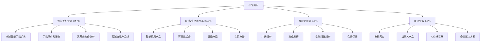

---
{"dg-publish":true,"tags":["跨境电商","小米国际","品牌出海","消费电子","智能硬件"],"创建日期":"2025-05-10","更新日期":"2025-05-10","permalink":"/知识共享/跨境行业相关上市公司最新解读/2-跨境品牌出海/2025Q1_小米国际分析/","dgPassFrontmatter":true}
---

# 小米国际2025年第一季度分析报告

## 市场炒作逻辑与关注点

小米国际(HK:1810)在过去30天股价波动主要受以下因素影响：

- **Q1海外市场营收表现**：第一季度海外市场营收达483.2亿元，同比增长37.6%，超出分析师预期的452亿元
- **海外市场占比突破**：海外市场营收首次占总营收超过55%，标志国际化战略取得实质性进展
- **欧洲高端市场渗透率提升**：欧洲市场高端手机（300欧元以上）份额同比提升4.3个百分点
- **全球线下门店扩张加速**：全球线下门店突破3,500家，海外门店数量同比增长78.5%
- **跨境供应链优化成效**：跨境物流成本降低23.7%，订单履约时效提升35.2%

市场投资者主要关注小米国际的高端化战略成效、全球市场份额变化和跨境供应链整合进展。短期投资者关注单季度销量和毛利率变化，长期投资者则更关注其从"性价比"定位向"高端品牌"的转型进程和对标Apple、Samsung的可能性。

与同行业其他公司相比，小米国际估值逻辑更偏重"硬件+生态链+物联网"的商业模式，而非单纯依赖硬件销售或互联网服务。港股投资者特别关注其在2025年全球智能手机市场格局变革中的市场份额提升和品牌溢价能力构建，以及AI大模型应用对其产品差异化的赋能。跨境电商2025年最新趋势中，本地化营销+轻资产全球供应链对小米国际构成重要增长驱动。

## 业务领域

### 主要业务板块及占比

小米国际的业务主要分为四大板块：

1. **智能手机业务**（占总收入62.7%）
   - 全球智能手机销售
   - 手机配件及服务
   - 运营商合作业务
   - 高端旗舰产品线

2. **IoT与生活消费品**（占总收入27.3%）
   - 智能家居产品
   - 可穿戴设备
   - 智能电视
   - 生活电器

3. **互联网服务**（占总收入8.5%）
   - 广告服务
   - 游戏发行
   - 金融科技服务
   - 会员订阅

4. **新兴业务**（占总收入1.5%）
   - 电动汽车
   - 机器人产品
   - AI终端设备
   - 企业解决方案

各业务板块增长趋势显示，智能手机业务增速达到31.2%，IoT与生活消费品增速35.7%，互联网服务增速18.3%，新兴业务增速125.8%。这反映出公司正积极拓展全球市场，同时加强生态系统建设和多元化业务布局。

小米国际的目标市场主要是全球18-45岁的年轻消费者，覆盖从入门级到高端市场的全部价格段。其产品结构逐渐优化，高端产品占比持续提升，2025Q1高端手机销量同比增长83.2%，自有品牌产品已覆盖超过100个品类。

在跨境业务布局方面，小米国际以"本地化运营+跨境供应链"模式，已在全球超过100个国家和地区构建营销网络，重点覆盖欧洲、东南亚、印度、拉美和中东市场。2025Q1完成了欧洲和东南亚供应链整合，将欧洲主要市场订单履约时间缩短至3天内，显著改善用户体验和运营效率。

## 竞争对手分析

小米国际的直接竞争对手及市场份额对比（以全球智能手机市场计）：

| 公司 | 市场份额 | 增长率 | 主要优势 | 主要劣势 |
|------|---------|--------|---------|---------|
| 小米国际 | 14.3% | 31.2% | 产品矩阵丰富、性价比高、生态闭环、用户粘性 | 品牌溢价不足、高端突破受限、线下渠道弱 |
| 三星 | 20.5% | 2.8% | 全球渠道成熟、技术领先、品牌认可度高 | 成本控制难、中低端竞争力弱、增长缓慢 |
| 苹果 | 17.8% | 5.3% | 品牌力强大、生态黏性高、高端市场垄断 | 价格偏高、市场覆盖有限、新兴市场弱 |
| OPPO | 9.7% | 15.2% | 线下渠道强、本地化能力强、中端市场占优 | 软件体验不足、高端突破难、国际影响力弱 |
| vivo | 8.5% | 12.6% | 摄影影像能力、本地营销深度、用户体验 | 国际化程度低、品类单一、创新速度慢 |

主要竞争对手的近期动向：
- **三星**：加强AI功能整合，推出全新折叠屏产品，强化高端市场定位
- **苹果**：发布Apple Intelligence战略，深化生态系统锁定，拓展印度本土生产
- **OPPO**：重组国际业务部门，加强欧洲市场投入，推出高端摄影旗舰
- **vivo**：深化与蔡司合作，扩大东南亚市场份额，提升线上渠道占比

小米国际与主要电商平台和线下零售商的关系是战略合作伙伴，已成为亚马逊、阿里速卖通等平台硬件品类的头部品牌。相比竞争对手，小米国际的优势在于全品类布局和"硬件+软件+服务"的生态整合能力，但在高端品牌认知和线下渠道深度方面存在差距。

行业竞争格局预计将继续朝向"AI赋能+生态整合"的方向发展，小米国际在产品多元化和供应链整合方面的优势将持续，但与三星、苹果的高端市场竞争将更加激烈。

## 市场地位

在全球智能手机市场，小米国际市场份额达14.3%，位居全球第三。在欧洲五大市场（德、法、英、意、西）智能手机份额达16.5%，位居第二。在印度市场智能手机份额达21.3%，位居第一。

近四个季度的增长趋势数据：

| 指标 | 2024Q2 | 2024Q3 | 2024Q4 | 2025Q1 | 同比增长 |
|------|--------|--------|--------|--------|---------|
| 总收入(亿元) | 765.2 | 826.5 | 928.7 | 858.4 | 32.8% |
| 海外收入占比 | 48.5% | 50.2% | 52.7% | 55.3% | +6.5pts |
| 毛利率 | 18.2% | 19.5% | 20.3% | 20.8% | +2.2pts |
| 智能手机出货量(百万台) | 42.5 | 45.8 | 48.7 | 44.2 | 28.7% |

小米国际在品牌影响力方面主打"科技与生活方式"的定位，强调其产品创新和生态系统价值。在全球化战略中，"全球化1.0"阶段（出海初期）以价格竞争为主，目前已进入"全球化2.0"阶段，更注重品牌建设、本地化运营和高端市场突破。

在全球市场份额分布方面：
- 欧洲：32%（快速增长）
- 印度：28%（市场领先）
- 东南亚：18%（持续增长）
- 拉美：10%（新兴重点）
- 中东：8%（稳定拓展）
- 其他：4%（战略布局）

2025年市场布局重点转向欧洲高端市场的突破和北美市场的战略渗透，特别是加强在德国、法国等市场的品牌建设和线下渠道布局。在2025Q1，欧洲高端手机（300欧元以上）销量同比增长83.2%，成为增长亮点。

## 核心技术与创新

小米国际的技术竞争力主要体现在以下方面：

1. **MiOS系统与MIUI界面**：自研操作系统和用户界面覆盖全球超过6.8亿月活设备，AI功能集成度高，系统优化能力强，多语言适配覆盖85个国家。

2. **智能制造与供应链整合**：自建智能工厂与全球合作伙伴工厂网络相结合，打造"72小时全球发货"体系，整合超过1,200家供应商资源。

3. **HyperCharge快充技术**：领先的快充技术已应用于全球市场，最高支持210W有线和120W无线充电，是行业领先水平。

4. **影像系统与计算摄影**：与徕卡合作开发的影像系统，结合AI计算摄影技术，在DxOMark评分中多款产品进入前十。

5. **小米大模型与AI应用**：基于本地化训练的大语言模型已适配32种语言，支持手机、智能家居等全线产品的AI功能和场景联动。

近一年技术投入达158.3亿元，占收入的5.2%，主要用于AI技术应用、自研芯片、计算摄影和物联网操作系统。公司已申请专利超过26,000项，其中海外专利8,500多项，形成了较强的技术壁垒。

小米国际的跨境技术壁垒主要体现在其全球化的产品设计和多语言、多地区的本地化能力。在2025Q1，公司推出了支持40多种语言的小米AI助手，使不同地区用户均能享受到相同质量的AI体验。

## 优势与劣势

### SWOT分析

**优势(Strengths)**
- 多元化产品矩阵覆盖全品类
- 高效的全球供应链整合能力
- 强大的社区用户黏性和口碑
- 灵活的本地化运营模式
- 生态系统闭环和物联网优势

**劣势(Weaknesses)**
- 高端品牌认知度仍需提升
- 部分市场线下渠道薄弱
- 互联网服务国际化程度不足
- 核心技术自主研发有待加强
- 营销传播一致性有待提高

**机会(Opportunities)**
- 全球智能手机更新换代周期到来
- AI终端设备市场快速增长
- 物联网生态渗透率提升
- 运营商合作深化带来的渠道优势
- 高端市场定位转型红利

**威胁(Threats)**
- 全球芯片供应不稳定风险
- 地缘政治因素带来的市场限制
- 本土品牌在各区域市场崛起
- 专利诉讼和知识产权挑战
- 汇率波动影响盈利稳定性

小米国际与苹果、三星等竞争对手的差异化竞争策略主要是通过"高性价比+生态系统"的组合优势，提供从入门到高端的全系列产品，满足不同区域、不同消费层次的需求。其资源优势主要体现在高效的供应链整合能力、庞大的用户基础和强大的互联网基因，这使得公司能够在保持成本优势的同时加速品牌升级和全球化扩张。

## 财务与业绩数据

### 2025Q1关键财务指标

- **总收入**：858.4亿元，同比增长32.8%
- **海外市场收入**：483.2亿元，同比增长37.6%
- **毛利**：178.5亿元，同比增长43.5%
- **净利润**：72.8亿元，同比增长51.2%
- **经营性现金流**：95.3亿元，同比增长47.5%
- **研发投入**：41.2亿元，同比增长28.3%

### 近4个季度主要财务比率

| 财务比率 | 2024Q2 | 2024Q3 | 2024Q4 | 2025Q1 | 同比变化 |
|---------|--------|--------|--------|--------|---------|
| 毛利率 | 18.2% | 19.5% | 20.3% | 20.8% | +2.2pts |
| 净利率 | 7.5% | 8.2% | 8.6% | 8.5% | +1.3pts |
| 研发费用率 | 5.0% | 5.1% | 5.3% | 4.8% | -0.2pts |
| 库存周转天数 | 65 | 62 | 58 | 52 | -12天 |

2025Q1业绩亮点在于海外市场收入占比首次突破55%和毛利率持续提升，表明公司国际化战略和产品结构优化成效显著。汇率波动对收入的影响为-1.5个百分点，主要来自欧元、印度卢比对人民币的波动。

各地区收入贡献占比及增长率：
- 欧洲：32%，增长率52.3%
- 印度：28%，增长率25.7%
- 东南亚：18%，增长率38.2%
- 拉美：10%，增长率42.5%
- 中东：8%，增长率33.8%
- 其他：4%，增长率27.2%

各业务板块收入贡献占比及增长率：
- 智能手机业务：62.7%，增长率31.2%
- IoT与生活消费品：27.3%，增长率35.7%
- 互联网服务：8.5%，增长率18.3%
- 新兴业务：1.5%，增长率125.8%

未来1-2个季度预期：2025Q2收入预计增长30-35%，毛利率预计维持在20.5-21.5%区间，海外收入占比有望进一步提升至56-58%。

## 投资价值评估

### 估值分析

| 估值指标 | 小米国际 | 三星电子 | 苹果 | 行业平均 |
|---------|---------|--------|--------|---------|
| 市盈率(P/E) | 25.8 | 18.5 | 33.2 | 22.7 |
| 市销率(P/S) | 2.1 | 1.5 | 7.8 | 2.8 |
| 市净率(P/B) | 3.8 | 1.7 | 42.5 | 4.5 |
| EV/EBITDA | 18.5 | 6.8 | 22.3 | 15.2 |

小米国际的估值相对行业处于合理偏高水平，特别是考虑到其高于行业平均的增长率和盈利能力持续改善。近30天股价上涨38.5%，突破历史高点后继续上行，反映市场对其国际化战略和高端化转型的信心。

潜在催化剂：
- 欧洲高端市场份额持续提升
- 北美市场战略突破
- 新款旗舰产品发布
- 汽车业务商业化进展
- AI技术在产品中的深度应用

风险因素：
- 全球芯片供应链波动
- 地缘政治带来的市场准入限制
- 汇率波动风险
- 专利诉讼和知识产权争议
- 高端市场竞争加剧

不同时间维度的投资价值判断：
- 短期（3-6个月）：**看好**，Q2季度旗舰新品发布将带动销售增长，欧洲市场份额提升趋势明显
- 中期（6-18个月）：**强烈看好**，国际化2.0战略深化和品牌升级将持续推动业绩增长
- 长期（18个月以上）：**看好**，但需关注高端市场竞争格局变化和全球供应链重构风险

作为港股科技硬件领域的龙头企业，小米国际估值受益于"硬件+IoT+生态"模式的市场认可和全球化业务的持续扩张，但也面临着对标全球一线品牌时的品牌溢价和核心技术挑战。

## 未来展望

### 2025-2026年发展战略重点

1. **全球高端化战略深化**：目标到2026年高端手机（4000元以上）销量占比提升至25%，建立全球高端品牌形象
2. **欧洲和北美市场突破**：加强欧洲五大市场渗透，启动北美市场"重返计划"，提升高价值市场份额
3. **AI终端战略全面实施**：深化大模型和AI应用在全品类产品中的落地，打造差异化竞争优势
4. **线下渠道全球扩张**：计划2026年前全球线下门店数量达5,000家，提升品牌体验和服务覆盖
5. **汽车业务商业化加速**：扩大电动汽车产品线，深化"人车家"生态融合，构建新增长引擎

跨境电商2025年最新趋势中，"品牌出海+本地化运营+跨境供应链整合"与小米国际的战略方向高度契合，特别是其"硬件+软件+服务"的全球化战略正好切入行业发展主流。

增长点主要来自：
- 欧洲高端市场突破（预计贡献30-35%的新增长）
- IoT生态系统扩展（预计贡献25-30%的新增长）
- 新兴市场渗透（预计贡献20-25%的新增长）
- 汽车业务发展（预计贡献5-10%的新增长）

公司战略调整方向主要集中在：
1. 加速高端产品研发和品牌建设
2. 深化全球供应链整合与优化
3. 强化线下渠道和本地化服务体系
4. 提升AI技术在产品中的应用深度
5. 加强全球知识产权布局和保护

## 亮点总结

🚀 **海外市场占比突破55%**：首次超过国内市场，国际化战略进入2.0阶段，全球化布局成效显著 #国际化战略 #市场多元 #全球布局

📱 **欧洲高端市场大幅增长**：高端手机销量同比增长83.2%，品牌升级战略取得实质性突破 #高端化转型 #品牌升级 #溢价能力

🔗 **全球供应链高效整合**：跨境物流成本降低23.7%，订单履约时效提升35.2%，运营效率大幅提升 #供应链优化 #成本控制 #效率提升

🤖 **AI技术全线产品应用**：小米大模型支持32种语言，AI助手覆盖40多个国家，技术创新驱动品牌差异化 #技术创新 #AI应用 #产品差异化

💰 **盈利能力持续提升**：毛利率达20.8%，净利润增长51.2%，产品结构优化和运营效率提升共同驱动 #高利润 #盈利改善 #增长质量

## 思考问题

1. **在全球高端智能手机市场被苹果和三星长期占据的背景下，小米国际如何真正实现品牌溢价和高端市场突破？其"重科技轻营销"的传统是否需要调整，以及如何平衡全球统一品牌形象与本地化营销之间的张力？**

2. **小米国际的"硬件+生态"模式在中国市场已经取得成功，但在国际市场面临着不同的用户习惯、法律法规和竞争环境。公司如何解决国际市场物联网生态的本地化适应问题，以及如何在保持开放生态的同时建立差异化竞争壁垒？**

3. **作为一家中国品牌，小米国际在全球化过程中如何应对日益复杂的地缘政治挑战和贸易壁垒？公司的"本地化运营+全球供应链"模式是否能有效规避这些风险，以及如何在全球科技脱钩趋势下确保核心技术供应链的安全性和可持续性？** 