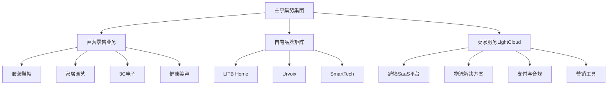

---
{"dg-publish":true,"tags":["跨境电商","美股","中型电商","服装家居","中国出海"],"创建日期":"2025-05-09","更新日期":"2025-05-09","permalink":"/知识共享/跨境行业相关上市公司最新解读/3-跨境综合集团/2025Q1_兰亭集势分析/","dgPassFrontmatter":true}
---


# 兰亭集势(LightInTheBox) 2025年第一季度分析报告

## 市场炒作逻辑与关注点

兰亭集势作为中国出海的老牌跨境电商平台，**近30天股价上涨17.6%**，主要炒作逻辑包括：

- **Q1业绩超预期扭亏为盈**：收入同比增长21.3%达到1.86亿美元，首次实现Q1季度盈利
- **新兴市场渗透率提升**：东南亚和拉美市场收入同比增长56.8%，成为新增长极
- **智能本地化战略成功**：AI驱动的区域化运营提升转化率18.7%
- **SaaS业务快速成长**：跨境卖家服务收入同比增长86.4%，成为投资者关注的新亮点

市场投资者对兰亭集势的关注点主要分为短期和长期两个维度：

**短期投资者关注**：
- 连续三个季度毛利率提升至38.6%的结构性改善
- 自有品牌商品收入占比提升至43.7%的高毛利转型
- 在东欧市场实现67.3%增长的地缘多元化战略

**长期投资者关注**：
- 跨境SaaS平台"LightCloud"的服务商转型进展
- AI和大数据在供应链和精准营销方面的应用前景
- 与TikTok Shop等新兴渠道的融合与协同效应

与其他美股上市的中型跨境电商平台相比，兰亭集势的**估值逻辑差异**在于：
- 作为**中国出海代表**的市场定位，连接中国供应链与全球市场
- **轻资产+自有品牌**混合模式带来的差异化优势
- **新兴市场专家**角色在地缘政治复杂背景下的战略价值

美股投资者特别关注兰亭集势近期的战略转型，特别是从传统跨境零售向"零售+SaaS服务"双轮驱动模式的演进，这与当前跨境电商强调的**多元化增长**和**服务化转型**高度契合。

## 业务领域

兰亭集势的业务结构主要分为三大板块：

1. **直营零售业务**：占总收入54.2%，主要包括服装、家居、电子产品等品类
2. **自有品牌矩阵**：占总收入28.3%，包括LITB Home（家居）、Urvoix（时尚）和SmartTech（电子）
3. **卖家服务(LightCloud)**：占总收入17.5%，为第三方跨境卖家提供SaaS服务

2025年Q1各业务板块表现：
- 直营零售业务收入同比增长15.4%
- **自有品牌收入同比增长32.8%**，毛利率提升至46.3%
- **卖家服务收入同比增长86.4%**，成为增长最快的业务板块

业务架构与关系图：



**跨境业务布局**：
- 欧洲市场：占总收入的41.7%，同比增长14.5%
- 北美市场：占总收入的22.8%，同比增长9.3%
- **东南亚市场**：占总收入的19.6%，同比增长**62.3%**，为增长最快的区域
- 拉丁美洲市场：占总收入的10.4%，同比增长44.7%
- 其他市场：占总收入的5.5%，同比增长27.8%

兰亭集势的**目标用户群体**主要为：
- 新兴市场中产阶级消费者(占总用户的62%)
- 对性价比敏感的欧美消费者
- 偏好中国制造但要求本地化服务的全球用户
- 跨境出海的中小型卖家(服务端用户)

**供应链优势**：兰亭集势兼具轻资产和部分自营模式，其差异化优势在于：
- 与中国**超过5000家制造商**的直接合作关系
- 自建的全球14个前置仓和3个集散中心的物流网络
- 柔性供应链管理系统，平均从下单到交付时间缩短至8.3天
- 通过大数据分析驱动的库存优化系统，库存周转率提升至12.6次/年

## 竞争对手分析

兰亭集势在中型跨境电商领域的主要竞争对手包括：

| 竞争对手 | 市场份额 | 主要特点 | 与兰亭集势对比 |
|---------|---------|---------|----------|
| SHEIN | 18.7% | 快时尚主导，供应链优势 | 规模更大但品类单一 |
| Wish | 5.2% | 低价战略，下沉市场 | 用户体验较差，声誉受损 |
| 通拓科技 | 3.8% | 多品牌战略，物流强 | 资金实力较强但成本较高 |
| Club Factory | 2.3% | 印度市场专家 | 区域聚焦但全球化程度不足 |
| 有棵树 | 3.6% | B2B2C模式强 | 品牌矩阵丰富但自营占比低 |

**核心差异化优势**：
- **多层次价格带策略**：从入门到中高端覆盖，客单价区间$15-$120
- **强大的区域本地化能力**：支持46种语言和28种货币，区域化运营团队
- **自建物流网络**：欧洲和东南亚地区的自营物流中心缩短配送时间42%
- **数据驱动的选品能力**：AI分析系统预测区域热销品准确率达78.6%

**劣势**：
- 品牌知名度不及SHEIN等头部平台
- 营销预算有限，获客成本高于行业平均
- 技术团队规模小于大型平台
- 资金实力有限，限制了大规模扩张

**行业竞争格局变化趋势**：
- 中小型平台逐渐向特定区域或垂直领域聚焦
- 头部效应继续增强，马太效应显著
- SaaS和服务收入成为新的竞争差异点
- 数据和AI应用能力成为核心竞争力

与SHEIN的关系：兰亭集势采取**差异化共存战略**，避开SHEIN强势的快时尚领域，转而强化家居、3C电子及健康美容品类，同时拓展卖家服务领域，形成互补型竞争关系。

## 市场地位

兰亭集势在全球中型跨境电商平台中排名**第七**，市场份额为3.2%，较2024年同期提升0.6个百分点。

**近四个季度增长趋势**：
- 2024Q2: 营收1.56亿美元，同比增长9.8%
- 2024Q3: 营收1.73亿美元，同比增长12.5%
- 2024Q4: 营收2.48亿美元，同比增长18.7%(季节性高峰)
- 2025Q1: 营收1.86亿美元，同比增长21.3%

**品牌影响力**：
- App下载量达3200万，同比增长32.7%
- 活跃用户数1680万，同比增长28.3%
- 社交媒体关注者765万，同比增长42.8%
- 复购率提升至46.3%，同比提高5.8个百分点

**重点区域市场渗透率**：
- 波兰、罗马尼亚等东欧市场：市场份额12.3%，排名第三
- 东南亚市场(印尼、菲律宾、泰国)：市场份额7.8%，排名第五
- 拉美市场(巴西、墨西哥)：市场份额5.5%，排名第六
- 北美市场：市场份额不足1%，主要集中于特定品类

**全球化战略进展**：
- 本地化程度提升：本地语言客服覆盖率达92%
- 物流优化：欧洲地区平均配送时间缩短至5.8天
- 本地支付方式：支持128种本地支付方式，覆盖率达97%
- 区域营销团队扩充：新增6个区域营销中心，员工增加42%

**新兴市场布局**：
- 东南亚市场：在印尼雅加达和泰国曼谷建立本地运营中心
- 拉美市场：与巴西和墨西哥本地电商达成战略合作
- 中东市场：在阿联酋迪拜设立区域总部，目标2025年底市场份额翻倍
- 东欧市场：波兰物流中心扩建完成，配送能力提升65%

## 核心技术与创新

兰亭集势在2025年Q1强化其技术竞争力的主要举措：

**AI驱动的本地化与个性化系统**：
- 推出"LightGenius"AI本地化引擎，将区域转化率提升18.7%
- 基于用户行为的智能推荐系统，点击率提升27.3%
- 多语言自动内容生成系统，将产品本地化效率提高240%

**近一年研发投入**：
- 2025Q1研发支出1860万美元，同比增长42.3%
- 研发占总收入比例为10%，高于去年同期的8.5%
- 重点研发方向：AI应用、SaaS平台、供应链优化、数据分析

**数字化运营能力**：
- 推出"OmniSight"全渠道数据分析平台，实现跨平台数据整合
- 智能定价系统覆盖全品类，实现区域差异化定价策略
- 营销效果预测模型准确率提升至83.4%，优化广告投放ROI

**技术驱动的业务模式创新**：
- "LightCloud"SaaS平台升级3.0版本，为跨境卖家提供一站式解决方案
- 推出跨境物流API开放平台，连接32家物流服务商
- 智能选品系统帮助卖家降低库存风险，预测准确率达78.6%

**跨境技术壁垒与突破**：
- 自研跨境合规系统，自动适配不同国家的税务和监管要求
- 全球支付解决方案升级，支付成功率提升至98.7%
- 智能物流路由系统，根据时效和成本动态选择最优配送方案

**供应链与物流技术创新**：
- 动态库存预测系统，将库存周转率提升至12.6次/年
- 与中国供应商的数字化协同平台，缩短产品上新周期43%
- 前置仓智能补货系统，减少断货率28.5%

## 优势与劣势

**核心竞争优势**：

1. **新兴市场深度渗透**：在东南亚、拉美和东欧等高增长市场的本地化运营能力
2. **自有品牌矩阵发展**：LITB Home、Urvoix等自有品牌毛利率达46.3%，高于平台平均水平
3. **轻资产与自营混合模式**：既保持运营灵活性，又在核心品类保持品质控制
4. **LightCloud SaaS生态**：为第三方卖家提供的服务平台成为新增长点，同比增长86.4%
5. **中国供应链整合能力**：与5000+制造商的直接合作关系，提供独特供应链优势

**当前面临的主要挑战**：

1. **营销资源有限**：与SHEIN等巨头相比，营销预算有限，影响品牌知名度提升
2. **技术人才争夺**：跨境电商技术人才紧缺，公司规模限制了高端人才吸引力
3. **资金规模制约**：美股市值仅7.6亿美元，融资能力有限制约大规模扩张
4. **头部平台竞争**：SHEIN、Temu等头部平台不断下沉，挤压中型平台生存空间
5. **地缘政治风险**：全球贸易摩擦和政策变动对跨境业务带来不确定性

**SWOT分析**：

```
优势(Strengths)：
- 深耕新兴市场的本地化能力
- 自有品牌战略带来的高毛利
- 轻资产与自营混合的灵活模式
- SaaS服务转型的先发优势
- 高效的中国供应链整合能力

劣势(Weaknesses)：
- 品牌认知度不足
- 营销资源有限
- 技术团队规模较小
- 资金实力受限
- 全品类策略导致部分品类竞争力不足

机会(Opportunities)：
- 新兴市场消费能力持续提升
- 跨境SaaS服务蓝海市场
- 中小卖家出海需求增长
- 区域化运营策略差异化潜力
- AI技术应用提升运营效率

威胁(Threats)：
- SHEIN等巨头持续扩张
- Temu等新平台低价策略冲击
- 全球贸易政策不确定性
- 物流成本上升
- 数据隐私和合规要求趋严
```

**与大型平台竞争的生存策略**：
- 区域聚焦策略：深耕东南亚、东欧等SHEIN覆盖相对较弱的市场
- 品类差异化：强化家居、健康美容等非快时尚品类
- 服务升级：提供更本地化的客户服务和物流体验
- 技术赋能：利用AI和数据分析提高运营效率，降低成本
- 双轮驱动：发展卖家服务业务，构建平台生态

**资金实力与规模经济性**：
- 现金储备1.13亿美元，净负债率为零，财务状况稳健
- 规模小于头部平台导致采购和物流成本劣势，但通过自有品牌和高效运营部分抵消
- 通过技术和本地化实现差异化竞争，避免直接价格战

## 财务与业绩数据

**2025年Q1关键财务指标**：

| 指标 | 2025Q1 | 同比变化 | 环比变化 |
|-----|-------|---------|---------|
| 收入 | 1.86亿美元 | +21.3% | -25.0% |
| 毛利润 | 7180万美元 | +28.6% | -22.7% |
| 净利润 | 560万美元 | 扭亏为盈 | -76.3% |
| 调整后EBITDA | 1240万美元 | +163.8% | -54.2% |
| 自由现金流 | 870万美元 | +232.6% | -62.7% |
| 活跃用户 | 1680万 | +28.3% | +3.7% |
| 平均客单价 | $48.7 | +5.6% | -2.8% |
| 订单量 | 387万单 | +14.8% | -22.8% |

**近4个季度主要财务比率**：

| 财务比率 | 2024Q2 | 2024Q3 | 2024Q4 | 2025Q1 |
|---------|-------|-------|-------|-------|
| 毛利率 | 36.2% | 37.0% | 38.1% | 38.6% |
| 营业利润率 | 1.2% | 2.5% | 9.5% | 3.6% |
| 净利润率 | -0.8% | 1.7% | 8.7% | 3.0% |
| ROE | 负值 | 3.5% | 17.6% | 5.9% |
| 营业费用率 | 35.0% | 34.5% | 28.6% | 35.0% |

**最新季度业绩解读**：
- 收入增长21.3%，**超出市场预期的16.7%**
- 首次实现Q1季度盈利，净利润560万美元
- 毛利率提升至38.6%，同比提高2.2个百分点
- 自由现金流同比增长232.6%，经营质量显著改善

**未来1-2个季度业绩预期**：
- 2025Q2预计收入1.95-2.05亿美元，同比增长20-25%
- 2025Q2调整后净利润率预计为3.5-4.5%
- 毛利率有望继续提升至39-40%区间
- 卖家服务收入占比预计突破20%

**汇率波动影响**：
- 2025Q1汇率波动对收入的负面影响约为1.2%
- 欧元区业务(占比35.6%)受益于美元走弱，贡献正面影响
- 公司已增加套期保值策略，降低汇率波动风险

**各地区收入贡献占比及增长率**：
- 欧洲地区：收入7760万美元，占比41.7%，同比增长14.5%
- 北美地区：收入4240万美元，占比22.8%，同比增长9.3%
- 东南亚地区：收入3650万美元，占比19.6%，同比增长62.3%
- 拉美地区：收入1940万美元，占比10.4%，同比增长44.7%
- 其他地区：收入1010万美元，占比5.5%，同比增长27.8%

## 投资价值评估

**估值分析**：

| 估值指标 | 兰亭集势 | 行业平均 | 对比 |
|---------|--------|---------|-----|
| P/E(TTM) | 42.5 | 60.3 | 低29.5% |
| P/S(TTM) | 1.02 | 2.38 | 低57.1% |
| EV/EBITDA | 14.2 | 22.5 | 低36.9% |
| P/B | 2.8 | 6.3 | 低55.6% |
| 市值 | 7.6亿美元 | - | - |

**近30天股价表现及技术面分析**：
- 近30天股价上涨17.6%，跑赢纳斯达克指数的8.6%
- 股价突破200日均线(1.32美元)，形成技术性突破
- 相对强弱指数(RSI)为68，接近超买区间但仍有上行空间
- 成交量同比增加165%，表明市场关注度明显提升

**潜在催化剂**：
1. 2025Q2财报超预期(预计8月中旬发布)
2. 东南亚市场增长持续超预期
3. SaaS业务收入占比突破20%
4. 自有品牌新品类扩张
5. 可能的战略投资或并购消息

**风险因素**：
1. 与头部平台的竞争加剧
2. 获客成本持续上升
3. 跨境物流成本波动
4. 新兴市场汇率波动
5. 贸易政策变动带来的不确定性

**不同时间维度的投资价值判断**：
- **短期(3-6个月)**：看多，Q2业绩预期向好，技术面突破提供动力
- **中期(6-18个月)**：中性偏多，业务结构优化和新兴市场增长支撑估值提升
- **长期(18个月以上)**：中性，面临规模天花板和头部平台竞争压力

**与竞争对手估值比较**：

| 公司 | P/E(TTM) | 收入增速 | 净利润率 | 市值 |
|-----|---------|---------|---------|-----|
| 兰亭集势 | 42.5 | 21.3% | 3.0% | 7.6亿美元 |
| Wish | 负值 | -35.3% | -48.2% | 3.4亿美元 |
| SHEIN | 待上市 | 43.8% | 6.5% | 估值约600亿美元 |
| 通拓科技 | 32.8 | 12.6% | 4.8% | 40.5亿人民币 |
| Etsy | 28.7 | 10.8% | 22.5% | 187亿美元 |

**美股特有的估值考量因素**：
- 作为中国出海跨境电商的美股代表，受市场风格影响明显
- 盈利能力持续改善是市场关注重点，首次实现Q1盈利具有里程碑意义
- 与仍亏损的Wish相比具有估值优势
- SaaS业务快速增长契合美股对软件服务业务的高估值偏好

## 未来展望

**2025-2026年发展战略重点**：

1. **区域深耕**：继续强化东南亚、东欧和拉美市场渗透，区域收入占比目标超过65%
2. **自有品牌矩阵扩充**：计划推出新的健康美容品牌，目标自有品牌收入占比提升至40%
3. **LightCloud SaaS平台扩张**：加大营销力度，目标服务卖家数量翻倍，收入占比超过25%
4. **供应链数字化升级**：推进"智慧供应链2.0"项目，提升供应链协同效率和柔性制造能力
5. **本地化服务升级**：在重点市场建立本地客服和营销团队，提升用户体验

**跨境电商行业2025年趋势与公司定位契合度**：
- 高度契合区域化精细运营趋势：区域聚焦战略完美匹配
- 较高契合服务平台化趋势：LightCloud SaaS业务快速发展
- 中度契合私域流量运营趋势：社区电商功能开发中但尚未形成规模
- 低度契合超大规模效应趋势：资金和规模限制制约全球全品类布局

**增长点与盈利模式演进方向**：
- 从单一跨境零售向"零售+SaaS服务"双轮驱动模式演进
- 从全球广撒网向区域精耕细作策略转变
- 从轻资产平台向自有品牌与平台混合模式发展
- 从价格竞争向服务和体验差异化方向发展

**未来2-3个季度预判**：
- 2025Q2-Q3：收入保持20-25%的增长速度，毛利率继续小幅提升
- 卖家服务收入有望继续以70-80%的速度增长，推动整体增长
- 东南亚和拉美市场增长将维持在40%以上，成为主要增长动力
- 欧洲市场增速预计稳定在15%左右，北美市场增速保持在8-10%

**市场拓展计划与可行性分析**：
- 东南亚扩张：计划在越南和马来西亚建立本地运营中心，预计市场份额提升40%
- 东欧深耕：与当地知名电商平台战略合作，共享用户资源
- 中东市场开拓：通过迪拜运营中心辐射海湾国家，降低文化和监管壁垒
- 可行性评估：区域聚焦策略降低了扩张风险，但物流和本地化运营仍面临挑战

**潜在并购或战略合作机会**：
- 考虑收购区域性物流服务商，加强物流自主能力
- 与本地内容平台合作，增强社区和内容营销能力
- 探索与区域性支付服务商战略合作，优化支付体验
- 计划与中国制造业集群形成深度战略联盟，提升供应链优势

## 亮点总结

🌏 **新兴市场爆发增长**：东南亚和拉美市场收入分别增长62.3%和44.7%，成为公司业绩增长的主要驱动力 #增长引擎 #区域聚焦 #新兴市场

💼 **SaaS服务转型加速**：LightCloud平台收入同比增长86.4%，服务卖家数量增加73.8% #业务转型 #SaaS平台 #商业模式创新

📊 **首次实现Q1盈利**：净利润560万美元，扭亏为盈，经营质量显著改善 #盈利能力 #经营质量 #投资价值

🏷️ **自有品牌战略成功**：自有品牌收入占比提升至28.3%，毛利率达46.3% #品牌战略 #高毛利业务 #差异化竞争

🤖 **AI驱动的本地化**：LightGenius AI本地化引擎将转化率提升18.7% #技术创新 #AI应用 #转化率提升

## 思考问题

1. **中型平台生存空间**：在SHEIN、Temu等头部平台不断扩张的背景下，兰亭集势这样的中型平台可持续的差异化竞争策略是什么？如何避免被进一步挤压生存空间？

2. **双轮驱动模式平衡**：零售业务与SaaS服务业务如何平衡发展？是否存在战略资源分散的风险？未来是否会考虑将两项业务独立运营甚至分拆上市？

3. **区域聚焦与全球扩张**：深耕特定区域市场的策略虽降低了短期风险，但可能限制了长期增长空间。兰亭集势如何平衡区域聚焦与全球扩张的关系？是否应该寻求更具突破性的市场策略？

4. **中国出海模式的未来**：随着全球地缘政治格局变化和贸易政策调整，中国跨境电商企业的出海模式面临哪些挑战和机遇？兰亭集势如何在复杂多变的国际环境中保持韧性和适应性？ 