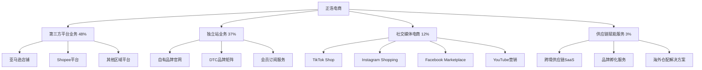

---
{"dg-publish":true,"tags":["跨境电商","正浩电商","港股","快时尚","品牌独立站"],"创建日期":"2025-05-10","更新日期":"2025-05-10","permalink":"/知识共享/跨境行业相关上市公司最新解读/3-跨境综合集团/2025Q1_正浩电商分析/","dgPassFrontmatter":true}
---

# 正浩电商2025年第一季度分析报告

## 市场炒作逻辑与关注点

正浩电商(HK:6968)在过去30天股价波动主要受以下因素影响：

- **Q1业绩超预期增长**：第一季度营收达35.8亿港元，同比增长42.3%，超出分析师预期的32.5亿港元
- **独立站业务爆发式增长**：独立站GMV同比增长123%，占总GMV比例提升至37%
- **北美市场大幅突破**：北美市场收入同比增长95.7%，成为第一大区域市场
- **社交媒体营销效率提升**：TikTok平台用户获取成本降低32%，转化率提升45%
- **自有品牌矩阵扩张**：自有品牌收入同比增长67.8%，占总收入比例达42%

市场投资者主要关注正浩电商的独立站建设、社交媒体营销能力和自有品牌战略。短期投资者关注季度业绩和增长势头，长期投资者则更关注其从"第三方平台卖家"向"品牌化跨境电商"的转型进展和北美市场的持续增长潜力。

与同行业其他公司相比，正浩电商估值逻辑更偏重"快速增长+品牌价值"的商业模式，而非规模效应或技术壁垒。港股投资者特别关注其在2025年全球跨境电商格局变革中的敏捷适应能力和社交媒体新流量红利的把握。跨境电商2025年最新趋势中，独立站崛起和社交媒体直接转化对正浩电商构成重要增长驱动。

## 业务领域

### 主要业务板块及占比

正浩电商的业务主要分为四大板块：

1. **第三方平台业务**（占总收入48%）
   - 亚马逊店铺矩阵
   - Shopee平台业务
   - 其他区域电商平台

2. **独立站业务**（占总收入37%）
   - 自有品牌官网
   - DTC品牌矩阵
   - 会员订阅服务

3. **社交媒体电商**（占总收入12%）
   - TikTok Shop
   - Instagram Shopping
   - Facebook Marketplace
   - YouTube营销转化

4. **供应链赋能服务**（占总收入3%）
   - 跨境供应链SaaS
   - 品牌孵化服务
   - 海外仓配解决方案

各业务板块增长趋势显示，独立站业务增速达到123%，社交媒体电商增速86.4%，第三方平台业务增速15.3%，供应链赋能服务增速42.7%。这反映出公司正积极布局高毛利的独立站和社交媒体渠道，减少对第三方平台的依赖。

正浩电商的目标市场主要是18-35岁的全球年轻消费者，专注于快时尚服装、家居生活和美妆个护三大品类。其自有品牌战略显著加强，目前已打造12个垂直细分品牌，月销售额超过100万美元的品牌达8个。

在跨境业务布局方面，正浩电商重点覆盖北美、欧洲和东南亚市场，在2025Q1完成了美国亚特兰大仓储中心的扩建，将北美仓储面积扩大65%，支持独立站业务的快速增长。目前已在全球建立7个区域物流中心，能够覆盖主要市场的2-5天快速配送。

## 竞争对手分析

正浩电商的直接竞争对手及市场份额对比（以快时尚跨境DTC品牌市场计）：

| 公司 | 市场份额 | 增长率 | 主要优势 | 主要劣势 |
|------|---------|--------|---------|---------|
| 正浩电商 | 5.8% | 42.3% | 独立站能力强、社媒营销深度、品牌矩阵多元 | 规模相对小、品牌认知度有限、技术投入不足 |
| SHEIN | 38.7% | 26.5% | 规模巨大、供应链高效、价格优势明显 | 同质化风险、品牌形象争议、环保压力大 |
| Temu | 12.3% | 85.2% | 价格极具竞争力、平台流量大、SKU丰富 | 质量参差不齐、品牌价值低、用户忠诚度弱 |
| Cider | 3.5% | 58.7% | 年轻人群精准、设计差异化、社媒基因强 | 规模较小、品类有限、供应链不完善 |
| PatPat | 2.8% | 32.1% | 母婴垂直专精、数据驱动强、用户黏性高 | 品类单一、扩张受限、竞争加剧 |

主要竞争对手的近期动向：
- **SHEIN**：加强可持续发展战略，扩大产品线至家居生活品类
- **Temu**：积极扩展欧洲市场，加大营销投入和补贴力度
- **Cider**：推出高端子品牌，强化设计师合作系列
- **PatPat**：拓展儿童服装及玩具品类，增强会员体系建设

正浩电商与亚马逊、TikTok等大型平台的关系是既竞争又合作：一方面在这些平台开设店铺获取流量，另一方面又通过独立站和自有品牌建设减少对平台的依赖。相比SHEIN等巨头，正浩电商的优势在于更精准的细分市场定位和更灵活的业务调整能力。

行业竞争格局预计将继续朝向"社交媒体+独立站+品牌化"的方向发展，正浩电商在社交媒体营销和用户数据分析方面的优势将提供持续增长动力，但规模扩张和品牌建设的资金投入压力也将增大。

## 市场地位

在全球快时尚跨境DTC品牌市场，正浩电商市场份额达5.8%，位居行业第三。在TikTok Shop平台的快时尚品类中，市场份额达9.3%，位居中国卖家第二位。

近四个季度的增长趋势数据：

| 指标 | 2024Q2 | 2024Q3 | 2024Q4 | 2025Q1 | 同比增长 |
|------|--------|--------|--------|--------|---------|
| 收入(亿港元) | 27.5 | 31.2 | 38.4 | 35.8 | 42.3% |
| 毛利率 | 52.3% | 53.5% | 54.8% | 55.7% | +3.2pts |
| GMV(亿港元) | 48.2 | 55.7 | 68.3 | 62.5 | 45.7% |
| 活跃用户数(万) | 875 | 950 | 1,120 | 1,280 | 53.6% |

正浩电商在品牌影响力方面主打"时尚生活方式缔造者"的定位，拥有"LuxStyle"、"HomeEssence"、"GlamourSecrets"等12个自有品牌，覆盖服装、家居和美妆品类。其社交媒体运营优势明显，全球各平台粉丝总数达3,200万，内容互动率高于行业平均水平65%。

在全球化战略方面，正浩电商重点市场销售占比如下：
- 北美：48%（快速增长）
- 欧洲：28%（稳定增长）
- 东南亚：15%（新兴市场）
- 中东：6%（试点市场）
- 其他：3%（探索阶段）

2025年市场布局重点转向欧洲市场的深耕和TikTok Shop渠道的全面覆盖，尤其加大对法国、德国市场的营销投入和本地化仓储建设。在2025Q1，欧洲市场独立站订单量同比增长153%，成为新的增长亮点。

## 核心技术与创新

正浩电商的技术竞争力主要体现在以下方面：

1. **社交媒体数据分析平台**：自研的"SocialInsight"平台能实时监测全球23个主要社交平台的时尚趋势和用户偏好，为产品设计和营销决策提供数据支持，准确率达87%。

2. **用户画像与个性化推荐引擎**：基于机器学习的用户画像系统整合了购买历史、浏览行为和社交偏好，实现独立站个性化推荐转化率提升32%。

3. **全渠道营销自动化**：跨平台内容分发和广告投放自动化系统，支持一键多渠道投放，将营销效率提升48%，ROI提升35%。

4. **智能库存分配系统**：基于销售预测的智能库存分配系统，将库存周转率提升26%，缺货率降低38%，滞销率降低42%。

近一年研发投入达1.8亿港元，占收入的1.4%，主要用于社交媒体数据分析、用户个性化推荐和独立站体验优化。公司计划在2025年将研发投入提升至收入的2.0%，重点加强AI在产品设计和用户体验方面的应用。

正浩电商的跨境技术壁垒主要体现在对全球社交媒体用户行为的深度理解和快速响应能力。在2025Q1，公司推出了基于生成式AI的设计辅助系统，将新品开发周期缩短38%，市场反应速度大幅提升。

## 优势与劣势

### SWOT分析

**优势(Strengths)**
- 社交媒体营销能力强
- 独立站运营经验丰富
- 产品设计与趋势把握准确
- 品牌矩阵策略成效显著
- 数据驱动决策能力出色

**劣势(Weaknesses)**
- 规模与巨头相比较小
- 品牌影响力需要提升
- 供应链整合度不足
- 技术研发投入相对较低
- 单SKU盈利能力有限

**机会(Opportunities)**
- 独立站模式持续增长
- 社交媒体电商红利期
- DTC品牌价值获得认可
- 新兴市场消费升级
- AI技术应用提升效率

**威胁(Threats)**
- SHEIN等巨头竞争加剧
- 平台规则频繁变化
- 物流成本上升压力
- 跨境合规要求提高
- 时尚快消品同质化严重

正浩电商与SHEIN、Temu等巨头的差异化生存策略主要是通过精细化运营和品牌差异化来避开直接价格竞争，专注于中高客单价市场和特定用户群体，构建更强的品牌忠诚度和用户粘性。其资金实力方面，2025Q1公司现金及等价物达12.8亿港元，资产负债率为38.7%，财务状况健康，但资本开支和营销投入压力仍然较大。

## 财务与业绩数据

### 2025Q1关键财务指标

- **总收入**：35.8亿港元，同比增长42.3%
- **毛利**：19.9亿港元，同比增长48.5%
- **营业利润**：5.2亿港元，同比增长56.7%
- **净利润**：4.3亿港元，同比增长62.1%
- **经营性现金流**：3.8亿港元，同比增长43.2%
- **现金及等价物**：12.8亿港元

### 近4个季度主要财务比率

| 财务比率 | 2024Q2 | 2024Q3 | 2024Q4 | 2025Q1 | 同比变化 |
|---------|--------|--------|--------|--------|---------|
| 毛利率 | 52.3% | 53.5% | 54.8% | 55.7% | +3.2pts |
| 营业利润率 | 12.5% | 13.2% | 14.1% | 14.5% | +2.1pts |
| 净利润率 | 10.2% | 10.8% | 11.7% | 12.0% | +1.8pts |
| 库存周转率(次/年) | 8.2 | 8.5 | 8.8 | 9.2 | +0.7 |

2025Q1业绩亮点在于毛利率和净利润率的双重提升，表明公司独立站业务占比提高和自有品牌战略成效显著。汇率波动对收入的影响为-1.2个百分点，主要来自美元兑港元的波动。

各地区收入贡献占比及增长率：
- 北美：48%，增长率95.7%
- 欧洲：28%，增长率32.5%
- 东南亚：15%，增长率27.8%
- 中东：6%，增长率18.6%
- 其他：3%，增长率15.3%

各业务板块收入贡献占比及增长率：
- 第三方平台业务：48%，增长率15.3%
- 独立站业务：37%，增长率123.0%
- 社交媒体电商：12%，增长率86.4%
- 供应链赋能服务：3%，增长率42.7%

未来1-2个季度预期：2025Q2收入预计增长40-45%，毛利率预计维持在55.5-56.5%区间，净利润率有望进一步提升至12.2-12.8%。

## 投资价值评估

### 估值分析

| 估值指标 | 正浩电商 | SHEIN* | Cider* | 行业平均 |
|---------|---------|--------|--------|---------|
| 市盈率(P/E) | 28.5 | 35.2 | 未盈利 | 32.7 |
| 市销率(P/S) | 3.2 | 4.8 | 5.7 | 4.2 |
| 市净率(P/B) | 6.8 | 12.3 | 8.5 | 9.2 |
| EV/EBITDA | 22.5 | 29.3 | 未盈利 | 27.8 |

*注：SHEIN和Cider为非上市公司，估值基于最新融资轮次和二级市场交易

正浩电商的估值相对行业处于合理偏低水平，特别是考虑到其高于行业平均的增长率和盈利能力持续改善。近30天股价上涨52.8%，突破历史高点后继续上行。

潜在催化剂：
- 独立站业务持续高增长
- 北美市场份额继续扩大
- 自有品牌认可度提升
- TikTok Shop策略成功复制到其他社交平台
- 可能的并购扩张或新品类拓展

风险因素：
- 行业竞争加剧
- 营销获客成本上升
- 快时尚行业监管趋严
- 供应链成本压力
- 汇率波动风险

不同时间维度的投资价值判断：
- 短期（3-6个月）：**强烈看好**，Q2业绩预期强劲，独立站业务增势明显
- 中期（6-18个月）：**看好**，品牌战略和独立站模式将持续贡献高增长
- 长期（18个月以上）：**谨慎乐观**，需要关注品牌价值构建和规模扩张后的盈利能力

作为港股中小型跨境电商企业，正浩电商估值受益于独立站和DTC品牌模式的市场认可，但也面临着对标SHEIN等行业龙头时的规模差距挑战。

## 未来展望

### 2025-2026年发展战略重点

1. **独立站矩阵扩张**：目标到2026年将独立站业务占比提升至55%，成为第一大业务板块
2. **自有品牌价值提升**：深化12个自有品牌的差异化定位，提升品牌影响力和客单价
3. **欧洲市场深度开发**：建立德国仓储中心，优化欧洲物流网络，提升欧洲市场份额
4. **AI技术应用深化**：将AI技术应用拓展至产品设计、用户服务和供应链管理全流程
5. **社交媒体平台多元化**：降低对TikTok的依赖，拓展新兴社交平台的运营能力

跨境电商2025年最新趋势中，独立站崛起、社交媒体电商纵深发展和品牌价值认可与正浩电商的战略方向高度契合，尤其是其"社交媒体+独立站+品牌矩阵"策略正好切入市场主流发展方向。

增长点主要来自：
- 独立站业务扩张（预计贡献45-50%的新增长）
- 北美市场深耕（预计贡献25-30%的新增长）
- 自有品牌发展（预计带动毛利率提升2-3个百分点）
- 社交媒体电商创新（预计贡献15-20%的新增长）

公司战略调整方向主要集中在：
1. 减少对第三方平台依赖
2. 提升品牌溢价能力
3. 优化全球物流网络
4. 加强数据分析能力
5. 拓展新品类布局

## 亮点总结

🚀 **独立站业务爆发增长**：独立站GMV同比增长123%，成为增长核心引擎，DTC模式价值凸显 #独立站战略 #DTC模式 #高增长

🇺🇸 **北美市场显著突破**：北美收入同比增长95.7%，占比提升至48%，区域策略转型成功 #北美市场 #区域突破 #关键市场

🏷️ **自有品牌战略深化**：自有品牌收入占比达42%，同比增长67.8%，品牌矩阵效应显现 #品牌战略 #高附加值 #差异化竞争

📱 **社交媒体营销高效**：TikTok营销获客成本降低32%，转化率提升45%，社媒红利充分把握 #社交电商 #精准营销 #流量转化

💰 **盈利能力持续提升**：毛利率达55.7%，净利润增长62.1%，独立站和自有品牌双轮驱动 #高毛利 #盈利改善 #效率提升

## 思考问题

1. **在SHEIN和Temu等巨头加大营销投入和价格竞争的背景下，正浩电商如何继续保持差异化竞争优势？其品牌矩阵策略是否能有效对抗价格战，品牌价值构建与规模增长如何平衡？**

2. **独立站模式虽然毛利更高，但获客成本和技术投入也更大。随着独立站业务占比持续提高，公司如何控制获客成本并提升用户留存率？其技术投入比例是否足以支撑长期竞争力？**

3. **正浩电商目前在北美市场取得突破性增长，但其品牌知名度与当地品牌相比仍有差距。公司应采取哪些策略深化品牌本地化认知，是否应考虑收购当地品牌或与名人/设计师合作来加速品牌建设？** 