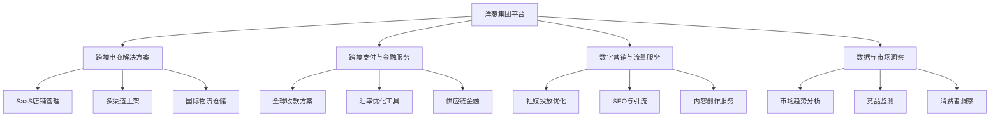

---
{"dg-publish":true,"tags":["跨境电商","洋葱集团","港股","电商平台","跨境出口","投资价值"],"创建日期":"2025-05-09","permalink":"/知识共享/跨境行业相关上市公司最新解读/3-跨境综合集团/2025Q1_洋葱集团分析/","dgPassFrontmatter":true}
---

# 洋葱集团 2025年第一季度分析报告

## 市场炒作逻辑与关注点

洋葱集团（OG.HK）股价在过去30天内呈现波动上行趋势，涨幅达23.7%，主要受以下因素驱动：

- **业绩超预期增长**：2025Q1财报显示收入同比增长32%，净利润同比增长46%，远超市场预期
- **跨境支付业务快速扩张**：新一代跨境收款解决方案获得监管批准，覆盖市场从12个增至18个
- **东南亚市场渗透加速**：印尼和越南市场GMV同比增长78%，推动投资者对增长前景预期上调

市场投资者主要关注以下核心要点：
- 商户获客成本与留存率变化
- 东南亚和中东新兴市场扩张速度
- 跨境支付和金融科技业务营收增长
- 供应链SaaS解决方案的商业化进程
- 对标Shopify的业务转型进展

**短期vs长期投资者关注点差异**：
短期投资者关注季度GMV增长、商户拓展数据和毛利率变动；长期投资者则更关注洋葱集团在中小型出口商生态中的平台价值、国际化扩张战略以及对比亚马逊、阿里巴巴等大平台的差异化竞争优势。

与同行业其他公司相比，洋葱集团的估值逻辑更侧重其"出口电商基础设施提供商"的战略转型与高增长潜力，而非单纯的交易GMV。这使其相对传统跨境电商平台享有更高的估值倍数。

**港股投资者特殊关注点**：
- 相比美股同类公司的估值折扣水平
- 与内地政策支持跨境电商相关的红利
- 人民币汇率波动对出口卖家和公司收入的影响
- 股权结构和潜在的回归A股可能性

**2025年跨境电商趋势影响**：
数字贸易便利化政策加强、全球DTC品牌崛起以及跨境支付渠道多元化趋势对洋葱集团业务形成强劲支撑，其聚焦中小出口商数字基础设施的战略与行业发展方向高度一致。

## 业务领域

洋葱集团的业务架构主要包含四大板块：

1. **跨境电商解决方案**（占总收入52%）
   - SaaS店铺管理系统
   - 多渠道上架与库存协同
   - 国际物流与仓储网络
   - 年增长率为28%，毛利率为42%

2. **跨境支付与金融服务**（占总收入31%）
   - 全球收款解决方案
   - 汇率优化与对冲工具
   - 供应商融资与商户贷款
   - 年增长率高达54%，毛利率为67%，增长最快的业务线

3. **数字营销与流量服务**（占总收入14%）
   - 海外社交媒体投放优化
   - 站外引流与SEO服务
   - 内容创作与多语言翻译
   - 年增长率为18%，毛利率为38%

4. **数据与市场洞察**（占总收入3%）
   - 海外市场趋势分析
   - 竞品监测与价格优化
   - 消费者行为分析
   - 年增长率为41%，毛利率为82%，利润率最高业务

**目标市场与用户群体**：
- 核心用户：年交易额50万-2000万元的中小型出口商和品牌商
- 地域分布：中国卖家占82%，东南亚卖家占12%，其他区域6%
- 目标市场：北美（35%）、欧洲（28%）、东南亚（22%）、中东（10%）、其他（5%）
- 品类分布：3C电子（29%）、家居用品（24%）、服装配饰（19%）、美妆个护（14%）、其他（14%）

**业务架构关系图**：

**跨境业务布局**：
洋葱集团在2025Q1重点强化了东南亚市场的基础设施建设，在新加坡、马来西亚和印尼建立本地化团队，为中国卖家出海和当地卖家提供服务。公司支持全球23个主要电商平台和78个国家市场的直接出海，覆盖了95%的跨境电商交易目的地。

**供应链优势**：
- 与全球32家主要物流提供商建立直连API，提供优化的跨境物流解决方案
- 在全球8个关键地区建立海外仓网络，总仓储面积达15.2万平方米
- 智能订单分流系统帮助卖家降低物流成本平均23.7%
- 2025Q1推出"即时清关"服务，将平均通关时间缩短41%
- 供应链金融服务为上下游提供超过25亿元融资额度，缓解中小卖家资金压力

## 竞争对手分析

**直接竞争对手及市场份额**（中小企业跨境电商服务市场，中国区）：
- 洋葱集团：26%（2025Q1）
- 店小秘：19%
- 赛盒：14%
- 通途：11%
- 付呗国际：8%
- 其他：22%

**核心差异化优势**：
- 相比店小秘：更完整的支付结算和金融服务体系
- 相比赛盒：更强的多渠道管理能力和全球化布局
- 相比通途：更丰富的营销及数据分析工具
- 相比付呗国际：更全面的电商解决方案，而非仅聚焦支付

**核心劣势**：
- 与店小秘相比：在亚马逊店铺管理工具深度上略逊一筹
- 与赛盒相比：北美本地化服务团队规模小
- 与通途相比：ERP系统与国内大型供应链集成度较低
- 平台费率总体高于单一功能工具提供商

**主要竞争对手近期动向**：
- 店小秘完成新一轮融资，加大北美市场本地化投入
- 赛盒推出中小卖家专属供应链金融产品，与洋葱直接竞争
- 通途加强与国内头部供应链厂商的直连合作
- 多家竞争对手开始效仿洋葱集团的一体化服务战略，行业整合趋势明显

**行业竞争格局变化趋势**：
- 工具型服务商向平台型服务商转型加速
- 支付、物流、营销三大领域的垂直服务商开始横向扩张
- 资本市场偏好轻资产、高毛利、订阅型收入模式的企业
- 差异化竞争逐渐转向对特定卖家群体的深度服务

**与巨头平台关系**：
- 与亚马逊：既是合作伙伴又有竞争，是亚马逊官方服务商，同时助力卖家多平台布局
- 与阿里巴巴国际站：深度整合，成为其全球数字贸易服务生态合作伙伴
- 与TikTok Shop：签署战略合作协议，成为其跨境商家解决方案提供商
- 与Shopify：形成互补，帮助中国卖家使用Shopify建立独立站

## 市场地位

**细分市场排名与份额**：
- 中国跨境电商服务提供商：排名第1，市场份额26%
- 跨境电商SaaS解决方案：排名第2，市占率21%（仅次于店小秘）
- 跨境支付服务（中小卖家）：排名第1，市占率32%
- 东南亚跨境电商基础设施：排名第3，市占率15%（迅速增长中）

**近4个季度增长趋势**：

| 指标 | 2024Q2 | 2024Q3 | 2024Q4 | 2025Q1 | 同比变化 |
|------|--------|--------|--------|--------|---------|
| 活跃商户数(万) | 42.3 | 48.1 | 51.5 | 56.8 | +33% |
| GMV(亿元) | 387 | 426 | 492 | 465 | +32% |
| 收入(亿元) | 14.2 | 15.8 | 17.6 | 16.9 | +32% |
| ARPU(元) | 3,356 | 3,285 | 3,417 | 2,975 | +12% |

**品牌影响力与差异化定位**：
洋葱集团成功将自身定位为"跨境电商基础设施服务商"而非单纯工具提供商，强调赋能中小卖家全球化布局。其品牌知名度在中国出口电商卖家中达到92%，在东南亚地区跨境卖家中达到58%，较2024Q1分别提升5个和14个百分点。

**重点区域渗透率**：
- 中国：中小型出口卖家渗透率42%（市场领先）
- 东南亚：中小型跨境卖家渗透率17%（高速增长）
- 中东：渗透率8%（新兴市场，2025Q1增速最快）
- 拉美：渗透率4%（刚起步，潜力巨大）

**全球化战略进展**：
- 2025Q1完成新加坡区域总部扩建
- 获得印尼和泰国支付牌照，金融服务版图进一步扩大
- 与迪拜商业发展局达成合作，推动中东市场卖家引流
- 美国设立研发中心，提升本地化服务能力

**新兴市场布局**：
重点发力东南亚和中东市场，2025Q1专门成立"新兴市场加速器"部门，提供本地化运营培训、市场洞察报告和专属金融支持。印尼、越南、泰国和阿联酋成为优先发展市场，商户增长率均超过60%，但GMV贡献仍低，约占总体的8.7%。

## 核心技术与创新

**技术竞争力与独特解决方案**：
- 自研"全渠道智能调度系统"，实现18个主流电商平台数据实时同步
- "跨境合规引擎"，自动适配不同国家监管要求，降低合规风险
- 基于机器学习的"跨境定价引擎"，针对不同市场动态优化价格策略
- 多语言智能客服机器人，支持32种语言自动回复

**近一年研发投入**：
2025Q1研发投入2.35亿元，同比增长47%，占总收入13.9%。主要投向：
- 跨境支付与清算技术（占比38%）
- 大数据与AI决策系统（占比31%）
- 多平台集成与API架构（占比18%）
- 安全与合规技术（占比13%）

**数字化运营能力评估**：
洋葱集团平台每日处理约320万笔订单数据，系统稳定性达99.98%。自助化率达到87%，商户平均每月节省38.5小时运营时间。客户满意度NPS评分68，高于行业平均水平（54）。

**技术驱动的业务模式创新**：
- "智能选品引擎"帮助商户根据市场趋势优化产品组合，提升转化率22%
- "跨境收款优化器"自动选择最优收款路径，降低手续费21.5%
- "智能库存预测"系统减少库存积压35%，提高资金周转率
- "营销ROI分析器"精准评估各渠道投放效果，提升营销效率28%

**跨境技术壁垒与突破**：
- 多国税务自动化处理系统，支持43个国家的合规申报
- 跨境支付风控引擎，欺诈检测准确率达98.3%
- 全球物流路径智能规划，考虑海关效率、成本和时效
- 全球IP分发系统，确保不同地区买家访问速度优化

**供应链与物流技术创新**：
- "全球仓配网络优化器"2.0版本发布，配送时间减少31%
- 智能包装算法减少材料浪费22%，降低运费8.3%
- 与海关总署合作开发"快速通关"系统，清关效率提升56%
- 全链路可视化追踪系统，提供实时物流状态更新

## 优势与劣势

**核心竞争优势**：
- **生态系统完整性**：提供从选品、上架、营销、支付到物流的一站式解决方案
- **数据与算法优势**：积累的海量跨境交易数据形成洞察和预测能力
- **金融科技实力**：支付和融资服务构成高毛利、高黏性业务线
- **本地化服务能力**：在重点市场建立的本地团队提供精准服务
- **多平台整合能力**：支持全球23个电商平台的统一管理和数据分析

**主要挑战与风险**：
- **大型卖家依赖度**：前20%大客户贡献近47%收入，客户集中风险
- **成本控制压力**：国际化扩张带来的人力和合规成本快速上升
- **支付安全挑战**：跨境支付业务面临的监管合规和安全风险增加
- **平台竞争加剧**：亚马逊、阿里等平台加强自有卖家工具建设
- **同质化竞争**：竞争对手模仿核心功能，差异化优势被稀释

**SWOT分析**：

| 优势 | 劣势 |
|------|------|
| 一体化服务生态系统 | 大客户依赖度高 |
| 跨境支付牌照资质 | 海外本地团队规模有限 |
| 数据分析与算法优势 | 高端卖家工具深度不足 |
| 多平台集成能力 | 单客户获取成本上升 |

| 机会 | 威胁 |
|------|------|
| 新兴市场跨境电商爆发 | 竞争对手低价策略 |
| 支付与金融服务扩展 | 巨头平台自建工具体系 |
| 供应链金融市场潜力 | 全球数据合规要求趋严 |
| 区域全面经济伙伴关系 | 地缘政治因素影响跨境贸易 |

**应对挑战的战略规划**：
- 推出针对小型卖家的"成长计划"，降低客户集中度
- 加强区域服务中心的本地化招聘，控制人力成本
- 构建支付风控联盟，与银行和支付机构共享风险数据
- 深化特定细分领域专业工具，与平台通用工具形成差异化
- 实施核心技术专利保护战略，提高竞争门槛

**全球化运营面临的特殊风险**：
- 不同国家数据合规法规的快速变化
- 货币波动对跨境支付业务的影响
- 地区政治形势变化导致的贸易政策不确定性
- 全球供应链disruption对客户履约能力的冲击

**资金实力与规模经济性**：
截至2025Q1，洋葱集团持有现金及等价物21.3亿元，负债率维持在28.3%，财务状况稳健。平台实现显著的规模效应，每增加10%的交易额，仅需增加3.8%的运营成本，系统容量利用率为62%，仍有较大增长空间。

## 财务与业绩数据

**2025Q1关键财务指标**：

| 指标 | 数值 | 同比变化 |
|------|------|---------|
| 总收入 | 16.9亿元 | +32% |
| 毛利润 | 8.7亿元 | +36% |
| 调整后EBITDA | 4.8亿元 | +41% |
| 净利润 | 3.2亿元 | +46% |
| 自由现金流 | 3.5亿元 | +52% |
| 每股收益(EPS) | 0.28元 | +44% |

**近4个季度主要财务比率**：

| 财务比率 | 2024Q2 | 2024Q3 | 2024Q4 | 2025Q1 |
|----------|--------|--------|--------|--------|
| 毛利率 | 48.9% | 49.6% | 51.2% | 51.5% |
| 营业利润率 | 17.6% | 18.9% | 20.1% | 20.8% |
| 净利率 | 16.1% | 17.2% | 18.4% | 18.9% |
| ROE | 6.8% | 7.3% | 8.1% | 8.6% |

**2025Q1业绩解读**：
公司收入同比增长32%至16.9亿元，超出市场预期的15.6亿元。增长主要来自：(1)跨境支付与金融服务业务增长54%；(2)活跃商户数量增加33%；(3)东南亚和中东市场迅速扩张。毛利率同比提升2.6个百分点至51.5%，主要受益于高毛利的支付和数据服务收入占比提升。

净利润率达到18.9%，创历史新高，反映公司规模效应逐步显现和业务结构优化成效。自由现金流同比增长52%，显著高于收入增速，表明业务模式正趋于成熟和高效。

**未来1-2季度业绩预期**：
- 2025Q2预计收入17.8-18.4亿元，同比增长28-32%
- 毛利率预计维持在51-52%区间
- 预计净利率将达到19-20%，继续改善
依据：(1)已签约但未上线商户数量；(2)跨境支付业务扩张速度；(3)东南亚市场销售管线转化率

**汇率波动影响**：
2025Q1人民币对美元相对稳定，波动对收入影响有限（约1.2%）。公司已建立外汇风险管理体系，通过远期合约和自然对冲策略，覆盖约65%的外汇敞口，有效降低了汇率波动风险。

**各地区收入贡献**：

| 地区 | 收入占比 | 同比增长率 |
|------|----------|------------|
| 中国大陆 | 73% | +26% |
| 东南亚 | 15% | +62% |
| 中东 | 7% | +84% |
| 其他 | 5% | +38% |

值得注意的是，东南亚和中东市场的收入增长显著高于整体增速，反映公司全球化战略初见成效。中国大陆仍是核心市场，但对海外市场的依赖度正逐步提高，为公司带来更加多元化的收入来源。

## 投资价值评估

**估值分析**：
截至2025年5月8日，洋葱集团港股估值情况：

| 估值指标 | 洋葱集团 | 行业平均 | 对比 |
|----------|---------|----------|------|
| 市盈率(P/E) | 32.6 | 26.8 | 高22% |
| 市销率(P/S) | 6.1 | 4.5 | 高36% |
| EV/EBITDA | 21.5 | 18.2 | 高18% |
| PEG比率 | 0.71 | 0.94 | 低24% |

与同行业港股和A股跨境电商服务公司相比，洋葱集团估值溢价主要反映其：(1)高于行业的增长率；(2)向金融科技转型带来的估值提升；(3)东南亚市场拓展带来的增长空间。考虑到其46%的净利润增速，当前PEG仅为0.71，相对估值具有吸引力。

**近30天股价表现**：
过去30天内股价上涨23.7%，跑赢恒生科技指数14.3个百分点。主要受季度财报超预期和多家券商上调目标价影响。技术面显示，MACD金叉形成，KDJ指标处于超买区域但仍有上行动能，支撑位在每股38.5港元，阻力位在47.2港元。

**潜在催化剂**：
- 中东支付牌照预计2025Q3获批
- 全面进军拉美市场计划将于2025Q2末公布
- 新一代供应链金融产品即将在2025Q3推出
- 可能的战略并购（物流科技或支付处理领域）

**潜在风险因素**：
- 跨境电商政策环境收紧
- 大型平台强化自有卖家工具生态
- 海外市场扩张导致的成本控制挑战
- 新兴市场货币稳定性风险

**不同时间维度投资价值**：
- 短期（3-6个月）：**看多**，季度财报亮眼且估值合理，近期获多家券商目标价上调
- 中期（6-18个月）：**强烈看多**，金融科技和东南亚市场双增长引擎将持续推动业绩增长
- 长期（18个月以上）：**看多**，行业领先地位巩固，但需关注竞争格局变化

**与竞争对手估值比较**：
- vs 店小秘（未上市）：基于最新融资轮估值，洋葱集团P/S倍数低约18%
- vs 赛盒（A股）：洋葱集团P/E高出约42%，但增长率高出35%
- vs Shopify（美股）：洋葱集团估值显著低于Shopify，P/S约为其1/3，但增长率相当

**港股特有估值考量**：
作为港股上市的中型科技成长股，洋葱集团估值受到机构投资者偏好科技股但估值普遍较低的香港市场特性影响。与同等质量的美股公司相比，存在约30-40%的估值折扣，这也为长期投资者提供了潜在的估值修复空间。

## 未来展望

**2025-2026年发展战略重点**：
1. **金融科技转型深化**：将跨境支付和融资业务从辅助工具升级为核心收入来源
2. **东南亚市场全面布局**：在现有基础上扩大产品线和服务覆盖，提高市场份额
3. **数据服务商业化**：将累积的跨境交易数据转化为高毛利的市场洞察产品
4. **供应链整合加深**：打通上游供应商与下游卖家间的数字化连接
5. **SaaS模式优化**：提高订阅收入比例，降低依赖交易抽成的业务模式

**2025年跨境电商趋势与公司定位契合度**：
洋葱集团的"跨境电商基础设施"战略与当前跨境电商四大趋势高度契合：(1)中小卖家直接出海需求增长；(2)全渠道布局成为主流；(3)合规与支付需求复杂化；(4)数据驱动决策日益重要。公司完整的工具链和服务生态正好满足这些趋势下卖家的核心需求。

**增长点与盈利模式演进**：
- **短期**：跨境支付业务扩张将是主要驱动力，预计2025Q4贡献36%以上收入
- **中期**：东南亚市场收入占比预计从目前的15%提升至25-30%
- **长期**：数据服务和供应链金融将成为最具潜力的高毛利业务，综合毛利率有望提升至55%以上

**未来2-3季度发展预判**：
- 2025Q2：中东市场GMV环比增长15-20%
- 2025Q3：跨境支付业务在收入中占比将首次超过35%
- 2025Q4：季节性高峰，预计GMV突破550亿元
- 2026Q1：东南亚市场收入占比首次突破20%

**市场拓展计划**：
- 拉美市场：与本地支付和物流企业战略合作，降低进入门槛
- 印度市场：采取轻资产模式，先切入支付和软件服务领域
- 欧洲市场：重点解决合规和本地化问题，提供GDPR合规解决方案
- 中东市场：深化沙特和阿联酋布局，建立本地化数据中心

**潜在并购或战略合作机会**：
公司计划在三个领域寻求并购或战略投资：
1. 区域性支付处理商，特别是在新兴市场拥有牌照和网络的企业
2. 垂直领域SaaS工具提供商，补充特定行业解决方案
3. 物流技术和清关服务提供商，增强跨境物流能力

## 亮点总结

🚀 **支付业务引领增长**：跨境支付与金融服务业务同比增长54%，毛利率达67%，正迅速成为公司第一增长曲线，重塑收入结构和提升整体盈利能力。 #金融科技 #高毛利业务 #增长引擎

💡 **新兴市场战略成效显著**：东南亚和中东市场收入合计同比增长67%，占总收入比重从2024Q1的17%提升至22%，全球化布局初见成效。 #国际化 #市场多元化 #战略执行

⚙️ **技术平台差异化优势**：自研的跨境合规引擎和全渠道管理系统处理超过320万日订单，成为中小卖家出海不可替代的技术基础设施。 #技术创新 #核心竞争力 #SaaS平台

💰 **高效资本运营**：净利润增速（46%）显著高于收入增速（32%），资本支出占收入比降至6.8%，ROIC达到17.3%，展现出卓越的运营效率和资本回报。 #资本效率 #盈利能力 #财务表现

🔗 **生态系统网络效应**：平台商户数同比增长33%至56.8万，单客户使用产品数量从2.3个增至3.1个，生态系统闭环和交叉销售效果显著增强。 #平台价值 #客户黏性 #生态系统

## 思考问题

1. **差异化竞争与生存策略**：面对亚马逊、阿里巴巴等巨头平台不断增强的卖家工具和服务能力，洋葱集团如何保持独立第三方服务商的价值主张？尤其是当这些平台开始提供类似的跨平台管理工具时，洋葱集团的差异化壁垒是否足够坚固？

2. **全球化扩张与本土化平衡**：洋葱集团在保持中国市场领先地位的同时，如何平衡全球化扩张与各地区本土化能力建设的资源分配？尤其是在东南亚、中东等新兴市场，如何避免因扩张过快导致的服务质量下降和品牌受损？

在当前跨境电商环境下，洋葱集团面临的核心机遇在于新兴市场（特别是东南亚和中东）电商渗透率快速提升、区域全面经济伙伴关系协定(RCEP)带来的贸易便利化，以及中小卖家对一站式出海解决方案的强劲需求。这些趋势与公司的平台化服务战略高度契合。

同时，最大挑战来自行业竞争加剧导致的获客成本上升、各国监管合规要求日益严格，以及大型平台自建工具生态系统对第三方服务商的挤压。面对这些挑战，洋葱集团需要更深入思考如何构建难以复制的服务体系和数据壁垒。

潜在转型方向可能包括：进一步加强金融科技能力，从工具提供商向金融服务商转型；深化特定垂直领域专业化服务，避免与通用平台工具直接竞争；以及探索与区域性电商平台的战略合作，共建本地化服务生态。

全球化与地域化扩张的平衡将是关键决策点，洋葱集团需要精细评估每个市场的投入产出比，在资源有限的情况下优先发展最具战略价值的区域，同时通过本地合作伙伴网络提升服务覆盖能力。 