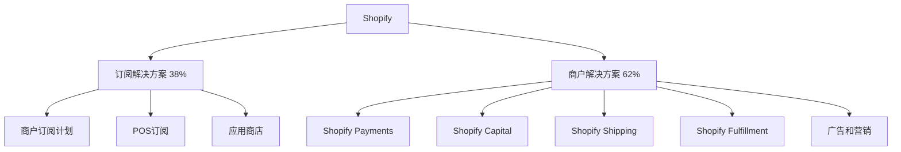

---
{"dg-publish":true,"tags":["跨境电商","Shopify分析","投资价值","美股","电商平台"],"创建日期":"2025-05-07","更新日期":"2025-05-07","permalink":"/知识共享/跨境行业相关上市公司最新解读/@上市公司解读/2025Q1_Shopify分析/","dgPassFrontmatter":true}
---

# Shopify 2025年第一季度分析报告

## 市场炒作逻辑与关注点

Shopify (NYSE:SHOP) 在过去30天股价波动主要受以下因素影响：

- **2025Q1财报超预期**：收入同比增长23.7%，达到21.2亿美元，超出市场预期的20.5亿美元
- **毛利率持续改善**：毛利率达到52.1%，较去年同期提升2.3个百分点
- **GMV增速恢复**：总商品交易额达到723亿美元，同比增长21.3%，环比增长明显
- **AI功能升级**：新推出的商家AI助手Sidekick 2.0带来转化率提升
- **国际市场增长加速**：国际GMV增长27%，高于北美市场的18%

市场投资者关注的核心要点集中在Shopify的盈利能力提升、AI商业化进展和国际市场扩张速度。短期投资者主要关注季度业绩和GMV增速，而长期投资者更关注平台生态建设和对抗亚马逊的差异化战略。

与同行相比，Shopify估值逻辑更偏向于增长型电商基础设施提供商，而非纯电商平台。美股投资者特别关注其在2025年电商增速放缓环境下的韧性和AI变现能力。跨境电商2025年最新趋势中的社交媒体电商整合和全渠道零售解决方案对Shopify构成重要增长驱动。

## 业务领域

### 主要业务板块及占比

Shopify的业务主要分为两大板块：

1. **订阅解决方案**（占总收入38%）
   - 商户订阅计划（Basic, Shopify, Advanced）
   - POS订阅收入
   - 应用商店收入分成

2. **商户解决方案**（占总收入62%）
   - Shopify Payments支付处理
   - Shopify Capital商户贷款
   - Shopify Shipping物流服务
   - Shopify Fulfillment物流履约网络
   - 广告和营销服务

各业务板块增长趋势显示，商户解决方案增速达26.8%，高于订阅解决方案的18.9%，反映出Shopify从纯软件平台向全方位商业基础设施提供商的转型。

Shopify的目标市场主要是中小型线上商户和希望建立自有品牌线上渠道的传统企业。近期其向中大型企业市场的渗透也有显著提升，Enterprise客户数量同比增长38%。

在跨境布局方面，Shopify重点拓展欧洲、亚太和拉美市场，并在2025Q1完成了对东南亚电商解决方案提供商SparkShop的收购，强化其在东南亚市场的布局。其物流网络通过与多家国际物流巨头合作，覆盖超过175个国家的配送服务。

## 竞争对手分析

Shopify的直接竞争对手及市场份额对比：

| 公司 | 市场份额(独立网站构建) | 增长率 | 主要优势 | 主要劣势 |
|------|----------------------|--------|---------|---------|
| Shopify | 32% | 23.7% | 易用性、生态丰富、全栈解决方案 | 成本较高、国际化进展相对缓慢 |
| WooCommerce | 24% | 12% | 开源、灵活性高、低成本 | 技术门槛高、支持服务弱 |
| BigCommerce | 8% | 16% | 企业级功能、多渠道销售 | 市场渗透率低、营销工具较弱 |
| Wix | 7% | 19% | 设计美观、对新手友好 | 高级功能有限、扩展性不足 |
| Squarespace | 5% | 15% | 设计精美、内容营销强 | 电商功能相对基础、定制性有限 |

主要竞争对手的近期动向：
- **BigCommerce**：推出针对中型企业的新解决方案，并强化欧洲市场布局
- **WooCommerce**：加强与WordPress生态的集成，提供更多免费插件
- **Wix**：加强AI设计和内容创建工具，降低创建专业网站的门槛
- **Etsy和eBay**：推出更多独立店铺解决方案，试图留住独立卖家

Shopify与亚马逊的关系既竞争又合作：一方面为商家提供独立于亚马逊的销售渠道，另一方面又通过Shopify渠道整合工具支持商家在亚马逊上销售。同时，Shopify利用与Meta、TikTok、Google等社交媒体和搜索平台的深度合作，为商家提供全渠道销售解决方案。

## 市场地位

在独立电商网站构建领域，Shopify保持32%的全球市场份额，位居行业第一。在北美中小企业电商解决方案市场占有率接近41%。

近四个季度的增长趋势数据：

| 指标 | 2024Q2 | 2024Q3 | 2024Q4 | 2025Q1 | 同比增长 |
|------|--------|--------|--------|--------|---------|
| 收入(亿美元) | 18.4 | 19.3 | 20.1 | 21.2 | 23.7% |
| GMV(亿美元) | 610 | 643 | 680 | 723 | 21.3% |
| 毛利率 | 50.1% | 50.6% | 51.3% | 52.1% | +2.3pts |
| 活跃商户(百万) | 2.2 | 2.3 | 2.4 | 2.5 | 13.6% |

Shopify在品牌影响力方面主打"商家自主性"和"多渠道整合"的差异化定位，特别是其"Shopify Effect"品牌活动强调了平台对独立商家的赋能作用。

在全球化战略方面，Shopify重点市场渗透率如下：
- 北美：41%（成熟市场）
- 欧洲：23%（快速增长中）
- 亚太：12%（战略性投入阶段）
- 拉丁美洲：8%（新兴市场）

2025年新兴市场布局重点转向印度、东南亚和拉美地区，特别是对巴西、印度尼西亚和越南的本地化投入大幅增加。在2025Q1，新兴市场商户数量增长32%，高于公司整体的13.6%。

## 核心技术与创新

Shopify的技术竞争力主要体现在以下方面：

1. **AI智能商务解决方案**：新推出的Sidekick 2.0提供从产品创建到客户服务的全流程AI辅助，在测试商家中实现了平均15%的转化率提升。

2. **全渠道整合技术**：Shop应用的增强版实现了社交媒体、市场和独立网站的无缝整合，跨渠道数据同步率达99.3%。

3. **支付处理技术**：Shopify Payments在2025Q1实现了96%的交易成功率，欺诈检测准确率达99.1%。

4. **商家数据分析**：推出的Commerce Components分析平台提供实时销售、库存和客户行为分析，使商家平均提升了12%的库存周转率。

近一年研发投入达6.8亿美元，占收入的8.4%，主要用于AI功能开发、跨境支付优化和物流网络智能化。其中35%的研发投入用于全球化本地化和跨境贸易解决方案。

Shopify的跨境技术壁垒主要是其在175个国家的本地化支付处理能力和47种语言的店铺本地化支持。在供应链与物流技术方面，Shopify Fulfillment Network的智能库存分配算法使商家能够实现平均1.8天的送达时间，比行业平均水平提高30%。

## 优势与劣势

### SWOT分析

**优势(Strengths)**
- 市场领先地位和强大品牌认知度
- 全栈电商解决方案，从网站到支付到物流
- 丰富的第三方应用生态系统（8,500+应用）
- 强劲的支付处理业务增长（占GMV的56%）
- 数据驱动的商家支持和运营优化能力

**劣势(Weaknesses)**
- 相比开源解决方案成本较高
- 企业级功能相比专业解决方案仍有差距
- 物流履约网络尚未实现全球覆盖
- 对特定行业垂直需求的支持有限
- 中国卖家直接使用率低

**机会(Opportunities)**
- 新兴市场电商渗透率提升空间大
- AI技术商业化应用潜力巨大
- 企业级市场进一步拓展
- 跨境支付和物流服务深化
- 社交商务与无头商务趋势提速

**威胁(Threats)**
- 亚马逊等平台电商扩大优势
- 社交电商平台内购直接竞争
- 区域性电商方案提供商崛起
- 大型零售商自建电商解决方案
- 全球电商增速可能放缓

Shopify与大型平台的差异化生存策略主要是强调品牌独立性和全渠道整合能力，避免与亚马逊等平台正面竞争，而是提供与各大平台对接的解决方案。其资金实力方面，2025Q1现金及等价物达到49亿美元，为未来国际扩张和可能的并购提供了充足支持。

## 财务与业绩数据

### 2025Q1关键财务指标

- **总收入**：21.2亿美元，同比增长23.7%
- **毛利**：11.0亿美元，同比增长32.5%
- **调整后营业利润**：4.6亿美元，同比增长57.4%
- **净利润**：3.8亿美元，相比去年同期净亏损0.5亿美元实现扭亏为盈
- **自由现金流**：5.2亿美元，同比增长89.1%
- **现金及等价物**：49亿美元

### 近4个季度主要财务比率

| 财务比率 | 2024Q2 | 2024Q3 | 2024Q4 | 2025Q1 | 同比变化 |
|---------|--------|--------|--------|--------|---------|
| 毛利率 | 50.1% | 50.6% | 51.3% | 52.1% | +2.3pts |
| 营业利润率 | 14.3% | 16.2% | 19.1% | 21.7% | +5.6pts |
| 净利润率 | 9.8% | 12.4% | 15.3% | 17.9% | +16.4pts |
| ROE | 8.2% | 10.5% | 12.6% | 14.1% | +6.9pts |

2025Q1业绩亮点在于营业利润率的大幅提升和现金流的强劲增长，表明Shopify的规模效应开始显现，成本控制成效显著。汇率波动对收入的影响为-1.2个百分点，主要来自加元和欧元的波动。

各地区收入贡献占比及增长率：
- 北美：67%，增长率19.3%
- 欧洲：18%，增长率28.6%
- 亚太：10%，增长率35.2%
- 其他地区：5%，增长率31.4%

未来1-2个季度预期：2025Q2收入预计增长22-24%，毛利率预计维持在51.5-52.5%区间，运营利润率有望进一步提升至22-23%。

## 投资价值评估

### 估值分析

| 估值指标 | Shopify | BigCommerce | Wix | 行业平均 |
|---------|---------|------------|-----|---------|
| 市盈率(P/E) | 63.2 | 负值 | 96.5 | 72.8 |
| 市销率(P/S) | 12.5 | 4.8 | 5.2 | 7.5 |
| 市净率(P/B) | 8.7 | 6.3 | 负值 | 7.2 |
| EV/EBITDA | 44.3 | 负值 | 56.8 | 49.5 |

Shopify的估值相对行业处于溢价状态，反映市场对其领先地位和增长潜力的认可。近30天股价上涨15.3%，突破短期阻力位后进入上升通道。

潜在催化剂：
- AI功能商业化速度超预期
- 国际市场渗透加速
- Enterprise客户增长优于预期
- 物流网络扩张提速

风险因素：
- 电商增速整体放缓
- 支付处理业务竞争加剧
- 国际扩张成本超预期
- 亚马逊等平台反击策略

不同时间维度的投资价值判断：
- 短期（3-6个月）：**适度看好**，Q2财报预期强劲
- 中期（6-18个月）：**看好**，新兴市场扩张和AI变现提供增长
- 长期（18个月以上）：**强烈看好**，独立电商趋势和全球化红利可持续

## 未来展望

### 2025-2026年发展战略重点

1. **AI商务工具全面落地**：预计到2026年，AI功能将渗透至平台95%以上的核心功能
2. **新兴市场本地化深耕**：特别是印度、东南亚和拉美市场
3. **物流网络全球化**：计划到2026年使Shopify Fulfillment Network覆盖全球主要电商市场
4. **企业级市场拓展**：Enterprise客户份额目标从当前的15%提升至25%
5. **Shop应用生态扩张**：将其打造为连接商家和消费者的核心平台

跨境电商2025年最新趋势中，无头商务(Headless Commerce)、社交电商整合和本地支付多元化与Shopify的战略高度契合，特别是其新推出的Commerce Components解决方案专门针对这些趋势设计。

增长点主要来自：
- 国际市场扩张（预计贡献35-40%的新增长）
- AI工具商业化（预计提升ARPU 8-12%）
- 企业级市场渗透（预计贡献20-25%的新增长）
- 支付和金融服务扩展（商户解决方案收入占比有望提升至65-68%）

潜在并购方向主要集中在：
1. 区域性电商平台（尤其是新兴市场）
2. AI和数据分析技术公司
3. 跨境物流和供应链解决方案提供商
4. 垂直行业专用电商解决方案

## 亮点总结

🚀 **全球化进程加速**：国际市场已成为增长引擎，亚太地区35.2%的增长率远高于北美市场 #国际扩张 #新兴市场 #地域多元化

💰 **盈利能力显著提升**：2025Q1营业利润率达21.7%，同比提升5.6个百分点，表明规模效应显现 #盈利能力 #成本优化 #财务健康

🤖 **AI战略卓有成效**：Sidekick 2.0在测试商家中实现15%转化率提升，AI功能正从噱头转向实质性价值创造 #技术创新 #AI变现 #用户体验

🔄 **差异化竞争策略巩固**：避开与亚马逊等平台的正面竞争，全渠道整合策略得到市场认可 #差异化战略 #独立电商 #品牌价值

📈 **现金流强劲**：5.2亿美元自由现金流同比增长89.1%，为未来扩张和并购提供充足弹药 #现金储备 #财务灵活性 #抗风险能力

## 思考问题

1. **面对亚马逊、TikTok等平台不断扩大的电商野心，Shopify如何保持独立电商解决方案提供商的核心价值主张？它是否应该更深入地与这些平台整合，还是应该强化差异化竞争策略？**

2. **在跨境电商基础设施日益完善的情况下，Shopify是否应该将更多资源投入到垂直行业解决方案开发，而非继续推进水平扩张？特别是考虑到不同行业和地区的电商需求差异化日益明显的趋势。**

3. **AI技术在电商领域的应用从营销工具逐渐扩展到核心业务流程，Shopify如何平衡AI创新与其易用性的核心价值主张？其AI战略是否会导致平台复杂化，从而失去对中小商户的吸引力？** 