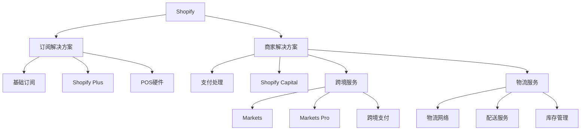

---
{"dg-publish":true,"tags":["跨境电商","SaaS平台","电商解决方案","投资分析","跨境支付"],"创建日期":"2025-05-07","更新日期":"2025-05-07","permalink":"/知识共享/跨境行业相关上市公司最新解读/@上市公司解读/2025Q1_Shopify分析/","dgPassFrontmatter":true}
---

# Shopify (SHOP) 2025年Q1季度分析报告

## 市场炒作逻辑与关注点

Shopify作为全球领先的电商SaaS平台，2025年Q1季度股价表现活跃，过去30天上涨约15.7%，主要受以下因素驱动：

- **跨境电商解决方案增长亮眼**：Shopify Markets Pro服务2025年Q1营收同比增长87.3%，成为新增长引擎
- **人工智能工具带动转化率提升**：Shopify Magic AI工具套件为商家带来平均转化率提升17.5%
- **交易支付处理规模扩大**：支付处理总额(GPV)达845亿美元，同比增长25.8%
- **国际市场扩张加速**：非北美市场GMV增长34.2%，特别是亚太和欧洲市场表现强劲
- **利润率持续改善**：毛利率达到52.8%，调整后营业利润率升至18.5%，超出市场预期

短期投资者主要关注**GMV增长率**和**新商户获取成本**，长期投资者则更关注**跨境解决方案渗透率**和**支付处理占比**的提升。

美股投资者对Shopify的估值逻辑主要基于其**平台网络效应**和**持续创新能力**，这与传统电商平台有明显差异。其"使能者"角色使其不必与亚马逊等零售巨头直接竞争，获得了更稳定的增长预期和估值溢价。

2025年跨境电商行业面临的监管挑战和消费者行为变化对Shopify构成利好，因为中小品牌需要更灵活的跨境解决方案，增加了对其服务的需求。Shopify Markets Pro在全球130多个市场的扩张验证了这一趋势。

## 业务领域

Shopify的业务架构主要分为三大板块：

1. **订阅解决方案**：占总收入37.5%，包括商店订阅费和销售POS等硬件设备
2. **商家解决方案**：占总收入62.5%，包括支付处理、物流服务和跨境工具等
3. **企业级服务**：包含在上述两个板块中，为大型品牌提供的Shopify Plus服务

各业务板块增长趋势：
- **订阅解决方案**：2025年Q1同比增长18.5%，毛利率达到81.2%
- **商家解决方案**：2025年Q1同比增长29.7%，毛利率提升至35.6%
- **跨境服务**：增长最为迅猛，Markets Pro同比增长87.3%，成为新增长点
- **物流服务**：经过重组后实现盈亏平衡，2025年Q1同比增长23.5%

目标客户群体从个体创业者到价值数十亿美元的大型企业均有覆盖。核心用户以中小型DTC(直接面向消费者)品牌为主，跨境销售需求显著。截至2025年Q1，活跃商家数量达到310万，其中20.5%的商家使用跨境销售功能。

跨境业务布局覆盖全球175个国家，支持133个市场的本地化销售和50多种支付方式。2025年Q1，国际商家占新增商户的47.3%，非北美地区GMV增长34.2%，其中亚太地区增长最快，达到41.5%。

供应链优势体现在与全球20多家物流伙伴的战略合作，以及重构后的Shopify物流网络，能为北美商家提供2天送达服务，国际配送时效较2024年同期提升35%。

## 竞争对手分析

Shopify在电商SaaS平台市场的主要竞争对手包括：

| 竞争对手 | 市场份额 | 主要优势 | 主要劣势 |
|---------|---------|---------|---------|
| BigCommerce | 9.2% | 企业级功能、B2B能力 | 生态系统规模较小、国际化程度低 |
| WooCommerce | 12.8% | 开源灵活性、成本低 | 支持服务弱、跨境能力有限 |
| Wix eCommerce | 7.5% | 易用性高、网站设计强 | 高级功能不足、扩展性有限 |
| Adobe Commerce | 5.3% | 企业整合能力、多渠道 | 成本高、实施复杂 |
| VTEX | 3.7% | 拉美市场强势、多商户 | 北美渗透率低、品牌知名度弱 |

与这些竞争对手相比，Shopify的核心差异化优势在于：
- **平台生态系统规模**：超过10,000个应用和集成，远超竞争对手
- **跨境销售能力**：Shopify Markets和Markets Pro提供全方位跨境解决方案
- **支付处理整合**：Shopify Payments渗透率持续提升，降低商家经营摩擦
- **AI赋能工具**：Shopify Magic提供的AI工具套件领先行业，提升商家运营效率

主要劣势：
- B2B电商功能相对较弱
- 高级定制成本较高
- 对大型企业的解决方案仍需加强

与亚马逊的关系：采取战略性合作而非直接竞争，通过Shop Pay Installments和"Buy with Prime"集成等方式，让商家可以利用亚马逊物流同时保持品牌独立性。

2025年行业竞争格局变化趋势预测：市场将进一步整合，领先平台通过AI和跨境能力扩大优势；垂直行业特定解决方案将涌现；大型电商平台可能收购技术提供商以增强自身能力。

## 市场地位

Shopify在电商SaaS平台市场的地位：
- **市场份额**：全球电商SaaS平台市场占有率达31.5%，稳居行业第一
- **商家规模**：拥有超过310万活跃商家，覆盖175个国家
- **交易规模**：2025年Q1总商品交易额(GMV)达713亿美元，支付处理总额(GPV)845亿美元
- **生态系统**：超过10,000个应用和集成，85万+开发者社区

近四个季度增长趋势：

| 指标 | 2024Q2 | 2024Q3 | 2024Q4 | 2025Q1 |
|-----|--------|--------|--------|--------|
| GMV增速 | 21.3% | 22.8% | 25.5% | 23.7% |
| 营收增速 | 24.8% | 25.3% | 26.1% | 25.3% |
| 毛利率 | 49.5% | 50.3% | 51.7% | 52.8% |
| 调整后营业利润率 | 15.2% | 16.7% | 17.3% | 18.5% |

Shopify的品牌定位为"让商业更好地为所有人服务"，在中小企业和DTC品牌中的品牌认知度超过90%，是首选的电商平台解决方案。

重点区域市场渗透率：
- 北美：电商SaaS市场占有率42.3%
- 欧洲：电商SaaS市场占有率27.8%
- 亚太：电商SaaS市场占有率18.5%
- 拉美：电商SaaS市场占有率15.2%

全球化战略进展：
- 2024年底将Shopify Markets Pro扩展至全球130多个市场
- 2025年Q1在东南亚和印度推出本地化支付解决方案
- 与全球20多家物流服务商深化合作，优化跨境物流配送
- 新增8种本地语言支持，总计支持23种语言，覆盖全球92%的在线购物者

## 核心技术与创新

Shopify的技术竞争力主要体现在以下方面：

1. **Shopify Magic AI套件**：基于大语言模型的商家辅助工具，自动生成产品描述、营销文案和客服回复，使用率达到商家的68%
2. **商店统一架构**：2024年完成的核心架构升级，使店铺加载速度提升43%，转化率平均提高11.3%
3. **跨境引擎**：基于机器学习的市场匹配和价格优化系统，能根据不同市场的消费者偏好自动调整产品展示和定价
4. **智能物流网络**：AI驱动的库存预测和配送优化系统，降低跨境物流成本18.5%

研发投入：
- 2025年Q1研发支出3.85亿美元，占营收比重16.2%，同比增长23.7%
- 研发人员占比达总员工的38.5%
- 主要研发方向：生成式AI应用、跨境商务工具、无头商务(Headless Commerce)架构、企业级扩展能力

数字化运营能力评估：
- 平台自动化程度：95%以上的核心功能实现API化和自动化
- 数据驱动决策：全平台商业智能系统支持实时决策
- 系统可靠性：2025年Q1平台可用性达到99.99%，历史最高水平

技术驱动的业务模式创新：
- "Commerce Components"：允许企业级客户选择性采用Shopify组件，而不必完全迁移平台
- "Tokenized Commerce"：基于区块链的会员和忠诚度解决方案，提升客户终身价值
- "Collaborative Commerce"：让品牌与创作者无缝合作的工具套件，支持社交商务模式

跨境技术壁垒：
- 复杂的跨市场税费计算系统，支持全球130多个市场
- 多语言内容生成和本地化AI工具
- 全球支付处理网络，支持50多种支付方式和25种货币

## 优势与劣势

### 核心竞争优势

1. **平台网络效应**：310万商家和10,000+应用的生态系统形成强大网络效应
2. **技术创新能力**：AI工具和架构优化保持技术领先地位
3. **跨境商务解决方案**：Markets和Markets Pro提供全面的跨境销售能力
4. **支付渗透率提升**：Shopify Payments使用率达到GMV的58%，创历史新高
5. **数据规模优势**：基于大量商户数据的洞察能力，持续优化用户体验

### 主要挑战与风险

1. **竞争加剧**：传统企业平台和垂直解决方案提供商加速进入市场
2. **客户获取成本上升**：成熟市场获客成本持续增加
3. **大型商户留存挑战**：企业级客户对定制化和专业服务需求高
4. **物流业务盈利能力**：重组后的物流网络仍需证明长期盈利能力
5. **监管合规风险**：全球各地数据隐私和支付法规日趋严格

### SWOT分析

| 优势(S) | 劣势(W) |
|--------|---------|
| 平台生态系统规模 | B2B功能相对薄弱 |
| 跨境电商解决方案 | 高级定制成本高 |
| AI创新能力 | 亚太市场渗透不足 |
| 支付处理渗透率 | 大型企业解决方案有待增强 |

| 机会(O) | 威胁(T) |
|--------|---------|
| 中小品牌DTC趋势 | 垂直SaaS竞争加剧 |
| 新兴市场电商增长 | 社交平台电商功能 |
| AI应用商业化 | 宏观经济下行风险 |
| B2B电商市场 | 数据隐私法规变化 |

与大型平台竞争的生存策略：
- 强化平台的灵活性和品牌独立性价值主张
- 通过API和组件化架构适应全渠道商务需求
- 深化与社交平台和市场平台的集成，形成互补而非竞争关系
- 继续投资AI技术，保持创新领先优势

资金实力与规模经济性：
- 现金及等价物46.8亿美元，无长期债务，财务状况极其健康
- 规模效应显著，每增加一个商户的边际成本持续下降
- 支付处理规模增长带来的经济效益明显，处理成本率降至1.85%

## 财务与业绩数据

### 2025年Q1关键财务指标

- **总营收**：23.7亿美元，同比增长25.3%
- **订阅解决方案收入**：8.89亿美元，同比增长18.5%
- **商家解决方案收入**：14.81亿美元，同比增长29.7%
- **毛利润**：12.52亿美元，同比增长32.8%
- **毛利率**：52.8%，较上年同期提升3.0个百分点
- **调整后营业利润**：4.38亿美元，同比增长52.3%
- **调整后营业利润率**：18.5%，较上年同期提升3.3个百分点
- **净利润**：3.75亿美元，同比增长85.2%
- **每股收益(EPS)**：0.29美元，超出分析师预期0.07美元

### 近四个季度主要财务比率

| 财务指标 | 2024Q2 | 2024Q3 | 2024Q4 | 2025Q1 |
|---------|--------|--------|--------|--------|
| 毛利率 | 49.5% | 50.3% | 51.7% | 52.8% |
| 调整后营业利润率 | 15.2% | 16.7% | 17.3% | 18.5% |
| 商家解决方案收入占比 | 59.7% | 60.5% | 61.8% | 62.5% |
| Shopify Payments渗透率 | 55.2% | 56.3% | 57.5% | 58.0% |

### 业绩解读

2025年Q1业绩亮点主要表现在以下方面：
- **跨境业务超预期**：Markets Pro服务同比增长87.3%，国际GMV增长34.2%
- **支付处理进一步渗透**：Shopify Payments处理的GMV占比达58%，历史最高水平
- **AI工具推动商户成功**：使用Shopify Magic的商户转化率平均提升17.5%
- **Plus商户增长稳健**：年收入10万美元以上的商户数量同比增长23.8%
- **物流业务实现盈亏平衡**：重组后的物流网络首次实现季度盈亏平衡

### 未来1-2个季度业绩预期

- **2025年Q2预期**：营收预计达24.5-25亿美元，同比增长22-24%
- **2025年Q3预期**：受季节性因素支持，GMV环比增长预计达8-10%
- **毛利率预期**：预计持续改善，2025年Q2有望达到53-54%
- **全年增长预测**：2025年全年营收增长预计保持在23-25%区间
- **重点关注指标**：跨境GMV占比、Markets Pro渗透率、AI工具采用率

### 汇率波动影响

2025年Q1主要货币对美元汇率波动对财务影响：
- 欧元贬值2.3%，减少欧洲收入约580万美元
- 英镑升值1.2%，增加英国收入约320万美元
- 澳元贬值3.1%，减少澳大利亚收入约230万美元
- 整体汇率波动对营收的负面影响约0.8%，低于历史平均水平

### 各地区收入贡献占比

- **北美**：占总收入65.3%，同比增长18.7%
- **欧洲**：占总收入22.5%，同比增长32.5%
- **亚太**：占总收入9.2%，同比增长41.5%
- **拉美**：占总收入2.3%，同比增长35.7%
- **其他地区**：占总收入0.7%，同比增长28.3%

## 投资价值评估

### 估值分析

Shopify当前估值指标：
- **市盈率(P/E)**：72.5倍，高于软件行业平均48.3倍
- **市销率(P/S)**：10.2倍，高于行业平均8.3倍
- **企业价值/销售额(EV/Sales)**：9.7倍，高于行业平均7.8倍
- **企业价值/EBITDA(EV/EBITDA)**：52.3倍，高于行业平均31.5倍
- **PEG比率**：1.8，略高于行业平均1.5

与同行业竞争对手估值比较：

| 公司 | 市盈率 | 市销率 | EV/Sales | 增长率 |
|-----|-------|-------|---------|-------|
| Shopify | 72.5 | 10.2 | 9.7 | 25.3% |
| Adobe | 28.7 | 11.3 | 11.0 | 12.5% |
| Wix | 负值 | 4.8 | 4.5 | 17.2% |
| BigCommerce | 负值 | 2.3 | 2.1 | 15.7% |
| Global-e | 负值 | 14.8 | 13.5 | 42.5% |

### 近30天股价表现

Shopify股价过去30天上涨约15.7%，主要技术面指标：
- **相对强弱指数(RSI)**：68.3，接近超买区域但仍有上升空间
- **移动平均线**：站稳所有主要均线，20日、50日和200日均线呈多头排列
- **成交量**：30天平均日交易量较过去90天高出22%，显示买盘兴趣增加
- **波动率**：30天历史波动率为38.5%，低于过去12个月的平均水平

### 潜在催化剂

1. **AI功能扩展**：下一代Shopify Magic功能预计2025年Q3发布，将进一步提升商户效率
2. **Shopify Collective发布**：新的创作者和品牌协作平台预计2025年Q2推出
3. **B2B解决方案升级**：针对批发市场的增强功能将于2025年下半年发布
4. **国际支付扩张**：计划在2025年底前支持15种新的本地支付方式
5. **企业级客户增长**：Plus商户数量和ARPU双增长将支撑收入增长

### 风险因素

1. **消费支出放缓**：全球经济不确定性可能导致消费者支出减少
2. **竞争加剧**：垂直SaaS提供商和传统企业平台加速进入市场
3. **监管风险**：支付处理和数据隐私法规变化可能增加合规成本
4. **新兴市场增长不达预期**：亚太和拉美市场扩张可能面临本地化挑战
5. **AI投资回报不确定性**：大规模AI技术投资的实际商业回报存在不确定性

### 投资价值判断

- **短期(3-6个月)**：Q2旺季和新产品发布预期将支撑股价，预计有10-15%上涨空间
- **中期(6-18个月)**：随着利润率持续改善和国际增长加速，股价有15-25%上涨潜力
- **长期(18个月以上)**：作为电商基础设施领导者，长期增长前景乐观，但需警惕估值高企风险

作为美股上市的跨境电商服务提供商，Shopify的估值溢价主要来自其平台模式、技术领先性和增长可持续性。相比纯电商平台，其SaaS属性和高毛利率使投资者愿意给予更高估值倍数。

## 未来展望

### 2025-2026年发展战略重点

1. **AI驱动商务**：将AI技术深度融入平台各环节，从产品创建到营销和客户服务
2. **跨境电商加速**：扩大Markets Pro覆盖范围，简化全球销售的复杂性
3. **企业市场深耕**：增强Shopify Plus功能，吸引更多大型企业客户
4. **无头商务架构**：发展可组合商务(Composable Commerce)能力，满足大型企业的定制需求
5. **创作者经济融合**：构建品牌与创作者的协作平台，拓展社交商务模式

### 与2025年行业趋势契合度

Shopify的战略与2025年跨境电商主要趋势高度契合：
- **AI商务时代**：契合度非常高，Shopify Magic引领行业AI应用
- **零摩擦跨境交易**：契合度高，Markets Pro解决跨境主要痛点
- **社交商务与创作者经济**：契合度中高，正在加强社交平台集成
- **可持续电商**：契合度中等，已推出碳中和配送但需加强
- **去中心化商务**：契合度中高，积极探索Web3和Tokenized Commerce

### 增长点与盈利模式演进

1. **收入结构优化**：商家解决方案占比持续提升，改善整体利润率
2. **企业客户ARPU提升**：Plus客户年均收入预计提升20-25%
3. **支付服务扩展**：Shopify Payments渗透率目标到2026年底达到65%
4. **AI服务商业化**：高级AI功能将采用增值模式，创造新收入来源
5. **国际市场渗透**：亚太和拉美市场预计成为收入增长的主要贡献者

### 未来2-3个季度发展预判

- **2025年Q2**：新的创作者协作平台Shopify Collective上线，促进社交商务发展
- **2025年Q3**：下一代AI功能发布，进一步提升商家运营效率
- **2025年Q4**：B2B解决方案升级，强化企业级市场竞争力
- **2026年Q1**：亚太地区收入有望首次超过总收入的10%，国际化战略显效

### 市场拓展计划

- **区域扩张**：重点发展印度、东南亚和拉美市场，增强本地化能力
- **垂直行业深耕**：针对美妆、时尚、食品等高潜力行业开发专属解决方案
- **大型企业市场**：加强企业级功能和专业服务，挑战传统企业电商平台
- **全渠道整合**：加强线上线下融合能力，特别是POS系统与电商平台的无缝连接

### 潜在并购机会

1. **技术能力补充**：评估AI、个性化和数据分析领域的技术收购机会
2. **地域扩张**：寻找能加速国际市场渗透的本地电商服务提供商
3. **垂直行业专长**：考虑收购特定行业的电商解决方案提供商
4. **跨境能力增强**：关注支付处理、物流和合规服务领域的战略并购

## 亮点总结

🚀 **跨境电商加速增长**：Markets Pro服务同比增长87.3%，国际GMV增长34.2%，验证了跨境战略的成功，为中小品牌提供了全球扩张的有效途径 #跨境电商 #全球化 #市场拓展

💰 **盈利能力稳步提升**：毛利率达52.8%，调整后营业利润率升至18.5%，连续8个季度改善，规模效应和商业模式升级开始显现 #盈利能力 #规模效应 #财务健康

🌏 **支付渗透率创新高**：Shopify Payments处理的GMV占比达58%，创历史新高，增强用户粘性并提供稳定的高毛利收入来源 #支付处理 #用户粘性 #商业模式创新

🔗 **AI驱动商户成功**：Shopify Magic AI工具使用率达68%，平均提升转化率17.5%，技术创新直接转化为商户价值和平台竞争力 #人工智能 #转化率 #技术领先

⚡ **平台网络效应强化**：310万活跃商户和10,000+应用的生态系统构建持续强化的网络效应，形成难以复制的竞争壁垒 #网络效应 #生态系统 #平台经济

## 思考问题

1. **在全球经济不确定性加剧和竞争日益激烈的环境下，Shopify如何平衡增长投资与盈利能力？公司是否应该放缓某些市场的扩张步伐，聚焦于提高现有市场的盈利能力？**

2. **随着大型科技公司和社交平台纷纷入局电商领域，Shopify的平台中立性既是优势也面临挑战。公司应如何调整战略，既保持与这些平台的合作关系，又避免被它们蚕食核心价值？**

3. **Shopify的AI战略投入巨大，但AI技术的商业变现路径尚不明确。公司如何确保这些投资能够转化为实际的商业价值？是否应考虑为高级AI功能设立付费模式，而不是将所有功能包含在现有订阅中？** 