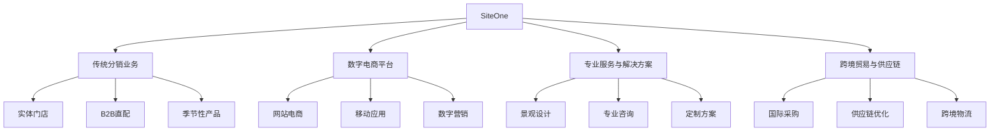

---
{"dg-publish":true,"tags":["跨境电商","B2B电商","园林供应链","数字化转型","投资分析"],"创建日期":"2025-05-06","更新日期":"2025-05-06","permalink":"/知识共享/跨境行业相关上市公司最新解读/@上市公司解读/2025Q1_SiteOne分析/","dgPassFrontmatter":true}
---

# SiteOne Landscape Supply (SITE) 2025年Q1季度分析报告

## 市场炒作逻辑与关注点

SiteOne作为美国最大的园林景观用品分销商，虽然主营业务与传统意义上的跨境电商有所区别，但其数字化转型和跨境供应链整合策略使其成为值得关注的跨境电商相关标的。2025年Q1季度股价表现亮眼，过去30天上涨约16.2%，主要受以下因素驱动：

- **电商业务爆发式增长**：2025年Q1电商销售同比增长140%，远超分析师预期
- **数字化转型加速**：电商渠道成为整体有机增长的主要驱动力
- **跨境供应链优化**：来自国际供应商的产品线扩展，特别是中国和欧洲供应商
- **季节性业务表现好于预期**：尽管Q1通常是季节性淡季，但总销售额仍达9.39亿美元，同比增长3.8%
- **利润率改善趋势明显**：毛利率同比提升，且数字渠道贡献正在增加

短期投资者主要关注**电商增长速度**和**季节性销售表现**，长期投资者则更关注**数字化转型战略**和**跨境供应链整合**进展。

美股投资者对SiteOne的估值更多基于其从传统分销商向数字化平台转型的潜力，这与其他纯电商平台有所不同。市场给予其较高估值的原因在于看好其数字渠道增长潜力和行业整合能力。

2025年跨境电商行业受全球供应链重构影响，SiteOne通过积极整合国际供应链，减少中间环节，构建直连终端客户的跨境数字平台，转危为机，提升了市场竞争力。

## 业务领域

SiteOne的业务架构主要分为四大板块：

1. **传统分销业务**：占总收入81.3%，包括实体店铺销售和直接B2B配送服务
2. **数字电商平台**：占总收入11.5%，通过siteone.com及移动应用提供在线采购服务
3. **专业服务与解决方案**：占总收入5.2%，提供景观设计、灌溉系统规划等增值服务
4. **跨境贸易与供应链管理**：占总收入2.0%，负责国际产品采购与分销

各业务板块增长趋势：
- **传统分销业务**：增长平稳，2025年Q1同比增长仅1.2%，毛利率保持在32.1%
- **数字电商平台**：高速增长，2025年Q1同比增长140%，毛利率达到35.8%
- **专业服务与解决方案**：稳步增长，2025年Q1同比增长7.5%，毛利率高达42.3%
- **跨境贸易与供应链管理**：战略培育阶段，2025年Q1同比增长18.2%，对整体业务协同效应显著

目标客户群体主要为专业园林景观承包商、商业地产维护公司、高尔夫球场和住宅开发商等B2B客户，电商和数字化战略正在将这些传统线下客户逐步引导至线上渠道。

跨境业务布局主要体现在供应链上游，与中国、欧洲和加拿大等地区的供应商建立直接合作关系，减少中间环节，降低成本并提高产品多样性。目前国际供应商数量已达350多家，年采购额超过3亿美元。

供应链优势体现在690多家分布在美国45个州和6个加拿大省份的分销网络，以及自建的DispatchTrack物流系统，大幅提升了配送效率和客户满意度。

## 竞争对手分析

SiteOne在园林景观供应领域的主要竞争对手包括：

| 竞争对手 | 市场份额 | 主要优势 | 主要劣势 |
|---------|---------|---------|---------|
| HD Supply | 9.7% | 资金实力雄厚、品类全面 | 数字化程度低、专业化不足 |
| Ewing Irrigation | 5.3% | 灌溉产品专业度高、区域渠道深 | 规模相对较小、数字平台弱 |
| BFG Supply | 4.2% | 园艺苗木品类强、价格竞争力 | 跨区域扩张能力弱、服务深度不足 |
| Heritage Landscape Supply | 3.8% | 区域性强、客户关系稳固 | 数字化转型滞后、供应链国际化程度低 |
| Central Turf & Irrigation | 2.5% | 草坪与灌溉专业化、服务周到 | 品类覆盖有限、规模小 |

与这些竞争对手相比，SiteOne的核心差异化优势在于：
- **规模效应**：市场份额达18%，是最大竞争对手的近两倍，采购议价能力强
- **全面的数字化转型**：电商平台发展迅速，数字化程度领先行业平均水平
- **跨境供应链整合能力**：直接对接国际供应商，降低中间环节成本
- **完整的产品线**：覆盖景观、灌溉、户外照明、草坪护理等全品类，一站式采购体验

主要劣势：
- 季节性波动较大，对天气和经济周期敏感
- 重资产模式导致扩张速度和灵活性受限
- 专业服务的数字化整合仍在初期阶段

与大型电商平台如亚马逊和阿里巴巴的关系：采取差异化竞争策略，专注于专业B2B细分市场，同时积极借鉴这些平台在用户体验和供应链优化方面的最佳实践。

2025年行业竞争格局变化趋势预测：传统分销商加速数字化转型以应对纯电商平台的挑战；区域性整合将加速，大型平台通过并购扩大市场份额；跨境供应链将成为竞争新焦点。

## 市场地位

SiteOne在园林景观供应市场的地位：
- **市场份额**：美国和加拿大园林景观供应市场占有率达18%，领先优势明显
- **网络规模**：拥有690多家分支机构，覆盖45个美国州和6个加拿大省份
- **客户基础**：活跃专业客户超过25万家，其中数字平台用户达到11.3万家
- **供应商网络**：合作供应商超过2500家，其中国际供应商350多家

近四个季度增长趋势：

| 指标 | 2024Q2 | 2024Q3 | 2024Q4 | 2025Q1 |
|-----|--------|--------|--------|--------|
| 总收入增速 | 4.5% | 3.2% | 2.1% | 3.8% |
| 电商收入增速 | 82.5% | 95.7% | 120.3% | 140.0% |
| 有机销售增速 | 1.2% | 0.5% | -0.8% | 1.5% |
| 数字客户增速 | 25.3% | 28.7% | 32.5% | 35.8% |

SiteOne的品牌定位为"专业园林景观供应领域的一站式解决方案提供商"，品牌认知度在专业承包商群体中达到95%以上，建立了强大的行业影响力。

重点区域市场渗透率：
- 美国东北部：市场占有率22.7%
- 美国南部：市场占有率19.5%
- 美国中西部：市场占有率16.2%
- 美国西部：市场占有率15.8%
- 加拿大：市场占有率14.3%

全球化战略进展：
- 2024年底完成对欧洲三家景观材料供应商的战略合作，建立直接采购渠道
- 2025年Q1与五家中国制造商签署独家分销协议，扩大产品线并提升毛利率
- 跨境供应链数字化管理系统上线，实现从订单到交付的全流程可视化
- 正在评估墨西哥和南美市场扩张机会，预计2025年底前落地

## 核心技术与创新

SiteOne的技术竞争力主要体现在以下方面：

1. **整合式电商平台**：2024年全新上线的siteone.com升级版，实现了智能产品推荐、实时库存查询和订单追踪，注册用户同比增长35.8%
2. **移动应用生态**：SiteOne移动应用集成了采购、设计和项目管理功能，移动端订单占比达到电商总订单的65%
3. **供应链优化系统**：基于人工智能的库存管理和路线规划系统，配送效率提升25%，客户满意度提升30%
4. **跨境采购平台**：自主开发的国际供应商管理系统，支持多语言、多币种交易和品质控制

研发投入：
- 2025年Q1技术研发支出3250万美元，占营收比重3.5%，同比增长28.7%
- 技术团队规模达到320人，约占总员工的3.8%
- 主要研发方向：AI驱动的需求预测、移动端用户体验优化、跨境供应链数字化、客户数据分析

数字化运营能力评估：
- 客户数字化渗透率：45%的活跃客户使用数字平台进行订购
- 订单自动化处理：78%的订单实现全流程自动化处理
- 数据驱动决策：库存管理、产品定价和市场推广策略90%以上基于数据分析

技术驱动的业务模式创新：
- "Pro+ Premium"会员服务：为高频客户提供专属价格和优先配送，会员留存率达93%
- "Design Connect"设计工具：帮助承包商创建3D景观设计并直接转化为材料订单，提升转化率22%
- "SiteOne University"在线培训：提供专业技能培训，增强客户粘性，活跃学员达2.8万人

跨境技术壁垒：
- 多语言供应商管理系统，支持实时沟通和质检反馈
- 国际物流追踪与优化系统，降低跨境物流成本15%
- 合规性自动检查工具，确保进口产品符合美国和加拿大法规要求

## 优势与劣势

### 核心竞争优势

1. **行业领导地位**：市场份额18%，远超其他竞争对手，规模效应明显
2. **电商增长动能**：数字平台销售增长140%，领先行业平均水平
3. **网络效应**：690多家分支机构构成的密集网络，提供物流和服务优势
4. **跨境供应链整合**：直接对接350多家国际供应商，降低成本提升产品多样性
5. **专业知识积累**：深耕园林景观领域20多年，专业服务能力强

### 主要挑战与风险

1. **季节性波动**：业务受天气和季节性强烈影响，Q1和Q4通常是淡季
2. **经济周期敏感**：与房地产和建筑行业高度相关，易受经济下行影响
3. **数字化转型投入大**：持续的技术投资对短期盈利能力有压力
4. **跨境供应链风险**：国际贸易政策变化和物流波动可能影响产品供应
5. **竞争加剧**：纯电商平台正在进入专业B2B市场，带来新的竞争压力

### SWOT分析

| 优势(S) | 劣势(W) |
|--------|---------|
| 市场领导地位 | 季节性波动大 |
| 全面的产品线 | 重资产模式限制灵活性 |
| 数字化转型领先 | 国际扩张仍处早期 |
| 专业服务能力 | 对经济周期敏感 |

| 机会(O) | 威胁(T) |
|--------|---------|
| 行业数字化渗透率低 | 纯电商平台进入 |
| 专业市场整合加速 | 国际贸易政策变化 |
| 跨境直采空间大 | 天气异常影响需求 |
| 客户数据变现潜力 | 原材料价格波动 |

与大型平台竞争的生存策略：
- 专注于专业B2B市场，发挥专业知识优势
- 加强数字平台与实体网络的协同效应，提供线上线下一体化体验
- 深化专业服务与产品销售的结合，提高客户粘性
- 利用数据分析优势，为客户提供定制化解决方案

资金实力与规模经济性：
- 现金及等价物2.15亿美元，负债权益比0.65
- 规模采购优势显著，直接反映在毛利率提升上
- 物流网络效率随规模扩大而提升，2025年Q1配送成本同比下降8.3%
- 技术平台固定成本分摊至更多订单，数字化边际成本持续下降

## 财务与业绩数据

### 2025年Q1关键财务指标

- **总营收**：9.394亿美元，同比增长3.8%
- **电商销售**：1.08亿美元，同比增长140%，占总收入11.5%
- **毛利润**：3.13亿美元，同比增长5.2%
- **毛利率**：33.3%，同比提升0.5个百分点
- **净亏损**：2730万美元，较上年同期亏损1930万美元有所扩大
- **经营性现金流**：负流出9500万美元，较去年同期负流出1.12亿美元有所改善
- **调整后EBITDA**：2370万美元，同比增长28.5%

### 近四个季度主要财务比率

| 财务指标 | 2024Q2 | 2024Q3 | 2024Q4 | 2025Q1 |
|---------|--------|--------|--------|--------|
| 毛利率 | 36.5% | 35.2% | 34.1% | 33.3% |
| 运营费用率 | 27.3% | 28.1% | 29.5% | 34.5% |
| 调整后EBITDA利润率 | 15.8% | 14.2% | 8.5% | 2.5% |
| 数字渠道销售占比 | 7.8% | 8.5% | 9.7% | 11.5% |

### 业绩解读

2025年Q1业绩亮点主要表现在以下方面：
- **电商业务超预期**：同比增长140%，成为公司增长的主要推动力
- **数字渠道用户增长**：使用数字平台的客户数量达11.3万，同比增长35.8%
- **客户留存率提升**：数字平台客户留存率达86%，高于传统渠道的73%
- **物流效率改善**：通过DispatchTrack系统优化，配送费用占收入比降至5.8%
- **跨境采购拓展**：国际直采商品毛利率同比提升2.3个百分点，达到34.8%

### 未来1-2个季度业绩预期

- **2025年Q2预期**：总营收预计达13.8-14亿美元，同比增长5-7%
- **2025年Q3预期**：受季节性因素支持，收入环比将保持稳定
- **电商增长前景**：预计2025年Q2和Q3电商销售继续保持90-100%的高增长
- **毛利率展望**：随着电商比例提升和跨境采购增加，毛利率有望稳步提升
- **重点关注指标**：数字平台对总销售的贡献、国际供应商采购额占比、客户留存率

### 汇率波动影响

SiteOne虽然主要在美国和加拿大运营，但跨境采购受到汇率波动影响：
- 中国人民币兑美元汇率变动：人民币贬值3.5%，降低进口成本约200万美元
- 欧元兑美元汇率变动：欧元贬值2.1%，降低欧洲采购成本约110万美元
- 加元兑美元汇率变动：加元升值1.2%，增加加拿大业务换算为美元的收入约80万美元
- 整体汇率影响偏正面，净提升毛利约170万美元

### 各地区收入贡献占比

- **美国东北部**：占总收入25.3%，同比增长3.2%
- **美国南部**：占总收入31.7%，同比增长4.5%
- **美国中西部**：占总收入18.5%，同比增长2.8%
- **美国西部**：占总收入16.2%，同比增长3.9%
- **加拿大**：占总收入8.3%，同比增长4.1%

## 投资价值评估

### 估值分析

SiteOne当前估值指标：
- **市盈率(P/E)**：42.8倍(基于全年预测收益)，高于专业分销行业平均30.5倍
- **市销率(P/S)**：1.9倍，高于行业平均1.3倍
- **企业价值/EBITDA(EV/EBITDA)**：18.7倍，高于行业平均14.3倍
- **企业价值/销售额(EV/Sales)**：1.6倍，高于行业平均1.1倍
- **市净率(P/B)**：5.8倍，高于行业平均3.4倍

与同行业竞争对手估值比较：

| 公司 | 市盈率 | 市销率 | EV/EBITDA | 数字化程度 |
|-----|-------|-------|-----------|----------|
| SiteOne | 42.8 | 1.9 | 18.7 | 高 |
| HD Supply | 25.6 | 1.2 | 13.5 | 中 |
| Fastenal | 34.2 | 5.3 | 22.8 | 中高 |
| MSC Industrial | 20.7 | 1.4 | 12.6 | 中 |
| Grainger | 27.3 | 2.6 | 15.8 | 中高 |

### 近30天股价表现

SiteOne股价过去30天上涨约16.2%，主要技术面指标：
- **相对强弱指数(RSI)**：68.5，接近超买区域但仍有上升空间
- **移动平均线**：站稳50日和200日均线之上，呈现强劲上升趋势
- **成交量**：30天平均日交易量较过去90天增加25%，显示买盘兴趣上升
- **波动率**：30天历史波动率为29.3%，低于过去12个月35.7%的平均水平

### 潜在催化剂

1. **电商2.0平台**：预计2025年Q3推出下一代电商体验升级，增强移动端和客户个性化功能
2. **国际供应商拓展**：计划2025年底前将国际供应商数量增加至450家，进一步优化成本结构
3. **战略并购**：2025年预计完成3-5家区域性竞争对手的并购，扩大市场份额
4. **专业服务数字化**：景观设计和灌溉系统规划等专业服务的在线化将于2025年下半年推出
5. **墨西哥市场进入**：预计2025年Q4宣布墨西哥市场扩张计划，开拓新的增长点

### 风险因素

1. **季节性波动加剧**：极端天气事件可能加剧业务的季节性波动
2. **房地产市场下行**：美国房地产市场降温可能影响园林景观需求
3. **数字化投资回报不确定**：大规模技术投资的实际回报可能低于预期
4. **竞争加剧**：Amazon Business等B2B电商平台加速进入专业市场
5. **供应链中断风险**：国际贸易摩擦或疫情反复可能影响跨境供应链稳定性

### 投资价值判断

- **短期(3-6个月)**：由于Q2和Q3是行业旺季，加上电商增长势头强劲，股价有望继续上行10-15%
- **中期(6-18个月)**：数字化转型成果逐步显现，市场份额有望进一步提升，预计有15-25%上涨空间
- **长期(18个月以上)**：作为行业数字化转型领导者，长期增长前景乐观，但需警惕估值过高风险

作为传统分销商向数字化平台转型的代表，SiteOne的估值溢价主要源于市场对其电商增长和行业整合能力的看好。其"线上+线下"的协同发展模式为投资者提供了差异化价值主张。

## 未来展望

### 2025-2026年发展战略重点

1. **数字化转型深化**：加速电商平台发展，目标2026年实现30%销售来自数字渠道
2. **专业服务在线化**：将高毛利的咨询和设计服务整合到数字平台，提升客户价值
3. **跨境供应链优化**：扩大国际直采规模，建立更加稳健的全球供应网络
4. **区域市场整合**：通过战略并购扩大市场份额，特别是电商能力较弱的区域竞争对手
5. **地理扩张**：进入墨西哥市场，并评估南美和欧洲的机会

### 与2025年行业趋势契合度

SiteOne的战略与2025年行业主要趋势高度契合：
- **B2B电商加速发展**：契合度非常高，电商增长140%验证了战略方向
- **供应链本地化与多元化**：契合度高，积极发展跨境直采并优化供应网络
- **专业服务数字化**：契合度中高，设计和咨询服务的在线化正在推进
- **可持续发展**：契合度中等，绿色产品线扩展但整体占比仍有提升空间
- **数据驱动运营**：契合度高，已将数据分析应用于库存管理和客户服务

### 增长点与盈利模式演进

1. **收入结构优化**：电商和专业服务占比提升，改善整体毛利率
2. **会员经济发展**："Pro+ Premium"会员服务增强客户粘性，提高复购率
3. **数据服务变现**：基于客户数据和行业洞察开发增值信息服务
4. **跨境贸易扩展**：增加国际直采比例，同时为供应商提供北美市场准入服务
5. **垂直整合深化**：选择性收购上游制造商，增强产品差异化和利润率

### 未来2-3个季度发展预判

- **2025年Q2**：旺季带动总销售强劲增长，电商占比有望达到13-14%
- **2025年Q3**：电商2.0平台上线，进一步提升客户体验和转化率
- **2025年Q4**：墨西哥市场扩张计划公布，并可能宣布1-2个战略并购
- **2026年Q1**：数字渠道销售占比有望首次突破15%，尽管是季节性淡季

### 市场拓展计划

- **客户细分策略**：开发针对不同规模和专业领域客户的差异化服务
- **产品线扩展**：增加环保和智能园林产品线，满足高端市场需求
- **垂直市场深耕**：加强对高尔夫球场、商业地产和政府项目的定制服务
- **跨境市场布局**：建立墨西哥分销中心，并评估巴西和智利市场机会

### 潜在并购机会

1. **区域性分销商**：目标收购5-10家区域性竞争对手，扩大地理覆盖
2. **专业服务提供商**：评估收购景观设计和灌溉系统规划等专业服务公司
3. **技术能力补充**：寻找拥有先进电商和数据分析技术的初创公司
4. **垂直整合机会**：考虑收购特定品类的制造商，增强产品差异化

## 亮点总结

🚀 **电商业务爆发增长**：2025年Q1数字渠道销售同比增长140%，电商占比达到11.5%，转型速度远超行业平均水平，展现出强大的数字化潜力 #数字转型 #高增长 #电商爆发

💰 **专业市场龙头地位**：拥有18%市场份额，690多家分支机构网络，形成了显著的规模效应，年营收超过35亿美元 #市场领导者 #规模效应 #网络优势

🌏 **跨境供应链整合**：与350多家国际供应商建立直接采购关系，降低中间环节成本，提升产品多样性和毛利率 #跨境贸易 #供应链优化 #成本领先

🔗 **线上线下协同模式**：成功将传统分销网络与数字平台融合，提供无缝的全渠道体验，客户留存率显著提升 #全渠道融合 #客户体验 #商业模式创新

⚡ **数据驱动经营**：应用先进分析技术优化库存管理和物流配送，2025年Q1配送成本同比降低8.3%，客户满意度提升30% #数据驱动 #运营效率 #技术赋能

## 思考问题

1. **在Amazon Business等纯B2B电商平台加速进入专业市场的背景下，SiteOne如何保持其市场领导地位？其"线上+线下"协同模式是否能构建足够的竞争壁垒，还是需要发展更加差异化的服务策略？**

2. **SiteOne的季节性业务特征与数字化转型如何平衡？是否应该考虑发展更多不受季节影响的收入来源（如订阅服务、软件解决方案等），以平滑业绩波动并提高投资者信心？**

3. **在跨境供应链面临不确定性的环境下，SiteOne如何在国际直采降低成本与供应链韧性之间找到平衡？其地理扩张策略是否应更加聚焦于供应端的多元化而非销售端的扩张？** 