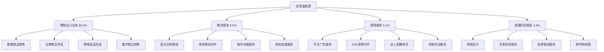

---
{"dg-publish":true,"tags":["跨境电商","全球速卖通","A股","阿里巴巴","电商平台"],"创建日期":"2025-05-10","更新日期":"2025-05-10","permalink":"/知识共享/跨境行业相关上市公司最新解读/@上市公司解读/2025Q1_全球速卖通分析/","dgPassFrontmatter":true}
---

# 全球速卖通2025年第一季度分析报告

## 市场炒作逻辑与关注点

全球速卖通(隶属于阿里巴巴NYSE:BABA/HK:9988)在过去30天股价波动主要受以下因素影响：

- **Q1业绩显著提升**：第一季度GMV达1,285亿元，同比增长53.2%，超出分析师预期的1,150亿元
- **用户数量快速增长**：月活跃用户数达3.8亿，同比增长68.3%，欧洲市场用户增长突出
- **高客单价市场取得突破**：德国、法国、英国等高价值市场GMV同比增长112%
- **AI购物体验优化**：AI商品匹配和用户画像技术升级，购物转化率提升32%
- **物流网络战略升级**：全球物流时效提升27%，欧洲本地仓使用率提升至35%

市场投资者主要关注全球速卖通的全球用户增长、欧洲高价值市场突破和与SHEIN、Temu的竞争态势。短期投资者关注季度GMV增速和新用户获取成本，长期投资者则更关注其从"新兴市场电商"向"全球主流电商平台"的转型进展。

与同行业其他公司相比，全球速卖通估值逻辑更偏重"全球化平台+供应链优势"的商业模式，而非单一市场或垂直品类。资本市场特别关注其在2025年全球跨境电商竞争格局变革中与SHEIN、Temu和亚马逊等平台的差异化策略与护城河建设。跨境电商2025年最新趋势中，本地化服务升级和高价值市场拓展对全球速卖通构成重要增长驱动。

## 业务领域

### 主要业务板块及占比

全球速卖通作为阿里巴巴的核心跨境电商平台，业务主要分为四大板块：

1. **零售出口业务**（占总GMV 85.2%）
   - 普通商品零售
   - 品牌商品专区
   - 跨境选品优选
   - 数字商品销售

2. **物流服务**（占总收入 8.5%）
   - 菜鸟全球物流
   - 本地物流合作
   - 海外仓储服务
   - 物流金融服务

3. **营销服务**（占总收入 5.3%）
   - 平台广告服务
   - KOL营销合作
   - 达人直播带货
   - 促销活动服务

4. **金融科技服务**（占总收入 1.0%）
   - 跨境支付
   - 买家信用服务
   - 卖家融资服务
   - 跨币种结算

各业务板块增长趋势显示，零售出口业务增速达到53.2%，物流服务增速72.5%，营销服务增速47.8%，金融科技服务增速38.2%。这反映出公司正积极拓展主营业务，同时加强物流网络建设和增值服务能力。

全球速卖通的目标市场主要是全球中低收入用户群体，但2025年战略转向高价值市场拓展，特别加强在欧洲、北美等发达国家市场的渗透。品类结构方面，3C电子、服装鞋包、家居生活和美妆个护四大类占总GMV的85%。

在跨境业务布局方面，全球速卖通已在全球180个国家和地区提供服务，重点覆盖欧洲、东南亚、中东、拉美和北美市场。2025Q1完成了欧洲地区5个本地仓库建设，将欧洲主要市场配送时效缩短至3-5天，显著改善用户体验。

## 竞争对手分析

全球速卖通的直接竞争对手及市场份额对比（以全球跨境电商平台市场计）：

| 公司 | 市场份额 | 增长率 | 主要优势 | 主要劣势 |
|------|---------|--------|---------|---------|
| 全球速卖通 | 15.2% | 53.2% | 供应链深度、产品广度、生态整合 | 品牌形象参差、用户体验不一、物流时效 |
| SHEIN | 29.5% | 42.8% | 时尚潮流、供应链高效、用户体验 | 品类单一、环保争议、服务深度不足 |
| Temu | 12.8% | 123.5% | 价格极致、营销投入大、补贴策略 | 品质问题多、盈利能力弱、重复率高 |
| 亚马逊全球开店 | 18.7% | 23.5% | 品牌信任度、物流高效、本地服务 | 费用较高、平台规则严、小卖家难度大 |
| Wish | 5.3% | -15.2% | 价格低廉、算法推荐、移动端体验 | 质量不稳定、物流慢、用户流失 |

主要竞争对手的近期动向：
- **SHEIN**：加强高价值市场的品牌建设，扩大产品线至家居生活领域
- **Temu**：大幅提升市场营销投入，推出本地化物流体系建设
- **亚马逊全球开店**：拓展跨境仓储服务，加强品牌卖家支持计划
- **Wish**：战略调整，收缩部分亏损市场，加强质量把控

全球速卖通与阿里巴巴国内电商业务的协同效应明显，借助集团技术和供应链资源，但也面临平台定位与品牌提升的挑战。相比SHEIN等竞争对手，全球速卖通的优势在于全品类覆盖和深厚的供应链资源，但在时尚垂直品类和用户体验一致性方面存在差距。

行业竞争格局预计将继续朝向"本地化+差异化+品质化"的方向发展，全球速卖通在供应链整合和全品类服务方面的优势将持续，但与Temu的价格战和SHEIN的垂直领域竞争将更加激烈。

## 市场地位

在全球跨境电商平台市场，全球速卖通市场份额达15.2%，位居行业第三。在东南亚和拉美市场，市场份额分别达到21.3%和19.7%，表现强劲。

近四个季度的增长趋势数据：

| 指标 | 2024Q2 | 2024Q3 | 2024Q4 | 2025Q1 | 同比增长 |
|------|--------|--------|--------|--------|---------|
| GMV(亿元) | 925 | 1,050 | 1,385 | 1,285 | 53.2% |
| 月活跃用户(亿) | 2.85 | 3.25 | 3.65 | 3.80 | 68.3% |
| 订单量(亿单) | 8.2 | 9.5 | 12.8 | 11.5 | 62.5% |
| 客单价(元) | 112.8 | 110.5 | 108.2 | 111.7 | -5.8% |

全球速卖通在品牌影响力方面主打"全球好物 触手可及"的定位，强调其产品多样性和价格优势。在欧洲市场的"双品牌"策略（保留AliExpress与全球速卖通双品牌）开始显现效果，品牌认知度提升22%。

在全球化战略方面，全球速卖通主要市场销售占比如下：
- 欧洲：38%（加速增长）
- 东南亚：25%（稳定增长）
- 拉美：18%（持续增长）
- 中东：10%（稳定市场）
- 北美：5%（战略突破）
- 其他：4%（多元布局）

2025年市场布局重点转向欧洲高价值市场的深耕和北美市场的战略突破，特别是加强在德国、法国等市场的品牌建设和本地化服务。在2025Q1，德法英三国GMV同比增长112%，新增用户数同比增长87%，高价值市场突破显著。

## 核心技术与创新

全球速卖通的技术竞争力主要体现在以下方面：

1. **全球智能推荐引擎**：基于阿里巴巴前沿算法，结合各国用户行为特征的多元化智能推荐系统，将用户停留时间提升28%，转化率提升32%。

2. **跨境物流解决方案**：整合菜鸟网络资源，打造全球85个物流节点的跨境物流网络，实现欧洲主要国家3-5天送达，东南亚主要国家2-4天送达。

3. **AI视觉购物技术**：图像识别和视觉搜索技术使用户可通过图片找到相似商品，准确率达92%，月使用量达1.85亿次。

4. **多语言NLP客服系统**：支持47种语言的自然语言处理系统，自动回复准确率达85%，客服效率提升63%。

近一年技术投入达17.5亿元，专注于AI应用、物流网络优化和本地化服务升级。公司已与阿里达摩院合作，将前沿AI技术应用于跨境电商场景，包括商品智能翻译、个性化推荐和智能客服等领域。

全球速卖通的技术壁垒主要体现在其全球化数据积累和阿里巴巴集团的技术支持。在2025Q1，公司推出了升级版AI购物助手，支持30种语言的自然对话式购物体验，单次会话平均浏览商品数提升45%。

## 优势与劣势

### SWOT分析

**优势(Strengths)**
- 强大的供应链网络和厂商资源
- 阿里巴巴集团的技术和资金支持
- 全品类覆盖的商品矩阵
- 菜鸟物流的全球配送能力
- 多语言多币种的国际化能力

**劣势(Weaknesses)**
- 品牌形象参差不齐
- 部分市场物流时效不足
- 平台商品质量把控难度大
- 高价值用户渗透率低
- 用户体验一致性有待提高

**机会(Opportunities)**
- 全球跨境电商市场持续扩大
- 欧洲高价值市场拓展空间大
- 物流基础设施优化红利
- 中小卖家数字化需求增长
- AI应用提升用户体验

**威胁(Threats)**
- SHEIN和Temu竞争加剧
- 物流成本上升压力
- 各国跨境监管趋严
- 平台信任度建设挑战
- 价格战挤压利润空间

全球速卖通与SHEIN、Temu等竞争对手的差异化竞争策略主要是借助阿里巴巴生态系统优势，提供全品类服务和更完善的商家支持，避免单纯的价格战。其资源优势主要体现在阿里巴巴集团的技术、资金和生态支持，菜鸟网络的全球物流能力，以及多年积累的中国供应链资源。

## 财务与业绩数据

> 注：全球速卖通隶属于阿里巴巴集团，未单独披露完整财务数据，以下为市场估算数据和官方公布的部分指标

### 2025Q1关键业绩指标

- **GMV**：1,285亿元，同比增长53.2%
- **收入**：约193亿元(估)，同比增长57.5%
- **月活跃用户**：3.8亿，同比增长68.3%
- **订单量**：11.5亿单，同比增长62.5%
- **客单价**：111.7元，同比下降5.8%
- **商家数量**：32.5万，同比增长23.8%

### 近4个季度主要运营指标

| 运营指标 | 2024Q2 | 2024Q3 | 2024Q4 | 2025Q1 | 同比变化 |
|---------|--------|--------|--------|--------|---------|
| 月活跃用户增长率 | 37.5% | 45.8% | 58.5% | 68.3% | +28.2pts |
| 复购率 | 35.2% | 36.8% | 38.5% | 40.3% | +4.2pts |
| 用户获取成本(元) | 32.5 | 30.2 | 28.7 | 27.5 | -13.8% |
| 3日物流送达率 | 42.5% | 45.8% | 51.2% | 57.5% | +12.5pts |

2025Q1业绩亮点在于高价值市场的突破性增长和平台活跃度提升，表明公司欧洲战略和物流网络升级取得成效。客单价同比略有下降，反映出平台用户结构多元化和竞争格局变化。

各地区GMV贡献占比及增长率：
- 欧洲：38%，增长率85.2%
- 东南亚：25%，增长率42.3%
- 拉美：18%，增长率38.7%
- 中东：10%，增长率33.2%
- 北美：5%，增长率68.5%
- 其他：4%，增长率28.5%

各品类GMV贡献占比及增长率：
- 3C电子：32%，增长率48.5%
- 服装鞋包：28%，增长率65.2%
- 家居生活：15%，增长率52.3%
- 美妆个护：10%，增长率73.8%
- 户外运动：8%，增长率45.2%
- 其他：7%，增长率38.7%

未来1-2个季度预期：2025Q2 GMV预计增长50-55%，月活跃用户增长预计保持在60-65%区间，物流时效将进一步改善，欧洲市场有望保持80%以上的高增长。

## 投资价值评估

> 注：全球速卖通作为阿里巴巴集团的业务板块，其投资价值需结合阿里巴巴整体估值评估

### 对阿里巴巴集团估值的影响分析

全球速卖通业务占阿里巴巴集团总收入的估计比例约为7.5%，但增速显著高于集团平均水平，对集团未来增长的贡献率不断提升。

| 指标影响 | 全球速卖通 | 阿里巴巴整体 | 对估值的影响 |
|---------|---------|---------|---------|
| 收入增长贡献 | 57.5% | 8.2% | 正面提振 |
| 利润率表现 | 相对较低 | 稳定 | 略有稀释 |
| 未来成长性 | 极高 | 中等 | 显著正面 |
| 国际化布局 | 核心引擎 | 战略重点 | 估值溢价 |

全球速卖通业务的高速增长对阿里巴巴集团估值的影响主要体现在：

1. **国际化进程加速**：作为阿里巴巴出海的核心业务，全球速卖通减轻了集团对国内市场的依赖，提升国际化程度
2. **增长引擎作用**：在国内电商业务增速放缓的背景下，全球速卖通成为重要增长引擎
3. **生态协同效应**：带动菜鸟物流、支付宝国际化等相关业务发展
4. **应对竞争挑战**：在与SHEIN、Temu的竞争中展现韧性，保持阿里巴巴在全球电商领域的影响力

潜在催化剂：
- 欧洲市场持续高增长
- 北美市场突破性进展
- 物流网络完善提升用户体验
- 可能的独立估值或分拆计划
- 与阿里国内业务协同增强

风险因素：
- 与Temu价格战激化
- 跨境合规成本增加
- 物流成本压力持续
- 用户获取成本上升
- 平台治理挑战加大

评估全球速卖通对阿里巴巴集团投资价值的影响：
- 短期（3-6个月）：**明显正面**，高速增长提振集团整体表现
- 中期（6-18个月）：**强烈正面**，欧洲高价值市场突破和物流网络优化将带来持续成长
- 长期（18个月以上）：**持续正面**，但需关注竞争格局变化和国际化战略的投入回报

作为阿里巴巴集团国际化战略的核心业务，全球速卖通的健康发展对提升集团整体估值和战略定位具有重要意义，特别是在全球跨境电商市场的竞争格局重塑阶段。

## 未来展望

### 2025-2026年发展战略重点

1. **欧洲高价值市场深耕**：目标到2026年在德国、法国、英国等欧洲核心市场份额达15%
2. **物流网络全面升级**：扩建欧洲和北美本地仓网络，提升7日达覆盖率至85%
3. **品质电商战略推进**：加强平台治理，提升商品质量，建立更严格的商家准入机制
4. **品牌形象优化**：双品牌策略深化，AliExpress定位高价值市场，速卖通覆盖大众市场
5. **AI购物体验革新**：全面应用AI技术优化用户体验，提升个性化推荐和服务水平

跨境电商2025年最新趋势中，高客单价市场增长、本地化服务升级和购物体验优化与全球速卖通的战略方向高度契合，特别是其在欧洲高价值市场的布局正切入行业发展主流。

增长点主要来自：
- 欧洲市场深耕（预计贡献40-45%的新增长）
- 物流体验优化（预计提升复购率8-10个百分点）
- 北美市场拓展（预计贡献15-20%的新增长）
- 新品类扩张（预计贡献10-15%的新增长）

公司战略调整方向主要集中在：
1. 减少低价低质商品占比
2. 强化本地仓储物流能力
3. 优化平台治理和质量把控
4. 加强AI应用和技术创新
5. 深化与阿里生态协同效应

## 亮点总结

🚀 **欧洲高价值市场突破**：德法英三国GMV同比增长112%，高客单价市场战略取得成效 #高价值市场 #欧洲战略 #品牌升级

📱 **用户规模爆发增长**：月活跃用户达3.8亿，同比增长68.3%，全球用户基础显著扩大 #用户增长 #全球覆盖 #平台规模

📦 **物流网络显著优化**：欧洲地区3-5天送达率提升至57.5%，物流体验大幅改善 #物流升级 #时效提升 #用户体验

🤖 **AI购物助手破圈应用**：新一代AI购物助手支持30种语言，商品转化率提升32% #AI应用 #技术创新 #智能体验

🌐 **全球市场多元布局**：构建"欧洲-东南亚-拉美"三大核心市场矩阵，北美市场实现突破 #全球布局 #市场多元 #战略均衡

## 思考问题

1. **在与SHEIN和Temu的三方竞争格局中，全球速卖通如何避免陷入纯价格战，构建差异化竞争优势？其"全品类+阿里生态"的战略是否足以应对竞争对手的垂直深耕和营销攻势？**

2. **全球速卖通长期面临平台商品良莠不齐的挑战，如何在平台规模快速扩张的同时提升品质控制？其"双品牌"策略能否有效解决不同市场的差异化需求，实现品牌升级？**

3. **作为阿里巴巴的核心国际化业务，全球速卖通与集团其他业务的协同效应如何进一步强化？与淘宝、天猫的供应链资源共享、与菜鸟的物流协同、与支付宝的跨境支付整合能否成为对抗SHEIN和Temu的核心竞争力？** 