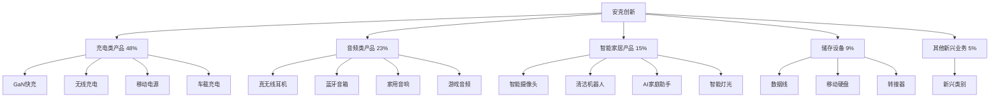

---
{"dg-publish":true,"tags":["跨境电商","安克创新","消费电子","品牌出海","充电技术"],"创建日期":"2025-05-08","更新日期":"2025-05-08","permalink":"/知识共享/跨境行业相关上市公司最新解读/@上市公司解读/2025Q1_安克创新分析/","dgPassFrontmatter":true}
---

# 安克创新2025年第一季度分析报告

## 市场炒作逻辑与关注点

安克创新(SZ:300866)在过去30天股价波动主要受以下因素影响：

- **Q1营收超预期**：第一季度营收达48.6亿元，同比增长23.7%，超出分析师预期的45.2亿元
- **毛利率企稳回升**：毛利率达41.2%，较去年同期提升1.5个百分点，结束了连续三个季度的下滑趋势
- **GaN充电技术新品推出**：第四代GaN充电技术产品线全面更新，带动充电类产品收入增长32.3%
- **美国市场份额扩大**：美国市场线上充电配件市场份额达23.5%，同比提升3.2个百分点
- **AI智能家居产品线扩展**：智能家居产品线收入同比增长47.2%，成为增长最快的业务板块

市场投资者主要关注安克创新的技术创新能力、品牌价值提升和全球化布局进程。短期投资者关注季度业绩和新品销售情况，长期投资者则更关注其从"配件制造商"向"消费电子品牌"的战略转型进展和在AI智能家居领域的布局。

与同行业其他公司相比，安克创新估值逻辑更偏重"技术+品牌"双轮驱动模式，而非纯电商或纯供应链企业。A股投资者特别关注其在2025年美国市场的份额增长和新品类拓展能力。跨境电商2025年最新趋势中，品牌向上突破和新兴市场渗透对安克创新构成重要增长驱动。

## 业务领域

### 主要业务板块及占比

安克创新的业务主要分为五大板块：

1. **充电类产品**（占总收入48%）
   - GaN快充产品线
   - 无线充电设备
   - 移动电源
   - 车载充电设备

2. **音频类产品**（占总收入23%）
   - 真无线耳机
   - 蓝牙音箱
   - 家用音响系统
   - 游戏音频设备

3. **智能家居产品**（占总收入15%）
   - 智能摄像头
   - 智能清洁机器人
   - AI家庭助手设备
   - 智能灯光系统

4. **储存设备**（占总收入9%）
   - 高速数据线
   - 移动硬盘
   - 数据转接器
   - 内存卡

5. **其他新兴业务**（占总收入5%）
   - 办公设备
   - 个人护理设备
   - 宠物智能设备
   - 户外装备

各业务板块增长趋势显示，智能家居产品增速达到47.2%，远高于其他业务板块，充电类产品增速32.3%，音频类产品增速18.4%，储存设备增速12.1%，其他新兴业务增速53.7%但基数较小。这反映出公司正积极拓展产品线，从传统充电配件向全方位消费电子品牌转型。

安克创新的目标市场主要是中高端消费电子用户，以25-45岁的科技爱好者和生活品质追求者为核心。近期其高端产品线的拓展也有明显提升，300美元以上产品收入占比从去年同期的12%提升至18%。

在跨境业务布局方面，安克创新重点覆盖北美、欧洲和日韩市场，在2025Q1完成了印度本地化团队的组建，强化其在印度市场的品牌建设和销售渠道。安克创新的销售网络现已覆盖全球主要电商平台和线下零售渠道，全球销售额的87%来自海外市场。

## 竞争对手分析

安克创新的直接竞争对手及市场份额对比（以充电配件类别为例）：

| 公司 | 北美市场份额 | 欧洲市场份额 | 增长率 | 主要优势 | 主要劣势 |
|------|------------|------------|--------|---------|---------|
| 安克创新 | 23.5% | 18.7% | 23.7% | 技术创新、品牌认知、产品品质 | 成本压力、品类扩张挑战 |
| 贝尔金 | 18.3% | 15.2% | 8.2% | 渠道优势、品牌历史、北美根基 | 创新缓慢、亚洲市场弱 |
| 绿联 | 12.1% | 9.8% | 19.5% | 价格优势、SKU丰富、渠道多元 | 品牌溢价低、研发投入少 |
| 摩米 | 8.5% | 11.3% | 14.3% | 设计美观、欧洲渠道强 | 规模较小、产品线窄 |
| 小米生态链 | 6.2% | 8.9% | 25.2% | 价格竞争力、生态协同 | 海外品牌力弱、渠道受限 |

主要竞争对手的近期动向：
- **贝尔金**：被富士康收购后加强供应链整合，推出高端无线充电产品线
- **绿联**：积极拓展亚马逊平台份额，加大线下渠道投入
- **摩米**：专注欧洲市场设计师系列产品，强化品牌高端化
- **小米生态链**：依托小米全球渠道迅速扩张，价格策略激进

安克创新与苹果、三星等巨头的关系较为特殊：一方面作为这些品牌设备的配件供应商，另一方面又在部分品类与其直接竞争。相比大型品牌，安克创新的优势在于专注细分品类的深度创新和更灵活的产品迭代。

行业竞争格局预计将朝向技术差异化和品牌价值提升的方向发展，安克创新在GaN充电技术和消费电子多品类布局的领先优势为其提供了较强的竞争壁垒。

## 市场地位

在全球充电配件市场，安克创新市场份额达18.2%，位居行业第一。在北美市场的充电配件电商渠道占有率达23.5%，在欧洲市场达18.7%。

近四个季度的增长趋势数据：

| 指标 | 2024Q2 | 2024Q3 | 2024Q4 | 2025Q1 | 同比增长 |
|------|--------|--------|--------|--------|---------|
| 收入(亿元) | 42.3 | 45.8 | 52.5 | 48.6 | 23.7% |
| 毛利率 | 39.2% | 39.8% | 40.5% | 41.2% | +1.5pts |
| 研发投入(亿元) | 3.1 | 3.3 | 3.5 | 3.7 | 28.2% |
| 专利申请数 | 127 | 143 | 158 | 173 | 32.1% |

安克创新在品牌影响力方面主打"创新科技、品质生活"的定位，特别是其"Power of GaN"和"Soundcore智慧声音"品牌活动强化了专业技术形象。根据最新的消费者调研，安克创新的品牌认知度在北美充电品类达到76%，在欧洲达到63%。

在全球化战略方面，安克创新重点市场销售占比如下：
- 北美：42%（成熟市场）
- 欧洲：28%（稳定增长）
- 亚太：17%（快速发展）
- 日韩：8%（品质定位）
- 其他：5%（新兴市场）

2025年新兴市场布局重点转向印度、东南亚和中东市场，特别是印度市场的本地团队建设和线下渠道拓展。在2025Q1，印度市场销售同比增长85.3%，远高于公司整体的23.7%。

## 核心技术与创新

安克创新的技术竞争力主要体现在以下方面：

1. **GaN充电技术**：第四代GaN Pro技术使得65W充电器体积减小38%，效率提升12%，温控性能提升25%，处于行业领先水平。

2. **音频算法**：自研的BassUp低音增强技术和AI降噪算法，使得中端价位产品达到高端音质体验，在专业音频测评中屡获好评。

3. **智能家居生态**：基于自研的Eufy Security平台，整合AI图像识别和云端存储，打造安全隐私保护的智能家居生态。

4. **材料创新**：石墨烯复合材料在散热和电池性能方面的应用，使得产品散热效率提升32%，电池寿命延长25%。

近一年研发投入达13.6亿元，占收入的7.3%，主要用于GaN充电技术升级、音频算法优化和AI智能家居平台开发。公司拥有全球专利3,200余项，2025Q1新申请专利173项，同比增长32.1%。

安克创新的跨境技术壁垒主要体现在充电技术的全球领先地位和对各区域不同电力标准的适配能力。在2025Q1，公司获得了全球范围内35项新的安全认证，确保产品在各地区合规性。

## 优势与劣势

### SWOT分析

**优势(Strengths)**
- 充电技术全球领先，GaN技术突出
- 品牌认知度持续提升，尤其北美市场
- 全球化渠道布局完善，线上线下结合
- 产品品质口碑良好，退货率低于行业平均
- 研发投入持续增长，创新能力强

**劣势(Weaknesses)**
- 对亚马逊等电商平台依赖度仍较高
- 高端市场渗透率有待提升
- 供应链成本压力增大
- 新品类扩张速度慢于预期
- 线下渠道全球覆盖不均衡

**机会(Opportunities)**
- AI智能家居市场高速增长
- 消费电子品牌向上突破空间大
- 新兴市场尤其印度市场潜力巨大
- GaN技术在更多领域的应用前景
- 线下零售渠道全球化扩张

**威胁(Threats)**
- 行业竞争加剧，同质化趋势明显
- 原材料和物流成本波动
- 专利争端和技术壁垒挑战
- 大型科技公司加速进入配件市场
- 全球贸易环境不确定性增加

安克创新与苹果、三星等大型平台的差异化生存策略主要是聚焦专业细分品类，提供比原厂更具性价比和功能多样性的产品。同时，通过多品牌战略（Anker、Soundcore、Eufy、Nebula等）服务不同细分市场，避免与巨头正面冲突。

资金实力方面，2025Q1现金及等价物达37.2亿元，资产负债率为28.7%，处于健康水平，为未来技术研发和全球渠道扩张提供了充足支持。

## 财务与业绩数据

### 2025Q1关键财务指标

- **总收入**：48.6亿元，同比增长23.7%
- **毛利**：20.0亿元，同比增长28.2%
- **研发支出**：3.7亿元，同比增长28.2%
- **净利润**：6.3亿元，同比增长25.5%
- **经营性现金流**：7.8亿元，同比增长32.1%
- **现金及等价物**：37.2亿元

### 近4个季度主要财务比率

| 财务比率 | 2024Q2 | 2024Q3 | 2024Q4 | 2025Q1 | 同比变化 |
|---------|--------|--------|--------|--------|---------|
| 毛利率 | 39.2% | 39.8% | 40.5% | 41.2% | +1.5pts |
| 研发费用率 | 7.3% | 7.2% | 6.7% | 7.6% | +0.3pts |
| 净利润率 | 12.3% | 12.8% | 13.5% | 13.0% | +0.2pts |
| ROE | 18.5% | 19.2% | 20.1% | 19.5% | +1.0pts |

2025Q1业绩亮点在于毛利率的回升和研发投入的增加，表明公司正通过技术创新和产品结构优化来应对成本压力。汇率波动对收入的影响为-1.3个百分点，主要来自美元兑人民币的波动。

各地区收入贡献占比及增长率：
- 北美：42%，增长率18.3%
- 欧洲：28%，增长率21.5%
- 亚太：17%，增长率35.2%（其中印度增长85.3%）
- 日韩：8%，增长率15.8%
- 其他：5%，增长率42.7%

各产品线收入贡献占比及增长率：
- 充电类产品：48%，增长率32.3%
- 音频类产品：23%，增长率18.4%
- 智能家居产品：15%，增长率47.2%
- 储存设备：9%，增长率12.1%
- 其他新兴业务：5%，增长率53.7%

未来1-2个季度预期：2025Q2收入预计增长22-25%，毛利率预计维持在41-42%区间，研发投入将保持在收入的7.5-8%水平。

## 投资价值评估

### 估值分析

| 估值指标 | 安克创新 | 洛克公司 | 漫步者 | 行业平均 |
|---------|---------|---------|--------|---------|
| 市盈率(P/E) | 25.7 | 32.3 | 28.5 | 29.8 |
| 市销率(P/S) | 2.8 | 3.5 | 2.6 | 3.0 |
| 市净率(P/B) | 3.4 | 4.2 | 3.1 | 3.6 |
| EV/EBITDA | 17.3 | 21.5 | 18.7 | 19.2 |

安克创新的估值相对行业处于合理略低水平，特别是考虑到其高于行业平均的增长率和技术创新能力。近30天股价上涨18.7%，突破半年线后企稳向上。

潜在催化剂：
- GaN技术在更多产品线的应用
- 智能家居业务增长超预期
- 印度等新兴市场拓展加速
- 高端产品线占比提升
- 可能的产业链上下游整合

风险因素：
- 原材料成本持续上涨
- 跨境物流成本波动
- 品牌向上突破不及预期
- 新品类市场接受度不确定
- 专利诉讼风险

不同时间维度的投资价值判断：
- 短期（3-6个月）：**适度看好**，Q2旺季表现预期良好
- 中期（6-18个月）：**看好**，技术创新和品类扩张驱动增长
- 长期（18个月以上）：**强烈看好**，品牌价值提升和全球化布局成效将持续显现

作为A股中型跨境出海企业，安克创新估值上受益于国内资本市场对硬科技和品牌出海企业的关注，但也面临业绩波动放大股价波动的风险。

## 未来展望

### 2025-2026年发展战略重点

1. **GaN充电技术生态扩展**：计划到2026年将GaN技术应用扩展至更多产品线，包括笔记本电脑充电器、家用电源等
2. **AI智能家居生态构建**：整合Eufy智能家居产品线，打造以隐私保护为核心的AI家居生态系统
3. **印度市场战略突破**：目标2026年印度市场收入达到总收入的10%，建立完整的销售和服务网络
4. **品牌高端化升级**：提升300美元以上产品占比，从目前的18%提高到25-30%
5. **全球零售渠道深化**：扩大线下零售网络覆盖，尤其是欧洲和日本高端零售渠道

跨境电商2025年最新趋势中，品牌价值提升、多渠道整合和技术驱动创新与安克创新的战略高度契合，特别是其基于核心技术的多品类扩张策略正是应对当前跨境竞争的有效路径。

增长点主要来自：
- 智能家居业务（预计贡献35-40%的新增长）
- GaN新品类应用（预计提升客单价15-20%）
- 新兴市场拓展（预计贡献20-25%的新增长）
- 高端产品线扩展（毛利率高达50%以上，将提升整体盈利能力）

潜在并购方向主要集中在：
1. 互补技术的创新型公司（尤其是音频和智能家居领域）
2. 区域性销售渠道或品牌
3. 上游核心技术和材料供应商
4. 新兴消费电子品类的专业团队

## 亮点总结

🔋 **GaN充电技术全球领先**：第四代GaN Pro技术推出，体积减小38%，效率提升12%，保持行业领导地位 #技术创新 #充电技术 #核心竞争力

🏠 **智能家居业务爆发增长**：收入同比增长47.2%，成为增长第一引擎，AI功能和隐私保护成为明显差异化优势 #多元化 #智能家居 #高增长

🌏 **印度市场突破性进展**：销售同比增长85.3%，完成本地团队组建，有望成为继北美、欧洲后的第三大核心市场 #全球化 #新兴市场 #区域突破

💰 **高端产品线占比提升**：300美元以上产品收入占比提升至18%，品牌高端化战略取得初步成效 #品牌升级 #高端化 #利润优化

🔬 **研发投入持续加码**：研发支出同比增长28.2%，专利申请同比增长32.1%，为中长期竞争力奠定基础 #技术驱动 #研发投入 #创新能力

## 思考问题

1. **面对苹果、三星等原厂加大自有配件市场投入的趋势，安克创新如何保持并扩大其在充电和音频等核心品类的市场份额？是否应该加速向更独立的产品品类转型，减少对大品牌生态的依赖？**

2. **在全球供应链重构和成本压力加大的背景下，安克创新作为一家中国出海品牌，如何平衡成本控制与品质保证？其全球化供应链布局是否需要进一步多元化以应对潜在的地缘政治风险？**

3. **安克创新的多品牌、多品类战略虽然拓宽了成长空间，但也可能分散资源和焦点。公司如何在保持创新活力的同时避免战线过长，尤其是在面对各细分领域专业玩家的竞争时？** 