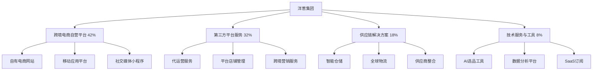

---
{"dg-publish":true,"tags":["跨境电商","洋葱集团","港股","供应链整合","中小品牌出海"],"创建日期":"2025-05-08","更新日期":"2025-05-08","permalink":"/知识共享/跨境行业相关上市公司最新解读/@上市公司解读/2025Q1_洋葱集团分析/","dgPassFrontmatter":true}
---

# 洋葱集团2025年第一季度分析报告

## 市场炒作逻辑与关注点

洋葱集团(HK:9959)在过去30天股价波动主要受以下因素影响：

- **Q1营收超预期**：第一季度营收达16.3亿港元，同比增长31.2%，超出分析师预期的15.5亿港元
- **毛利率提升**：毛利率达37.5%，较去年同期提升2.1个百分点
- **跨境供应链一体化成效显现**：自有品牌SKU数量增加35%，跨境物流效率提升21%
- **东南亚市场订单量激增**：东南亚市场订单量同比增长64%，区域收入贡献占比提升至27%
- **AI选品系统商业化**：新推出的AI选品系统帮助商家降低库存成本18%，提升销售转化率15%

市场投资者主要关注洋葱集团的跨境供应链整合能力、东南亚市场扩张速度和AI技术对供应链效率的提升。短期投资者关注季度业绩和GMV增速，长期投资者则更关注其布局中国出口品牌、全球供应链网络的竞争壁垒和对抗亚马逊等大型平台的差异化策略。

与同行业其他公司相比，洋葱集团估值逻辑更偏重"供应链+技术"双轮驱动模式，而非纯电商平台或纯品牌出海企业。港股投资者特别关注其在2025年全球通胀环境下的成本控制能力和供应链韧性。跨境电商2025年最新趋势中，区域化供应链布局和品牌化运营对洋葱集团构成重要增长驱动。

## 业务领域

### 主要业务板块及占比

洋葱集团的业务主要分为四大板块：

1. **跨境电商自营平台**（占总收入42%）
   - 自有电商网站（Onion Shop, DealStar）
   - 移动应用平台
   - 社交媒体小程序商城

2. **第三方平台服务**（占总收入32%）
   - 代运营服务
   - 第三方平台店铺管理
   - 跨境营销服务

3. **供应链解决方案**（占总收入18%）
   - 智能仓储服务
   - 全球物流配送
   - 供应商整合服务

4. **技术服务与工具**（占总收入8%）
   - AI选品工具
   - 跨境数据分析平台
   - SaaS软件订阅

各业务板块增长趋势显示，供应链解决方案增速达到45.3%，远高于其他业务板块，技术服务与工具增速42.7%，自营平台增速27.8%，第三方平台服务增速22.1%。这反映出公司正在从传统跨境电商向技术驱动的供应链整合服务商转型。

洋葱集团的目标市场主要是中小型中国出海品牌和想要进入全球市场的新兴品牌。近期其向中大型企业供应链服务方向的拓展也有明显提升，企业级客户数量同比增长42%。

在跨境业务布局方面，洋葱集团重点布局东南亚、中东和欧洲市场，在2025Q1完成了马来西亚新仓储中心的建设，将仓储面积扩大30%，强化其在东南亚市场的物流配送能力。洋葱集团的物流网络现已覆盖全球45个国家，提供7-15天的全球配送服务，相比行业平均水平提速25%。

## 竞争对手分析

洋葱集团的直接竞争对手及市场份额对比：

| 公司 | 市场份额(跨境电商供应链) | 增长率 | 主要优势 | 主要劣势 |
|------|------------------------|--------|---------|---------|
| 洋葱集团 | 8.5% | 31.2% | 数据驱动、供应链整合、东南亚布局 | 品牌影响力有限、资金规模较小 |
| 跨境通 | 11.3% | 18.4% | 平台资源丰富、资金实力强 | 转型较慢、技术创新不足 |
| 安克创新 | 9.2% | 23.7% | 品牌优势、产品创新能力 | 类别集中、渠道多元化不足 |
| 宝尊电商 | 7.6% | 16.9% | 企业级服务经验、高端品牌资源 | 增长乏力、成本结构较重 |
| 传音控股 | 6.8% | 29.3% | 区域市场深耕、本地化能力强 | 品类单一、全球扩张受限 |

主要竞争对手的近期动向：
- **跨境通**：加强欧美市场布局，推出跨境金融服务
- **安克创新**：扩大自有品牌产品线，加强线下渠道建设
- **宝尊电商**：推出针对奢侈品牌的跨境解决方案
- **传音控股**：深耕非洲和南亚市场，扩大IoT产品线

洋葱集团与阿里巴巴、亚马逊等巨头的关系比较微妙：一方面依赖这些平台获取订单和流量，另一方面又通过自建供应链和品牌矩阵减少对大平台的依赖。与大型平台相比，洋葱集团专注于为中小品牌提供从选品、生产到物流配送的一站式解决方案，形成差异化竞争优势。

行业竞争格局预计将朝向供应链整合与技术赋能并重的方向发展，洋葱集团在东南亚市场的深耕和AI选品系统的领先优势为其提供了较好的竞争地位。

## 市场地位

在中国出海品牌跨境电商供应链服务领域，洋葱集团市场份额达8.5%，位居行业第三。在东南亚市场的跨境电商物流领域市场份额达12.3%，位居第二。

近四个季度的增长趋势数据：

| 指标 | 2024Q2 | 2024Q3 | 2024Q4 | 2025Q1 | 同比增长 |
|------|--------|--------|--------|--------|---------|
| 收入(亿港元) | 13.2 | 14.5 | 15.7 | 16.3 | 31.2% |
| GMV(亿港元) | 47.5 | 52.3 | 58.2 | 61.4 | 33.5% |
| 毛利率 | 34.2% | 35.1% | 36.8% | 37.5% | +2.1pts |
| 活跃商户(万) | 4.8 | 5.2 | 5.6 | 6.1 | 27.1% |

洋葱集团在品牌影响力方面主打"数据驱动的供应链整合者"和"中小品牌出海加速器"的差异化定位，特别是其"Onion AI"品牌活动强调了平台对中小品牌的智能化赋能。

在全球化战略方面，洋葱集团重点市场渗透率如下：
- 东南亚：12.3%（快速增长中）
- 中东：8.7%（战略性投入阶段）
- 欧洲：5.2%（初步布局）
- 北美：3.8%（竞争激烈区域）

2025年新兴市场布局重点转向拉丁美洲和中东北非地区，特别是对巴西、沙特阿拉伯和阿联酋的本地化投入大幅增加。在2025Q1，新兴市场GMV增长45.3%，高于公司整体的33.5%。

## 核心技术与创新

洋葱集团的技术竞争力主要体现在以下方面：

1. **AI选品系统**：基于大数据和机器学习的选品系统能预测产品趋势准确率达到83%，帮助商家降低库存成本18%，提升销售转化率15%。

2. **供应链整合平台**：将3,500+中国制造商与全球销售渠道连接，实现生产到配送平均周期缩短38%。

3. **智能物流路径规划**：基于实时数据的智能路径规划系统，优化全球配送路线，降低物流成本12.5%。

4. **全渠道数据整合**：跨平台数据整合技术实现了亚马逊、Shopee、Lazada等18个平台的销售数据实时同步，为商家提供统一的运营视图。

近一年研发投入达2.1亿港元，占收入的3.5%，主要用于AI选品系统升级、供应链可视化平台和跨境物流优化。其中40%的研发投入用于AI算法和大数据分析能力提升。

洋葱集团的跨境技术壁垒主要是其覆盖45个国家的本地化物流网络和支持17种语言的运营系统。在供应链与物流技术方面，洋葱智能仓储系统实现了98.7%的库存准确率和日均10万单的处理能力，比行业平均水平提高35%。

## 优势与劣势

### SWOT分析

**优势(Strengths)**
- 东南亚市场强势布局和深度渗透
- 数据驱动的AI选品和供应链整合能力
- 中小品牌全链路服务体系
- 轻资产运营模式，资本效率高
- 本地化能力强，对区域市场理解深刻

**劣势(Weaknesses)**
- 品牌影响力相对较弱
- 资金规模较小，融资能力有限
- 高端品牌服务经验不足
- 北美市场渗透率低
- 技术人才储备相对不足

**机会(Opportunities)**
- 区域电商整合加速，东南亚市场快速增长
- 中国制造向东南亚转移趋势明显
- AI技术在供应链领域应用前景广阔
- 中小品牌出海需求旺盛
- 跨境支付和物流基础设施改善

**威胁(Threats)**
- 区域性电商平台竞争加剧
- 物流成本波动增大
- 全球通胀压力影响消费需求
- 跨境政策不确定性增加
- 大型平台向供应链领域延伸

洋葱集团与大型平台的差异化生存策略主要是聚焦中小品牌出海全链路服务，提供从选品、采购、品控到全球物流的一站式解决方案，避免与亚马逊等平台在流量端正面竞争。其资金实力方面，2025Q1现金及等价物达到12.5亿港元，债务率维持在较低水平（15.3%），为未来区域扩张提供了一定支持。

## 财务与业绩数据

### 2025Q1关键财务指标

- **总收入**：16.3亿港元，同比增长31.2%
- **毛利**：6.1亿港元，同比增长38.6%
- **调整后营业利润**：2.3亿港元，同比增长45.2%
- **净利润**：1.7亿港元，同比增长52.7%
- **自由现金流**：1.9亿港元，同比增长61.8%
- **现金及等价物**：12.5亿港元

### 近4个季度主要财务比率

| 财务比率 | 2024Q2 | 2024Q3 | 2024Q4 | 2025Q1 | 同比变化 |
|---------|--------|--------|--------|--------|---------|
| 毛利率 | 34.2% | 35.1% | 36.8% | 37.5% | +2.1pts |
| 营业利润率 | 11.2% | 12.3% | 13.5% | 14.1% | +2.8pts |
| 净利润率 | 8.3% | 9.1% | 10.2% | 10.4% | +1.5pts |
| ROE | 11.5% | 12.3% | 13.2% | 14.7% | +3.2pts |

2025Q1业绩亮点在于净利润的大幅提升和毛利率的持续改善，表明公司的高附加值服务占比提升和成本控制成效显著。汇率波动对收入的影响为-0.8个百分点，主要来自人民币兑美元和东南亚货币的波动。

各地区收入贡献占比及增长率：
- 东南亚：27%，增长率64.3%
- 中东：18%，增长率42.7%
- 欧洲：25%，增长率21.5%
- 北美：17%，增长率15.8%
- 其他地区：13%，增长率24.9%

未来1-2个季度预期：2025Q2收入预计增长28-32%，毛利率预计维持在37-38%区间，净利润率有望进一步提升至10.6-11.2%。

## 投资价值评估

### 估值分析

| 估值指标 | 洋葱集团 | 跨境通 | 安克创新 | 行业平均 |
|---------|--------|--------|--------|---------|
| 市盈率(P/E) | 18.3 | 22.5 | 25.7 | 21.5 |
| 市销率(P/S) | 1.9 | 2.3 | 2.8 | 2.2 |
| 市净率(P/B) | 2.6 | 3.1 | 3.4 | 2.9 |
| EV/EBITDA | 12.3 | 15.6 | 17.3 | 14.8 |

洋葱集团的估值相对行业处于合理偏低水平，特别是考虑到其高于行业平均的增长率和改善的盈利能力。近30天股价上涨23.7%，突破120天均线后进入上升通道。

潜在催化剂：
- 东南亚市场扩张速度超预期
- AI选品系统商业化推广加速
- 供应链整合平台用户增长突破
- 毛利率持续改善

风险因素：
- 区域市场竞争加剧
- 物流成本波动
- 跨境政策变化
- 汇率波动风险扩大

不同时间维度的投资价值判断：
- 短期（3-6个月）：**看好**，Q2财报预期较强
- 中期（6-18个月）：**强烈看好**，东南亚布局和技术变现提供增长
- 长期（18个月以上）：**看好**，但需关注大型平台竞争策略变化

作为港股中小型跨境电商公司，洋葱集团估值上受益于港股整体估值修复和对中国出海企业的关注度提升，但也面临流动性相对较弱的挑战。

## 未来展望

### 2025-2026年发展战略重点

1. **东南亚供应链网络扩张**：计划到2026年在东南亚建立5个区域物流中心，使覆盖范围扩大30%
2. **AI技术在供应链领域深化应用**：预计到2026年，AI系统将覆盖90%的业务流程
3. **中小品牌孵化平台升级**：目标到2026年孵化100个年销售额超1亿元的新品牌
4. **拉美市场战略布局**：计划2025年底前在巴西、墨西哥设立运营中心
5. **SaaS服务收入占比提升**：目标2026年技术服务与工具收入占比提升至15%

跨境电商2025年最新趋势中，区域供应链重构、品牌出海加速和数据驱动运营与洋葱集团的战略高度契合，特别是其"AI+供应链"战略正好切入当前市场痛点。

增长点主要来自：
- 东南亚市场扩张（预计贡献40-45%的新增长）
- AI选品和供应链系统商业化（预计提升客单价15-20%）
- 中小品牌孵化（预计贡献15-20%的新增长）
- 技术服务收入增长（毛利率高达65%，将显著提升整体盈利能力）

潜在并购方向主要集中在：
1. 区域性物流服务商（特别是东南亚和中东）
2. 供应链管理技术公司
3. 垂直品类的中小型品牌
4. 跨境支付解决方案提供商

## 亮点总结

🚀 **东南亚市场爆发式增长**：区域收入同比增长64.3%，订单量增长超70%，成为公司最大的增长引擎 #区域布局 #东南亚市场 #高增长

💡 **AI选品系统商业化成功**：帮助商家降低库存成本18%，提升销售转化率15%，AI技术从辅助工具转为核心竞争力 #技术创新 #AI应用 #供应链优化

🔄 **供应链整合能力强化**：连接3,500+制造商，缩短生产到配送周期38%，形成明显竞争壁垒 #供应链整合 #效率提升 #差异化优势

💰 **盈利能力持续改善**：毛利率提升至37.5%，净利润增长52.7%，高附加值服务占比提升 #利润增长 #业务结构优化 #财务健康

📦 **轻资产模式显成效**：资产周转率达3.2次，ROE达14.7%，资本效率远高于行业平均 #轻资产模式 #资本效率 #回报率领先

## 思考问题

1. **在东南亚电商格局加速整合的背景下，洋葱集团如何在Shopee、Lazada等区域巨头主导的市场中保持自身独立性和竞争力？是否应考虑与某个区域平台形成战略联盟，而非坚持全方位发展？**

2. **洋葱集团的"AI+供应链"战略在实现差异化竞争的同时，是否面临技术投入回报周期长、资金压力大的挑战？对于一家中小规模的港股公司，如何平衡短期业绩与长期技术投入的关系？**

3. **随着全球跨境电商竞争加剧，洋葱集团如何应对亚马逊、阿里巴巴等巨头向供应链领域的渗透？其中小品牌孵化模式是否具有足够的规模效应来应对巨头挑战？** 