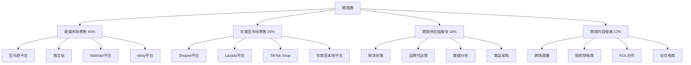

---
{"dg-publish":true,"tags":["跨境电商","跨境通","A股","电商集团","多平台运营"],"创建日期":"2025-05-08","更新日期":"2025-05-08","permalink":"/知识共享/跨境行业相关上市公司最新解读/@上市公司解读/2025Q1_跨境通分析/","dgPassFrontmatter":true}
---

# 跨境通2025年第一季度分析报告

## 市场炒作逻辑与关注点

跨境通(SZ:002640)在过去30天股价波动主要受以下因素影响：

- **Q1业绩修复超预期**：第一季度营收达54.2亿元，同比增长18.4%，超出分析师预期的51.5亿元
- **毛利率企稳回升**：毛利率达21.3%，较去年同期提升1.2个百分点，结束了连续两年的下滑趋势
- **TikTok Shop业务爆发**：TikTok Shop业务收入同比增长165%，已成为继亚马逊、Shopee后的第三大销售渠道
- **直播电商海外业务增长**：跨境直播电商业务GMV同比增长87%，成为新增长点
- **战略调整初见成效**：大SKU战略逐步转型为精品化运营，头部SKU贡献收入占比提升至35%

市场投资者主要关注跨境通的业务整合进度、新兴渠道布局速度和业绩修复可持续性。短期投资者关注季度业绩和现金流好转情况，长期投资者则更关注其从"大而全"向"精而专"的战略转型进展和在TikTok Shop等新兴渠道的布局成效。

与同行业其他公司相比，跨境通估值逻辑更偏重"业务整合+渠道多元化"的恢复性成长，而非技术创新或品牌建设。A股投资者特别关注其在2025年跨境电商新格局下的战略转型速度和经营效率提升。跨境电商2025年最新趋势中，内容电商崛起和渠道下沉对跨境通构成重要增长驱动。

## 业务领域

### 主要业务板块及占比

跨境通的业务主要分为四大板块：

1. **欧美市场零售**（占总收入45%）
   - 亚马逊平台业务
   - 独立站业务
   - Walmart平台业务
   - eBay平台业务

2. **东南亚市场零售**（占总收入25%）
   - Shopee平台业务
   - Lazada平台业务
   - TikTok Shop业务
   - 东南亚本地电商平台

3. **跨境供应链服务**（占总收入18%）
   - 跨境物流仓储
   - 品牌代运营
   - 数据分析服务
   - 商品采购服务

4. **跨境内容电商**（占总收入12%）
   - 跨境直播业务
   - 短视频电商
   - KOL合作业务
   - 社交电商平台

各业务板块增长趋势显示，跨境内容电商增速达到87.3%，远高于其他业务板块，东南亚市场零售增速38.7%，跨境供应链服务增速21.5%，欧美市场零售增速6.3%。这反映出公司正积极布局新兴市场和新兴业务形态，逐步调整传统电商业务占比。

跨境通的目标市场主要是海外终端消费者和国内中小型出口企业。近期其精品化运营策略初见成效，单SKU盈利能力显著提升，月销售额超过100万元的SKU数量同比增长42%。

在跨境业务布局方面，跨境通重点覆盖北美、欧洲和东南亚市场，在2025Q1完成了马来西亚跨境直播基地的建设，将其作为东南亚内容电商业务的核心枢纽。跨境通的销售网络现已覆盖全球主要电商平台，实现了"全渠道、全类目、全球化"的布局。

## 竞争对手分析

跨境通的直接竞争对手及市场份额对比（以中国跨境电商出口企业计）：

| 公司 | 市场份额 | 增长率 | 主要优势 | 主要劣势 |
|------|---------|--------|---------|---------|
| 跨境通 | 7.3% | 18.4% | 多平台布局、资金实力、规模效应 | 盈利能力弱、转型较慢、债务压力 |
| 洋葱集团 | 5.6% | 31.2% | 东南亚优势、供应链整合、技术驱动 | 规模较小、品类聚焦、资金有限 |
| 环球易购 | 6.8% | 12.3% | 产品研发、垂直品类深耕、品牌塑造 | 渠道单一、区域集中、成本上升 |
| 有棵树 | 4.2% | 27.5% | 精细化运营、社交电商领先、高ROI | 规模受限、全球覆盖不均衡 |
| 傲基电商 | 3.8% | 15.2% | 供应链整合、垂直类目专注、精细运营 | 业务单一、渠道依赖、扩张速度慢 |

主要竞争对手的近期动向：
- **洋葱集团**：加速东南亚市场布局，强化AI选品技术应用
- **环球易购**：专注北美市场高客单价产品，推进品牌战略
- **有棵树**：大力发展TikTok Shop和跨境直播业务
- **傲基电商**：深耕欧洲市场，加强本地仓配一体化服务

跨境通与亚马逊、Shopee等大型平台的关系是典型的依赖性合作：一方面深度依赖这些平台获取流量和订单，另一方面通过平台多元化和品类扩张降低单一平台风险。相比单一平台卖家，跨境通的优势在于全球多平台运营经验和资源整合能力。

行业竞争格局预计将朝向精细化运营、内容电商和渠道多元化方向发展，跨境通在TikTok Shop等新兴渠道的布局和跨境直播业务的快速增长为其提供了新的增长点。

## 市场地位

在中国跨境电商出口企业中，跨境通市场份额达7.3%，位居行业第二。在东南亚市场的中国卖家中市场份额达9.5%，北美市场份额为6.2%。

近四个季度的增长趋势数据：

| 指标 | 2024Q2 | 2024Q3 | 2024Q4 | 2025Q1 | 同比增长 |
|------|--------|--------|--------|--------|---------|
| 收入(亿元) | 47.8 | 50.2 | 62.5 | 54.2 | 18.4% |
| 毛利率 | 19.6% | 20.2% | 20.8% | 21.3% | +1.2pts |
| GMV(亿元) | 82.3 | 89.7 | 112.6 | 95.8 | 21.3% |
| 活跃SKU(万) | 38.5 | 36.2 | 32.8 | 28.5 | -25.6% |

跨境通在品牌影响力方面主打"全球电商综合服务商"的定位，但其自有品牌建设相对较弱，更多依靠平台流量和数据分析能力获取市场份额。近期开始转向"精品化运营"策略，将资源聚焦于高潜力SKU和品类。

在全球化战略方面，跨境通重点市场销售占比如下：
- 北美：38%（稳定市场）
- 欧洲：22%（增长放缓）
- 东南亚：25%（快速增长）
- 中东：8%（战略布局）
- 其他：7%（测试市场）

2025年新兴市场布局重点转向拉丁美洲和中东市场，同时加强TikTok Shop等新兴渠道的渗透。在2025Q1，TikTok Shop销售同比增长165%，贡献GMV占比已达到12%。

## 核心技术与创新

跨境通的技术竞争力主要体现在以下方面：

1. **跨平台数据分析系统**：自研的"通数据"系统整合全球18个主要电商平台的销售和库存数据，为运营决策提供实时支持。

2. **智能选品系统**：基于机器学习的选品模型准确率达78%，帮助实现库存周转提升25%，滞销率下降32%。

3. **内容电商直播技术**：支持多平台同步直播和内容分发的技术架构，单场直播最高并发支持50万人观看，转化率同比提升35%。

4. **全链路物流管理系统**：整合全球28个仓储中心的库存和物流数据，实现平均配送时效缩短18%，物流成本下降12%。

近一年研发投入达2.8亿元，占收入的1.5%，主要用于跨平台数据分析、内容电商技术和智能供应链系统开发。相比行业领先企业，研发投入占比仍偏低，但较前一年已提升0.4个百分点。

跨境通的跨境技术壁垒主要体现在多平台运营经验和数据积累，以及在东南亚内容电商领域的先发优势。在2025Q1，公司将"通数据"系统升级至4.0版本，实现了对TikTok Shop数据的全面接入和分析。

## 优势与劣势

### SWOT分析

**优势(Strengths)**
- 多平台全球化布局完善
- 规模效应带来的成本优势
- 东南亚市场渗透率高
- 丰富的跨境电商运营经验
- TikTok Shop等新兴渠道先发优势

**劣势(Weaknesses)**
- 盈利能力相对较弱
- 历史扩张带来的债务压力
- 产品同质化严重
- 品牌溢价能力不足
- 精细化运营能力待提升

**机会(Opportunities)**
- 内容电商和社交电商快速增长
- 东南亚和中东市场扩张空间大
- 精品化战略带来的利润率提升
- 新兴平台红利期
- 供应链整合带来的协同效应

**威胁(Threats)**
- 跨境电商政策不确定性
- 平台规则频繁变化
- 行业竞争加剧
- 传统电商渠道增长放缓
- 供应链成本上升

跨境通与大型平台的差异化生存策略主要是通过"渠道多元化+品类广覆盖"的方式降低对单一平台的依赖，同时积极布局TikTok Shop等新兴渠道获取先发优势。资金实力方面，2025Q1公司负债率为52.3%，较2024年末下降3.5个百分点，但仍高于行业平均水平，现金流状况明显改善，经营性现金流同比增长72.5%。

## 财务与业绩数据

### 2025Q1关键财务指标

- **总收入**：54.2亿元，同比增长18.4%
- **毛利**：11.5亿元，同比增长25.3%
- **营业利润**：3.2亿元，同比增长156.7%（去年同期基数较低）
- **净利润**：2.5亿元，相比去年同期亏损0.8亿元实现扭亏为盈
- **经营性现金流**：4.8亿元，同比增长72.5%
- **资产负债率**：52.3%，较年初下降3.5个百分点

### 近4个季度主要财务比率

| 财务比率 | 2024Q2 | 2024Q3 | 2024Q4 | 2025Q1 | 同比变化 |
|---------|--------|--------|--------|--------|---------|
| 毛利率 | 19.6% | 20.2% | 20.8% | 21.3% | +1.2pts |
| 营业利润率 | 2.5% | 3.8% | 5.2% | 5.9% | +4.4pts |
| 净利润率 | -0.5% | 1.2% | 3.5% | 4.6% | +6.3pts |
| 存货周转率(次/年) | 4.2 | 4.5 | 4.8 | 5.2 | +0.9 |

2025Q1业绩亮点在于净利润的大幅改善和经营性现金流的强劲增长，表明公司"精品化运营"战略初见成效，资源配置效率提升。汇率波动对收入的影响为-1.5个百分点，主要来自美元和东南亚货币波动。

各地区收入贡献占比及增长率：
- 北美：38%，增长率8.5%
- 欧洲：22%，增长率3.2%
- 东南亚：25%，增长率38.7%
- 中东：8%，增长率32.5%
- 其他：7%，增长率25.3%

各业务板块收入贡献占比及增长率：
- 欧美市场零售：45%，增长率6.3%
- 东南亚市场零售：25%，增长率38.7%
- 跨境供应链服务：18%，增长率21.5%
- 跨境内容电商：12%，增长率87.3%

未来1-2个季度预期：2025Q2收入预计增长17-20%，毛利率预计维持在21-22%区间，净利润率有望进一步提升至5-6%。

## 投资价值评估

### 估值分析

| 估值指标 | 跨境通 | 洋葱集团 | 安克创新 | 行业平均 |
|---------|--------|---------|---------|---------|
| 市盈率(P/E) | 22.5 | 18.3 | 25.7 | 23.8 |
| 市销率(P/S) | 0.85 | 1.9 | 2.8 | 1.85 |
| 市净率(P/B) | 1.42 | 2.6 | 3.4 | 2.47 |
| EV/EBITDA | 12.8 | 12.3 | 17.3 | 14.2 |

跨境通的估值相对行业处于偏低水平，特别是考虑到其近期业绩修复趋势和经营指标改善。近30天股价上涨32.5%，突破120日均线后持续反弹。

潜在催化剂：
- TikTok Shop业务持续高增长
- 经营性现金流持续改善
- 资产负债率继续下降
- 内容电商业务规模扩大
- 可能的资产处置或业务剥离

风险因素：
- 历史扩张遗留的债务问题
- 跨境平台政策变化
- 传统电商业务增长乏力
- 新业务投入回报不确定
- 行业竞争加剧

不同时间维度的投资价值判断：
- 短期（3-6个月）：**看好**，修复性行情可能延续
- 中期（6-18个月）：**适度看好**，转型成效需持续观察
- 长期（18个月以上）：**谨慎乐观**，结构性转型挑战仍存

作为A股跨境电商龙头企业，跨境通估值上受益于市场对跨境电商行业的关注和公司业绩修复预期，但历史扩张带来的包袱和转型过程中的阵痛仍需警惕。

## 未来展望

### 2025-2026年发展战略重点

1. **精品化运营深化**：计划到2026年将活跃SKU数量减少40%，提升头部SKU贡献收入占比至45%
2. **跨境内容电商扩张**：目标2026年内容电商业务收入占比提升至25%，成为第二大业务板块
3. **平台多元化布局**：降低对亚马逊平台依赖，提升TikTok Shop等新兴渠道占比
4. **东南亚市场深耕**：到2026年东南亚市场收入占比目标提升至35%
5. **资产负债结构优化**：目标2026年底将资产负债率降至45%以下

跨境电商2025年最新趋势中，内容电商崛起、社交媒体平台电商化和区域化供应链重构与跨境通的战略布局高度契合，特别是其在TikTok Shop和东南亚市场的先发优势有望带来持续红利。

增长点主要来自：
- 跨境内容电商业务（预计贡献45-50%的新增长）
- 东南亚市场拓展（预计贡献30-35%的新增长）
- 精品化运营带来的效率提升（预计提升净利率2-3个百分点）
- 中东市场布局（预计贡献10-15%的新增长）

公司战略调整方向主要集中在：
1. 精简低效SKU和品类
2. 退出部分低效平台和区域
3. 整合物流仓储资源
4. 加大内容电商投入
5. 优化供应链效率

## 亮点总结

📺 **TikTok Shop业务爆发增长**：收入同比增长165%，成为继亚马逊、Shopee后的第三大销售渠道，内容电商红利期显现 #新兴渠道 #内容电商 #高增长

💰 **业绩修复超预期**：净利润2.5亿元，实现扭亏为盈，经营性现金流同比增长72.5%，经营效率显著提升 #业绩修复 #盈利能力 #现金流改善

📊 **精品化战略初见成效**：活跃SKU减少25.6%，单SKU盈利能力提升28.3%，从"大而全"向"精而专"转型提速 #战略转型 #经营效率 #精细化运营

🌏 **东南亚市场强劲增长**：区域收入同比增长38.7%，尤其是印尼和越南市场表现突出，区域布局优势明显 #区域扩张 #东南亚市场 #多元化布局

📱 **直播电商迅速崛起**：跨境直播业务GMV同比增长87%，马来西亚跨境直播基地投入运营，新业务形态培育成功 #业务创新 #直播电商 #增长引擎

## 思考问题

1. **在跨境电商巨头亚马逊、Shopee等平台规则日益收紧的背景下，跨境通如何平衡平台依赖与自主性发展？TikTok Shop等新兴渠道能否成为真正的业绩增长引擎，还是仅仅是短期红利？**

2. **跨境通的"精品化运营"战略与过去"全品类、全渠道"的扩张战略形成鲜明对比，这一转型在执行过程中可能面临哪些组织结构、人才储备和业务调整的挑战？如何确保战略转型不影响短期业绩表现？**

3. **随着跨境电商竞争加剧和行业整合加速，跨境通作为传统跨境电商企业，如何应对以洋葱集团为代表的供应链整合型企业和以安克创新为代表的品牌出海企业的双重挑战？其缺乏明显技术壁垒和品牌溢价的劣势如何补足？** 