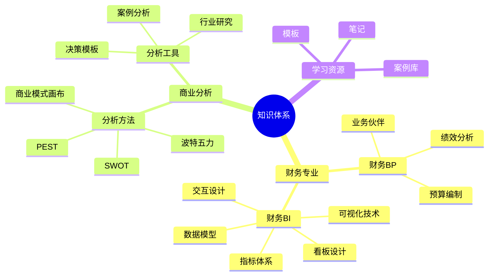

---
{"dg-publish":true,"dg-home":true,"cssclass":"homepage","permalink":"/知识共享/首页/","tags":["gardenEntry"],"dgPassFrontmatter":true}
---

# 🌟 Victor的财务与商业分析知识花园

> [!quote] 思考
> 财务不仅是数字的艺术，更是商业洞察的源泉。通过系统性思考和分析，我们能够揭示业务运营背后的真相，为决策提供坚实基础。

## 💼 财务专业

> [!tip]+ 财务BP专区
> - [[知识共享/001_财务/01_财务BP/目录\|🔍 财务BP学习导航]]
> - [[知识共享/001_财务/01_财务BP/04_模板/01_分析框架/财务BP分析框架模板\|📊 财务模型工具箱]]
> - [[知识共享/001_财务/01_财务BP/03_案例/综合案例/案例1-财务BP作用与目标\|📝 财务BP案例分析]]
> - [[知识共享/001_财务/01_财务BP/02_笔记/01_概念速查/財務BP核心概念速查\|🧮 财务笔记和知识]]

> [!tip]+ 财务BI看板
> - [[知识共享/001_财务/02_财务BI看板项目/目录\|📈 财务BI看板总览]]
> - [[001_财务/02_财务BI看板项目/指标体系/指标计算公式库\|📉 财务指标体系]]
> - [[001_财务/02_财务BI看板项目/设计稿/看板设计/核心看板模块/财务概览看板设计\|📊 财务概览看板]]

## 📊 商业分析

> [!tip]+ 核心方法论
> - [[知识共享/002_商业分析/04_模板/01_分析框架/SWOT分析模板\|🔄 SWOT分析法]]
> - [[知识共享/002_商业分析/04_模板/01_分析框架/PEST分析模板\|🌍 PEST分析]]
> - [[知识共享/002_商业分析/04_模板/01_分析框架/波特五力分析模板\|⚔️ 波特五力模型]]
> - [[知识共享/002_商业分析/01_学习内容/06_商业模式分析/6.1 商业模式画布\|🎨 商业模式画布]]
> - [[知识共享/002_商业分析/01_学习内容/03_分析方法与工具/3.1 描述性分析方法\|🔍 描述性分析方法]]

> [!tip]+ 决策支持工具
> - [[知识共享/002_商业分析/04_模板/04_决策支持/产品决策分析框架\|🎯 产品决策分析框架]]
> - [[知识共享/002_商业分析/04_模板/04_决策支持/资源配置决策模板\|📋 资源配置决策模板]]
> - [[知识共享/002_商业分析/04_模板/04_决策支持/风险决策分析模板\|⚠️ 风险决策分析模板]]
> - [[知识共享/002_商业分析/04_模板/04_决策支持/战略调整决策模板\|🧠 战略调整决策模板]]
> - [[知识共享/002_商业分析/04_模板/04_决策支持/投资回报分析模板\|💰 投资回报分析模板]]

## 🔍 知识导航

## 📚 学习资源

> [!note]+ 商业分析与决策支持 
> - [[知识共享/002_商业分析/商业分析学习目录\|📚 商业分析学习目录]]
> - [[知识共享/002_商业分析/03_案例/01_行业案例/电商行业数据分析案例\|🏭 案例库]]

> [!note]+ 财务专业知识
> - [[知识共享/001_财务/01_财务BP/目录\|📆 财务BP学习区]]
> - [[知识共享/001_财务/01_财务BP/目录\|📊 财务专业知识库]]
> - [[知识共享/001_财务/02_财务BI看板项目/目录\|📈 数据可视化专区]]

## 🔄 最近更新

| 日期 | 内容 | 分类 |
|------|------|------|
| 2024-05-03 | [[知识共享/001_财务/01_财务BP/04_模板/02_报告/财务预测报告模板\|财务预测报告模板]] | 报告模板 |
| 2024-04-27 | [[知识共享/002_商业分析/04_模板/04_决策支持/风险决策分析模板\|风险决策分析模板]] | 决策支持 |

---

## ☕ 支持我的工作

如果您觉得这些内容对您有所帮助，可以通过以下方式支持我继续创作更多高质量内容：

<a href="https://www.buymeacoffee.com/yourname" target="_blank">☕ Buy Me A Coffee</a> | 
<a href="https://ko-fi.com/yourname" target="_blank">🧋 Ko-fi</a> | 
<a href="https://www.patreon.com/yourname" target="_blank">💝 Patreon</a> | 
<a href="https://paypal.me/yourname" target="_blank">💵 PayPal</a>

> [!info] 关于本知识库
> 这个知识库采用数字花园的形式组织，内容会不断更新和完善。您可以从上面的导航链接开始探索，或者使用Obsidian的搜索功能查找特定内容。
> 
> [[关于我\|👨‍💼 关于我]] | [[联系方式\|📞 联系方式]] | [[版权说明\|©️ 版权说明]]
